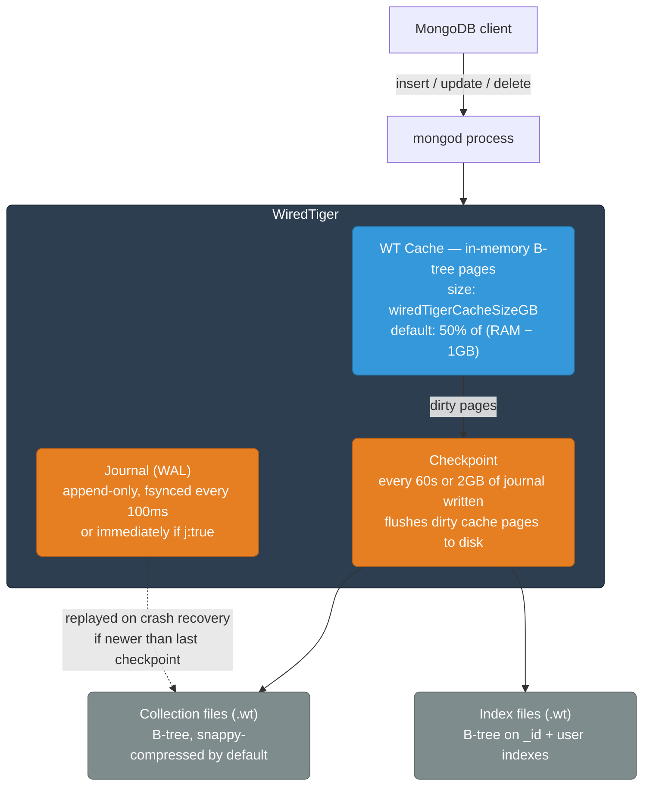
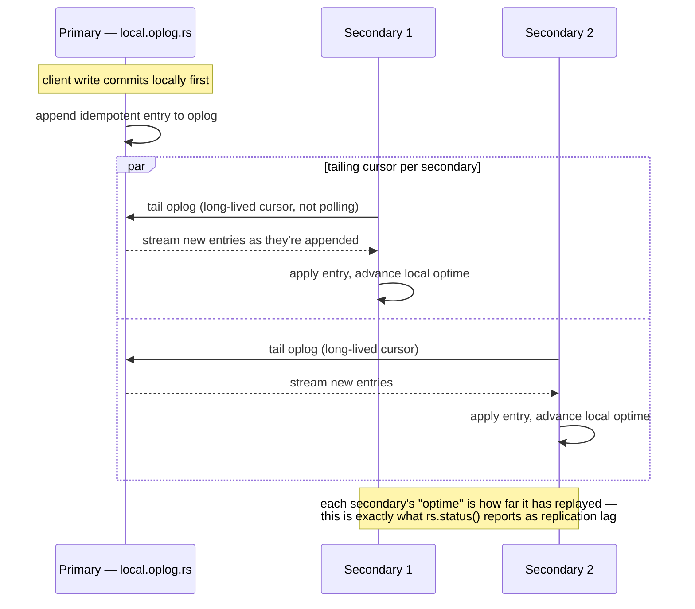
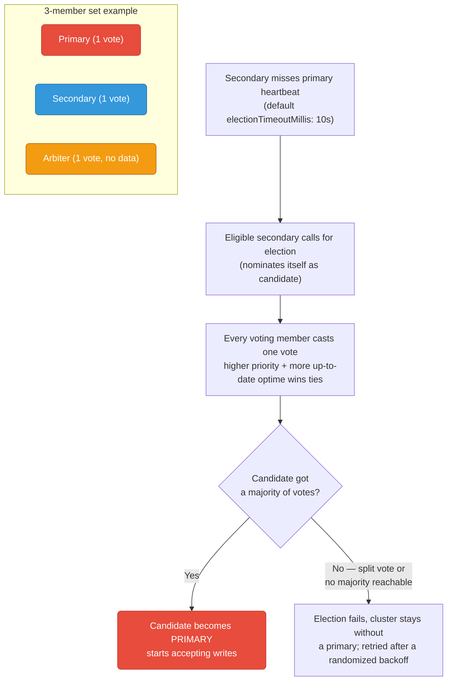
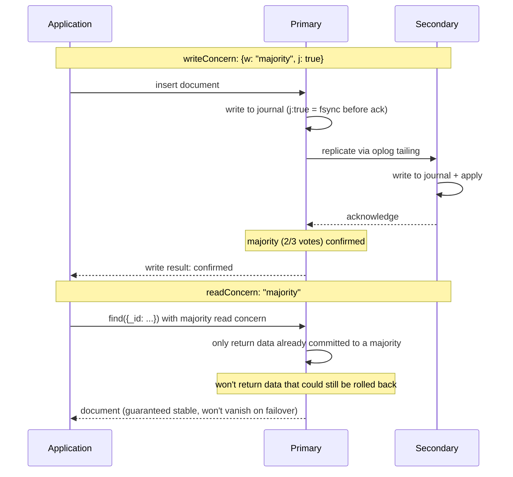
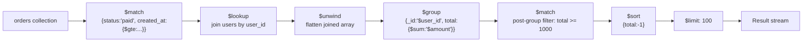
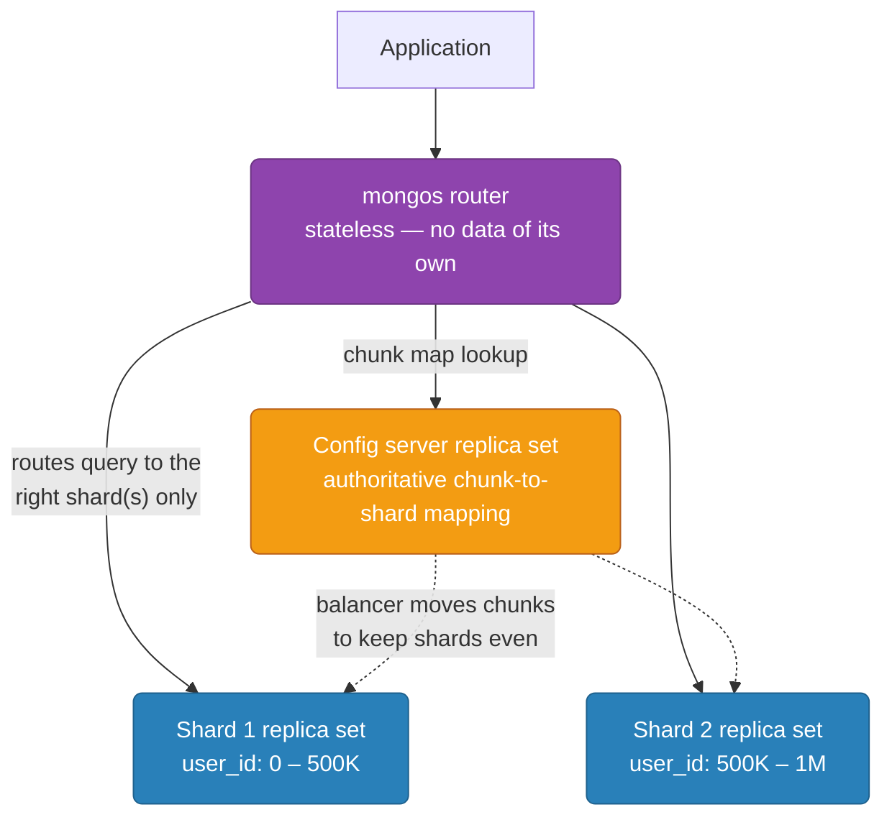

# MongoDB Internals

How MongoDB actually stores, replicates, and serves documents underneath `mongosh` — the storage engine, the oplog, how an election really resolves, and the write-concern arithmetic that decides whether a failover loses data. For the operational side of running this on real VMs (firewall rules, `mongod.conf`, the Prometheus exporter, a step-by-step bootstrap), see [on-prem-vm/mongodb.md](../on-prem-vm/mongodb.md); for the Kubernetes-operator version, see [on-prem-k8s/mongodb.md](../on-prem-k8s/mongodb.md).

<div class="quiz-progress" data-quiz-progress>
  <span class="quiz-progress-label">0/0 checks</span>
  <span class="quiz-progress-bar"><span class="quiz-progress-fill"></span></span>
</div>

---

## WiredTiger Storage Engine

Every write goes through the same three structures, whether it's a single `insertOne` or a bulk load:



The journal and the checkpoint solve two different failure windows. A crash between checkpoints only loses what's replayable from the journal — that's why the journal is fsynced far more often (100ms) than a full checkpoint runs (60s). Without the journal, a crash mid-checkpoint could lose everything written since the *previous* checkpoint, not just the last 100ms.

<div class="quiz-card">
  <p class="quiz-q">mongod crashes 30 seconds after the last checkpoint, with the journal enabled. How much data is lost?</p>
  <button class="quiz-reveal">Reveal answer</button>
  <div class="quiz-a" hidden>None, assuming the journal itself synced. On restart, WiredTiger replays journal entries written after the last checkpoint to bring the data files back up to date. The checkpoint is a durability <em>floor</em>, not a durability <em>ceiling</em> — the journal covers everything since.</div>
</div>

### Sizing the cache

<div class="stepper">
  <div class="stepper-panels">
    <div class="stepper-panel active">
      <strong>1. Start from total RAM.</strong> A dedicated MongoDB host with 32 GB RAM is the baseline for this example.
    </div>
    <div class="stepper-panel">
      <strong>2. Apply roughly 40–50% of RAM, not the raw default.</strong> WiredTiger's own default is <code>(RAM − 1GB) × 0.5</code>, but on a real production host you also want headroom for per-connection memory (allocated <em>outside</em> the WiredTiger cache) and the OS page cache. 32 GB → <code>cacheSizeGB: 12–14</code> is a safer starting point than the raw default.
    </div>
    <div class="stepper-panel">
      <strong>3. Watch eviction, not just hit ratio.</strong> <code>db.serverStatus().wiredTiger.cache</code> exposes <em>"pages evicted because they exceeded the in-memory maximum"</em> and <em>"tracked dirty bytes in the cache."</em> Rising eviction under normal load means the cache is undersized for the working set.
    </div>
    <div class="stepper-panel">
      <strong>4. Never approach 100% of RAM.</strong> A saturated WiredTiger cache starves the OS page cache — which is what makes oplog reads and secondary catch-up fast — and starves per-connection buffers, which live outside WiredTiger entirely. The result is worse than a smaller, stable cache: constant eviction pressure and possible swapping.
    </div>
  </div>
  <div class="stepper-controls">
    <button class="stepper-prev">← Prev</button>
    <span class="stepper-dots"></span>
    <span class="stepper-label"></span>
    <button class="stepper-next">Next →</button>
  </div>
</div>

<div class="quiz-card">
  <p class="quiz-q">A host has 64 GB RAM. Someone sets cacheSizeGB: 60 to "maximize" MongoDB's cache. What breaks in production?</p>
  <button class="quiz-reveal">Reveal answer</button>
  <div class="quiz-a" hidden>Only 4 GB is left for the OS, the filesystem page cache, and per-connection memory — which MongoDB allocates outside WiredTiger. The page cache is what makes secondary catch-up and repeated reads fast; starve it and every cache miss goes straight to disk. Under real connection load the host can start swapping, which turns into severe, hard-to-diagnose latency spikes. ~50% of RAM is the practical ceiling, not a floor to push past.</div>
</div>

---

## Document Model and BSON

MongoDB stores documents as BSON (Binary JSON), not JSON text:

```
BSON document: {_id: ObjectId("..."), name: "Alice", age: 30}

Binary encoding:
[doc_length 4B][type 1B][key "name\0"][value "Alice"][type 1B][key "age\0"][value 30 4B]...[terminator 0x00]
```

**Why BSON, not JSON:** the length-prefixed encoding means WiredTiger (and any driver) can skip over a field without parsing its contents — it just reads the 4-byte length and jumps. BSON also has native types JSON lacks: `Date`, `ObjectId`, `Binary`, `Decimal128` — a JSON encoding would have to represent all of these as strings and lose type fidelity.

**ObjectId** is 12 bytes: 4-byte timestamp + 5-byte random value + 3-byte incrementing counter. That construction is deliberate — it's sortable by creation time, globally unique without a central sequence generator, and safe to generate on any node (including offline clients) without coordination.

<div class="quiz-card">
  <p class="quiz-q">Two documents are inserted from different application servers within the same second, with no shared database sequence. Why don't their ObjectIds collide?</p>
  <button class="quiz-reveal">Reveal answer</button>
  <div class="quiz-a" hidden>The 5-byte random value component makes a collision astronomically unlikely even without coordination between the two servers, and the 3-byte counter (per-process, incrementing) further guarantees uniqueness for IDs generated in rapid succession on the same process. No central authority or round-trip to the database is needed to generate a safe ID.</div>
</div>

---

## Replication: Oplog, Elections &amp; Quorum

### The oplog

The oplog is a capped collection in the `local` database (`local.oplog.rs`). Every write on the primary is recorded as an **idempotent** operation — replaying the same oplog entry twice produces the same result, which is what makes replica catch-up and resync safe to retry.



**Op types:** `i` (insert), `u` (update), `d` (delete), `c` (command — `createCollection`, `dropCollection`), `n` (no-op / keepalive, also used to fill in a stable point for chained replication).

**Oplog window:** capped at a fixed size — default 5% of disk space, minimum ~1 GB. If a secondary falls behind by more than the oplog window (its next needed entry has already rolled off), it can no longer catch up incrementally and must perform a full initial resync instead.

<div class="quiz-card">
  <p class="quiz-q">A secondary was network-partitioned for 6 hours. The primary's oplog only covers the last 4 hours of writes at current write volume. What happens when the secondary reconnects?</p>
  <button class="quiz-reveal">Reveal answer</button>
  <div class="quiz-a" hidden>The secondary can't resume incremental replication — the oplog entry it needs next has already been overwritten (the oplog is a capped collection). MongoDB falls back to a full initial sync: wipe the secondary's data directory and copy everything from the primary from scratch. This is exactly why oplog size should be set generously relative to expected downtime windows, not just current write volume.</div>
</div>

### Elections and quorum

A replica set elects a primary by majority vote among voting members. An **arbiter** is a voting member that holds no data — it exists purely to break ties cheaply, without paying for a full extra data copy.



**Why votes ≠ data copies:** an arbiter's vote counts exactly the same as a data-bearing secondary's vote when computing whether a write reached `w: "majority"`, or whether an election has a quorum — but it holds zero bytes of actual data. A 3-member Primary-Secondary-Arbiter (PSA) set only needs 2 of 3 votes to elect a new primary or acknowledge a majority write, and primary + arbiter alone satisfies that majority — even though the arbiter can never *serve* that data if the primary then dies.

<div class="toggle-switch">
  <div class="toggle-buttons">
    <button data-toggle-opt="psa" class="active state-warn">PSA (Primary-Secondary-Arbiter)</button>
    <button data-toggle-opt="pss" class="state-ok">PSS (Primary-Secondary-Secondary)</button>
  </div>
  <div class="toggle-panel active" data-toggle-panel="psa">
    3 voting members, only 2 hold data. Cheaper to run (the arbiter needs almost no resources), and still gets majority-write durability in the common case. The gap: if the primary and arbiter both acknowledge a write but the secondary hasn't replicated it yet, and the primary then dies, that write is gone — the arbiter has no copy to hand to a new primary.
  </div>
  <div class="toggle-panel" data-toggle-panel="pss">
    3 voting members, all 3 hold data. Costs a full third data copy, but a majority write is guaranteed to exist on at least 2 real copies at all times — there's no "phantom vote" scenario. This is the safer topology when write durability matters more than infrastructure cost.
  </div>
</div>

<div class="quiz-card">
  <p class="quiz-q">In a PSA set, the secondary is temporarily unreachable. A write arrives at the primary with w: "majority". Does it succeed, and is it fully safe?</p>
  <button class="quiz-reveal">Reveal answer</button>
  <div class="quiz-a" hidden>It succeeds — primary + arbiter is 2 of 3 votes, a majority, so w:"majority" is satisfied without the secondary. But "acknowledged" isn't the same as "safely durable on a second copy": the arbiter holds no data, so this write exists only on the primary. If the primary crashes before the secondary reconnects and catches up, that write is lost. This exact gap is the tradeoff of PSA vs. PSS.</div>
</div>

### Try It Yourself: Live PSA Election

This is a different election model than the Raft demo elsewhere in this repo
([replication.md](replication.md)) — worth being precise about the
difference rather than treating "leader election" as one interchangeable
mechanic. Raft's demo picks whichever node happens to time out first and
wins purely on term number and majority; the first candidate to campaign
wins as long as its log qualifies. MongoDB's election is **priority-weighted**:
each member has a configured `priority` (default 1, arbiters always 0), a
member only calls an election after missing heartbeats for
`electionTimeoutMillis` (default 10s), and a higher-priority secondary that
is otherwise healthy can trigger its own election and take over from a
lower-priority primary even with no failure at all — a "priority takeover,"
not just a race to time out first. The demo below models that, plus the PSA
topology's specific risk: an **arbiter** votes but holds no data and can
never itself become primary.

Default topology is PSA: `P1` (priority 1, data), `S1` (priority 1, data,
starts as PRIMARY), `A1` (arbiter — priority 0, no data). Click any node to
kill or revive it, use "Kill Primary" to force a failover, or add a
differently-prioritized secondary and watch it take over. Majority here is
computed against the full configured voting membership (not just currently
up nodes) — this is what makes the risk case below possible: kill the
arbiter, then kill either remaining data node, and the cluster has only 1
of 3 votes left and cannot elect anyone.

<div class="structure-viz" id="mongo-election-viz">
  <svg class="viz-canvas" viewBox="0 0 640 170"></svg>
  <div class="viz-controls">
    <button class="viz-btn viz-btn-danger" data-viz-action="kill-primary">Kill Primary</button>
    <input class="viz-input" type="text" placeholder="node name" data-viz-field="name" style="width:6rem" />
    <input class="viz-input" type="number" placeholder="priority" data-viz-field="priority" style="width:5rem" />
    <button class="viz-btn" data-viz-action="add">Add Node</button>
    <button class="viz-btn" data-viz-action="reset">Reset</button>
  </div>
  <div class="viz-status"></div>
  <div class="viz-legend">
    <span><span class="viz-swatch" style="background:#14532d"></span> Primary</span>
    <span><span class="viz-swatch" style="background:#1e3a8a"></span> Secondary (up)</span>
    <span><span class="viz-swatch" style="background:#7f1d1d"></span> Down</span>
    <span><span class="viz-swatch" style="background:#f39c12"></span> Arbiter (diamond, no data)</span>
    <span>Click any node box to kill/revive it.</span>
  </div>
</div>

<script>
(function () {
  const svgNS = 'http://www.w3.org/2000/svg';
  const root0 = document.getElementById('mongo-election-viz');
  const svg = root0.querySelector('.viz-canvas');
  const status = root0.querySelector('.viz-status');
  const nameField = root0.querySelector('[data-viz-field="name"]');
  const priorityField = root0.querySelector('[data-viz-field="priority"]');

  let nodes;

  // ---- Core election logic (no DOM) --------------------------------------
  // Mirrors this section's own narration: priority-weighted election (the
  // highest-priority ELIGIBLE data-bearing node wins, not just any majority
  // winner), majority computed over ALL configured voting members (alive or
  // not — this is what makes the PSA risk below possible), and the arbiter
  // can vote but can never itself become primary.

  function makeInitialNodes() {
    return [
      { id: 'P1', priority: 1, hasData: true, isArbiter: false, alive: true, isPrimary: false },
      { id: 'S1', priority: 1, hasData: true, isArbiter: false, alive: true, isPrimary: true },
      { id: 'A1', priority: 0, hasData: false, isArbiter: true, alive: true, isPrimary: false },
    ];
  }

  function eligibleCandidates(list) {
    return list.filter((n) => n.hasData && n.alive);
  }

  function pickCandidate(eligible) {
    if (!eligible.length) return null;
    return eligible.slice().sort((a, b) => b.priority - a.priority || a.id.localeCompare(b.id))[0];
  }

  function majorityNeeded(list) {
    return Math.floor(list.length / 2) + 1;
  }

  function evaluate(list) {
    const total = list.length;
    const majority = majorityNeeded(list);
    const aliveCount = list.filter((n) => n.alive).length;
    const eligible = eligibleCandidates(list);
    const messages = [];

    if (eligible.length === 0) {
      list.forEach((n) => { n.isPrimary = false; });
      messages.push('No data-bearing node is up — no eligible candidate, no primary.');
      return { messages, primaryId: null };
    }

    messages.push('Eligible: ' + eligible.map((n) => n.id + ' (priority ' + n.priority + ')').join(', ') + '.');

    if (aliveCount < majority) {
      list.forEach((n) => { n.isPrimary = false; });
      let m = 'Only ' + aliveCount + ' voter(s) alive (need ' + majority + ' for majority of ' + total + ') — cluster cannot elect a primary.';
      const arbiter = list.find((n) => n.isArbiter);
      if (arbiter && !arbiter.alive) {
        m += ' This is the PSA topology risk this file describes: losing the arbiter plus one data node loses you majority entirely.';
      }
      messages.push(m);
      return { messages, primaryId: null };
    }

    const current = list.find((n) => n.isPrimary && n.alive && n.hasData);
    let candidate;
    let isTakeover = false;

    if (current) {
      const outranking = eligible.filter((n) => n.priority > current.priority);
      if (outranking.length === 0) {
        messages.push(current.id + ' remains PRIMARY (' + aliveCount + '/' + total + ' votes available).');
        return { messages, primaryId: current.id };
      }
      candidate = pickCandidate(outranking);
      isTakeover = true;
    } else {
      candidate = pickCandidate(eligible);
    }

    const arbiter = list.find((n) => n.isArbiter);
    if (arbiter && arbiter.alive && candidate.id !== arbiter.id) {
      messages.push('Arbiter ' + arbiter.id + ' votes for ' + candidate.id + '.');
    }
    list.forEach((n) => { n.isPrimary = n.id === candidate.id; });
    if (isTakeover) {
      messages.push(candidate.id + ' (priority ' + candidate.priority + ') outranks current primary ' + current.id + ' (priority ' + current.priority + ') — priority takeover. ' + candidate.id + ' has ' + aliveCount + '/' + total + ' votes, majority reached, ' + candidate.id + ' becomes PRIMARY.');
    } else {
      messages.push(candidate.id + ' has ' + aliveCount + '/' + total + ' votes — majority reached, ' + candidate.id + ' becomes PRIMARY.');
    }
    return { messages, primaryId: candidate.id };
  }

  function killPrimaryAction(list) {
    const primary = list.find((n) => n.isPrimary && n.alive);
    if (!primary) {
      return { messages: ['No primary is currently alive — nothing to kill.'], ok: false };
    }
    primary.alive = false;
    primary.isPrimary = false;
    const msgs = [primary.id + ' (Primary) down.'];
    const res = evaluate(list);
    return { messages: msgs.concat(res.messages), ok: res.primaryId !== null };
  }

  function toggleNodeAction(list, id) {
    const node = list.find((n) => n.id === id);
    if (!node) return { messages: ['No node named ' + id + '.'], ok: false };
    node.alive = !node.alive;
    if (!node.alive) node.isPrimary = false;
    const msgs = [node.id + (node.isArbiter ? ' (arbiter)' : '') + ' ' + (node.alive ? 'revived' : 'killed') + '.'];
    const res = evaluate(list);
    return { messages: msgs.concat(res.messages), ok: res.primaryId !== null };
  }

  function addNodeAction(list, name, priority) {
    if (!name || !/^[A-Za-z0-9_-]+$/.test(name)) {
      return { messages: ['Enter a valid node name (letters, digits, -, _).'], ok: false };
    }
    if (list.some((n) => n.id === name)) {
      return { messages: ['A node named ' + name + ' already exists.'], ok: false };
    }
    if (!Number.isFinite(priority) || priority < 0) {
      return { messages: ['Priority must be a non-negative number.'], ok: false };
    }
    list.push({ id: name, priority: priority, hasData: true, isArbiter: false, alive: true, isPrimary: false });
    const msgs = [name + ' added as secondary (priority ' + priority + ', data-bearing).'];
    const res = evaluate(list);
    return { messages: msgs.concat(res.messages), ok: res.primaryId !== null };
  }

  // ---- Rendering -----------------------------------------------------------

  function setStatus(msg, kind) {
    status.textContent = msg;
    status.className = 'viz-status' + (kind === 'ok' ? ' viz-status-ok' : kind === 'error' ? ' viz-status-error' : '');
  }

  function el(tag, attrs) {
    const e = document.createElementNS(svgNS, tag);
    for (const k in attrs) e.setAttribute(k, attrs[k]);
    return e;
  }

  function text(x, y, str, cls) {
    const t = el('text', cls ? { x: x, y: y, class: cls } : { x: x, y: y });
    t.textContent = str;
    return t;
  }

  function draw() {
    while (svg.firstChild) svg.removeChild(svg.firstChild);
    const n = nodes.length;
    const boxW = Math.max(80, Math.min(120, Math.floor((640 - (n + 1) * 16) / n)));
    const boxH = 100;
    const gap = Math.floor((640 - n * boxW) / (n + 1));
    const y = 30;

    nodes.forEach((node, i) => {
      const x = gap + i * (boxW + gap);
      const cx = x + boxW / 2;
      const cy = y + boxH / 2;

      let cls = 'viz-node';
      if (!node.alive) cls = 'viz-node-removing';
      else if (node.isPrimary) cls = 'viz-node-new';

      const g = el('g', { style: 'cursor:pointer' });
      g.addEventListener('click', () => {
        const res = toggleNodeAction(nodes, node.id);
        setStatus(res.messages.join(' '), res.ok ? 'ok' : (res.messages.join(' ').indexOf('cannot elect') >= 0 ? 'error' : 'ok'));
        draw();
      });

      if (node.isArbiter) {
        const points = [
          [cx, y],
          [x + boxW, cy],
          [cx, y + boxH],
          [x, cy],
        ].map((p) => p[0] + ',' + p[1]).join(' ');
        g.appendChild(el('polygon', { points: points, class: cls }));
      } else {
        g.appendChild(el('rect', { x: x, y: y, width: boxW, height: boxH, rx: 8, class: cls }));
      }

      g.appendChild(text(cx, cy - 26, node.id));
      if (node.isArbiter) {
        g.appendChild(text(cx, cy - 8, 'ARBITER', 'viz-label-dim'));
        g.appendChild(text(cx, cy + 6, 'no data', 'viz-label-dim'));
      } else {
        g.appendChild(text(cx, cy - 8, 'priority ' + node.priority, 'viz-label-dim'));
      }
      g.appendChild(text(cx, cy + 24, !node.alive ? 'DOWN' : (node.isPrimary ? 'PRIMARY' : 'secondary')));

      svg.appendChild(g);
    });
  }

  root0.querySelector('[data-viz-action="kill-primary"]').addEventListener('click', () => {
    const res = killPrimaryAction(nodes);
    const joined = res.messages.join(' ');
    setStatus(joined, res.ok ? 'ok' : 'error');
    draw();
  });

  root0.querySelector('[data-viz-action="add"]').addEventListener('click', () => {
    const name = nameField.value.trim();
    const priority = parseInt(priorityField.value, 10);
    const res = addNodeAction(nodes, name, priority);
    const joined = res.messages.join(' ');
    const failed = /Enter a valid|already exists|must be a non-negative/.test(joined);
    setStatus(joined, failed ? 'error' : (res.ok ? 'ok' : 'error'));
    if (!failed) { nameField.value = ''; priorityField.value = ''; }
    draw();
  });

  root0.querySelector('[data-viz-action="reset"]').addEventListener('click', () => {
    nodes = makeInitialNodes();
    setStatus('Reset to the default PSA set: P1 (priority 1), S1 (priority 1, PRIMARY), A1 (arbiter, no data).', '');
    draw();
  });

  nodes = makeInitialNodes();
  setStatus('PSA set loaded: P1 (priority 1), S1 (priority 1, PRIMARY), A1 (arbiter, no data, votes but never becomes primary). Click a node to kill/revive it, or use Kill Primary to force a failover.', '');
  draw();
})();
</script>

### Rollback on rejoin

If the old primary had writes that were never replicated to any secondary before it crashed, and a new primary was elected and continued accepting new writes, the two oplogs have diverged. When the old primary rejoins as a secondary, MongoDB **rolls back** its un-replicated writes — moving them out to a rollback directory as BSON files rather than silently discarding them — so it can resync onto the new primary's oplog history.

<div class="quiz-card">
  <p class="quiz-q">After a rollback, where do the discarded writes actually go, and how would you recover one if it turned out to matter?</p>
  <button class="quiz-reveal">Reveal answer</button>
  <div class="quiz-a" hidden>They're written out as BSON files under the data directory's rollback folder — not deleted outright. An operator can inspect them (e.g. with bsondump) and manually replay any writes that need to be recovered. The best fix, though, is prevention: requiring w:"majority" before acknowledging a write to the client means a write can't be "confirmed" to an application unless it already exists on enough copies to survive exactly this scenario.</div>
</div>

---

## Write Concern and Read Concern — Deep Dive

Write concern controls how many replica set members must acknowledge a write before the client is told it succeeded. Getting this wrong is the single most common cause of "the failover ate my data."



<div class="tab-group">
  <div class="tab-buttons">
    <button data-tab="w0" class="active">w: 0</button>
    <button data-tab="w1">w: 1</button>
    <button data-tab="wmaj">w: "majority"</button>
  </div>
  <div class="tab-panels">
    <div class="tab-panel active" data-tab-panel="w0">
      <strong>Fire and forget.</strong> mongod returns immediately without waiting for any acknowledgement — not even from the primary's own in-memory buffer. Maximum throughput. Fine for metrics/logs/events where losing a few is acceptable; never for financial, user, or transactional data.
    </div>
    <div class="tab-panel" data-tab-panel="w1">
      <strong>Primary only (default before MongoDB 5.0).</strong> Fastest option that still confirms the write landed somewhere. Risk: if the primary crashes before replicating to any secondary, the write is lost — whichever secondary gets elected next never had it.
    </div>
    <div class="tab-panel" data-tab-panel="wmaj">
      <strong>Majority of voting members (recommended).</strong> At least 2 of 3 votes must acknowledge before the client sees success. If the primary then fails, whoever gets elected next already has the data. One extra round-trip of latency, in exchange for a durability guarantee that survives failover.
    </div>
  </div>
</div>

| Write concern | Data loss on failover | Latency |
|---|---|---|
| `{w: 0}` | Yes, silently | Lowest |
| `{w: 1}` | Yes, if only the primary had it | Low |
| `{w: "majority"}` | No | +1 replica round-trip |
| `{w: "majority", j: true}` | No, and disk-durable | Highest |

<div class="quiz-card">
  <p class="quiz-q">Why does pairing w: "majority" with j: true matter, when majority already implies more than one copy exists?</p>
  <button class="quiz-reveal">Reveal answer</button>
  <div class="quiz-a" hidden>"Majority" is about how many <em>members</em> acknowledged, not whether each one's copy actually hit disk. Without j:true, a member could acknowledge a write that's still only in its in-memory WiredTiger cache — if that specific member then crashes before its next journal fsync, its copy of the "acknowledged, majority-confirmed" write is gone too. j:true forces the journal fsync before acknowledging, closing that gap.</div>
</div>

---

## Aggregation Pipeline

An aggregation is a sequence of stages, each one transforming the document stream from the previous stage:



<div class="stepper">
  <div class="stepper-panels">
    <div class="stepper-panel active">
      <strong>1. Early $match.</strong> Filtering before anything else shrinks the document set every later stage has to process — and, critically, an early $match can use an index the same way a normal find() would. A $match placed after other stages can't.
    </div>
    <div class="stepper-panel">
      <strong>2. $lookup + $unwind.</strong> $lookup joins in an array of matching documents from another collection (like a left outer join); $unwind flattens that array back into one document per match so later stages can treat it as a flat field.
    </div>
    <div class="stepper-panel">
      <strong>3. $group.</strong> Collapses many documents into one per group key, computing accumulators ($sum, $avg, $push, ...) along the way. This is usually the point where the pipeline stops being index-eligible — the output no longer resembles the original documents.
    </div>
    <div class="stepper-panel">
      <strong>4. Post-group $match, $sort, $limit.</strong> Filtering and sorting on computed fields (like the group's total) has to happen after $group produces them — there's no index to use here since these are runtime-computed values.
    </div>
  </div>
  <div class="stepper-controls">
    <button class="stepper-prev">← Prev</button>
    <span class="stepper-dots"></span>
    <span class="stepper-label"></span>
    <button class="stepper-next">Next →</button>
  </div>
</div>

```javascript
db.orders.aggregate([
    {$match:  {status:"paid", created_at:{$gte: new Date("2024-01-01")}}},  // filter early, index-eligible
    {$lookup: {from:"users", localField:"user_id", foreignField:"_id", as:"user"}},
    {$unwind: "$user"},
    {$group:  {_id:"$user_id", total:{$sum:"$amount"}, count:{$sum:1}}},
    {$match:  {total:{$gte:1000}}},   // post-group filter, no index available here
    {$sort:   {total:-1}},
    {$limit:  100},
    {$project:{_id:0, user_id:"$_id", total:1, count:1}}
], {allowDiskUse: true})   // needed once an intermediate stage's working set exceeds 100MB RAM
```

`explain('executionStats')` on an aggregation shows exactly which stages used an index (`IXSCAN`) versus a full scan — the same distinction as a plain `find()`.

<div class="quiz-card">
  <p class="quiz-q">Why can't the $match after $group in the pipeline above use an index, even though there's an index on total?</p>
  <button class="quiz-reveal">Reveal answer</button>
  <div class="quiz-a" hidden>Trick question — there's no index on total to begin with, because total doesn't exist until $group computes it. Indexes are built on stored document fields, not on values synthesized mid-pipeline. Any $match, $sort, or $limit placed after a $group that references a computed field always runs unindexed.</div>
</div>

---

## Index Types

```javascript
// Standard B-tree
db.users.createIndex({email: 1})                    // ascending
db.users.createIndex({email: 1, status: 1})         // compound
db.users.createIndex({email: 1}, {unique: true})    // unique

// Partial index — only indexes matching documents, smaller and faster
db.users.createIndex({email: 1}, {
    partialFilterExpression: {deleted: {$exists: false}}
})

// TTL index — auto-deletes documents N seconds after createdAt
db.sessions.createIndex({createdAt: 1}, {expireAfterSeconds: 3600})

// Text index — full-text search
db.posts.createIndex({body: "text", title: "text"})
db.posts.find({$text: {$search: "kubernetes failover"}})

// Geospatial
db.locations.createIndex({coords: "2dsphere"})
db.locations.find({coords: {$near: {$geometry: {type:"Point", coordinates:[77.2,28.6]}, $maxDistance: 1000}}})
```

<div class="quiz-card">
  <p class="quiz-q">A TTL index is set with expireAfterSeconds: 3600 on a field called createdAt. A background job deletes stale sessions after exactly 60 minutes, right on the second. Is that guaranteed?</p>
  <button class="quiz-reveal">Reveal answer</button>
  <div class="quiz-a" hidden>No. TTL deletion runs via a background thread that sweeps expired documents roughly once every 60 seconds, not instantly at the expiry timestamp — so documents can live up to ~1 minute past their nominal expiry. TTL indexes are for eventual cleanup, not a precise expiry guarantee; don't rely on them for time-sensitive access-control logic.</div>
</div>

---

## explain() — Query Analysis

```javascript
// Find execution plan
db.orders.find({user_id: "123", status: "paid"}).explain("executionStats")
// winningPlan.stage: "COLLSCAN" = full scan (bad) | "IXSCAN" = index (good)
// executionStats.totalDocsExamined vs totalDocsReturned: large ratio = missing index

// Compound index matching the query shape
db.orders.createIndex({user_id: 1, status: 1})

// Covering index: every projected field is in the index itself — zero document fetches
db.orders.createIndex({user_id: 1, status: 1, amount: 1})
db.orders.find({user_id: "123"}, {status: 1, amount: 1, _id: 0})
// explain shows "Using index" — no heap/document reads at all
```

<div class="quiz-card">
  <p class="quiz-q">explain() shows totalDocsExamined: 50,000 and totalDocsReturned: 12 for a query that IS using an index (IXSCAN, not COLLSCAN). Is that fine?</p>
  <button class="quiz-reveal">Reveal answer</button>
  <div class="quiz-a" hidden>Not necessarily — a high examined-to-returned ratio even under IXSCAN usually means the index doesn't fully match the query's filter, so MongoDB is index-scanning a broad range and then filtering most of it out after fetching. The fix is typically a more selective compound index that matches more of the query's actual filter fields, not just "any index beats no index."</div>
</div>

---

## Transactions (4.0+)

```javascript
const session = db.getMongo().startSession();
session.startTransaction({ readConcern: {level: "snapshot"}, writeConcern: {w: "majority"} });
try {
    const accounts = session.getDatabase("bank").accounts;
    accounts.updateOne({_id: "alice"}, {$inc: {balance: -100}}, {session});
    accounts.updateOne({_id: "bob"},   {$inc: {balance:  100}}, {session});
    session.commitTransaction();
} catch (err) {
    session.abortTransaction();
    throw err;
} finally {
    session.endSession();
}
```

`readConcern: "snapshot"` gives every read inside the transaction a consistent point-in-time view — as if the whole transaction ran instantaneously — even though the two `updateOne` calls execute sequentially.

<div class="quiz-card">
  <p class="quiz-q">The commitTransaction() call above uses writeConcern: {w: "majority"}. If the primary crashes between the two updateOne calls and before commitTransaction, what happens to Alice's already-decremented balance?</p>
  <button class="quiz-reveal">Reveal answer</button>
  <div class="quiz-a" hidden>Nothing persists — a multi-document transaction is atomic across all its operations. If it never reaches commitTransaction, none of its writes are visible or durable; MongoDB doesn't apply "half" of a transaction. On reconnect, the application's try/catch would see the error and should retry the whole transaction from scratch, not attempt to resume partway through.</div>
</div>

---

## Change Streams

A real-time feed of insert/update/delete events, built directly on top of the oplog.

```javascript
const stream = db.orders.watch([
    {$match: {"operationType": {$in: ["insert", "update"]}}},
    {$match: {"fullDocument.status": "paid"}}
]);
stream.on("change", change => processOrder(change.fullDocument));

// Crash recovery: persist the resumeToken, restart from exactly where you left off
const stream2 = db.orders.watch([], {resumeAfter: lastToken});
```

<div class="quiz-card">
  <p class="quiz-q">A change-stream consumer crashes and restarts 20 minutes later without a saved resumeToken. What happens to the events it missed?</p>
  <button class="quiz-reveal">Reveal answer</button>
  <div class="quiz-a" hidden>They're gone — a fresh watch() with no resumeAfter only sees events from the moment it starts, not a backlog. Since change streams read from the oplog, missed events are also permanently unrecoverable once they roll off the oplog window, the same limitation replication lag runs into. Always persist the resumeToken somewhere durable (not in-process memory) if the consumer needs to survive a restart without gaps.</div>
</div>

---

## Sharding



```javascript
sh.enableSharding("mydb")
sh.shardCollection("mydb.orders", {user_id: "hashed"})
// hashed  = even write distribution, but range queries scatter across every shard
// ranged  = supports efficient range queries, but monotonically increasing keys hotspot one shard

sh.getBalancerState()  // is the auto-balancer currently moving chunks?
```

<div class="toggle-switch">
  <div class="toggle-buttons">
    <button data-toggle-opt="hashed" class="active state-ok">Hashed shard key</button>
    <button data-toggle-opt="ranged" class="state-warn">Ranged shard key</button>
  </div>
  <div class="toggle-panel active" data-toggle-panel="hashed">
    MongoDB hashes the key before assigning it to a chunk range, so writes spread evenly across every shard regardless of the key's natural distribution. The cost: a query for a <em>range</em> of the original key (e.g. "all orders from March") can no longer target one shard — it has to scatter-gather across all of them, since hashed values don't preserve ordering.
  </div>
  <div class="toggle-panel" data-toggle-panel="ranged">
    Chunks are contiguous ranges of the actual key value, so range queries stay efficient — a query for "user_id between 100K and 200K" targets exactly the shard(s) holding that range. The cost: a monotonically increasing key (like an auto-incrementing ID or a timestamp) sends every new write to whichever shard currently holds the highest range — a hotspot, not distributed at all.
  </div>
</div>

<div class="quiz-card">
  <p class="quiz-q">A collection is sharded on {createdAt: 1} (ranged) because "we need to query recent orders fast." Six months in, one shard is consistently at 90% disk while the others sit at 20%. Why?</p>
  <button class="quiz-reveal">Reveal answer</button>
  <div class="quiz-a" hidden>createdAt is monotonically increasing — every new document has a timestamp later than everything before it, so every new write lands in the chunk range holding the newest values, which lives on one shard. The balancer can move existing chunks around, but it can't stop new writes from concentrating on the shard that currently owns the "latest" range. This is the textbook ranged-shard-key hotspot; a hashed key (or a compound key that mixes in something with better write distribution) avoids it at the cost of losing efficient range scans.</div>
</div>

---

## Monitoring

```javascript
db.currentOp({secs_running: {$gt: 5}})   // find long-running ops
db.killOp(opid)
db.setProfilingLevel(1, {slowms: 100})   // log queries slower than 100ms
db.system.profile.find().sort({ts: -1}).limit(10)
rs.status()                              // replica set health + per-member replication lag
```
