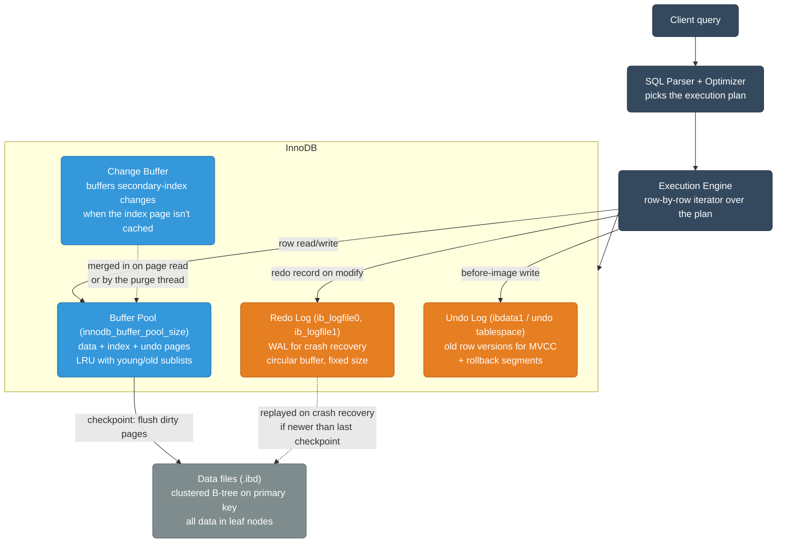
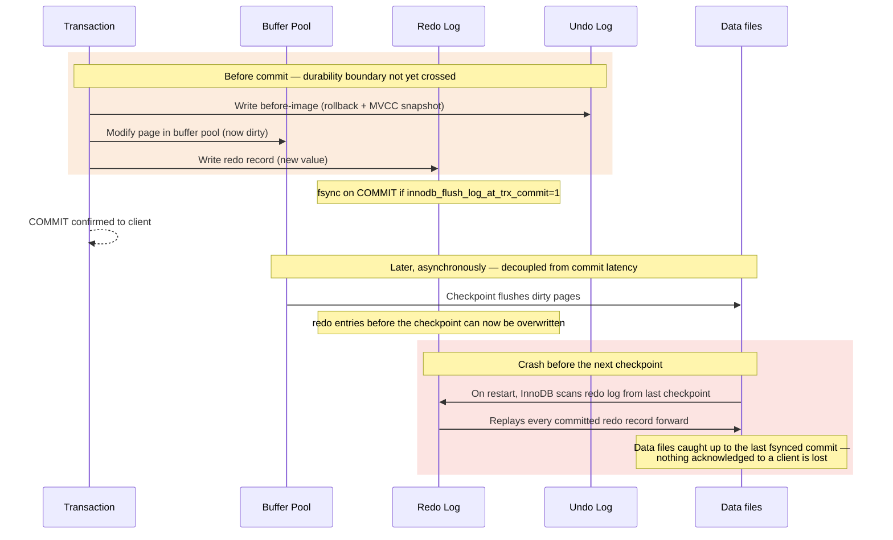
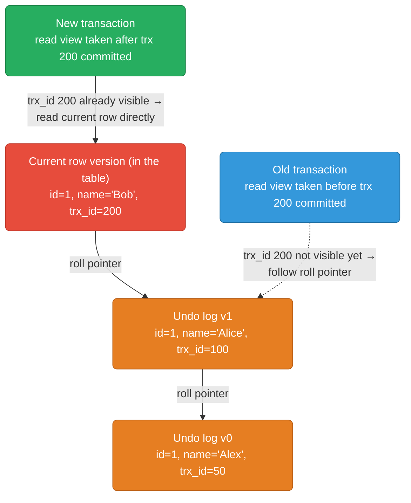
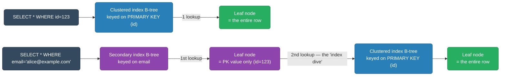
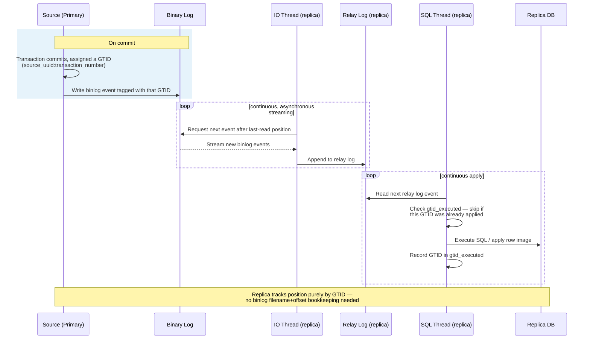
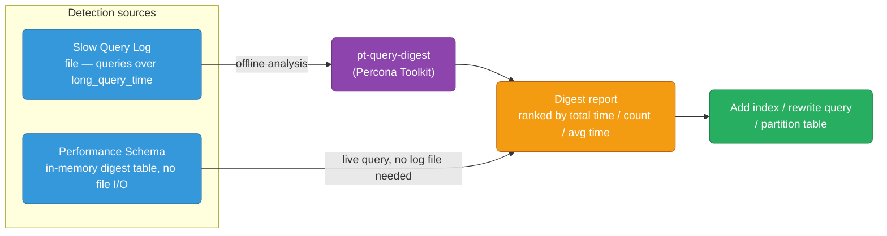
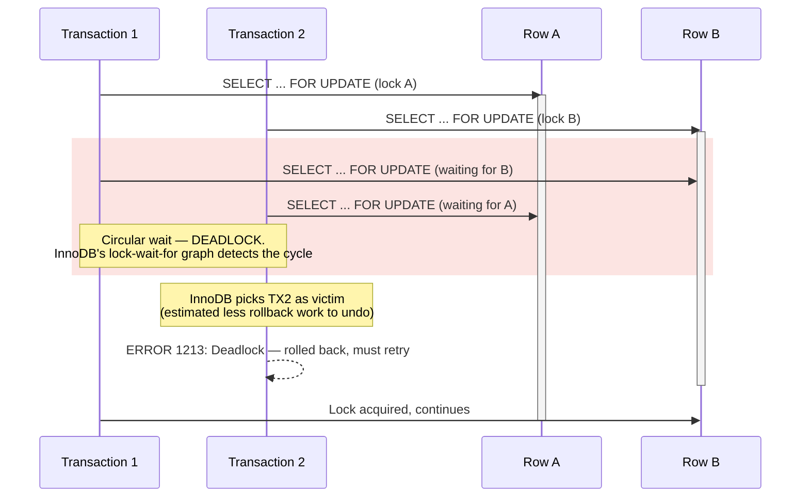

# MySQL / InnoDB Internals

How MySQL's InnoDB engine actually writes, versions, and replicates rows underneath a client connection — the buffer pool, the redo/undo logs that make crashes and rollbacks safe, and the binlog+GTID pipeline that keeps replicas in sync.

<div class="quiz-progress" data-quiz-progress>
  <span class="quiz-progress-label">0/0 checks</span>
  <span class="quiz-progress-bar"><span class="quiz-progress-fill"></span></span>
</div>

---

## InnoDB Storage Engine Architecture



The buffer pool is where reads and writes actually happen — data and index pages live there entirely in memory, and a query only touches disk when a page isn't cached. Redo and undo solve two different problems that both start with that same modified page: redo makes the *change* durable before the dirty page is ever flushed to the `.ibd` file, while undo keeps the *previous* row version around for both rollback and any transaction still reading an older MVCC snapshot. The change buffer exists purely to avoid random-I/O stalls: if a secondary-index page a write needs to touch isn't in the buffer pool, InnoDB records the change there instead of paging the index block in immediately, merging it in later when the page is naturally read or the purge thread gets to it.

<div class="quiz-card">
  <p class="quiz-q">A dirty buffer-pool page hasn't been flushed to the .ibd file yet, but the transaction that modified it already got "commit confirmed" back. MySQL crashes right now. What makes that committed change survive, and how is that different from what lets InnoDB roll back a separate, still-uncommitted transaction?</p>
  <button class="quiz-reveal">Reveal answer</button>
  <div class="quiz-a" hidden>The redo log — the change was already written (and fsynced, under innodb_flush_log_at_trx_commit=1) there before commit returned, so crash recovery replays it into the data file even though the buffer pool page itself never reached disk. Rolling back a different, uncommitted transaction is a completely separate mechanism: it uses the undo log's before-image of the row, not the redo log's forward-only change record.</div>
</div>

---

## Redo Log (WAL) + Undo Log



The redo log is what makes a commit durable long before the modified page is flushed to disk — the buffer pool page and the on-disk data file can lag behind indefinitely, because the redo log is exactly the fallback InnoDB uses to reconstruct that gap after a crash.

**`innodb_flush_log_at_trx_commit`:**
| Value | Behavior | Durability | Performance |
|-------|---------|-----------|------------|
| 0 | Flush every 1s (OS buffer) | 1s data loss on crash | Fastest |
| 1 (default) | Flush + fsync on every commit | Zero loss | Slowest |
| 2 | Flush to OS buffer on commit, fsync every 1s | 1s loss on OS crash | Medium |

<div class="tab-group">
  <div class="tab-buttons">
    <button data-tab="flush0" class="active">0</button>
    <button data-tab="flush1">1 (default)</button>
    <button data-tab="flush2">2</button>
  </div>
  <div class="tab-panels">
    <div class="tab-panel active" data-tab-panel="flush0">
      The log buffer is written and fsynced to disk about once a second by a
      background thread, regardless of commits. A crash of <code>mysqld</code>
      itself — or the OS — can lose up to a second of transactions that were
      already reported as committed. Fastest, because commit never waits on
      disk I/O at all.
    </div>
    <div class="tab-panel" data-tab-panel="flush1">
      Every commit writes the redo record <em>and</em> fsyncs it before
      returning to the client. Zero committed data can be lost, at the cost
      of a disk fsync on every single transaction. This is the only setting
      that keeps the ACID "D" airtight.
    </div>
    <div class="tab-panel" data-tab-panel="flush2">
      Every commit writes the redo record to the OS's file cache, but the
      fsync to physical disk still only happens about once a second. Safe
      against a <code>mysqld</code> crash (the OS still has the data in
      cache), but an OS-level crash or power loss in that window loses it —
      a common compromise on read replicas where a bit of risk is acceptable.
    </div>
  </div>
</div>

<div class="stepper">
  <div class="stepper-panels">
    <div class="stepper-panel active">
      <strong>1. Before-image to the undo log.</strong> Before InnoDB touches
      the row in place, it writes the row's current value into the undo log,
      so a rollback or an older MVCC snapshot always has the prior version
      available.
    </div>
    <div class="stepper-panel">
      <strong>2. Page modified in the buffer pool.</strong> The actual row
      change happens in memory, on the cached page. Nothing has hit a file on
      disk yet.
    </div>
    <div class="stepper-panel">
      <strong>3. Redo record appended — the durability boundary.</strong>
      InnoDB writes a redo record for the change, and with
      <code>innodb_flush_log_at_trx_commit=1</code>, fsyncs it before
      returning "commit" to the client. This is the moment a committed write
      can no longer be lost.
    </div>
    <div class="stepper-panel">
      <strong>4. Commit confirmed, dirty page still dirty.</strong> The
      buffer pool page hasn't been written back to the <code>.ibd</code> file
      yet — it's just marked dirty. The redo log is carrying the durability
      guarantee right now, not the data file.
    </div>
    <div class="stepper-panel">
      <strong>5. Async checkpoint flushes to disk.</strong> Later,
      independent of any individual transaction's commit, InnoDB flushes
      dirty pages to the data files, and redo log space before that
      checkpoint becomes reusable.
    </div>
    <div class="stepper-panel">
      <strong>6. Crash recovery replays forward from the last checkpoint.</strong>
      On restart, InnoDB reads the redo log starting at the last checkpoint
      and reapplies every record found there, bringing the data files up to
      exactly the state of the last fsynced commit — nothing acknowledged to
      a client is ever lost.
    </div>
  </div>
  <div class="stepper-controls">
    <button class="stepper-prev">← Prev</button>
    <span class="stepper-dots"></span>
    <span class="stepper-label"></span>
    <button class="stepper-next">Next →</button>
  </div>
</div>

<div class="quiz-card">
  <p class="quiz-q">innodb_flush_log_at_trx_commit is set to 2 on a read replica. The replica's OS crashes and reboots (mysqld itself didn't crash first). What's at risk, and what isn't?</p>
  <button class="quiz-reveal">Reveal answer</button>
  <div class="quiz-a" hidden>Up to about a second of transactions is at risk — with value 2, every commit writes to the OS file cache but only fsyncs to physical disk roughly once a second, so an OS-level crash can lose whatever was sitting in that cache and never made it to disk. A plain mysqld crash alone would NOT have lost anything, since the OS cache would have survived and eventually been fsynced — the risk here is specifically an OS/power-level failure, not an application crash.</div>
</div>

---

## MVCC with Undo Log



<div class="stepper">
  <div class="stepper-panels">
    <div class="stepper-panel active">
      <strong>1. Transaction starts, takes a read view.</strong> InnoDB
      snapshots which transaction IDs are currently active/uncommitted at
      that moment — anything committed by a trx_id outside the visible range
      of that snapshot can't be seen yet.
    </div>
    <div class="stepper-panel">
      <strong>2. Read the current row version.</strong> Every read starts at
      the row's live version in the table, which carries the trx_id of
      whoever last committed a change to it.
    </div>
    <div class="stepper-panel">
      <strong>3. Compare that trx_id against the read view.</strong> If it's
      visible to this transaction's snapshot (already committed before the
      snapshot was taken), the current version is returned directly — no
      undo log involved.
    </div>
    <div class="stepper-panel">
      <strong>4. Otherwise, follow the roll pointer.</strong> If the current
      version's trx_id isn't visible yet, InnoDB follows the row's roll
      pointer into the undo log to the previous version, and repeats the
      same visibility check against <em>that</em> version's trx_id.
    </div>
    <div class="stepper-panel">
      <strong>5. Keep walking the chain until a visible version is found.</strong>
      This is exactly why a long-running transaction with an old read view
      keeps every undo version behind it alive, and blocks the purge thread
      from reclaiming that undo log space.
    </div>
  </div>
  <div class="stepper-controls">
    <button class="stepper-prev">← Prev</button>
    <span class="stepper-dots"></span>
    <span class="stepper-label"></span>
    <button class="stepper-next">Next →</button>
  </div>
</div>

Unlike PostgreSQL (which stores old versions in the heap), MySQL/InnoDB stores them in undo logs.

**Undo log purge:** Background purge thread removes undo records no longer needed by any transaction. Long-running transactions prevent purge → undo tablespace grows.

<div class="quiz-card">
  <p class="quiz-q">A read-only reporting transaction opens a read view and then sits idle for six hours without committing. What effect does this have on the undo tablespace, and why?</p>
  <button class="quiz-reveal">Reveal answer</button>
  <div class="quiz-a" hidden>It prevents purge from reclaiming old undo log versions that are still older than the row's current version — even though the reporting transaction never writes anything, its read view pins whatever versions were visible when it started as still potentially needed. The purge thread can't distinguish "nobody needs this anymore" from "a long-open transaction might still need this," so the undo tablespace keeps growing until that transaction finally closes.</div>
</div>

---

## InnoDB B-tree (Clustered Index)

InnoDB's primary key **is** the clustered index — every row lives directly in the leaf nodes of that B-tree, there's no separate heap the index points into. A secondary index's leaf nodes don't store the row at all; they store the primary key value, which means looking up a row through a secondary index costs a second lookup into the clustered index — the "index dive."



<div class="quiz-card">
  <p class="quiz-q">A query filters on email (secondary index) and matches 500 rows. Roughly how many B-tree lookups does this cost, and why is it more than 500?</p>
  <button class="quiz-reveal">Reveal answer</button>
  <div class="quiz-a" hidden>Up to 1,000 — for each of the 500 matches, InnoDB does one lookup in the secondary index to get the row's primary key, then a second lookup in the clustered index to fetch the actual row. Every non-covering secondary-index read pays this double lookup ("index dive"), because a secondary index's leaf nodes only ever store the PK value, never the full row.</div>
</div>

---

## Replication: Binary Log (Binlog)



**Binlog formats:**
- `STATEMENT`: log SQL statements (compact, but non-deterministic queries can diverge)
- `ROW`: log actual row changes (verbose, always correct — used by default now)
- `MIXED`: statement for safe queries, row for non-deterministic

<div class="toggle-switch">
  <div class="toggle-buttons">
    <button data-toggle-opt="stmt" class="active state-warn">STATEMENT</button>
    <button data-toggle-opt="row" class="state-ok">ROW</button>
    <button data-toggle-opt="mixed" class="state-ok">MIXED</button>
  </div>
  <div class="toggle-panel active" data-toggle-panel="stmt">
    Logs the actual SQL statement executed. Compact — one line replicates a
    multi-row UPDATE — but non-deterministic statements (<code>NOW()</code>,
    <code>RAND()</code>, statement-order-dependent triggers) can produce a
    different result on the replica than they did on the source, silently
    diverging the two databases with no error raised.
  </div>
  <div class="toggle-panel" data-toggle-panel="row">
    Logs the actual before/after row values that changed, not the statement
    that caused them. Always correct regardless of non-determinism, at the
    cost of a larger binlog for statements that touch many rows. This is the
    default today.
  </div>
  <div class="toggle-panel" data-toggle-panel="mixed">
    Uses STATEMENT for queries MySQL can prove are deterministic, and falls
    back to ROW automatically for anything it can't — a middle ground between
    binlog size and correctness.
  </div>
</div>

**GTID (Global Transaction ID):** Each transaction gets a globally unique ID. Replicas use GTIDs to track position — no need to know binlog filename + offset. Enables automatic failover.

<div class="stepper">
  <div class="stepper-panels">
    <div class="stepper-panel active">
      <strong>1. Transaction commits on the source.</strong> MySQL assigns
      it a Global Transaction ID —
      <code>&lt;source_uuid&gt;:&lt;transaction_number&gt;</code> — unique
      across the whole replication topology, not just this one server.
    </div>
    <div class="stepper-panel">
      <strong>2. Binlog event written, tagged with that GTID.</strong> The
      event itself carries its GTID, not just a filename+offset position.
    </div>
    <div class="stepper-panel">
      <strong>3. Replica's IO thread streams the event.</strong>
      Asynchronously, into its own relay log — tracking nothing more than
      "give me everything after the GTIDs I've already got"
      (<code>gtid_executed</code>).
    </div>
    <div class="stepper-panel">
      <strong>4. Replica's SQL thread applies it, skipping duplicates.</strong>
      Before applying, it checks whether that exact GTID is already in
      <code>gtid_executed</code> and skips it if so — this is what makes GTID
      replication safe to reconnect, or even redirect, without manual
      position bookkeeping.
    </div>
    <div class="stepper-panel">
      <strong>5. Failover: point the replica at a new source by GTID.</strong>
      Because both source and replica track the same GTID sets, promoting a
      different source and reconnecting other replicas to it doesn't require
      computing a binlog filename/offset — MySQL just diffs the GTID sets and
      streams whatever's missing.
    </div>
  </div>
  <div class="stepper-controls">
    <button class="stepper-prev">← Prev</button>
    <span class="stepper-dots"></span>
    <span class="stepper-label"></span>
    <button class="stepper-next">Next →</button>
  </div>
</div>

<div class="quiz-card">
  <p class="quiz-q">Before GTID-based replication, failing over to a new source meant manually computing the exact binlog filename and byte offset for every replica to resume from. Why does GTID eliminate that step?</p>
  <button class="quiz-reveal">Reveal answer</button>
  <div class="quiz-a" hidden>Because every already-applied transaction is recorded in gtid_executed by its GTID rather than by position, a replica can just tell any new source "here's the full set of GTIDs I already have," and the new source computes the diff and starts streaming from there. There's no file+offset arithmetic to get right, so pointing replicas at a newly promoted source can be fully automated.</div>
</div>

---

## Key Configuration

```ini
innodb_buffer_pool_size = 12G      # 70-80% of RAM
innodb_buffer_pool_instances = 8   # reduce contention
innodb_log_file_size = 2G          # larger = faster writes, slower crash recovery
innodb_flush_log_at_trx_commit = 1 # 1 = full durability (use 2 for replicas)
innodb_flush_method = O_DIRECT     # bypass OS cache (avoid double-buffering)
sync_binlog = 1                    # sync binlog to disk per transaction
binlog_format = ROW
gtid_mode = ON
enforce_gtid_consistency = ON
```

---

## Slow Query Log and Analysis



The slow query log and Performance Schema are two independent ways to catch the same problem: the log needs `slow_query_log` turned on and writes to a file you analyze after the fact, while `events_statements_summary_by_digest` is always accumulating in memory and can be queried live with no configuration flag or file I/O at all — either path should converge on the same fix.

```ini
# Enable slow query log
slow_query_log = ON
slow_query_log_file = /var/log/mysql/slow.log
long_query_time = 1           # log queries > 1 second
log_queries_not_using_indexes = ON  # catch full table scans
min_examined_row_limit = 1000 # skip trivially small queries
```

```bash
# Analyze slow query log
pt-query-digest /var/log/mysql/slow.log | head -100

# Output shows per-query fingerprint:
# Query 1: 23.45s total, 234 calls, 0.10s avg
# SELECT * FROM orders WHERE user_id = ? AND status = ?
# Rows examined: 50000 → index missing on (user_id, status)
```

```sql
-- Find slow queries in real time (Performance Schema)
SELECT DIGEST_TEXT, COUNT_STAR, AVG_TIMER_WAIT/1e12 AS avg_sec,
       SUM_ROWS_EXAMINED/COUNT_STAR AS avg_rows_examined
FROM performance_schema.events_statements_summary_by_digest
WHERE AVG_TIMER_WAIT > 1e12  -- > 1 second
ORDER BY SUM_TIMER_WAIT DESC LIMIT 10;
```

<div class="quiz-card">
  <p class="quiz-q">log_queries_not_using_indexes is ON alongside long_query_time = 1. A query does a full table scan but finishes in 0.05s. Does it show up in the slow query log?</p>
  <button class="quiz-reveal">Reveal answer</button>
  <div class="quiz-a" hidden>Yes — log_queries_not_using_indexes logs any query that doesn't use an index regardless of how fast it ran, independent of the long_query_time threshold. The two settings catch different failure modes: one flags queries that were already slow, the other flags queries that will become slow as the table grows, even while they're still fast today.</div>
</div>

---

## Deadlock Analysis



InnoDB doesn't pick the victim by who detected the deadlock, or by who started first — it estimates which transaction has done less work to undo (fewer rows modified so far) and kills that one, since rolling back a shorter transaction is cheaper than rolling back a longer one.

<div class="quiz-card">
  <p class="quiz-q">In the deadlock above, why is TX2 killed and not TX1, given both are waiting on each other?</p>
  <button class="quiz-reveal">Reveal answer</button>
  <div class="quiz-a" hidden>InnoDB doesn't use "who asked first" — it picks whichever transaction is cheaper to roll back (less undo work done so far) as the victim, kills it with error 1213, and lets the other one proceed once its lock is freed. This is why deadlock-prone code should always retry on 1213 rather than treat it as fatal — the losing transaction did nothing wrong, it just cost less to undo.</div>
</div>

```sql
-- View last deadlock
SHOW ENGINE INNODB STATUS\G
-- Look for "LATEST DETECTED DEADLOCK" section
-- Shows: which transactions, which rows were locked, who was killed

-- Enable deadlock logging
innodb_print_all_deadlocks = ON  -- logs every deadlock to error log

-- Prevent deadlocks: always lock rows in the same order
-- Bad: TX1 locks A then B, TX2 locks B then A
-- Good: both always lock in alphabetical/ID order
```

---

## EXPLAIN and Index Optimization

```sql
-- Full EXPLAIN output
EXPLAIN FORMAT=JSON SELECT u.name, COUNT(o.id)
FROM users u
JOIN orders o ON o.user_id = u.id
WHERE u.created_at > '2024-01-01'
GROUP BY u.id\G

-- Key fields to check:
-- type: ALL (full scan bad), ref/eq_ref (good), range (ok), index (scan index only)
-- key: NULL means no index used
-- rows: estimated rows to examine
-- Extra: "Using filesort" or "Using temporary" = expensive

-- Find missing indexes
EXPLAIN SELECT * FROM orders WHERE user_id = 123 AND status = 'pending'\G
-- If type=ALL and rows=100000 → add composite index

CREATE INDEX idx_orders_user_status ON orders(user_id, status);

-- Covering index: index contains all columns the query needs (no table lookup)
CREATE INDEX idx_orders_covering ON orders(user_id, status, created_at, amount);
-- Query: SELECT amount FROM orders WHERE user_id=1 AND status='paid'
-- Extra: "Using index" → reads index only, never touches table rows
```

<div class="quiz-card">
  <p class="quiz-q">EXPLAIN shows Extra: "Using index" for a query. Does that just mean "an index was used," and is that automatically as good as it gets?</p>
  <button class="quiz-reveal">Reveal answer</button>
  <div class="quiz-a" hidden>It means more specifically that this was a covering index read — every column the query needed was found in the index itself, with zero lookups into the actual table rows. That's a step better than a normal index lookup (type=ref/range with a key set but no "Using index" in Extra), which still has to fetch the full row from the clustered index after finding a match in a secondary index.</div>
</div>

---

## Partitioning

```sql
-- Range partitioning by year (for large time-series tables)
CREATE TABLE orders (
    id BIGINT NOT NULL,
    user_id BIGINT,
    amount DECIMAL(10,2),
    created_at DATETIME NOT NULL
)
PARTITION BY RANGE (YEAR(created_at)) (
    PARTITION p2022 VALUES LESS THAN (2023),
    PARTITION p2023 VALUES LESS THAN (2024),
    PARTITION p2024 VALUES LESS THAN (2025),
    PARTITION pmax  VALUES LESS THAN MAXVALUE
);

-- Query uses partition pruning automatically
EXPLAIN SELECT * FROM orders WHERE created_at BETWEEN '2024-01-01' AND '2024-12-31';
-- partitions: p2024  ← only scans 2024 partition, skips 2022-2023

-- Drop old partition instantly (no row-by-row DELETE)
ALTER TABLE orders DROP PARTITION p2022;  -- instant, reclaims disk space

-- List partitions and row counts
SELECT PARTITION_NAME, TABLE_ROWS, DATA_LENGTH/1024/1024 AS data_mb
FROM INFORMATION_SCHEMA.PARTITIONS
WHERE TABLE_NAME = 'orders';
```

Partition pruning happens purely from the WHERE clause's relationship to the partitioning expression — MySQL doesn't need to touch an index to decide which partitions to skip, it decides that from the partition definition itself, and only then applies whatever indexing exists inside the partitions it does scan.

<div class="quiz-card">
  <p class="quiz-q">A range-partitioned table has no index on created_at at all. A query filters WHERE created_at BETWEEN '2024-01-01' AND '2024-12-31'. Does partition pruning still work, and does it make the query fast on its own?</p>
  <button class="quiz-reveal">Reveal answer</button>
  <div class="quiz-a" hidden>Pruning still works — EXPLAIN would show partitions: p2024, skipping p2022/p2023/pmax entirely, because pruning is decided from the partitioning expression, not from an index. But "fast" isn't guaranteed: without an index inside p2024, MySQL still has to full-scan every row in that one partition. Pruning shrinks how much gets scanned, it doesn't replace indexing within the partition it lands on.</div>
</div>

---

## Performance Schema — Real-Time Diagnostics

```sql
-- Top wait events (where time is spent)
SELECT EVENT_NAME, COUNT_STAR, SUM_TIMER_WAIT/1e12 AS total_sec
FROM performance_schema.events_waits_summary_global_by_event_name
WHERE COUNT_STAR > 0
ORDER BY SUM_TIMER_WAIT DESC LIMIT 10;

-- I/O by table
SELECT OBJECT_SCHEMA, OBJECT_NAME,
       COUNT_READ, SUM_TIMER_READ/1e12 AS read_sec,
       COUNT_WRITE, SUM_TIMER_WRITE/1e12 AS write_sec
FROM performance_schema.table_io_waits_summary_by_table
ORDER BY (SUM_TIMER_READ + SUM_TIMER_WRITE) DESC LIMIT 10;

-- Current connections with their last query
SELECT PROCESSLIST_ID, PROCESSLIST_USER, PROCESSLIST_HOST,
       PROCESSLIST_DB, PROCESSLIST_COMMAND, PROCESSLIST_TIME,
       LEFT(PROCESSLIST_INFO, 100) AS query
FROM performance_schema.processlist
WHERE PROCESSLIST_COMMAND != 'Sleep'
ORDER BY PROCESSLIST_TIME DESC;
```

---

## Key Monitoring Queries

```sql
-- Buffer pool hit rate (target > 99%)
SELECT (1 - Innodb_buffer_pool_reads / Innodb_buffer_pool_read_requests) * 100 AS hit_rate_pct
FROM (
    SELECT variable_value AS Innodb_buffer_pool_reads FROM information_schema.global_status WHERE variable_name = 'Innodb_buffer_pool_reads'
) r, (
    SELECT variable_value AS Innodb_buffer_pool_read_requests FROM information_schema.global_status WHERE variable_name = 'Innodb_buffer_pool_read_requests'
) rr;

-- Replication lag in seconds
SHOW REPLICA STATUS\G
-- Seconds_Behind_Source: 0 = in sync, >30 = alert

-- InnoDB row lock waits (high = contention)
SHOW STATUS LIKE 'Innodb_row_lock%';
-- Innodb_row_lock_waits: cumulative waits
-- Innodb_row_lock_time_avg: average wait ms

-- Table sizes
SELECT table_name,
       round(data_length/1024/1024, 1) AS data_mb,
       round(index_length/1024/1024, 1) AS index_mb,
       table_rows
FROM information_schema.tables
WHERE table_schema = DATABASE()
ORDER BY data_length + index_length DESC LIMIT 20;
```
