# PostgreSQL Internals

How Postgres actually stores rows, orders concurrent writers, and keeps a replica in sync underneath `psql` — storage layout, MVCC and vacuum, WAL and replication durability, connection pooling, and where the query planner's cost model can go wrong.

<div class="quiz-progress" data-quiz-progress>
  <span class="quiz-progress-label">0/0 checks</span>
  <span class="quiz-progress-bar"><span class="quiz-progress-fill"></span></span>
</div>

---

## Storage Architecture

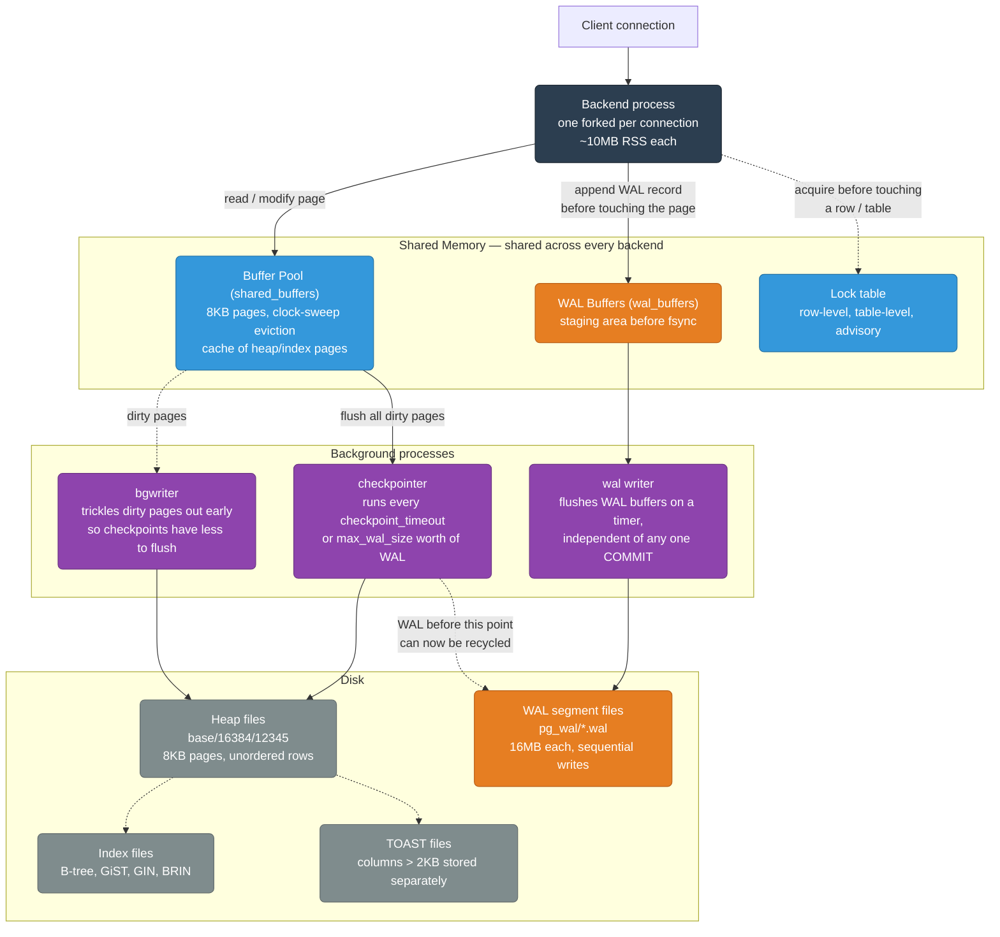

The key thing this diagram makes explicit: a backend never writes straight to the heap file on disk. It modifies the page in the shared buffer pool and appends a WAL record — both in memory — and returns to the client once the WAL record is durable. Getting the actual heap page onto disk is a separate, asynchronous job handled by `bgwriter` (proactively, to keep checkpoints cheap) and the `checkpointer` (on its own schedule), decoupled from any single transaction's commit.

<div class="quiz-card">
  <p class="quiz-q">A backend process modifies a page in the buffer pool during an UPDATE. Does that change need to reach the heap file on disk before COMMIT can return to the client?</p>
  <button class="quiz-reveal">Reveal answer</button>
  <div class="quiz-a" hidden>No. The durability boundary is the WAL record, not the heap page. As long as the WAL record for that change is flushed to pg_wal/, COMMIT can return — the modified buffer-pool page itself gets written to the heap file later, asynchronously, by bgwriter or the checkpointer. Crash recovery replays the WAL to reconstruct any page that hadn't made it to disk yet.</div>
</div>

---

## WAL — Write-Ahead Log in Detail

Every modification (INSERT, UPDATE, DELETE) writes a WAL record before the data page is changed.

```mermaid
sequenceDiagram
    participant TX as Transaction
    participant BP as Buffer Pool
    participant WALBUF as WAL Buffer
    participant WALDISK as WAL files (pg_wal/)
    participant CKPT as Checkpointer
    participant DF as Data files (heap)

    TX->>BP: UPDATE row → modify page in buffer pool (in memory only)
    TX->>WALBUF: Write WAL record {LSN, relation, block, old tuple, new tuple}
    Note over WALBUF,WALDISK: synchronous_commit = on
    WALBUF->>WALDISK: fsync WAL to disk before COMMIT is allowed to return
    WALDISK-->>TX: fsync confirmed
    TX-->>TX: COMMIT returns to client

    rect rgb(40, 60, 45)
    Note over BP,DF: Asynchronous — runs on its own schedule, not per-COMMIT
    loop every checkpoint_timeout (default 5min) or max_wal_size worth of WAL
        CKPT->>BP: request all dirty pages
        BP->>DF: flush dirty pages to heap files
        CKPT->>WALDISK: mark WAL segments before this point as recyclable
    end
    end
```

<div class="stepper">
  <div class="stepper-panels">
    <div class="stepper-panel active">
      <strong>1. Modify the page in memory.</strong> The backend changes the page inside the shared buffer pool. Nothing has touched disk yet.
    </div>
    <div class="stepper-panel">
      <strong>2. Write and fsync the WAL record.</strong> The WAL record for that change is appended to the WAL buffer and, with <code>synchronous_commit = on</code>, fsynced to <code>pg_wal/</code> before COMMIT is allowed to return. This — not the heap page — is the actual durability point.
    </div>
    <div class="stepper-panel">
      <strong>3. COMMIT returns.</strong> The client sees success once the WAL record is durable on disk, even though the modified heap page may still exist only in memory.
    </div>
    <div class="stepper-panel">
      <strong>4. Checkpoint catches up later.</strong> On its own schedule (<code>checkpoint_timeout</code> or <code>max_wal_size</code>), the checkpointer flushes dirty pages to the heap files. Only after that can the WAL segments covering those changes be recycled — this side is fully decoupled from any one transaction.
    </div>
  </div>
  <div class="stepper-controls">
    <button class="stepper-prev">← Prev</button>
    <span class="stepper-dots"></span>
    <span class="stepper-label"></span>
    <button class="stepper-next">Next →</button>
  </div>
</div>

**LSN (Log Sequence Number):** 64-bit monotonically increasing number. Every WAL record has an LSN. Replicas track which LSN they've replayed — this is the replication lag.

```sql
-- Check current WAL position
SELECT pg_current_wal_lsn();

-- Check replication lag
SELECT
    client_addr,
    sent_lsn - replay_lsn AS lag_bytes,
    EXTRACT(EPOCH FROM (now() - replay_lag)) AS lag_seconds
FROM pg_stat_replication;
```

<div class="quiz-card">
  <p class="quiz-q">A backend commits with synchronous_commit = on, and the server crashes 3 minutes later — before the next checkpoint runs. Is the committed row lost?</p>
  <button class="quiz-reveal">Reveal answer</button>
  <div class="quiz-a" hidden>No. The WAL record for that change was already fsynced to disk before COMMIT returned, regardless of whether the modified heap page itself had been flushed by the checkpointer yet. On restart, PostgreSQL replays WAL records after the last checkpoint to reconstruct any page that wasn't flushed in time — the checkpoint is a durability floor, not the only path to durability.</div>
</div>

**Try it yourself — WAL + checkpoint simulator.** The sequence diagram above shows one commit's path end-to-end; this one lets you drive many commits and checkpoints yourself and watch the two housekeeping facts that fall out of it: a WAL segment is only safe to delete once a checkpoint has flushed everything it covers to the heap files, and a page counts as "dirty" from the moment it's modified until the *next* checkpoint clears it — not until the transaction that touched it commits.

<div class="structure-viz" id="postgres-wal-viz">
  <svg class="viz-canvas" viewBox="0 0 640 190"></svg>
  <div class="viz-controls">
    <input class="viz-input" type="number" placeholder="page id" />
    <button class="viz-btn" data-viz-action="commit">Commit Transaction</button>
    <button class="viz-btn" data-viz-action="checkpoint">Checkpoint</button>
    <button class="viz-btn" data-viz-action="crash">Simulate Crash + Recovery</button>
    <button class="viz-btn viz-btn-danger" data-viz-action="reset">Reset</button>
  </div>
  <div class="viz-status"></div>
  <div class="viz-legend">
    <span><span class="viz-swatch" style="background:#1e3a8a"></span> still needed (after last checkpoint)</span>
    <span><span class="viz-swatch" style="background:#78350f"></span> checkpoint boundary segment</span>
    <span><span class="viz-swatch" style="background:#7f1d1d"></span> recyclable (before checkpoint)</span>
  </div>
</div>

<script>
(function () {
  const svgNS = 'http://www.w3.org/2000/svg';
  const root1 = document.getElementById('postgres-wal-viz');
  const svg = root1.querySelector('.viz-canvas');
  const input = root1.querySelector('.viz-input');
  const status = root1.querySelector('.viz-status');

  // ---- core logic: identical to the standalone module verified against a
  // worked example plus a 15-seed x 120-step randomized stress test (every
  // invariant re-checked after every single operation) before any DOM code
  // was written. ----
  const SEGMENT_CAPACITY = 4;

  function createInitialState() {
    return {
      walSegments: [{ id: 1, records: [] }],
      currentSegmentId: 1,
      nextSegmentId: 2,
      dirtyPages: new Set(),
      lastCheckpointSegmentId: 0, // sentinel: no checkpoint has run yet
      nextLsn: 1,
    };
  }

  function findSegment(state, id) {
    return state.walSegments.find((s) => s.id === id);
  }

  function commitTransaction(state, page) {
    const seg = findSegment(state, state.currentSegmentId);
    const lsn = state.nextLsn++;
    seg.records.push({ page, lsn });
    state.dirtyPages.add(page);

    let newSegmentStarted = false;
    let newSegmentId = null;
    if (seg.records.length >= SEGMENT_CAPACITY) {
      newSegmentId = state.nextSegmentId++;
      state.walSegments.push({ id: newSegmentId, records: [] });
      state.currentSegmentId = newSegmentId;
      newSegmentStarted = true;
    }
    return { ok: true, lsn, page, segmentId: seg.id, newSegmentStarted, newSegmentId };
  }

  function checkpoint(state) {
    const dirtyCount = state.dirtyPages.size;
    state.dirtyPages.clear();
    state.lastCheckpointSegmentId = state.currentSegmentId;
    const removed = state.walSegments.filter((s) => s.id < state.lastCheckpointSegmentId);
    state.walSegments = state.walSegments.filter((s) => s.id >= state.lastCheckpointSegmentId);
    return {
      ok: true,
      dirtyCount,
      removedCount: removed.length,
      removedIds: removed.map((s) => s.id),
      checkpointSegmentId: state.lastCheckpointSegmentId,
    };
  }

  // ---- DOM / SVG rendering ----
  let state = createInitialState();

  function setStatus(msg, kind) {
    status.textContent = msg;
    status.className = 'viz-status' + (kind === 'ok' ? ' viz-status-ok' : kind === 'error' ? ' viz-status-error' : '');
  }

  function el(tag, attrs) {
    const e = document.createElementNS(svgNS, tag);
    for (const k in attrs) e.setAttribute(k, attrs[k]);
    return e;
  }

  function segmentClass(seg) {
    if (seg.id < state.lastCheckpointSegmentId) return 'viz-node-removing';
    if (seg.id === state.lastCheckpointSegmentId) return 'viz-node-highlight';
    return 'viz-node';
  }

  function formatRemovedRange(removedIds) {
    if (removedIds.length === 0) return null;
    const first = removedIds[0];
    const last = removedIds[removedIds.length - 1];
    return first === last ? `segment ${first}` : `segments ${first}-${last}`;
  }

  function draw() {
    const SW = 130, SH = 140, GAP = 24, PADX = 20, TOPY = 20;
    const vbW = Math.max(640, PADX * 2 + state.walSegments.length * (SW + GAP) - GAP);
    const vbH = 190;
    svg.setAttribute('viewBox', `0 0 ${vbW} ${vbH}`);
    while (svg.firstChild) svg.removeChild(svg.firstChild);

    state.walSegments.forEach((seg, i) => {
      const x = PADX + i * (SW + GAP);
      svg.appendChild(el('rect', { x, y: TOPY, width: SW, height: SH, rx: 8, class: segmentClass(seg) }));

      const title = el('text', { x: x + SW / 2, y: TOPY + 20, style: 'font-weight:600;' });
      title.textContent = `Segment ${seg.id}`;
      svg.appendChild(title);

      const count = el('text', { x: x + SW / 2, y: TOPY + 38, style: 'font-size:0.72rem;' });
      count.textContent = `${seg.records.length}/${SEGMENT_CAPACITY} records`;
      svg.appendChild(count);

      seg.records.slice(0, 4).forEach((rec, ri) => {
        const t = el('text', { x: x + SW / 2, y: TOPY + 58 + ri * 18, style: 'font-size:0.68rem;' });
        t.textContent = `LSN ${rec.lsn} -> page ${rec.page}`;
        svg.appendChild(t);
      });

      if (i < state.walSegments.length - 1) {
        svg.appendChild(el('line', { x1: x + SW, y1: TOPY + SH / 2, x2: x + SW + GAP, y2: TOPY + SH / 2, class: 'viz-edge' }));
      }
    });

    const dirtyLabel = el('text', { x: PADX, y: vbH - 12, style: 'font-size:0.72rem;text-anchor:start;' });
    const dirtyList = state.dirtyPages.size ? Array.from(state.dirtyPages).sort((a, b) => a - b).join(', ') : 'none';
    dirtyLabel.textContent = `Dirty pages: ${dirtyList}`;
    svg.appendChild(dirtyLabel);

    const ckptLabel = el('text', { x: vbW - PADX, y: vbH - 12, style: 'font-size:0.72rem;text-anchor:end;' });
    ckptLabel.textContent = state.lastCheckpointSegmentId === 0
      ? 'Last checkpoint: none yet'
      : `Last checkpoint: segment ${state.lastCheckpointSegmentId}`;
    svg.appendChild(ckptLabel);
  }

  root1.querySelector('[data-viz-action="commit"]').addEventListener('click', () => {
    const raw = input.value.trim();
    if (!raw) { setStatus('Enter a page id first.', 'error'); return; }
    const page = parseInt(raw, 10);
    if (Number.isNaN(page)) { setStatus('Page id must be a number.', 'error'); return; }
    const res = commitTransaction(state, page);
    input.value = '';
    let msg = `WAL record written (LSN ${res.lsn}) -- page ${page} is now dirty. Postgres considers this transaction durable the instant this WAL write is fsynced, even though the actual table file hasn't been touched yet.`;
    if (res.newSegmentStarted) {
      msg += ` Segment ${res.segmentId} is now full -- segment ${res.newSegmentId} starts.`;
    }
    setStatus(msg, 'ok');
    draw();
  });

  root1.querySelector('[data-viz-action="checkpoint"]').addEventListener('click', () => {
    const res = checkpoint(state);
    const range = formatRemovedRange(res.removedIds);
    const msg = range
      ? `Checkpoint -- ${res.dirtyCount} dirty page(s) flushed to disk, ${res.removedCount} old WAL segment(s) recycled (${range} deleted, no longer needed for crash recovery).`
      : `Checkpoint -- ${res.dirtyCount} dirty page(s) flushed to disk, no old WAL segments to recycle yet.`;
    setStatus(msg, 'ok');
    draw();
  });

  root1.querySelector('[data-viz-action="crash"]').addEventListener('click', () => {
    const msg = state.lastCheckpointSegmentId === 0
      ? 'If Postgres crashed right now, recovery would replay every WAL record from the very beginning -- no checkpoint has run yet, so every segment currently held is still needed.'
      : `If Postgres crashed right now, recovery would replay every WAL record from the last checkpoint (segment ${state.lastCheckpointSegmentId}) forward -- this is exactly why segments before the checkpoint are safe to delete and segments after it are not.`;
    setStatus(msg, '');
    draw();
  });

  root1.querySelector('[data-viz-action="reset"]').addEventListener('click', () => {
    state = createInitialState();
    input.value = '';
    setStatus('Reset -- one empty WAL segment, no dirty pages, no checkpoint yet.', '');
    draw();
  });

  setStatus('One empty WAL segment so far. Commit a transaction (type a page id) to write a WAL record.', '');
  draw();
})();
</script>

---

## MVCC — How PostgreSQL Handles Concurrent Reads/Writes

PostgreSQL never overwrites a row in place. Every UPDATE creates a new row version.

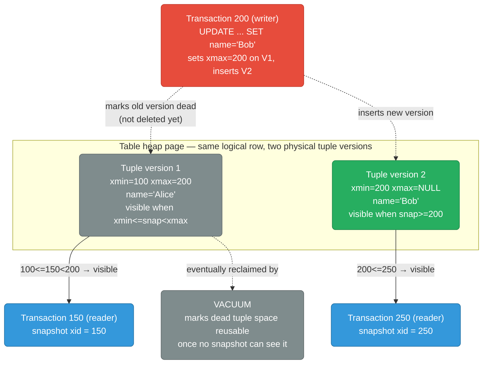

**xmin/xmax system columns:**
- `xmin`: transaction ID that created this tuple version
- `xmax`: transaction ID that deleted/updated this tuple (NULL = still live)
- A tuple is visible if `xmin <= my_snapshot_xid < xmax`

<div class="stepper">
  <div class="stepper-panels">
    <div class="stepper-panel active">
      <strong>1. Snapshot taken.</strong> When a transaction starts (or per-statement, depending on isolation level), Postgres records a snapshot xid — that number is what "visible" gets measured against for everything this transaction reads.
    </div>
    <div class="stepper-panel">
      <strong>2. Check xmin.</strong> A tuple is only a candidate if its creating transaction (xmin) is <code>&lt;= my_snapshot_xid</code> — otherwise, as far as this reader is concerned, the row didn't exist yet.
    </div>
    <div class="stepper-panel">
      <strong>3. Check xmax.</strong> If xmax is NULL, the tuple is still live and passes. If xmax is set, the tuple is invisible only once the snapshot xid is also <code>&gt;= xmax</code> — a reader with an older snapshot number can still legitimately see a row that's since been updated.
    </div>
    <div class="stepper-panel">
      <strong>4. Exactly one version resolves.</strong> For any given snapshot xid, exactly one tuple version satisfies both checks. That's why two concurrent readers can look at the same logical row and correctly see two different values at the same instant — visibility is arithmetic on transaction IDs, not a lock.
    </div>
  </div>
  <div class="stepper-controls">
    <button class="stepper-prev">← Prev</button>
    <span class="stepper-dots"></span>
    <span class="stepper-label"></span>
    <button class="stepper-next">Next →</button>
  </div>
</div>

**Try it yourself — MVCC visibility simulator.** The stepper above walks one scripted example. This one's live: it models a single row's version chain plus up to two concurrent transactions, so you can drive the same `xmin <= my_snapshot_xid < xmax` rule against sequences you pick yourself. Begin a transaction to get a snapshot xid, Update to branch the chain (old version's xmax gets set, a new version gets pushed), and watch each transaction's readout to see exactly which version its own snapshot resolves to — including the write-lock and write-conflict cases when two transactions touch the same row at once.

<div class="structure-viz" id="mvcc-viz">
  <svg class="viz-canvas" viewBox="0 0 700 190"></svg>
  <div class="viz-controls">
    <button class="viz-btn" data-viz-action="begin">Begin Txn</button>
    <button class="viz-btn viz-btn-danger" data-viz-action="reset">Reset</button>
  </div>
  <div class="viz-status"></div>
  <div id="mvcc-txn-panel"></div>
  <div class="viz-legend">
    <span><span class="viz-swatch" style="background:#1e3a8a"></span> live version</span>
    <span><span class="viz-swatch" style="background:#7f1d1d"></span> dead / superseded (xmax set)</span>
    <span><span class="viz-swatch" style="background:#14532d"></span> just written</span>
  </div>
</div>

<script>
(function () {
  const svgNS = 'http://www.w3.org/2000/svg';
  const root0 = document.getElementById('mvcc-viz');
  const svg = root0.querySelector('.viz-canvas');
  const status = root0.querySelector('.viz-status');
  const txnPanel = root0.querySelector('#mvcc-txn-panel');

  // ---- core logic: identical to the standalone module verified against the
  // doc's own worked example (txn 200 update) and a 15-seed x 150-step
  // randomized stress test before any DOM code was written. ----
  function createInitialState() {
    return {
      versions: [{ xmin: 100, xmax: null, value: 'Alice' }],
      nextXid: 101,
      transactions: [],
    };
  }

  function isVisible(version, snapshotXid) {
    return version.xmin <= snapshotXid && (version.xmax === null || snapshotXid < version.xmax);
  }

  function visibleVersions(state, snapshotXid) {
    return state.versions.filter((v) => isVisible(v, snapshotXid));
  }

  function activeTransactions(state) {
    return state.transactions.filter((t) => t.active);
  }

  function beginTxn(state) {
    if (activeTransactions(state).length >= 2) {
      return { ok: false, reason: 'Already 2 concurrent transactions — commit or roll one back first (demo caps at 2).' };
    }
    const xid = state.nextXid++;
    const txn = { xid, snapshotXid: xid, active: true };
    state.transactions.push(txn);
    return { ok: true, txn };
  }

  function updateRow(state, txnXid, newValue) {
    const txn = state.transactions.find((t) => t.xid === txnXid && t.active);
    if (!txn) return { ok: false, reason: 'no such active transaction' };
    const live = state.versions.find((v) => v.xmax === null);
    if (!live) return { ok: false, reason: 'no live version to update' };
    const creator = state.transactions.find((t) => t.xid === live.xmin);
    if (creator && creator.active && creator.xid !== txn.xid) {
      return { ok: false, reason: `row locked by uncommitted txn ${creator.xid} — commit or roll it back first` };
    }
    if (!isVisible(live, txn.snapshotXid)) {
      return {
        ok: false,
        reason: `write conflict: your snapshot (${txn.snapshotXid}) can't see the current version (xmin=${live.xmin}) — someone else committed a newer version after you started`,
      };
    }
    live.xmax = txn.xid;
    const version = { xmin: txn.xid, xmax: null, value: newValue };
    state.versions.push(version);
    return { ok: true, version };
  }

  function commitTxn(state, txnXid) {
    const txn = state.transactions.find((t) => t.xid === txnXid);
    if (!txn) return { ok: false, reason: 'no such transaction' };
    txn.active = false;
    return { ok: true };
  }

  function rollbackTxn(state, txnXid) {
    const txn = state.transactions.find((t) => t.xid === txnXid);
    if (!txn) return { ok: false, reason: 'no such transaction' };
    state.versions = state.versions.filter((v) => v.xmin !== txnXid);
    state.versions.forEach((v) => {
      if (v.xmax === txnXid) v.xmax = null;
    });
    txn.active = false;
    return { ok: true };
  }

  // ---- DOM / SVG rendering ----
  let state = createInitialState();
  let lastCreated = null;
  let flashTimer = null;

  function setStatus(msg, kind) {
    status.textContent = msg;
    status.className = 'viz-status' + (kind === 'ok' ? ' viz-status-ok' : kind === 'error' ? ' viz-status-error' : '');
  }

  function escapeHtml(s) {
    return String(s).replace(/&/g, '&amp;').replace(/</g, '&lt;').replace(/>/g, '&gt;').replace(/"/g, '&quot;');
  }

  function txnColor(idx) {
    return idx === 0 ? '#f59e0b' : '#a78bfa'; // amber / violet — distinct from tuple fill colors
  }

  function el(tag, attrs) {
    const e = document.createElementNS(svgNS, tag);
    for (const k in attrs) e.setAttribute(k, attrs[k]);
    return e;
  }

  function scheduleFlashClear() {
    clearTimeout(flashTimer);
    flashTimer = setTimeout(() => {
      lastCreated = null;
      draw();
    }, 1600);
  }

  function draw() {
    const VW = 150, VH = 62, GAP = 22, PADX = 20, ROWY = 76;
    const vbW = Math.max(620, PADX * 2 + state.versions.length * (VW + GAP) - GAP);
    const vbH = 186;
    svg.setAttribute('viewBox', `0 0 ${vbW} ${vbH}`);
    while (svg.firstChild) svg.removeChild(svg.firstChild);

    const active = activeTransactions(state);

    // Version chain.
    state.versions.forEach((v, i) => {
      const x = PADX + i * (VW + GAP);
      const dead = v.xmax !== null;
      let cls = dead ? 'viz-node-removing' : 'viz-node';
      if (v === lastCreated) cls = 'viz-node-new';
      svg.appendChild(el('rect', { x, y: ROWY, width: VW, height: VH, rx: 8, class: cls }));
      const t1 = el('text', { x: x + VW / 2, y: ROWY + 16 });
      t1.textContent = `xmin=${v.xmin}`;
      const t2 = el('text', { x: x + VW / 2, y: ROWY + 32 });
      t2.textContent = `xmax=${v.xmax === null ? '—' : v.xmax}`;
      const t3 = el('text', { x: x + VW / 2, y: ROWY + 48 });
      t3.textContent = `value='${v.value}'`;
      svg.appendChild(t1);
      svg.appendChild(t2);
      svg.appendChild(t3);
      if (i < state.versions.length - 1) {
        svg.appendChild(el('line', { x1: x + VW, y1: ROWY + VH / 2, x2: x + VW + GAP, y2: ROWY + VH / 2, class: 'viz-edge' }));
      }
    });

    // Per-transaction "what do I see" markers, grouped by shared target so
    // two txns pointing at the same version don't overlap.
    const groups = new Map(); // versionIndex -> [{t, idx}]
    active.forEach((t, idx) => {
      const seen = visibleVersions(state, t.snapshotXid);
      const target = seen[0];
      if (!target) return;
      const vi = state.versions.indexOf(target);
      if (!groups.has(vi)) groups.set(vi, []);
      groups.get(vi).push({ t, idx });
    });

    groups.forEach((entries, vi) => {
      const cx = PADX + vi * (VW + GAP) + VW / 2;
      const spread = entries.length > 1 ? 48 : 0;
      entries.forEach((entry, pos) => {
        const offset = entries.length > 1 ? (pos === 0 ? -spread : spread) : 0;
        const mx = cx + offset;
        const my = 14;
        const color = txnColor(entry.idx);
        svg.appendChild(el('line', { x1: mx, y1: my + 22, x2: cx, y2: ROWY, stroke: color, 'stroke-width': 2, 'stroke-dasharray': '4,3' }));
        svg.appendChild(el('rect', { x: mx - 46, y: my, width: 92, height: 24, rx: 5, fill: color, 'fill-opacity': '0.18', stroke: color, 'stroke-width': 1.5 }));
        const label = el('text', { x: mx, y: my + 13, style: `fill:${color};font-weight:600;` });
        label.textContent = `T${entry.t.xid} snap=${entry.t.snapshotXid}`;
        svg.appendChild(label);
      });
    });

    renderTxnPanel(active);
  }

  function renderTxnPanel(active) {
    if (active.length === 0) {
      txnPanel.innerHTML = '<p style="margin:0.7rem 0 0;font-size:0.78rem;color:#64748b;">No active transactions &mdash; click &ldquo;Begin Txn&rdquo; to start one (up to 2 at a time).</p>';
      return;
    }
    txnPanel.innerHTML = active.map((t, idx) => {
      const color = txnColor(idx);
      const seen = visibleVersions(state, t.snapshotXid);
      const seenText = seen.length
        ? seen.map((v) => `xmin=${v.xmin}, value=&#39;${escapeHtml(v.value)}&#39;`).join('; ')
        : 'nothing (unexpected — please file this as a bug)';
      return `
        <div style="margin-top:0.7rem;padding:0.6rem 0.75rem;border-left:3px solid ${color};background:rgba(148,163,184,0.06);border-radius:0.25rem;">
          <div style="font-size:0.8rem;font-weight:600;color:${color};">Txn ${t.xid} &mdash; snapshot ${t.snapshotXid}</div>
          <div style="font-size:0.76rem;color:#94a3b8;margin:0.25rem 0 0.5rem;">Snapshot ${t.snapshotXid}&#39;s view: sees ${seenText}</div>
          <div style="display:flex;flex-wrap:wrap;gap:0.4rem;align-items:center;">
            <input class="viz-input mvcc-value-input" type="text" placeholder="new value" data-xid="${t.xid}" style="width:7rem" />
            <button class="viz-btn" data-mvcc-action="update" data-xid="${t.xid}">Update</button>
            <button class="viz-btn" data-mvcc-action="commit" data-xid="${t.xid}">Commit</button>
            <button class="viz-btn viz-btn-danger" data-mvcc-action="rollback" data-xid="${t.xid}">Rollback</button>
          </div>
        </div>`;
    }).join('');
  }

  txnPanel.addEventListener('click', (e) => {
    const btn = e.target.closest('[data-mvcc-action]');
    if (!btn) return;
    const xid = parseInt(btn.getAttribute('data-xid'), 10);
    const action = btn.getAttribute('data-mvcc-action');
    if (action === 'update') {
      const input = txnPanel.querySelector(`.mvcc-value-input[data-xid="${xid}"]`);
      const val = input.value.trim();
      if (!val) { setStatus('Enter a new value first.', 'error'); return; }
      const res = updateRow(state, xid, val);
      if (!res.ok) { setStatus(`Txn ${xid}: ${res.reason}`, 'error'); return; }
      lastCreated = res.version;
      setStatus(`Txn ${xid} updated the row to '${val}' — old version's xmax is now ${xid}, new version's xmin is ${xid}.`, 'ok');
      scheduleFlashClear();
    } else if (action === 'commit') {
      commitTxn(state, xid);
      setStatus(`Txn ${xid} committed.`, 'ok');
    } else if (action === 'rollback') {
      rollbackTxn(state, xid);
      setStatus(`Txn ${xid} rolled back — any version it created is discarded and any xmax it set is cleared back to NULL.`, 'ok');
    }
    draw();
  });

  root0.querySelector('[data-viz-action="begin"]').addEventListener('click', () => {
    const res = beginTxn(state);
    if (!res.ok) { setStatus(res.reason, 'error'); return; }
    setStatus(`Started txn ${res.txn.xid} — snapshot xid = ${res.txn.xid}.`, 'ok');
    draw();
  });

  root0.querySelector('[data-viz-action="reset"]').addEventListener('click', () => {
    state = createInitialState();
    lastCreated = null;
    clearTimeout(flashTimer);
    setStatus('Reset — one version (xmin=100, value=\'Alice\'), no active transactions.', '');
    draw();
  });

  setStatus('One committed version so far (xmin=100). Begin a transaction, then Update to see MVCC branch the chain.', '');
  draw();
})();
</script>

**Dead tuples:** Old versions accumulate. `VACUUM` marks them as free space. `VACUUM FULL` rewrites the table (locks table, reclaims disk).

```sql
-- Check table bloat
SELECT
    relname,
    n_dead_tup,
    n_live_tup,
    round(n_dead_tup::numeric/NULLIF(n_live_tup+n_dead_tup,0)*100, 2) AS dead_pct
FROM pg_stat_user_tables
WHERE n_dead_tup > 10000
ORDER BY n_dead_tup DESC;

-- Force vacuum
VACUUM ANALYZE my_table;
VACUUM VERBOSE my_table;  -- shows what it freed
```

<div class="quiz-card">
  <p class="quiz-q">Using the visibility rule above — could a transaction with snapshot xid 150 ever see tuple version 2, which has xmin=200?</p>
  <button class="quiz-reveal">Reveal answer</button>
  <div class="quiz-a" hidden>No. The rule requires xmin &lt;= my_snapshot_xid, and 200 is not &lt;= 150. V2 can never be visible to a snapshot taken at 150, regardless of wall-clock timing — visibility is purely a function of transaction ID ordering, not when either transaction actually happened to run.</div>
</div>

---

## Isolation Levels and Serializable Snapshot Isolation (SSI)

MVCC (above) is the *mechanism* — the xmin/xmax bookkeeping that lets each transaction resolve its own view of a row. Isolation level is the *policy* built on top of it: how much cross-transaction interference a transaction is allowed to see, and how much of that Postgres will actually let happen versus reject.

Postgres implements all four SQL standard levels, but only three behaviors:

- **READ UNCOMMITTED.** The SQL standard permits dirty reads at this level. Postgres doesn't have dirty reads at all, at any level — a reader's snapshot only ever resolves to a tuple whose creating transaction has already committed, so there's nothing for READ UNCOMMITTED to relax. Requesting it silently gets you READ COMMITTED instead. This is worth calling out explicitly because it surprises people coming from databases where READ UNCOMMITTED is a real, distinct, dangerous mode.
- **READ COMMITTED (the default).** Each individual *statement* inside the transaction gets its own fresh snapshot, taken at the moment that statement starts — not one snapshot for the whole transaction. Two SELECTs in the same transaction can legitimately see different committed data if another transaction committed in between them.
- **REPEATABLE READ.** The whole transaction gets one snapshot, taken at its first statement, and every subsequent statement reuses it. Because Postgres's snapshot isolation is inherently row-based rather than lock-based, this also happens to block phantom reads — stronger than the SQL standard actually requires at this level.
- **SERIALIZABLE.** Everything REPEATABLE READ does, plus runtime detection of read/write dependency cycles between concurrent transactions that could not have arisen from *any* serial (one-at-a-time) execution order.

**SSI — how SERIALIZABLE is actually implemented.** This is the detail that trips people up: Postgres's SERIALIZABLE is not lock-based serializability in the traditional sense (no 2-phase locking, nothing blocks on read/write conflicts as they happen). It's Serializable Snapshot Isolation — REPEATABLE READ's ordinary snapshot mechanism, with an added layer that watches for "dangerous structures": specific patterns of read-write dependencies between concurrent transactions that are the necessary signature of a non-serializable outcome. It tracks these with predicate locks (SIREAD locks) that, unlike a normal lock, never block anything by themselves — a SIREAD lock just records "this transaction's result depended on this data," and the dependency graph built from those records gets checked only when a transaction tries to commit.

**What a SERIALIZABLE failure actually looks like.** Because the check happens at commit, not at the statement that created the conflicting dependency, the failure surfaces as a `40001` `serialization_failure` error returned from **COMMIT** — potentially on a transaction whose every individual statement executed and returned rows successfully. The application has to be prepared to catch that SQLSTATE and retry the *entire transaction* from its first statement. This isn't an edge case to shrug off — using SERIALIZABLE without a retry loop around it means occasional, load-dependent transaction failures in production that have nothing to do with a bug in the transaction itself.

| Level | Dirty read | Non-repeatable read | Phantom read | Serialization anomaly |
|-------|------------|----------------------|---------------|------------------------|
| READ UNCOMMITTED (= READ COMMITTED in Postgres) | Not possible | Possible | Possible | Possible |
| READ COMMITTED (default) | Not possible | Possible | Possible | Possible |
| REPEATABLE READ | Not possible | Not possible | Not possible (Postgres's snapshot isolation prevents this beyond what the standard requires) | Possible |
| SERIALIZABLE | Not possible | Not possible | Not possible | Not possible |

Try it against the MVCC demo above: begin two overlapping transactions there, and picture SERIALIZABLE sitting on top of exactly that scenario. Nothing about which version each snapshot resolves to changes — what SSI adds is a dependency check at commit time that would refuse to let *both* transactions commit if doing so could never correspond to running them one after another in either order.

<div class="quiz-card">
  <p class="quiz-q">Why does Postgres treat READ UNCOMMITTED identically to READ COMMITTED instead of implementing a genuinely weaker level?</p>
  <button class="quiz-reveal">Reveal answer</button>
  <div class="quiz-a" hidden>Because dirty reads never happen in Postgres's MVCC design regardless of the requested isolation level — a reader's snapshot only ever resolves to tuples from transactions that have already committed, so there's no uncommitted-write visibility for READ UNCOMMITTED to additionally permit. There's nothing weaker to fall back to, so Postgres just maps the request onto READ COMMITTED.</div>
</div>

<div class="quiz-card">
  <p class="quiz-q">A SERIALIZABLE transaction's statements all execute fine, but the transaction fails with a 40001 error at COMMIT. Why does the failure surface there instead of at the specific statement that caused the conflict?</p>
  <button class="quiz-reveal">Reveal answer</button>
  <div class="quiz-a" hidden>Because SSI's predicate-lock (SIREAD) checking is a commit-time check, not a per-statement one. SIREAD locks only record which data a transaction's reads depended on as it goes — they don't block anything in the moment. Only at COMMIT does Postgres have the full picture needed to tell whether a genuinely non-serializable dependency cycle formed among the concurrent transactions involved, so that's the only point where it can safely say "one of these can't be allowed to commit."</div>
</div>

**Try it yourself — SSI dependency-graph simulator.** The MVCC visibility simulator above answers "which row version does a snapshot see." This one answers a different question: given a set of concurrent transactions and the rows each one reads and writes, does PostgreSQL's SSI implementation consider them dangerous? Add 2–4 transactions, type in which rows each one reads and writes (e.g. `A`, `A, B`), and watch the rw-antidependency graph get built live. The important thing to notice: SSI does *not* abort on just any conflict, or even on any graph cycle — it specifically watches for a **pivot** transaction sitting between one inbound and one outbound rw-antidependency edge. A lone rw-antidependency edge is normal and harmless under snapshot isolation; only a pivot with both edges present triggers the risk of a `40001` at commit.

<div class="structure-viz" id="ssi-dependency-viz">
  <svg class="viz-canvas" viewBox="0 0 700 290"></svg>
  <div class="viz-controls">
    <button class="viz-btn" data-viz-action="add">Add transaction</button>
    <button class="viz-btn viz-btn-danger" data-viz-action="reset">Reset</button>
  </div>
  <div class="viz-status"></div>
  <div id="ssi-txn-panel"></div>
  <div class="viz-legend">
    <span><span class="viz-swatch" style="background:#1e3a8a"></span> transaction</span>
    <span><span class="viz-swatch" style="background:#7f1d1d"></span> pivot (at risk of 40001)</span>
    <span><span class="viz-swatch" style="background:#475569"></span> rw-antidependency edge</span>
    <span><span class="viz-swatch" style="background:#f87171"></span> the two edges forming the dangerous structure</span>
  </div>
</div>

<script>
(function () {
  const svgNS = 'http://www.w3.org/2000/svg';
  const root = document.getElementById('ssi-dependency-viz');
  const svg = root.querySelector('.viz-canvas');
  const status = root.querySelector('.viz-status');
  const panel = root.querySelector('#ssi-txn-panel');

  // ---- core logic: pure, no DOM, verified standalone (classic 3-txn danger
  // example, single-edge negative case, and a pure write-write "cycle" that
  // must NOT be flagged) before any rendering code was written. ----

  function parseRowList(str) {
    return String(str || '')
      .split(/[\s,]+/)
      .map((s) => s.trim().toUpperCase())
      .filter(Boolean);
  }

  // An rw-antidependency edge Ti -> Tj exists when Ti's read set overlaps
  // Tj's write set (Ti read a row version that Tj's write later makes
  // obsolete). This graph deliberately only models THIS kind of edge — not
  // write-write conflicts, not same-direction read/write dependencies —
  // because SSI's dangerous-structure check specifically cares about
  // rw-antidependencies.
  function buildRwAntidependencyEdges(transactions) {
    const edges = [];
    for (const ti of transactions) {
      for (const tj of transactions) {
        if (ti.id === tj.id) continue;
        const sharedRows = ti.reads.filter((r) => tj.writes.includes(r));
        if (sharedRows.length > 0) {
          edges.push({ from: ti.id, to: tj.id, rows: sharedRows });
        }
      }
    }
    return edges;
  }

  // SSI's actual "dangerous structure" heuristic (Cahill et al.; this is
  // what Postgres's predicate-lock graph check implements). This is NOT
  // generic cycle detection, and that distinction matters: a transaction is
  // at risk of a 40001 serialization failure specifically when it is the
  // PIVOT of two *consecutive* rw-antidependency edges among potentially-
  // concurrent transactions — one inbound, one outbound. A lone
  // rw-antidependency edge is completely normal under snapshot isolation
  // and never aborts anything by itself; a full cycle built from other kinds
  // of dependencies (write-write, read-write same direction) isn't what SSI
  // watches for either. Only a pivot with BOTH an in-edge and an out-edge,
  // both rw-antidependencies, is dangerous.
  function detectDangerousStructure(transactions) {
    const edges = buildRwAntidependencyEdges(transactions);
    for (const t of transactions) {
      const incoming = edges.filter((e) => e.to === t.id);
      const outgoing = edges.filter((e) => e.from === t.id);
      if (incoming.length === 0 || outgoing.length === 0) continue;

      // Prefer to report the textbook T1 -> T2 -> T3 shape (three distinct
      // transactions) if such an in/out pair exists; otherwise fall back to
      // any pair (a 2-cycle through the pivot is also dangerous).
      let chosenIn = incoming[0];
      let chosenOut = outgoing[0];
      outer:
      for (const inEdge of incoming) {
        for (const outEdge of outgoing) {
          if (inEdge.from !== outEdge.to) {
            chosenIn = inEdge;
            chosenOut = outEdge;
            break outer;
          }
        }
      }
      return { dangerous: true, pivot: t.id, inEdge: chosenIn, outEdge: chosenOut, edges };
    }
    return { dangerous: false, pivot: null, inEdge: null, outEdge: null, edges };
  }

  // ---- DOM / SVG rendering ----
  let idCounter = 4;
  let state = [
    { id: 'T1', reads: 'A', writes: '' },
    { id: 'T2', reads: 'B', writes: 'A' },
    { id: 'T3', reads: '', writes: 'B' },
  ];

  function setStatus(msg, kind) {
    status.textContent = msg;
    status.className = 'viz-status' + (kind === 'ok' ? ' viz-status-ok' : kind === 'error' ? ' viz-status-error' : '');
  }

  function el(tag, attrs) {
    const e = document.createElementNS(svgNS, tag);
    for (const k in attrs) e.setAttribute(k, attrs[k]);
    return e;
  }

  function readState() {
    return state.map((t) => ({ id: t.id, reads: parseRowList(t.reads), writes: parseRowList(t.writes) }));
  }

  function edgeKey(e) {
    return [e.from, e.to].sort().join('|');
  }

  function isSameEdge(a, b) {
    return !!a && !!b && a.from === b.from && a.to === b.to;
  }

  function renderGraph(transactions, result) {
    while (svg.firstChild) svg.removeChild(svg.firstChild);

    const n = transactions.length;
    // cy=145 (not the viewBox's vertical midpoint of a shorter box) leaves
    // enough headroom above and below the ring: at the largest radius (105,
    // for n=3 or 4) the top/bottom-most node's circle (nodeR=30) needs
    // 105+30=135px of clearance each way, so cy must be >= 135 and the
    // viewBox height >= 2*135 -- 145/290 keeps a small margin on top of that.
    const cx = 350, cy = 145, radius = n <= 2 ? 90 : 105;
    const nodeR = 30;
    const positions = new Map();
    transactions.forEach((t, i) => {
      const angle = -Math.PI / 2 + i * (2 * Math.PI / n);
      positions.set(t.id, { x: cx + radius * Math.cos(angle), y: cy + radius * Math.sin(angle) });
    });

    // Group edges by unordered pair so a two-way pair (Ti -> Tj and Tj -> Ti)
    // gets drawn as two distinct curves instead of one line on top of another.
    const groups = new Map();
    result.edges.forEach((e) => {
      const k = edgeKey(e);
      if (!groups.has(k)) groups.set(k, []);
      groups.get(k).push(e);
    });

    const defs = document.createElementNS(svgNS, 'defs');
    ['normal', 'danger'].forEach((kind) => {
      const marker = el('marker', {
        id: 'ssi-arrow-' + kind,
        viewBox: '0 0 10 10',
        refX: '9',
        refY: '5',
        markerWidth: '6',
        markerHeight: '6',
        orient: 'auto-start-reverse',
      });
      const path = el('path', { d: 'M0,0 L10,5 L0,10 z', fill: kind === 'danger' ? '#f87171' : '#64748b' });
      marker.appendChild(path);
      defs.appendChild(marker);
    });
    svg.appendChild(defs);

    result.edges.forEach((e) => {
      const isDanger = isSameEdge(e, result.inEdge) || isSameEdge(e, result.outEdge);
      const from = positions.get(e.from);
      const to = positions.get(e.to);
      const dx = to.x - from.x, dy = to.y - from.y;
      const dist = Math.hypot(dx, dy) || 1;
      const ux = dx / dist, uy = dy / dist;
      const sx = from.x + ux * nodeR, sy = from.y + uy * nodeR;
      const ex = to.x - ux * (nodeR + 8), ey = to.y - uy * (nodeR + 8);

      const group = groups.get(edgeKey(e));
      const curve = group.length > 1 ? (group[0] === e ? 16 : -16) : 0;
      const midx = (sx + ex) / 2 - uy * curve;
      const midy = (sy + ey) / 2 + ux * curve;

      const path = el('path', {
        d: curve === 0 ? `M${sx},${sy} L${ex},${ey}` : `M${sx},${sy} Q${midx},${midy} ${ex},${ey}`,
        class: isDanger ? 'viz-edge-active' : 'viz-edge',
        stroke: isDanger ? '#f87171' : undefined,
        'stroke-width': isDanger ? '2.5' : undefined,
        'marker-end': `url(#ssi-arrow-${isDanger ? 'danger' : 'normal'})`,
      });
      if (!isDanger) path.removeAttribute('stroke');
      if (!isDanger) path.removeAttribute('stroke-width');
      svg.appendChild(path);

      const labelText = e.rows.join(',');
      const lt = el('text', { x: midx, y: midy - 6, class: 'viz-label-dim' });
      lt.textContent = labelText;
      svg.appendChild(lt);
    });

    transactions.forEach((t) => {
      const pos = positions.get(t.id);
      const isPivot = result.dangerous && t.id === result.pivot;
      svg.appendChild(el('circle', {
        cx: pos.x, cy: pos.y, r: nodeR,
        class: isPivot ? 'viz-node-removing' : 'viz-node',
      }));
      const label = el('text', { x: pos.x, y: pos.y - 5 });
      label.textContent = t.id;
      svg.appendChild(label);
      const sub = el('text', { x: pos.x, y: pos.y + 11, class: 'viz-label-dim' });
      sub.textContent = `r:${t.reads.join(',') || '-'} w:${t.writes.join(',') || '-'}`;
      svg.appendChild(sub);
    });
  }

  function renderStatus(result) {
    if (result.dangerous) {
      const sameOuter = result.inEdge.from === result.outEdge.to;
      const msg = sameOuter
        ? `Dangerous structure: ${result.inEdge.from} → ${result.pivot} → ${result.inEdge.from} — ${result.pivot} sits between two rw-antidependencies with ${result.inEdge.from} on both ends (a 2-transaction pivot cycle). PostgreSQL SSI would abort one of these transactions with a 40001 serialization_failure at COMMIT.`
        : `Dangerous structure: ${result.inEdge.from} → ${result.pivot} → ${result.outEdge.to} — ${result.pivot} is the pivot of two rw-antidependencies. If ${result.inEdge.from} and ${result.outEdge.to} run concurrently, PostgreSQL SSI would abort one of these transactions with a 40001 serialization_failure at COMMIT.`;
      setStatus(msg, 'error');
    } else if (result.edges.length === 0) {
      setStatus('No rw-antidependency edges yet — give two transactions overlapping reads/writes (one reads a row another writes) to build the graph.', '');
    } else {
      setStatus(`${result.edges.length} rw-antidependency edge(s) so far, but no pivot — no transaction has both an incoming and an outgoing edge, so SSI has nothing to abort here.`, 'ok');
    }
  }

  function refreshAnalysis() {
    const transactions = readState();
    const result = detectDangerousStructure(transactions);
    renderGraph(transactions, result);
    renderStatus(result);
  }

  function renderPanel() {
    const canRemove = state.length > 2;
    const canAdd = state.length < 4;
    root.querySelector('[data-viz-action="add"]').disabled = !canAdd;
    panel.innerHTML = state.map((t) => `
      <div style="margin-top:0.6rem;padding:0.5rem 0.7rem;border-left:3px solid #475569;background:rgba(148,163,184,0.06);border-radius:0.25rem;display:flex;flex-wrap:wrap;gap:0.5rem;align-items:center;">
        <strong style="min-width:2rem;">${t.id}</strong>
        <label style="font-size:0.72rem;color:#94a3b8;">reads
          <input class="viz-input ssi-field" type="text" data-id="${t.id}" data-field="reads" value="${t.reads}" placeholder="e.g. A, B" style="width:6rem" />
        </label>
        <label style="font-size:0.72rem;color:#94a3b8;">writes
          <input class="viz-input ssi-field" type="text" data-id="${t.id}" data-field="writes" value="${t.writes}" placeholder="e.g. A" style="width:6rem" />
        </label>
        <button class="viz-btn viz-btn-danger ssi-remove" data-id="${t.id}" ${canRemove ? '' : 'disabled'}>Remove</button>
      </div>`).join('');
  }

  panel.addEventListener('input', (e) => {
    const input = e.target.closest('.ssi-field');
    if (!input) return;
    const id = input.getAttribute('data-id');
    const field = input.getAttribute('data-field');
    const entry = state.find((t) => t.id === id);
    if (entry) entry[field] = input.value;
    refreshAnalysis();
  });

  panel.addEventListener('click', (e) => {
    const btn = e.target.closest('.ssi-remove');
    if (!btn) return;
    if (state.length <= 2) return;
    const id = btn.getAttribute('data-id');
    state = state.filter((t) => t.id !== id);
    renderPanel();
    refreshAnalysis();
  });

  root.querySelector('[data-viz-action="add"]').addEventListener('click', () => {
    if (state.length >= 4) return;
    state.push({ id: 'T' + idCounter++, reads: '', writes: '' });
    renderPanel();
    refreshAnalysis();
  });

  root.querySelector('[data-viz-action="reset"]').addEventListener('click', () => {
    idCounter = 4;
    state = [
      { id: 'T1', reads: 'A', writes: '' },
      { id: 'T2', reads: 'B', writes: 'A' },
      { id: 'T3', reads: '', writes: 'B' },
    ];
    renderPanel();
    refreshAnalysis();
    setStatus('Reset to the classic 3-transaction dangerous structure — T1 reads a row T2 writes, T2 reads a row T3 writes.', '');
  });

  renderPanel();
  refreshAnalysis();
})();
</script>

---

## Replication — Sync vs Async in Detail

```mermaid
sequenceDiagram
    participant APP as Application
    participant PRI as Primary (postgres-0)
    participant WAL_SEND as WAL Sender process
    participant WAL_RECV as WAL Receiver (replica)
    participant REP as Replica (postgres-1)

    APP->>PRI: BEGIN, UPDATE orders SET status='paid', COMMIT
    PRI->>PRI: Write WAL record to WAL buffer
    PRI->>PRI: Flush WAL to disk (always, for durability)

    rect rgb(40, 55, 75)
    Note over PRI,REP: ASYNC replication (default — synchronous_standby_names unset)
    PRI-->>APP: COMMIT returns immediately
    PRI->>WAL_SEND: Stream WAL to replica (best effort)
    WAL_SEND->>WAL_RECV: WAL data
    WAL_RECV->>REP: Apply WAL records
    Note over REP: Replica may be 0ms to minutes behind
    end

    rect rgb(65, 50, 30)
    Note over PRI,REP: SYNC replication (synchronous_standby_names set)
    PRI->>WAL_SEND: Wait for replica ACK before returning to app
    WAL_SEND->>WAL_RECV: WAL data
    WAL_RECV->>WAL_RECV: Write to replica's WAL (flush to disk)
    WAL_RECV-->>WAL_SEND: ACK (flushed)
    WAL_SEND-->>PRI: Replica confirmed
    PRI-->>APP: COMMIT returns
    Note over REP: Data guaranteed on at least 2 disks before client sees commit
    end
```

<div class="toggle-switch">
  <div class="toggle-buttons">
    <button data-toggle-opt="async" class="active state-warn">Async replication (default)</button>
    <button data-toggle-opt="sync" class="state-ok">Sync replication</button>
  </div>
  <div class="toggle-panel active" data-toggle-panel="async">
    COMMIT returns to the app as soon as the WAL is flushed on the primary — it never waits for a replica. Lowest latency, but if the primary dies before a replica caught up to that LSN, whatever it hadn't replicated yet is gone for good.
  </div>
  <div class="toggle-panel" data-toggle-panel="sync">
    COMMIT blocks until at least one standby named in <code>synchronous_standby_names</code> acknowledges the WAL, per whatever <code>synchronous_commit</code> level is configured. Guarantees the committed data exists on a second disk before the client ever sees success — at the cost of one extra network round-trip per commit.
  </div>
</div>

**Synchronous commit levels (granular control):**

```sql
-- Per-transaction override
SET synchronous_commit = 'remote_write';  -- stronger than off, weaker than on

-- Levels:
-- off          → WAL not even flushed locally (fastest, risk data loss on crash)
-- local        → WAL flushed locally only (default)
-- remote_write → replica received WAL in its OS buffer (not fsynced yet)
-- remote_apply → replica has replayed WAL and applied changes
-- on           → replica WAL flushed to disk (same as remote_apply for most uses)
```

| Level | Data loss on primary crash | Write latency |
|-------|--------------------------|---------------|
| `off` | Up to wal_writer_delay (200ms) | Fastest |
| `local` | No local loss, yes if replica needed | Normal |
| `remote_write` | No — replica has it in memory | +0.5× RTT |
| `on` / `remote_apply` | Zero — replica has it on disk | +1× RTT |

<div class="quiz-card">
  <p class="quiz-q">Does synchronous_commit = 'remote_write' guarantee the replica has the committed data durably on disk?</p>
  <button class="quiz-reveal">Reveal answer</button>
  <div class="quiz-a" hidden>No. remote_write only means the replica's OS received the WAL data into its buffer — not that it fsynced it. If the replica's OS crashes (not just Postgres) before that buffer is flushed, the data can still be lost even though the primary already returned success. Only remote_apply (or on) waits for the replica to actually flush to disk before the primary returns commit.</div>
</div>

---

## Indexes

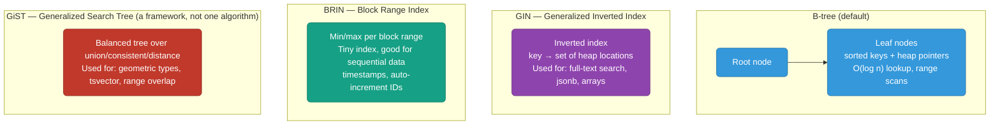

<div class="tab-group">
  <div class="tab-buttons">
    <button data-tab="btree" class="active">B-tree</button>
    <button data-tab="gin">GIN</button>
    <button data-tab="brin">BRIN</button>
    <button data-tab="gist">GiST</button>
  </div>
  <div class="tab-panels">
    <div class="tab-panel active" data-tab-panel="btree">
      <strong>Default, general-purpose.</strong> A sorted tree of keys pointing at heap rows. Handles equality and range predicates (<code>&lt;</code>, <code>&gt;</code>, <code>BETWEEN</code>) in O(log n), and can satisfy an <code>ORDER BY</code> without a separate sort. Cost: a full copy of the indexed column(s), and every write also updates the tree.
    </div>
    <div class="tab-panel" data-tab-panel="gin">
      <strong>Inverted index, for "this row contains this value."</strong> Maps each individual key — a word, a jsonb key/value pair, an array element — to the set of rows containing it. Built for full-text search, jsonb containment, and array membership: queries a B-tree can't answer efficiently because the interesting value is buried inside a composite column, not the column itself.
    </div>
    <div class="tab-panel" data-tab-panel="brin">
      <strong>Block Range Index — tiny, for naturally sorted data.</strong> Stores only a min/max per block range instead of an entry per row. Only effective when the column correlates with physical insertion order — timestamps and auto-incrementing IDs on an append-only table — because that correlation is what lets whole block ranges be skipped based on two numbers.
    </div>
    <div class="tab-panel" data-tab-panel="gist">
      <strong>Not one index type — a framework for building one.</strong> GiST (Generalized Search Tree) is a generic balanced-tree structure for data types that have no natural linear ordering, unlike B-tree's strict total order (<code>&lt;</code>, <code>=</code>, <code>&gt;</code>). An extension author implements a handful of support functions — <code>union</code> (how to summarize a subtree's contents), <code>consistent</code> (could this subtree possibly contain what I'm looking for), <code>distance</code> (for nearest-neighbor queries) — and gets a working balanced index in return, without writing any tree-balancing logic themselves. That's also why it can index things a B-tree structurally can't: "does this subtree possibly overlap the range I'm searching for" is answerable even when there's no single correct way to sort ranges into one line. Real uses: the built-in geometric types (<code>point</code>, <code>box</code>, <code>polygon</code>), full-text search over <code>tsvector</code> (a GIN alternative, better suited to frequently-updated documents), and range types (<code>int4range</code>, <code>tstzrange</code>) for overlap queries like "find all bookings overlapping this date range." PostGIS layers its own GiST-based indexes on the same framework for spatial geometry/geography types — see <a href="../system-design/geospatial-services.md">system-design/geospatial-services.md</a> for the database-level indexing tradeoffs there.
    </div>
  </div>
</div>

```sql
-- B-tree (default): equality + range on most types
CREATE INDEX idx_users_email ON users(email);

-- Partial index: only index rows matching a condition (smaller, faster)
CREATE INDEX idx_active_users ON users(email) WHERE deleted_at IS NULL;

-- Composite: multi-column (order matters — most selective first)
CREATE INDEX idx_orders_user_status ON orders(user_id, status);

-- GIN: full-text search
CREATE INDEX idx_posts_fts ON posts USING gin(to_tsvector('english', body));

-- BRIN: large append-only tables (logs, time-series)
CREATE INDEX idx_events_created ON events USING brin(created_at);

-- GiST: range overlap ("find all bookings overlapping this date range")
CREATE INDEX idx_bookings_period ON bookings USING gist(during);
SELECT * FROM bookings WHERE during && tstzrange('2026-08-01', '2026-08-05');

-- Check index usage
SELECT indexrelname, idx_scan, idx_tup_read
FROM pg_stat_user_indexes
WHERE idx_scan = 0;  -- unused indexes
```

<div class="quiz-card">
  <p class="quiz-q">You need to query "find all posts containing the word kubernetes." B-tree, GIN, or BRIN — and why?</p>
  <button class="quiz-reveal">Reveal answer</button>
  <div class="quiz-a" hidden>GIN. It's built specifically for full-text search (plus jsonb and arrays) because it inverts the index to map each token to the rows containing it — exactly what "contains this word" needs. A B-tree only helps with equality/range on the column as a whole, and BRIN is for naturally sorted large tables, not text search.</div>
</div>

<div class="quiz-card">
  <p class="quiz-q">Why can't a plain B-tree index efficiently answer "find all date ranges overlapping this one" the way GiST can?</p>
  <button class="quiz-reveal">Reveal answer</button>
  <div class="quiz-a" hidden>A B-tree needs a strict total order — every key has to sort into one line so the tree knows which branch to descend into. "Overlap" has no such consistent linear ordering: there's no single correct way to sort ranges such that adjacent-in-sort-order always means overlapping. GiST doesn't need a total order at all — its <code>consistent</code> function only has to answer "could this subtree possibly contain a match," which is answerable for overlap even without ever sorting the ranges into one sequence.</div>
</div>

---

## EXPLAIN ANALYZE

```sql
EXPLAIN (ANALYZE, BUFFERS, FORMAT TEXT)
SELECT u.name, COUNT(o.id)
FROM users u
JOIN orders o ON o.user_id = u.id
WHERE u.created_at > '2024-01-01'
GROUP BY u.id;

-- Key things to look for:
-- Seq Scan on large table → missing index
-- Nested Loop with many rows → should be Hash Join
-- Buffers: hit=X read=Y → X from cache, Y from disk
-- actual rows >> estimated rows → stale statistics (run ANALYZE)
-- cost=X..Y: X=startup cost, Y=total cost (in arbitrary units)
```

<div class="quiz-card">
  <p class="quiz-q">EXPLAIN ANALYZE shows actual rows far higher than the estimated rows for a plan step. What should you check first, and why?</p>
  <button class="quiz-reveal">Reveal answer</button>
  <div class="quiz-a" hidden>Run ANALYZE on the table. A large gap between estimated and actual rows almost always means stale statistics — the planner's row estimates were computed against an older, smaller, or differently-shaped table. Stale estimates are exactly what causes it to pick a bad plan (like a nested loop sized for a handful of rows that's now getting fed hundreds of thousands).</div>
</div>

---

## Connection Pooling

PostgreSQL creates one OS process per connection (~10MB RAM each). At 1000 connections = 10GB just for processes.

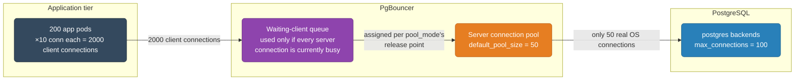

<div class="stepper">
  <div class="stepper-panels">
    <div class="stepper-panel active">
      <strong>1. Client connects to PgBouncer, not Postgres.</strong> The app pod opens a TCP connection to PgBouncer exactly like it would to Postgres directly — PgBouncer speaks the Postgres wire protocol, so the app can't tell the difference.
    </div>
    <div class="stepper-panel">
      <strong>2. PgBouncer assigns — or queues for — a real server connection.</strong> If a free connection to the actual PostgreSQL backend already exists in the pool, PgBouncer hands it over immediately. If all default_pool_size connections are checked out, the client waits in a queue instead of PgBouncer opening a 51st.
    </div>
    <div class="stepper-panel">
      <strong>3. Client and server are paired for the query/transaction.</strong> Queries are forwarded over that real connection as if the client were talking to Postgres directly.
    </div>
    <div class="stepper-panel">
      <strong>4. The connection returns to the pool.</strong> Exactly when depends on pool_mode: in transaction mode (the default here), the real connection is released back the moment the transaction commits or rolls back — not when the client disconnects — which is what lets 2000 client connections share only 50 real ones.
    </div>
  </div>
  <div class="stepper-controls">
    <button class="stepper-prev">← Prev</button>
    <span class="stepper-dots"></span>
    <span class="stepper-label"></span>
    <button class="stepper-next">Next →</button>
  </div>
</div>

<div class="toggle-switch">
  <div class="toggle-buttons">
    <button data-toggle-opt="session" class="state-warn">session</button>
    <button data-toggle-opt="transaction" class="active state-ok">transaction</button>
    <button data-toggle-opt="statement" class="state-bad">statement</button>
  </div>
  <div class="toggle-panel" data-toggle-panel="session">
    A server connection is held for the client's entire session — released only on disconnect. Safest option: session-level features like <code>SET</code>, prepared statements, and advisory locks all work exactly like a direct connection. But pooling buys nothing if clients hold idle connections open — you still need roughly one server connection per concurrent client.
  </div>
  <div class="toggle-panel active" data-toggle-panel="transaction">
    A server connection is released back to the pool as soon as the current transaction commits or rolls back — the mode used in the config below. This is what lets 2000 client connections fit into 50 real ones. Cost: session state (bare <code>SET</code>, <code>LISTEN</code>, prepared statements) doesn't reliably survive across transactions, since the next one might land on a completely different server connection.
  </div>
  <div class="toggle-panel" data-toggle-panel="statement">
    A server connection is released back to the pool after every single statement, even inside what the client thinks is one transaction. Maximizes reuse, but multi-statement transactions aren't supported at all — this mode is only viable for autocommit-style, single-statement workloads.
  </div>
</div>

```ini
# pgbouncer.ini
[pgbouncer]
pool_mode = transaction      # connection returned after each transaction (most efficient)
max_client_conn = 10000      # app pods can open many client connections
default_pool_size = 50       # actual PostgreSQL connections
reserve_pool_size = 10       # emergency pool
server_idle_timeout = 300    # close idle server connections after 5min
```

<div class="quiz-card">
  <p class="quiz-q">Why does transaction-mode pooling let 200 app pods × 10 connections each (2000 client connections) run against default_pool_size = 50 real Postgres connections?</p>
  <button class="quiz-reveal">Reveal answer</button>
  <div class="quiz-a" hidden>Because in transaction mode, a real server connection is returned to the pool the instant a transaction ends — not when the client disconnects. At any given moment, only transactions actually in flight are holding a real connection; with short, bursty transactions, 50 real connections can serve far more than 50 "open" client connections, most of which are idle between transactions.</div>
</div>

---

## Key Configuration Parameters

```ini
# postgresql.conf
shared_buffers = 4GB              # 25% of RAM for buffer pool
effective_cache_size = 12GB       # planner hint: how much OS cache is available
work_mem = 64MB                   # per-sort, per-hash operation (watch out: can multiply)
maintenance_work_mem = 512MB      # for VACUUM, CREATE INDEX, pg_restore
wal_level = replica               # needed for streaming replication
max_wal_senders = 10              # max replication connections
checkpoint_completion_target = 0.9 # spread checkpoint I/O
random_page_cost = 1.1            # SSD: set to 1.1 (same as seq scan)
effective_io_concurrency = 200    # SSD: number of concurrent I/O requests
```

---

## Query Planner — How PostgreSQL Chooses Execution Plans

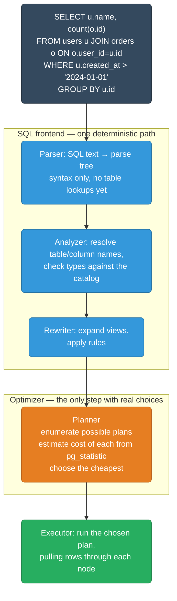

<div class="stepper">
  <div class="stepper-panels">
    <div class="stepper-panel active">
      <strong>1. Parse.</strong> Pure syntax — turns the SQL text into a parse tree with zero knowledge of whether users or orders actually exist yet.
    </div>
    <div class="stepper-panel">
      <strong>2. Analyze.</strong> Resolves every table and column name against the catalog and checks types. This is where a typo'd column or table name would error out.
    </div>
    <div class="stepper-panel">
      <strong>3. Rewrite.</strong> Expands any views referenced in the query and applies rewrite rules, so the planner downstream only ever sees plain tables.
    </div>
    <div class="stepper-panel">
      <strong>4. Plan / Optimize.</strong> The only stage that makes real choices: enumerates candidate plans — which index, which join algorithm, which join order — and picks the cheapest by the cost model (random_page_cost, seq_page_cost, cpu_tuple_cost, and row estimates from pg_statistic).
    </div>
    <div class="stepper-panel">
      <strong>5. Execute.</strong> Runs the winning plan node-by-node, pulling rows up through the tree exactly as EXPLAIN ANALYZE reports them.
    </div>
  </div>
  <div class="stepper-controls">
    <button class="stepper-prev">← Prev</button>
    <span class="stepper-dots"></span>
    <span class="stepper-label"></span>
    <button class="stepper-next">Next →</button>
  </div>
</div>

**Cost model:** The planner assigns a cost (in arbitrary units) to each plan based on:
- `seq_page_cost` (default 1.0) — cost to read a page sequentially
- `random_page_cost` (default 4.0, use 1.1 for SSDs) — cost of a random page read
- `cpu_tuple_cost` (0.01) — cost per row processed
- Row count estimates from `pg_statistic` (updated by ANALYZE)

**Why plans go wrong:**
- Stale statistics → wrong row estimates → wrong plan choice
- Run `ANALYZE table_name` after bulk loads
- `autovacuum` runs ANALYZE automatically but may lag

```sql
-- Force statistics update
ANALYZE users;

-- See planner's row estimates vs actual
EXPLAIN (ANALYZE, FORMAT TEXT) SELECT * FROM users WHERE email = 'alice@example.com';
-- rows=1 (estimate) vs rows=1 (actual) ← good
-- rows=1000 (estimate) vs rows=1 (actual) ← bad — stale stats, will choose wrong plan

-- Increase statistics target for skewed columns
ALTER TABLE orders ALTER COLUMN status SET STATISTICS 500; -- default 100
ANALYZE orders;
```

<div class="quiz-card">
  <p class="quiz-q">A table just had a 10x bulk load and ANALYZE hasn't run since. Which stage of the planner pipeline gets bad information first, and what's the downstream effect?</p>
  <button class="quiz-reveal">Reveal answer</button>
  <div class="quiz-a" hidden>The Planner stage — its cost estimates come from pg_statistic, which ANALYZE keeps current. Stale statistics mean the row-count estimates it uses to cost each candidate plan are wrong, which can make it pick a plan (like a nested loop sized for the old, smaller row count) that's badly suited to the new data volume, even though the query itself is unchanged.</div>
</div>

---

## Join Types — When Planner Uses Each

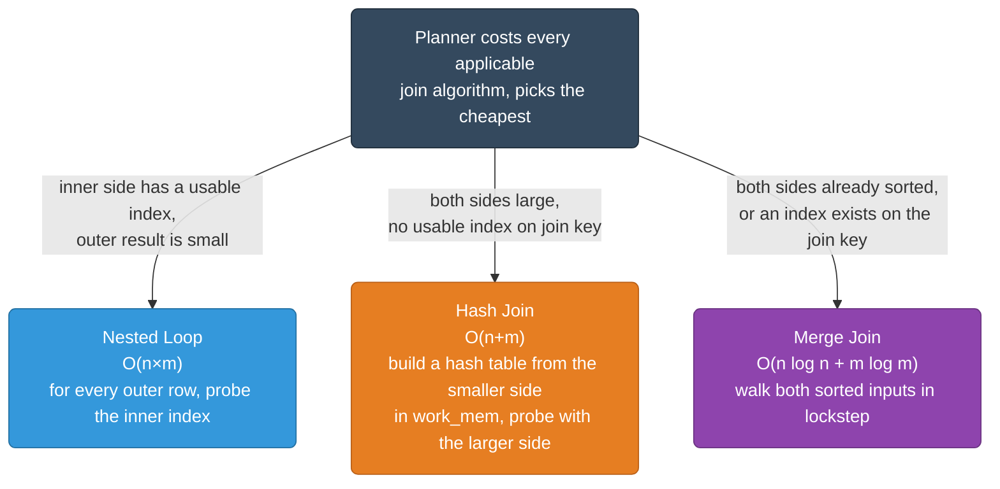

<div class="tab-group">
  <div class="tab-buttons">
    <button data-tab="nl" class="active">Nested Loop</button>
    <button data-tab="hash">Hash Join</button>
    <button data-tab="merge">Merge Join</button>
  </div>
  <div class="tab-panels">
    <div class="tab-panel active" data-tab-panel="nl">
      For every row on the outer side, probe the inner side once. Cheap only if the inner side has an index to probe (turning each probe into O(log n)) and the outer side is small — otherwise it degenerates into a full O(n×m) scan-within-a-scan, the classic "why is this simple join so slow" plan.
    </div>
    <div class="tab-panel" data-tab-panel="hash">
      Builds an in-memory hash table from the smaller input, sized by <code>work_mem</code>, then streams the larger input through it probing for matches. Good default when both sides are large and there's no index to exploit — but if the hash table doesn't fit in <code>work_mem</code>, it spills to disk and gets much slower.
    </div>
    <div class="tab-panel" data-tab-panel="merge">
      Requires both inputs sorted on the join key — either because an index already provides that order, or the planner adds an explicit sort. Walks both streams in lockstep, advancing whichever side is behind. Scales well and doesn't need anything to fit in memory the way a hash join does.
    </div>
  </div>
</div>

```sql
-- Force a specific join type for testing
SET enable_hashjoin = off;    -- disable hash joins
SET enable_nestloop = off;    -- disable nested loops
EXPLAIN SELECT ... JOIN ...;  -- see what planner picks without preferred type
SET enable_hashjoin = on;     -- always reset after testing!
```

<div class="quiz-card">
  <p class="quiz-q">A join between two large tables with no index on the join column shows up as a Hash Join in EXPLAIN. Why not Nested Loop?</p>
  <button class="quiz-reveal">Reveal answer</button>
  <div class="quiz-a" hidden>Nested Loop only stays cheap when the inner side has an index to probe — without one, every outer row would require a full scan of the inner table, an O(n×m) disaster for two large tables. Hash Join instead builds one hash table from the smaller side and does a single pass over the larger side, O(n+m) — the planner picks it precisely because there's no index to make Nested Loop viable here.</div>
</div>

---

## VACUUM and Autovacuum

PostgreSQL never updates or deletes rows in place (MVCC). Dead tuples accumulate and must be reclaimed.

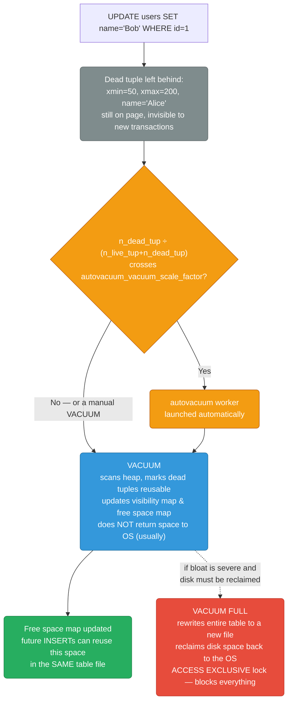

<div class="stepper">
  <div class="stepper-panels">
    <div class="stepper-panel active">
      <strong>1. Dead tuples accumulate.</strong> Every UPDATE/DELETE leaves the old row version on the page — MVCC never overwrites in place, so someone has to reclaim that space later.
    </div>
    <div class="stepper-panel">
      <strong>2. Autovacuum is triggered (or VACUUM is run manually).</strong> Autovacuum wakes up for a table once its dead-tuple ratio crosses <code>autovacuum_vacuum_scale_factor</code> (default 20%, often tuned much lower on hot tables).
    </div>
    <div class="stepper-panel">
      <strong>3. Scan and mark.</strong> VACUUM scans the heap, identifies tuples no longer visible to any active snapshot, and marks that space reusable — it also updates the visibility map (so future index-only scans can skip the heap) and the free space map.
    </div>
    <div class="stepper-panel">
      <strong>4. Space stays in the table, not the OS.</strong> A plain VACUUM lets future INSERTs/UPDATEs reuse that freed space inside the same file — it does not shrink the file or return space to the filesystem.
    </div>
    <div class="stepper-panel">
      <strong>5. VACUUM FULL, only if disk actually needs reclaiming.</strong> Rewrites the entire table into a new, compact file and swaps it in — the only path that returns disk to the OS, but it takes an ACCESS EXCLUSIVE lock that blocks all reads and writes for its duration.
    </div>
  </div>
  <div class="stepper-controls">
    <button class="stepper-prev">← Prev</button>
    <span class="stepper-dots"></span>
    <span class="stepper-label"></span>
    <button class="stepper-next">Next →</button>
  </div>
</div>

**Table bloat** — pages fill with dead tuples → table grows → queries slow (more pages to scan).

```sql
-- Check bloat
SELECT relname,
       pg_size_pretty(pg_relation_size(oid)) AS table_size,
       n_dead_tup,
       n_live_tup,
       round(100.0 * n_dead_tup / nullif(n_live_tup + n_dead_tup, 0), 1) AS dead_pct
FROM pg_stat_user_tables
WHERE n_dead_tup > 1000
ORDER BY n_dead_tup DESC;

-- Manual vacuum with verbose output
VACUUM (ANALYZE, VERBOSE) users;

-- Autovacuum thresholds (per-table override)
ALTER TABLE orders SET (
    autovacuum_vacuum_scale_factor = 0.01,  -- vacuum when 1% dead (default 20%)
    autovacuum_analyze_scale_factor = 0.005 -- analyze when 0.5% changed
);
```

<div class="quiz-card">
  <p class="quiz-q">After running plain VACUUM (not VACUUM FULL) on a heavily-updated table, the table's file on disk is exactly the same size as before. Is VACUUM broken?</p>
  <button class="quiz-reveal">Reveal answer</button>
  <div class="quiz-a" hidden>No, that's expected. Plain VACUUM marks dead tuple space as reusable for future writes inside the same file — it doesn't shrink the file or hand space back to the OS. Only VACUUM FULL rewrites the table into a smaller file and returns the freed disk space, at the cost of an ACCESS EXCLUSIVE lock for the duration.</div>
</div>

---

## Partitioning

For very large tables (100M+ rows), partitioning divides the table into smaller physical pieces.

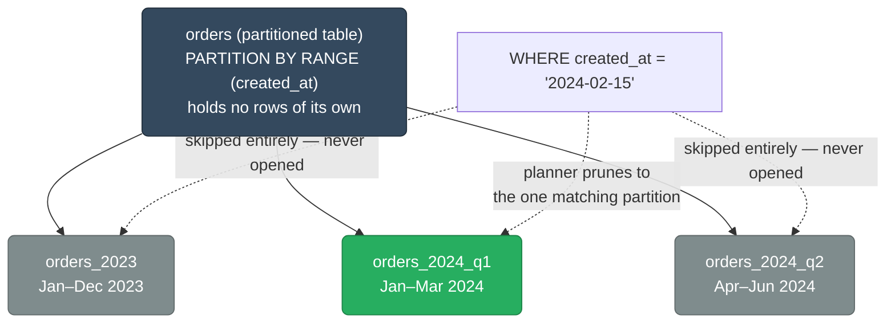

```sql
-- Declarative partitioning (PostgreSQL 10+)
CREATE TABLE orders (
    id BIGINT NOT NULL,
    user_id BIGINT,
    amount NUMERIC,
    created_at TIMESTAMPTZ NOT NULL
) PARTITION BY RANGE (created_at);

-- Create partitions
CREATE TABLE orders_2024_q1
    PARTITION OF orders
    FOR VALUES FROM ('2024-01-01') TO ('2024-04-01');

CREATE TABLE orders_2024_q2
    PARTITION OF orders
    FOR VALUES FROM ('2024-04-01') TO ('2024-07-01');

-- Query partition pruning: WHERE created_at = '2024-02-15'
-- PostgreSQL scans ONLY orders_2024_q1 — skips all other partitions
EXPLAIN SELECT * FROM orders WHERE created_at = '2024-02-15';
-- → Seq Scan on orders_2024_q1 (not the others)

-- Drop old data: drop a partition instantly (no row-by-row DELETE)
DROP TABLE orders_2023;  -- instant, reclaims disk space immediately
```

<div class="quiz-card">
  <p class="quiz-q">A query filters WHERE created_at = '2024-02-15' against the partitioned orders table above. Which partitions does PostgreSQL actually scan?</p>
  <button class="quiz-reveal">Reveal answer</button>
  <div class="quiz-a" hidden>Only orders_2024_q1. Partition pruning checks the query's WHERE clause against each partition's declared range and skips opening any partition the value can't possibly fall in — orders_2023 and orders_2024_q2 are never touched. That's the whole performance point of partitioning: the planner doesn't pay for scanning data it can already rule out.</div>
</div>

---

## Logical Replication

Streaming replication replicates everything. Logical replication lets you replicate specific tables to specific databases — useful for migrations, ETL, and multi-cloud.

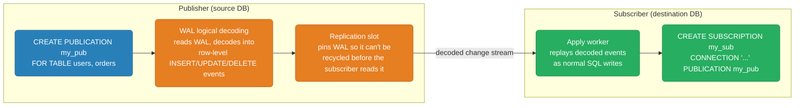

```sql
-- On source database
CREATE PUBLICATION my_pub FOR TABLE users, orders;

-- On destination database (different server, different DB)
CREATE SUBSCRIPTION my_sub
  CONNECTION 'host=source-db user=replicator dbname=myapp'
  PUBLICATION my_pub;

-- Check replication lag
SELECT subname, received_lsn, latest_end_lsn,
       received_lsn - latest_end_lsn AS lag_bytes
FROM pg_stat_subscription;
```

**Use cases:** Zero-downtime major version upgrades (replicate to new version, cut over), selective table replication to data warehouse, real-time CDC without Debezium.

<div class="quiz-card">
  <p class="quiz-q">A logical replication subscriber stops connecting for a long time. Does the publisher's normal WAL retention (max_wal_size) recycle the WAL out from under it?</p>
  <button class="quiz-reveal">Reveal answer</button>
  <div class="quiz-a" hidden>No — the replication slot pins the WAL, preventing PostgreSQL from recycling any segment the subscriber hasn't consumed yet, regardless of max_wal_size. The tradeoff is the opposite failure mode: an abandoned or badly lagging slot can make WAL accumulate indefinitely on the publisher's disk until the slot is dropped or the subscriber catches up.</div>
</div>

---

## Useful Diagnostic Queries

```sql
-- Long-running queries (> 5 minutes)
SELECT pid, now() - pg_stat_activity.query_start AS duration,
       query, state, wait_event_type, wait_event
FROM pg_stat_activity
WHERE query_start < now() - interval '5 minutes'
  AND state != 'idle'
ORDER BY duration DESC;

-- Locks and who is blocking whom
SELECT blocked.pid AS blocked_pid,
       blocked.query AS blocked_query,
       blocking.pid AS blocking_pid,
       blocking.query AS blocking_query
FROM pg_stat_activity blocked
JOIN pg_stat_activity blocking
  ON blocking.pid = ANY(pg_blocking_pids(blocked.pid));

-- Missing indexes (sequential scans on large tables)
SELECT relname, seq_scan, seq_tup_read,
       idx_scan, seq_tup_read / seq_scan AS avg_seq_tup
FROM pg_stat_user_tables
WHERE seq_scan > 0
ORDER BY seq_tup_read DESC
LIMIT 20;

-- Cache hit rate (should be > 99% for OLTP)
SELECT sum(heap_blks_hit) / (sum(heap_blks_hit) + sum(heap_blks_read)) AS cache_hit_ratio
FROM pg_statio_user_tables;

-- Table sizes including indexes and TOAST
SELECT relname,
       pg_size_pretty(pg_total_relation_size(oid)) AS total_size,
       pg_size_pretty(pg_relation_size(oid)) AS table_size,
       pg_size_pretty(pg_indexes_size(oid)) AS index_size
FROM pg_class
WHERE relkind = 'r'
ORDER BY pg_total_relation_size(oid) DESC
LIMIT 20;
```
