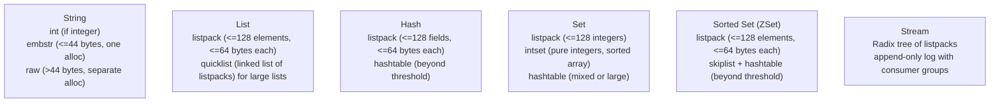
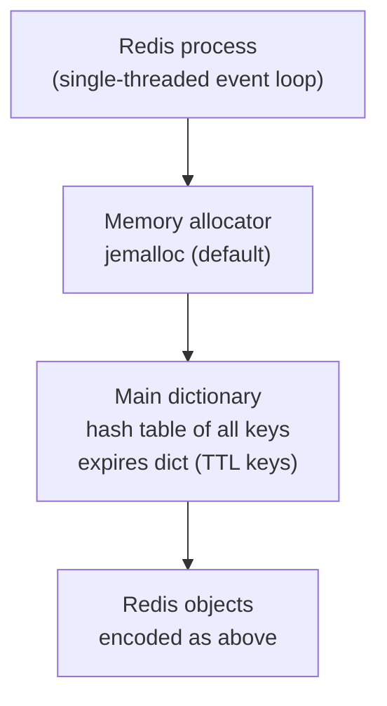
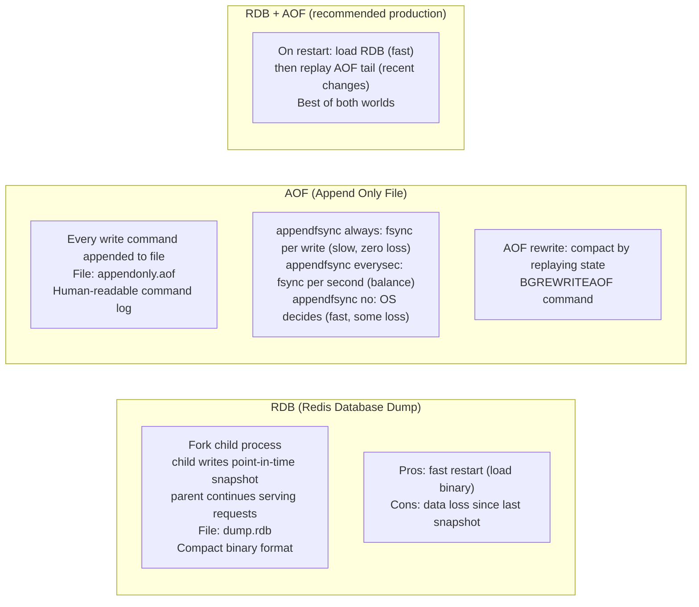
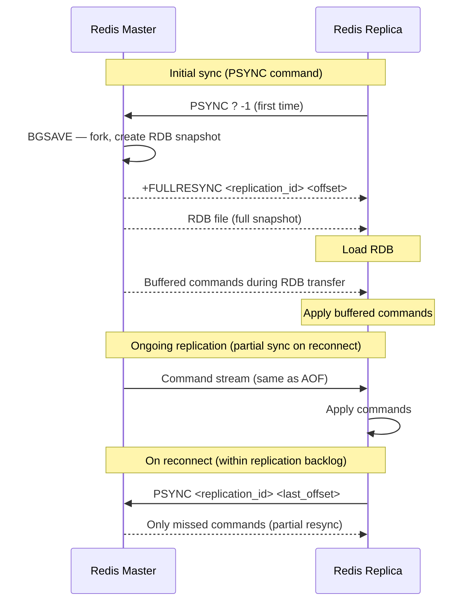
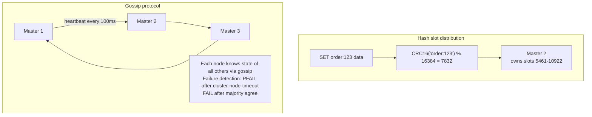
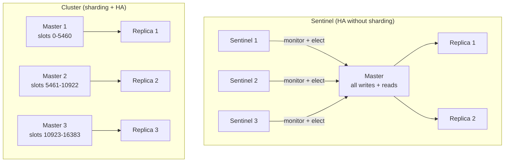

# Redis Internals

## Data Structures Under the Hood

Redis is not just a key-value store. Each data type has a specific internal encoding that changes based on size for memory efficiency.



**Why listpack first?** Dense memory layout — all elements contiguous. Cache-friendly. Converts to hashtable/skiplist when it exceeds thresholds (configurable via `hash-max-listpack-entries`).

**Skiplist for sorted sets:** O(log n) insert/delete/rank. Alternative to B-tree for in-memory sorted data. Each node has random forward pointers at multiple levels.

---

## Memory Model



**Redis is single-threaded** for command execution. I/O is handled by an event loop (like Node.js). Commands execute atomically — no two commands run concurrently.

**Since Redis 6.0:** I/O threads for reading/writing network (multi-threaded I/O), but command execution still single-threaded.

---

## Persistence: RDB vs AOF



---

## Eviction Policies

When `maxmemory` is reached, Redis uses an eviction policy:

| Policy | Behavior | Use case |
|--------|---------|---------|
| `noeviction` | Return error on writes | Never evict (critical data) |
| `allkeys-lru` | Evict least recently used key | General cache |
| `volatile-lru` | LRU among keys with TTL set | Mixed persistent + cache |
| `allkeys-lfu` | Evict least frequently used | Skewed access patterns |
| `allkeys-random` | Random eviction | Access pattern unknown |
| `volatile-ttl` | Evict key closest to expiry | TTL-managed cache |

```bash
CONFIG SET maxmemory 4gb
CONFIG SET maxmemory-policy allkeys-lru
```

---

## Replication



**Replication is asynchronous.** Replica may be behind. `WAIT numreplicas timeout` blocks until N replicas confirm offset — simulate synchronous replication.

---

## Redis Cluster Internals



**ASK vs MOVED redirects:**
- `MOVED`: key permanently lives on different node (after slot migration complete)
- `ASK`: key temporarily on different node (during slot migration) — one-time redirect

---

## Lua Scripting (Atomic Operations)

```bash
# INCR with conditional limit — atomic via Lua
EVAL "
local current = redis.call('GET', KEYS[1])
if current and tonumber(current) >= tonumber(ARGV[1]) then
    return 0
end
return redis.call('INCR', KEYS[1])
" 1 rate:user:123 100

# Lua scripts execute atomically — no race conditions between GET and INCR
```

---

## Key Metrics

```promql
# Memory usage (alert > 80% of maxmemory)
redis_memory_used_bytes / redis_memory_max_bytes > 0.8

# Hit rate (alert < 90%)
rate(redis_keyspace_hits_total[5m]) /
(rate(redis_keyspace_hits_total[5m]) + rate(redis_keyspace_misses_total[5m])) < 0.9

# Replication lag
redis_connected_slaves < 1

# Evicted keys per second (should be 0 for non-cache workloads)
rate(redis_evicted_keys_total[1m]) > 0

# Command latency
redis_commands_duration_seconds_total / redis_commands_processed_total > 0.001
```

---

## Pub/Sub

```bash
# Publisher
PUBLISH notifications '{"type":"order_paid","id":"123"}'

# Subscriber (blocks waiting for messages)
SUBSCRIBE notifications
# Or pattern-subscribe
PSUBSCRIBE order.*    # matches order.paid, order.cancelled, etc.
```

Pub/Sub is fire-and-forget — messages are lost if no subscriber is connected. For durability use **Streams** instead.

---

## Redis Streams (Persistent Message Queue)

```bash
# Producer: append to stream
XADD orders * user_id 123 amount 99.99 status paid
# Returns: "1700000000000-0" (auto-generated ID: timestamp-sequence)

# Consumer group: multiple consumers, each gets different messages
XGROUP CREATE orders payments $ MKSTREAM

# Consumer reads (and acknowledges)
XREADGROUP GROUP payments consumer-1 COUNT 10 BLOCK 0 STREAMS orders >
# > means: give me undelivered messages for this consumer
XACK orders payments 1700000000000-0  # mark as processed

# Re-deliver messages not acknowledged after 30 seconds
XAUTOCLAIM orders payments consumer-1 30000 0-0

# Check pending (unacknowledged) messages
XPENDING orders payments - + 10
```

Streams = persistent, ordered, consumer groups, exactly-once delivery. Much more powerful than Pub/Sub.

---

## Sentinel vs Cluster



| | Sentinel | Cluster |
|--|---------|---------|
| Sharding | No — single dataset | Yes — 16384 hash slots |
| Max memory | Single node | N × node memory |
| Multi-key ops | Full support | Only within same slot |
| Failover | Sentinel-orchestrated (~15s) | Gossip-based (~15s) |
| Use when | Dataset fits one node | Dataset needs horizontal scale |

---

## WAIT Command — Synchronous Replication

```bash
# Ensure at least N replicas have received writes before returning
SET key value
WAIT 1 1000  # wait for 1 replica, timeout 1000ms
# Returns: number of replicas that ACKed

# Simulate synchronous replication for critical writes
SET account:alice:balance 500
WAIT 1 500  # 0-RTT usually, blocks if replica is lagging
```

---

## Key Expiry Internals

Redis uses two mechanisms to expire keys:
1. **Lazy expiry:** checks TTL only when the key is accessed — no CPU cost, but expired keys linger in memory
2. **Active expiry:** background job samples 20 random keys every 100ms, deletes expired ones, repeats if >25% were expired

Consequence: a key's TTL can expire but the key still occupies memory until accessed or the background job finds it. For memory-sensitive workloads, use `maxmemory-policy` to force eviction.

---

## Pipeline and MULTI/EXEC

```bash
# Pipelining: send multiple commands without waiting for responses
# (network optimization — reduces round trips)
redis-cli --pipe << 'EOF'
SET key1 val1
SET key2 val2
INCR counter
EOF

# Transactions: atomic execution of multiple commands
MULTI
  SET account:alice 500
  SET account:bob 300
  INCR tx_counter
EXEC
# All three execute atomically — no other client's commands interleaved
# Unlike DB transactions: no rollback on command error (EXEC always runs all)
```

---

## Debugging and Profiling

```bash
# Real-time command monitor (like tcpdump for Redis)
redis-cli MONITOR
# Shows every command as it arrives — use briefly, high overhead

# Slow log (commands > slowlog-log-slower-than microseconds)
redis-cli CONFIG SET slowlog-log-slower-than 10000  # 10ms
redis-cli SLOWLOG GET 10
# 1) 1) (integer) 14          # log entry ID
#    2) (integer) 1700000000  # timestamp
#    3) (integer) 15000       # execution time (microseconds)
#    4) 1) "KEYS"             # command + args (KEYS is O(n) — never use in prod)
#       2) "*"

# Memory analysis
redis-cli MEMORY USAGE mykey         # bytes used by one key
redis-cli MEMORY DOCTOR               # automated analysis
redis-cli --bigkeys                   # scan for large keys (run off-peak)
redis-cli --memkeys                   # sample keys by memory usage
```

---

## Cluster Failure Modes

### Slot coverage loss — the cluster goes read-only

Redis Cluster requires all 16384 hash slots to be covered by a reachable master. If a master goes down AND its replica fails to be promoted (or there is no replica), those slots become unavailable. The cluster refuses writes to uncovered slots.

```bash
# Check cluster health
redis-cli -h redis-node-1 -p 6379 CLUSTER INFO
# cluster_state:ok        ← healthy
# cluster_state:fail      ← one or more slots uncovered

# Find which slots are uncovered
redis-cli -h redis-node-1 -p 6379 CLUSTER NODES | grep fail
# <node-id> <ip>:6379 master,fail - ...   ← failed master

# Manual failover (if replica is running but hasn't promoted)
redis-cli -h <replica-host> -p 6379 CLUSTER FAILOVER
# or force (ignores replication lag — may lose recent writes)
redis-cli -h <replica-host> -p 6379 CLUSTER FAILOVER FORCE
```

**Recovery checklist:**
```bash
# After failed node comes back
redis-cli -h redis-node-1 CLUSTER MEET <recovered-node-ip> 6379
redis-cli -h redis-node-1 CLUSTER REPLICATE <new-master-id>
# Resync: node downloads full RDB from master (can take minutes for large datasets)
redis-cli -h <recovered-node> REPLICATION  # watch master_sync_in_progress
```

### Split-brain — cluster partitioned

Redis Cluster prevents split-brain by requiring quorum (majority of masters) to elect new masters. With 6 nodes (3 masters + 3 replicas), losing one AZ means:
- 1 master unreachable → its replica promotes ✓
- 2 masters unreachable (minority) → quorum lost → cluster goes down ✗

```
3-master cluster loses 2 masters simultaneously:
  Masters remaining: 1 (cannot form quorum of 2 out of 3)
  Result: cluster_state:fail, writes rejected
  Fix: multi-AZ with odd number of masters ≥ 3
```

**Multi-AZ layout for resilience:**
```
AZ-a: master-1 (slots 0-5460)    + replica-4
AZ-b: master-2 (slots 5461-10922) + replica-5
AZ-c: master-3 (slots 10923-16383) + replica-6
# Replicas are in DIFFERENT AZ from their master
# AZ loss takes one master and one replica (for a different master)
# Quorum of 2 masters remains → cluster stays up
```

### Hot key problem

A hot key is a single key receiving a disproportionate share of traffic. In Redis Cluster, a hot key maps to one slot → one master → that node becomes the bottleneck.

**Detection:**
```bash
# redis-cli hot key analysis (requires maxmemory-policy != noeviction)
redis-cli -h redis-node-1 --hotkeys
# OUTPUT: hot key 'user:session:12345' - freq: 50000/sec

# Monitor in real time
redis-cli -h redis-node-1 MONITOR | grep "GET\|SET" | head -100
# Warning: MONITOR is O(n) per command, use sparingly in production

# Use redis-cell or keydb for rate info
redis-cli -h redis-node-1 OBJECT FREQ <keyname>   # LFU policy only
```

**Solutions:**

```
1. Client-side caching (Redis 6+ tracking mode)
   Client caches value locally; server sends invalidation when key changes
   → reduces hot key traffic by 90%+ for mostly-read keys

2. Key sharding — append suffix to spread across slots
   "user:session" → "user:session:{0}", "user:session:{1}", ..., "user:session:{N}"
   Client randomly picks a shard; reads from any, writes to all
   → N shards = N nodes share the load
   N = 10-50 for very hot keys

3. Local in-process cache (L1)
   Store hot key in application memory (sync with Redis TTL)
   → near-zero latency, no network, but stale by TTL window

4. Read replicas
   READONLY command on replica allows reads
   → distributes read traffic across replica + master
   redis-cli -h <replica> READONLY
   GET user:session:12345   # served by replica
```

```python
# Python: client-side sharding for hot key
import hashlib, random

def hot_key_get(redis_client, base_key: str, shards: int = 10) -> str:
    shard = random.randint(0, shards - 1)
    return redis_client.get(f"{base_key}:{shard}")

def hot_key_set(redis_client, base_key: str, value: str, shards: int = 10):
    pipe = redis_client.pipeline()
    for i in range(shards):
        pipe.set(f"{base_key}:{i}", value, ex=300)
    pipe.execute()
```

### Sentinel vs Cluster — decision guide

| | Sentinel | Cluster |
|---|---|---|
| Use case | Single dataset, HA failover | Horizontal scale + HA |
| Data sharding | No (all nodes have full dataset) | Yes (16384 hash slots) |
| Scale-out | No | Yes — add masters for more capacity |
| Multi-key ops | All keys work | Keys must be in same slot (use hash tags `{user}`) |
| Complexity | Low | High |
| Min nodes | 3 Sentinels + 1 master + 1 replica | 6 nodes (3 master + 3 replica) |
| Failover time | ~30s (default) | ~15s (faster gossip-based) |
| When to use | <100GB dataset, simplicity preferred | >100GB or >1M ops/sec |

**Hash tags for multi-key ops in cluster:**
```
Without hash tag:
  MGET user:1:name user:1:email  → may be on different slots → CROSSSLOT error

With hash tag (curly braces define the slot key):
  MGET {user:1}:name {user:1}:email  → both hash to "user:1" → same slot → works
```
