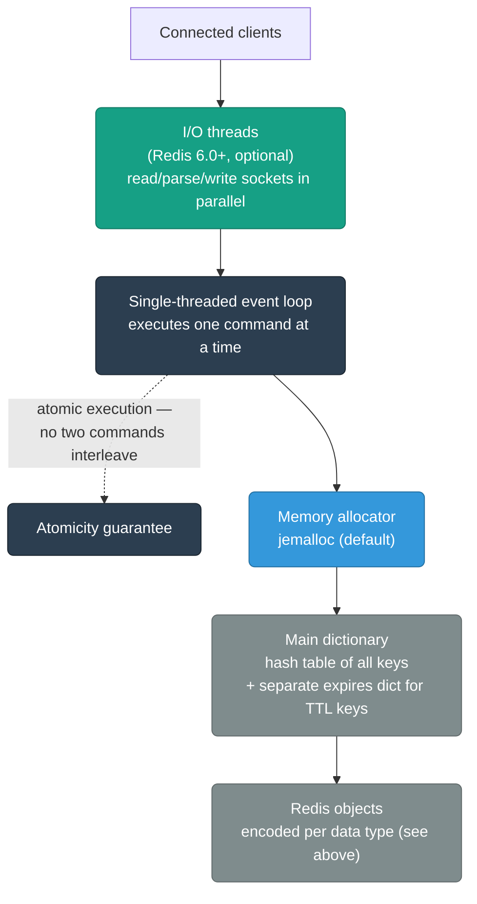
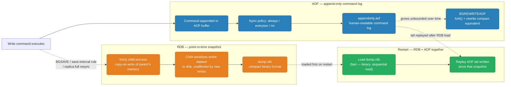
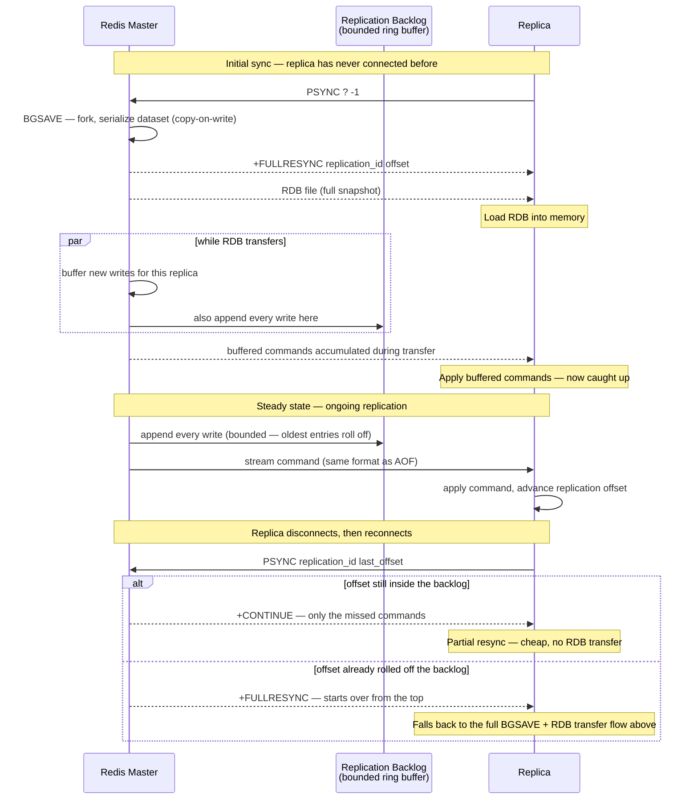
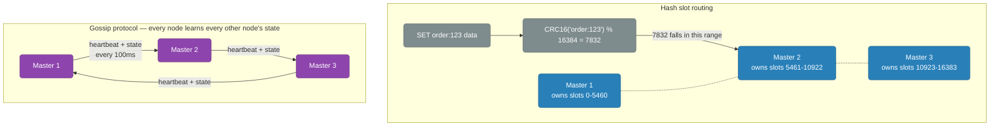
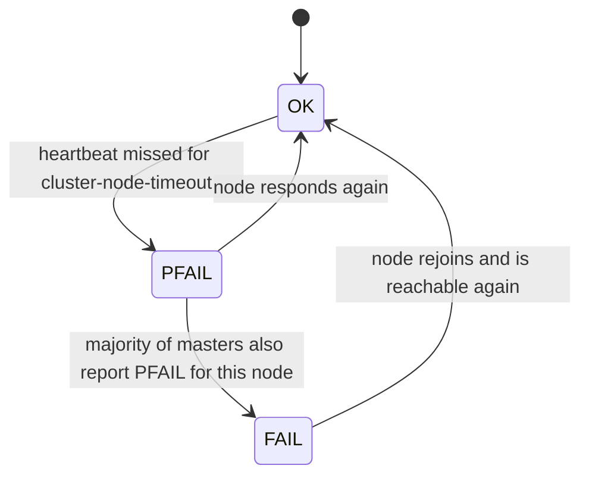
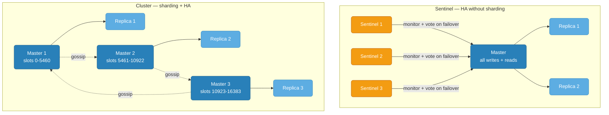
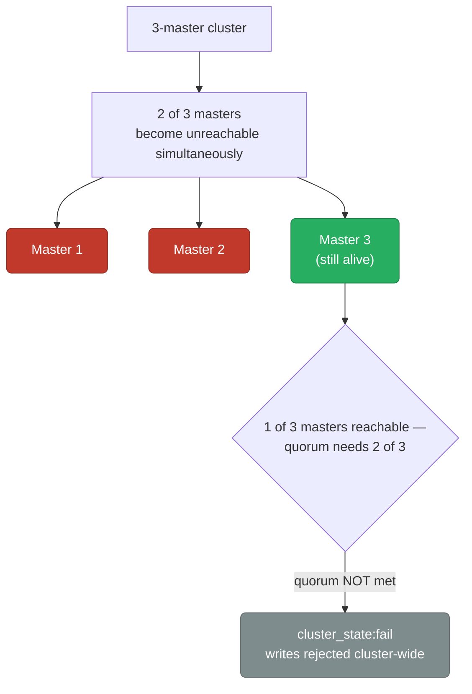
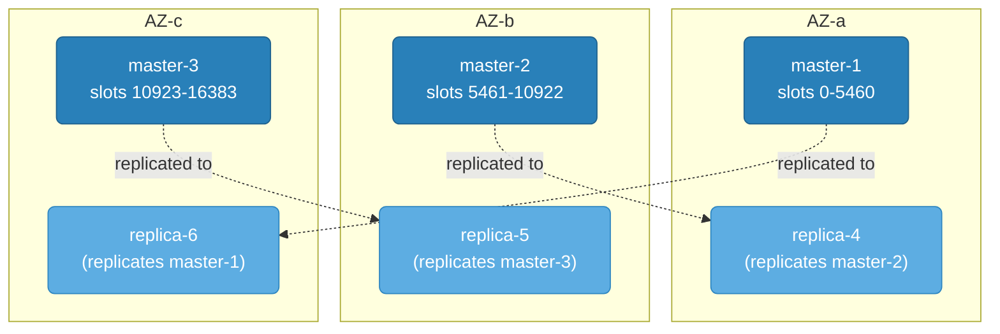

# Redis Internals

How Redis actually stores data in memory, decides what to evict, persists it to disk, and keeps replicas and cluster nodes in sync underneath the command you type into `redis-cli` — the per-type internal encodings, the fork-based persistence model, and the failure-mode arithmetic that decides whether a cluster keeps serving traffic through a node or an AZ loss.

<div class="quiz-progress" data-quiz-progress>
  <span class="quiz-progress-label">0/0 checks</span>
  <span class="quiz-progress-bar"><span class="quiz-progress-fill"></span></span>
</div>

---

## Data Structures Under the Hood

Redis is not just a key-value store. Each data type has a specific internal encoding that changes based on size for memory efficiency.

```mermaid
graph TD
    classDef compact fill:#27ae60,stroke:#1e8449,color:#fff,rx:6
    classDef general fill:#2980b9,stroke:#1f618d,color:#fff,rx:6
    classDef stream fill:#8e44ad,stroke:#6c3483,color:#fff,rx:6

    subgraph STR["String"]
        SINT["int<br/>value fits in a long"]:::compact
        SEMB["embstr<br/>&lt;=44 bytes, one allocation"]:::compact
        SRAW["raw<br/>&gt;44 bytes, separate allocation"]:::general
    end

    subgraph LST["List"]
        LLP["listpack<br/><=128 elements, <=64 bytes each"]:::compact
        LQL["quicklist<br/>linked list of listpacks"]:::general
        LLP -->|"exceeds list-max-listpack-size"| LQL
    end

    subgraph HSH["Hash"]
        HLP["listpack<br/><=128 fields, <=64 bytes each"]:::compact
        HHT["hashtable<br/>beyond threshold"]:::general
        HLP -->|"exceeds hash-max-listpack-entries"| HHT
    end

    subgraph ST["Set"]
        SIS["intset<br/>pure integers, sorted array"]:::compact
        SLP["listpack<br/><=128 small mixed elements"]:::compact
        SHT["hashtable<br/>mixed types or large"]:::general
        SIS -->|"non-integer element added"| SLP
        SLP -->|"exceeds set-max-listpack-entries"| SHT
    end

    subgraph ZS["Sorted Set (ZSet)"]
        ZLP["listpack<br/><=128 elements, <=64 bytes each"]:::compact
        ZSK["skiplist + hashtable<br/>beyond threshold"]:::general
        ZLP -->|"exceeds zset-max-listpack-entries"| ZSK
    end

    subgraph STM["Stream"]
        STRD["Radix tree of listpacks<br/>append-only log with consumer groups"]:::stream
    end
```



**Why listpack first?** Dense memory layout — all elements contiguous. Cache-friendly. Converts to hashtable/skiplist when it exceeds thresholds (configurable via `hash-max-listpack-entries`).

**Skiplist for sorted sets:** O(log n) insert/delete/rank. Alternative to B-tree for in-memory sorted data. Each node has random forward pointers at multiple levels.

<div class="quiz-card">
  <p class="quiz-q">Why does Redis bother with a compact listpack encoding at all instead of every collection type just using its general-purpose encoding (hashtable/skiplist/quicklist) from the start?</p>
  <button class="quiz-reveal">Reveal answer</button>
  <div class="quiz-a" hidden>Listpacks pack every element contiguously in one memory block — no per-element pointers or allocation overhead — which is both more memory-efficient and more cache-friendly than a hashtable or skiplist for small collections. The tradeoff is that operations on a listpack are effectively linear scans, so it only stays cheap below the configured size thresholds; Redis automatically converts to the general-purpose encoding once a collection outgrows them, trading memory density for algorithmic efficiency at scale.</div>
</div>

### Incremental rehashing: growing the hashtable without a latency spike

Once a hash (or Redis's own top-level keyspace dict, which is the same `dict` structure under the hood) is in `hashtable` mode, it keeps growing as more entries land in it. Growing a hashtable normally means allocating a bigger array and rehashing every existing key into it — for a dict with millions of keys, doing that in one blocking pass would stall every client for however long the full rehash takes, an O(n) latency spike landing on whichever unlucky command happened to trigger it.

Redis avoids that by rehashing incrementally. When the load factor crosses its threshold, it allocates a second table double the size of the first and keeps **both tables alive at once** instead of rehashing everything up front. From that point on, every read or write that touches the dict does a small amount of extra work first: it migrates exactly one bucket from the old table into the new one, then proceeds with whatever operation was actually requested. A cursor tracks which old-table bucket is migrated next, so the work marches forward one bucket per operation until the old table is fully drained, at which point it's freed and the new table becomes the only table. If the server is otherwise idle, a periodic cron job (`serverCron`) also nudges the migration along so a quiet keyspace still finishes a rehash in the background rather than waiting indefinitely for the next command. While a rehash is in progress, lookups have to check both tables — new writes go straight to the new table, but a key inserted before the rehash started might still be sitting in either one, so a `GET` can't skip the old table until migration is finished.

This is the mechanism that keeps Redis's per-command complexity at amortized O(1) even while a hashtable is actively resizing — the cost of moving the whole table is spread thinly across every subsequent operation instead of paid all at once, so no single command ever pays for more than one bucket's worth of migration.

<div class="quiz-card">
  <p class="quiz-q">While a hashtable is mid-rehash, why does a lookup have to check both the old and new tables instead of just the new one?</p>
  <button class="quiz-reveal">Reveal answer</button>
  <div class="quiz-a" hidden>Migration only moves one bucket per operation, so at any point during a rehash most of the old table's keys haven't been migrated yet — only whichever buckets the cursor has already passed. A key inserted before the rehash started could still be sitting in an unmigrated old-table bucket, so skipping the old table would produce false misses until the whole migration finishes.</div>
</div>

Try it below: the load factor here is total keys divided by the old table's bucket count, and it's set to trigger a rehash the moment it exceeds 1.0, doubling the bucket count each time. Insert enough keys and Search mid-rehash to see both tables checked and the migration cursor advance one bucket per operation.

<div class="structure-viz" id="redis-rehash-viz">
  <svg class="viz-canvas" viewBox="0 0 640 200"></svg>
  <div class="viz-controls">
    <input class="viz-input" type="text" placeholder="key" />
    <button class="viz-btn" data-viz-action="insert">Insert</button>
    <button class="viz-btn" data-viz-action="search">Search</button>
    <button class="viz-btn" data-viz-action="reset">Reset</button>
  </div>
  <div class="viz-status"></div>
  <div class="viz-legend">
    <span><span class="viz-swatch" style="background:#1e3a8a"></span> bucket with keys</span>
    <span><span class="viz-swatch" style="background:#14532d"></span> just inserted / just migrated into</span>
    <span><span class="viz-swatch" style="background:#78350f"></span> found by last search</span>
    <span><span class="viz-swatch" style="background:#7f1d1d"></span> just migrated out (old bucket, now empty)</span>
  </div>
</div>

<script>
(function () {
  const svgNS = 'http://www.w3.org/2000/svg';
  const root0 = document.getElementById('redis-rehash-viz');
  const svg = root0.querySelector('.viz-canvas');
  const input = root0.querySelector('.viz-input');
  const status = root0.querySelector('.viz-status');

  const SEED_KEYS = ['alpha', 'beta', 'gamma'];
  const CELL_W = 88, CELL_H = 42, GAP = 12;

  let oldTable, newTable, rehashing, rehashCursor, hasRehashedOnce;
  // Flash state, purely for narration/highlighting -- the real dict doesn't
  // track any of this, it's added only so the visualizer can point at what
  // just happened.
  let flashOldRemoved, flashNewReceived, flashInsertLoc, flashSearchLoc, flashTimer;

  function hashKey(str) {
    let h = 5381;
    for (let i = 0; i < str.length; i++) h = ((h * 33) ^ str.charCodeAt(i)) >>> 0;
    return h >>> 0;
  }

  function makeBuckets(n) { return Array.from({ length: n }, () => []); }

  function totalKeys(table) { return table.reduce((s, b) => s + b.length, 0); }

  function containsKey(key) {
    const oldPos = hashKey(key) % oldTable.length;
    if (oldTable[oldPos].includes(key)) return true;
    if (newTable) {
      const newPos = hashKey(key) % newTable.length;
      if (newTable[newPos].includes(key)) return true;
    }
    return false;
  }

  // Migrates exactly one bucket of oldTable into newTable, advancing the
  // cursor. If this finishes the last bucket, the rehash completes: oldTable
  // becomes newTable, newTable is cleared, rehashing flips off. Returns null
  // if not currently rehashing.
  function migrateOneBucket() {
    if (!rehashing) return null;
    const idx = rehashCursor;
    const bucket = oldTable[idx];
    const movedCount = bucket.length;
    const receivedPositions = new Set();
    for (const key of bucket) {
      const pos = hashKey(key) % newTable.length;
      newTable[pos].push(key);
      receivedPositions.add(pos);
    }
    oldTable[idx] = [];
    rehashCursor++;
    let completed = false;
    if (rehashCursor >= oldTable.length) {
      oldTable = newTable;
      newTable = null;
      rehashing = false;
      rehashCursor = 0;
      completed = true;
    }
    return { migratedIndex: idx, movedCount, completed, receivedPositions };
  }

  function doInsert(key) {
    const already = containsKey(key);
    let migrationInfo = null;
    let insertedInto, bucket, startedRehash = false;

    if (rehashing) {
      migrationInfo = migrateOneBucket();
      const activeTable = rehashing ? newTable : oldTable;
      bucket = hashKey(key) % activeTable.length;
      if (!already) activeTable[bucket].push(key);
      insertedInto = rehashing ? 'new' : 'old';
    } else {
      bucket = hashKey(key) % oldTable.length;
      if (!already) oldTable[bucket].push(key);
      insertedInto = 'old';
      const lf = totalKeys(oldTable) / oldTable.length;
      if (lf > 1.0) {
        newTable = makeBuckets(oldTable.length * 2);
        rehashing = true;
        rehashCursor = 0;
        startedRehash = true;
      }
    }

    flashOldRemoved = migrationInfo ? migrationInfo.migratedIndex : null;
    flashNewReceived = migrationInfo ? migrationInfo.receivedPositions : new Set();
    flashInsertLoc = already ? null : { table: insertedInto, bucket };
    flashSearchLoc = null;
    if (migrationInfo) hasRehashedOnce = true;
    if (startedRehash) hasRehashedOnce = true;

    const parts = [];
    if (migrationInfo) {
      parts.push(`migrated bucket ${migrationInfo.migratedIndex} of old table (${migrationInfo.movedCount} key(s) moved)`);
      if (migrationInfo.completed) parts.push('rehash complete — old table retired, new table is now the only table');
    }
    if (already) {
      parts.push(`"${key}" was already present — no duplicate stored`);
    } else if (insertedInto === 'new') {
      parts.push(`inserted "${key}" directly into the new table, bucket ${bucket} (live writes go straight to the new table during a rehash)`);
    } else {
      parts.push(`inserted "${key}" into bucket ${bucket}`);
    }
    if (startedRehash) {
      parts.push(`load factor exceeded 1.0 — starting rehash to ${newTable.length} buckets`);
    }
    setStatus(parts.join(' — '), 'ok');
  }

  function doSearch(key) {
    let migrationInfo = null;
    if (rehashing) migrationInfo = migrateOneBucket();

    flashOldRemoved = migrationInfo ? migrationInfo.migratedIndex : null;
    flashNewReceived = migrationInfo ? migrationInfo.receivedPositions : new Set();
    flashInsertLoc = null;
    if (migrationInfo) hasRehashedOnce = true;

    const oldPos = hashKey(key) % oldTable.length;
    let result;
    if (oldTable[oldPos].includes(key)) {
      result = { found: true, table: 'old', bucket: oldPos };
    } else if (newTable && newTable[hashKey(key) % newTable.length].includes(key)) {
      result = { found: true, table: 'new', bucket: hashKey(key) % newTable.length };
    } else {
      result = { found: false };
    }
    flashSearchLoc = result.found ? { table: result.table, bucket: result.bucket } : null;

    const parts = [];
    if (migrationInfo) {
      parts.push(`migrated bucket ${migrationInfo.migratedIndex} of old table (${migrationInfo.movedCount} key(s) moved)`);
      if (migrationInfo.completed) parts.push('rehash complete — old table retired');
    }
    if (result.found) {
      parts.push(`"${key}" found in the ${result.table} table, bucket ${result.bucket}`);
    } else {
      parts.push(`"${key}" not found in either table`);
    }
    setStatus(parts.join(' — '), result.found ? 'ok' : 'error');
  }

  function reset() {
    oldTable = makeBuckets(4);
    newTable = null;
    rehashing = false;
    rehashCursor = 0;
    hasRehashedOnce = false;
    flashOldRemoved = null;
    flashNewReceived = new Set();
    flashInsertLoc = null;
    flashSearchLoc = null;
    for (const k of SEED_KEYS) {
      const pos = hashKey(k) % oldTable.length;
      oldTable[pos].push(k);
    }
  }

  function setStatus(msg, kind) {
    status.textContent = msg;
    status.className = 'viz-status' + (kind === 'ok' ? ' viz-status-ok' : kind === 'error' ? ' viz-status-error' : '');
  }

  function el(tag, attrs) {
    const e = document.createElementNS(svgNS, tag);
    for (const k in attrs) e.setAttribute(k, attrs[k]);
    return e;
  }

  function drawRow(table, which, yTop, label) {
    const rowEls = [];
    const labelEl = el('text', { x: 10, y: yTop - 12 });
    labelEl.setAttribute('class', 'viz-label-dim');
    labelEl.setAttribute('text-anchor', 'start');
    labelEl.textContent = label;
    rowEls.push(labelEl);

    table.forEach((bucket, i) => {
      const x = GAP + i * (CELL_W + GAP);
      const occupied = bucket.length > 0;
      let cls = occupied ? 'viz-node' : 'viz-edge';
      let fillOpacity = occupied ? '1' : '0';
      let dash = occupied ? '' : '4,3';

      const isRemoved = which === 'old' && flashOldRemoved === i;
      const isReceived = which === 'new' && flashNewReceived && flashNewReceived.has(i);
      const isInsertLoc = flashInsertLoc && flashInsertLoc.table === which && flashInsertLoc.bucket === i;
      const isSearchHit = flashSearchLoc && flashSearchLoc.table === which && flashSearchLoc.bucket === i;

      if (isInsertLoc || isReceived) { cls = 'viz-node-new'; fillOpacity = '1'; dash = ''; }
      else if (isSearchHit) { cls = 'viz-node-highlight'; fillOpacity = '1'; dash = ''; }
      else if (isRemoved) { cls = 'viz-node-removing'; fillOpacity = '1'; dash = ''; }

      rowEls.push(el('rect', {
        x, y: yTop, width: CELL_W, height: CELL_H, rx: 6,
        class: cls, 'fill-opacity': fillOpacity, 'stroke-dasharray': dash,
      }));

      const idxLabel = el('text', { x: x + CELL_W / 2, y: yTop - 4 });
      idxLabel.setAttribute('class', 'viz-label-dim');
      idxLabel.textContent = 'bucket ' + i;
      rowEls.push(idxLabel);

      const contentText = el('text', { x: x + CELL_W / 2, y: yTop + CELL_H / 2 });
      contentText.setAttribute('style', 'font-size:9px');
      contentText.textContent = occupied ? bucket.join(', ') : (isRemoved ? '(just emptied)' : '(empty)');
      rowEls.push(contentText);
    });

    return rowEls;
  }

  function draw() {
    const oldCount = oldTable.length;
    const newCount = newTable ? newTable.length : 0;
    const maxCols = Math.max(oldCount, newCount, 1);
    const width = maxCols * (CELL_W + GAP) + GAP;
    const showNewRow = hasRehashedOnce;
    const height = showNewRow ? 190 : 90;
    svg.setAttribute('viewBox', `0 0 ${width} ${height}`);
    while (svg.firstChild) svg.removeChild(svg.firstChild);

    drawRow(oldTable, 'old', 30, `Old table (${oldCount} buckets)`).forEach((e) => svg.appendChild(e));

    if (showNewRow) {
      if (newTable) {
        drawRow(newTable, 'new', 130, `New table (${newCount} buckets)`).forEach((e) => svg.appendChild(e));
      } else {
        const t = el('text', { x: width / 2, y: 150 });
        t.setAttribute('class', 'viz-label-dim');
        t.textContent = 'New table — no rehash currently in progress';
        svg.appendChild(t);
      }
    }
  }

  function scheduleFlashClear() {
    clearTimeout(flashTimer);
    flashTimer = setTimeout(() => {
      flashOldRemoved = null;
      flashNewReceived = new Set();
      flashInsertLoc = null;
      flashSearchLoc = null;
      draw();
    }, 2400);
  }

  root0.querySelector('[data-viz-action="insert"]').addEventListener('click', () => {
    const key = input.value.trim();
    if (!key) { setStatus('Enter a key first.', 'error'); return; }
    doInsert(key);
    input.value = '';
    draw();
    scheduleFlashClear();
  });

  root0.querySelector('[data-viz-action="search"]').addEventListener('click', () => {
    const key = input.value.trim();
    if (!key) { setStatus('Enter a key first.', 'error'); return; }
    doSearch(key);
    draw();
    scheduleFlashClear();
  });

  root0.querySelector('[data-viz-action="reset"]').addEventListener('click', () => {
    reset();
    setStatus('Reset — 4-bucket old table with alpha, beta, gamma pre-loaded.', '');
    draw();
  });

  reset();
  setStatus('Loaded: 4-bucket old table with alpha, beta, gamma pre-loaded. Insert a few more keys to push the load factor past 1.0 and trigger a rehash.', '');
  draw();
})();
</script>

---

## Memory Model



**Redis is single-threaded** for command execution. I/O is handled by an event loop (like Node.js). Commands execute atomically — no two commands run concurrently.

**Since Redis 6.0:** I/O threads for reading/writing network (multi-threaded I/O), but command execution still single-threaded.

<div class="toggle-switch">
  <div class="toggle-buttons">
    <button data-toggle-opt="pre6" class="active">Redis &lt; 6.0</button>
    <button data-toggle-opt="post6" class="state-ok">Redis 6.0+</button>
  </div>
  <div class="toggle-panel active" data-toggle-panel="pre6">
    A single thread does everything: reads the request off the socket, parses it, executes the command, and writes the response back. Simple to reason about, but a network-bound workload (many small commands, many connections) can bottleneck on socket I/O before the CPU doing command execution is anywhere near saturated.
  </div>
  <div class="toggle-panel" data-toggle-panel="post6">
    Dedicated I/O threads (<code>io-threads</code> in config) parallelize the socket read/parse and write-response work across multiple cores. Command <em>execution</em> itself is unchanged — it still happens one command at a time on the single main thread. This raises the throughput ceiling for network-bound workloads without touching Redis's atomicity guarantees at all.
  </div>
</div>

<div class="quiz-card">
  <p class="quiz-q">Redis 6.0 added multi-threaded I/O. Does that mean two INCR commands on the same key can now execute concurrently and race?</p>
  <button class="quiz-reveal">Reveal answer</button>
  <div class="quiz-a" hidden>No. The I/O threads only parallelize reading requests off the socket and writing responses back — the actual interpretation and execution of every command still happens on the single main thread, one at a time. Atomicity is completely unchanged by multi-threaded I/O; it only raises the ceiling on how fast Redis can move bytes in and out over the network.</div>
</div>

---

## Persistence: RDB vs AOF

Redis offers two independent persistence mechanisms — a point-in-time snapshot (RDB) and a replayable write log (AOF) — and they solve different halves of the durability problem: RDB gives a fast-to-load, compact on-disk image; AOF gives a much smaller recovery window at the cost of a slower reload.



### RDB: fork + save, step by step

<div class="stepper">
  <div class="stepper-panels">
    <div class="stepper-panel active">
      <strong>1. BGSAVE triggers.</strong> Manually, on a configured <code>save</code> interval rule, or because a replica just asked for a full resync.
    </div>
    <div class="stepper-panel">
      <strong>2. Redis calls fork().</strong> The child process gets a copy-on-write view of the parent's entire address space at that instant — no data is actually duplicated yet; both processes share the same physical memory pages.
    </div>
    <div class="stepper-panel">
      <strong>3. Child writes the snapshot.</strong> It walks the dataset and serializes it to a temporary file. The parent keeps serving reads and writes on its own event loop the whole time, unaffected beyond having forked.
    </div>
    <div class="stepper-panel">
      <strong>4. Copy-on-write kicks in.</strong> Any key the parent modifies after the fork causes the OS to duplicate just that one memory page before the write lands — the child's "dataset at fork time" view is preserved page by page, not by copying everything upfront.
    </div>
    <div class="stepper-panel">
      <strong>5. Atomic swap.</strong> The child finishes, atomically renames the temp file to <code>dump.rdb</code>, then exits. The parent detects the exit and records the last save result.
    </div>
  </div>
  <div class="stepper-controls">
    <button class="stepper-prev">← Prev</button>
    <span class="stepper-dots"></span>
    <span class="stepper-label"></span>
    <button class="stepper-next">Next →</button>
  </div>
</div>

### AOF rewrite, step by step

<div class="stepper">
  <div class="stepper-panels">
    <div class="stepper-panel active">
      <strong>1. AOF grows too large.</strong> Relative to the actual dataset size (e.g. thousands of <code>INCR</code>s on the same counter), triggered manually via <code>BGREWRITEAOF</code> or automatically by the <code>auto-aof-rewrite</code> thresholds.
    </div>
    <div class="stepper-panel">
      <strong>2. Redis forks a child.</strong> Same copy-on-write mechanism as an RDB save — the child gets a consistent point-in-time view of the dataset to rewrite from.
    </div>
    <div class="stepper-panel">
      <strong>3. Child writes the minimal command set.</strong> Enough commands to reconstruct that exact state — one <code>SET</code> instead of 10,000 accumulated <code>INCR</code>s — not a literal replay of history.
    </div>
    <div class="stepper-panel">
      <strong>4. Parent keeps writing in parallel.</strong> New writes still append to the old AOF file and are also buffered separately for the child, so nothing written during the rewrite gets lost.
    </div>
    <div class="stepper-panel">
      <strong>5. Atomic swap.</strong> When the child finishes, the parent appends the buffered writes to the new compact file and atomically swaps it in for the old one.
    </div>
  </div>
  <div class="stepper-controls">
    <button class="stepper-prev">← Prev</button>
    <span class="stepper-dots"></span>
    <span class="stepper-label"></span>
    <button class="stepper-next">Next →</button>
  </div>
</div>

<div class="tab-group">
  <div class="tab-buttons">
    <button data-tab="rdb" class="active">RDB only</button>
    <button data-tab="aof">AOF only</button>
    <button data-tab="both">RDB + AOF</button>
  </div>
  <div class="tab-panels">
    <div class="tab-panel active" data-tab-panel="rdb">
      <strong>Fast restart, larger loss window.</strong> Loading is a single sequential binary read, and the compact file is easy to ship around for backups. Cons: data loss since the last snapshot — anywhere from seconds to whatever the save-interval rule allows.
    </div>
    <div class="tab-panel" data-tab-panel="aof">
      <strong>Small loss window, slower restart.</strong> With <code>appendfsync everysec</code> you lose at most ~1 second of writes (with <code>always</code>, effectively zero). Cons: restart means replaying the whole command log — or at least everything since the last rewrite — and the file is larger on disk.
    </div>
    <div class="tab-panel" data-tab-panel="both">
      <strong>Recommended for production.</strong> On restart: load RDB first (fast bulk load), then replay only the AOF tail written since that snapshot (short replay). Combines RDB's fast restart with AOF's small loss window.
    </div>
  </div>
</div>

<div class="quiz-card">
  <p class="quiz-q">The Redis process crashes mid-fork, right as the RDB child is partway through writing its snapshot. Is the previous dump.rdb now corrupted?</p>
  <button class="quiz-reveal">Reveal answer</button>
  <div class="quiz-a" hidden>No. The child always writes to a temporary file and only atomically renames it to dump.rdb once the write finishes successfully. A crash mid-write leaves the previous dump.rdb completely untouched — you just lose the in-progress snapshot attempt, not any previously durable data.</div>
</div>

---

## Eviction Policies

When `maxmemory` is reached, Redis uses an eviction policy:

| Policy | Behavior | Use case |
|--------|---------|---------|
| `noeviction` | Return error on writes | Never evict (critical data) |
| `allkeys-lru` | Evict least recently used key | General cache |
| `volatile-lru` | LRU among keys with TTL set | Mixed persistent + cache |
| `allkeys-lfu` | Evict least frequently used | Skewed access patterns |
| `allkeys-random` | Random eviction | Access pattern unknown |
| `volatile-ttl` | Evict key closest to expiry | TTL-managed cache |

```bash
CONFIG SET maxmemory 4gb
CONFIG SET maxmemory-policy allkeys-lru
```

<div class="quiz-card">
  <p class="quiz-q">A dataset is mostly persistent keys (no TTL) with a small slice of cache keys that do have a TTL set. maxmemory-policy is set to volatile-lru. Memory fills up — what happens?</p>
  <button class="quiz-reveal">Reveal answer</button>
  <div class="quiz-a" hidden>volatile-lru only considers keys that have a TTL set — it will never touch the persistent, no-TTL keys. If every TTL-bearing key gets evicted and memory is still full, Redis effectively behaves like noeviction from then on: further writes start erroring out, because there's nothing left in its eligible pool to evict. This is different from allkeys-lru, which considers every key regardless of TTL.</div>
</div>

---

## Replication

The replication backlog is a bounded, in-memory ring buffer (`repl-backlog-size`) that the master appends every write to, independently of any specific replica. It's what makes a cheap partial resync possible at all — without it, every reconnect would have no choice but a full RDB transfer.



### Initial full resync, step by step

<div class="stepper">
  <div class="stepper-panels">
    <div class="stepper-panel active">
      <strong>1. First contact.</strong> The replica sends <code>PSYNC ? -1</code> — <code>?</code> means "I don't know a replication ID yet," <code>-1</code> means "I have no offset."
    </div>
    <div class="stepper-panel">
      <strong>2. Master runs BGSAVE.</strong> It forks a child that serializes the entire dataset to an RDB file via copy-on-write, exactly like a scheduled snapshot.
    </div>
    <div class="stepper-panel">
      <strong>3. Master replies FULLRESYNC.</strong> <code>+FULLRESYNC &lt;replication_id&gt; &lt;offset&gt;</code> tells the replica which replication stream and starting offset to expect going forward.
    </div>
    <div class="stepper-panel">
      <strong>4. RDB streams over.</strong> While the transfer is in flight, the master buffers every new write that arrives for this replica and also appends it to the replication backlog.
    </div>
    <div class="stepper-panel">
      <strong>5. Replica catches up.</strong> It loads the RDB file into memory, then applies the buffered commands accumulated during the transfer — it's now caught up and enters steady-state streaming.
    </div>
  </div>
  <div class="stepper-controls">
    <button class="stepper-prev">← Prev</button>
    <span class="stepper-dots"></span>
    <span class="stepper-label"></span>
    <button class="stepper-next">Next →</button>
  </div>
</div>

**Replication is asynchronous.** Replica may be behind. `WAIT numreplicas timeout` blocks until N replicas confirm offset — simulate synchronous replication.

<div class="quiz-card">
  <p class="quiz-q">A client's write is acknowledged by the master immediately, before any replica confirms it. The master crashes one second later and a replica gets promoted. Is that write guaranteed to survive?</p>
  <button class="quiz-reveal">Reveal answer</button>
  <div class="quiz-a" hidden>No. Default Redis replication is asynchronous — the master confirms the write to the client without waiting for any replica to catch up. If the master dies before the replica replicated that command, the promoted replica simply never had it, and it's gone. Only WAIT numreplicas timeout (blocking until N replicas ack the offset) gets you a synchronous-style guarantee, and only for writes that explicitly used it.</div>
</div>

---

## Redis Cluster Internals



**Failure detection, as a state machine:**



A single node marking another PFAIL is just one opinion — it takes a majority of masters independently reaching the same conclusion before the cluster treats it as an agreed, cluster-wide FAIL and starts a failover.

<div class="quiz-card">
  <p class="quiz-q">One node in the cluster briefly loses its link to a specific master due to a flaky network path, while every other node can still reach that master fine. Does the cluster mark that master FAIL?</p>
  <button class="quiz-reveal">Reveal answer</button>
  <div class="quiz-a" hidden>No. That one node marks the master PFAIL from its own point of view, but FAIL only gets set once a majority of masters independently agree via gossip that the node is unreachable. A single flaky link isn't enough to trigger a cluster-wide failover — the majority-agreement step exists specifically to avoid one node's bad network day taking down a healthy master.</div>
</div>

**ASK vs MOVED redirects:**

<div class="toggle-switch">
  <div class="toggle-buttons">
    <button data-toggle-opt="ask" class="active state-warn">ASK (temporary)</button>
    <button data-toggle-opt="moved" class="state-ok">MOVED (permanent)</button>
  </div>
  <div class="toggle-panel active" data-toggle-panel="ask">
    During a slot migration, a specific key might already live on the destination node while the source node still owns the slot on paper. The source replies <code>ASK</code>, redirecting the client to the destination for <em>this one key, one time</em> — the client must retry immediately without updating its long-term slot-to-node cache, since the slot itself hasn't moved yet.
  </div>
  <div class="toggle-panel" data-toggle-panel="moved">
    Once a slot's migration finishes, ownership is final. The old node replies <code>MOVED</code> to any client asking for a key in that slot, and clients are expected to update their local slot-to-node mapping so every future request for that slot goes straight to the right node without another redirect.
  </div>
</div>

<div class="quiz-card">
  <p class="quiz-q">A client's cached slot map says slot 7832 lives on Master 2, but Master 2 replies ASK, redirecting a request to Master 3. Should the client update its slot cache to point future requests for that slot at Master 3?</p>
  <button class="quiz-reveal">Reveal answer</button>
  <div class="quiz-a" hidden>No. ASK is a one-time, per-key redirect during an in-progress migration — the slot itself still officially belongs to Master 2 until the migration completes. Only a MOVED response means the slot ownership has permanently changed and the cache should be updated. Updating the cache on an ASK would misroute the next request for a different key still sitting in that same not-yet-migrated slot.</div>
</div>

---

## Lua Scripting (Atomic Operations)

```bash
# INCR with conditional limit — atomic via Lua
EVAL "
local current = redis.call('GET', KEYS[1])
if current and tonumber(current) >= tonumber(ARGV[1]) then
    return 0
end
return redis.call('INCR', KEYS[1])
" 1 rate:user:123 100

# Lua scripts execute atomically — no race conditions between GET and INCR
```

<div class="quiz-card">
  <p class="quiz-q">While the EVAL script above is running, can another client's plain GET on a different key execute in parallel on another core?</p>
  <button class="quiz-reveal">Reveal answer</button>
  <div class="quiz-a" hidden>No. A Lua script runs inside the same single-threaded command execution path as every other command — the whole script executes as one atomic unit before Redis picks up anything else, regardless of which keys it touches. That's exactly what makes the GET-then-INCR pattern above race-free without needing a separate WATCH/MULTI transaction.</div>
</div>

---

## Key Metrics

```promql
# Memory usage (alert > 80% of maxmemory)
redis_memory_used_bytes / redis_memory_max_bytes > 0.8

# Hit rate (alert < 90%)
rate(redis_keyspace_hits_total[5m]) /
(rate(redis_keyspace_hits_total[5m]) + rate(redis_keyspace_misses_total[5m])) < 0.9

# Replica count (counts replicas, NOT lag — for lag use master_repl_offset − slave_repl_offset)
redis_connected_slaves < 1

# Evicted keys per second (should be 0 for non-cache workloads)
rate(redis_evicted_keys_total[1m]) > 0

# Command latency
redis_commands_duration_seconds_total / redis_commands_processed_total > 0.001
```

---

## Pub/Sub

```bash
# Publisher
PUBLISH notifications '{"type":"order_paid","id":"123"}'

# Subscriber (blocks waiting for messages)
SUBSCRIBE notifications
# Or pattern-subscribe
PSUBSCRIBE order.*    # matches order.paid, order.cancelled, etc.
```

Pub/Sub is fire-and-forget — messages are lost if no subscriber is connected. For durability use **Streams** instead.

<div class="quiz-card">
  <p class="quiz-q">A subscriber's connection drops for 5 seconds due to a network blip, then reconnects and re-subscribes to the same channel. Does it receive the messages published during those 5 seconds?</p>
  <button class="quiz-reveal">Reveal answer</button>
  <div class="quiz-a" hidden>No. Pub/Sub does no buffering for disconnected subscribers — messages published while nobody is listening are simply gone, with no backlog to catch up on. If that gap matters for your use case, use Streams instead, which persist every message and track delivery per consumer group.</div>
</div>

---

## Redis Streams (Persistent Message Queue)

```bash
# Producer: append to stream
XADD orders * user_id 123 amount 99.99 status paid
# Returns: "1700000000000-0" (auto-generated ID: timestamp-sequence)

# Consumer group: multiple consumers, each gets different messages
XGROUP CREATE orders payments $ MKSTREAM

# Consumer reads (and acknowledges)
XREADGROUP GROUP payments consumer-1 COUNT 10 BLOCK 0 STREAMS orders >
# > means: give me undelivered messages for this consumer
XACK orders payments 1700000000000-0  # mark as processed

# Re-deliver messages not acknowledged after 30 seconds
XAUTOCLAIM orders payments consumer-1 30000 0-0

# Check pending (unacknowledged) messages
XPENDING orders payments - + 10
```

Streams = persistent, ordered, consumer groups, exactly-once delivery. Much more powerful than Pub/Sub.

### Consumer group message lifecycle

<div class="stepper">
  <div class="stepper-panels">
    <div class="stepper-panel active">
      <strong>1. Producer appends.</strong> <code>XADD orders * ...</code> gets back an auto-generated ID (timestamp-sequence).
    </div>
    <div class="stepper-panel">
      <strong>2. Consumer reads.</strong> <code>XREADGROUP ... STREAMS orders &gt;</code> — the <code>&gt;</code> means "give me messages nobody in this group has seen yet." Redis hands it over <em>and</em> records it in that consumer's Pending Entries List (PEL) as not-yet-acknowledged.
    </div>
    <div class="stepper-panel">
      <strong>3. Consumer processes, then XACKs.</strong> On success, <code>XACK</code> removes the entry from the PEL — the message is now considered fully handled.
    </div>
    <div class="stepper-panel">
      <strong>4. Consumer crashes before XACK.</strong> The message just sits in that consumer's PEL — invisible to other consumers by default, not lost, not automatically redelivered.
    </div>
    <div class="stepper-panel">
      <strong>5. Reclaim after timeout.</strong> Once the idle time passes the claim threshold, another consumer can run <code>XAUTOCLAIM ... 30000 ...</code> to take ownership of that pending entry and process it — this is how Streams guarantee nothing is silently dropped on a consumer crash.
    </div>
  </div>
  <div class="stepper-controls">
    <button class="stepper-prev">← Prev</button>
    <span class="stepper-dots"></span>
    <span class="stepper-label"></span>
    <button class="stepper-next">Next →</button>
  </div>
</div>

<div class="quiz-card">
  <p class="quiz-q">A consumer calls XREADGROUP, receives a message, but crashes before calling XACK. Does another consumer in the group automatically pick up that message next?</p>
  <button class="quiz-reveal">Reveal answer</button>
  <div class="quiz-a" hidden>Not automatically. The message sits in that consumer's Pending Entries List until something explicitly reclaims it — XAUTOCLAIM (or XCLAIM) after the idle/claim timeout passes. Without that reclaim step it just sits unacknowledged indefinitely; Streams gives you the durability to recover it, but crash-triggered redelivery isn't automatic the way a queue with a built-in visibility timeout might be.</div>
</div>

---

## Sentinel vs Cluster



| | Sentinel | Cluster |
|--|---------|---------|
| Sharding | No — single dataset | Yes — 16384 hash slots |
| Max memory | Single node | N × node memory |
| Multi-key ops | Full support | Only within same slot |
| Failover | Sentinel-orchestrated (~15s) | Gossip-based (~15s) |
| Use when | Dataset fits one node | Dataset needs horizontal scale |

<div class="quiz-card">
  <p class="quiz-q">An application does MGET key1 key2 against a Sentinel-managed master with no problems, then migrates to Cluster. Does the same MGET call keep working unmodified?</p>
  <button class="quiz-reveal">Reveal answer</button>
  <div class="quiz-a" hidden>Not necessarily. Sentinel's entire dataset lives on one master, so any multi-key command just works. Cluster shards data by hash slot, so a multi-key command only works if every key involved hashes to the same slot — keys landing on different masters raise a CROSSSLOT error. Making that MGET work in Cluster means deliberately co-locating the keys with a hash tag, e.g. {user:1}:key1 and {user:1}:key2.</div>
</div>

---

## WAIT Command — Synchronous Replication

```bash
# Ensure at least N replicas have received writes before returning
SET key value
WAIT 1 1000  # wait for 1 replica, timeout 1000ms
# Returns: number of replicas that ACKed

# Simulate synchronous replication for critical writes
SET account:alice:balance 500
WAIT 1 500  # 0-RTT usually, blocks if replica is lagging
```

<div class="quiz-card">
  <p class="quiz-q">SET account:alice:balance 500 returns OK, then WAIT 1 500 returns 0 because no replica acked in time. Was the SET itself rolled back?</p>
  <button class="quiz-reveal">Reveal answer</button>
  <div class="quiz-a" hidden>No. WAIT never touches the write itself — the SET already committed on the master regardless of what WAIT reports afterward. WAIT only tells you how many replicas acknowledged the offset within the timeout; a 0 is a durability warning ("this write may not survive a failover yet"), not a failure or undo of the write.</div>
</div>

---

## Key Expiry Internals

Redis uses two mechanisms to expire keys:
1. **Lazy expiry:** checks TTL only when the key is accessed — no CPU cost, but expired keys linger in memory
2. **Active expiry:** background job samples 20 random keys every 100ms, deletes expired ones, repeats if >25% were expired

Consequence: a key's TTL can expire but the key still occupies memory until accessed or the background job finds it. For memory-sensitive workloads, use `maxmemory-policy` to force eviction.

<div class="quiz-card">
  <p class="quiz-q">A key's TTL expires, maxmemory-policy is noeviction, and nothing ever calls GET on that key. Does its memory ever get freed?</p>
  <button class="quiz-reveal">Reveal answer</button>
  <div class="quiz-a" hidden>Eventually, yes — the active expiry cycle runs independently of maxmemory-policy, sampling random keys every 100ms and deleting any it finds expired (looping faster if more than 25% of a sample was expired). It's not instant or exhaustive, though: a key that never gets randomly sampled and is never accessed can lag behind for a while, still counting against memory in the meantime.</div>
</div>

### Try It Yourself: Lazy vs Active Expiry

Set a key with a short TTL (try 3 seconds), then leave it alone — watch its row turn red once the deadline passes ("expired, not yet swept"), and watch it disappear a moment later when the active-expiry cycle's next sweep catches it, with nobody ever calling Get. Or set one and hit "Get" on it right after the deadline to see the lazy path delete it on access instead. Either way the key eventually goes; which mechanism gets there first is basically a race against the 1-second sweep clock.

<div class="structure-viz" id="redis-expiry-viz">
  <svg class="viz-canvas" viewBox="0 0 640 220"></svg>
  <div class="viz-controls">
    <input class="viz-input" type="text" placeholder="key" />
    <input class="viz-input" type="number" placeholder="TTL seconds (blank = none)" min="0" step="1" />
    <button class="viz-btn" data-viz-action="insert">Set key</button>
    <button class="viz-btn" data-viz-action="search">Get</button>
    <button class="viz-btn viz-btn-danger" data-viz-action="reset">Reset</button>
  </div>
  <div class="viz-status"></div>
</div>

<script>
(function () {
  const svgNS = 'http://www.w3.org/2000/svg';
  const root = document.getElementById('redis-expiry-viz');
  const svg = root.querySelector('.viz-canvas');
  const status = root.querySelector('.viz-status');
  const keyInput = root.querySelectorAll('.viz-input')[0];
  const ttlInput = root.querySelectorAll('.viz-input')[1];

  const SAMPLE_SIZE = 5; // real Redis samples 20 and adaptively re-loops if
  // >25% of the sample was expired; this demo flattens that to a single
  // "sample up to 5" pass per tick to keep the animation easy to follow.

  let keys; // Map: key -> { value, expiresAt: ms|null }
  let tickTimer;

  function reset() {
    keys = new Map();
  }

  function isEntryExpired(entry, now) {
    return entry.expiresAt !== null && now >= entry.expiresAt;
  }

  function setStatus(msg, kind) {
    status.textContent = msg;
    status.className = 'viz-status' + (kind === 'ok' ? ' viz-status-ok' : kind === 'error' ? ' viz-status-error' : '');
  }

  function el(tag, attrs) {
    const e = document.createElementNS(svgNS, tag);
    for (const k in attrs) e.setAttribute(k, attrs[k]);
    return e;
  }

  function insertKey() {
    const key = keyInput.value.trim();
    if (!key) { setStatus('Enter a key first.', 'error'); return; }
    const ttlRaw = ttlInput.value.trim();
    const now = Date.now();
    const hasTtl = ttlRaw !== '';
    const expiresAt = hasTtl ? now + Number(ttlRaw) * 1000 : null;
    keys.set(key, { value: 'v' + Math.floor(Math.random() * 1000), expiresAt });
    keyInput.value = '';
    ttlInput.value = '';
    setStatus(
      hasTtl
        ? `Set "${key}" with a ${ttlRaw}s TTL.`
        : `Set "${key}" with no TTL — it never expires on its own.`,
      'ok'
    );
    draw();
  }

  function getKey() {
    const key = keyInput.value.trim();
    if (!key) { setStatus('Enter a key first.', 'error'); return; }
    const now = Date.now();
    if (!keys.has(key)) {
      setStatus(`"${key}" — miss (no such key).`, 'error');
      draw();
      return;
    }
    const entry = keys.get(key);
    if (isEntryExpired(entry, now)) {
      keys.delete(key);
      setStatus(`"${key}" — expired (found on access — lazily deleted just now).`, 'error');
    } else {
      setStatus(`"${key}" — hit: ${entry.value}.`, 'ok');
    }
    draw();
  }

  // Active-expiry cycle: runs on its own every tick, independent of any Get.
  // This is what eventually reclaims a key nobody ever reads again.
  function activeSweep() {
    const now = Date.now();
    const withTtl = [];
    for (const [k, e] of keys.entries()) {
      if (e.expiresAt !== null) withTtl.push(k);
    }
    const pool = withTtl.slice();
    const sampled = [];
    const n = Math.min(SAMPLE_SIZE, pool.length);
    for (let i = 0; i < n; i++) {
      const idx = Math.floor(Math.random() * pool.length);
      sampled.push(pool[idx]);
      pool.splice(idx, 1);
    }
    let removed = 0;
    for (const k of sampled) {
      const entry = keys.get(k);
      if (entry && isEntryExpired(entry, now)) {
        keys.delete(k);
        removed++;
      }
    }
    if (removed > 0) {
      setStatus(`Active expiry cycle: sampled ${sampled.length} key(s), removed ${removed} expired one(s).`, '');
    }
  }

  function fmtTtl(entry, now) {
    if (entry.expiresAt === null) return 'no TTL';
    const remainMs = entry.expiresAt - now;
    if (remainMs <= 0) return 'expired, not yet swept';
    return (remainMs / 1000).toFixed(1) + 's left';
  }

  function draw() {
    while (svg.firstChild) svg.removeChild(svg.firstChild);
    const now = Date.now();
    const rows = Array.from(keys.entries());

    // viewBox height grows with the key count -- unlike bucket/partition
    // counts elsewhere in this file, `keys` has no cap (every "Set key"
    // click adds one), so a fixed height clips rows off-canvas once there
    // are more than ~5 of them. 220 matches the original fixed canvas for
    // the common small-key-count case; it grows from there.
    const rowH = 34, startY = 24;
    const height = rows.length === 0 ? 220 : Math.max(220, startY + rows.length * rowH + 40);
    svg.setAttribute('viewBox', `0 0 640 ${height}`);

    if (rows.length === 0) {
      const t = el('text', { x: 320, y: 100, class: 'viz-label-dim', 'text-anchor': 'middle' });
      t.textContent = 'No keys yet — set one above.';
      svg.appendChild(t);
      return;
    }

    rows.forEach(([key, entry], i) => {
      const y = startY + i * rowH;
      const expiredNotSwept = isEntryExpired(entry, now);

      const box = el('rect', {
        x: 20, y: y - 14, width: 600, height: rowH - 8, rx: 6,
        class: expiredNotSwept ? 'viz-node-removing' : 'viz-node',
      });
      svg.appendChild(box);

      const keyLabel = el('text', { x: 36, y: y + 4, 'text-anchor': 'start' });
      keyLabel.textContent = `${key} = ${entry.value}`;
      svg.appendChild(keyLabel);

      const ttlLabel = el('text', { x: 590, y: y + 4, 'text-anchor': 'end', class: 'viz-label-dim' });
      ttlLabel.textContent = expiredNotSwept ? 'expired, not yet swept' : fmtTtl(entry, now);
      svg.appendChild(ttlLabel);
    });

    const footnote = el('text', { x: 20, y: startY + rows.length * rowH + 14, class: 'viz-label-dim', 'text-anchor': 'start' });
    footnote.textContent = 'Red row = logically expired but still physically present until lazy Get or the active sweep removes it.';
    svg.appendChild(footnote);
  }

  root.querySelector('[data-viz-action="insert"]').addEventListener('click', insertKey);
  root.querySelector('[data-viz-action="search"]').addEventListener('click', getKey);
  root.querySelector('[data-viz-action="reset"]').addEventListener('click', () => {
    reset();
    setStatus('Reset — all keys cleared.', '');
    draw();
  });

  reset();
  setStatus('Set a key with a short TTL (e.g. 3s), then leave it alone and watch it get swept by the active expiry cycle — or hit "Get" on an expired key to see lazy expiry catch it instead.', '');
  draw();

  clearInterval(tickTimer);
  tickTimer = setInterval(() => { activeSweep(); draw(); }, 1000);
})();
</script>

---

## Pipeline and MULTI/EXEC

```bash
# Pipelining: send multiple commands without waiting for responses
# (network optimization — reduces round trips)
redis-cli --pipe << 'EOF'
SET key1 val1
SET key2 val2
INCR counter
EOF

# Transactions: atomic execution of multiple commands
MULTI
  SET account:alice 500
  SET account:bob 300
  INCR tx_counter
EXEC
# All three execute atomically — no other client's commands interleaved
# Unlike DB transactions: no rollback on command error (EXEC always runs all)
```

<div class="quiz-card">
  <p class="quiz-q">Inside a MULTI/EXEC block, the second queued command hits a runtime type error (e.g. INCR on a key holding a string). Do the first and third commands still execute?</p>
  <button class="quiz-reveal">Reveal answer</button>
  <div class="quiz-a" hidden>Yes. Redis transactions don't support rollback on runtime command errors — EXEC always runs every queued command in order; only the failing command errors out, and everything else in the transaction (before and after it) still executes normally. The only way a transaction is aborted entirely before it starts is a syntax error caught while queuing commands, before EXEC is even called.</div>
</div>

---

## Debugging and Profiling

```bash
# Real-time command monitor (like tcpdump for Redis)
redis-cli MONITOR
# Shows every command as it arrives — use briefly, high overhead

# Slow log (commands > slowlog-log-slower-than microseconds)
redis-cli CONFIG SET slowlog-log-slower-than 10000  # 10ms
redis-cli SLOWLOG GET 10
# 1) 1) (integer) 14          # log entry ID
#    2) (integer) 1700000000  # timestamp
#    3) (integer) 15000       # execution time (microseconds)
#    4) 1) "KEYS"             # command + args (KEYS is O(n) — never use in prod)
#       2) "*"

# Memory analysis
redis-cli MEMORY USAGE mykey         # bytes used by one key
redis-cli MEMORY DOCTOR               # automated analysis
redis-cli --bigkeys                   # scan for large keys (run off-peak)
redis-cli --memkeys                   # sample keys by memory usage
```

---

## Cluster Failure Modes

### Slot coverage loss — the cluster goes read-only

Redis Cluster requires all 16384 hash slots to be covered by a reachable master. If a master goes down AND its replica fails to be promoted (or there is no replica), those slots become unavailable. The cluster refuses writes to uncovered slots.

```bash
# Check cluster health
redis-cli -h redis-node-1 -p 6379 CLUSTER INFO
# cluster_state:ok        ← healthy
# cluster_state:fail      ← one or more slots uncovered

# Find which slots are uncovered
redis-cli -h redis-node-1 -p 6379 CLUSTER NODES | grep fail
# <node-id> <ip>:6379 master,fail - ...   ← failed master

# Manual failover (if replica is running but hasn't promoted)
redis-cli -h <replica-host> -p 6379 CLUSTER FAILOVER
# or force (ignores replication lag — may lose recent writes)
redis-cli -h <replica-host> -p 6379 CLUSTER FAILOVER FORCE
```

<div class="quiz-card">
  <p class="quiz-q">One master goes down with no replica available to promote. Does the entire cluster stop serving all reads and writes?</p>
  <button class="quiz-reveal">Reveal answer</button>
  <div class="quiz-a" hidden>No — only the slots owned by that unreachable master become unavailable. Clients working with keys that hash to other masters' slots keep working normally. cluster_state:fail is a cluster-wide health flag meaning coverage is incomplete somewhere, not proof that every single request is failing.</div>
</div>

### Automatic failover, step by step

<div class="stepper">
  <div class="stepper-panels">
    <div class="stepper-panel active">
      <strong>1. Master goes unreachable.</strong> Every node that can't reach it marks it PFAIL once cluster-node-timeout passes, per the gossip state machine above.
    </div>
    <div class="stepper-panel">
      <strong>2. Gossip spreads the suspicion.</strong> Once a majority of masters independently agree the node is unreachable, it's marked FAIL cluster-wide — an agreed-upon state, not just one node's opinion.
    </div>
    <div class="stepper-panel">
      <strong>3. The replica calls an election.</strong> The FAILed master's replica (if healthy) requests votes from every master in the cluster, asking to be promoted in its place.
    </div>
    <div class="stepper-panel">
      <strong>4. Promotion.</strong> Once it wins a majority of master votes, the replica promotes itself, takes over its old master's slot range, and starts accepting writes for those slots.
    </div>
    <div class="stepper-panel">
      <strong>5. Topology settles.</strong> The new layout propagates via gossip; once every slot is covered by a reachable master again, cluster_state flips back to ok.
    </div>
  </div>
  <div class="stepper-controls">
    <button class="stepper-prev">← Prev</button>
    <span class="stepper-dots"></span>
    <span class="stepper-label"></span>
    <button class="stepper-next">Next →</button>
  </div>
</div>

**Recovery checklist:**
```bash
# After failed node comes back
redis-cli -h redis-node-1 CLUSTER MEET <recovered-node-ip> 6379
redis-cli -h redis-node-1 CLUSTER REPLICATE <new-master-id>
# Resync: node downloads full RDB from master (can take minutes for large datasets)
redis-cli -h <recovered-node> REPLICATION  # watch master_sync_in_progress
```

<div class="stepper">
  <div class="stepper-panels">
    <div class="stepper-panel active">
      <strong>1. Node comes back online.</strong> It isn't automatically part of the cluster's gossip mesh again — it needs <code>CLUSTER MEET &lt;ip&gt; &lt;port&gt;</code> from any existing member to rejoin.
    </div>
    <div class="stepper-panel">
      <strong>2. Assigned a role.</strong> <code>CLUSTER REPLICATE &lt;master-id&gt;</code> tells it which master to become a replica of — usually whoever got promoted to take over its old slots while it was down.
    </div>
    <div class="stepper-panel">
      <strong>3. Full resync.</strong> It downloads the current RDB snapshot from its new master and loads it — this can take minutes for large datasets, since it's catching up from zero, not from where it left off.
    </div>
    <div class="stepper-panel">
      <strong>4. Back in rotation.</strong> Once loaded, it starts streaming ongoing replication like any other replica and is available as a standby for the next failover.
    </div>
  </div>
  <div class="stepper-controls">
    <button class="stepper-prev">← Prev</button>
    <span class="stepper-dots"></span>
    <span class="stepper-label"></span>
    <button class="stepper-next">Next →</button>
  </div>
</div>

### Split-brain — cluster partitioned

Redis Cluster prevents split-brain by requiring quorum (majority of masters) to elect new masters. With 6 nodes (3 masters + 3 replicas), losing one AZ means:
- 1 master unreachable → its replica promotes ✓
- 2 masters unreachable (minority) → quorum lost → cluster goes down ✗



**Multi-AZ layout for resilience:**



Replicas sit in a **different** AZ from their own master. An AZ loss then only ever takes one master and one *other* master's replica — never a master together with its own replica — so a promotion is always available and the surviving masters still clear quorum.

<div class="quiz-card">
  <p class="quiz-q">In the multi-AZ layout above, AZ-b goes down entirely. Does the cluster survive?</p>
  <button class="quiz-reveal">Reveal answer</button>
  <div class="quiz-a" hidden>Yes. AZ-b holds master-2 and replica-5 (which replicates master-3, not master-2). Master-2's own replica, replica-4, sits safely in AZ-a and promotes to take over its slots. The three masters after promotion (master-1, promoted-replica-4, master-3) still total a majority of 3 — quorum holds. This is exactly why replicas are deliberately placed in a different AZ than their master: no single AZ loss can take out a master and its own replica together.</div>
</div>

### Hot key problem

A hot key is a single key receiving a disproportionate share of traffic. In Redis Cluster, a hot key maps to one slot → one master → that node becomes the bottleneck.

**Detection:**
```bash
# redis-cli hot key analysis (requires maxmemory-policy != noeviction)
redis-cli -h redis-node-1 --hotkeys
# OUTPUT: hot key 'user:session:12345' - freq: 50000/sec

# Monitor in real time
redis-cli -h redis-node-1 MONITOR | grep "GET\|SET" | head -100
# Warning: MONITOR is O(n) per command, use sparingly in production

# Use redis-cell or keydb for rate info
redis-cli -h redis-node-1 OBJECT FREQ <keyname>   # LFU policy only
```

**Solutions:**

<div class="tab-group">
  <div class="tab-buttons">
    <button data-tab="clientcache" class="active">Client-side caching</button>
    <button data-tab="sharding">Key sharding</button>
    <button data-tab="l1">Local L1 cache</button>
    <button data-tab="replicas">Read replicas</button>
  </div>
  <div class="tab-panels">
    <div class="tab-panel active" data-tab-panel="clientcache">
      Redis 6+ tracking mode: the client caches the value locally, and the server proactively sends an invalidation message when that key changes. Reduces hot-key traffic by 90%+ for mostly-read keys, no manual sharding required.
    </div>
    <div class="tab-panel" data-tab-panel="sharding">
      Append a shard suffix ("user:session" → "user:session:{0}" ... "user:session:{N}") so the logical hot key spreads across N slots/nodes. Client randomly picks a shard to read from, writes to all of them. N = 10-50 works well for very hot keys; more shards means more write fan-out per update.
    </div>
    <div class="tab-panel" data-tab-panel="l1">
      Store the hot key directly in application memory, synced against Redis's TTL. Near-zero latency, no network hop at all — the tradeoff is staleness: readers can see data up to one TTL window old.
    </div>
    <div class="tab-panel" data-tab-panel="replicas">
      Issue READONLY on a replica connection and route reads there instead of the master. Spreads read traffic across every replica in the topology, though writes still all funnel through the single master owning that key's slot.
    </div>
  </div>
</div>

```
1. Client-side caching (Redis 6+ tracking mode)
   Client caches value locally; server sends invalidation when key changes
   → reduces hot key traffic by 90%+ for mostly-read keys

2. Key sharding — append suffix to spread across slots
   "user:session" → "user:session:{0}", "user:session:{1}", ..., "user:session:{N}"
   Client randomly picks a shard; reads from any, writes to all
   → N shards = N nodes share the load
   N = 10-50 for very hot keys

3. Local in-process cache (L1)
   Store hot key in application memory (sync with Redis TTL)
   → near-zero latency, no network, but stale by TTL window

4. Read replicas
   READONLY command on replica allows reads
   → distributes read traffic across replica + master
   redis-cli -h <replica> READONLY
   GET user:session:12345   # served by replica
```

```python
# Python: client-side sharding for hot key
import hashlib, random

def hot_key_get(redis_client, base_key: str, shards: int = 10) -> str:
    shard = random.randint(0, shards - 1)
    return redis_client.get(f"{base_key}:{shard}")

def hot_key_set(redis_client, base_key: str, value: str, shards: int = 10):
    pipe = redis_client.pipeline()
    for i in range(shards):
        pipe.set(f"{base_key}:{i}", value, ex=300)
    pipe.execute()
```

<div class="quiz-card">
  <p class="quiz-q">OBJECT FREQ &lt;keyname&gt; is suggested above for identifying hot keys. Does it return useful data under any maxmemory-policy?</p>
  <button class="quiz-reveal">Reveal answer</button>
  <div class="quiz-a" hidden>No — frequency counters only exist under an LFU policy (allkeys-lfu or volatile-lfu). Under an LRU or noeviction policy Redis isn't tracking per-key access frequency at all, so OBJECT FREQ has nothing meaningful to report.</div>
</div>

### Sentinel vs Cluster — decision guide

| | Sentinel | Cluster |
|---|---|---|
| Use case | Single dataset, HA failover | Horizontal scale + HA |
| Data sharding | No (all nodes have full dataset) | Yes (16384 hash slots) |
| Scale-out | No | Yes — add masters for more capacity |
| Multi-key ops | All keys work | Keys must be in same slot (use hash tags `{user}`) |
| Complexity | Low | High |
| Min nodes | 3 Sentinels + 1 master + 1 replica | 6 nodes (3 master + 3 replica) |
| Failover time | ~30s (default) | ~15s (faster gossip-based) |
| When to use | <100GB dataset, simplicity preferred | >100GB or >1M ops/sec |

**Hash tags for multi-key ops in cluster:**
```
Without hash tag:
  MGET user:1:name user:1:email  → may be on different slots → CROSSSLOT error

With hash tag (curly braces define the slot key):
  MGET {user:1}:name {user:1}:email  → both hash to "user:1" → same slot → works
```

---

## List-Based Queue

The simplest Redis queue: producer pushes to the head of a list, consumer blocks waiting for work at the tail. Zero setup, no consumer groups, no persistence beyond RDB/AOF.

```bash
# Producer: push job to queue head (left push)
LPUSH jobs:email '{"to":"user@example.com","template":"welcome","user_id":42}'
LPUSH jobs:email '{"to":"alice@example.com","template":"reset"}'
# Queue now: [reset, welcome]  (FIFO: BRPOP returns welcome first)

# Consumer: block up to 30s waiting for work (right pop — FIFO)
BRPOP jobs:email 30
# Returns: ["jobs:email", "{\"to\":\"user@example.com\"...}"]
# Returns nil on timeout — loop and call again

# Queue depth (how much backlog?)
LLEN jobs:email

# Priority queue — BRPOP takes from leftmost non-empty list
# Process critical jobs before high before low
BRPOP jobs:critical jobs:high jobs:low 30

# Reliable pop: atomically move from queue to processing list
# (lets you track in-flight jobs; re-queue from processing list on crash)
BLMOVE jobs:email jobs:email:processing LEFT RIGHT 30
# Consumer removes from processing list on completion:
LREM jobs:email:processing 1 '<job-json>'
```

**BLPOP vs BRPOP:** both block waiting for an element. BLPOP pops from the left (head), BRPOP from the right (tail). For FIFO with LPUSH, use BRPOP (push left, pop right). For LIFO (stack), use BLPOP.

<div class="quiz-card">
  <p class="quiz-q">A worker calls BRPOP, receives a job, then crashes mid-processing. Is the job automatically re-queued or retried?</p>
  <button class="quiz-reveal">Reveal answer</button>
  <div class="quiz-a" hidden>No. BRPOP atomically removes the element from the list — once popped, the job is gone. If the worker crashes before finishing, the job is lost. This is at-most-once delivery. To get at-least-once semantics with a list, use BLMOVE to atomically move the job from the queue list to a processing list, do the work, then LREM from the processing list on success. A separate recovery process can re-queue anything stuck in the processing list too long. For built-in at-least-once with consumer groups, use Streams instead.</div>
</div>

---

## XCLAIM — Reclaiming Stuck Pending Messages

Every Streams consumer group keeps a **Pending Entry List (PEL)**: a record of every message delivered but not yet ACKed, with delivery count and idle time. When a consumer crashes, its PEL entries stay pending forever — use XCLAIM or XAUTOCLAIM to reclaim them.

```bash
# Inspect the PEL for a consumer group
XPENDING orders payments - + 10
# Returns for each pending entry:
# [message-id, consumer-name, idle-ms, delivery-count]
# Example: ["1700000000000-0", "worker-1", 90000, 3]
#                                          ^idle^  ^delivered 3 times^

# XCLAIM: manually claim a specific message from a crashed consumer
# (use when you know exactly which message to reclaim)
XCLAIM orders payments worker-2 60000 1700000000000-0
#       ^stream ^group ^new-owner ^min-idle-ms ^message-id
# delivery-count increments on each XCLAIM — use it to detect poison messages

# XAUTOCLAIM: claim any pending message idle > 30s (batched, modern API)
XAUTOCLAIM orders payments worker-2 30000 0-0 COUNT 50
#                            ^min-idle^ ^start-id^ ^batch
# Returns: [next-cursor, claimed-messages, deleted-ids]
# next-cursor "0-0" means all pending messages were scanned (nothing more to claim)

# Poison message detection: delivery-count too high → skip to DLQ
XPENDING orders payments - + 10
# If delivery-count > 5, the message is likely malformed
# 1. Acknowledge it (remove from PEL)
XACK orders payments 1700000000000-0
# 2. Route to dead-letter stream
XADD orders:dlq * \
  message_id 1700000000000-0 \
  reason "max_delivery_count_exceeded" \
  payload '{"user_id":42,"action":"charge"}'
```

**The `0` vs `>` ID in XREADGROUP:**

```bash
# ">" means: give me NEW messages (never delivered to any consumer)
XREADGROUP GROUP payments worker-1 COUNT 10 STREAMS orders >

# "0" means: give me MY OWN pending messages (already delivered, not yet ACKed)
# Use on startup/restart to re-process anything that was in-flight when we crashed
XREADGROUP GROUP payments worker-1 COUNT 10 STREAMS orders 0
# When this returns empty, the consumer's PEL is clear — switch to ">" for new messages
```

**Consumer group management:**

```bash
# Reset a consumer group's pointer (reprocess from a specific ID)
XGROUP SETID orders payments 0                # reprocess from beginning
XGROUP SETID orders payments 1700000000000-0  # reprocess from a specific message

# Remove a specific consumer from the group (its PEL entries become claimable)
XGROUP DELCONSUMER orders payments crashed-worker-3

# Destroy an entire consumer group (drops all pending entries)
XGROUP DESTROY orders payments

# Inspect stream and groups
XINFO STREAM orders                     # stream length, first/last entry, groups count
XINFO GROUPS orders                     # per-group: name, consumers, pending count, last-delivered-id
XINFO CONSUMERS orders payments         # per-consumer: name, pending count, idle time
```

<div class="quiz-card">
  <p class="quiz-q">XAUTOCLAIM returns a next-cursor of "0-0". Does this mean there are no more pending messages at all, or something else?</p>
  <button class="quiz-reveal">Reveal answer</button>
  <div class="quiz-a" hidden>"0-0" means XAUTOCLAIM scanned to the end of the PEL in this call — it has processed all entries from the start ID you passed to the end. It does NOT mean the PEL is empty: it means no more pending messages match the idle threshold, or none remain after the ones already claimed. New pending entries can arrive after this call. The returned cursor tells you where to start the next XAUTOCLAIM call — "0-0" means start from the beginning again on the next run.</div>
</div>

---

## Stream Trimming

Streams grow unbounded without trimming. Two strategies: trim by count (MAXLEN) or trim by time (MINID).

```bash
# Producer-side trim: keep last 10000 entries (exact — O(N) to trim)
XADD orders MAXLEN 10000 * user_id 42 action charge amount 99.99

# Approximate trim (~): amortized O(1), may keep slightly more than 10000
# Almost always the right choice — the overshoot is bounded (< 1 full radix tree node)
XADD orders MAXLEN ~ 10000 * user_id 42 action charge amount 99.99

# XTRIM: trim an existing stream (independent of XADD)
XTRIM orders MAXLEN ~ 50000       # keep ~50000 most recent entries

# MINID: trim by message ID (ID encodes timestamp: milliseconds-sequence)
# Keep only the last 24 hours (IDs older than now-86400000ms are trimmed)
XTRIM orders MINID ~ $(( $(date +%s%3N) - 86400000 ))-0

# Check current stream length
XLEN orders

# Check memory usage
MEMORY USAGE orders   # bytes used by this key (approximate for streams)
```

**When to trim where:**

| Trim location | Command | Trade-off |
|---|---|---|
| At producer (XADD MAXLEN) | `XADD ... MAXLEN ~ N` | Simplest; trim happens on every write |
| Explicit (XTRIM) | `XTRIM ... MAXLEN ~ N` | More control; run on a schedule or from a separate process |
| By time (MINID) | `XTRIM ... MINID ~ <id>` | Keeps data for a fixed duration; size depends on write rate |

Exact trimming (`MAXLEN` without `~`) does a precise trim on every write — use only for strict compliance requirements. For almost everything else, `~` is correct.

<div class="quiz-card">
  <p class="quiz-q">You trim a stream to MAXLEN 10000, but a consumer group's last-delivered-id points to an entry that just got trimmed. What happens when the consumer tries to read?</p>
  <button class="quiz-reveal">Reveal answer</button>
  <div class="quiz-a" hidden>The consumer's last-delivered-id is now behind the stream's first entry. When it calls XREADGROUP with ">", Redis delivers messages starting from the stream's oldest available entry — so it "jumps" forward, skipping the trimmed messages. Those trimmed messages are not delivered. If they were already in the PEL (delivered but not ACKed), their IDs are now deleted-ids — XAUTOCLAIM returns them in the third return value (deleted-ids list) so you can handle the gap. Trim only entries you're confident all consumer groups have already processed, or accept at-most-once delivery for the trimmed window.</div>
</div>

---

## Queue Pattern Comparison

| | **List (LPUSH/BRPOP)** | **Pub/Sub** | **Streams** |
|---|---|---|---|
| **Persistence** | Yes (RDB/AOF) | No — fire-and-forget | Yes (append-only log) |
| **Delivery guarantee** | At-most-once (pop = destroy) | At-most-once (no subscriber = lost) | At-least-once (PEL + ACK) |
| **Consumer groups** | No — one consumer per pop | No — fan-out only | Yes — multiple groups, each gets all messages |
| **Replay / re-read** | No | No | Yes — read from any past ID (before compaction) |
| **Fan-out (same message, N consumers)** | No — one consumer gets the message | Yes — all subscribers get it | Yes — one group per consumer set |
| **Message ordering** | FIFO within list | No guaranteed order | Strict per-shard order (single stream = total order) |
| **In-flight tracking** | Manual (BLMOVE pattern) | None | Built-in (PEL) |
| **Memory overhead** | Lowest | None (no buffer) | Medium (entries + PEL) |

**Decision rule:**

<div class="tab-group">
  <div class="tab-buttons">
    <button data-tab="use-list" class="active">Use List when</button>
    <button data-tab="use-pubsub">Use Pub/Sub when</button>
    <button data-tab="use-streams">Use Streams when</button>
  </div>
  <div class="tab-panels">
    <div class="tab-panel active" data-tab-panel="use-list">
      Simple worker pool with at-most-once delivery. Sending tasks to background workers where losing a job on worker crash is acceptable (or you handle it application-side with BLMOVE). Write rate &lt; ~100K ops/sec. You want zero Streams overhead.
    </div>
    <div class="tab-panel" data-tab-panel="use-pubsub">
      Ephemeral broadcast — cache invalidation signals, presence updates, live notifications. Every subscriber should get every message, durability is irrelevant, and it's fine if a subscriber that's offline misses messages. Fan-out without a queue.
    </div>
    <div class="tab-panel" data-tab-panel="use-streams">
      Durable event log. At-least-once delivery with consumer groups. Multiple independent consumers processing the same stream (audit log + billing + notifications reading the same orders stream). Replay needed (retry a batch, backfill a new service). Crash recovery without losing in-flight work.
    </div>
  </div>
</div>

<div class="quiz-card">
  <p class="quiz-q">You need to fan out a cache-invalidation event to 20 subscriber pods with no durability requirement — a pod that's down when the event fires simply misses it. List, Pub/Sub, or Streams?</p>
  <button class="quiz-reveal">Reveal answer</button>
  <div class="quiz-a" hidden>Pub/Sub. Fan-out to all current subscribers and ephemeral delivery are exactly what Pub/Sub is built for. A List would require one consumer per pop (not fan-out). Streams with 20 consumer groups would work but adds overhead (PEL, XACK calls, stream trimming) for a use case that explicitly doesn't need durability. SUBSCRIBE delivers to every current subscriber simultaneously; if a pod is down, it misses the message — that's the stated requirement.</div>
</div>
