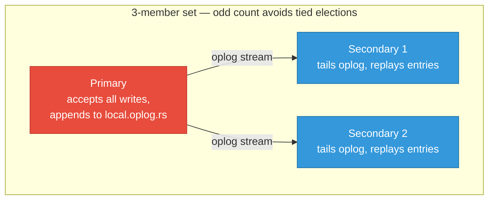
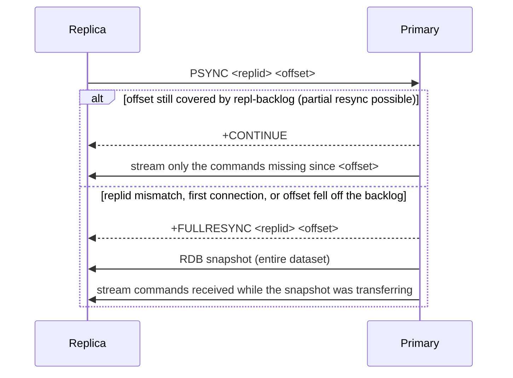
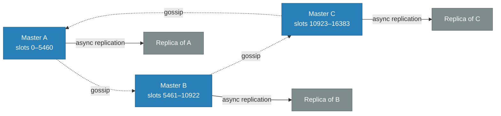
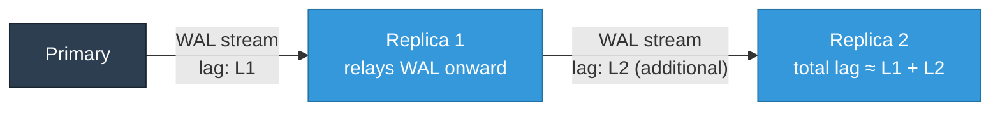

# Database Replication

Cross-database replication reference — beginner to advanced.

<div class="quiz-progress" data-quiz-progress>
  <span class="quiz-progress-label">0/0 checks</span>
  <span class="quiz-progress-bar"><span class="quiz-progress-fill"></span></span>
</div>

---

## 1. Why Replication

| Goal | How replication helps |
|---|---|
| High Availability | Failover to replica if primary dies |
| Read scaling | Route SELECT queries to replicas |
| Geo-distribution | Place replicas close to users |
| Disaster Recovery | Replica in separate region/AZ |

---

## 2. Sync vs Async — Latency and RPO

Every replication design is really a choice about where on this spectrum a given write sits — how much latency you're willing to pay on the critical path in exchange for how much data you're willing to lose if the primary dies one instant after acknowledging the write.

<div class="toggle-switch">
  <div class="toggle-buttons">
    <button data-toggle-opt="async" class="active state-warn">Async (default)</button>
    <button data-toggle-opt="semisync">Semi-sync (MySQL)</button>
    <button data-toggle-opt="sync" class="state-ok">Sync</button>
  </div>
  <div class="toggle-panel active" data-toggle-panel="async">
    Primary writes locally, returns ACK, ships WAL/binlog in background.<br/>
    <strong>Write latency:</strong> fast — nothing on the critical path waits on the network.<br/>
    <strong>RPO:</strong> seconds of data loss possible if the primary dies before the replica catches up.
  </div>
  <div class="toggle-panel" data-toggle-panel="semisync">
    Primary waits for one replica to acknowledge <strong>receipt</strong> of the write — not that it has been applied yet.<br/>
    <strong>Write latency:</strong> one network round trip, but no wait for the replica's apply step.<br/>
    <strong>RPO:</strong> near-zero — the data exists on a second node's relay log even though that node hasn't necessarily replayed it yet.
  </div>
  <div class="toggle-panel" data-toggle-panel="sync">
    Primary waits for at least one replica to confirm before returning ACK.<br/>
    <strong>Write latency:</strong> full network RTT added to every write.<br/>
    <strong>RPO:</strong> 0 — no data loss on failover, since a replica already had the write before the client was told it succeeded.
  </div>
</div>

Semi-sync is the practical middle ground production MySQL clusters actually run: it avoids async's silent data-loss window without paying sync's full apply-confirmation latency on every write — the trade is a replica that's formally "ack'd" a write it may not have replayed yet.

### Diagram: Write Path

```mermaid
sequenceDiagram
    participant C as Client
    participant P as Primary
    participant R as Replica

    rect rgb(60, 45, 20)
    Note over C,R: Async replication — fire and forget
    C->>P: WRITE
    P->>P: Write to local disk (WAL/binlog)
    P-->>C: ACK (before the replica has seen it)
    P--)R: Ship WAL/binlog (background, no wait)
    end

    rect rgb(30, 50, 65)
    Note over C,R: Semi-sync replication (MySQL rpl_semi_sync)
    C->>P: WRITE
    P->>P: Write to local disk
    P->>R: Ship WAL/binlog
    R-->>P: Acknowledge receipt only (relay log, not yet applied)
    P-->>C: ACK
    R->>R: Apply asynchronously afterward
    end

    rect rgb(30, 65, 45)
    Note over C,R: Sync replication
    C->>P: WRITE
    P->>P: Write to local disk
    P->>R: Ship WAL/binlog
    R->>R: Apply
    R-->>P: Confirm received AND applied
    P-->>C: ACK
    end
```



<div class="quiz-card">
  <p class="quiz-q">In MySQL semi-sync replication, what exactly does the primary wait for before returning ACK to the client?</p>
  <button class="quiz-reveal">Reveal answer</button>
  <div class="quiz-a" hidden>Only that one replica has acknowledged <em>receipt</em> of the write — not that it has been applied. RPO is near-zero because the data already exists on a second node's relay log, but that's a weaker guarantee than full sync, where the replica confirms both received and applied before the primary ACKs the client.</div>
</div>

### Try It Yourself: Live Replication Lag

The diagram above shows the write path once. This one's live — flip between sync and async, hammer the Write button, and watch the offsets either stay glued together or drift apart. Async's queue is exactly the window of acknowledged-but-not-yet-durable-on-a-second-node writes that a "Kill Master" would expose as gone.

<div class="toggle-switch">
  <div class="toggle-buttons">
    <button data-mode-btn="sync" class="active state-ok">Sync</button>
    <button data-mode-btn="async" class="state-warn">Async</button>
  </div>
</div>

<div class="structure-viz" id="replication-lag-viz">
  <svg class="viz-canvas" viewBox="0 0 620 170"></svg>
  <div class="viz-controls">
    <button class="viz-btn" data-viz-action="write">Write</button>
    <button class="viz-btn" data-viz-action="tick">Replica Tick</button>
    <button class="viz-btn viz-btn-danger" data-viz-action="kill">Kill Master</button>
    <button class="viz-btn" data-viz-action="reset">Reset</button>
  </div>
  <div class="viz-status"></div>
</div>

<script>
(function () {
  const svgNS = 'http://www.w3.org/2000/svg';
  const root = document.getElementById('replication-lag-viz');
  const svg = root.querySelector('.viz-canvas');
  const status = root.querySelector('.viz-status');
  const modeButtons = document.querySelectorAll('[data-mode-btn]');

  // --- Core logic (state machine) -----------------------------------
  // Mirrors databases/replication.md section 2: master offset increments
  // per write; the replica trails behind via a pending delay queue in
  // async mode, and is forced to match instantly (0 lag) in sync mode.
  function makeState() {
    return {
      mode: 'sync',
      masterOffset: 0,
      replicaOffset: 0,
      replicaDelayQueue: [],
      masterBlocked: false,
    };
  }

  let state = makeState();

  function lag() {
    return state.masterOffset - state.replicaOffset;
  }

  function doWrite() {
    state.masterOffset++;
    if (state.mode === 'async') {
      state.replicaDelayQueue.push(state.masterOffset);
      return `Write acknowledged to the client immediately. Replica will apply it after its lag catches up — currently ${state.replicaDelayQueue.length} writes behind.`;
    }
    state.masterBlocked = true;
    state.replicaOffset = state.masterOffset;
    state.masterBlocked = false;
    return `Write blocked until replica confirmed — replica caught up instantly (0 lag), write now acknowledged. This is the latency cost of synchronous replication: every write pays the round-trip.`;
  }

  function doTick() {
    if (state.mode !== 'async') {
      return `Replica Tick only has an effect in async mode — replica is already caught up by construction in sync mode.`;
    }
    if (state.replicaDelayQueue.length === 0) {
      return `No pending writes queued — replica is already caught up.`;
    }
    const offset = state.replicaDelayQueue.shift();
    state.replicaOffset = offset;
    return `Replica applied 1 queued write — ${state.replicaDelayQueue.length} remaining, offset now caught up to ${offset}.`;
  }

  function doKill() {
    const gap = state.masterOffset - state.replicaOffset;
    if (gap <= 0) {
      return `If master died right now: replica is at offset ${state.replicaOffset}, master was at offset ${state.masterOffset}. No gap — the replica has everything the master acknowledged. In sync mode this gap is always 0 by construction.`;
    }
    return `If master died right now: replica is at offset ${state.replicaOffset}, master was at offset ${state.masterOffset}. In async mode, the (${state.masterOffset} - ${state.replicaOffset} = ${gap}) most recent writes that were already acknowledged to clients are GONE if this replica gets promoted. In sync mode, this gap is always 0 by construction.`;
  }

  function doSetMode(newMode) {
    if (newMode === state.mode) return `Already in ${newMode} mode.`;
    let msg;
    if (newMode === 'sync' && state.replicaDelayQueue.length > 0) {
      // Force-flush on switch to sync so the zero-lag guarantee holds
      // the instant sync mode is entered.
      const flushed = state.replicaDelayQueue.length;
      state.replicaOffset = state.masterOffset;
      state.replicaDelayQueue = [];
      msg = `Switching to sync mode force-flushed ${flushed} queued write(s) — replica jumps straight to offset ${state.replicaOffset} so the zero-lag guarantee holds immediately.`;
    } else {
      msg = `Switched to ${newMode} mode.`;
    }
    state.mode = newMode;
    return msg;
  }

  function doReset() {
    state = makeState();
    return 'Reset.';
  }

  // --- Rendering -------------------------------------------------------
  function setStatus(msg, kind) {
    status.textContent = msg;
    status.className = 'viz-status' + (kind === 'ok' ? ' viz-status-ok' : kind === 'error' ? ' viz-status-error' : '');
  }

  function draw() {
    svg.innerHTML = '';

    const masterX = 120, replicaX = 480, cy = 60, r = 34;

    // Master node
    const mCircle = document.createElementNS(svgNS, 'circle');
    mCircle.setAttribute('cx', masterX);
    mCircle.setAttribute('cy', cy);
    mCircle.setAttribute('r', r);
    mCircle.setAttribute('class', state.masterBlocked ? 'viz-node viz-node-highlight' : 'viz-node');
    svg.appendChild(mCircle);

    const mLabel = document.createElementNS(svgNS, 'text');
    mLabel.setAttribute('x', masterX);
    mLabel.setAttribute('y', cy - 6);
    mLabel.textContent = 'Master';
    svg.appendChild(mLabel);

    const mOffset = document.createElementNS(svgNS, 'text');
    mOffset.setAttribute('x', masterX);
    mOffset.setAttribute('y', cy + 14);
    mOffset.textContent = 'offset ' + state.masterOffset;
    svg.appendChild(mOffset);

    // Replica node
    const rCircle = document.createElementNS(svgNS, 'circle');
    rCircle.setAttribute('cx', replicaX);
    rCircle.setAttribute('cy', cy);
    rCircle.setAttribute('r', r);
    rCircle.setAttribute('class', 'viz-node');
    svg.appendChild(rCircle);

    const rLabel = document.createElementNS(svgNS, 'text');
    rLabel.setAttribute('x', replicaX);
    rLabel.setAttribute('y', cy - 6);
    rLabel.textContent = 'Replica';
    svg.appendChild(rLabel);

    const rOffset = document.createElementNS(svgNS, 'text');
    rOffset.setAttribute('x', replicaX);
    rOffset.setAttribute('y', cy + 14);
    rOffset.textContent = 'offset ' + state.replicaOffset;
    svg.appendChild(rOffset);

    // Edge between them
    const edge = document.createElementNS(svgNS, 'line');
    edge.setAttribute('x1', masterX + r);
    edge.setAttribute('y1', cy);
    edge.setAttribute('x2', replicaX - r);
    edge.setAttribute('y2', cy);
    edge.setAttribute('class', lag() > 0 ? 'viz-edge' : 'viz-edge-active');
    svg.appendChild(edge);

    // Lag readout, centered above the edge
    const lagText = document.createElementNS(svgNS, 'text');
    lagText.setAttribute('x', (masterX + replicaX) / 2);
    lagText.setAttribute('y', cy - 20);
    lagText.setAttribute('class', lag() > 0 ? 'viz-node-highlight' : '');
    lagText.textContent = 'lag = ' + lag();
    svg.appendChild(lagText);

    // Pending queue, shown as a row of boxes under the edge (async only)
    if (state.mode === 'async' && state.replicaDelayQueue.length > 0) {
      const boxSize = 24, boxGap = 8;
      const totalWidth = state.replicaDelayQueue.length * boxSize + (state.replicaDelayQueue.length - 1) * boxGap;
      const startX = (masterX + replicaX) / 2 - totalWidth / 2;
      const boxY = cy + 30;

      state.replicaDelayQueue.forEach((offset, i) => {
        const x = startX + i * (boxSize + boxGap);
        const box = document.createElementNS(svgNS, 'rect');
        box.setAttribute('x', x);
        box.setAttribute('y', boxY);
        box.setAttribute('width', boxSize);
        box.setAttribute('height', boxSize);
        box.setAttribute('rx', 4);
        box.setAttribute('class', i === 0 ? 'viz-node-new' : 'viz-node');
        svg.appendChild(box);

        const boxLabel = document.createElementNS(svgNS, 'text');
        boxLabel.setAttribute('x', x + boxSize / 2);
        boxLabel.setAttribute('y', boxY + boxSize / 2 + 4);
        boxLabel.textContent = offset;
        svg.appendChild(boxLabel);
      });

      const queueLabel = document.createElementNS(svgNS, 'text');
      queueLabel.setAttribute('x', (masterX + replicaX) / 2);
      queueLabel.setAttribute('y', boxY + boxSize + 18);
      queueLabel.textContent = 'pending queue (' + state.replicaDelayQueue.length + ')';
      svg.appendChild(queueLabel);
    }

    // Mode buttons active state
    modeButtons.forEach((btn) => {
      btn.classList.toggle('active', btn.dataset.modeBtn === state.mode);
    });
  }

  // --- Wiring ------------------------------------------------------------
  modeButtons.forEach((btn) => {
    btn.addEventListener('click', () => {
      const msg = doSetMode(btn.dataset.modeBtn);
      setStatus(msg, 'ok');
      draw();
    });
  });

  root.querySelector('[data-viz-action="write"]').addEventListener('click', () => {
    const msg = doWrite();
    setStatus(msg, 'ok');
    draw();
  });

  root.querySelector('[data-viz-action="tick"]').addEventListener('click', () => {
    const msg = doTick();
    setStatus(msg, state.mode !== 'async' ? 'error' : 'ok');
    draw();
  });

  root.querySelector('[data-viz-action="kill"]').addEventListener('click', () => {
    const msg = doKill();
    setStatus(msg, lag() > 0 ? 'error' : 'ok');
    draw();
  });

  root.querySelector('[data-viz-action="reset"]').addEventListener('click', () => {
    const msg = doReset();
    setStatus(msg, '');
    draw();
  });

  draw();
})();
</script>

---

## 3. Physical vs Logical Replication

| | Physical | Logical |
|---|---|---|
| Unit | Disk blocks (WAL bytes) | Rows / logical changes |
| Cross-version | No | Yes |
| Selective tables | No | Yes |
| Use case | Standby, HA | ETL, CDC, heterogeneous targets |
| Examples | PG streaming, MySQL InnoDB redo | PG logical, MySQL binlog row-format |

<div class="quiz-card">
  <p class="quiz-q">You need to replicate just two tables out of a Postgres 13 cluster into a Postgres 16 cluster for ETL. Physical or logical replication?</p>
  <button class="quiz-reveal">Reveal answer</button>
  <div class="quiz-a" hidden>Logical. Physical replication ships raw WAL bytes — the whole cluster, byte-for-byte, and it doesn't cross major versions. Logical replication operates on rows/logical changes, so it supports both selecting specific tables and replicating between different versions, exactly the two requirements here.</div>
</div>

---

## 4. PostgreSQL Replication

### Streaming Replication (Physical)

```sql
-- On primary: postgresql.conf
wal_level = replica
max_wal_senders = 5
hot_standby = on

-- Create replication user
CREATE USER replicator REPLICATION LOGIN PASSWORD 'secret';
```

```bash
# Bootstrap replica
pg_basebackup -h primary -U replicator -D /var/lib/postgresql/data -Fp -Xs -P -R
```

`recovery.conf` (PG < 12) or `standby.signal` + `postgresql.conf` (PG ≥ 12):
```
primary_conninfo = 'host=primary user=replicator'
```

### Replication Slots

Slots prevent the primary from discarding WAL until the replica has consumed it. Prevents replication gaps but risks disk fill if replica goes offline.

```sql
-- Create
SELECT pg_create_physical_replication_slot('replica1');

-- Check
SELECT slot_name, active, restart_lsn FROM pg_replication_slots;

-- Drop if replica is gone (or disk fills)
SELECT pg_drop_replication_slot('replica1');
```

<div class="quiz-card">
  <p class="quiz-q">A replica behind a physical replication slot goes offline and never reconnects. What happens on the primary?</p>
  <button class="quiz-reveal">Reveal answer</button>
  <div class="quiz-a" hidden>The primary keeps retaining WAL for that slot indefinitely — the whole point of a slot is that the primary won't discard WAL until the slot's replica has consumed it. With no replica ever reconnecting, WAL just accumulates until the disk fills. The fix is operational, not automatic: monitor slot lag and manually drop the slot (pg_drop_replication_slot) once a replica is confirmed gone for good.</div>
</div>

### Logical Replication

```sql
-- Publisher
ALTER SYSTEM SET wal_level = logical;
CREATE PUBLICATION mypub FOR TABLE orders, users;

-- Subscriber (different cluster or version)
CREATE SUBSCRIPTION mysub
  CONNECTION 'host=primary dbname=app user=replicator'
  PUBLICATION mypub;
```

### synchronous_commit Settings

| Value | When ACK is returned | RPO |
|---|---|---|
| `off` | Before WAL flush (local) | data loss possible |
| `local` | After local WAL flush | data loss on replica |
| `remote_write` | Replica wrote to OS buffer | near-zero |
| `remote_apply` | Replica applied WAL | 0 |
| `on` (default) | After local WAL flush | data loss on replica |

```sql
-- Per-transaction override
SET LOCAL synchronous_commit = remote_apply;
```

<div class="quiz-card">
  <p class="quiz-q">Postgres's default synchronous_commit setting is literally named "on." Does that mean every write already waits for a replica before being acknowledged?</p>
  <button class="quiz-reveal">Reveal answer</button>
  <div class="quiz-a" hidden>No — despite the name, the table above shows <code>on</code> returns the ACK at the same point as <code>local</code>: after the local WAL flush, with no wait on any replica. "Data loss on replica" is listed as the risk for both. Getting an actual replica-durability guarantee requires explicitly setting <code>remote_write</code> (near-zero RPO) or <code>remote_apply</code> (RPO 0) — the default only protects against a crash on the primary itself, not a failover to a replica that never received the write.</div>
</div>

---

## 5. MySQL Replication

### Binary Log Formats

<div class="tab-group">
  <div class="tab-buttons">
    <button data-tab="stmt" class="active">STATEMENT</button>
    <button data-tab="row">ROW</button>
    <button data-tab="mixed">MIXED</button>
  </div>
  <div class="tab-panels">
    <div class="tab-panel active" data-tab-panel="stmt">
      <strong>Logs the SQL text itself.</strong> Smallest log size. Risk: non-deterministic functions (things like <code>UUID()</code>, unordered <code>LIMIT</code>, session variables) can replay differently on the replica than what actually happened on the primary — the replica ends up diverged rather than identical.
    </div>
    <div class="tab-panel" data-tab-panel="row">
      <strong>Logs before/after row images.</strong> Safe regardless of how non-deterministic the original SQL was, and CDC tooling can consume it directly since it's already a stream of row-level changes. Cost: a much larger log, especially for statements that touch many rows.
    </div>
    <div class="tab-panel" data-tab-panel="mixed">
      <strong>Auto-switches between STATEMENT and ROW</strong> based on whether the statement being logged is deterministic. Balances log size against safety, at the cost of the format itself being harder to reason about — you can't assume a fixed shape when reading the binlog.
    </div>
  </div>
</div>

<div class="quiz-card">
  <p class="quiz-q">Why is STATEMENT-based binlog format risky for replication correctness?</p>
  <button class="quiz-reveal">Reveal answer</button>
  <div class="quiz-a" hidden>It logs the SQL text, not the actual data change — so a non-deterministic statement (a UDF, an unordered LIMIT, anything that can legitimately produce a different result each time it runs) can replay on the replica and produce a different outcome than what happened on the primary. ROW format sidesteps this entirely by logging the actual before/after row images instead of the statement that produced them.</div>
</div>

```sql
-- Enable GTID replication
SET GLOBAL gtid_mode = ON;
SET GLOBAL enforce_gtid_consistency = ON;

-- Connect replica
CHANGE MASTER TO
  MASTER_HOST='primary',
  MASTER_USER='replicator',
  MASTER_PASSWORD='secret',
  MASTER_AUTO_POSITION=1;   -- GTID-based, no binlog coords needed

START REPLICA;
SHOW REPLICA STATUS\G
```

### Semi-Sync

```sql
-- On primary
INSTALL PLUGIN rpl_semi_sync_source SONAME 'semisync_source.so';
SET GLOBAL rpl_semi_sync_source_enabled = 1;

-- On replica
INSTALL PLUGIN rpl_semi_sync_replica SONAME 'semisync_replica.so';
SET GLOBAL rpl_semi_sync_replica_enabled = 1;
```

### Multi-Source Replication

```sql
-- Replica receiving from two primaries
CHANGE MASTER TO MASTER_HOST='primary1', ... FOR CHANNEL 'source1';
CHANGE MASTER TO MASTER_HOST='primary2', ... FOR CHANNEL 'source2';
START REPLICA FOR CHANNEL 'source1';
START REPLICA FOR CHANNEL 'source2';
```

---

## 6. MongoDB Replication

### Replica Set Architecture



### Oplog

- Capped collection (`local.oplog.rs`) on every member
- Operations are idempotent; secondaries replay the oplog
- Oplog window = how far behind a secondary can fall before needing full resync

```js
// Check oplog window
rs.printReplicationInfo()

// Check replication lag
rs.printSecondaryReplicationInfo()
```

### Election Algorithm

1. Any member that hasn't heard from primary within `electionTimeoutMillis` (10 s) calls an election
2. Candidate requests votes; wins if it has the most up-to-date oplog and majority of votes
3. Raft-inspired; uses term numbers to prevent stale leaders

<div class="quiz-card">
  <p class="quiz-q">A candidate has more votes cast in its favor than any other node, but its oplog isn't the most up-to-date in the set. Does it become primary?</p>
  <button class="quiz-reveal">Reveal answer</button>
  <div class="quiz-a" hidden>No — winning requires the most up-to-date oplog <em>and</em> a majority of votes, not vote count alone. In practice this rarely even gets close: members are supposed to withhold votes from a candidate whose oplog is behind theirs, so a stale candidate typically can't accumulate a majority in the first place.</div>
</div>

### Write Concern

```js
db.orders.insertOne(doc, { writeConcern: { w: "majority", j: true, wtimeout: 3000 } })
// w:1        — primary ack only
// w:"majority" — majority of voting members
// w:"all"    — all replica set members
// j:true     — journaled to disk
```

### Read Preference

| Mode | Routes to |
|---|---|
| `primary` | Always primary |
| `primaryPreferred` | Primary, fallback to secondary |
| `secondary` | Always secondary (may be stale) |
| `secondaryPreferred` | Secondary, fallback to primary |
| `nearest` | Lowest network latency |

---

## 7. Redis Replication

### PSYNC2 Protocol



- `repl-backlog-size` (default 1 MB): ring buffer on primary. If replica lag exceeds backlog, full resync required.
- `repl-backlog-ttl`: how long primary keeps backlog after all replicas disconnect.

```bash
# Check replication state
redis-cli INFO replication
```

<div class="quiz-card">
  <p class="quiz-q">A replica disconnects for an unusually long time. When it reconnects and sends PSYNC, it gets FULLRESYNC instead of CONTINUE even though its replid still matches. Why?</p>
  <button class="quiz-reveal">Reveal answer</button>
  <div class="quiz-a" hidden>The commands it needs to catch up on have already been overwritten in the primary's repl-backlog — a fixed-size ring buffer (default just 1 MB). Once the gap since disconnect exceeds what the backlog can hold, a partial resync (CONTINUE) is no longer possible regardless of a matching replid, and the primary falls back to a full RDB transfer. Sizing repl-backlog-size for your expected disconnect windows is what keeps routine blips cheap.</div>
</div>

### Sentinel (Automatic Failover)

```
sentinel monitor mymaster 127.0.0.1 6379 2   # quorum = 2
sentinel down-after-milliseconds mymaster 5000
sentinel failover-timeout mymaster 10000
```

3+ Sentinel processes vote; when quorum agrees primary is down, one Sentinel orchestrates failover: promotes best replica, reconfigures others.

### Redis Cluster (Gossip)

- 16384 hash slots distributed across masters
- Each master has 1+ replicas
- Nodes exchange gossip every second; `CLUSTER FAILOVER` or auto-failover when master is unreachable for `cluster-node-timeout`



Gossip is how every node learns cluster shape and health without a central coordinator — each node's view of "who owns which slots" and "who's unreachable" converges through peer-to-peer chatter, which is also why `cluster-node-timeout` (how long a master must be unreachable before its replica is promoted) is a cluster-wide setting, not per-node.

---

## 8. Kafka Replication

### Key Concepts

- **ISR (In-Sync Replicas):** set of replicas that are caught up to the leader within `replica.lag.time.max.ms`
- **LEO (Log End Offset):** next offset to be written on each replica
- **HW (High Watermark):** highest offset acknowledged by all ISR members — consumers only see up to HW

```
Leader LEO:   [0,1,2,3,4,5]
Replica1 LEO: [0,1,2,3,4]    ← in ISR (within lag threshold)
Replica2 LEO: [0,1,2]        ← lagging, removed from ISR

HW = 4  (min LEO across ISR)
```

<div class="quiz-card">
  <p class="quiz-q">In the example above, the leader's LEO is 5 but consumers can only read up to offset 4 (the HW). Why hold back an offset the leader already has?</p>
  <button class="quiz-reveal">Reveal answer</button>
  <div class="quiz-a" hidden>HW is defined as the minimum LEO across the ISR — the highest offset guaranteed to exist on every in-sync replica, not just the leader. Offset 5 only exists on the leader so far; if the leader failed right now, that offset could disappear when a replica takes over. Exposing it to consumers before it's replicated risks a consumer reading data that later turns out to have never really "happened" from the cluster's point of view.</div>
</div>

### Producer Acks

```properties
acks=0          # fire-and-forget, possible loss
acks=1          # leader ack only
acks=all        # all ISR must ack — use with min.insync.replicas
min.insync.replicas=2
```

### Topic Configuration

```bash
kafka-topics.sh --create --topic orders \
  --replication-factor 3 \
  --partitions 12 \
  --config min.insync.replicas=2
```

---

## 9. Consensus Algorithms

### Raft

Three roles: **Leader**, **Follower**, **Candidate**.  
Term numbers act as logical clocks.

**Leader election:**
1. Follower times out (no heartbeat) → becomes Candidate, increments term
2. Requests votes from all nodes (includes last log index+term)
3. Node grants vote if: it hasn't voted this term AND candidate log is at least as up-to-date
4. Candidate wins majority → becomes Leader, starts sending heartbeats

**Log replication:**
1. Client sends command to Leader
2. Leader appends to local log, sends `AppendEntries` RPC to followers
3. Once majority acknowledge, Leader commits entry, applies to state machine, responds to client
4. Next heartbeat informs followers of commit index; they apply too

```mermaid
sequenceDiagram
    participant N1 as Node A
    participant N2 as Node B
    participant N3 as Node C (times out first)
    participant CL as Client

    rect rgb(50, 35, 60)
    Note over N1,N3: Phase 1 — Leader election (term 5)
    N3->>N3: Election timeout fires — becomes Candidate, term 4→5
    N3->>N1: RequestVote(term=5, lastLogIndex, lastLogTerm)
    N3->>N2: RequestVote(term=5, lastLogIndex, lastLogTerm)
    N1->>N1: not yet voted this term AND candidate log ≥ mine → grant
    N2->>N2: not yet voted this term AND candidate log ≥ mine → grant
    N1-->>N3: VoteGranted(term=5)
    N2-->>N3: VoteGranted(term=5)
    Note over N3: Majority (2 of 3) — becomes Leader, starts heartbeats
    end

    rect rgb(30, 50, 65)
    Note over CL,N3: Phase 2 — Log replication
    CL->>N3: Command: SET x=1
    N3->>N3: Append to local log (uncommitted)
    N3->>N1: AppendEntries(term=5, entry, leaderCommit)
    N3->>N2: AppendEntries(term=5, entry, leaderCommit)
    N1->>N1: Append entry to local log
    N2->>N2: Append entry to local log
    N1-->>N3: Success
    N2-->>N3: Success
    Note over N3: Majority acknowledged — commit entry, apply to state machine
    N3-->>CL: Result
    Note over N1,N2: Next heartbeat carries new commit index — followers apply too
    end
```



<div class="stepper">
  <div class="stepper-panels">
    <div class="stepper-panel active">
      <strong>1. Election timeout.</strong> A follower hears no heartbeat for its randomized timeout window. It becomes a Candidate and increments its term — the new term number is what lets every other node recognize this as a fresh election, not a stale retry.
    </div>
    <div class="stepper-panel">
      <strong>2. RequestVote goes out.</strong> The candidate sends <code>RequestVote</code> to every other node, including its own last log index and term so voters can judge how caught-up it is.
    </div>
    <div class="stepper-panel">
      <strong>3. Nodes decide whether to vote.</strong> A node grants its vote only if it hasn't already voted this term <em>and</em> the candidate's log is at least as up-to-date as its own — a stale candidate can request all it wants, it simply won't collect votes.
    </div>
    <div class="stepper-panel">
      <strong>4. Majority reached — becomes Leader.</strong> Once the candidate holds votes from a majority of nodes, it becomes Leader for this term and immediately starts sending heartbeats to suppress further elections.
    </div>
    <div class="stepper-panel">
      <strong>5. Client command arrives.</strong> The Leader appends the command to its own log first — uncommitted — then sends <code>AppendEntries</code> to every follower carrying that entry.
    </div>
    <div class="stepper-panel">
      <strong>6. Followers replicate and ack.</strong> Each follower appends the entry to its own log and acknowledges. The Leader only needs a majority to respond, not every follower.
    </div>
    <div class="stepper-panel">
      <strong>7. Commit and respond.</strong> Once a majority has acknowledged, the Leader commits the entry, applies it to its state machine, and responds to the client. The next heartbeat carries the updated commit index so followers know to apply it too.
    </div>
  </div>
  <div class="stepper-controls">
    <button class="stepper-prev">← Prev</button>
    <span class="stepper-dots"></span>
    <span class="stepper-label"></span>
    <button class="stepper-next">Next →</button>
  </div>
</div>

<div class="quiz-card">
  <p class="quiz-q">Node C's election timeout fires first, so it starts requesting votes before Node A or Node B time out. But Node C's log is behind theirs. Does timing out first win it the election?</p>
  <button class="quiz-reveal">Reveal answer</button>
  <div class="quiz-a" hidden>No. A node grants its vote only if it hasn't already voted this term <em>and</em> the candidate's log is at least as up-to-date as its own. Node A and Node B will see that Node C's log is behind theirs and withhold their votes, so Node C can't reach a majority no matter how quickly it started campaigning. Timing out first only earns a chance to run — an out-of-date log still loses.</div>
</div>

### Try It Yourself: Live Leader Election

The stepper above walks through one scripted election. This one's live — kill the current leader as many times as you like and watch a new one get elected, term by term. Two simplifications versus real Raft, both to keep the demo focused on the election mechanic itself: there's no log here, so the "candidate log is at least as up-to-date" check from the stepper above is skipped (a vote is granted purely on term); and majority is computed over currently-*alive* nodes, not the fixed 5-node configuration — real Raft requires a majority of the full configured cluster so a minority partition can never elect its own leader.

<div class="structure-viz" id="raft-election-viz">
  <svg class="viz-canvas" viewBox="0 0 620 150"></svg>
  <div class="viz-controls">
    <button class="viz-btn viz-btn-danger" data-viz-action="kill-leader">Kill Leader</button>
    <button class="viz-btn" data-viz-action="revive">Revive Dead Node</button>
    <button class="viz-btn" data-viz-action="reset">Reset</button>
  </div>
  <div class="viz-status"></div>
  <div class="viz-legend">
    <span><span class="viz-swatch" style="background:#1e3a8a"></span> Follower</span>
    <span><span class="viz-swatch" style="background:#78350f"></span> Candidate</span>
    <span><span class="viz-swatch" style="background:#14532d"></span> Leader</span>
    <span><span class="viz-swatch" style="background:#7f1d1d"></span> Dead</span>
  </div>
</div>

<script>
(function () {
  const svgNS = 'http://www.w3.org/2000/svg';
  const root0 = document.getElementById('raft-election-viz');
  const svg = root0.querySelector('.viz-canvas');
  const status = root0.querySelector('.viz-status');

  const W = 100, H = 90, GAP = 20;

  let nodes, leaderId;

  function makeInitialNodes() {
    return [1, 2, 3, 4, 5].map((i) => ({
      id: 'N' + i,
      term: 1,
      state: i === 1 ? 'leader' : 'follower',
      votedFor: 'N1',
      alive: true,
    }));
  }

  function reset() {
    nodes = makeInitialNodes();
    leaderId = 'N1';
  }

  function findNode(id) { return nodes.find((n) => n.id === id); }
  function aliveNodes() { return nodes.filter((n) => n.alive); }

  function setStatus(msg, kind) {
    status.textContent = msg;
    status.className = 'viz-status' + (kind === 'ok' ? ' viz-status-ok' : kind === 'error' ? ' viz-status-error' : '');
  }

  // Core election logic — see this Raft section's two documented
  // simplifications above (no log, majority over alive nodes only).
  // Returns a narration array; caller joins it for the status line.
  function killLeader() {
    const messages = [];
    const leader = leaderId ? findNode(leaderId) : null;
    if (!leader || !leader.alive) {
      messages.push('No leader is currently alive — nothing to kill.');
      return messages;
    }

    leader.alive = false;
    messages.push(`${leader.id} (Leader, term ${leader.term}) killed.`);
    leaderId = null;

    const alive = aliveNodes();
    if (alive.length === 0) {
      messages.push('All nodes are dead — no alive nodes can win a majority. Revive one or Reset.');
      return messages;
    }

    const candidate = alive[Math.floor(Math.random() * alive.length)];
    const newTerm = candidate.term + 1;
    candidate.term = newTerm;
    candidate.state = 'candidate';
    candidate.votedFor = candidate.id;
    messages.push(`${candidate.id} times out first -> Candidate, term ${newTerm - 1}→${newTerm}, votes for itself.`);

    let votes = 1;
    for (const n of alive) {
      if (n.id === candidate.id) continue;
      if (newTerm > n.term) {
        n.term = newTerm;
        n.votedFor = candidate.id;
        votes++;
        messages.push(`${n.id} grants its vote to ${candidate.id}.`);
      } else {
        messages.push(`${n.id} withholds its vote from ${candidate.id}.`);
      }
    }

    const majority = Math.floor(alive.length / 2) + 1;
    if (votes >= majority) {
      candidate.state = 'leader';
      leaderId = candidate.id;
      for (const n of alive) {
        if (n.id === candidate.id) continue;
        n.state = 'follower';
        n.term = candidate.term;
        n.votedFor = candidate.id;
      }
      messages.push(`${candidate.id} wins ${votes}/${alive.length} votes (majority of alive nodes) -> new Leader, term ${newTerm}.`);
    } else {
      messages.push(`${candidate.id} only got ${votes}/${alive.length} votes -> no majority, election fails this round.`);
    }
    return messages;
  }

  function reviveDeadNode() {
    const dead = nodes.filter((n) => !n.alive).sort((a, b) => a.id.localeCompare(b.id));
    if (dead.length === 0) return ['No dead nodes to revive.'];
    const node = dead[0];
    node.alive = true;

    const leader = leaderId ? findNode(leaderId) : null;
    if (leader) {
      node.term = leader.term;
      node.state = 'follower';
      node.votedFor = leader.id;
      return [`${node.id} revived as Follower at term ${leader.term}, catching up and voting for current Leader ${leader.id}.`];
    }
    const alive = aliveNodes();
    const maxTerm = alive.length ? Math.max(...alive.map((n) => n.term)) : node.term;
    node.term = maxTerm;
    node.state = 'follower';
    node.votedFor = null;
    return [`${node.id} revived as Follower at term ${maxTerm} — no Leader is currently elected, so it hasn't voted for anyone yet.`];
  }

  function el(tag, attrs) {
    const e = document.createElementNS(svgNS, tag);
    for (const k in attrs) e.setAttribute(k, attrs[k]);
    return e;
  }

  function text(x, y, str, cls) {
    const t = el('text', cls ? { x, y, class: cls } : { x, y });
    t.textContent = str;
    return t;
  }

  function draw() {
    while (svg.firstChild) svg.removeChild(svg.firstChild);
    nodes.forEach((n, i) => {
      const x = GAP + i * (W + GAP);
      const y = 25;
      let cls = 'viz-node';
      if (!n.alive) cls = 'viz-node-removing';
      else if (n.state === 'leader') cls = 'viz-node-new';
      else if (n.state === 'candidate') cls = 'viz-node-highlight';

      svg.appendChild(el('rect', { x, y, width: W, height: H, rx: 8, class: cls }));
      const cx = x + W / 2;
      svg.appendChild(text(cx, y + 16, n.id));
      svg.appendChild(text(cx, y + 34, n.alive ? capitalize(n.state) : 'Dead'));
      svg.appendChild(text(cx, y + 52, `term ${n.term}`, 'viz-label-dim'));
      svg.appendChild(text(cx, y + 70, n.votedFor ? `votes ${n.votedFor}` : 'votes —', 'viz-label-dim'));
    });
  }

  function capitalize(s) { return s.charAt(0).toUpperCase() + s.slice(1); }

  root0.querySelector('[data-viz-action="kill-leader"]').addEventListener('click', () => {
    const messages = killLeader();
    const joined = messages.join(' ');
    const kind = /wins/.test(joined) ? 'ok' : 'error';
    setStatus(joined, kind);
    draw();
  });

  root0.querySelector('[data-viz-action="revive"]').addEventListener('click', () => {
    const messages = reviveDeadNode();
    setStatus(messages.join(' '), /No dead nodes/.test(messages[0]) ? 'error' : 'ok');
    draw();
  });

  root0.querySelector('[data-viz-action="reset"]').addEventListener('click', () => {
    reset();
    setStatus('Reset to a 5-node cluster: N1 is Leader, term 1, everyone else Follower voting for N1.', '');
    draw();
  });

  reset();
  setStatus('Loaded a 5-node cluster: N1 is Leader (term 1). Click "Kill Leader" to trigger an election.', '');
  draw();
})();
</script>

### Paxos (Classic)

Two phases:

| Phase | Message | Meaning |
|---|---|---|
| Phase 1a | Prepare(n) | Proposer asks acceptors to promise not to accept anything < n |
| Phase 1b | Promise(n, v) | Acceptor promises; returns highest accepted value if any |
| Phase 2a | Accept(n, v) | Proposer sends chosen value |
| Phase 2b | Accepted(n, v) | Acceptor accepts; notifies learners |

```mermaid
sequenceDiagram
    participant PR as Proposer
    participant A1 as Acceptor 1
    participant A2 as Acceptor 2
    participant L as Learner

    rect rgb(50, 35, 60)
    Note over PR,A2: Phase 1 — Prepare / Promise
    PR->>A1: Prepare(n=7)
    PR->>A2: Prepare(n=7)
    A1->>A1: n=7 higher than any promised so far → promise
    A2->>A2: n=7 higher than any promised so far → promise
    A1-->>PR: Promise(7, no prior accepted value)
    A2-->>PR: Promise(7, no prior accepted value)
    end

    rect rgb(30, 50, 65)
    Note over PR,L: Phase 2 — Accept / Accepted
    PR->>A1: Accept(n=7, v="X")
    PR->>A2: Accept(n=7, v="X")
    A1->>A1: n=7 still highest promised → accept
    A2->>A2: n=7 still highest promised → accept
    A1-->>PR: Accepted(7, "X")
    A2-->>PR: Accepted(7, "X")
    A1--)L: Accepted(7, "X")
    A2--)L: Accepted(7, "X")
    Note over L: Majority accepted the same value — "X" is chosen
    end
```



<div class="quiz-card">
  <p class="quiz-q">After Phase 1 (Prepare/Promise) completes successfully across a majority of acceptors, has a value actually been chosen yet?</p>
  <button class="quiz-reveal">Reveal answer</button>
  <div class="quiz-a" hidden>No. Phase 1 only gets acceptors to promise not to accept any proposal numbered less than n — no value is sent in this phase at all. The actual value only goes out in Phase 2 (Accept(n, v)), and it's only considered chosen once a majority of acceptors respond Accepted(n, v). Prepare/Promise is purely about reserving the right to propose next, not about committing anything.</div>
</div>

Raft vs Paxos: Raft is easier to understand (strong leader, sequential log); Paxos is more general but leaves log ordering to implementation.

---

## 10. Multi-Master / Active-Active

### Conflict Resolution Strategies

| Strategy | How | Risk |
|---|---|---|
| Last-Write-Wins (LWW) | Highest timestamp wins | clock skew causes data loss |
| CRDTs | Data structures that merge deterministically | limited to counters, sets, etc. |
| Application-level | App detects conflict, merges or prompts user | complex but correct |

<div class="quiz-card">
  <p class="quiz-q">Last-Write-Wins resolves conflicts by keeping the write with the highest timestamp. What's the specific failure mode this table calls out?</p>
  <button class="quiz-reveal">Reveal answer</button>
  <div class="quiz-a" hidden>Clock skew causing data loss. If one node's clock runs even slightly ahead, its write can "win" over a write that actually happened later in real time on a node with an accurate or lagging clock — silently discarding the genuinely newer data with no merge, no conflict signal, and no way for the application to notice.</div>
</div>

### Galera Cluster (MySQL/MariaDB)

- Synchronous multi-master via **wsrep** (write-set replication)
- Every node certifies each transaction against other nodes' write sets before committing
- No replication lag; any node can take writes
- Cost: all writes pay network RTT; large transactions are expensive

### CockroachDB

- Distributed SQL; each range (64 MB data shard) is a Raft group
- Writes go through Raft leader for the range
- Geo-partitioning pins data to regions; follower reads from nearest replica
- Serializable isolation via MVCC + HLC (Hybrid Logical Clocks)

---

## 11. Cross-Region Replication

### Latency Math

```
Write latency with sync cross-region =
  local disk write + RTT to remote region + remote disk write

Example:
  us-east-1 → eu-west-1 RTT ≈ 85ms
  Sync write adds ~85ms minimum
```

Use async for cross-region writes unless RPO=0 is required.

<div class="quiz-card">
  <p class="quiz-q">Using the us-east-1 → eu-west-1 example above (~85ms RTT), why does that make sync replication so much costlier cross-region than it is within a single AZ?</p>
  <button class="quiz-reveal">Reveal answer</button>
  <div class="quiz-a" hidden>Sync replication's write latency directly includes the full network round-trip to the remote replica before the primary can ACK the client — and cross-region RTT (tens of milliseconds, ~85ms here) is orders of magnitude larger than same-AZ RTT (typically sub-millisecond). Every single write pays that ~85ms minimum. Async ships the WAL/binlog in the background instead, so the client never waits on that RTT — the tradeoff being the seconds-scale replication lag and possible data loss on failover that async always carries.</div>
</div>

### Managed Services

**Aurora Global Database**
- One primary region, up to 5 secondary regions
- Async replication at storage layer (~1 s lag typical)
- Failover: promote secondary in < 1 min

**DynamoDB Global Tables**
- Multi-master active-active across regions
- LWW conflict resolution using `_ab_hash` (internal timestamp)
- ~1 s typical lag; eventual consistency across regions

**Cloud SQL Read Replicas (GCP)**
- Standard MySQL/Postgres streaming replication to another region
- No automatic failover; manual promote

### Kafka MirrorMaker 2

```properties
# mm2.properties
clusters = source, target
source.bootstrap.servers = kafka-source:9092
target.bootstrap.servers = kafka-target:9092
source->target.enabled = true
source->target.topics = orders.*
replication.factor = 3
```

MirrorMaker 2 (Kafka Connect-based) replicates topics, consumer group offsets, and ACLs. Offset translation handles the gap between source and target offsets.

---

## 12. Replication Lag

### Measuring Lag

**PostgreSQL**
```sql
-- On primary
SELECT
  client_addr,
  state,
  sent_lsn,
  write_lsn,
  flush_lsn,
  replay_lsn,
  (sent_lsn - replay_lsn) AS lag_bytes
FROM pg_stat_replication;

-- On replica
SELECT now() - pg_last_xact_replay_timestamp() AS replication_lag;
```

**MySQL**
```sql
SHOW REPLICA STATUS\G
-- Look for: Seconds_Behind_Source (formerly Seconds_Behind_Master)
-- 0 = caught up; NULL = replica not running
```

**MongoDB**
```js
rs.printReplicationInfo()        // oplog window size
rs.printSecondaryReplicationInfo() // lag per secondary
```

**Redis**
```bash
redis-cli INFO replication
# master_repl_offset vs replica slave_repl_offset difference = lag bytes
```

**Kafka**
```bash
kafka-consumer-groups.sh --bootstrap-server kafka:9092 \
  --describe --group my-consumer-group
# LAG column = messages behind per partition
```

### Causes

- Replica under-provisioned (CPU/IO can't keep up with replay)
- Large transactions hold replica apply lock
- Network congestion between primary and replica
- Parallel apply disabled (single-threaded replay)

### Mitigations

```sql
-- PostgreSQL: enable parallel apply on replica
ALTER SYSTEM SET max_parallel_apply_workers_per_subscription = 4;

-- MySQL: enable parallel replication
SET GLOBAL replica_parallel_workers = 8;
SET GLOBAL replica_parallel_type = LOGICAL_CLOCK;
```

<div class="quiz-card">
  <p class="quiz-q">A replica is lagging and its CPU is already pegged at 100%. Enabling parallel apply is one of the mitigations listed above — will it fix this specific replica's lag?</p>
  <button class="quiz-reveal">Reveal answer</button>
  <div class="quiz-a" hidden>Not necessarily. Parallel apply only addresses one specific cause from the list above — single-threaded replay. If the real bottleneck is under-provisioned CPU/IO (a different listed cause), spreading replay across more parallel workers on a host that's already saturated won't help and can even make contention worse. Matching the mitigation to the actual measured cause matters more than reaching for parallel apply by default.</div>
</div>

---

## 13. Comparison Table

| Database | Replication Method | Sync Model | Failover Mechanism | Lag Metric |
|---|---|---|---|---|
| PostgreSQL | WAL streaming / logical decoding | Async (sync optional) | Patroni / pg_auto_failover / manual | `pg_stat_replication.replay_lsn` |
| MySQL | Binary log (row/GTID) | Async / semi-sync | MHA / Orchestrator / InnoDB Cluster | `Seconds_Behind_Source` |
| MongoDB | Oplog (capped collection) | Async (majority write concern = sync-like) | Built-in election (Raft-inspired) | `rs.printSecondaryReplicationInfo()` |
| Redis | PSYNC2 (RDB + stream) | Async | Sentinel / Cluster auto-failover | `master_repl_offset` delta |
| Kafka | Log segment replication | ISR-based (acks=all = sync) | Controller reassigns partition leader | Consumer group LAG |

---

## 14. Scenarios

### Scenario 1: Read Replica Lag Causing Stale Reads

**Symptom:** User updates profile, refreshes page, sees old data.

**Cause:** App routes all reads to replica; replica is 2 s behind.

**Fix options:**
1. **Read-your-writes:** Route reads to primary for the same session immediately after a write.
2. **Monotonic reads:** Always route a given user's reads to the same replica.
3. **Synchronous commit:** Use `synchronous_commit=remote_apply` for critical writes.

```sql
-- PostgreSQL: check if replica is applying writes fast enough
SELECT now() - pg_last_xact_replay_timestamp() AS lag FROM pg_stat_replication;
```

---

### Scenario 2: Split-Brain in Network Partition

**Symptom:** Two nodes both think they are primary and accept writes. Data diverges.

**Cause:** Network partition isolates primary from replicas; replicas elect a new primary; old primary keeps accepting writes.

**Prevention:**
- **Quorum/majority writes:** Old primary can't reach majority, so it should step down or reject writes.
- PostgreSQL with Patroni: uses etcd/ZooKeeper for distributed lock; old primary loses lock during partition.
- MongoDB: write concern `w:majority` will block if primary is isolated.
- Redis Sentinel: requires quorum of sentinels before failover.

```bash
# Patroni: pause DCS TTL to force primary to step down
patronictl -c patroni.yml pause
```

<div class="quiz-card">
  <p class="quiz-q">During the partition, the old primary can still be reached by some clients directly — it just can't reach a majority of replicas or its distributed lock. Why does that stop it from safely continuing to accept writes?</p>
  <button class="quiz-reveal">Reveal answer</button>
  <div class="quiz-a" hidden>Because every listed prevention mechanism ties "allowed to write" to holding a majority: Patroni's old primary loses its etcd/ZooKeeper lock during the partition, and MongoDB's w:"majority" write concern simply blocks if the primary is isolated from enough voting members. Being reachable by *some* clients isn't the same as being reachable by a *majority* of the replica set — and it's exactly that majority check that keeps the isolated old primary from accepting writes the rest of the cluster will never see, which is what causes divergence in the first place.</div>
</div>

---

### Scenario 3: Cascading Replica

**Setup:** Primary → Replica1 → Replica2 (cascading / chain replication)



**PostgreSQL:**
```
# On Replica2's postgresql.conf
primary_conninfo = 'host=replica1 ...'
recovery_target_timeline = 'latest'
```

**Trade-off:** Reduces load on primary (fewer WAL sender connections); Replica2 lag = Replica1 lag + additional lag. Replica2 is further behind in a failover.

---

### Scenario 4: Promoting a Standby

**PostgreSQL (manual):**
```bash
# On the replica
pg_ctl promote -D /var/lib/postgresql/data
# or
touch /var/lib/postgresql/data/promote_trigger_file
```

```sql
-- Verify it became primary
SELECT pg_is_in_recovery();  -- should return false
```

**With Patroni:**
```bash
patronictl -c patroni.yml failover --master old-primary --candidate replica1 --force
```

**MySQL (GTID):**
```sql
-- Stop replica thread on the promoted node
STOP REPLICA;
RESET REPLICA ALL;

-- Other replicas point to new primary
CHANGE MASTER TO MASTER_HOST='new-primary', MASTER_AUTO_POSITION=1;
START REPLICA;
```

**MongoDB:**
```js
// Force stepdown of primary
rs.stepDown(60)   // 60s cooldown before it can be re-elected

// Or in emergency, force specific node to become primary
cfg = rs.conf()
cfg.members[1].priority = 10
rs.reconfig(cfg)
```
