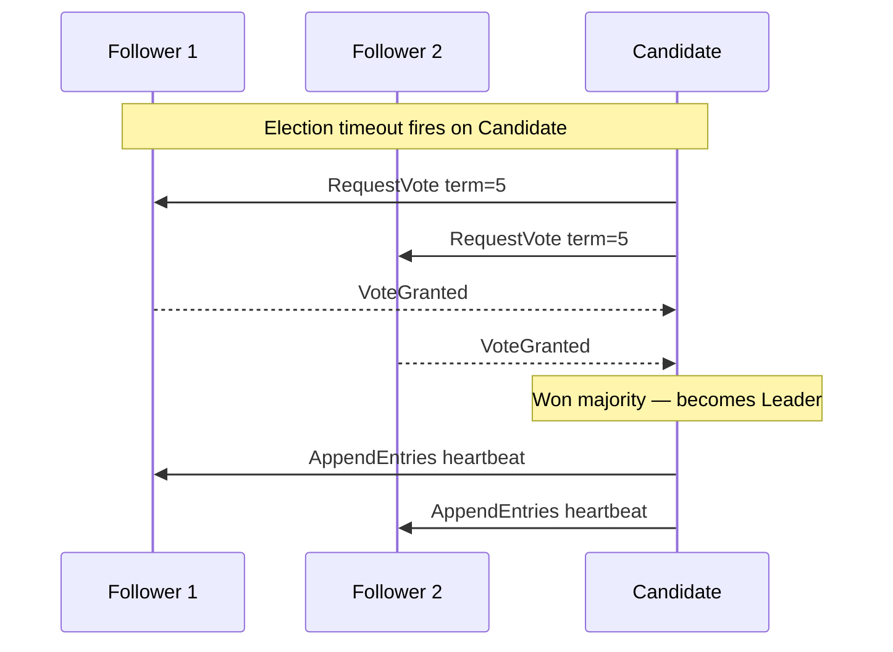

# Database Replication

Cross-database replication reference — beginner to advanced.

<div class="quiz-progress" data-quiz-progress>
  <span class="quiz-progress-label">0/0 checks</span>
  <span class="quiz-progress-bar"><span class="quiz-progress-fill"></span></span>
</div>

---

## 1. Why Replication

| Goal | How replication helps |
|---|---|
| High Availability | Failover to replica if primary dies |
| Read scaling | Route SELECT queries to replicas |
| Geo-distribution | Place replicas close to users |
| Disaster Recovery | Replica in separate region/AZ |

---

## 2. Sync vs Async — Latency and RPO

Every replication design is really a choice about where on this spectrum a given write sits — how much latency you're willing to pay on the critical path in exchange for how much data you're willing to lose if the primary dies one instant after acknowledging the write.

<div class="toggle-switch">
  <div class="toggle-buttons">
    <button data-toggle-opt="async" class="active state-warn">Async (default)</button>
    <button data-toggle-opt="semisync">Semi-sync (MySQL)</button>
    <button data-toggle-opt="sync" class="state-ok">Sync</button>
  </div>
  <div class="toggle-panel active" data-toggle-panel="async">
    Primary writes locally, returns ACK, ships WAL/binlog in background.<br/>
    <strong>Write latency:</strong> fast — nothing on the critical path waits on the network.<br/>
    <strong>RPO:</strong> seconds of data loss possible if the primary dies before the replica catches up.
  </div>
  <div class="toggle-panel" data-toggle-panel="semisync">
    Primary waits for one replica to acknowledge <strong>receipt</strong> of the write — not that it has been applied yet.<br/>
    <strong>Write latency:</strong> one network round trip, but no wait for the replica's apply step.<br/>
    <strong>RPO:</strong> near-zero — the data exists on a second node's relay log even though that node hasn't necessarily replayed it yet.
  </div>
  <div class="toggle-panel" data-toggle-panel="sync">
    Primary waits for at least one replica to confirm before returning ACK.<br/>
    <strong>Write latency:</strong> full network RTT added to every write.<br/>
    <strong>RPO:</strong> 0 — no data loss on failover, since a replica already had the write before the client was told it succeeded.
  </div>
</div>

Semi-sync is the practical middle ground production MySQL clusters actually run: it avoids async's silent data-loss window without paying sync's full apply-confirmation latency on every write — the trade is a replica that's formally "ack'd" a write it may not have replayed yet.

### Diagram: Write Path

```mermaid
sequenceDiagram
    participant C as Client
    participant P as Primary
    participant R as Replica

    rect rgb(60, 45, 20)
    Note over C,R: Async replication — fire and forget
    C->>P: WRITE
    P->>P: Write to local disk (WAL/binlog)
    P-->>C: ACK (before the replica has seen it)
    P--)R: Ship WAL/binlog (background, no wait)
    end

    rect rgb(30, 50, 65)
    Note over C,R: Semi-sync replication (MySQL rpl_semi_sync)
    C->>P: WRITE
    P->>P: Write to local disk
    P->>R: Ship WAL/binlog
    R-->>P: Acknowledge receipt only (relay log, not yet applied)
    P-->>C: ACK
    R->>R: Apply asynchronously afterward
    end

    rect rgb(30, 65, 45)
    Note over C,R: Sync replication
    C->>P: WRITE
    P->>P: Write to local disk
    P->>R: Ship WAL/binlog
    R->>R: Apply
    R-->>P: Confirm received AND applied
    P-->>C: ACK
    end
```



<div class="quiz-card">
  <p class="quiz-q">In MySQL semi-sync replication, what exactly does the primary wait for before returning ACK to the client?</p>
  <button class="quiz-reveal">Reveal answer</button>
  <div class="quiz-a" hidden>Only that one replica has acknowledged <em>receipt</em> of the write — not that it has been applied. RPO is near-zero because the data already exists on a second node's relay log, but that's a weaker guarantee than full sync, where the replica confirms both received and applied before the primary ACKs the client.</div>
</div>

---

## 3. Physical vs Logical Replication

| | Physical | Logical |
|---|---|---|
| Unit | Disk blocks (WAL bytes) | Rows / logical changes |
| Cross-version | No | Yes |
| Selective tables | No | Yes |
| Use case | Standby, HA | ETL, CDC, heterogeneous targets |
| Examples | PG streaming, MySQL InnoDB redo | PG logical, MySQL binlog row-format |

<div class="quiz-card">
  <p class="quiz-q">You need to replicate just two tables out of a Postgres 13 cluster into a Postgres 16 cluster for ETL. Physical or logical replication?</p>
  <button class="quiz-reveal">Reveal answer</button>
  <div class="quiz-a" hidden>Logical. Physical replication ships raw WAL bytes — the whole cluster, byte-for-byte, and it doesn't cross major versions. Logical replication operates on rows/logical changes, so it supports both selecting specific tables and replicating between different versions, exactly the two requirements here.</div>
</div>

---

## 4. PostgreSQL Replication

### Streaming Replication (Physical)

```sql
-- On primary: postgresql.conf
wal_level = replica
max_wal_senders = 5
hot_standby = on

-- Create replication user
CREATE USER replicator REPLICATION LOGIN PASSWORD 'secret';
```

```bash
# Bootstrap replica
pg_basebackup -h primary -U replicator -D /var/lib/postgresql/data -Fp -Xs -P -R
```

`recovery.conf` (PG < 12) or `standby.signal` + `postgresql.conf` (PG ≥ 12):
```
primary_conninfo = 'host=primary user=replicator'
```

### Replication Slots

Slots prevent the primary from discarding WAL until the replica has consumed it. Prevents replication gaps but risks disk fill if replica goes offline.

```sql
-- Create
SELECT pg_create_physical_replication_slot('replica1');

-- Check
SELECT slot_name, active, restart_lsn FROM pg_replication_slots;

-- Drop if replica is gone (or disk fills)
SELECT pg_drop_replication_slot('replica1');
```

<div class="quiz-card">
  <p class="quiz-q">A replica behind a physical replication slot goes offline and never reconnects. What happens on the primary?</p>
  <button class="quiz-reveal">Reveal answer</button>
  <div class="quiz-a" hidden>The primary keeps retaining WAL for that slot indefinitely — the whole point of a slot is that the primary won't discard WAL until the slot's replica has consumed it. With no replica ever reconnecting, WAL just accumulates until the disk fills. The fix is operational, not automatic: monitor slot lag and manually drop the slot (pg_drop_replication_slot) once a replica is confirmed gone for good.</div>
</div>

### Logical Replication

```sql
-- Publisher
ALTER SYSTEM SET wal_level = logical;
CREATE PUBLICATION mypub FOR TABLE orders, users;

-- Subscriber (different cluster or version)
CREATE SUBSCRIPTION mysub
  CONNECTION 'host=primary dbname=app user=replicator'
  PUBLICATION mypub;
```

### synchronous_commit Settings

| Value | When ACK is returned | RPO |
|---|---|---|
| `off` | Before WAL flush (local) | data loss possible |
| `local` | After local WAL flush | data loss on replica |
| `remote_write` | Replica wrote to OS buffer | near-zero |
| `remote_apply` | Replica applied WAL | 0 |
| `on` (default) | After local WAL flush | data loss on replica |

```sql
-- Per-transaction override
SET LOCAL synchronous_commit = remote_apply;
```

---

## 5. MySQL Replication

### Binary Log Formats

<div class="tab-group">
  <div class="tab-buttons">
    <button data-tab="stmt" class="active">STATEMENT</button>
    <button data-tab="row">ROW</button>
    <button data-tab="mixed">MIXED</button>
  </div>
  <div class="tab-panels">
    <div class="tab-panel active" data-tab-panel="stmt">
      <strong>Logs the SQL text itself.</strong> Smallest log size. Risk: non-deterministic functions (things like <code>UUID()</code>, unordered <code>LIMIT</code>, session variables) can replay differently on the replica than what actually happened on the primary — the replica ends up diverged rather than identical.
    </div>
    <div class="tab-panel" data-tab-panel="row">
      <strong>Logs before/after row images.</strong> Safe regardless of how non-deterministic the original SQL was, and CDC tooling can consume it directly since it's already a stream of row-level changes. Cost: a much larger log, especially for statements that touch many rows.
    </div>
    <div class="tab-panel" data-tab-panel="mixed">
      <strong>Auto-switches between STATEMENT and ROW</strong> based on whether the statement being logged is deterministic. Balances log size against safety, at the cost of the format itself being harder to reason about — you can't assume a fixed shape when reading the binlog.
    </div>
  </div>
</div>

<div class="quiz-card">
  <p class="quiz-q">Why is STATEMENT-based binlog format risky for replication correctness?</p>
  <button class="quiz-reveal">Reveal answer</button>
  <div class="quiz-a" hidden>It logs the SQL text, not the actual data change — so a non-deterministic statement (a UDF, an unordered LIMIT, anything that can legitimately produce a different result each time it runs) can replay on the replica and produce a different outcome than what happened on the primary. ROW format sidesteps this entirely by logging the actual before/after row images instead of the statement that produced them.</div>
</div>

```sql
-- Enable GTID replication
SET GLOBAL gtid_mode = ON;
SET GLOBAL enforce_gtid_consistency = ON;

-- Connect replica
CHANGE MASTER TO
  MASTER_HOST='primary',
  MASTER_USER='replicator',
  MASTER_PASSWORD='secret',
  MASTER_AUTO_POSITION=1;   -- GTID-based, no binlog coords needed

START REPLICA;
SHOW REPLICA STATUS\G
```

### Semi-Sync

```sql
-- On primary
INSTALL PLUGIN rpl_semi_sync_source SONAME 'semisync_source.so';
SET GLOBAL rpl_semi_sync_source_enabled = 1;

-- On replica
INSTALL PLUGIN rpl_semi_sync_replica SONAME 'semisync_replica.so';
SET GLOBAL rpl_semi_sync_replica_enabled = 1;
```

### Multi-Source Replication

```sql
-- Replica receiving from two primaries
CHANGE MASTER TO MASTER_HOST='primary1', ... FOR CHANNEL 'source1';
CHANGE MASTER TO MASTER_HOST='primary2', ... FOR CHANNEL 'source2';
START REPLICA FOR CHANNEL 'source1';
START REPLICA FOR CHANNEL 'source2';
```

---

## 6. MongoDB Replication

### Replica Set Architecture

```
Primary  ──oplog──▶  Secondary 1
         ──oplog──▶  Secondary 2  (odd member count for elections)
```

### Oplog

- Capped collection (`local.oplog.rs`) on every member
- Operations are idempotent; secondaries replay the oplog
- Oplog window = how far behind a secondary can fall before needing full resync

```js
// Check oplog window
rs.printReplicationInfo()

// Check replication lag
rs.printSecondaryReplicationInfo()
```

### Election Algorithm

1. Any member that hasn't heard from primary within `electionTimeoutMillis` (10 s) calls an election
2. Candidate requests votes; wins if it has the most up-to-date oplog and majority of votes
3. Raft-inspired; uses term numbers to prevent stale leaders

### Write Concern

```js
db.orders.insertOne(doc, { writeConcern: { w: "majority", j: true, wtimeout: 3000 } })
// w:1        — primary ack only
// w:"majority" — majority of voting members
// w:"all"    — all replica set members
// j:true     — journaled to disk
```

### Read Preference

| Mode | Routes to |
|---|---|
| `primary` | Always primary |
| `primaryPreferred` | Primary, fallback to secondary |
| `secondary` | Always secondary (may be stale) |
| `secondaryPreferred` | Secondary, fallback to primary |
| `nearest` | Lowest network latency |

---

## 7. Redis Replication

### PSYNC2 Protocol

```
Replica → Primary:  PSYNC <replid> <offset>
Primary → Replica:  FULLRESYNC <replid> <offset>  (full RDB sync)
                OR  CONTINUE                        (partial resync)
```

- `repl-backlog-size` (default 1 MB): ring buffer on primary. If replica lag exceeds backlog, full resync required.
- `repl-backlog-ttl`: how long primary keeps backlog after all replicas disconnect.

```bash
# Check replication state
redis-cli INFO replication
```

### Sentinel (Automatic Failover)

```
sentinel monitor mymaster 127.0.0.1 6379 2   # quorum = 2
sentinel down-after-milliseconds mymaster 5000
sentinel failover-timeout mymaster 10000
```

3+ Sentinel processes vote; when quorum agrees primary is down, one Sentinel orchestrates failover: promotes best replica, reconfigures others.

### Redis Cluster (Gossip)

- 16384 hash slots distributed across masters
- Each master has 1+ replicas
- Nodes exchange gossip every second; `CLUSTER FAILOVER` or auto-failover when master is unreachable for `cluster-node-timeout`

---

## 8. Kafka Replication

### Key Concepts

- **ISR (In-Sync Replicas):** set of replicas that are caught up to the leader within `replica.lag.time.max.ms`
- **LEO (Log End Offset):** next offset to be written on each replica
- **HW (High Watermark):** highest offset acknowledged by all ISR members — consumers only see up to HW

```
Leader LEO:   [0,1,2,3,4,5]
Replica1 LEO: [0,1,2,3,4]    ← in ISR (within lag threshold)
Replica2 LEO: [0,1,2]        ← lagging, removed from ISR

HW = 4  (min LEO across ISR)
```

### Producer Acks

```properties
acks=0          # fire-and-forget, possible loss
acks=1          # leader ack only
acks=all        # all ISR must ack — use with min.insync.replicas
min.insync.replicas=2
```

### Topic Configuration

```bash
kafka-topics.sh --create --topic orders \
  --replication-factor 3 \
  --partitions 12 \
  --config min.insync.replicas=2
```

---

## 9. Consensus Algorithms

### Raft

Three roles: **Leader**, **Follower**, **Candidate**.  
Term numbers act as logical clocks.

**Leader election:**
1. Follower times out (no heartbeat) → becomes Candidate, increments term
2. Requests votes from all nodes (includes last log index+term)
3. Node grants vote if: it hasn't voted this term AND candidate log is at least as up-to-date
4. Candidate wins majority → becomes Leader, starts sending heartbeats

**Log replication:**
1. Client sends command to Leader
2. Leader appends to local log, sends `AppendEntries` RPC to followers
3. Once majority acknowledge, Leader commits entry, applies to state machine, responds to client
4. Next heartbeat informs followers of commit index; they apply too



### Paxos (Classic)

Two phases:

| Phase | Message | Meaning |
|---|---|---|
| Phase 1a | Prepare(n) | Proposer asks acceptors to promise not to accept anything < n |
| Phase 1b | Promise(n, v) | Acceptor promises; returns highest accepted value if any |
| Phase 2a | Accept(n, v) | Proposer sends chosen value |
| Phase 2b | Accepted(n, v) | Acceptor accepts; notifies learners |

Raft vs Paxos: Raft is easier to understand (strong leader, sequential log); Paxos is more general but leaves log ordering to implementation.

---

## 10. Multi-Master / Active-Active

### Conflict Resolution Strategies

| Strategy | How | Risk |
|---|---|---|
| Last-Write-Wins (LWW) | Highest timestamp wins | clock skew causes data loss |
| CRDTs | Data structures that merge deterministically | limited to counters, sets, etc. |
| Application-level | App detects conflict, merges or prompts user | complex but correct |

### Galera Cluster (MySQL/MariaDB)

- Synchronous multi-master via **wsrep** (write-set replication)
- Every node certifies each transaction against other nodes' write sets before committing
- No replication lag; any node can take writes
- Cost: all writes pay network RTT; large transactions are expensive

### CockroachDB

- Distributed SQL; each range (64 MB data shard) is a Raft group
- Writes go through Raft leader for the range
- Geo-partitioning pins data to regions; follower reads from nearest replica
- Serializable isolation via MVCC + HLC (Hybrid Logical Clocks)

---

## 11. Cross-Region Replication

### Latency Math

```
Write latency with sync cross-region =
  local disk write + RTT to remote region + remote disk write

Example:
  us-east-1 → eu-west-1 RTT ≈ 85ms
  Sync write adds ~85ms minimum
```

Use async for cross-region writes unless RPO=0 is required.

### Managed Services

**Aurora Global Database**
- One primary region, up to 5 secondary regions
- Async replication at storage layer (~1 s lag typical)
- Failover: promote secondary in < 1 min

**DynamoDB Global Tables**
- Multi-master active-active across regions
- LWW conflict resolution using `_ab_hash` (internal timestamp)
- ~1 s typical lag; eventual consistency across regions

**Cloud SQL Read Replicas (GCP)**
- Standard MySQL/Postgres streaming replication to another region
- No automatic failover; manual promote

### Kafka MirrorMaker 2

```properties
# mm2.properties
clusters = source, target
source.bootstrap.servers = kafka-source:9092
target.bootstrap.servers = kafka-target:9092
source->target.enabled = true
source->target.topics = orders.*
replication.factor = 3
```

MirrorMaker 2 (Kafka Connect-based) replicates topics, consumer group offsets, and ACLs. Offset translation handles the gap between source and target offsets.

---

## 12. Replication Lag

### Measuring Lag

**PostgreSQL**
```sql
-- On primary
SELECT
  client_addr,
  state,
  sent_lsn,
  write_lsn,
  flush_lsn,
  replay_lsn,
  (sent_lsn - replay_lsn) AS lag_bytes
FROM pg_stat_replication;

-- On replica
SELECT now() - pg_last_xact_replay_timestamp() AS replication_lag;
```

**MySQL**
```sql
SHOW REPLICA STATUS\G
-- Look for: Seconds_Behind_Source (formerly Seconds_Behind_Master)
-- 0 = caught up; NULL = replica not running
```

**MongoDB**
```js
rs.printReplicationInfo()        // oplog window size
rs.printSecondaryReplicationInfo() // lag per secondary
```

**Redis**
```bash
redis-cli INFO replication
# master_repl_offset vs replica slave_repl_offset difference = lag bytes
```

**Kafka**
```bash
kafka-consumer-groups.sh --bootstrap-server kafka:9092 \
  --describe --group my-consumer-group
# LAG column = messages behind per partition
```

### Causes

- Replica under-provisioned (CPU/IO can't keep up with replay)
- Large transactions hold replica apply lock
- Network congestion between primary and replica
- Parallel apply disabled (single-threaded replay)

### Mitigations

```sql
-- PostgreSQL: enable parallel apply on replica
ALTER SYSTEM SET max_parallel_apply_workers_per_subscription = 4;

-- MySQL: enable parallel replication
SET GLOBAL replica_parallel_workers = 8;
SET GLOBAL replica_parallel_type = LOGICAL_CLOCK;
```

---

## 13. Comparison Table

| Database | Replication Method | Sync Model | Failover Mechanism | Lag Metric |
|---|---|---|---|---|
| PostgreSQL | WAL streaming / logical decoding | Async (sync optional) | Patroni / pg_auto_failover / manual | `pg_stat_replication.replay_lsn` |
| MySQL | Binary log (row/GTID) | Async / semi-sync | MHA / Orchestrator / InnoDB Cluster | `Seconds_Behind_Source` |
| MongoDB | Oplog (capped collection) | Async (majority write concern = sync-like) | Built-in election (Raft-inspired) | `rs.printSecondaryReplicationInfo()` |
| Redis | PSYNC2 (RDB + stream) | Async | Sentinel / Cluster auto-failover | `master_repl_offset` delta |
| Kafka | Log segment replication | ISR-based (acks=all = sync) | Controller reassigns partition leader | Consumer group LAG |

---

## 14. Scenarios

### Scenario 1: Read Replica Lag Causing Stale Reads

**Symptom:** User updates profile, refreshes page, sees old data.

**Cause:** App routes all reads to replica; replica is 2 s behind.

**Fix options:**
1. **Read-your-writes:** Route reads to primary for the same session immediately after a write.
2. **Monotonic reads:** Always route a given user's reads to the same replica.
3. **Synchronous commit:** Use `synchronous_commit=remote_apply` for critical writes.

```sql
-- PostgreSQL: check if replica is applying writes fast enough
SELECT now() - pg_last_xact_replay_timestamp() AS lag FROM pg_stat_replication;
```

---

### Scenario 2: Split-Brain in Network Partition

**Symptom:** Two nodes both think they are primary and accept writes. Data diverges.

**Cause:** Network partition isolates primary from replicas; replicas elect a new primary; old primary keeps accepting writes.

**Prevention:**
- **Quorum/majority writes:** Old primary can't reach majority, so it should step down or reject writes.
- PostgreSQL with Patroni: uses etcd/ZooKeeper for distributed lock; old primary loses lock during partition.
- MongoDB: write concern `w:majority` will block if primary is isolated.
- Redis Sentinel: requires quorum of sentinels before failover.

```bash
# Patroni: pause DCS TTL to force primary to step down
patronictl -c patroni.yml pause
```

---

### Scenario 3: Cascading Replica

**Setup:** Primary → Replica1 → Replica2 (cascading / chain replication)

```
Primary  ──WAL──▶  Replica1  ──WAL──▶  Replica2
```

**PostgreSQL:**
```
# On Replica2's postgresql.conf
primary_conninfo = 'host=replica1 ...'
recovery_target_timeline = 'latest'
```

**Trade-off:** Reduces load on primary (fewer WAL sender connections); Replica2 lag = Replica1 lag + additional lag. Replica2 is further behind in a failover.

---

### Scenario 4: Promoting a Standby

**PostgreSQL (manual):**
```bash
# On the replica
pg_ctl promote -D /var/lib/postgresql/data
# or
touch /var/lib/postgresql/data/promote_trigger_file
```

```sql
-- Verify it became primary
SELECT pg_is_in_recovery();  -- should return false
```

**With Patroni:**
```bash
patronictl -c patroni.yml failover --master old-primary --candidate replica1 --force
```

**MySQL (GTID):**
```sql
-- Stop replica thread on the promoted node
STOP REPLICA;
RESET REPLICA ALL;

-- Other replicas point to new primary
CHANGE MASTER TO MASTER_HOST='new-primary', MASTER_AUTO_POSITION=1;
START REPLICA;
```

**MongoDB:**
```js
// Force stepdown of primary
rs.stepDown(60)   // 60s cooldown before it can be re-elected

// Or in emergency, force specific node to become primary
cfg = rs.conf()
cfg.members[1].priority = 10
rs.reconfig(cfg)
```
