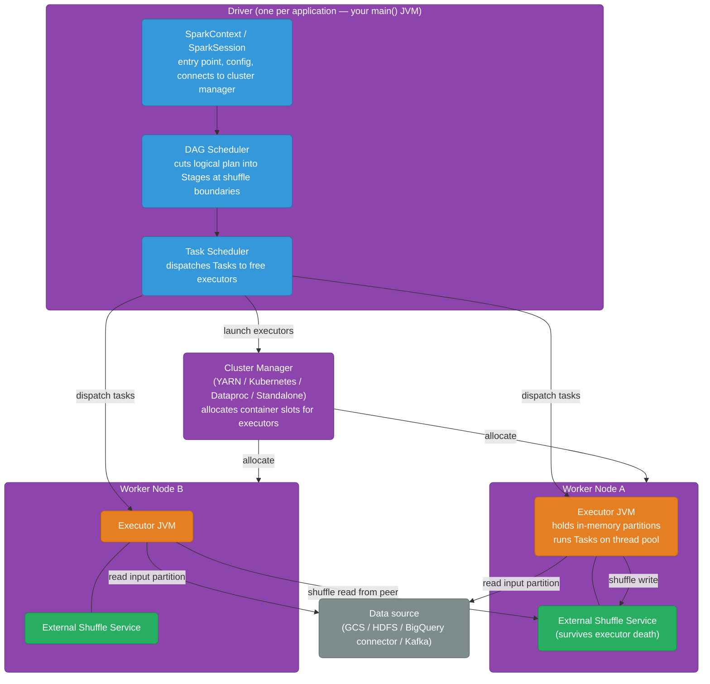

# Apache Spark Internals

Spark is an open-source distributed compute engine for large-scale data processing. It replaced Hadoop MapReduce as the de-facto batch/streaming compute layer — same HDFS/YARN ecosystem, but keeps hot data in memory across stages instead of writing every intermediate result to disk. On GCP you run Spark through **Dataproc** (managed clusters) or **Dataproc Serverless** (no cluster management). This page is the internals reference a backend or DevOps engineer needs: architecture, execution model, the knobs you actually tune on-call, and when to pick Spark over BigQuery or Dataflow.

<div class="quiz-progress" data-quiz-progress>
  <span class="quiz-progress-label">0/0 checks</span>
  <span class="quiz-progress-bar"><span class="quiz-progress-fill"></span></span>
</div>

---

## Architecture



**Four components every on-call engineer cares about:**
- **Driver** — the JVM that runs your `main()`. Crashes here = job fails. OOM here = collect/toPandas on too many rows.
- **Cluster Manager** — allocates executor containers. On Dataproc this is YARN; on GKE-based Dataproc Serverless it's Kubernetes.
- **Executors** — JVM workers that hold in-memory data partitions and run tasks. OOM here = partition too large for executor heap.
- **External Shuffle Service** — a sidecar that holds shuffle blocks independently of the executor. Lets YARN/Kubernetes kill and restart executors mid-job without losing shuffle data.

<div class="quiz-card">
  <p class="quiz-q">The Driver JVM runs out of memory mid-job. What happens to the executors and their in-memory partitions?</p>
  <button class="quiz-reveal">Reveal answer</button>
  <div class="quiz-a" hidden>The entire application fails — the Driver is the coordinator; without it the executors have no one to receive tasks from or report results to, and they get cleaned up by the cluster manager. Their in-memory partitions are lost. This is why you never call <code>.collect()</code> or <code>.toPandas()</code> on a large dataset — it pulls all rows into Driver memory, which is where the Driver OOM happens. Keep Driver heap small (it's just coordination logic), keep the heavy data in executors.</div>
</div>

---

## Execution Model — From Code to CPU Work

The key mental model: **transformations are lazy; actions trigger execution.**

- **Transformation** — `filter`, `map`, `groupBy`, `join`, `repartition` — returns a new RDD/DataFrame describing a logical operation. Nothing runs.
- **Action** — `count`, `show`, `collect`, `write.save` — submits the accumulated plan to the DAG Scheduler. This is when CPU work happens.

<div class="stepper">
  <div class="stepper-panels">
    <div class="stepper-panel active">
      <strong>1. Action called — plan submitted.</strong> When your code calls <code>.count()</code>, the SparkSession hands the accumulated DataFrame plan to the DAG Scheduler. Catalyst optimizer rewrites and fuses transforms first (column pruning, predicate pushdown, join reordering) before the DAG Scheduler ever sees it.
    </div>
    <div class="stepper-panel">
      <strong>2. DAG Scheduler cuts the plan into Stages.</strong> Every <em>wide transformation</em> — one that needs to move rows between partitions (<code>groupBy</code>, <code>join</code>, <code>repartition</code>, <code>distinct</code>) — is a shuffle boundary. The DAG Scheduler cuts the logical plan at each shuffle, producing a sequence of Stages. Narrow transformations (<code>filter</code>, <code>map</code>, <code>withColumn</code>) that operate on one partition at a time are fused into the same Stage as their neighbors — no network crossing, no separate stage.
    </div>
    <div class="stepper-panel">
      <strong>3. Task Scheduler dispatches Tasks.</strong> Each Stage becomes a set of parallel Tasks — one Task per input partition. The Task Scheduler sends each Task to an idle executor thread. A 200-partition DataFrame → 200 Tasks in that Stage, up to (executors × cores-per-executor) running in parallel at a time.
    </div>
    <div class="stepper-panel">
      <strong>4. Executors run narrow-transform Tasks in memory.</strong> Each executor reads its partition slice from the source (GCS, HDFS, BigQuery connector), applies the fused narrow transforms entirely in memory, and produces its output partition — never touching disk unless the partition overflows executor memory (shuffle spill).
    </div>
    <div class="stepper-panel">
      <strong>5. Shuffle write (wide transform boundary).</strong> At the end of a Stage whose output feeds a wide transform, executors write their output partitions to the external shuffle service — bucketed by the join/group key. This is the disk I/O and network step; it's the main performance cliff in Spark jobs.
    </div>
    <div class="stepper-panel">
      <strong>6. Next Stage reads shuffle files.</strong> Executors in the next Stage read the shuffle output from remote shuffle services (one fetch per source partition), reassemble their own key-range partition, and continue the next set of transforms.
    </div>
    <div class="stepper-panel">
      <strong>7. Final Stage — action completes.</strong> The last Stage either writes results to a sink (Parquet on GCS, BigQuery, Kafka), or returns rows to the Driver (<code>collect</code>, <code>show</code>). Slots are released back to YARN/Kubernetes.
    </div>
  </div>
  <div class="stepper-controls">
    <button class="stepper-prev">← Prev</button>
    <span class="stepper-dots"></span>
    <span class="stepper-label"></span>
    <button class="stepper-next">Next →</button>
  </div>
</div>

```python
from pyspark.sql import SparkSession
from pyspark.sql.functions import col, sum as _sum

spark = SparkSession.builder.appName("orders-etl").getOrCreate()

# All of these are transformations — zero execution happens here
df = (spark.read.parquet("gs://my-bucket/orders/")       # lazy scan plan
        .filter(col("status") == "PAID")                  # narrow — fused in Stage 1
        .withColumn("revenue", col("qty") * col("price")) # narrow — fused in Stage 1
        .groupBy("user_id")                               # wide — shuffle boundary → Stage 2
        .agg(_sum("revenue").alias("total_revenue")))

# This action triggers Stages 1 (scan + filter + transform) then 2 (groupBy + agg)
df.write.parquet("gs://my-bucket/output/user-revenue/")
```

<div class="quiz-card">
  <p class="quiz-q">A Spark job chains: <code>filter → withColumn → join → filter → count</code>. How many Stages does Spark create, and where are the boundaries?</p>
  <button class="quiz-reveal">Reveal answer</button>
  <div class="quiz-a" hidden>Two Stages: Stage 1 = <code>filter + withColumn</code> (both narrow, fused together); the <code>join</code> is a wide transformation requiring a shuffle, so that's the Stage 1/2 boundary; Stage 2 = the <code>join</code>'s output + the second <code>filter</code> (narrow, fused) + <code>count</code> (the action that triggers everything). Narrow transforms are always fused with their neighbors into the same Stage — only wide transforms (shuffle boundaries) split Stages.</div>
</div>

---

## RDD vs DataFrame vs Dataset

<div class="tab-group">
  <div class="tab-buttons">
    <button data-tab="rdd" class="active">RDD</button>
    <button data-tab="dataframe">DataFrame</button>
    <button data-tab="dataset">Dataset</button>
  </div>
  <div class="tab-panels">
    <div class="tab-panel active" data-tab-panel="rdd">
      <strong>Resilient Distributed Dataset — the original API (Spark 1.x).</strong>

```python
# RDD: no schema, no optimizer, you write explicit transformations
rdd = (sc.textFile("gs://my-bucket/orders.csv")
         .filter(lambda line: "PAID" in line)
         .map(lambda line: line.split(","))
         .map(lambda parts: (parts[1], float(parts[4])))  # (user_id, amount)
         .reduceByKey(lambda a, b: a + b))
rdd.saveAsTextFile("gs://my-bucket/output/")
```

      RDDs are just typed collections of JVM objects. Spark has no idea what a "user_id" or "amount" is — it can't push predicates to the source, can't prune columns, can't reorder joins. You serialize the full Python/Java closure and ship it to executors. Slow compared to DataFrame for the same logic. Use only for custom low-level operations DataFrame can't express.
    </div>
    <div class="tab-panel" data-tab-panel="dataframe">
      <strong>DataFrame — the current default (Spark 2.x+).</strong>

```python
# DataFrame: schema-aware, Catalyst optimizer applies automatically
df = (spark.read
        .option("header", "true")
        .csv("gs://my-bucket/orders.csv")
        .filter(col("status") == "PAID")
        .groupBy("user_id")
        .agg(_sum("amount").alias("total")))
df.write.parquet("gs://my-bucket/output/")

# Catalyst optimizer rewrites this plan before execution:
# - pushes filter down to the CSV scan (reads less data)
# - prunes unused columns from the scan
# - picks broadcast join if one side is small
df.explain(extended=True)  # show logical + physical plan
```

      The Catalyst query optimizer understands the schema and rewrites the plan — predicate pushdown, column pruning, join reordering, broadcast join selection. Tungsten code generation then compiles the physical plan to bytecode with no Python overhead per row. **Use DataFrame for everything that isn't specifically an RDD use case.**
    </div>
    <div class="tab-panel" data-tab-panel="dataset">
      <strong>Dataset — typed DataFrame (Scala/Java only).</strong>

```scala
// Dataset: compile-time type safety on top of DataFrame
case class Order(orderId: String, userId: String, amount: Double, status: String)

val ds: Dataset[Order] = spark.read
  .option("header", "true")
  .csv("gs://my-bucket/orders.csv")
  .as[Order]  // cast to typed Dataset

ds.filter(_.status == "PAID")    // compile-time check — status field must exist
  .groupByKey(_.userId)
  .mapValues(_.amount)
  .reduceGroups(_ + _)
  .write.parquet("gs://my-bucket/output/")
```

      Dataset gives compile-time type checking and IDE autocompletion at the cost of serialization overhead for typed operations (they go through encoders). In Python there's no Dataset — `df.as[T]` doesn't exist. In practice, most Scala shops use DataFrame (untyped) for ETL and reserve Dataset for domain model code where compile-time field access matters. Pure Python shop → DataFrame only, always.
    </div>
  </div>
</div>

<div class="quiz-card">
  <p class="quiz-q">You write a <code>filter → groupBy → agg</code> pipeline as an RDD with lambda functions, then rewrite it as an identical DataFrame query. Which one runs faster, and why?</p>
  <button class="quiz-reveal">Reveal answer</button>
  <div class="quiz-a" hidden>DataFrame — by a wide margin for most analytics workloads. The Catalyst optimizer rewrites the DataFrame plan before execution (pushes the filter down to the source so less data is read, prunes columns not referenced, picks broadcast join if applicable), and Tungsten generates JVM bytecode for the physical plan so there's no Python closure serialization or per-row interpreter overhead. The RDD version executes your lambda as-is with no plan optimization whatsoever. Same logical operation, often 5–10× wall-clock difference on large datasets.</div>
</div>

---

## Structured Streaming

Spark Structured Streaming runs the same DataFrame API incrementally over an unbounded source (Kafka, Pub/Sub, file streams). The model: Spark triggers micro-batches on a configurable interval, processes each batch as a mini DataFrame job using the normal Catalyst + Tungsten stack, and advances a persistent checkpoint offset.

```python
from pyspark.sql.functions import window, count

# Streaming DataFrame — same API as batch, declared with readStream
stream_df = (spark.readStream
               .format("kafka")
               .option("kafka.bootstrap.servers", "broker:9092")
               .option("subscribe", "orders")
               .load()
               .selectExpr("CAST(value AS STRING) as json")
               .select(from_json(col("json"), schema).alias("data"))
               .select("data.*"))

# Windowed aggregation over event time — same window API as Beam
result = (stream_df
          .withWatermark("event_time", "10 minutes")   # how long to wait for late data
          .groupBy(window("event_time", "1 minute"), "status")
          .agg(count("*").alias("order_count")))

# Write every micro-batch to BigQuery sink
query = (result.writeStream
           .format("bigquery")
           .option("table", "project:dataset.order_counts_live")
           .option("checkpointLocation", "gs://my-bucket/checkpoints/order-counts/")
           .trigger(processingTime="30 seconds")   # micro-batch interval
           .outputMode("append")
           .start())

query.awaitTermination()
```

**Structured Streaming vs Apache Beam/Dataflow:**

<div class="toggle-switch">
  <div class="toggle-buttons">
    <button data-toggle-opt="streaming" class="active state-ok">Spark Structured Streaming</button>
    <button data-toggle-opt="beam" class="state-ok">Apache Beam / Dataflow</button>
  </div>
  <div class="toggle-panel active" data-toggle-panel="streaming">
    <strong>Micro-batch, Spark-native.</strong> Processes stream data in configurable micro-batches (e.g., every 30 seconds). Same DataFrame API as batch — you write one codebase and run it against both a static Parquet file (testing) and a live Kafka topic (production). The cluster exists; you pay for it between batches. Latency is bounded by the micro-batch interval, not sub-second. On GCP: runs on Dataproc. Good when: you already have Spark batch code, your team knows PySpark/Scala Spark, or you need Python ML libs inside the pipeline.
  </div>
  <div class="toggle-panel" data-toggle-panel="beam">
    <strong>Truly unified batch + streaming, no cluster to manage.</strong> The same Beam SDK code runs against a bounded source (batch) or an unbounded source (streaming) — not micro-batch emulation, but a proper event-time streaming model with watermarks and per-window triggers. On GCP: Dataflow is the managed runner — no cluster to provision, scale, or pay for between jobs. Latency can be sub-second in streaming mode. Good when: you're building net-new pipelines on GCP, want true serverless no-cluster operation, or need low-latency exactly-once streaming. See <code>data-pipelines.md</code> for full Dataflow coverage.
  </div>
</div>

<div class="quiz-card">
  <p class="quiz-q">Spark Structured Streaming fires every 30 seconds. An event arrives at the pipeline 5 seconds after it occurred. What's the earliest this event can appear in the output?</p>
  <button class="quiz-reveal">Reveal answer</button>
  <div class="quiz-a" hidden>Up to 30 seconds after it arrives — it will be processed in the next micro-batch that triggers after its arrival. Micro-batch Structured Streaming has latency bounded by the trigger interval: the event waits until the next batch fires. This is the fundamental trade-off vs true event-time streaming (Beam/Flink): simpler model, predictable batching semantics, but not sub-second. If you set <code>Trigger.Continuous("1 second")</code> (Spark's continuous processing experimental mode) you get lower latency, but micro-batch is stable and the default.</div>
</div>

---

## Operational Config — What You Actually Tune

| Config | Default | What it does | When to change |
|--------|---------|--------------|---------------|
| `spark.executor.memory` | 1g | Heap per executor JVM | Raise when you see OOM or shuffle spill — size to ~75% of worker node RAM after OS overhead |
| `spark.executor.cores` | 1 | Thread slots per executor | 4–5 cores per executor is a common sweet spot — enough parallelism per JVM without GC pressure |
| `spark.sql.shuffle.partitions` | 200 | Partition count after any shuffle | Tune to ~(input size GB × 2); 200 is far too low for a 1TB join and far too high for a 100MB aggregate |
| `spark.memory.fraction` | 0.6 | Fraction of heap for execution + storage | Raise to 0.7–0.75 for memory-intensive aggregations; lower if GC pressure is high |
| `spark.memory.storageFraction` | 0.5 | Sub-fraction reserved for cached RDDs | Lower if you aren't caching DataFrames; that memory goes to execution |
| `spark.sql.autoBroadcastJoinThreshold` | 10MB | Auto-broadcast if one side ≤ this | Raise to 100–200MB for small dimension tables; set to -1 to disable and force sort-merge join |
| `spark.shuffle.service.enabled` | false | Enables external shuffle service | Always `true` on Dataproc — lets YARN decommission executors without losing shuffle blocks |

```bash
# Dataproc job submission with common tuning knobs
gcloud dataproc jobs submit pyspark gs://my-bucket/jobs/etl.py \
  --cluster=my-cluster \
  --region=us-central1 \
  --properties=\
spark.executor.memory=8g,\
spark.executor.cores=4,\
spark.sql.shuffle.partitions=800,\
spark.memory.fraction=0.7,\
spark.shuffle.service.enabled=true,\
spark.sql.autoBroadcastJoinThreshold=104857600
```

**GC tuning:** use G1GC for executors with heap ≥ 4 GB:

```bash
--properties=spark.executor.extraJavaOptions=-XX:+UseG1GC -XX:InitiatingHeapOccupancyPercent=35
```

The default ParallelGC causes long stop-the-world pauses on large heaps — visible as executor task timeouts in the Spark UI event timeline.

<div class="quiz-card">
  <p class="quiz-q">A Spark job processing 500GB of data keeps having tasks straggle — the stage progress bar is stuck at 199/200 tasks complete, waiting for the last one. What's the most likely cause and fix?</p>
  <button class="quiz-reveal">Reveal answer</button>
  <div class="quiz-a" hidden>Data skew — one partition is much larger than the others because one key dominates. The 199 balanced tasks finish fast; the one skewed task runs for minutes because it has far more data. Fixes: (1) <em>Salt the key</em> — append a random suffix (0–N) to the groupBy/join key, spread that partition across N partitions, then aggregate twice to re-combine. (2) Use the <code>skewJoin</code> hint in Spark 3+ on the skewed DataFrame (<code>df.hint("skew", "user_id")</code>) — Spark splits the skewed partition automatically. (3) Raise <code>spark.sql.shuffle.partitions</code> to create more, smaller partitions — doesn't fix a single hot key but helps with generally uneven distributions.</div>
</div>

---

## Spark vs BigQuery vs Dataflow

<div class="toggle-switch">
  <div class="toggle-buttons">
    <button data-toggle-opt="bq" class="active state-ok">BigQuery</button>
    <button data-toggle-opt="dataflow" class="state-ok">Dataflow / Beam</button>
    <button data-toggle-opt="spark" class="state-warn">Spark on Dataproc</button>
  </div>
  <div class="toggle-panel active" data-toggle-panel="bq">
    <strong>Use BigQuery when:</strong> the data already lives in BigQuery, you need ad-hoc or scheduled SQL analytics, and you want zero infrastructure. BigQuery Editions autoscale compute; you pay per TB scanned or per slot-hour. No cluster, no executor sizing, no shuffle config. This is the right answer for ~80% of analytical workloads on GCP. If your question is "can BigQuery do this?" and the answer is yes, stop there — don't spin up a Spark cluster.
  </div>
  <div class="toggle-panel" data-toggle-panel="dataflow">
    <strong>Use Dataflow when:</strong> you need unified batch + streaming from a single codebase, GCP-native serverless autoscaling (no cluster to manage), or true exactly-once streaming with Beam's event-time watermark model. Dataflow earns its place over direct BigQuery inserts when you need stateful aggregation, fan-out to multiple sinks, or complex enrichment transforms upstream. Write once in the Beam SDK, run in batch (GCS source) and streaming (Pub/Sub source) with the same code. See <code>data-pipelines.md</code> for full coverage.
  </div>
  <div class="toggle-panel" data-toggle-panel="spark">
    <strong>Use Spark (Dataproc) when:</strong> you have existing Spark or Hadoop code that needs to migrate to GCP with minimal rewrite; you need Python/Scala ML libraries (<code>scikit-learn</code>, <code>MLlib</code>, <code>XGBoost</code>, <code>PyTorch</code> inside a pipeline stage) that don't exist in Beam; or you need fine-grained executor control (custom partitioners, broadcast variables, iterative ML loops that keep a model in executor memory across iterations). Starting a new pipeline from scratch on GCP today? Default to BigQuery or Dataflow first; reach for Dataproc when one of those specific needs surfaces.
  </div>
</div>

---

## Scenarios — Common Issues

| Issue | Diagnosis | Fix |
|-------|-----------|-----|
| Stage stuck at 199/200, last task runs 10× longer | Data skew — one partition key dominates | Salt the key or use `hint("skew", "col")` (Spark 3+) |
| Executor OOM | Partition too large for executor heap | Raise `executor.memory`, lower `shuffle.partitions` to get fewer bytes-per-partition |
| Job runs fine locally, OOM on cluster | Driver OOM from `.collect()` or `.toPandas()` on a large result | Aggregate before collecting; write to GCS instead |
| "Broadcast timeout" on a join | Side table too large for broadcast, network timeout | Raise `spark.sql.broadcastTimeout` or lower `autoBroadcastJoinThreshold` to force sort-merge |
| Shuffle spill to disk (visible in Spark UI task metrics) | Executor heap too small for in-memory shuffle | Raise `executor.memory` or increase `shuffle.partitions` to reduce per-partition size |
| Slow first query on Dataproc ephemeral cluster | Cluster cold start (~1–2 min for node provisioning) | Pre-warm cluster or use Dataproc Serverless for short jobs |
| GC pauses → executor heartbeat timeout | ParallelGC on large heap | Switch to G1GC: `spark.executor.extraJavaOptions=-XX:+UseG1GC` |
| Data written to output but job marked failed | Executor lost after shuffle write, external shuffle service not enabled | Set `spark.shuffle.service.enabled=true` on Dataproc |
