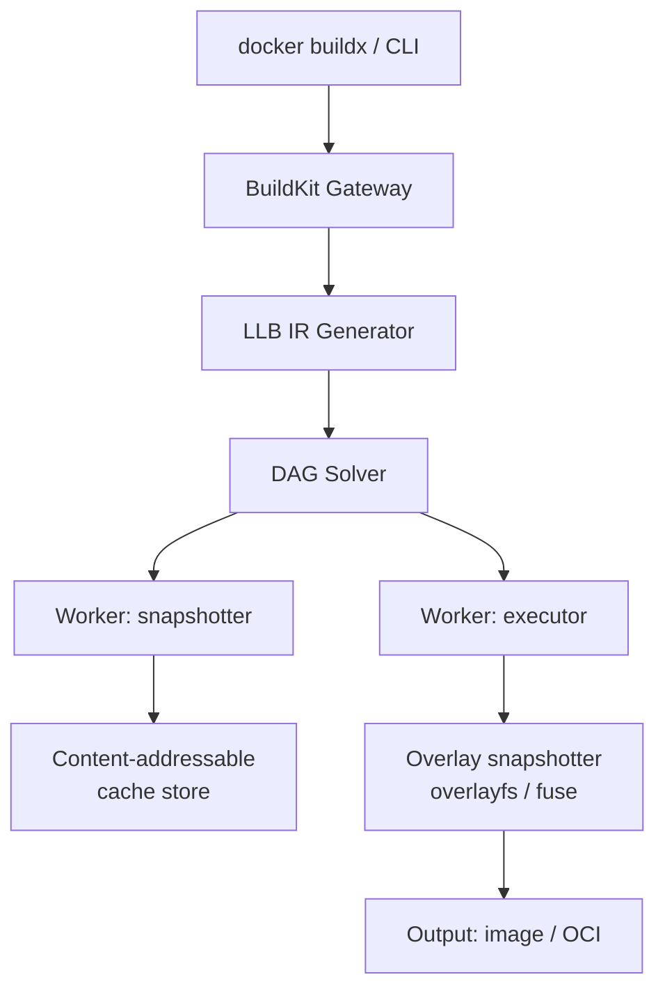
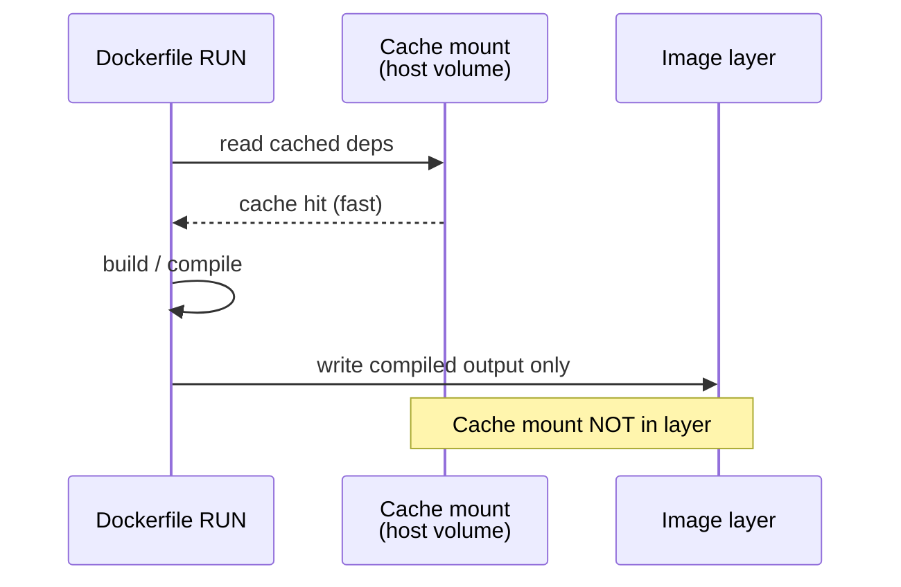

# BuildKit

Practical notes on what BuildKit actually does differently from the classic
Docker builder: it compiles a Dockerfile into a dependency DAG instead of a
linear instruction list, runs independent stages in parallel, and gives you
mount types (`cache`, `secret`, `ssh`) that never end up baked into a layer.
Each major section below ends with a quick check — try to answer before
revealing:

<div class="quiz-progress" data-quiz-progress>
  <span class="quiz-progress-label">0/0 checks</span>
  <span class="quiz-progress-bar"><span class="quiz-progress-fill"></span></span>
</div>

## 1. Architecture



- **buildkitd**: daemon that receives LLB graphs and executes them
- **LLB (Low-Level Build)**: protobuf IR — a DAG of operations (exec, copy, mount)
- **Snapshotter**: manages layer snapshots (overlayfs, native, fuse-overlayfs)
- **Worker**: executes each LLB operation in isolation

<div class="quiz-card">
  <p class="quiz-q">Does the CLI send buildkitd the Dockerfile itself to build?</p>
  <button class="quiz-reveal">Reveal answer</button>
  <div class="quiz-a" hidden>No. <code>buildx</code>/the CLI first translates the Dockerfile into LLB &mdash; a protobuf DAG of low-level operations (exec, copy, mount). The DAG Solver parallelizes, caches, and schedules <em>that</em> graph across workers; it never reasons about Dockerfile syntax directly.</div>
</div>

## 2. Parallel Stage Execution

Classic builder executes stages sequentially. BuildKit builds the dependency DAG and runs independent stages in parallel.

```dockerfile
FROM golang:1.22 AS builder
RUN go build -o /app .

FROM node:20 AS frontend       # independent of builder
RUN npm ci && npm run build

FROM alpine AS final
COPY --from=builder /app /app
COPY --from=frontend /dist /static
```



```mermaid
gantt
    title BuildKit parallel vs sequential
    dateFormat X
    axisFormat %s s

    section Classic Builder
    base image pull   : 0, 3
    builder stage     : 3, 8
    frontend stage    : 8, 13
    final stage       : 13, 15

    section BuildKit
    builder stage     : 0, 5
    frontend stage    : 0, 4
    final stage       : 5, 7
```

BuildKit detects that `builder` and `frontend` have no dependency → runs them concurrently.

Step through what actually happens between t=0 and t=7 in the timeline above:

<div class="stepper">
  <div class="stepper-panels">
    <div class="stepper-panel active">
      <strong>1. Dockerfile parsed into a DAG.</strong> BuildKit walks every
      <code>FROM ... AS &lt;name&gt;</code> stage and every <code>COPY --from=&lt;name&gt;</code>,
      building a dependency graph instead of a flat instruction list.
    </div>
    <div class="stepper-panel">
      <strong>2. Independent stages launch together (t=0s).</strong>
      <code>builder</code> and <code>frontend</code> share no edge in the DAG &mdash;
      each starts pulling its base image and running its own steps immediately,
      on separate workers.
    </div>
    <div class="stepper-panel">
      <strong>3. Each stage finishes on its own clock.</strong> <code>frontend</code>
      finishes at t=4s, <code>builder</code> at t=5s &mdash; neither one waited on
      the other, so the slower of the two sets the pace, not the sum of both.
    </div>
    <div class="stepper-panel">
      <strong>4. <code>final</code> starts once its dependencies are ready (t=5s).</strong>
      Its two <code>COPY --from</code> instructions need <code>builder</code> and
      <code>frontend</code> respectively, so it can't start until both are done &mdash;
      but it doesn't wait on anything else. Total time is
      max(builder, frontend) + final, not builder + frontend + final.
    </div>
  </div>
  <div class="stepper-controls">
    <button class="stepper-prev">← Prev</button>
    <span class="stepper-dots"></span>
    <span class="stepper-label"></span>
    <button class="stepper-next">Next →</button>
  </div>
</div>

<div class="quiz-card">
  <p class="quiz-q"><code>final</code> copies from both <code>builder</code> and <code>frontend</code>. Does that mean <code>final</code> also runs in parallel with them?</p>
  <button class="quiz-reveal">Reveal answer</button>
  <div class="quiz-a" hidden>No. BuildKit parallelizes stages that don't depend on each other &mdash; <code>builder</code> and <code>frontend</code> have no relationship, so they run concurrently. <code>final</code> depends on <em>both</em> of them (via <code>COPY --from</code>), so it can only start once both finish &mdash; that's why it starts at t=5s in the gantt chart above, not t=0.</div>
</div>

## 3. Cache Mounts

Cache mounts persist across builds — the directory is **not** part of the image layer.

```dockerfile
# Go modules cache
RUN --mount=type=cache,target=/go/pkg/mod \
    --mount=type=cache,target=/root/.cache/go-build \
    go build -o /app .

# apt cache
RUN --mount=type=cache,target=/var/cache/apt \
    apt-get update && apt-get install -y curl

# npm cache
RUN --mount=type=cache,target=/root/.npm \
    npm ci
```



Same flow, one step at a time:

<div class="stepper">
  <div class="stepper-panels">
    <div class="stepper-panel active">
      <strong>1. RUN starts, cache mount requested.</strong> BuildKit sees
      <code>--mount=type=cache,target=/go/pkg/mod</code> and resolves that
      target against its cache store instead of the image filesystem.
    </div>
    <div class="stepper-panel">
      <strong>2. Matching cache found → mounted read-write.</strong> If a
      cache blob for that target (and sharing mode) already exists on this
      worker, it's attached at <code>/go/pkg/mod</code> before the command
      runs &mdash; a cache hit.
    </div>
    <div class="stepper-panel">
      <strong>3. The command reads and writes the mount directly.</strong>
      <code>go build</code> / <code>npm ci</code> populate or reuse
      <code>/go/pkg/mod</code> like any other directory &mdash; from its point
      of view, nothing looks different from a normal build.
    </div>
    <div class="stepper-panel">
      <strong>4. RUN finishes → only non-mount changes become the layer.</strong>
      Whatever landed inside <code>/go/pkg/mod</code> stays in the cache store
      for the <em>next</em> build; it's never committed into this image's
      layer. Only files written elsewhere in the filesystem (the compiled
      binary) end up in the layer.
    </div>
  </div>
  <div class="stepper-controls">
    <button class="stepper-prev">← Prev</button>
    <span class="stepper-dots"></span>
    <span class="stepper-label"></span>
    <button class="stepper-next">Next →</button>
  </div>
</div>

Cache scope options control what happens when two builds want the same cache mount at once:

<div class="tab-group">
  <div class="tab-buttons">
    <button data-tab="shared" class="active">shared (default)</button>
    <button data-tab="locked">locked</button>
    <button data-tab="private">private</button>
  </div>
  <div class="tab-panels">
    <div class="tab-panel active" data-tab-panel="shared">
      <pre><code>RUN --mount=type=cache,target=/go/pkg/mod,sharing=shared</code></pre>
      All concurrent builds share one cache directory. Fastest, but two builds
      writing at once can race inside it &mdash; fine for package managers
      that are themselves safe for concurrent access.
    </div>
    <div class="tab-panel" data-tab-panel="locked">
      <pre><code>RUN --mount=type=cache,target=/go/pkg/mod,sharing=locked</code></pre>
      Same cache directory, but only one build may hold it at a time &mdash;
      others block until it's free. Use when the tool writing into the cache
      isn't safe for concurrent writers.
    </div>
    <div class="tab-panel" data-tab-panel="private">
      <pre><code>RUN --mount=type=cache,target=/go/pkg/mod,sharing=private</code></pre>
      Each concurrent build gets its own copy of the cache instead of
      contending for one. No races, but no sharing either &mdash; every
      parallel build pays its own cache-warm cost.
    </div>
  </div>
</div>

<div class="quiz-card">
  <p class="quiz-q">A RUN step uses <code>--mount=type=cache,target=/go/pkg/mod</code>. After the build finishes, is <code>/go/pkg/mod</code>'s contents part of the final image layer?</p>
  <button class="quiz-reveal">Reveal answer</button>
  <div class="quiz-a" hidden>No. Cache mounts are tracked separately from the image &mdash; only filesystem changes outside the mount target get committed as a layer. That's the entire point: the dependency cache persists across builds without bloating (or ever appearing in) the image itself.</div>
</div>

## 4. Secret Mounts

Secrets are available only during the `RUN` step — never written to any layer.

```dockerfile
RUN --mount=type=secret,id=gh_token \
    GITHUB_TOKEN=$(cat /run/secrets/gh_token) \
    GONOSUMCHECK=* GOFLAGS=-mod=mod \
    go mod download
```

```bash
docker buildx build \
  --secret id=gh_token,env=GITHUB_TOKEN \
  -t myapp:latest .
```

Verification — secret is absent from history:
```bash
docker history myapp:latest   # no token visible
docker save myapp:latest | tar xO | strings | grep -c TOKEN  # 0
```

<div class="quiz-card">
  <p class="quiz-q">After <code>RUN --mount=type=secret,id=gh_token ...</code> runs, will <code>docker history</code> or the exported image tarball contain the token?</p>
  <button class="quiz-reveal">Reveal answer</button>
  <div class="quiz-a" hidden>No &mdash; that's the whole point of a secret mount. The secret is only present at <code>/run/secrets/gh_token</code> for the duration of that one RUN step; it's never written to a layer, so it doesn't show up in history or in a <code>docker save</code> tarball. That's exactly what the verification commands above check for.</div>
</div>

## 5. SSH Agent Forwarding

For private Git repos without exposing keys:

```dockerfile
FROM golang:1.22
RUN mkdir -p -m 0700 ~/.ssh && \
    ssh-keyscan github.com >> ~/.ssh/known_hosts
RUN --mount=type=ssh \
    git clone git@github.com:myorg/private-repo.git
```

```bash
eval $(ssh-agent)
ssh-add ~/.ssh/id_ed25519

docker buildx build \
  --ssh default=$SSH_AUTH_SOCK \
  -t myapp:latest .
```

<div class="quiz-card">
  <p class="quiz-q">Does <code>--mount=type=ssh</code> copy your private key file into the image at any point?</p>
  <button class="quiz-reveal">Reveal answer</button>
  <div class="quiz-a" hidden>No. It forwards your local <code>ssh-agent</code>'s socket into the build step over a Unix socket &mdash; the key material itself never leaves your machine or touches the image filesystem. The image only needs <code>known_hosts</code> populated (via <code>ssh-keyscan</code>) so the git clone doesn't hang on a host-key prompt.</div>
</div>

Three different `--mount` types solve three different "don't let this end up in a layer" problems — quick comparison:

<div class="toggle-switch">
  <div class="toggle-buttons">
    <button data-toggle-opt="cache" class="active">type=cache</button>
    <button data-toggle-opt="secret">type=secret</button>
    <button data-toggle-opt="ssh">type=ssh</button>
  </div>
  <div class="toggle-panel active" data-toggle-panel="cache">
    <strong>Persist something across builds.</strong> Package manager caches
    (Go modules, npm, apt). Survives between builds on the same worker; never
    becomes part of the image. Reuse is the whole feature.
  </div>
  <div class="toggle-panel" data-toggle-panel="secret">
    <strong>Use a credential once, then forget it.</strong> Tokens, API keys,
    <code>.npmrc</code> auth. Available only inside the one <code>RUN</code>
    step that mounts it &mdash; not persisted anywhere, not written to any layer.
  </div>
  <div class="toggle-panel" data-toggle-panel="ssh">
    <strong>Authenticate as *you*, without shipping your key.</strong> Private
    git clones over SSH. Forwards your running <code>ssh-agent</code> socket
    into the step; the private key itself never crosses into the build
    container or the image.
  </div>
</div>

## 6. Multi-Platform Builds

```bash
# Create a multi-platform builder
docker buildx create --name multiarch --driver docker-container --use
docker buildx inspect --bootstrap

# Build for multiple platforms and push
docker buildx build \
  --platform linux/amd64,linux/arm64,linux/arm/v7 \
  --push \
  -t myorg/myapp:v1.0.0 .
```

BuildKit uses QEMU for cross-compilation when native hardware is unavailable. For Go, prefer `CGO_ENABLED=0` with `GOARCH` set to avoid QEMU overhead:

```dockerfile
FROM --platform=$BUILDPLATFORM golang:1.22 AS builder
ARG TARGETOS TARGETARCH
RUN CGO_ENABLED=0 GOOS=$TARGETOS GOARCH=$TARGETARCH go build -o /app .
```

## 7. Inline Cache

Push cache metadata to the registry alongside the image:

```bash
# Push image + cache metadata
docker buildx build \
  --cache-to type=registry,ref=myorg/myapp:cache,mode=max \
  --push -t myorg/myapp:latest .

# Pull cache on next build (CI)
docker buildx build \
  --cache-from type=registry,ref=myorg/myapp:cache \
  --push -t myorg/myapp:latest .
```

`mode=max` exports cache for all intermediate layers (not just final). Use in CI for maximum reuse.

Other cache backends:
```bash
# Local filesystem cache
--cache-to type=local,dest=/tmp/buildcache,mode=max
--cache-from type=local,src=/tmp/buildcache

# GitHub Actions cache
--cache-to type=gha,mode=max
--cache-from type=gha
```

## 8. Output Types

```bash
# Default: image in local Docker daemon
docker buildx build -t myapp:latest .

# OCI tarball (portable)
docker buildx build --output type=oci,dest=./myapp.tar .

# Plain tarball
docker buildx build --output type=tar,dest=./myapp.tar .

# Local directory (extract filesystem)
docker buildx build --output type=local,dest=./out .

# Push directly to registry
docker buildx build --output type=image,push=true -t myorg/myapp:latest .
```

| Output type | Use case |
|-------------|----------|
| `image` | Standard Docker image, push to registry |
| `oci` | OCI-compliant tar, use with `skopeo`, `podman` |
| `tar` | Raw filesystem archive |
| `local` | Extract build artifacts to host directory |
