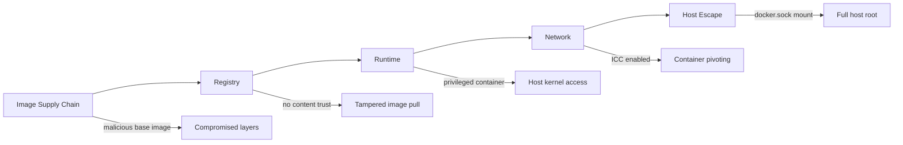
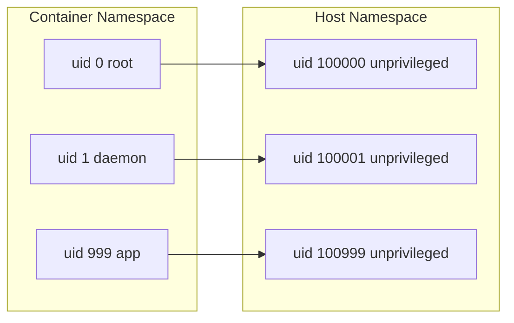
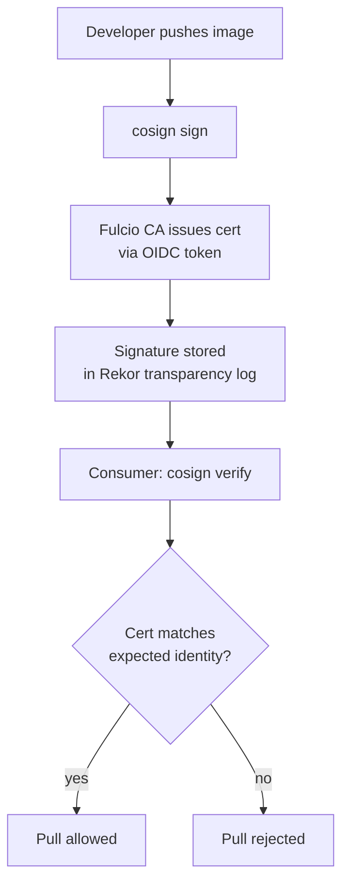
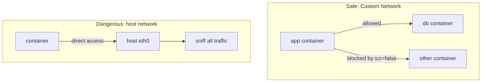

# Docker Security

Attack surface, image supply-chain integrity, and runtime isolation — the parts of running Docker that hand an attacker full host root on the first mistake if they're skipped. Each major section below ends with a quick check; track your progress as you go.

<div class="quiz-progress" data-quiz-progress>
  <span class="quiz-progress-label">0/0 checks</span>
  <span class="quiz-progress-bar"><span class="quiz-progress-fill"></span></span>
</div>

## 1. Attack Surface



<div class="quiz-card">
  <p class="quiz-q">In the attack surface chain above, which single link turns a compromise into <strong>full host root</strong> — not just container-level access?</p>
  <button class="quiz-reveal">Reveal answer</button>
  <div class="quiz-a" hidden>
    The <code>docker.sock</code> mount (Host Escape → Full host root). Full Docker API access from inside a container lets an attacker ask the daemon — which runs as root — to start a brand-new, privileged container with the host filesystem mounted in. Every other link in the chain degrades security; this one hands over the whole host.
  </div>
</div>

## 2. Rootless Docker: UID Remapping

Docker runs containers as root by default. Rootless mode remaps UIDs via user namespaces.

<div class="toggle-switch">
  <div class="toggle-buttons">
    <button data-toggle-opt="rootful" class="active state-bad">Rootful (default)</button>
    <button data-toggle-opt="rootless" class="state-ok">Rootless</button>
  </div>
  <div class="toggle-panel active" data-toggle-panel="rootful">
    The Docker daemon runs as <code>root</code> on the host, and by default a container's <code>uid 0</code> <em>is</em> the host's real <code>uid 0</code>. A container breakout — a kernel bug, a bad mount, an over-granted capability — lands the attacker as actual root on the host, with no extra step required.
  </div>
  <div class="toggle-panel" data-toggle-panel="rootless">
    The daemon, and everything it runs, executes as an unprivileged host user. User namespaces remap container UIDs onto a range of unprivileged host UIDs, so container <code>uid 0</code> is just another unprivileged account from the host's point of view — see the mapping below. A breakout still lands somewhere, but "somewhere" is a non-root host account, not root.
  </div>
</div>

```
Container UID 0   →   Host UID 100000
Container UID 1   →   Host UID 100001
Container UID 999 →   Host UID 100999
```

Formula: `host_uid = subordinate_uid_start + container_uid`

Default subordinate range in `/etc/subuid`:
```
dockremap:100000:65536
```

So `container uid 0` = `host uid 100000` — never actual root on host.



Enable rootless:
```bash
dockerd-rootless-setuptool.sh install
export DOCKER_HOST=unix://$XDG_RUNTIME_DIR/docker.sock
```

<div class="quiz-card">
  <p class="quiz-q">With the default subuid range <code>dockremap:100000:65536</code>, a process inside a rootless container runs as <code>uid 0</code>. What uid does it actually run as on the host?</p>
  <button class="quiz-reveal">Reveal answer</button>
  <div class="quiz-a" hidden>
    Host <code>uid 100000</code> — an ordinary unprivileged account, never the host's real root. <code>host_uid = subordinate_uid_start + container_uid</code>, so container uid 0 maps to <code>100000 + 0</code>.
  </div>
</div>

## 3. Docker Socket Danger

`/var/run/docker.sock` grants **full Docker API access = root on host**.

**The escape:**
```bash
# Attacker inside a container with socket mounted:
docker -H unix:///var/run/docker.sock run -it \
  --rm --privileged \
  -v /:/host \
  alpine chroot /host sh
# Result: root shell on the host
```

<div class="stepper">
  <div class="stepper-panels">
    <div class="stepper-panel active">
      <strong>1. Socket mounted.</strong> A container starts with <code>-v /var/run/docker.sock:/var/run/docker.sock</code> — usually done so the container can "check build status" or orchestrate sibling containers.
    </div>
    <div class="stepper-panel">
      <strong>2. Full API access, no isolation.</strong> Anything inside that container can now talk to the host's Docker daemon directly, exactly as if it were running <code>docker</code> commands on the host itself.
    </div>
    <div class="stepper-panel">
      <strong>3. Spawn a privileged container.</strong> The attacker asks the daemon to run a new container with <code>--privileged</code> and the host's <code>/</code> bind-mounted in — a request the daemon has no reason to refuse, since it can't distinguish "a legitimate build script" from "an attacker."
    </div>
    <div class="stepper-panel">
      <strong>4. chroot into the host filesystem.</strong> <code>chroot /host sh</code> makes the new container's shell treat the mounted host root as its own root filesystem.
    </div>
    <div class="stepper-panel">
      <strong>5. Root shell on the host.</strong> Because the Docker daemon itself runs as root, every step above ran as root — the attacker now has an interactive root shell on the underlying host, not just the original container.
    </div>
  </div>
  <div class="stepper-controls">
    <button class="stepper-prev">← Prev</button>
    <span class="stepper-dots"></span>
    <span class="stepper-label"></span>
    <button class="stepper-next">Next →</button>
  </div>
</div>

Never mount the socket in untrusted containers. If CI/CD needs it, use:

<div class="tab-group">
  <div class="tab-buttons">
    <button data-tab="dind" class="active">Docker-in-Docker</button>
    <button data-tab="kaniko">Kaniko / Buildah</button>
    <button data-tab="proxy">Socket proxy</button>
  </div>
  <div class="tab-panels">
    <div class="tab-panel active" data-tab-panel="dind">
      <strong>Docker-in-Docker (dind) with a sidecar.</strong> Run a full nested Docker daemon in its own sidecar container instead of sharing the host's socket. The build container talks only to its own, disposable daemon — a breakout there compromises the sidecar, not the host.
    </div>
    <div class="tab-panel" data-tab-panel="kaniko">
      <strong>Kaniko or Buildah (daemonless builds).</strong> Build OCI images in userspace, inside the CI container itself, with no Docker daemon involved at all — no socket to mount, so this entire class of escape doesn't exist.
    </div>
    <div class="tab-panel" data-tab-panel="proxy">
      <strong>Socket proxies</strong> like <code>docker-socket-proxy</code> with read-only ACLs. Put a proxy in front of the real socket that exposes only a whitelisted, read-only subset of the Docker API — a compromised build container can check container status but can't ask for a new <code>--privileged</code> container with a host mount.
    </div>
  </div>
</div>

<div class="quiz-card">
  <p class="quiz-q">A container has the Docker socket mounted, but nobody passed it <code>--privileged</code>. Is it still a full host-root risk?</p>
  <button class="quiz-reveal">Reveal answer</button>
  <div class="quiz-a" hidden>
    Yes. The socket itself grants full Docker API access, and that API includes "start a new container with <code>--privileged</code> and a host mount." The attacker doesn't need to already be privileged — they just ask the daemon, which <em>is</em> root, to start something that is.
  </div>
</div>

## 4. Image Scanning with Trivy

```bash
# Scan an image
trivy image nginx:latest

# Fail CI on CRITICAL or HIGH
trivy image --exit-code 1 --severity CRITICAL,HIGH myapp:latest

# Scan filesystem (in CI before build)
trivy fs --severity CRITICAL,HIGH .
```

CVE severity levels:
| Level | CVSS Score | Action |
|-------|-----------|--------|
| CRITICAL | 9.0–10.0 | Block immediately |
| HIGH | 7.0–8.9 | Block in CI |
| MEDIUM | 4.0–6.9 | Track / schedule fix |
| LOW | 0.1–3.9 | Informational |

The commands above are really one pipeline, run in order:

<div class="stepper">
  <div class="stepper-panels">
    <div class="stepper-panel active">
      <strong>1. Scan the filesystem pre-build.</strong> <code>trivy fs --severity CRITICAL,HIGH .</code> checks dependencies and source before an image even gets built — catches a vulnerable library before you spend time building on top of it.
    </div>
    <div class="stepper-panel">
      <strong>2. Build the image.</strong> Normal <code>docker build</code> / <code>buildx build</code> step, unchanged by scanning.
    </div>
    <div class="stepper-panel">
      <strong>3. Scan the built image.</strong> <code>trivy image myapp:latest</code> inspects every layer of the finished image, not just what you wrote — this is where a vulnerable base image or a transitively pulled-in package shows up.
    </div>
    <div class="stepper-panel">
      <strong>4. Compare against the severity gate.</strong> <code>--exit-code 1 --severity CRITICAL,HIGH</code> makes Trivy exit non-zero the moment it finds anything at or above that threshold.
    </div>
    <div class="stepper-panel">
      <strong>5. CI passes or blocks.</strong> A non-zero exit code fails the CI step and blocks the merge/deploy — MEDIUM and LOW findings get tracked, but don't stop the pipeline.
    </div>
  </div>
  <div class="stepper-controls">
    <button class="stepper-prev">← Prev</button>
    <span class="stepper-dots"></span>
    <span class="stepper-label"></span>
    <button class="stepper-next">Next →</button>
  </div>
</div>

CI pipeline block:
```yaml
# GitHub Actions
- name: Scan image
  run: trivy image --exit-code 1 --severity CRITICAL,HIGH $IMAGE
```

## 5. Content Trust: cosign + Sigstore

**Keyless signing** with Sigstore (no long-lived keys, uses OIDC identity):

```bash
# Sign after push (keyless via Sigstore Fulcio CA)
cosign sign --yes ghcr.io/myorg/myapp:v1.0.0

# Verify on pull
cosign verify \
  --certificate-identity-regexp="https://github.com/myorg/myapp" \
  --certificate-oidc-issuer="https://token.actions.githubusercontent.com" \
  ghcr.io/myorg/myapp:v1.0.0
```



Step through the same flow one stage at a time:

<div class="stepper">
  <div class="stepper-panels">
    <div class="stepper-panel active">
      <strong>1. Push the image.</strong> Developer builds and pushes <code>ghcr.io/myorg/myapp:v1.0.0</code> as normal — nothing signature-related has happened yet.
    </div>
    <div class="stepper-panel">
      <strong>2. cosign sign (keyless).</strong> <code>cosign sign --yes</code> triggers Sigstore's Fulcio CA to issue a short-lived certificate bound to the signer's OIDC identity (e.g. the exact GitHub Actions workflow that ran) — no long-lived private key ever touches disk.
    </div>
    <div class="stepper-panel">
      <strong>3. Signature logged in Rekor.</strong> The signature and certificate are recorded in Sigstore's Rekor transparency log — a public, append-only record that a signature for this exact image digest was made, by this identity, at this time.
    </div>
    <div class="stepper-panel">
      <strong>4. Consumer runs cosign verify.</strong> The puller specifies the identity it expects — <code>--certificate-identity-regexp</code> and <code>--certificate-oidc-issuer</code> — and cosign checks the stored certificate against those constraints, not against a static public key.
    </div>
    <div class="stepper-panel">
      <strong>5. Match → pull allowed; mismatch → rejected.</strong> Anyone can sign an image under their own OIDC identity — the security comes entirely from the verifier insisting on a <em>specific</em> identity, not just "some valid signature exists."
    </div>
  </div>
  <div class="stepper-controls">
    <button class="stepper-prev">← Prev</button>
    <span class="stepper-dots"></span>
    <span class="stepper-label"></span>
    <button class="stepper-next">Next →</button>
  </div>
</div>

<div class="quiz-card">
  <p class="quiz-q">Keyless cosign signing skips managing a private key. What actually stops an attacker from just signing a malicious image themselves?</p>
  <button class="quiz-reveal">Reveal answer</button>
  <div class="quiz-a" hidden>
    Nothing stops them from signing it — anyone can get a Fulcio certificate for their own OIDC identity and produce a valid signature. What protects the consumer is <code>cosign verify</code> checking the certificate's identity against an expected one (<code>--certificate-identity-regexp</code> / <code>--certificate-oidc-issuer</code>). A signature from the wrong identity is rejected even though it's cryptographically valid.
  </div>
</div>

## 6. Runtime Hardening

```bash
docker run \
  --cap-drop ALL \                          # drop all Linux capabilities
  --cap-add NET_BIND_SERVICE \              # add back only what's needed
  --security-opt no-new-privileges \        # prevent privilege escalation via setuid
  --security-opt seccomp=seccomp.json \     # restrict syscalls
  --read-only \                             # immutable filesystem
  --tmpfs /tmp \                            # writable scratch space
  --user 1000:1000 \                        # non-root user
  myapp:latest
```

Key capabilities to never grant:
- `SYS_ADMIN` — nearly equals root
- `NET_ADMIN` — reconfigure host networking
- `SYS_PTRACE` — inspect/modify other processes

Default seccomp profile blocks ~44 syscalls including `ptrace`, `mount`, `kexec_load`.

<div class="quiz-card">
  <p class="quiz-q">A container is run with <code>--read-only</code> but no <code>--tmpfs</code>. What's the most likely visible symptom?</p>
  <button class="quiz-reveal">Reveal answer</button>
  <div class="quiz-a" hidden>
    The app crashes or errors out the moment it tries to write anywhere — <code>/tmp</code>, a cache directory, a lock file — because the entire filesystem is immutable. <code>--tmpfs /tmp</code> carves out a writable, in-memory scratch space so the app still has somewhere to write without weakening the read-only guarantee on the rest of the image.
  </div>
</div>

## 7. BuildKit Secrets (Never in Layer)

```dockerfile
# WRONG — secret baked into image layer
RUN curl -H "Authorization: Bearer $TOKEN" https://api.example.com

# CORRECT — secret mounted at build time, not in layer
RUN --mount=type=secret,id=mysecret \
    TOKEN=$(cat /run/secrets/mysecret) && \
    curl -H "Authorization: Bearer $TOKEN" https://api.example.com
```

```bash
# Build with secret
docker buildx build \
  --secret id=mysecret,src=.env \
  -t myapp:latest .
```

Secret is **never** in:
- Image layers
- `docker history`
- The build cache

<div class="quiz-card">
  <p class="quiz-q">Using <code>RUN --mount=type=secret,id=mysecret</code>, does the secret ever show up in <code>docker history</code> or the final image layers?</p>
  <button class="quiz-reveal">Reveal answer</button>
  <div class="quiz-a" hidden>
    No. The secret is mounted into the build container only for the duration of that <code>RUN</code> instruction and is never written into a layer, <code>docker history</code>, or the build cache — unlike baking it in via a plain <code>curl</code> command with the token inline, which persists it in the image forever.
  </div>
</div>

## 8. Network Hardening

**Disable ICC (inter-container communication):**
```json
// /etc/docker/daemon.json
{
  "icc": false,
  "iptables": true
}
```

With `--icc=false`, containers on the default bridge cannot talk to each other unless explicitly linked.

**Use custom networks:**
```bash
# Only containers on the same named network can communicate
docker network create --driver bridge app-net
docker run --network app-net myapp
docker run --network app-net mydb
```

**Never `--network host` in production:**
- Container shares host network stack
- Bypasses all network isolation
- A compromised container can sniff all host traffic

Three mutually exclusive ways containers end up isolated (or not) from each other, side by side:

<div class="toggle-switch">
  <div class="toggle-buttons">
    <button data-toggle-opt="icc" class="active state-warn">Default bridge, icc=false</button>
    <button data-toggle-opt="custom" class="state-ok">Custom network</button>
    <button data-toggle-opt="host" class="state-bad">--network host</button>
  </div>
  <div class="toggle-panel active" data-toggle-panel="icc">
    All containers still share the same default bridge, but <code>icc=false</code> blocks container-to-container traffic on it unless explicitly linked. Cheap and daemon-wide, but coarse — it's an all-or-nothing switch for the whole default bridge, not per pair of containers.
  </div>
  <div class="toggle-panel" data-toggle-panel="custom">
    Containers on a named network (<code>docker network create --driver bridge app-net</code>) can reach each other; containers on a different network, or none, can't reach them at all. This is the finer-grained tool — group only the containers that actually need to talk, per application, instead of one global on/off switch.
  </div>
  <div class="toggle-panel" data-toggle-panel="host">
    The container shares the host's network stack directly — no isolation at all. Every port the container binds is bound on the host, and a compromised container can sniff every packet the host sees. Avoid in production.
  </div>
</div>



<div class="quiz-card">
  <p class="quiz-q">Two containers sit on the <em>same</em> named custom network (<code>app-net</code>). Does setting <code>icc=false</code> in <code>daemon.json</code> block their traffic too?</p>
  <button class="quiz-reveal">Reveal answer</button>
  <div class="quiz-a" hidden>
    No. <code>icc</code> only governs the default bridge network. Containers you explicitly put on the same custom network can always reach each other — that's the whole point of creating it — regardless of the <code>icc</code> setting.
  </div>
</div>
