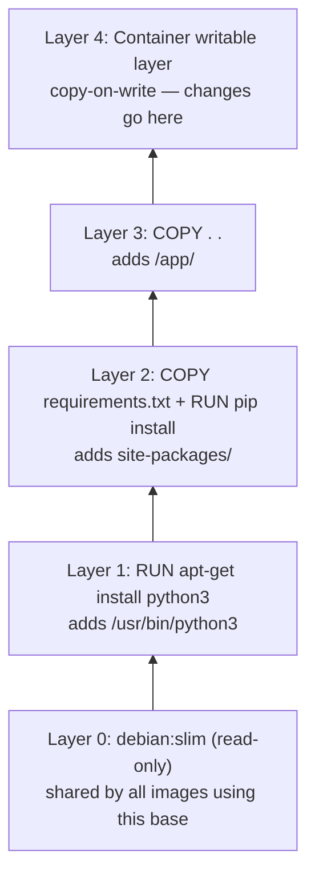
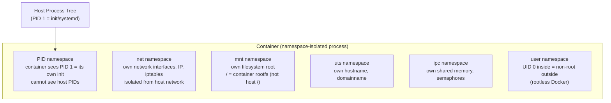
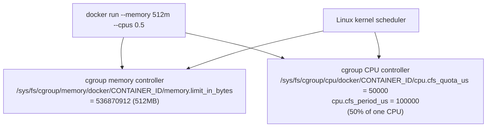
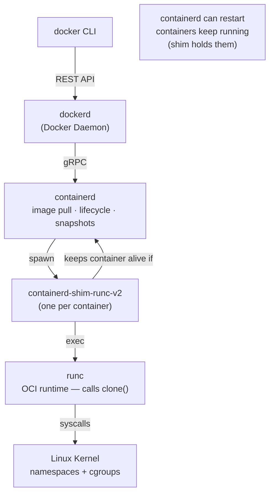
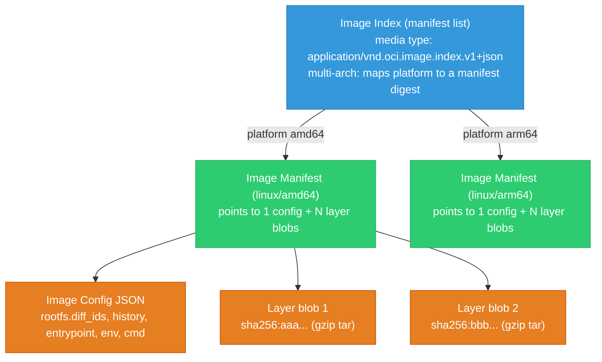
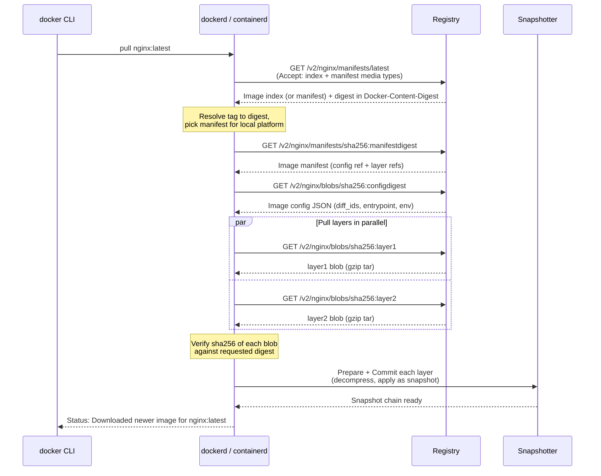
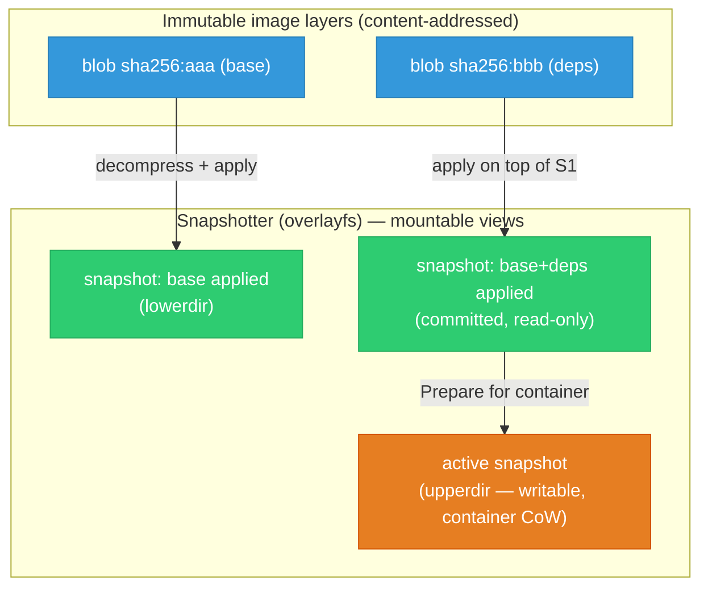

# Docker Internals — Layers, Isolation, and containerd

<div class="quiz-progress" data-quiz-progress>
  <span class="quiz-progress-label">0/0 checks</span>
  <span class="quiz-progress-bar"><span class="quiz-progress-fill"></span></span>
</div>

## Image Layers and Copy-on-Write

Every Dockerfile instruction creates a layer. Layers are **immutable** and **shared** across images.



**Copy-on-Write (CoW):** When a container modifies a file from a lower read-only layer, the storage driver copies the file to the writable layer first, then modifies it. Lower layers are never changed — only the copy in the writable layer changes.

Step through what actually happens the moment a write hits a file that only exists in a lower layer:

<div class="stepper">
  <div class="stepper-panels">
    <div class="stepper-panel active">
      <strong>1. Read, before any write.</strong> The container reads <code>/app/config.py</code>. It doesn't exist in Layer 4 (the writable layer), so the storage driver looks down the stack and resolves it from Layer 2.
    </div>
    <div class="stepper-panel">
      <strong>2. Write arrives.</strong> The container writes to that same file. The driver checks the writable layer first and finds no copy there yet &mdash; only the lower, read-only Layer 2 has it.
    </div>
    <div class="stepper-panel">
      <strong>3. Copy-up.</strong> The <em>entire file</em> (not just the changed bytes) is copied from Layer 2 into Layer 4, the writable layer.
    </div>
    <div class="stepper-panel">
      <strong>4. Modify the copy.</strong> The write is applied to the new copy now sitting in Layer 4. Layer 2's original bytes are never touched &mdash; every other container built from the same image still sees the unmodified file.
    </div>
  </div>
  <div class="stepper-controls">
    <button class="stepper-prev">← Prev</button>
    <span class="stepper-dots"></span>
    <span class="stepper-label"></span>
    <button class="stepper-next">Next →</button>
  </div>
</div>

```bash
# See layers of an image
docker history --no-trunc my-image:v1
# IMAGE               CREATED    CREATED BY                     SIZE
# sha256:abc123...    1 day ago  COPY . .                       2.4MB
# sha256:def456...    1 day ago  RUN pip install -r req.txt     145MB
# sha256:ghi789...    2 days ago RUN apt-get install python3    56MB
# sha256:base000...   1 week ago /bin/sh -c #(nop) CMD          0B

# Storage driver (overlayfs on modern Linux)
docker info | grep Storage
# Storage Driver: overlay2
```

### Why Layer Order Matters

Caching works layer-by-layer from the top down: the moment one instruction's inputs change, that layer and every layer after it get rebuilt. Same two instructions, two different orders, very different rebuild cost:

<div class="tab-group">
  <div class="tab-buttons">
    <button data-tab="bad-order" class="active">Bad ordering</button>
    <button data-tab="good-order">Good ordering</button>
  </div>
  <div class="tab-panels">
    <div class="tab-panel active" data-tab-panel="bad-order">
      <pre><code>FROM python:3.11-slim
COPY . .                          # changes every commit
RUN pip install -r requirements.txt  # reinstalls every commit</code></pre>
      Source code copied before dependencies. Any code change &mdash; even a comment tweak &mdash; invalidates the <code>COPY . .</code> layer, which invalidates every layer after it, so <code>pip install</code> reruns on every single commit.
    </div>
    <div class="tab-panel" data-tab-panel="good-order">
      <pre><code>FROM python:3.11-slim
COPY requirements.txt .           # only changes when deps change
RUN pip install -r requirements.txt  # cached unless requirements.txt changes
COPY . .                          # code changes don't bust the dep layer</code></pre>
      Stable layers first. <code>requirements.txt</code> rarely changes, so the <code>pip install</code> layer stays cached across most commits &mdash; only a change to <code>requirements.txt</code> itself busts it. Code changes only invalidate the final, cheap <code>COPY . .</code> layer.
    </div>
  </div>
</div>

<div class="quiz-card">
  <p class="quiz-q">A container modifies a file that originally came from Layer 1 of its image. After the write, does Layer 1's copy of that file change?</p>
  <button class="quiz-reveal">Reveal answer</button>
  <div class="quiz-a" hidden>No. The storage driver copies the file into the container's writable layer first (copy-on-write), then applies the change there. Layer 1 itself is never touched &mdash; every other image or container sharing that base layer still sees the original, unmodified file.</div>
</div>

---

## How Docker Isolates Processes — Linux Namespaces

Docker containers are just **Linux processes with restricted visibility**. No hypervisor, no separate kernel. The isolation comes from Linux namespaces.



| Namespace | What it isolates |
|-----------|----------------|
| `pid` | Process IDs — container sees PID 1, can't see host processes |
| `net` | Network interfaces, IP, routing, iptables |
| `mnt` | Mount points — container has its own `/` |
| `uts` | Hostname and domain name |
| `ipc` | IPC objects (shared memory, semaphores, message queues) |
| `user` | UID/GID mapping — root inside is not root outside |
| `cgroup` | cgroup root — container has its own cgroup hierarchy |

```bash
# Verify: container's PID namespace
docker run --rm alpine ps aux
# PID   USER     COMMAND
# 1     root     ps aux   ← container sees itself as PID 1

# Host sees the real PID
ps aux | grep alpine   # different, higher PID
```

<div class="quiz-card">
  <p class="quiz-q">Does a Docker container run under its own separate Linux kernel, isolated from the host's?</p>
  <button class="quiz-reveal">Reveal answer</button>
  <div class="quiz-a" hidden>No. There's no hypervisor and no separate kernel &mdash; a container is just a Linux process with restricted visibility. Namespaces make it <em>look</em> like it has its own PID 1, network stack, mounts, and hostname, but every container on a host shares that one host kernel underneath.</div>
</div>

---

## Resource Limits — Linux cgroups

cgroups (control groups) enforce **resource limits**. Docker translates `--memory` and `--cpus` flags into cgroup file writes.



```bash
# Read container's actual cgroup limits from inside
cat /sys/fs/cgroup/memory/memory.limit_in_bytes    # cgroup v1
cat /sys/fs/cgroup/memory.max                       # cgroup v2

# From host — find container cgroup
docker inspect <container> --format='{{.HostConfig.Memory}}'
# 536870912

# Verify CPU throttling
cat /sys/fs/cgroup/cpu/docker/CONTAINER_ID/cpu.stat
# nr_throttled: 45   ← this many scheduling periods were throttled
```

<div class="quiz-card">
  <p class="quiz-q"><code>docker run --cpus 0.5</code> sets <code>cpu.cfs_quota_us=50000</code> against <code>cpu.cfs_period_us=100000</code>. What does that ratio actually enforce?</p>
  <button class="quiz-reveal">Reveal answer</button>
  <div class="quiz-a" hidden>50% of <em>one</em> CPU &mdash; the kernel scheduler gives this container 50,000 out of every 100,000 microseconds of a single core. It's not "50% of all cores." Periods where the container tries to use more than its quota show up as <code>nr_throttled</code> in the cgroup CPU stats.</div>
</div>

---

## Who Manages Containers — containerd and shims



| Component | Responsibility |
|-----------|---------------|
| `dockerd` | Image build, Compose, volumes, networks. Delegates runtime to containerd. |
| `containerd` | Image distribution (OCI), container lifecycle, snapshot management |
| `containerd-shim` | One per container. Keeps container running if containerd restarts. Reports exit codes. |
| `runc` | Low-level OCI runtime. Calls `clone(2)` to create namespaces, then `exec`. |
| Linux kernel | Enforces namespaces + cgroup limits. |

**Why the shim?** If containerd is upgraded/restarted, all containers would die if they were direct children of containerd. The shim is a long-lived process that owns each container — containerd can restart without affecting running containers.

### K8s uses containerd directly (no dockerd)


In Kubernetes, the Docker daemon is not involved at all. kubelet speaks directly to containerd via the CRI (Container Runtime Interface) gRPC API.

---

## Docker Image Optimization

```dockerfile
# Production Go binary — 3-stage build

# Stage 1: Download dependencies (cached layer)
FROM golang:1.23-alpine AS deps
WORKDIR /app
COPY go.mod go.sum ./
RUN go mod download

# Stage 2: Build binary
FROM deps AS builder
COPY . .
RUN CGO_ENABLED=0 GOOS=linux go build \
    -ldflags="-s -w" \     # strip debug symbols → 30-40% smaller binary
    -o /out/api ./cmd/api

# Stage 3: Minimal runtime image
FROM gcr.io/distroless/static-debian12
# distroless = no shell, no package manager, no /bin, ~2MB base
# attack surface is minimal
COPY --from=builder /out/api /api
USER nonroot:nonroot          # never run as root
EXPOSE 8080
ENTRYPOINT ["/api"]           # exec form — SIGTERM goes directly to process
```

| Optimization | Savings | How |
|-------------|---------|-----|
| Multi-stage build | 90%+ | Final image has binary only, no compiler/tools |
| `distroless` base | ~50MB → 2MB | No OS tools, no shell |
| `-ldflags="-s -w"` | 30-40% binary size | Strip symbol table + DWARF |
| `CGO_ENABLED=0` | Enables scratch/distroless | Static binary, no libc dependency |
| `.dockerignore` | Faster builds | Exclude `.git`, `node_modules`, test data |
| COPY deps before src | Cache efficiency | Only reinstall when go.mod changes |

---

## OCI Image Manifest & Config

A Docker image is not a single file — it is a small tree of JSON documents plus a set of layer tarballs (blobs), all defined by the **OCI Image Spec**. There are three document types:



**Image index (manifest list)** — the top-level document for a multi-arch tag. It maps each `os/architecture` to the digest of a per-platform manifest. `docker pull python:3.11` on an arm64 Mac reads the index, then picks the arm64 manifest automatically.

```json
{
  "schemaVersion": 2,
  "mediaType": "application/vnd.oci.image.index.v1+json",
  "manifests": [
    {
      "mediaType": "application/vnd.oci.image.manifest.v1+json",
      "digest": "sha256:5f8a1c...amd64manifest",
      "size": 1472,
      "platform": { "os": "linux", "architecture": "amd64" }
    },
    {
      "mediaType": "application/vnd.oci.image.manifest.v1+json",
      "digest": "sha256:9b2d4e...arm64manifest",
      "size": 1472,
      "platform": { "os": "linux", "architecture": "arm64" }
    }
  ]
}
```

**Image manifest** — the per-platform document. It points to exactly one **config blob** and an ordered list of **layer blobs**. Sizes and digests are recorded so the client can verify and parallelize.

```json
{
  "schemaVersion": 2,
  "mediaType": "application/vnd.oci.image.manifest.v1+json",
  "config": {
    "mediaType": "application/vnd.oci.image.config.v1+json",
    "digest": "sha256:c3ab8f...config",
    "size": 7023
  },
  "layers": [
    {
      "mediaType": "application/vnd.oci.image.layer.v1.tar+gzip",
      "digest": "sha256:aaa111...base",
      "size": 28417536
    },
    {
      "mediaType": "application/vnd.oci.image.layer.v1.tar+gzip",
      "digest": "sha256:bbb222...pipdeps",
      "size": 145293312
    }
  ]
}
```

**Image config JSON** — describes *how to run* the image and *how the rootfs is assembled*. Key fields:

- `rootfs.diff_ids` — ordered list of **uncompressed** layer digests. Applied in order to build the final filesystem.
- `history` — one entry per build step (matches `docker history`), including empty-layer metadata instructions.
- `config` — runtime defaults: `Entrypoint`, `Cmd`, `Env`, `WorkingDir`, `User`, `ExposedPorts`.

```json
{
  "architecture": "amd64",
  "os": "linux",
  "config": {
    "Env": ["PATH=/usr/local/bin:/usr/bin", "PYTHON_VERSION=3.11"],
    "Entrypoint": ["/api"],
    "Cmd": null,
    "WorkingDir": "/app",
    "User": "nonroot"
  },
  "rootfs": {
    "type": "layers",
    "diff_ids": [
      "sha256:diff_aaa...base_uncompressed",
      "sha256:diff_bbb...pipdeps_uncompressed"
    ]
  },
  "history": [
    { "created_by": "/bin/sh -c #(nop) ADD base rootfs" },
    { "created_by": "RUN pip install -r requirements.txt" }
  ]
}
```

### Tag vs Digest

| Reference | Example | Property |
|-----------|---------|----------|
| **Tag** | `python:3.11` | Mutable human label. The registry can re-point it to a new image at any time. |
| **Digest** | `python@sha256:5f8a1c...` | Immutable. It *is* the sha256 of the manifest (or index) bytes — pins one exact image forever. |

A tag is a pointer that can move; a digest is content-addressed and cannot. Pinning by digest (`image@sha256:...`) is the standard way to get reproducible, tamper-evident deploys — the same digest always resolves to the identical bytes.

---

## Content-Addressable Storage & Digests

Every object in an OCI image — the index, the manifest, the config, and each layer blob — is stored and referenced by the **sha256 of its own bytes**. This is content-addressable storage (CAS): the address of a blob *is* its content hash.


**How a layer is addressed.** A layer blob is a tar archive of the filesystem changes for one build step, usually gzip-compressed on the wire. The registry key and local blob filename are `sha256:<hash-of-the-compressed-tarball>`.

**diff_id vs blob digest** — the single most confusing point:

| Term | Hashes | Where used |
|------|--------|-----------|
| **Blob digest** (`layers[].digest`) | The **compressed** (gzip) tarball as transferred | Manifest, registry paths, `docker pull` verification |
| **diff_id** (`rootfs.diff_ids[]`) | The **uncompressed** tar bytes after decompression | Image config; identifies the applied filesystem layer |

So each layer has two hashes: one for the compressed blob you download (for transport/verification), and one for the uncompressed content you apply to the rootfs (stable regardless of compression level). Recompressing a layer changes the blob digest but not the diff_id.

**What content-addressing buys you:**

- **Dedup** — two images sharing `debian:slim` reference the exact same blob digest. The registry stores it once; the client pulls it once and reuses it across images.
- **Integrity** — after downloading a blob, the client recomputes its sha256 and compares to the requested digest. A mismatch (corruption or tampering) is detected before the layer is used.
- **Caching** — if a blob digest already exists locally, the pull is skipped entirely (`Already exists` in pull output).

```bash
# List local content-addressed blobs (containerd)
ctr content ls
# DIGEST                    SIZE     ...
# sha256:aaa111...          27.1 MiB

# Inspect the digest a tag currently resolves to
docker buildx imagetools inspect python:3.11
# also shows per-platform manifest digests from the index
```

---

## How docker pull Works

`docker pull nginx:latest` walks the OCI tree top-down: resolve the tag to a digest, fetch the manifest, fetch the config, then fetch layer blobs in parallel, verifying every digest and unpacking through the snapshotter.



Step by step:

1. **GET manifest by tag** — `GET /v2/<name>/manifests/<tag>`. The `Accept` header lists the OCI/Docker media types the client understands. The registry returns an index or a manifest, and the resolved digest in the `Docker-Content-Digest` header.
2. **Resolve to digest** — if an index came back, the client selects the manifest matching the local `os/arch` and fetches that manifest by digest.
3. **Pull config blob** — `GET /v2/<name>/blobs/<config-digest>`. The config supplies `diff_ids`, entrypoint, env — needed to assemble and later run the image.
4. **Pull layer blobs in parallel** — each `layers[].digest` is fetched as a separate blob request; containerd runs several concurrently. Blobs already present locally (matching digest) are skipped.
5. **Verify digests** — each downloaded blob is sha256-checked against its requested digest; a mismatch aborts the pull.
6. **Extract via snapshotter** — layers are decompressed and applied in order, each committed as a snapshot layered on top of the previous one (see below).

---

## Snapshotter vs Image Layers

An **image layer** and a **snapshot** are two different things that are easy to conflate. The layer is what you *store and transfer*; the snapshot is what you *mount and run*.

| Concept | What it is | Mutable? | Addressed by |
|---------|-----------|----------|--------------|
| **Image layer** | A content-addressed blob (compressed tar of filesystem diffs) | Immutable | Blob digest / diff_id |
| **Snapshot** | A prepared, mountable filesystem view built from applied layers | Active snapshot is writable | Snapshotter-local key/ID |

containerd delegates rootfs assembly to a **snapshotter** — a pluggable component that turns the ordered list of layers into a mounted filesystem. The default on Linux is **overlayfs** (the `overlayfs` snapshotter).



**How a snapshot is prepared per layer.** For each layer, in order, the snapshotter calls `Prepare` (creating a scratch mount on top of the parent snapshot), the layer tar is unpacked into it, then `Commit` freezes it into an immutable, read-only snapshot keyed by its chain ID. The next layer's `Prepare` uses that as its parent. When a container starts, a final `Prepare` produces the **active (writable) snapshot** — the overlayfs `upperdir` where copy-on-write changes land, with the committed snapshots as read-only `lowerdir`s.

**Alternative snapshotters — lazy pulling.** The default flow must download and unpack *every* layer before the container can start. **stargz** (eStargz) and **nydus** snapshotters restructure the image so the filesystem can be mounted immediately and file contents fetched on demand (lazy pulling). A container often reads only a small fraction of image bytes, so lazy-pull snapshotters dramatically cut cold-start latency for large images. Other snapshotters include `native`, `devmapper`, and `btrfs`.
