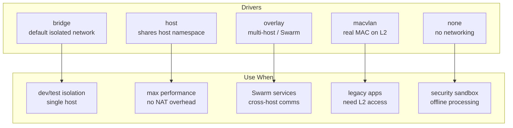
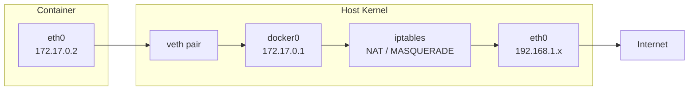
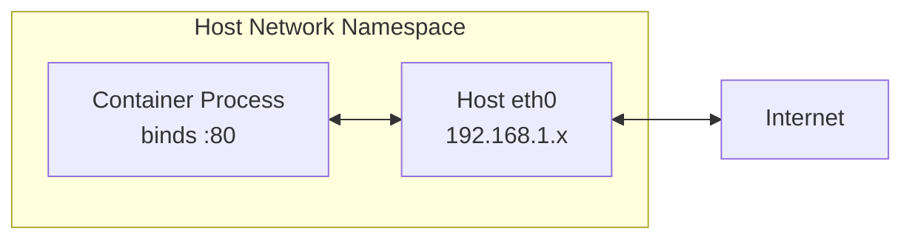
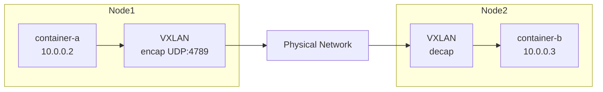
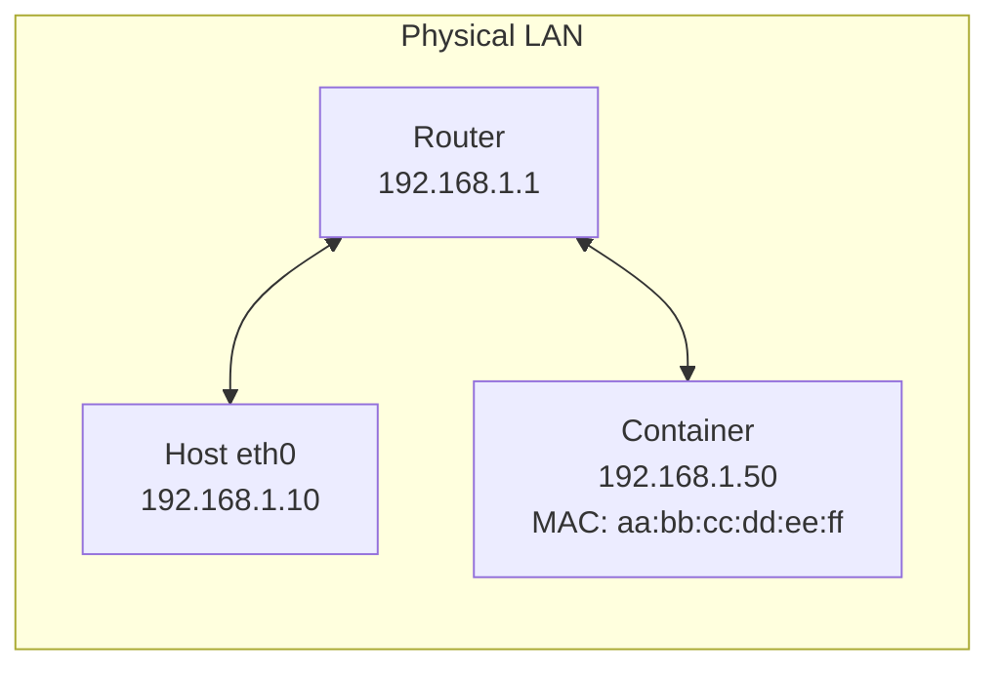
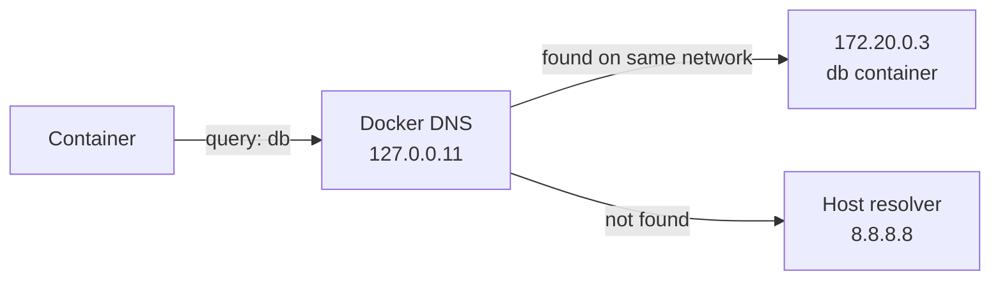
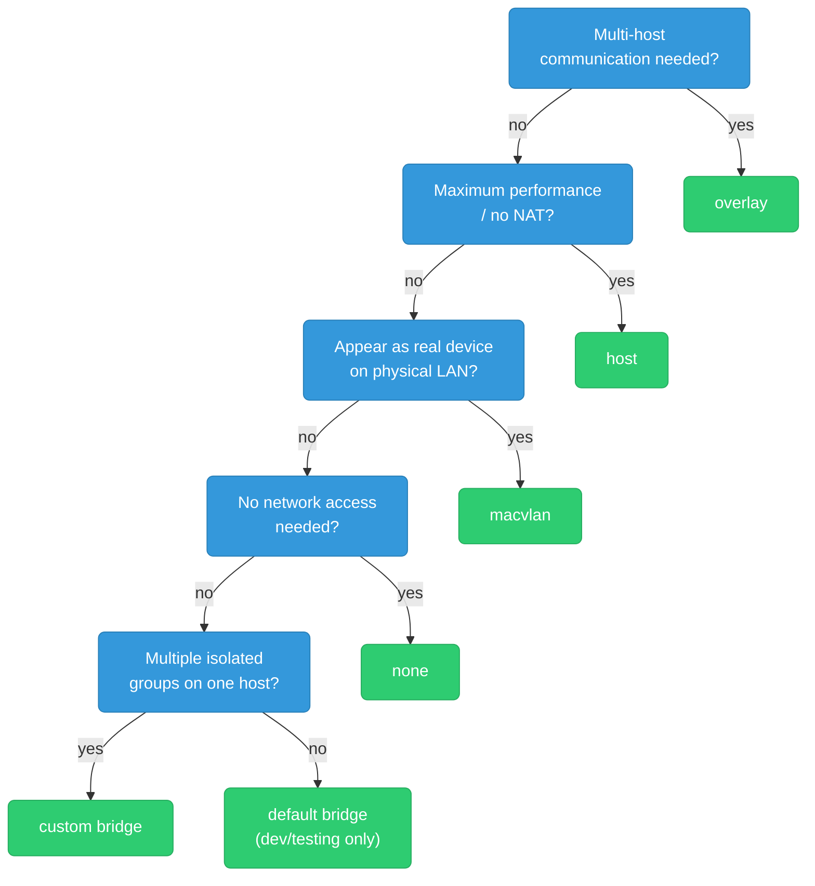

# Docker Networking

Docker supports several network drivers, each changing how a container's traffic reaches the wire — from a fully isolated virtual bridge to sharing the host's real network stack. This guide covers how each one works under the hood, when to reach for it, and where they actually differ once you get past the one-line description.

<div class="quiz-progress" data-quiz-progress>
  <span class="quiz-progress-label">0/0 checks</span>
  <span class="quiz-progress-bar"><span class="quiz-progress-fill"></span></span>
</div>

---

## 1. Network Drivers Overview



| Driver | Isolation | DNS by name | Multi-host | Performance |
|--------|-----------|-------------|------------|-------------|
| bridge | yes | custom only | no | good |
| host | no | no | no | best |
| overlay | yes | yes (Swarm) | yes | moderate |
| macvlan | L2 | no | yes (L2) | best |
| none | full | no | no | — |

Same five drivers, this time as a quick side-by-side of the core mechanism and when to reach for each — the detailed walkthroughs and packet-level diagrams for each one follow in the sections below.

<div class="tab-group">
  <div class="tab-buttons">
    <button data-tab="ov-bridge" class="active">bridge</button>
    <button data-tab="ov-host">host</button>
    <button data-tab="ov-overlay">overlay</button>
    <button data-tab="ov-macvlan">macvlan</button>
    <button data-tab="ov-none">none</button>
  </div>
  <div class="tab-panels">
    <div class="tab-panel active" data-tab-panel="ov-bridge">
      <strong>Own namespace + virtual NIC.</strong> A veth pair connects the container's <code>eth0</code> to the host's <code>docker0</code> bridge; outbound traffic is NATed (MASQUERADE) through the host's real interface. Use for: the default choice for single-host container-to-container communication, dev/test isolation.
    </div>
    <div class="tab-panel" data-tab-panel="ov-host">
      <strong>No namespace of its own.</strong> The container shares the host's network namespace directly &mdash; no veth, no NAT, no port mapping. Whatever port it binds is a real host port. Use for: max throughput / lowest latency, or when a container needs raw socket access or must reach <code>localhost</code> services on the host.
    </div>
    <div class="tab-panel" data-tab-panel="ov-overlay">
      <strong>Own namespace + VXLAN tunnel.</strong> Each node gets a <code>br0</code> + <code>vxlan0</code>; container packets are encapsulated in UDP (port 4789) and carried to other nodes, with Swarm's control plane keeping service DNS and virtual IPs in sync. Use for: multi-host container communication under Swarm.
    </div>
    <div class="tab-panel" data-tab-panel="ov-macvlan">
      <strong>Sub-interface with a real MAC.</strong> The container gets its own MAC address on a sub-interface of the host's physical NIC &mdash; it looks like an independent device on the LAN, not something behind the host. Use for: legacy apps needing L2 access (DHCP, multicast, ARP), or a specific required MAC.
    </div>
    <div class="tab-panel" data-tab-panel="ov-none">
      <strong>Loopback only.</strong> No veth, no bridge, no host-stack sharing &mdash; nothing external at all. Use for: fully isolated batch/offline processing, or as a security sandbox where any networking is a liability.
    </div>
  </div>
</div>

<div class="quiz-card">
  <p class="quiz-q">A custom bridge network gives containers isolation and DNS by name on one host. Does that mean two bridge-networked containers on two <em>different</em> hosts can reach each other by name too?</p>
  <button class="quiz-reveal">Reveal answer</button>
  <div class="quiz-a" hidden>No. Bridge is single-host only &mdash; the table's "Multi-host" column reads "no" for bridge. Reaching containers across hosts by name needs an overlay network (Swarm), which tunnels traffic between nodes over VXLAN and resolves names to virtual IPs through the Swarm control plane.</div>
</div>

---

## 2. Bridge Network (Default)

Every container on the default bridge gets a **veth pair**: one end inside the container (`eth0`), one end attached to the `docker0` bridge on the host.



### Outbound NAT (MASQUERADE)

When a container sends a packet to the internet, the kernel rewrites the source IP to the host's IP:

```
# iptables -t nat -L POSTROUTING
MASQUERADE  all  --  172.17.0.0/16  !docker0  anywhere
```

The return packet is de-NATed back to the container transparently.

### Port Publishing: `-p 8080:80`

`docker run -p 8080:80 nginx` adds a **DNAT** rule in the `DOCKER` chain:

```
# iptables -t nat -L DOCKER
DNAT  tcp  --  anywhere  anywhere  tcp dpt:8080 → 172.17.0.2:80
```

Incoming packet to host:8080 → kernel rewrites dest to container:80 → packet forwarded through `docker0`.

A **docker-proxy** process also listens on 8080 to handle loopback traffic (packets originating from the host itself that bypass iptables DNAT).

<div class="quiz-card">
  <p class="quiz-q">A container publishes port 8080:80. Traffic from another machine on the LAN gets NATed to the container fine via the iptables DNAT rule. Does that same rule handle a <code>curl localhost:8080</code> run on the Docker host itself?</p>
  <button class="quiz-reveal">Reveal answer</button>
  <div class="quiz-a" hidden>No. iptables DNAT only fires on packets that actually traverse PREROUTING &mdash; traffic that originates on the host itself (loopback) bypasses that chain entirely. Docker starts a separate <strong>docker-proxy</strong> userspace process listening on the same port specifically to catch and forward that loopback case.</div>
</div>

---

## 3. Custom Bridge vs Default Bridge

```bash
docker network create my-net
docker run --network my-net --name api  my-api-image
docker run --network my-net --name db   postgres
```

| Feature | Default bridge (`docker0`) | Custom bridge |
|---------|---------------------------|---------------|
| DNS by container name | ❌ | ✅ `ping db` works |
| Automatic isolation | ❌ all containers share it | ✅ per-network |
| Configurable subnet/MTU | limited | ✅ |
| `--link` needed for names | yes (deprecated) | no |

Custom bridges use Docker's **embedded DNS** (127.0.0.11) — containers resolve each other by name automatically. Default bridge only supports IP or `--link`.

<div class="quiz-card">
  <p class="quiz-q">Two containers are both on the default <code>docker0</code> bridge network, no <code>--link</code> used. Can they reach each other by container name out of the box?</p>
  <button class="quiz-reveal">Reveal answer</button>
  <div class="quiz-a" hidden>No. The default bridge has no embedded DNS &mdash; only IP addresses work, or the deprecated <code>--link</code> flag. A custom bridge (<code>docker network create my-net</code>) registers Docker's embedded DNS (127.0.0.11) automatically, which is what makes <code>ping db</code>-style name resolution work.</div>
</div>

---

## 4. Host Network



```bash
docker run --network host nginx
# nginx now listens directly on host:80 — no veth, no NAT
```

**No veth pair. No NAT. No port mapping.** The container process is in the host's network namespace.

**Use when:**
- High-throughput networking (UDP game servers, packet capture tools)
- Container must access host services on `localhost`
- eBPF/XDP programs that need raw socket access
- Benchmarking where NAT overhead matters

**Risk:** port conflicts — container ports are host ports.

<div class="quiz-card">
  <p class="quiz-q">You start two containers with <code>--network host</code>, and both try to bind port 80. What happens?</p>
  <button class="quiz-reveal">Reveal answer</button>
  <div class="quiz-a" hidden>The second one fails to bind. With host networking there's no veth, no NAT, and no per-container port space &mdash; both containers are binding directly to the one real host:80, exactly like two ordinary processes on the same machine fighting over the same port.</div>
</div>

---

## 5. Overlay Network (Swarm / Multi-Host)



**How it works:**
1. Docker creates a `br0` bridge + `vxlan0` interface on each node.
2. Packets from container-a are encapsulated in UDP (VXLAN, port 4789) with outer IP = Node1's IP.
3. Node2 decapsulates and delivers to container-b via its local bridge.

Step through what one packet actually goes through, hop by hop:

<div class="stepper">
  <div class="stepper-panels">
    <div class="stepper-panel active">
      <strong>1. Setup.</strong> Each node in the Swarm already has a <code>br0</code> bridge and a <code>vxlan0</code> interface created by the overlay driver &mdash; this happens once, not per-packet.
    </div>
    <div class="stepper-panel">
      <strong>2. Container-a sends.</strong> The packet leaves container-a's veth into Node1's <code>br0</code>, addressed to container-b's overlay IP (<code>10.0.0.3</code>).
    </div>
    <div class="stepper-panel">
      <strong>3. Encapsulation.</strong> <code>vxlan0</code> wraps the original packet inside a new UDP packet (VXLAN, port 4789), with the outer IP set to Node1's real host IP.
    </div>
    <div class="stepper-panel">
      <strong>4. Crosses the physical network.</strong> To the switch/router in between, this just looks like ordinary UDP traffic between Node1 and Node2 &mdash; it has no visibility into the container IPs riding inside.
    </div>
    <div class="stepper-panel">
      <strong>5. Decapsulation &amp; delivery.</strong> Node2's <code>vxlan0</code> strips the outer UDP header and hands the original packet to its local bridge, which delivers it to container-b.
    </div>
  </div>
  <div class="stepper-controls">
    <button class="stepper-prev">← Prev</button>
    <span class="stepper-dots"></span>
    <span class="stepper-label"></span>
    <button class="stepper-next">Next →</button>
  </div>
</div>

### Swarm Service Discovery

```bash
docker service create --name api --network my-overlay --replicas 3 my-image
```

- Services register in the **Swarm control plane** (Raft-based key-value store).
- Docker DNS resolves `api` → virtual IP (VIP) for the service.
- VIP load-balances across all healthy replicas using IPVS.
- Individual tasks are reachable as `api.1.xxx`, `api.2.xxx`.

---

## 6. macvlan

macvlan creates a **virtual NIC with its own MAC address** attached directly to the host's physical interface. The container appears as a first-class device on the LAN.



```bash
docker network create -d macvlan \
  --subnet=192.168.1.0/24 \
  --gateway=192.168.1.1 \
  -o parent=eth0 \
  macvlan-net

docker run --network macvlan-net --ip 192.168.1.50 my-legacy-app
```

**Use when:**
- Legacy apps that expect to be on a real L2 network (DHCP, multicast, ARP)
- NAS / IoT / SCADA systems requiring specific MAC addresses
- Compliance requiring traffic to appear from a specific MAC

**Caveat:** host cannot talk to macvlan containers by default (promiscuous mode limitation). Use a macvlan interface on the host as a workaround.

---

## 7. Container DNS

Every container on a custom network has `/etc/resolv.conf` pointing to Docker's embedded DNS resolver:

```
nameserver 127.0.0.11
options ndots:0
```



**Resolution order:**
1. Container name on the same Docker network → returns container IP
2. Service name (Swarm) → returns VIP
3. Falls through to host's DNS for external names

Custom bridge networks automatically register container names AND network aliases:

```bash
docker run --network my-net --name db --network-alias database postgres
# both "db" and "database" resolve to the same container
```

---

## 8. Port Publishing Internals

When you run `docker run -p 8080:80`:

### iptables rules added

```bash
# NAT table — DOCKER chain (DNAT inbound)
iptables -t nat -A DOCKER \
  -p tcp --dport 8080 \
  -j DNAT --to-destination 172.17.0.2:80

# NAT table — PREROUTING (send to DOCKER chain)
iptables -t nat -A PREROUTING \
  -m addrtype --dst-type LOCAL \
  -j DOCKER

# FILTER table — DOCKER chain (allow forwarded packets)
iptables -A DOCKER \
  -d 172.17.0.2/32 ! -i docker0 -o docker0 \
  -p tcp --dport 80 -j ACCEPT
```

### docker-proxy

For traffic originating **on the host** (loopback), iptables DNAT doesn't fire. Docker spawns a userspace proxy:

```
/usr/bin/docker-proxy -proto tcp -host-ip 0.0.0.0 -host-port 8080 \
                      -container-ip 172.17.0.2 -container-port 80
```

It accepts connections on host:8080 and proxies them to container:80 via TCP.

### Full packet flow for external traffic to host:8080

```
Client → host:8080
  → PREROUTING → DOCKER chain → DNAT → dest rewritten to 172.17.0.2:80
  → FORWARD → docker0 bridge → veth → container eth0:80
```

---

## 9. Commands Reference

### Create

```bash
# Custom bridge
docker network create my-net

# Custom bridge with subnet
docker network create --subnet 10.10.0.0/24 --gateway 10.10.0.1 my-net

# Overlay (requires Swarm)
docker network create -d overlay my-overlay

# macvlan
docker network create -d macvlan --subnet=192.168.1.0/24 \
  --gateway=192.168.1.1 -o parent=eth0 macvlan-net
```

### List / Inspect

```bash
docker network ls
# NETWORK ID     NAME      DRIVER    SCOPE
# abc123         bridge    bridge    local
# def456         host      host      local
# ghi789         my-net    bridge    local

docker network inspect my-net
```

Sample inspect output:

```json
[{
  "Name": "my-net",
  "Driver": "bridge",
  "IPAM": {
    "Config": [{ "Subnet": "172.20.0.0/16", "Gateway": "172.20.0.1" }]
  },
  "Containers": {
    "c1a2b3...": {
      "Name": "api",
      "IPv4Address": "172.20.0.2/16",
      "MacAddress": "02:42:ac:14:00:02"
    },
    "d4e5f6...": {
      "Name": "db",
      "IPv4Address": "172.20.0.3/16",
      "MacAddress": "02:42:ac:14:00:03"
    }
  },
  "Options": {
    "com.docker.network.bridge.name": "br-abc123"
  }
}]
```

### Connect / Disconnect

```bash
# Attach running container to a second network
docker network connect my-net my-container

# With alias
docker network connect --alias cache my-net redis-container

# Detach
docker network disconnect my-net my-container
```

### Cleanup

```bash
# Remove unused networks
docker network prune

# Remove specific
docker network rm my-net
```

---

## Quick Decision Guide

```
Need containers to talk on one host?     → custom bridge
Need max throughput / no NAT overhead?   → host
Need multi-host / Swarm services?        → overlay
Need container visible on physical LAN?  → macvlan
Need completely isolated container?      → none
```

---

## Network Modes: Deep Comparison

### What actually changes between modes

Each mode changes **which network namespace** the container gets and **how packets reach the wire**.

```mermaid
graph TD
    classDef bridge fill:#3498db,stroke:#2980b9,color:#fff,rx:6
    classDef host fill:#e74c3c,stroke:#c0392b,color:#fff,rx:6
    classDef overlay fill:#9b59b6,stroke:#8e44ad,color:#fff,rx:6
    classDef macvlan fill:#e67e22,stroke:#d35400,color:#fff,rx:6
    classDef none fill:#7f8c8d,stroke:#6c7a7d,color:#fff,rx:6

    subgraph Bridge["bridge — own namespace + virtual NIC"]
        B_C["Container eth0<br/>172.17.0.x"]:::bridge
        B_V["veth pair"]:::bridge
        B_D["docker0 bridge"]:::bridge
        B_IP["iptables NAT"]:::bridge
        B_H["Host eth0"]:::bridge
        B_C --> B_V --> B_D --> B_IP --> B_H
    end

    subgraph Host["host — shares host namespace"]
        H_C["Container process<br/>binds directly to<br/>Host eth0"]:::host
        H_H["Host eth0<br/>(same namespace)"]:::host
        H_C --> H_H
    end

    subgraph Overlay["overlay — own namespace + VXLAN tunnel"]
        O_C["Container eth0<br/>10.0.0.x"]:::overlay
        O_V["veth --> br0"]:::overlay
        O_VX["vxlan0 UDP:4789"]:::overlay
        O_H["Host eth0"]:::overlay
        O_C --> O_V --> O_VX --> O_H
    end

    subgraph Macvlan["macvlan — sub-interface with real MAC"]
        M_C["Container<br/>real MAC + IP<br/>on LAN subnet"]:::macvlan
        M_H["Host eth0<br/>(parent interface)"]:::macvlan
        M_C -->|"sub-interface"| M_H
    end
```



### Packet path comparison

| Mode | Container NIC | Hop count | NAT | Kernel crossing |
|------|--------------|-----------|-----|-----------------|
| **bridge** | virtual veth | container → veth → bridge → iptables → eth0 | Yes (MASQUERADE) | 2 crossings |
| **host** | host eth0 directly | process → eth0 | No | 0 crossings |
| **overlay** | virtual veth | container → veth → br0 → vxlan → eth0 → wire | Yes (VXLAN encap) | 2 crossings + encap overhead |
| **macvlan** | sub-interface of eth0 | container → macvlan sub-iface → eth0 | No | 1 crossing (sub-interface) |
| **none** | loopback only | none | No | No external traffic |

### Performance ordering (fastest → slowest)

```
host = macvlan > bridge > overlay > none (no network)

host:     zero overhead — process is in host namespace, no veth, no NAT
macvlan:  near-wire — one sub-interface hop, no NAT
bridge:   small overhead — veth pair copy + iptables NAT traversal (~5-10% penalty)
overlay:  noticeable overhead — VXLAN encapsulation adds ~100 bytes header per packet
```

### Isolation ordering (most isolated → least)

```
none > bridge (custom) > overlay > macvlan > host

none:          no network at all
bridge:        isolated per-network, NAT hides container IPs
overlay:       network-level isolation, but multi-host
macvlan:       same L2 broadcast domain as physical network
host:          zero isolation — container is the host network
```

### DNS and service discovery

| Mode | Container-to-container by name | How |
|------|-------------------------------|-----|
| **bridge (default)** | ❌ | IP only, or legacy `--link` |
| **bridge (custom)** | ✅ | Docker embedded DNS 127.0.0.11 resolves container names |
| **host** | ❌ | No Docker networking — use host DNS |
| **overlay** | ✅ | Swarm DNS resolves service names to VIPs; tasks by `svcname.N.xxx` |
| **macvlan** | ❌ (no Docker DNS) | Use external DNS or static IPs |
| **none** | ❌ | No networking |

### When each mode breaks

| Mode | Common failure | Symptom |
|------|---------------|---------|
| bridge | `ip_forward=0` on host | Containers can't reach internet |
| bridge | iptables DOCKER-ISOLATION chain | Two custom bridges can't talk to each other by default |
| host | Port conflict | Container port already used by host process |
| overlay | Port 4789/UDP blocked | VXLAN encapsulated packets dropped by firewall |
| macvlan | Promiscuous mode off | Container can't receive packets on physical switch |
| macvlan | Host ↔ container traffic | Host can't reach macvlan containers (add macvlan iface on host) |

### Choosing the right mode — decision flowchart



### Side-by-side example: same app, three modes

```bash
# bridge — typical web service, isolated, port-mapped
docker run -d --name api --network my-net -p 8080:8080 myapp

# host — UDP service needing raw socket / max performance
docker run -d --name udp-relay --network host myapp-udp

# none — batch processor, reads from mounted volume, no network needed
docker run -d --name processor --network none -v /data:/data myapp-batch
```
