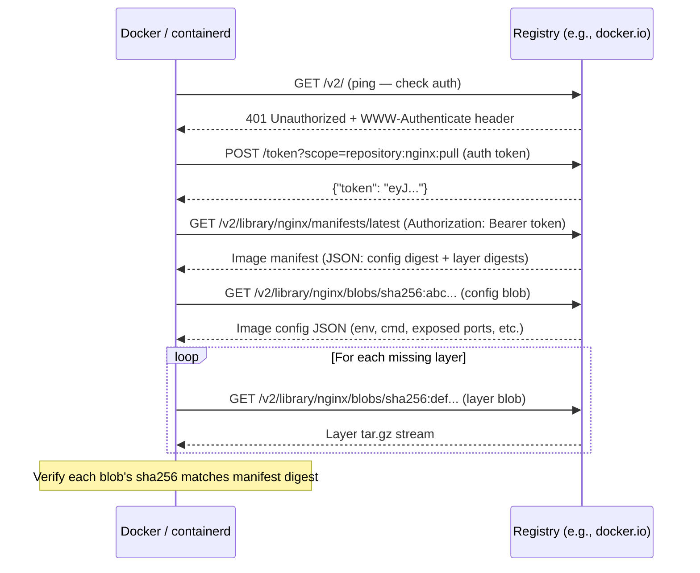

# Container Registry and Image Distribution

How `docker pull` works at the API level, what content-addressable storage means in practice,
how to run Harbor for enterprise registry needs, and how to set up pull-through mirrors for
air-gapped clusters. Builds on [buildkit.md](./buildkit.md) (building images) and
[docker-security.md](./docker-security.md) (image signing with cosign).

<div class="quiz-progress" data-quiz-progress>
  <span class="quiz-progress-label">0/0 checks</span>
  <span class="quiz-progress-bar"><span class="quiz-progress-fill"></span></span>
</div>

---

## 1. OCI Distribution Spec — How `docker pull` Actually Works

Every `docker pull` is a series of HTTP requests against the **OCI Distribution Spec v2 API**.
Understanding this lets you debug pull failures, build registries, and understand why layers
are deduplicated across images.

**Pull sequence:**



**Three OCI specs in play:**

| Spec | What it defines |
|---|---|
| Image Spec | Layer format (tar), config JSON, manifest JSON |
| Distribution Spec | HTTP API for push/pull (GET /v2/...) |
| Runtime Spec | How to run the container (OCI bundle: rootfs + config.json) |

---

## 2. Image Manifest Formats

**Docker Image Manifest v2 Schema 2:**

```json
{
  "schemaVersion": 2,
  "mediaType": "application/vnd.docker.distribution.manifest.v2+json",
  "config": {
    "mediaType": "application/vnd.docker.container.image.v1+json",
    "size": 7023,
    "digest": "sha256:abc123..."
  },
  "layers": [
    {
      "mediaType": "application/vnd.docker.image.rootfs.diff.tar.gzip",
      "size": 27098148,
      "digest": "sha256:def456..."
    },
    {
      "mediaType": "application/vnd.docker.image.rootfs.diff.tar.gzip",
      "size": 459200,
      "digest": "sha256:ghi789..."
    }
  ]
}
```

**OCI Image Index (multi-platform manifest list):**

```json
{
  "mediaType": "application/vnd.oci.image.index.v1+json",
  "manifests": [
    {
      "digest": "sha256:amd64manifest...",
      "platform": { "architecture": "amd64", "os": "linux" }
    },
    {
      "digest": "sha256:arm64manifest...",
      "platform": { "architecture": "arm64", "os": "linux" }
    }
  ]
}
```

When you `docker pull nginx`, Docker fetches the manifest list first, picks the entry
matching your platform, then fetches that platform's specific manifest.

**Content-addressable storage:** Every blob (layer or config) is referenced by its SHA-256
digest. If two images share a layer (same digest), the registry stores it once. Changing one
byte changes the digest, which cascades to a new layer blob — you can't modify a layer without
the manifest digest changing, making tampering detectable.

```bash
# Inspect a manifest without pulling
docker manifest inspect nginx:latest
docker manifest inspect --verbose nginx:latest | jq '.Descriptor.digest'

# Raw API (useful for scripting)
TOKEN=$(curl -s "https://auth.docker.io/token?scope=repository:library/nginx:pull&service=registry.docker.io" | jq -r .token)
curl -H "Authorization: Bearer $TOKEN" \
     -H "Accept: application/vnd.docker.distribution.manifest.v2+json" \
     https://registry-1.docker.io/v2/library/nginx/manifests/latest
```

<div class="quiz-card">
  <p class="quiz-q">You push a new image that shares 8 of 10 layers with an existing image. How many layer blobs are uploaded to the registry?</p>
  <button class="quiz-reveal">Reveal answer</button>
  <div class="quiz-a" hidden>Only 2 — the 2 new layers. The registry uses content-addressable storage: before uploading a layer, the client issues a HEAD request to /v2/{name}/blobs/{digest}. If the registry returns 200 (blob exists), the client skips the upload for that layer. This is why docker push output shows "Layer already exists" for most layers of a new image tag. The registry stores each unique blob once regardless of how many images reference it. This is also why changing just the CMD instruction (which modifies the image config and the last layer) results in a very fast push — all the large filesystem layers are already present.</div>
</div>

---

## 3. Harbor — Enterprise Registry

**Harbor** is the CNCF-graduated on-premises registry. It wraps the standard OCI distribution
API with RBAC, Trivy vulnerability scanning, replication, and retention policies.

```bash
# Install Harbor with Helm
helm repo add harbor https://helm.goharbor.io
helm install harbor harbor/harbor \
  --set expose.type=ingress \
  --set expose.ingress.hosts.core=harbor.example.com \
  --set externalURL=https://harbor.example.com \
  --set persistence.persistentVolumeClaim.registry.size=200Gi
```

**RBAC model:**

```
System admin
  └── Projects (one per team/environment)
       ├── Project Admin
       ├── Developer (push+pull)
       ├── Guest (pull only)
       └── Robot Accounts (service accounts for CI)
```

```bash
# Create a robot account for CI (via Harbor UI or API)
curl -u admin:password \
  https://harbor.example.com/api/v2.0/projects/myproject/robots \
  -H "Content-Type: application/json" \
  -d '{"name":"ci-robot","duration":90,"permissions":[{"access":[{"resource":"repository","action":"push"},{"resource":"repository","action":"pull"}],"kind":"project","namespace":"myproject"}]}'

# Use robot account for CI push
docker login harbor.example.com \
  -u 'robot$myproject+ci-robot' \
  -p '<generated-secret>'
docker push harbor.example.com/myproject/myapp:v1.2.3
```

**Vulnerability scanning** (Trivy embedded):

```bash
# Configure scan on push (Harbor UI: Projects → Configuration → Automatically scan)
# Or trigger via API
curl -X POST -u admin:password \
  https://harbor.example.com/api/v2.0/projects/myproject/repositories/myapp/artifacts/v1.2.3/scan

# Get scan results
curl -u admin:password \
  "https://harbor.example.com/api/v2.0/projects/myproject/repositories/myapp/artifacts?with_scan_overview=true" \
  | jq '.[].scan_overview'
```

**Replication policies** — sync images between registries:

```bash
# Push-based: Harbor pushes to a remote registry on every push
# Pull-based: remote registry pulls on demand

# Create a replication rule to mirror to another Harbor or ECR
# Harbor UI: Administration → Replications → New Replication Rule
# Trigger: event-based (on push) or manual
# Filter: name pattern "myproject/**", tag pattern "v*"
```

**Garbage collection** — remove blobs no longer referenced by any manifest:

```bash
# Harbor UI: Administration → Garbage Collection → GC Now
# Or via API:
curl -X POST -u admin:password \
  https://harbor.example.com/api/v2.0/system/gc

# Note: GC only removes unreferenced blobs — first delete old tags/artifacts:
curl -X DELETE -u admin:password \
  https://harbor.example.com/api/v2.0/projects/myproject/repositories/myapp/artifacts/sha256:olddigest
```

---

## 4. Pull-Through Cache — Registry Mirror

A pull-through cache proxies pulls from a remote registry and caches layers locally.
On subsequent pulls, layers come from the local cache — faster and not subject to Docker Hub
rate limits.

**containerd mirror configuration** (`/etc/containerd/config.toml`):

```toml
[plugins."io.containerd.grpc.v1.cri".registry]
  config_path = "/etc/containerd/certs.d"

# Create per-registry config
# /etc/containerd/certs.d/docker.io/hosts.toml
[host."https://harbor.example.com/v2/dockerhub-proxy"]
  capabilities = ["pull", "resolve"]
  [host."https://harbor.example.com/v2/dockerhub-proxy".header]
    authorization = "Basic <base64-robot-credentials>"
```

**Air-gapped cluster setup:**

```bash
# 1. Sync all required images to an internal registry
docker pull nginx:1.25
docker tag nginx:1.25 harbor.internal.example.com/base/nginx:1.25
docker push harbor.internal.example.com/base/nginx:1.25

# Or use skopeo for bulk copy without docker daemon
skopeo sync \
  --src docker --src-tls-verify=false \
  --dest docker --dest-tls-verify=false \
  docker.io/library nginx:1.25 \
  harbor.internal.example.com/base/

# 2. Configure nodes to use internal registry as mirror
# /etc/containerd/certs.d/docker.io/hosts.toml
[host."https://harbor.internal.example.com"]
  capabilities = ["pull", "resolve"]

# 3. Verify
# Pull nginx:1.25 on an air-gapped node → should come from internal registry
crictl pull docker.io/library/nginx:1.25
```

---

## 5. Image Signing — cosign + Harbor + Kyverno

**Full signing workflow (Sigstore keyless):**

```bash
# 1. Sign image after push (CI pipeline)
IMAGE=harbor.example.com/myproject/myapp:v1.2.3@sha256:<digest>
cosign sign --yes $IMAGE
# → triggers OIDC flow (GitHub Actions / GitLab CI provides OIDC token)
# → Fulcio CA issues short-lived cert tied to OIDC identity
# → Signature stored in registry as a new artifact pointing to the original image
# → Rekor transparency log records the signing event

# 2. Verify
cosign verify \
  --certificate-identity-regexp 'https://github.com/myorg/myrepo/.*' \
  --certificate-oidc-issuer https://token.actions.githubusercontent.com \
  harbor.example.com/myproject/myapp:v1.2.3
```

**Kyverno admission policy to require signatures:**

```yaml
apiVersion: kyverno.io/v1
kind: ClusterPolicy
metadata:
  name: require-image-signature
spec:
  validationFailureAction: Enforce
  rules:
  - name: check-image-signatures
    match:
      any:
      - resources:
          kinds: [Pod]
    verifyImages:
    - imageReferences:
      - "harbor.example.com/myproject/*"
      attestors:
      - entries:
        - keyless:
            subject: "https://github.com/myorg/myrepo/.github/workflows/release.yml@refs/heads/main"
            issuer: "https://token.actions.githubusercontent.com"
```

**Harbor + Notary v2 (cosign-compatible):** Harbor 2.6+ stores cosign signatures alongside
the image. No separate signature store is needed — the signature is just another OCI artifact
in the same project.

---

## 6. Registry Storage Backends

| Backend | Use case | Notes |
|---|---|---|
| Filesystem | Single-node, local dev | Simple; not HA |
| S3 / GCS | Production HA | Cheap, durable; add Redis for metadata caching |
| Azure Blob | Azure deployments | Same as S3 model |
| In-memory | Testing only | Lost on restart |

**Harbor with S3 backend:**

```yaml
# In Harbor Helm values
persistence:
  imageChartStorage:
    type: s3
    s3:
      bucket: my-harbor-bucket
      region: us-east-1
      # Use IRSA / workload identity — no static credentials
      regionendpoint: ""  # leave empty for AWS S3
```

**Blob accumulation:** Every push creates new layer blobs; deleted tags don't immediately
free space. Orphaned blobs (referenced by deleted manifests) accumulate until GC runs.
Run GC on a schedule (weekly or monthly) with Harbor's built-in job.

---

## 7. Multi-Architecture Images

```bash
# Build and push for amd64 + arm64 in one step (buildx)
docker buildx create --use --name multiarch
docker buildx build \
  --platform linux/amd64,linux/arm64 \
  --tag harbor.example.com/myproject/myapp:v1.2.3 \
  --push .

# Inspect the resulting manifest list
docker manifest inspect harbor.example.com/myproject/myapp:v1.2.3
# Shows both platform entries with distinct digests

# How containerd selects the right image:
# crictl pull or containerd image pull → fetches manifest list
# → matches platform (runtime.GOOS + runtime.GOARCH) → fetches that manifest → pulls layers
```

---

## 8. Common Failures

**`manifest unknown`** — tag was deleted or never existed:

```bash
docker pull myregistry.com/myapp:v1.0
# Error: manifest for myregistry.com/myapp:v1.0 not found: manifest unknown
# Fix: verify tag exists, check case sensitivity (tag names are case-sensitive)
docker manifest inspect myregistry.com/myapp:v1.0
```

**`TOOMANYREQUESTS`** — Docker Hub rate limiting (100 pulls/6h anonymous, 200/6h authenticated):

```bash
# Fix: authenticate docker daemon
docker login   # uses 200/6h limit
# Or: configure a pull-through Harbor cache (see §4)
# Or: use a non-Hub base image (gcr.io/distroless, ghcr.io, quay.io — no rate limit)
```

**Digest mismatch on pull:**

```bash
# Pull fails with: "pulled value does not match the expected value"
# Cause: registry content was modified between manifest fetch and blob download (shouldn't happen)
# Or: corrupt layer on registry filesystem
# Debug:
docker pull --disable-content-trust myimage:tag   # bypass digest check (temporary)
# Real fix: delete and re-push the image; verify registry storage integrity
```

**Layer push timeout (chunk upload):**

```bash
# Error: "unknown: Internal server error" or "stream error: INTERNAL_ERROR" on push
# Cause: registry timeout on chunked blob upload (large layers)
# Fix: configure chunk timeout in Harbor (Administration → Configuration → Advanced)
# Or: use BuildKit parallel layer push: BUILDKIT_MAX_PARALLELISM=4 docker buildx build ...
```

---

## Quick Reference

```
Inspect manifest without pull     docker manifest inspect nginx:latest
Raw manifest API                  curl -H "Authorization: Bearer $TOKEN" .../manifests/latest
Check if blob exists              curl -I .../blobs/sha256:digest → 200 = exists, 404 = missing
Harbor robot account login        docker login harbor.host -u 'robot$project+name' -p secret
Sign image (keyless)              cosign sign --yes image@sha256:digest
Verify signature                  cosign verify --certificate-identity-regexp ... image
Enforce signatures (Kyverno)      ClusterPolicy verifyImages
containerd mirror config          /etc/containerd/certs.d/<registry>/hosts.toml
Bulk copy without daemon          skopeo sync --src docker --dest docker image:tag dest/
Multi-arch build+push             docker buildx build --platform linux/amd64,linux/arm64 --push
Harbor GC                         Harbor UI: Administration → GC, or POST /api/v2.0/system/gc
Rate limit fix                    docker login OR Harbor pull-through cache
manifest unknown                  tag doesn't exist — verify with docker manifest inspect
```
