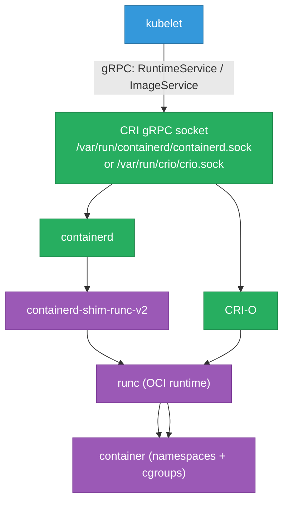

# Container Runtimes — containerd, CRI-O, and Podman

Why Kubernetes removed Docker as a runtime (and what actually changed), how the CRI
(Container Runtime Interface) specification works, what `containerd` and `CRI-O` do
under the hood, how to use `crictl` on K8s nodes, and how to debug containers without
Docker. The complement to [internals.md](./internals.md).

<div class="quiz-progress" data-quiz-progress>
  <span class="quiz-progress-label">0/0 checks</span>
  <span class="quiz-progress-bar"><span class="quiz-progress-fill"></span></span>
</div>

---

## 1. The dockershim Removal — What Actually Changed

Kubernetes 1.20 deprecated the dockershim (the built-in adapter that let kubelet talk to
Docker), and 1.24 removed it entirely. Every article called this "K8s dropping Docker support."
That was misleading.

**What actually changed:**

- kubelet can no longer use Docker directly as a container runtime
- Nodes that ran Docker as a runtime need to switch to containerd or CRI-O

**What did NOT change:**

- Docker images still work — OCI image format is an open standard; containerd and CRI-O both run Docker images
- `docker build` still works for building images — the build tool is separate from the runtime
- `docker push` / `docker pull` from registries unchanged
- `Dockerfile` unchanged

**The pre-removal call chain:**

```
kubelet → dockershim (in kubelet process) → Docker daemon → containerd → runc → container
```

**The post-removal call chain:**

```
kubelet → containerd (via CRI gRPC) → runc → container
```

Docker was acting as a middleman that kubelet couldn't talk to directly (Docker predates CRI).
containerd is what Docker has used internally since 2017 — removing Docker just cuts the
unnecessary wrapper.

---

## 2. CRI — Container Runtime Interface

CRI is a gRPC API between kubelet and the container runtime. Two services:

```protobuf
service RuntimeService {
  rpc RunPodSandbox(RunPodSandboxRequest)   returns (RunPodSandboxResponse);
  rpc StopPodSandbox(StopPodSandboxRequest) returns (StopPodSandboxResponse);
  rpc CreateContainer(CreateContainerRequest) returns (CreateContainerResponse);
  rpc StartContainer(StartContainerRequest) returns (StartContainerResponse);
  rpc StopContainer(StopContainerRequest)  returns (StopContainerResponse);
  rpc ExecSync(ExecSyncRequest)            returns (ExecSyncResponse);
  rpc Exec(ExecRequest)                    returns (ExecResponse);
  // ... attach, port forward, stats, etc.
}

service ImageService {
  rpc PullImage(PullImageRequest)    returns (PullImageResponse);
  rpc ListImages(ListImagesRequest)  returns (ListImagesResponse);
  rpc ImageStatus(ImageStatusRequest) returns (ImageStatusResponse);
  rpc RemoveImage(RemoveImageRequest) returns (RemoveImageResponse);
}
```

kubelet calls these gRPC methods; the runtime responds. Any runtime that implements CRI
can be used with any K8s version — the runtime is a plugin, not a core component.



**The OCI (Open Container Initiative) split:**

| Layer | Spec | Example | Responsibility |
|---|---|---|---|
| Image | OCI Image Spec | Docker image, OCI manifest | Layers, config, manifest |
| Runtime | OCI Runtime Spec | runc, crun, kata-runtime | Run a container from a bundle |
| Distribution | OCI Distribution Spec | Any registry | Push/pull protocol |

CRI sits above OCI. containerd and CRI-O both implement CRI (talking to kubelet) and
use runc (implementing OCI Runtime Spec) to actually start containers.

---

## 3. containerd Architecture

```
containerd
├── API server (gRPC: CRI + containerd native API)
├── Snapshotter — manages layer storage (overlayfs, native, stargz)
├── Content store — stores blobs (layer tarballs, config JSON)
├── Image service — pull, push, resolve
├── Task service — container lifecycle (create, start, kill, delete)
└── containerd-shim-runc-v2
    └── runc — actually executes the OCI bundle
```

The shim (`containerd-shim-runc-v2`) is a separate process per container. Its purpose:
containerd can restart or be upgraded without killing running containers — the shim
stays alive and holds the container's stdio. When containerd comes back, it reconnects
to existing shims.

**CLIs for containerd:**

```bash
# ctr — low-level containerd CLI (no K8s awareness)
ctr images pull docker.io/library/nginx:latest
ctr containers list
ctr tasks list

# nerdctl — Docker-compatible CLI built on containerd
nerdctl run -d --name nginx -p 80:80 nginx
nerdctl ps
nerdctl logs nginx
nerdctl build -t myapp:latest .    # full Docker-compatible build
nerdctl compose up                 # Compose support
```

**containerd namespaces** (not Linux namespaces — containerd's own namespace concept):

```bash
# K8s uses the "k8s.io" containerd namespace
ctr -n k8s.io containers list
ctr -n k8s.io images list

# nerdctl default namespace is "default"
nerdctl --namespace k8s.io ps
```

---

## 4. CRI-O — Lightweight K8s-Only Runtime

CRI-O implements only CRI — it has no CLI, no daemon API beyond CRI, no image registry
support beyond what kubelet needs. It's designed to do one thing: run containers for
Kubernetes.

```
kubelet → CRI-O → conmon (container monitor, per-container) → runc → container
```

`conmon` plays the role containerd-shim does in the containerd stack: it holds stdin/stdout
and stays alive independently of CRI-O. CRI-O can restart without dropping running containers.

**When to choose CRI-O over containerd:**

- OpenShift — CRI-O is the default (Red Hat maintains it)
- Strict minimal footprint — CRI-O has fewer moving parts than containerd
- Pure K8s nodes — no need for `nerdctl`/`ctr`, `docker build`, or Compose support

---

## 5. Podman — Daemonless, Rootless-First

Podman runs containers without a daemon — each `podman run` forks directly into a container.
This means no single point of failure and no root daemon required.

```bash
# Rootless container (runs as your user, no sudo)
podman run -d --name nginx -p 8080:80 nginx

# Docker-compatible commands
podman ps
podman logs nginx
podman exec -it nginx bash
podman build -t myapp .
podman push myapp:latest

# Pods — group containers with shared namespace (like a K8s pod)
podman pod create --name mypod -p 8080:80
podman run -d --pod mypod nginx
podman run -d --pod mypod myapp
podman pod ps
```

**Rootless mechanics:**

```bash
# Podman maps your UID inside the container to a range of UIDs on the host
# via /etc/subuid and /etc/subgid
cat /etc/subuid
# deepanshu:100000:65536
# deepanshu can use UIDs 100000-165535 as "root inside container"

# Networking in rootless mode uses slirp4netns (user-space TCP/IP stack)
# Port < 1024 requires net.ipv4.ip_unprivileged_port_start adjustment or rootful mode
```

**`podman generate kube` — export a running pod as K8s YAML:**

```bash
podman pod create --name myapp -p 8080:80
podman run -d --pod myapp nginx
podman generate kube myapp > myapp-k8s.yaml
# Produces a valid K8s Pod YAML — useful for local-to-cluster migration
```

---

## 6. `crictl` — The Node Debugging Tool

`crictl` is the replacement for `docker` on K8s nodes — it talks CRI gRPC directly to the
runtime, making it runtime-agnostic (works with containerd or CRI-O).

```bash
# Configure crictl (usually in /etc/crictl.yaml on K8s nodes)
cat /etc/crictl.yaml
# runtime-endpoint: unix:///var/run/containerd/containerd.sock
# image-endpoint: unix:///var/run/containerd/containerd.sock

# List running containers (like docker ps)
crictl ps

# List all containers including stopped
crictl ps -a

# Get container logs
crictl logs <container-id>

# Exec into a container
crictl exec -it <container-id> sh

# Inspect a container (full JSON config)
crictl inspect <container-id>

# Get the container's PID on the host (for nsenter)
crictl inspect <container-id> | jq .info.pid

# List pods (K8s pod sandboxes)
crictl pods

# Inspect a pod sandbox
crictl inspectp <pod-id>

# Pull an image
crictl pull nginx:latest

# List images
crictl images

# Remove a stopped container
crictl rm <container-id>
```

**Common debug workflow: pod stuck in CrashLoopBackOff:**

```bash
# On the node where the pod is scheduled
crictl ps -a | grep myapp           # find container id, check Status
crictl logs <container-id>          # see what killed it
crictl inspect <container-id> | jq .status.reason   # OOMKilled? Error?
```

---

## 7. Runtime Classes — gVisor, Kata, WASM

Runtime classes let a K8s cluster offer multiple OCI runtimes to different workloads.

```yaml
# Register a RuntimeClass
apiVersion: node.k8s.io/v1
kind: RuntimeClass
metadata:
  name: gvisor
handler: runsc          # binary in /usr/local/bin/runsc on the node
---
apiVersion: node.k8s.io/v1
kind: RuntimeClass
metadata:
  name: kata
handler: kata-runtime
```

```yaml
# Use it in a Pod spec
apiVersion: v1
kind: Pod
spec:
  runtimeClassName: gvisor    # use gVisor for this pod
  containers:
  - name: app
    image: myapp:latest
```

**Runtime options:**

| Runtime | Mechanism | Isolation | Overhead | Use case |
|---|---|---|---|---|
| `runc` (default) | Linux namespaces + cgroups | Kernel shared with host | ~1ms startup | Standard workloads |
| `gVisor` (runsc) | User-space kernel (Go) intercepts syscalls | User-space kernel | +10–30% CPU | Untrusted code, multi-tenant |
| `Kata Containers` | Full VM (KVM) per container | Hardware VM boundary | +100ms startup | High-security, regulated |
| `runwasi` (WASM) | WASM runtime (wasmtime/wasmedge) | WASM sandbox | ~1ms startup | WASM workloads |

---

## 8. Snapshotters — How Layers Are Stored

The snapshotter manages how image layers are mounted as a container's root filesystem.

| Snapshotter | How it works | Availability |
|---|---|---|
| `overlayfs` | OverlayFS (Linux 3.18+) — default on most Linux distros | Linux only; requires d_type support |
| `native` | Copy-based (no union mount) | macOS (Docker Desktop), any OS |
| `devmapper` | Device Mapper thin provisioning | Legacy; mostly replaced by overlayfs |
| `stargz` | eStargz — lazy-pull format; only fetch the layers you need | Requires registry support + Stargz Snapshotter |

**Stargz lazy pulling:**

Standard image pull: all layers downloaded before container starts.
Stargz: layers are mounted as a FUSE filesystem, bytes fetched on-demand as the container
reads files. A 1GB image with 100MB of files actually read at startup will start in seconds
instead of waiting for the full 1GB download.

```bash
# Enable stargz snapshotter in containerd config
# /etc/containerd/config.toml
[proxy_plugins]
  [proxy_plugins.stargz]
    type = "snapshot"
    address = "/run/containerd-stargz-grpc/containerd-stargz-grpc.sock"

[plugins."io.containerd.grpc.v1.cri".containerd]
  snapshotter = "stargz"
```

---

## 9. Debugging Without Docker — nsenter + crictl Workflow

On a K8s node, `docker` is not installed. The correct workflow:

```bash
# 1. Find the pod on the node
crictl pods | grep mypod

# 2. Get the container ID
crictl ps | grep myapp

# 3. Get the container's host PID
PID=$(crictl inspect <container-id> | jq '.info.pid')

# 4. Enter the container's namespaces
nsenter --target $PID --mount --uts --ipc --net --pid -- sh

# Inside: full container environment, but running as root on the host
# Network debugging (if tools not in image)
nsenter --target $PID --net -- tcpdump -i eth0 -nn
nsenter --target $PID --net -- ss -tlnp
nsenter --target $PID --net -- ip route

# 5. Check filesystem (with host tools)
nsenter --target $PID --mount -- df -h
nsenter --target $PID --mount -- ls /app

# 6. Copy a tool into the container temporarily
ROOTFS=$(crictl inspect <container-id> | jq -r '.info.runtimeSpec.root.path')
cp /usr/bin/strace $ROOTFS/usr/bin/strace   # now strace is available inside
```

**Ephemeral debug container (K8s 1.23+)** — the cleaner approach:

```bash
# Attach a debug container with tools to a running pod
kubectl debug -it <pod> \
  --image=busybox \
  --target=<container-name> \
  -- sh
# Shares process namespace with the target container
```

---

## Quick Reference

```
Runtime call chain (post-dockershim)   kubelet → containerd (CRI gRPC) → runc → container
CRI socket (containerd)                /var/run/containerd/containerd.sock
CRI socket (CRI-O)                     /var/run/crio/crio.sock
containerd namespaces (K8s)            ctr -n k8s.io containers list
Docker-compatible CLI on containerd    nerdctl (supports run, build, compose)
K8s node container list                crictl ps
K8s node container logs                crictl logs <id>
K8s node container PID                 crictl inspect <id> | jq .info.pid
Enter pod namespace                    nsenter --target $PID --mount --net --pid -- sh
Capture pod traffic on node            nsenter --target $PID --net -- tcpdump -i eth0 -nn
Rootless podman check                  cat /etc/subuid
Podman pod export to K8s YAML          podman generate kube <pod>
Debug container in running pod         kubectl debug -it <pod> --image=busybox --target=<c>
gVisor RuntimeClass handler            runsc
Kata Containers RuntimeClass handler   kata-runtime
Stargz lazy-pull snapshotter           stargz (requires plugin)
```
