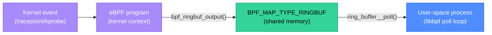

# BPF Fundamentals: Program Types, Maps, and CO-RE

Understanding eBPF at the program level — what hooks programs attach to, how data flows between kernel and user-space, and how portable programs are built — is the foundation for everything from writing a bpftrace one-liner to deploying Cilium or Tetragon. Tools like Cilium abstract away these details, but knowing them helps you debug when things don't work and reason about the performance implications of what you're running.

<div class="quiz-progress" data-quiz-progress>
  <span class="quiz-progress-label">0/0 checks</span>
  <span class="quiz-progress-bar"><span class="quiz-progress-fill"></span></span>
</div>

---

## 1. BPF Program Types

Every eBPF program is associated with a hook point — the kernel event that triggers it. The program type determines what context data is available and what the program can do.

| Program type | Hook | Context available | Return value meaning |
|-------------|------|------------------|---------------------|
| **kprobe** | Kernel function entry | Function arguments | Ignored |
| **kretprobe** | Kernel function return | Return value | Ignored |
| **tracepoint** | Stable kernel tracepoint (e.g., `sys_enter_openat`) | Tracepoint arguments | Ignored |
| **XDP** | Network driver (before kernel allocates skb) | Raw packet bytes | `XDP_PASS`, `XDP_DROP`, `XDP_TX` |
| **TC** (Traffic Control) | Network layer (after skb allocation) | sk_buff | `TC_ACT_OK`, `TC_ACT_SHOT` |
| **uprobe** | User-space function entry (e.g., `libssl.so:SSL_write`) | Function arguments | Ignored |
| **socket filter** | Socket receive path | sk_buff | Bytes to keep (0 = drop) |

**kprobes** vs **tracepoints**: kprobes attach to any kernel function by name — they are powerful but unstable. If the kernel is updated and the function is renamed or inlined, the kprobe breaks silently. Tracepoints are explicitly defined by kernel developers as stable interfaces — they survive kernel updates. Prefer tracepoints when they exist for the event you care about.

**XDP** vs **TC**: XDP runs at the network driver level, before the kernel allocates a socket buffer (`skb`). It's the fastest place to drop or redirect packets (e.g., DDoS mitigation, load balancing). TC runs after the `skb` is allocated, giving access to higher-level metadata (VLAN tags, marks) but with slightly higher overhead. Cilium uses TC for most of its eBPF packet processing.

**uprobe** examples:
```bash
# Trace SSL_write in openssl — intercepts encrypted data before encryption
bpftrace -e 'uprobe:/usr/lib/x86_64-linux-gnu/libssl.so.3:SSL_write { printf("pid=%d len=%d\n", pid, arg2); }'

# Trace Go function entry (note: Go uses a different calling convention)
bpftrace -e 'uprobe:/usr/local/bin/myapp:"main.processRequest" { printf("called\n"); }'
```

<div class="quiz-card">
  <p class="quiz-q">You want to trace every `openat` system call to detect which processes open `/etc/passwd`. You have two options: attach a kprobe to the `do_sys_openat2` kernel function, or attach to the `sys_enter_openat` tracepoint. Which should you choose and why?</p>
  <button class="quiz-reveal">Reveal answer</button>
  <div class="quiz-a" hidden>Use the **`sys_enter_openat` tracepoint**. Tracepoints are defined as stable kernel ABI — the `sys_enter_openat` tracepoint will exist and provide the same arguments (filename, flags, mode) across kernel versions from 4.17 onwards. `do_sys_openat2` is a kernel implementation function — in some kernel versions it's called `do_sys_open`, in others `__do_sys_openat2`, and the compiler may inline it entirely in optimized builds, making the kprobe silently fail. The tracepoint gives you `args->filename` (the path string), which you'd need to read with `bpf_probe_read_user_str()` — but this is well-documented. With kprobe, you'd need to reverse-engineer the function's calling convention from kernel source to find which argument is the filename, and it can change between minor kernel releases. The rule: tracepoint if it exists, kprobe as a last resort.</div>
</div>

---

## 2. BPF Maps

BPF maps are the communication channel between eBPF programs running in the kernel and user-space programs that read and write data. They are also used for communication between multiple eBPF programs (e.g., an XDP program that sets a mark read by a TC program).

| Map type | Data structure | Best use case |
|----------|---------------|---------------|
| **BPF_MAP_TYPE_HASH** | Hash table | Per-key counters (per-PID, per-IP) |
| **BPF_MAP_TYPE_ARRAY** | Fixed-size array indexed by uint32 | Per-CPU global counters; configuration passed from user-space |
| **BPF_MAP_TYPE_RINGBUF** | Lock-free ring buffer | High-throughput event streaming to user-space (preferred over perf event array in modern kernels) |
| **BPF_MAP_TYPE_PERF_EVENT_ARRAY** | Per-CPU perf ring buffer | Legacy event streaming; replaced by RINGBUF in most new code |
| **BPF_MAP_TYPE_LRU_HASH** | LRU hash table (auto-evicts old entries) | Connection tracking, caches with bounded memory |
| **BPF_MAP_TYPE_PERCPU_HASH** | Per-CPU hash (no locking needed) | High-frequency per-key counters without lock contention |

**Kernel program writes to a ring buffer, user-space reads:**



**Map pinning** — maps can be pinned to the BPF filesystem (`/sys/fs/bpf/`) so they persist after the program that created them exits. This allows different programs and user-space processes to share the same map:

```bash
# Pin a map to the BPF filesystem
bpftool map pin id 42 /sys/fs/bpf/my_counters

# A different process reads the pinned map
bpftool map dump pinned /sys/fs/bpf/my_counters
```

---

## 3. CO-RE: Compile Once, Run Everywhere

**The problem CO-RE solves:** eBPF programs written in C often access kernel internal structures (e.g., `struct task_struct` to read a process's PID). The exact layout of `task_struct` changes between kernel versions. Older eBPF programs required kernel headers matching the exact running kernel — they had to be compiled on the target host, or distributed as source code.

**BTF (BPF Type Format)** is metadata about the kernel's type system — the layout of every struct, enum, and typedef, embedded in the kernel image at compile time (available from kernel 5.4+ in most distributions: `/sys/kernel/btf/vmlinux`).

**CO-RE** (available from kernel 5.5+ with libbpf >= 0.3): the eBPF program is compiled once against a synthetic `vmlinux.h` (generated from BTF of any recent kernel). At load time, libbpf reads the running kernel's BTF and rewrites the struct field offsets in the compiled bytecode to match the actual running kernel. The program works on any kernel that has BTF, regardless of version.

```bash
# Generate vmlinux.h from the running kernel's BTF
bpftool btf dump file /sys/kernel/btf/vmlinux format c > vmlinux.h

# Compile a CO-RE eBPF program
clang -target bpf -D__TARGET_ARCH_x86 -O2 -g \
  -I/path/to/libbpf/include \
  -c openat_trace.bpf.c -o openat_trace.bpf.o
```

<div class="quiz-card">
  <p class="quiz-q">You deploy a Cilium version that was compiled on a Debian 12 kernel (5.10) to a cluster of nodes running Ubuntu 22.04 with kernel 5.15 and Rocky Linux 9 with kernel 5.14. Will Cilium's eBPF programs work correctly on all nodes? What is the prerequisite?</p>
  <button class="quiz-reveal">Reveal answer</button>
  <div class="quiz-a" hidden>Yes, if CO-RE is used (which all modern Cilium versions use) AND the nodes have BTF enabled in their kernels. The prerequisite is `/sys/kernel/btf/vmlinux` present on each node — this means the kernel was compiled with `CONFIG_DEBUG_INFO_BTF=y`, which is the default in Ubuntu 22.04 (kernel 5.15) and Rocky Linux 9 (kernel 5.14). When Cilium loads its eBPF programs, libbpf reads each node's BTF and patches the compiled bytecode's struct field accesses to match that specific kernel's layout. The `struct sk_buff` layout on kernel 5.10 vs 5.15 differs slightly (field ordering, added fields), but CO-RE handles this transparently. Without BTF (`/sys/kernel/btf/vmlinux` absent), Cilium would either fail to load (if compiled with strict CO-RE checks) or fall back to a non-eBPF mode. Always verify BTF support with `ls /sys/kernel/btf/vmlinux` before deploying eBPF-based tools to a new node type.</div>
</div>

---

## 4. libbpf

libbpf is the reference C library for loading and managing eBPF programs from user-space. Modern eBPF programs are written in two parts: the kernel-side BPF program (C compiled to BPF bytecode) and the user-space loader (C using libbpf, or Python/Go/Rust bindings).

**Skeleton generation** — libbpf-bootstrap generates a C header that provides a typed interface to the BPF program's maps and programs:

```bash
# Generate skeleton from compiled BPF object
bpftool gen skeleton openat_trace.bpf.o > openat_trace.skel.h
```

**User-space loader using the skeleton:**

```c
#include "openat_trace.skel.h"

int main() {
    struct openat_trace_bpf *skel;

    // Open the BPF object (apply CO-RE relocations)
    skel = openat_trace_bpf__open();

    // Load and verify the BPF program into the kernel
    openat_trace_bpf__load(skel);

    // Attach the program to its hook (tracepoint sys_enter_openat)
    openat_trace_bpf__attach(skel);

    // Poll the ring buffer for events
    struct ring_buffer *rb = ring_buffer__new(
        bpf_map__fd(skel->maps.events), handle_event, NULL, NULL);

    while (true) {
        ring_buffer__poll(rb, 100 /* timeout_ms */);
    }
}
```

Go and Rust bindings (`cilium/ebpf` for Go, `aya-rs/aya` for Rust) follow the same open → load → attach → poll lifecycle.

---

## 5. bpftool

bpftool is the standard debugging CLI for eBPF programs, maps, and links. Essential for understanding what's loaded in a running system.

```bash
# List all loaded BPF programs
bpftool prog list
# 42: kprobe  name sys_openat  tag abc123  gpl
#    loaded_at 2026-09-18T10:00:00+0000  uid 0
#    xlated 256B  jited 192B  memlock 4096B  map_ids 7,8

# Show the BPF bytecode (xlated) of a program
bpftool prog dump xlated id 42

# Show the JIT-compiled native code
bpftool prog dump jited id 42

# List all BPF maps
bpftool map list

# Dump a hash map's contents
bpftool map dump id 7
# key: 00 00 00 00 (PID=0)
# value: 12 00 00 00 (count=18)

# Show what eBPF programs are attached to network interfaces
bpftool net list

# Check BTF types for a program
bpftool prog show id 42 --json | jq '.btf_id'
```

Use `bpftool prog list` to verify that Cilium, Falco, or Tetragon's eBPF programs are actually loaded when troubleshooting why they're not working — sometimes the daemon is running but the programs failed to load silently.
