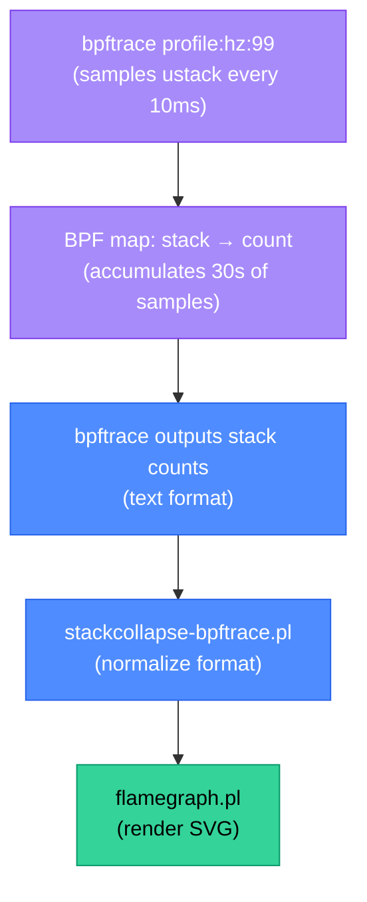

# bpftrace: Production Debugging with eBPF One-Liners

bpftrace is a high-level tracing language for Linux. It compiles to eBPF bytecode and lets you write powerful kernel observability queries in a single line or short script — without writing C or using libbpf. It is the `awk` of kernel tracing: expressive, composable, and production-safe when used correctly.

<div class="quiz-progress" data-quiz-progress>
  <span class="quiz-progress-label">0/0 checks</span>
  <span class="quiz-progress-bar"><span class="quiz-progress-fill"></span></span>
</div>

---

## 1. One-Liners for Production Debugging

These one-liners are safe to run in production (read-only, sub-1% overhead on non-pathological probes):

**Top system calls by process (what is every process doing?):**
```bash
bpftrace -e 'tracepoint:raw_syscalls:sys_enter { @[comm] = count(); } interval:s:5 { print(@); clear(@); exit(); }'
# Output every 5s:
# @[nginx]: 1234
# @[node]: 892
# @[postgres]: 445
```

**File open latency histogram (which files are slow to open?):**
```bash
bpftrace -e '
tracepoint:syscalls:sys_enter_openat { @start[tid] = nsecs; }
tracepoint:syscalls:sys_exit_openat  { @us = hist((nsecs - @start[tid]) / 1000); delete(@start[tid]); }
interval:s:10 { print(@us); exit(); }'
# Output: latency histogram in microseconds
```

**TCP retransmits (which connections are having packet loss?):**
```bash
bpftrace -e 'kprobe:tcp_retransmit_skb { @[kstack(5)] = count(); } interval:s:5 { print(@); exit(); }'
# Shows kernel stack traces for retransmit events — points to which connections/sockets
```

**OOM kill events (when did the kernel kill a process for being OOM?):**
```bash
bpftrace -e 'kprobe:oom_kill_process { printf("OOM killed: pid=%d comm=%s\n", ((struct task_struct*)arg0)->pid, ((struct task_struct*)arg0)->comm); }'
```

**Disk I/O latency by process:**
```bash
bpftrace -e '
kprobe:blk_account_io_start { @start[arg0] = nsecs; }
kprobe:blk_account_io_done  { @ms[comm] = hist((nsecs - @start[arg0]) / 1000000); delete(@start[arg0]); }
interval:s:10 { print(@ms); exit(); }'
```

**New processes spawned in a container (detect unexpected exec):**
```bash
bpftrace -e 'tracepoint:syscalls:sys_enter_execve { printf("pid=%d ppid=%d comm=%s args=%s\n", pid, curtask->real_parent->pid, comm, str(args->filename)); }'
```

<div class="quiz-card">
  <p class="quiz-q">You run the file open latency histogram one-liner during a production incident and see a bimodal distribution: most `openat` calls complete in <100µs, but 5% take >50ms. How do you extend the one-liner to identify which specific files are causing the slow opens?</p>
  <button class="quiz-reveal">Reveal answer</button>
  <div class="quiz-a" hidden>Track the filename alongside the latency by saving it in the start probe and printing it in the exit probe when latency exceeds a threshold:

```bash
bpftrace -e '
tracepoint:syscalls:sys_enter_openat {
  @start[tid] = nsecs;
  @fname[tid] = str(args->filename);
}
tracepoint:syscalls:sys_exit_openat {
  $lat = (nsecs - @start[tid]) / 1000;
  if ($lat > 50000) {   /* 50ms in microseconds */
    printf("SLOW open: %s lat=%dµs pid=%d comm=%s\n",
      @fname[tid], $lat, pid, comm);
  }
  delete(@start[tid]);
  delete(@fname[tid]);
}'
```

This prints each slow open with the filename, latency, PID, and process name. If the slow files are all on the same filesystem or NFS mount, that points to a storage I/O problem. If they're all in `/proc` or `/sys`, that's a kernel accounting issue. If they're application-specific files (e.g., config files being stat'd repeatedly), that points to a hot path in the application that needs caching. The key is that `args->filename` is a user-space pointer — bpftrace's `str()` does the `bpf_probe_read_user_str()` automatically, but reading it after the syscall returns is safe because the path argument to `openat` is valid until the syscall completes (which is when the exit tracepoint fires).</div>
</div>

---

## 2. bpftrace Language

**Probe syntax:**

```
probe_type:location[:extra] { action }
```

| Probe type | Example | Fires when |
|-----------|---------|-----------|
| `kprobe:` | `kprobe:vfs_read` | On entry to `vfs_read` kernel function |
| `kretprobe:` | `kretprobe:vfs_read` | On return from `vfs_read` |
| `tracepoint:` | `tracepoint:syscalls:sys_enter_read` | At the `sys_enter_read` tracepoint |
| `uprobe:` | `uprobe:/usr/lib/libssl.so.3:SSL_write` | On entry to `SSL_write` in libssl |
| `interval:` | `interval:s:5` | Every 5 seconds (timer) |
| `BEGIN` | `BEGIN` | Once at program start |
| `END` | `END` | Once at program exit (Ctrl-C) |

**Maps:**

```bash
# @name — associative map (hash)
bpftrace -e 'kprobe:vfs_read { @bytes[comm] += arg2; }'

# @hist — power-of-2 histogram
bpftrace -e 'kprobe:vfs_read { @size = hist(arg2); }'

# @lhist — linear histogram (min, max, step)
bpftrace -e 'kprobe:vfs_read { @size = lhist(arg2, 0, 65536, 4096); }'

# @count — simple counter (shorthand for @name = count())
bpftrace -e 'kprobe:vfs_read { @[comm] = count(); }'
```

**Built-in variables:**

| Variable | Type | Value |
|----------|------|-------|
| `pid` | uint64 | Current process ID |
| `tid` | uint64 | Current thread ID |
| `uid` | uint64 | Current user ID |
| `comm` | string | Current process name |
| `nsecs` | uint64 | Nanoseconds since boot |
| `kstack` | ksym | Kernel stack trace |
| `ustack` | usym | User-space stack trace |
| `curtask` | struct task_struct* | Current task_struct pointer |
| `args` | varies | Tracepoint arguments (typed) |
| `arg0..argN` | uint64 | kprobe arguments (raw) |
| `retval` | int64 | kretprobe return value |

---

## 3. Off-CPU Analysis

On-CPU profiling (sampling the call stack every N milliseconds) only captures time spent actively executing. It misses time a process spends blocked — waiting for I/O, waiting for a lock, waiting in a sleep. For a process that is slow because it's waiting on disk or a mutex, an on-CPU profile is nearly empty.

**Off-CPU analysis** traces when a thread is descheduled from the CPU and when it returns, capturing the blocked time and the kernel stack at the moment of descheduling.

```bash
# offcputime.bt — built into bpftrace tools (https://github.com/iovisor/bpftrace/tree/master/tools)
# Traces off-CPU time for all processes, prints flame-graph-ready output
bpftrace tools/offcputime.bt

# Scope to a specific PID
bpftrace -e '
kprobe:finish_task_switch {
  if (@start[prev->pid]) {
    @offcpu[prev->pid, prev->comm, kstack] =
      hist(nsecs - @start[prev->pid]);
  }
}
kprobe:schedule { @start[pid] = nsecs; }'
```

**Reading off-CPU output:**
- Tall stacks with `io_schedule` at the bottom → blocked on disk I/O
- Stacks with `mutex_lock` or `down_read` → lock contention
- Stacks with `epoll_wait` → idle (waiting for network events — expected for event-loop processes)
- Stacks with `futex_wait` → waiting on a user-space mutex (often database connection pool contention)

<div class="quiz-card">
  <p class="quiz-q">You run off-CPU analysis on a Node.js API server that has 200ms p99 latency but only 10% CPU utilization. The off-CPU flame graph shows 70% of blocked time in `futex_wait` → `pthread_mutex_lock` → stack frames inside `libz.so`. What does this tell you and what would you investigate next?</p>
  <button class="quiz-reveal">Reveal answer</button>
  <div class="quiz-a" hidden>The process is spending most of its off-CPU time waiting on a mutex inside `libz` (zlib — compression). This is almost certainly the Node.js `zlib` module (gzip/deflate compression for HTTP responses) using a thread pool (libuv's worker threads) with a shared internal mutex. The mutex contention means multiple threads are trying to compress simultaneously, serializing on the lock. What to investigate next: (1) Check how many concurrent requests the server processes — if the connection rate is high, many responses are being compressed simultaneously. (2) Check the libuv thread pool size (`UV_THREADPOOL_SIZE` env var, default 4) — if 4 threads are all compressing, they serialize on the shared zlib state mutex. (3) Consider disabling gzip compression at the Node.js level and doing it at the Nginx/Envoy level upstream — a single-threaded event loop like Node.js should delegate CPU-bound work to a reverse proxy. (4) Alternatively, use a separate thread pool for zlib with `node-native-zlib` which avoids the lock contention. The key insight: on-CPU profiling would show CPU idle and miss the problem entirely; off-CPU profiling identifies the exact lock and library causing the latency.</div>
</div>

---

## 4. Flame Graphs

A flame graph visualizes where a program spends its time — each row is a stack frame, width represents time, and the x-axis is alphabetical (not temporal). Reading rules:
- **Wide frames = hot** — the wider a function's bar, the more time was spent in it (directly or in its callees)
- **Tall stacks = deep call chains** — not necessarily a problem; `main → handleRequest → queryDB` is expected
- **Plateau shapes (flat top)** — the top-level function is doing real work (CPU or I/O), not delegating

**Generating a flame graph from bpftrace:**

```bash
# Sample on-CPU call stacks at 99Hz for 30 seconds
bpftrace -e 'profile:hz:99 { @[ustack()] = count(); } interval:s:30 { exit(); }' \
  -o stacks.txt

# Convert to flame graph format and render
stackcollapse-bpftrace.pl stacks.txt | flamegraph.pl > flamegraph.svg
```



`stackcollapse-bpftrace.pl` and `flamegraph.pl` are from Brendan Gregg's FlameGraph repository (`github.com/brendangregg/FlameGraph`).

---

## 5. Safety in Production

bpftrace is not inherently dangerous, but careless probe selection can add measurable overhead:

**Safe probes (no significant overhead):**
- `interval:s:N` — timer, only fires once per interval
- Tracepoints on infrequent events (TCP retransmits, OOM kills, context switches of a specific process)
- `profile:hz:99` sampling — 99 samples per second per CPU is the standard safe profiling rate

**Risky probes (use with caution):**
- `kprobe:vfs_read` / `kprobe:vfs_write` — fires on every read/write syscall. On a busy I/O system, this can fire millions of times per second and add 5–10% overhead.
- `tracepoint:syscalls:sys_enter_*` on high-frequency syscalls — `futex`, `poll`, `epoll_wait` can fire 100,000+ times per second per thread.

**Measuring overhead before deploying:**

```bash
# Baseline: measure CPU usage without bpftrace
mpstat 1 10

# Run your bpftrace one-liner for 10 seconds
bpftrace -e 'kprobe:vfs_read { @[comm] = count(); }' &
BPFTRACE_PID=$!

# Measure CPU with bpftrace running
mpstat 1 10

kill $BPFTRACE_PID
```

If bpftrace adds > 2% CPU overhead, narrow the probe: add a `comm == "postgres"` filter, or switch from a kprobe on every `vfs_read` to a tracepoint on a specific syscall, or add a sampling condition (`if (rand % 100 < 10) { ... }` to trace 10% of events).

**The production rule:** tracepoints on rare events + rate-limited output = always safe. kprobes on hot paths + unbounded output = test overhead before using.
