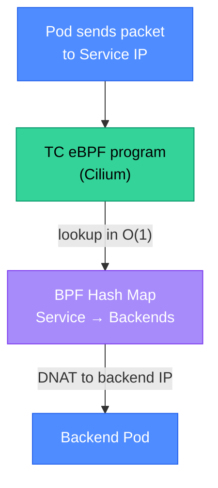

# Cilium: eBPF-Powered Networking for Kubernetes

Cilium is a CNCF graduated project that replaces kube-proxy and provides an eBPF-based CNI (Container Network Interface) for Kubernetes. It performs L4 load balancing at the kernel level, enforces network policies based on workload identity (not IP addresses), and provides deep network observability through Hubble — all without iptables.

<div class="quiz-progress" data-quiz-progress>
  <span class="quiz-progress-label">0/0 checks</span>
  <span class="quiz-progress-bar"><span class="quiz-progress-fill"></span></span>
</div>

---

## 1. Why Cilium Replaced kube-proxy

kube-proxy implements Kubernetes Service load balancing by programming iptables rules. The problem: iptables is a sequential rule table. Every packet traverses every rule until it matches — O(n) complexity, where n is the number of rules.

**The scale problem:**
- Each Kubernetes Service creates ~10 iptables rules (one for each endpoint + NAT rules)
- A cluster with 10,000 Services and 5 endpoints each = 50,000+ iptables rules
- A rule table of this size adds ~10ms of latency per packet traversal
- Adding or removing a Service requires locking and rewriting the entire iptables ruleset — causing brief traffic disruption

**Cilium's approach:**
- Implements Service load balancing with eBPF programs attached to the TC hook
- Uses a BPF hash map: `Service IP:Port → list of backend IPs` — O(1) lookup regardless of cluster size
- Updates are atomic map operations, not full ruleset rewrites — no traffic disruption
- The XDP hook can process packets even before the kernel allocates a socket buffer — the lowest-latency interception point



<div class="quiz-card">
  <p class="quiz-q">A cluster grows from 500 to 5,000 Services overnight after a migration. Engineers using kube-proxy observe a 15ms increase in p99 service-to-service latency. Engineers on an identical cluster using Cilium with kube-proxy replacement observe no change. Explain the root cause of the kube-proxy regression and why Cilium is unaffected.</p>
  <button class="quiz-reveal">Reveal answer</button>
  <div class="quiz-a" hidden>kube-proxy root cause: 5,000 Services × ~10 rules each = ~50,000 iptables rules. iptables evaluates rules sequentially — a packet destined for a Service near the end of the table traverses nearly all 50,000 rules before matching. At 5,000 Services, even fast rule evaluation adds measurable latency per packet. Additionally, updating iptables for new or changed Services locks the netfilter table and rewrites all rules atomically — this write lock briefly pauses all packet processing on that node, causing microsecond spikes visible in p99. Cilium is unaffected because it uses a BPF hash map for Service → endpoint lookup. A hash map lookup is O(1) — the lookup time is identical whether the map has 500 or 500,000 entries. Map updates are atomic single-entry operations, not table rewrites, so there is no write lock affecting other packets. The migration from kube-proxy to Cilium specifically at scale is one of the primary motivations enterprises cite for adopting Cilium.</div>
</div>

---

## 2. Cilium as CNI

**Installation with Helm (kube-proxy replacement mode):**

```bash
helm repo add cilium https://helm.cilium.io/

helm install cilium cilium/cilium \
  --namespace kube-system \
  --set kubeProxyReplacement=true \
  --set k8sServiceHost=<API_SERVER_IP> \
  --set k8sServicePort=6443 \
  --set ipam.mode=kubernetes \
  --set hubble.relay.enabled=true \
  --set hubble.ui.enabled=true
```

**Verifying the installation:**

```bash
# Install the Cilium CLI
cilium install --version 1.15.0

# Check status — all agents must be running and all checks green
cilium status
# ✅ cilium            OK       Cilium is installed and up-to-date
# ✅ hubble-relay      OK       Hubble Relay is installed and up-to-date
# ✅ kube-proxy        OK       kube-proxy is not installed — using eBPF socket-level LB

# Run the built-in connectivity test (deploys test pods and verifies end-to-end)
cilium connectivity test
```

**Verifying kube-proxy is replaced:**

```bash
# Should return nothing — kube-proxy DaemonSet should not exist
kubectl get daemonset -n kube-system kube-proxy

# Verify Cilium is handling Service load balancing
kubectl exec -n kube-system ds/cilium -- cilium service list
```

---

## 3. Hubble: Flow Observability

Hubble is Cilium's built-in observability layer. It uses eBPF to capture every network flow between pods — source, destination, protocol, verdict (forwarded/dropped), and HTTP method/path for L7 flows — with zero application changes.

**CLI usage:**

```bash
# Install the Hubble CLI
cilium hubble port-forward &

# Watch all flows in real-time
hubble observe

# Filter: flows to the payments service on port 5432
hubble observe --namespace payments --port 5432

# Show dropped flows (network policy violations)
hubble observe --verdict DROPPED

# Show HTTP flows with response codes
hubble observe --protocol http --http-status-code 500

# JSON output for parsing
hubble observe --namespace payments --output json | jq '.flow | {src: .source.namespace, dst: .destination.namespace, verdict: .verdict}'
```

**Hubble UI** provides a real-time service map — nodes are services, edges are flows, colors indicate health (green = forwarded, red = dropped). This makes it trivial to see which services a new deployment communicates with and whether any communications are being blocked by network policies.

---

## 4. Cilium NetworkPolicy: Identity-Based

Standard Kubernetes NetworkPolicy selects traffic by IP address. IPs are ephemeral in Kubernetes — a pod restart gets a new IP. Cilium's NetworkPolicy uses **Cilium identities** — a hash of a pod's labels — which remain stable across restarts.

**CiliumNetworkPolicy vs standard NetworkPolicy:**

```yaml
# Standard NetworkPolicy (IP-based — the "from: podSelector" is resolved to IPs by kube-proxy)
apiVersion: networking.k8s.io/v1
kind: NetworkPolicy
metadata:
  name: allow-frontend
spec:
  podSelector:
    matchLabels:
      app: payments-api
  ingress:
    - from:
        - podSelector:
            matchLabels:
              app: frontend
```

```yaml
# CiliumNetworkPolicy — identity-based, more expressive, L7-capable
apiVersion: cilium.io/v2
kind: CiliumNetworkPolicy
metadata:
  name: allow-frontend-http
spec:
  endpointSelector:
    matchLabels:
      app: payments-api
  ingress:
    - fromEndpoints:
        - matchLabels:
            app: frontend
      toPorts:
        - ports:
            - port: "8080"
              protocol: TCP
          rules:
            http:
              - method: "GET"
                path: "/api/v1/.*"
              - method: "POST"
                path: "/api/v1/payments"
```

The L7 rule above enforces at the HTTP level: frontend pods can make GET requests to any `/api/v1/` path and POST to `/api/v1/payments` only. A POST to `/api/v1/admin` is dropped. Standard NetworkPolicy cannot do this — it only operates at L4 (IP + port).

<div class="quiz-card">
  <p class="quiz-q">A CiliumNetworkPolicy allows the `frontend` service to make GET requests to `payments-api` on port 8080. A developer adds a POST endpoint to the payments-api and the frontend needs to call it. What breaks, what can be observed in Hubble, and what change is needed?</p>
  <button class="quiz-reveal">Reveal answer</button>
  <div class="quiz-a" hidden>The POST request is blocked by the L7 CiliumNetworkPolicy rule, which only allows `method: "GET"`. The connection is established (L4 allows port 8080 from frontend), but Cilium's HTTP filter returns a `403 Forbidden` before the request reaches the payments-api pod. In Hubble: `hubble observe --namespace payments --verdict DROPPED --protocol http` shows the rejected flows with HTTP method `POST` and a `POLICY_DENY` verdict — this makes the debugging immediate rather than requiring `tcpdump` on both pods. The fix: add a new `http` rule entry: `- method: "POST" path: "/api/v1/new-endpoint"`. Keeping the L7 policy tight (exact method + path) is intentional — a CiliumNetworkPolicy that allows all methods (`method: ".*"`) at the L7 level provides no more protection than a plain L4 NetworkPolicy. The value of L7 policies is precisely this level of granularity.</div>
</div>

---

## 5. Cilium ClusterMesh

ClusterMesh connects multiple Kubernetes clusters at the network level, enabling direct pod-to-pod communication across cluster boundaries without VPN tunnels or extra hops.

**Use cases:**
- **Active-active multi-region**: identical deployments in us-east-1 and eu-west-1; a client connects to either and the request is served locally
- **Database failover**: primary PostgreSQL in cluster-A, replica in cluster-B; if cluster-A goes down, cluster-B promotes and services in both clusters transparently fail over
- **Shared services**: a centralized monitoring or secrets management service in a dedicated cluster, accessed by workloads in multiple application clusters

**GlobalService** — a Kubernetes Service that spans clusters:

```yaml
# In both clusters — the annotation makes it global
apiVersion: v1
kind: Service
metadata:
  name: payments-api
  namespace: payments
  annotations:
    service.cilium.io/global: "true"
    service.cilium.io/shared: "true"   # expose this cluster's endpoints to others
spec:
  selector:
    app: payments-api
  ports:
    - port: 8080
```

With `global: true`, Cilium's control plane merges the endpoint lists from all clusters. A pod making a request to `payments-api:8080` in cluster-A gets load-balanced across pods in both cluster-A and cluster-B. Set `service.cilium.io/affinity: local` to prefer local-cluster endpoints and only cross clusters if all local endpoints are unhealthy.

**Setting up ClusterMesh:**

```bash
cilium clustermesh enable --service-type LoadBalancer
cilium clustermesh connect --destination-context cluster-b-kubeconfig
cilium clustermesh status --wait   # verifies connectivity between clusters
```
