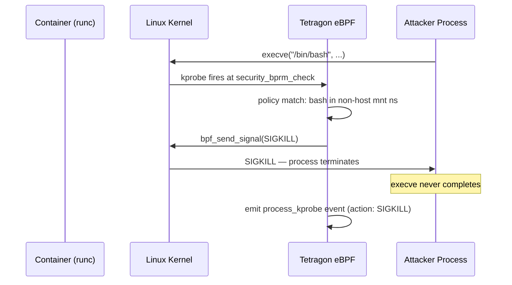

# Tetragon: eBPF Runtime Security Enforcement

Tetragon (Isovalent/Cilium project) is a runtime security tool that uses eBPF to observe and enforce security policies at the syscall level. Unlike traditional runtime security tools that observe events and alert, Tetragon can **enforce** — it can send a SIGKILL to a process the moment it performs a forbidden action, before the action completes. This is the difference between detecting a container escape and preventing it.

<div class="quiz-progress" data-quiz-progress>
  <span class="quiz-progress-label">0/0 checks</span>
  <span class="quiz-progress-bar"><span class="quiz-progress-fill"></span></span>
</div>

---

## 1. Tetragon vs Falco

Both Tetragon and Falco provide Kubernetes runtime security using eBPF. Their architectures and capabilities differ in ways that matter for production deployments.

| Dimension | Tetragon | Falco |
|-----------|----------|-------|
| **Primary mechanism** | eBPF kprobes + kernel function hooks | eBPF (modern) or kernel module (legacy) |
| **Can enforce (kill processes)** | ✅ Yes — SIGKILL via eBPF at the moment of the syscall | ❌ No — observe and alert only |
| **Enforcement latency** | Syscall is blocked before it completes | Alert fires after the syscall completes |
| **Policy language** | TracingPolicy CRD (YAML + Kubernetes-native) | Falco rules YAML (custom syntax) |
| **Event richness** | Process tree, network flows, file access, all in same event stream | Strong for syscall events; weaker for network |
| **Integration with Kubernetes** | Native (understands pod labels, namespace, SA) | Via metadata enrichment (container runtime socket) |
| **Production adoption** | Newer; primarily Cilium ecosystem | Mature; broader third-party support |

**When to use each:**
- Tetragon: you need enforcement (not just detection) — stopping privilege escalation attempts in real time
- Falco: you need broad detection across many syscall event types with a mature rule ecosystem and wide SIEM integrations
- Both together: Tetragon handles enforcement (critical policies), Falco handles broad detection (audit trails)

---

## 2. TracingPolicy CRD

TracingPolicy is Tetragon's policy resource. It specifies which kernel function to hook, what arguments to match, and what action to take.

**Example: kill any process that opens `/etc/shadow` outside allowlisted processes:**

```yaml
apiVersion: cilium.io/v1alpha1
kind: TracingPolicy
metadata:
  name: block-shadow-access
spec:
  kprobes:
    - call: "fd_install"      # called when a file descriptor is installed
      syscall: false
      return: false
      args:
        - index: 1
          type: "file"        # the file being opened
      selectors:
        - matchArgs:
            - index: 1
              operator: "Prefix"
              values:
                - "/etc/shadow"
                - "/etc/gshadow"
          matchBinaries:
            - operator: "NotIn"
              values:
                - "/usr/bin/passwd"
                - "/usr/sbin/chpasswd"   # allowlisted binaries
          matchNamespaces:
            - namespace: Mnt            # apply in all mount namespaces (all containers)
              operator: NotIn
              values:
                - "host"                # exclude host PID namespace
          matchActions:
            - action: Sigkill           # send SIGKILL immediately
```

**Example: detect and kill processes spawning shells inside containers:**

```yaml
apiVersion: cilium.io/v1alpha1
kind: TracingPolicy
metadata:
  name: block-shell-in-container
spec:
  kprobes:
    - call: "security_bprm_check"   # called before a new binary executes
      syscall: false
      args:
        - index: 0
          type: "linux_binprm"
      selectors:
        - matchArgs:
            - index: 0
              operator: "Prefix"
              values:
                - "/bin/sh"
                - "/bin/bash"
                - "/usr/bin/sh"
                - "/usr/bin/bash"
          matchNamespaces:
            - namespace: Mnt
              operator: NotIn
              values:
                - "host"
          matchActions:
            - action: Sigkill
```

---

## 3. Tetragon Events

Tetragon emits structured JSON events for every observed action. Three primary event types:

**`process_exec`** — a new process was spawned:

```json
{
  "process_exec": {
    "process": {
      "exec_id": "a1b2c3...",
      "pid": 1234,
      "uid": 0,
      "cwd": "/",
      "binary": "/bin/bash",
      "arguments": "-c id",
      "start_time": "2026-09-18T10:00:00.123Z",
      "auid": 4294967295,
      "pod": {
        "namespace": "payments",
        "name": "payments-api-7d9f8c-xkz4p",
        "container": {"name": "payments-api", "image": {"name": "ghcr.io/myorg/payments-api:abc123"}}
      }
    },
    "parent": {"pid": 1200, "binary": "/usr/bin/runc"}
  },
  "node_name": "node-1",
  "time": "2026-09-18T10:00:00.125Z"
}
```

**`process_exit`** — a process exited (includes the signal if killed):

```json
{
  "process_exit": {
    "process": {"pid": 1234, "binary": "/bin/bash"},
    "signal": "SIGKILL",
    "status": 137
  }
}
```

**`process_kprobe`** — a kprobe event fired (file access, network connection, etc.):

```json
{
  "process_kprobe": {
    "process": {"pid": 1234, "binary": "/usr/bin/curl", "pod": {"namespace": "payments"}},
    "function_name": "fd_install",
    "action": "SIGKILL",
    "args": [{"file_arg": {"path": "/etc/shadow"}}]
  }
}
```

---

## 4. Enforcement vs Observability Mode

Tetragon policies can run in two modes:

| Mode | TracingPolicy action | What happens | When to use |
|------|---------------------|-------------|------------|
| **Observability** | `action: Post` | Event emitted, process continues | Initial deployment; building baseline; tuning allowlists |
| **Enforcement** | `action: Sigkill` | Process is killed; event emitted | Production; after observability baseline validates no false positives |

**Why enforcement is off by default:** A wrong enforcement policy can kill legitimate processes — breaking your application. The blast radius of `action: Sigkill` on a mismatched selector is wider than you expect. For example, a policy that kills `bash` in all non-host mount namespaces will also kill health check scripts, init containers, and any pod that legitimately uses `bash` at startup.

**Safe rollout process:**
1. Deploy TracingPolicy with `action: Post` (observability only).
2. Collect events for 1–2 weeks across production traffic.
3. Review `process_exec` events to identify legitimate processes that would be killed.
4. Add them to the allowlist (`matchBinaries.operator: NotIn`).
5. Switch to `action: Sigkill` in a staging environment and run end-to-end tests.
6. Canary the enforcement policy to 5% of production nodes.
7. Promote to all nodes after 24 hours with no false positives.



<div class="quiz-card">
  <p class="quiz-q">You deploy a Tetragon TracingPolicy in enforcement mode (`action: Sigkill`) that kills any process accessing `/etc/shadow`. Three hours later, a Kubernetes node becomes NotReady. Investigation shows that the node's `kubelet` health check script was killed because it briefly reads `/etc/nsswitch.conf`, and `/etc/shadow` was in the path traversal. What went wrong and how should the allowlist have been constructed?</p>
  <button class="quiz-reveal">Reveal answer</button>
  <div class="quiz-a" hidden>The policy matched too broadly. The selector `operator: "Prefix" values: ["/etc/shadow"]` in the example relies on exact path matching, but the real failure here is that the allowlist (`matchBinaries: NotIn`) only included `/usr/bin/passwd` and `/usr/sbin/chpasswd` — it didn't include kubelet's health check binary or init processes that might touch NSS (Name Service Switch) files which can access shadow. The correct construction: (1) Run in observability mode for 2 weeks and collect all `process_kprobe` events that would have matched. (2) Identify every binary that legitimately accesses `/etc/shadow` — on a Kubernetes node, this can include `sshd`, `login`, `pam` modules, and various init scripts. (3) Add all of them to the `NotIn` allowlist before enabling enforcement. The underlying lesson: "who accesses `/etc/shadow`" on a Kubernetes node is not just `passwd` — it's the entire PAM stack. Enforcement policies for sensitive files require exhaustive observability data, not intuitive allowlists.</div>
</div>

---

## 5. SIEM Integration

Tetragon emits JSON events to stdout, designed for collection by log shippers.

**Fluent Bit collecting Tetragon events from DaemonSet:**

```yaml
# fluent-bit ConfigMap
[INPUT]
    Name   tail
    Path   /var/log/tetragon/tetragon.log
    Parser json
    Tag    tetragon.*

[FILTER]
    Name  grep
    Match tetragon.*
    # Only forward enforcement events (SIGKILL) and process_exec
    Regex process_kprobe|process_exec

[OUTPUT]
    Name  es
    Match tetragon.*
    Host  elasticsearch.logging.svc
    Port  9200
    Index tetragon-events
    # Or: Splunk HEC, Kafka, Datadog
```

**Alert triage in Elastic:**

High-priority alerts to escalate immediately:
- `process_kprobe.action == "SIGKILL"` — an enforcement rule fired; something was actually killed
- `process_exec.process.binary IN ["/bin/bash", "/bin/sh"]` + namespace is a production namespace
- `process_exec.process.uid == 0` + pod is in a restricted PSS namespace (root process in a should-be-non-root container)

Non-urgent (review daily):
- `process_exec` events for new binaries not previously seen (baseline deviation)
- Network connections to external IPs from pods that should only talk internally
