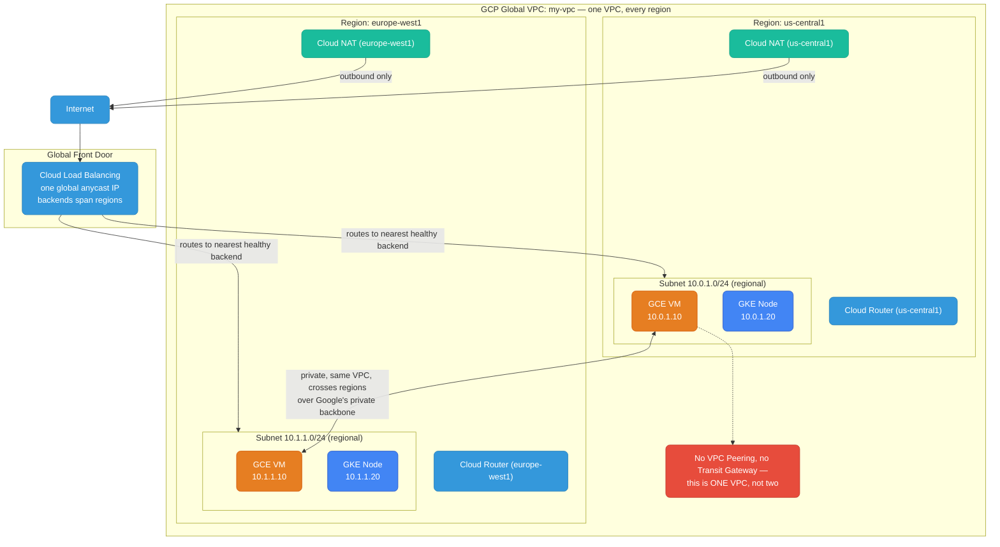
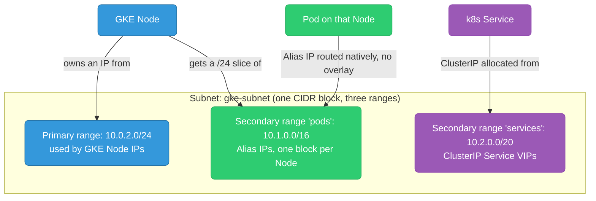
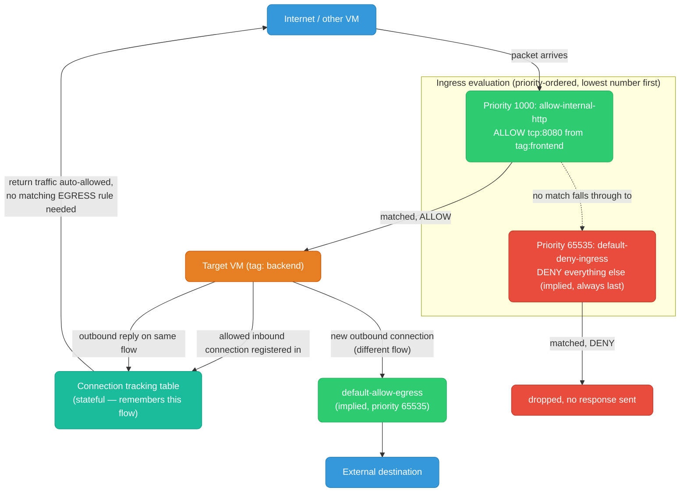
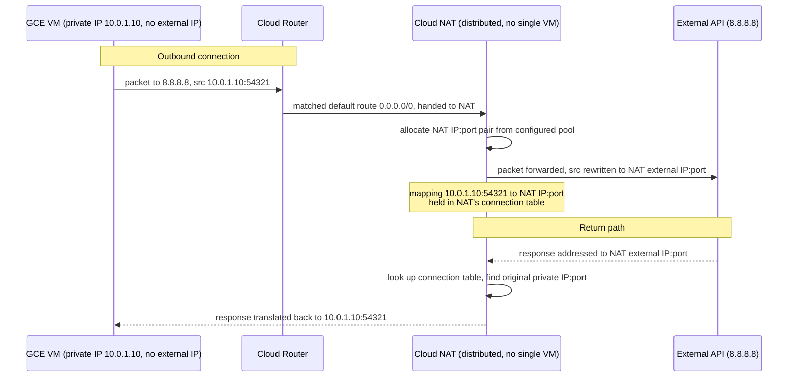
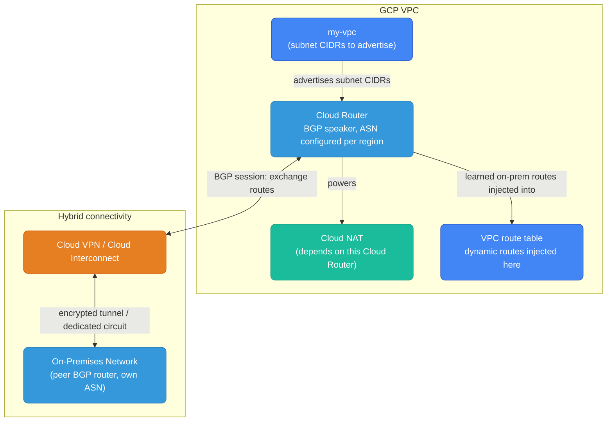
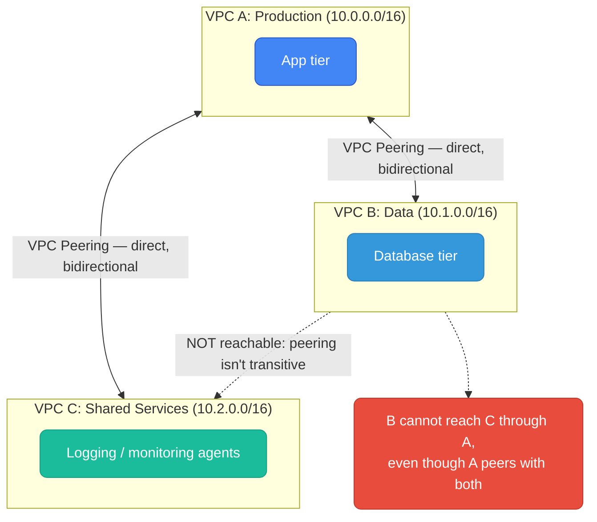
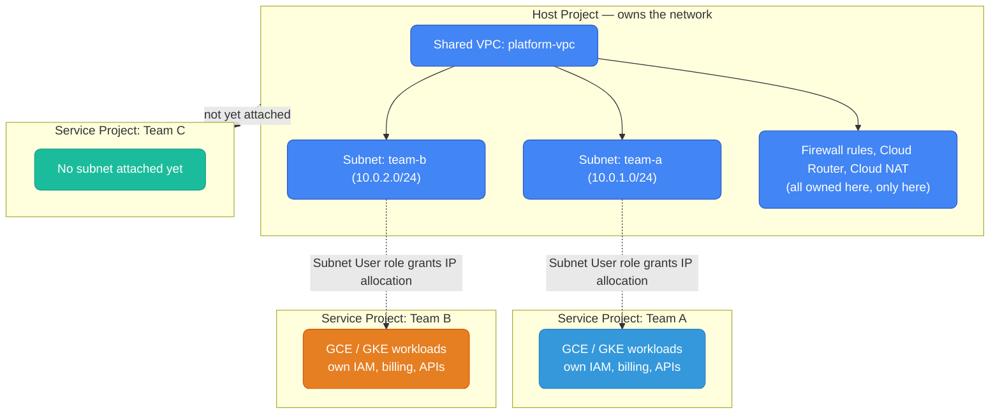
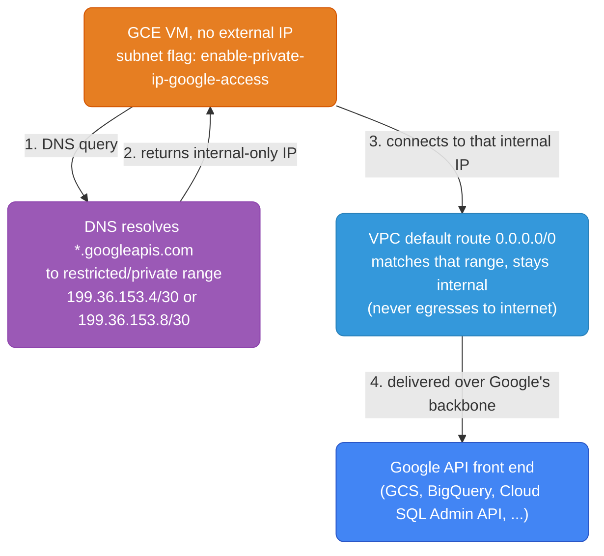
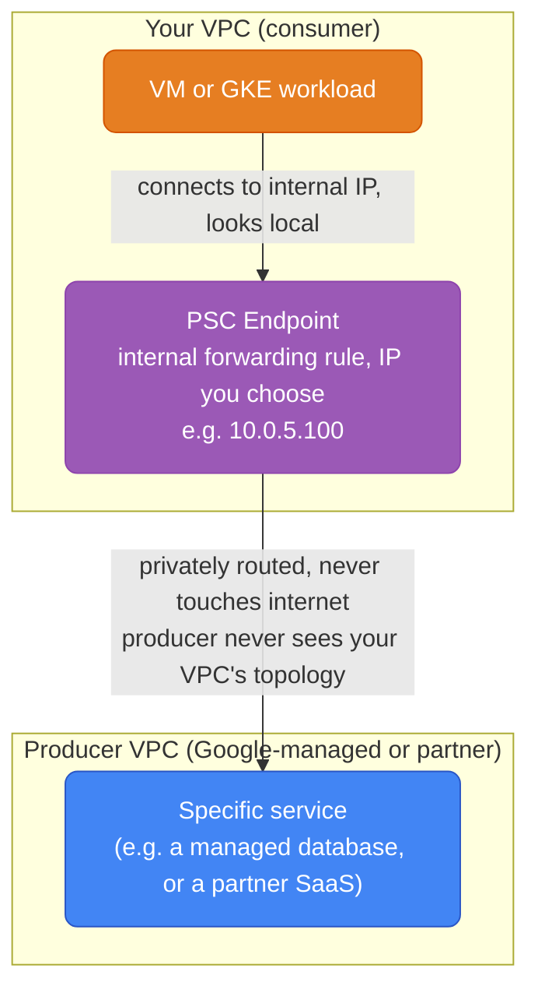

# GCP Networking

Global VPC, regional subnets, firewall rules, Cloud NAT, Cloud Router, VPC Peering, Shared VPC, Private Google Access, and Private Service Connect — the primitives that differ most from the region-scoped, subnet-boundary model AWS engineers already carry in their heads.

<div class="quiz-progress" data-quiz-progress>
  <span class="quiz-progress-label">0/0 checks</span>
  <span class="quiz-progress-bar"><span class="quiz-progress-fill"></span></span>
</div>

---

## VPC Architecture

GCP VPC is **global** — unlike AWS where a VPC is region-scoped, a single GCP VPC spans all regions. Subnets are regional (one subnet = one region), but they all belong to the same global VPC. This means a VM in `us-central1` and a VM in `europe-west1` can communicate privately within the same VPC without peering.



**Key difference from AWS:** In AWS, cross-region communication between VPCs requires VPC Peering or Transit Gateway. In GCP, it's native — same VPC, different regional subnets, traffic never leaves Google's private backbone.

<div class="quiz-card">
  <p class="quiz-q">A VM in <code>us-central1</code> needs to talk privately to a VM in <code>europe-west1</code>. Both are in the same GCP VPC. What do you need to set up to make that work?</p>
  <button class="quiz-reveal">Reveal answer</button>
  <div class="quiz-a" hidden>Nothing extra. GCP VPCs are global, so a single VPC already spans every region — the two VMs are already in the same network, just different regional subnets. In AWS this would require VPC Peering or a Transit Gateway because AWS VPCs are region-scoped; in GCP that step doesn't exist because there was never a second VPC to begin with.</div>
</div>

---

## Subnets

GCP subnets are **regional** — you pick a region and a CIDR. Unlike AWS, there are no Availability Zone-level subnets. GCP manages zone distribution of compute resources within the region automatically.

### Subnet Modes

| Mode | Behavior |
|------|----------|
| **Auto mode** | One subnet per region created automatically (`10.128.0.0/9` range). Quick start, but limited control. |
| **Custom mode** | You define CIDRs per region. Required for production — gives full CIDR control and avoids overlap with on-prem. |

<div class="toggle-switch">
  <div class="toggle-buttons">
    <button data-toggle-opt="auto" class="active state-warn">Auto mode</button>
    <button data-toggle-opt="custom" class="state-ok">Custom mode</button>
  </div>
  <div class="toggle-panel active" data-toggle-panel="auto">
    GCP pre-creates one subnet per region, all carved out of the reserved <code>10.128.0.0/9</code> block. Fast to start with — zero planning needed — but you inherit whatever CIDR GCP picked for every region, including ones you may never use, and you have no control over overlap with an on-prem range you might VPN or Interconnect to later. Fine for a scratch project, risky for anything headed toward production or hybrid connectivity.
  </div>
  <div class="toggle-panel" data-toggle-panel="custom">
    You explicitly create each regional subnet with your own CIDR — nothing exists until you define it. This is the only mode that lets you size ranges deliberately (including secondary ranges for GKE) and guarantee no collision with on-prem or another peered VPC. Anthos and most production Terraform modules default to custom mode for exactly this reason.
  </div>
</div>

```bash
# Create custom mode VPC
gcloud compute networks create my-vpc --subnet-mode=custom

# Create a regional subnet
gcloud compute networks subnets create app-subnet \
  --network=my-vpc \
  --region=us-central1 \
  --range=10.0.1.0/24
```

### Secondary Ranges (for GKE)

GCP subnets support **secondary IP ranges** — extra CIDR blocks on the same subnet used by GKE for Pod IPs and Service IPs (VPC-native clusters). This avoids IP exhaustion on the primary range.



**AWS parallel:** AWS secondary CIDRs are added at the VPC level; GCP secondary ranges are per-subnet. GKE automatically uses these for pod networking (Alias IPs) without needing an overlay network.

```bash
gcloud compute networks subnets create gke-subnet \
  --network=my-vpc \
  --region=us-central1 \
  --range=10.0.2.0/24 \
  --secondary-range pods=10.1.0.0/16,services=10.2.0.0/20
```

<div class="quiz-card">
  <p class="quiz-q">A GKE cluster is running in VPC-native mode with a secondary range for Pods. Why doesn't it need an overlay network the way many on-prem Kubernetes clusters do?</p>
  <button class="quiz-reveal">Reveal answer</button>
  <div class="quiz-a" hidden>Because Pod IPs come from a real secondary CIDR range on the VPC subnet (Alias IPs) — they're natively routable inside the VPC just like any other subnet IP, so packets to a Pod don't need to be encapsulated/tunneled by an overlay. This is the "VPC-native" part of a VPC-native GKE cluster, and it's also why the secondary range has to be sized generously up front: it's a real, fixed CIDR block, not something that stretches on demand.</div>
</div>

---

## Firewall Rules

GCP firewall rules are **network-scoped**, not resource-scoped. They're conceptually closest to AWS Security Groups but evaluated at the network level, not the ENI. There are no NACLs in GCP.

### Key Properties

- **Direction:** `INGRESS` (inbound) or `EGRESS` (outbound)
- **Priority:** 0–65535 — lower number wins, evaluated first
- **Action:** `ALLOW` or `DENY`
- **Targets:** apply to all VMs, or by **target tag** or **target service account**
- **Sources/Destinations:** CIDR, **source tag**, or **source service account**
- **Stateful:** GCP firewall rules ARE stateful (like AWS SGs) — return traffic is auto-allowed

```
Firewall Rule: allow-internal-http
  Direction:   INGRESS
  Priority:    1000
  Action:      ALLOW
  Target:      tag: backend
  Source:      tag: frontend
  Ports:       TCP 8080
```

```bash
# Allow inbound HTTP to all VMs tagged "backend" from VMs tagged "frontend"
gcloud compute firewall-rules create allow-internal-http \
  --network=my-vpc \
  --direction=INGRESS \
  --priority=1000 \
  --action=ALLOW \
  --target-tags=backend \
  --source-tags=frontend \
  --rules=tcp:8080
```

### Tags vs Service Accounts as Selectors

| Selector | How it works | Security |
|----------|-------------|----------|
| **Network tag** | String applied to VM (`--tags=frontend`). Any user with VM edit access can add/remove. | Lower — tag is just metadata |
| **Service account** | VM's identity (what IAM SA it runs as). Can't be spoofed. | Higher — tied to IAM identity |

<div class="toggle-switch">
  <div class="toggle-buttons">
    <button data-toggle-opt="tag" class="active state-warn">Network tag</button>
    <button data-toggle-opt="sa" class="state-ok">Service account</button>
  </div>
  <div class="toggle-panel active" data-toggle-panel="tag">
    A plain string attached to a VM (<code>--tags=frontend</code>). Cheap and readable in rule names, but it's just instance metadata — anyone with <code>compute.instances.setTags</code> can add or remove it from any VM, which silently changes what firewall rules apply to that VM. Convenient for quick iteration, weak as a security boundary.
  </div>
  <div class="toggle-panel" data-toggle-panel="sa">
    The IAM service account identity the VM actually runs as. It can't be reassigned by editing instance metadata — changing it requires <code>iam.serviceAccounts.actAs</code> permission on that specific SA, a much narrower grant. This is what "identity-aware" firewalling means in GCP: the rule trusts who the VM authenticates as, not a label someone attached to it.
  </div>
</div>

**Best practice:** Use service accounts as firewall selectors in production. Tags are convenient but any engineer with compute.instances.setTags can reassign them.

### Default Rules

Every GCP VPC has two implied rules (lowest priority, 65535):
- `default-allow-internal` — allow all traffic between instances in the same network (often removed for stricter setups)
- `default-deny-ingress` — deny all ingress
- `default-allow-egress` — allow all egress



<div class="quiz-card">
  <p class="quiz-q">Two firewall rules could both match the same packet: one at priority 1000 (ALLOW) and the implied default-deny-ingress at priority 65535 (DENY). Which one wins, and why?</p>
  <button class="quiz-reveal">Reveal answer</button>
  <div class="quiz-a" hidden>The priority-1000 ALLOW rule wins. In GCP firewall priority, a lower number is evaluated first and wins — priority 1000 is numerically lower (and therefore higher precedence) than 65535. The default-deny-ingress rule always sits at the lowest possible priority (65535) specifically so any explicit rule you create will be evaluated ahead of it. Mixing this up with "bigger priority number = more important" is the single most common GCP firewall mistake.</div>
</div>

### GCP Firewall vs AWS Security Groups

| | GCP Firewall Rule | AWS Security Group |
|--|---|---|
| **Scope** | Network-wide, filtered by tag/SA | Attached to specific ENI |
| **Stateful** | Yes | Yes |
| **Allow/Deny** | Both | Allow only |
| **Priority** | Explicit numeric priority | No priority, union of allows |
| **Subnet-level filter** | No (no NACLs in GCP) | NACLs exist at subnet boundary |
| **Reference by identity** | Tag or Service Account | SG ID |

---

## Cloud NAT

Cloud NAT provides **outbound internet access** for VMs without external IP addresses. Conceptually mirrors AWS NAT Gateway.



To walk through the same flow one step at a time:

<div class="stepper">
  <div class="stepper-panels">
    <div class="stepper-panel active">
      <strong>1. VM sends an outbound packet.</strong> A GCE VM with no external IP addresses a packet to <code>8.8.8.8</code>. Its source is its private IP and an ephemeral source port, e.g. <code>10.0.1.10:54321</code>.
    </div>
    <div class="stepper-panel">
      <strong>2. Cloud Router matches the default route.</strong> The VPC's <code>0.0.0.0/0</code> route points at Cloud NAT (via the Cloud Router it's attached to), so the packet is handed off instead of being dropped for lack of a public IP.
    </div>
    <div class="stepper-panel">
      <strong>3. Cloud NAT allocates and rewrites.</strong> NAT picks a NAT IP:port pair from its configured pool, records the mapping <code>10.0.1.10:54321 → NAT-IP:NAT-port</code> in its connection table, and rewrites the packet's source before it leaves Google's network.
    </div>
    <div class="stepper-panel">
      <strong>4. Response comes back to the NAT IP.</strong> The external server has no idea a private VM exists — it replies to the NAT IP:port it saw as the source.
    </div>
    <div class="stepper-panel">
      <strong>5. Cloud NAT reverses the translation.</strong> It looks up the NAT IP:port in its connection table, finds the original <code>10.0.1.10:54321</code>, rewrites the destination, and delivers the response to the VM — which never sees or needs an external IP at any point.
    </div>
  </div>
  <div class="stepper-controls">
    <button class="stepper-prev">← Prev</button>
    <span class="stepper-dots"></span>
    <span class="stepper-label"></span>
    <button class="stepper-next">Next →</button>
  </div>
</div>

### How It Works

Cloud NAT is a **distributed software service** — it's not a VM or a single machine. It runs on Google's infrastructure, attached to a Cloud Router, and automatically scales with traffic.

```bash
# Cloud NAT requires a Cloud Router first
gcloud compute routers create my-router \
  --network=my-vpc \
  --region=us-central1

# Create Cloud NAT on the router
gcloud compute routers nats create my-nat \
  --router=my-router \
  --region=us-central1 \
  --nat-all-subnet-ip-ranges \
  --auto-allocate-nat-external-ips
```

### GCP Cloud NAT vs AWS NAT Gateway

| | GCP Cloud NAT | AWS NAT Gateway |
|--|---|---|
| **Architecture** | Distributed, no single VM | Managed service, single AZ |
| **Placement** | Regional (configured on Cloud Router) | Per-subnet (must be in public subnet) |
| **Public subnet needed** | No — GCP has no concept of "public subnet" | Yes — NAT GW lives in public subnet |
| **AZ resilience** | Built-in, fully distributed | One per AZ recommended |
| **Cost** | ~$0.044/hr + $0.045/GB | ~$0.045/hr + $0.045/GB |
| **Scale** | Auto-scales | Auto-scales |

**GCP has no "public/private subnet" distinction.** A subnet is "private" by not assigning external IPs to VMs. Outbound internet access for those VMs is then provided by Cloud NAT.

<div class="quiz-card">
  <p class="quiz-q">A VM with no external IP has an active outbound connection through Cloud NAT. Does that connection let anything on the internet initiate a new inbound connection to the VM?</p>
  <button class="quiz-reveal">Reveal answer</button>
  <div class="quiz-a" hidden>No. Cloud NAT only provides outbound internet access — it rewrites and tracks connections the VM itself initiated, and return traffic on that same tracked flow gets routed back. There is no way for an external host to open a brand-new inbound connection to the VM through Cloud NAT; that's the same one-way guarantee AWS NAT Gateway gives, and it's exactly why Cloud NAT is safe to attach to VMs that should never be reachable from the internet.</div>
</div>

---

## Cloud Router

Cloud Router is a **BGP routing service** that dynamically exchanges routes between your VPC and external networks (on-prem via Cloud VPN or Cloud Interconnect, or other VPCs via VPN).

- Required for Cloud NAT
- Advertises your VPC subnets via BGP to on-prem routers
- Learns on-prem routes and injects them into VPC route tables dynamically



**AWS parallel:** AWS Transit Gateway + VPN Gateway + BGP achieves similar hybrid connectivity. Cloud Router is GCP's managed BGP speaker that plugs into these services.

<div class="quiz-card">
  <p class="quiz-q">You want to enable Cloud NAT in a region where no hybrid connectivity (VPN/Interconnect) exists at all. Do you still need a Cloud Router?</p>
  <button class="quiz-reveal">Reveal answer</button>
  <div class="quiz-a" hidden>Yes. Cloud Router is a hard prerequisite for Cloud NAT regardless of whether you have any BGP peers configured — Cloud NAT is created on top of a Cloud Router even if that router never exchanges a single BGP route with on-prem. BGP route exchange and powering Cloud NAT are two independent jobs the same Cloud Router resource can do, and you only need the BGP side if you actually have hybrid connectivity to set up.</div>
</div>

---

## VPC Peering vs Shared VPC

GCP offers two models for multi-VPC connectivity — different from AWS's Transit Gateway model.

<div class="tab-group">
  <div class="tab-buttons">
    <button data-tab="peering" class="active">VPC Peering</button>
    <button data-tab="shared">Shared VPC</button>
  </div>
  <div class="tab-panels">
    <div class="tab-panel active" data-tab-panel="peering">
      <strong>Connects two otherwise-independent VPCs.</strong> Each side keeps its own subnets, firewall rules, and admin team; peering just makes their internal IPs routable to each other. No transitivity — if A peers with B and A peers with C, B still can't reach C through A. Good for connecting a handful of VPCs that are otherwise separately owned.
    </div>
    <div class="tab-panel" data-tab-panel="shared">
      <strong>One VPC, centrally owned, used by many projects.</strong> A Host Project owns the actual VPC and subnets; Service Projects don't get their own VPC at all — they deploy workloads directly into the host's subnets. Every service project automatically shares full route transitivity with every other one, because there was only ever one VPC. Good for an org-wide platform team that wants one network to secure and monitor.
    </div>
  </div>
</div>

### VPC Peering

Direct L3 peering between two GCP VPCs. Internal IPs are routable across the peering.



**Same limitation as AWS:** no transitive routing. N*(N-1)/2 peering connections for full mesh.

### Shared VPC (Host/Service Project)

GCP-specific: a **Host Project** owns the VPC and subnets. **Service Projects** attach to it and deploy workloads into the host's subnets. Centralized network control across many projects.

<div class="toggle-switch">
  <div class="toggle-buttons">
    <button data-toggle-opt="host" class="active">Host Project</button>
    <button data-toggle-opt="service">Service Project</button>
  </div>
  <div class="toggle-panel active" data-toggle-panel="host">
    Owns the VPC, the subnets, the firewall rules, and Cloud Router/NAT config. Exactly one project per Shared VPC. Whoever administers this project controls the network for every attached service project — IAM roles like <code>Network Admin</code> and <code>Subnet User</code> here are how the platform team grants (or withholds) subnet access to individual teams without giving them the network itself.
  </div>
  <div class="toggle-panel" data-toggle-panel="service">
    Owns no VPC of its own — it's "attached" to the host and its workloads (GCE, GKE) deploy directly into the host project's subnets, getting IPs from the host's CIDR ranges. A service project team can launch VMs and manage their own IAM/billing/APIs independently, but they never see or edit the host's firewall rules or routing — that stays with the host's network admins.
  </div>
</div>



| | VPC Peering | Shared VPC |
|--|---|---|
| **Use case** | Connect separate VPCs | Central network for multiple teams/projects |
| **Route transitivity** | No | Yes — all service projects share the host VPC |
| **Admin model** | Each VPC team manages their own | Centralized network team owns the host |
| **AWS analog** | VPC Peering | Centralized VPC + Transit Gateway (roughly) |
| **Best for** | Connecting a few VPCs | Org-wide multi-project platform |

<div class="quiz-card">
  <p class="quiz-q">VPC A is peered with both VPC B and VPC C. A workload in VPC B needs to reach a workload in VPC C. Does the existing peering already make that possible?</p>
  <button class="quiz-reveal">Reveal answer</button>
  <div class="quiz-a" hidden>No. VPC Peering is not transitive — B can reach A, and C can reach A, but B cannot reach C "through" A. B and C would need their own direct peering connection (or both would need to be service projects under a single Shared VPC instead) for that traffic to flow.</div>
</div>

---

## Private Google Access & Private Service Connect

### Private Google Access

Allows VMs **without external IPs** to reach Google APIs (GCS, BigQuery, Cloud SQL APIs) using internal routes — traffic stays on Google's backbone.

When a VM has no external IP, Private Google Access is what makes `gsutil` or a BigQuery client library call actually resolve and route successfully instead of timing out trying to reach the public internet:



<div class="stepper">
  <div class="stepper-panels">
    <div class="stepper-panel active">
      <strong>1. Subnet flag is enabled.</strong> <code>--enable-private-ip-google-access</code> is set on the subnet. Without it, a VM with no external IP simply cannot reach Google APIs at all — the traffic has nowhere to go.
    </div>
    <div class="stepper-panel">
      <strong>2. VM resolves a Google API hostname.</strong> A call to <code>storage.googleapis.com</code> (or another Google API domain) triggers a DNS lookup, same as any other API call in application code.
    </div>
    <div class="stepper-panel">
      <strong>3. DNS returns an internal-only address range.</strong> Instead of a public internet-routable IP, the resolver returns an address in the restricted or private Google range (<code>199.36.153.4/30</code> or <code>199.36.153.8/30</code>) — these ranges are never reachable from the public internet, only from inside a VPC with Private Google Access enabled.
    </div>
    <div class="stepper-panel">
      <strong>4. The VPC route table already covers it.</strong> That internal range falls inside the VPC's normal route table, so the packet is routed like any internal destination — no NAT, no external IP, no internet egress involved.
    </div>
    <div class="stepper-panel">
      <strong>5. Google's backbone completes the connection.</strong> The request lands on the Google API front end entirely over Google's private network, never touching the public internet at any hop.
    </div>
  </div>
  <div class="stepper-controls">
    <button class="stepper-prev">← Prev</button>
    <span class="stepper-dots"></span>
    <span class="stepper-label"></span>
    <button class="stepper-next">Next →</button>
  </div>
</div>

```bash
gcloud compute networks subnets update app-subnet \
  --region=us-central1 \
  --enable-private-ip-google-access
```

**AWS parallel:** VPC Endpoints (Gateway for S3/DynamoDB, Interface for everything else). GCP's Private Google Access is simpler — a subnet flag, no individual endpoint to provision per service.

<div class="quiz-card">
  <p class="quiz-q">A subnet does NOT have Private Google Access enabled. A VM in that subnet has no external IP. What happens when it tries to call the GCS API?</p>
  <button class="quiz-reveal">Reveal answer</button>
  <div class="quiz-a" hidden>The call fails (times out or is unreachable) — there's no path to Google APIs at all. With no external IP, the VM has no route to the public internet, and without the subnet's enable-private-ip-google-access flag, DNS won't resolve *.googleapis.com to the internal restricted range either. Both an external IP AND Private Google Access are alternative ways to reach Google APIs from a VM; without either, a private VM is cut off from them entirely.</div>
</div>

### Private Service Connect (PSC)

More granular than Private Google Access. Create a **PSC endpoint** (a forwarding rule with an internal IP) to access specific Google managed services or partner services entirely privately.



| | Private Google Access | Private Service Connect |
|--|---|---|
| **Scope** | All Google APIs broadly | Specific service or producer VPC |
| **IP** | Uses `private.googleapis.com` DNS | Assigns internal IP of your choosing |
| **Use case** | General Google API access | Multi-tenant, specific endpoint, partner services |
| **AWS analog** | VPC Gateway/Interface Endpoint | Interface VPC Endpoint (PrivateLink) |

<div class="toggle-switch">
  <div class="toggle-buttons">
    <button data-toggle-opt="pga" class="active">Private Google Access</button>
    <button data-toggle-opt="psc">Private Service Connect</button>
  </div>
  <div class="toggle-panel active" data-toggle-panel="pga">
    A subnet-wide switch that covers Google APIs broadly (GCS, BigQuery, Cloud SQL Admin API, and more) through a shared restricted IP range. Nothing to provision per service — flip the flag once and every Google API is reachable privately from that subnet.
  </div>
  <div class="toggle-panel" data-toggle-panel="psc">
    A named endpoint you create for one specific service or producer, with an internal IP you pick yourself. More setup per service, but far more granular — you can expose exactly one managed service (or a specific partner's service) without opening up "all Google APIs," and it's also how you privately consume services published by another team's VPC, not just Google's own APIs.
  </div>
</div>

<div class="quiz-card">
  <p class="quiz-q">You want to privately connect to just one specific partner SaaS service — not "all Google APIs" — and you want to control the exact internal IP your VMs use to reach it. Which feature fits, and why not the other one?</p>
  <button class="quiz-reveal">Reveal answer</button>
  <div class="quiz-a" hidden>Private Service Connect. It creates a dedicated PSC endpoint — a forwarding rule with an internal IP of your choosing — scoped to one specific service or producer VPC. Private Google Access can't do this: it's a blanket subnet-level flag for reaching Google APIs generally through a shared DNS-resolved range, with no way to target a single partner service or pick your own IP for it.</div>
</div>

---

## All Files

### Networking (this file)
VPC, subnets, firewall rules, Cloud NAT, VPC Peering, Shared VPC, Private Google Access, Private Service Connect

### AWS Engineers Start Here
| File | Topics |
|------|--------|
| [from-aws.md](./from-aws.md) | Mental model shifts, resource hierarchy vs AWS Orgs, IAM additive model, global VPC, pricing quirks, CLI cheatsheet |

### Compute
| File | Topics |
|------|--------|
| [compute.md](./compute.md) | GCE vs EC2, machine families, custom machine types, disk types, Preemptible/Spot VMs, Managed vs Unmanaged Instance Groups (MIG/UIG), auto-healing, auto-scaling, rolling updates, serial ports 1–4, live migration, IAP SSH |
| [gke.md](./gke.md) | GKE Standard vs Autopilot, Workload Identity, VPC-native networking, container-native LB (NEG), GPU node pools, upgrade strategy |

### Storage
| File | Topics |
|------|--------|
| [storage.md](./storage.md) | GCS vs S3 (storage classes, Autoclass, lifecycle, versioning), Persistent Disk, Local SSD, Filestore (NFS), Storage Transfer Service |

### Databases
| File | Topics |
|------|--------|
| [databases.md](./databases.md) | Cloud SQL (Postgres/MySQL), AlloyDB, Cloud Spanner (TrueTime), Firestore, Memorystore (Redis), database selection guide |
| [bigquery.md](./bigquery.md) | Columnar storage, partitioning, clustering, slots, streaming vs batch load, external tables, time travel, cost optimization |
| [bigtable.md](./bigtable.md) | Wide-column data model, row key design, LSM tree, replication, HBase API, monitoring |

### Application Services
| File | Topics |
|------|--------|
| [serverless.md](./serverless.md) | Cloud Run (concurrency, traffic splitting, VPC, triggers), Cloud Functions Gen2, Cloud Run Jobs, Cloud Scheduler, Secret Manager |
| [messaging.md](./messaging.md) | Pub/Sub (topic/subscription, DLQ, Lite), Cloud Tasks (rate-limited queues), Eventarc (event routing), service selection guide |

### Operations
| File | Topics |
|------|--------|
| [observability.md](./observability.md) | Cloud Monitoring (metrics, alerting, uptime), Cloud Logging (LQL, sinks, retention), Cloud Trace, Cloud Audit Logs, Error Reporting, Profiler |
| [cicd.md](./cicd.md) | Cloud Build (cloudbuild.yaml, triggers, caching), Artifact Registry (Docker/Helm, scanning), Cloud Deploy (canary, approval gates), GHA integration |

### Comparison & Scenarios
| File | Topics |
|------|--------|
| [gcp-vs-aws.md](./gcp-vs-aws.md) | Service-by-service mapping, global VPC vs regional, BigQuery vs Redshift, GKE vs EKS, when to choose which |
| [scenarios.md](./scenarios.md) | 7 debugging scenarios: Workload Identity 403, autoscaler not scaling, BigQuery cost spike, cold starts, Spanner hotspot, Pub/Sub backlog, GCS access denied |

---

## Recommended Read Order

```
Coming from AWS:
  from-aws.md → README.md → compute.md → gke.md → storage.md
  → databases.md → bigquery.md → serverless.md → messaging.md
  → observability.md → cicd.md → gcp-vs-aws.md → scenarios.md

GCP-first learner:
  README.md → services-overview.md → compute.md → gke.md
  → storage.md → databases.md → serverless.md → messaging.md
  → observability.md → cicd.md → scenarios.md
```
