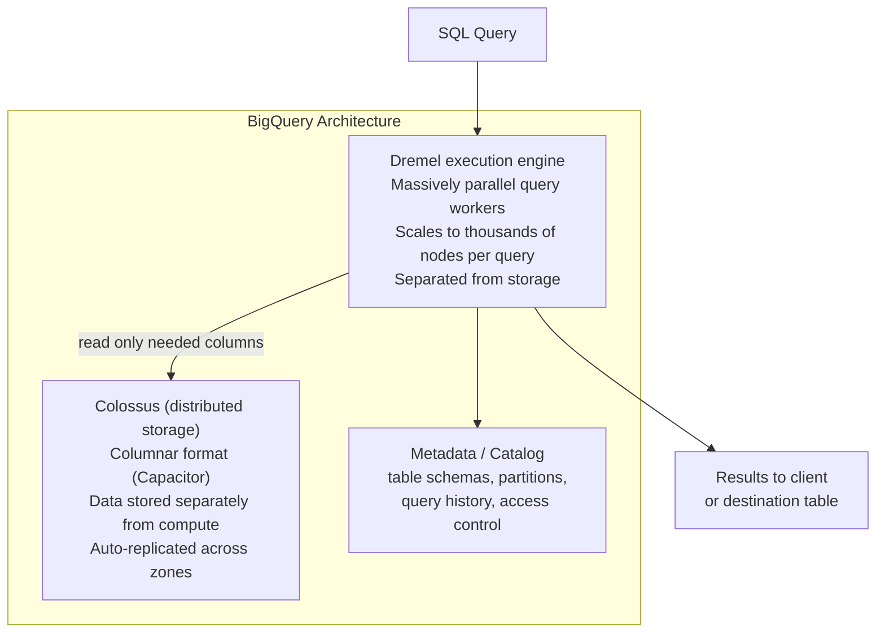
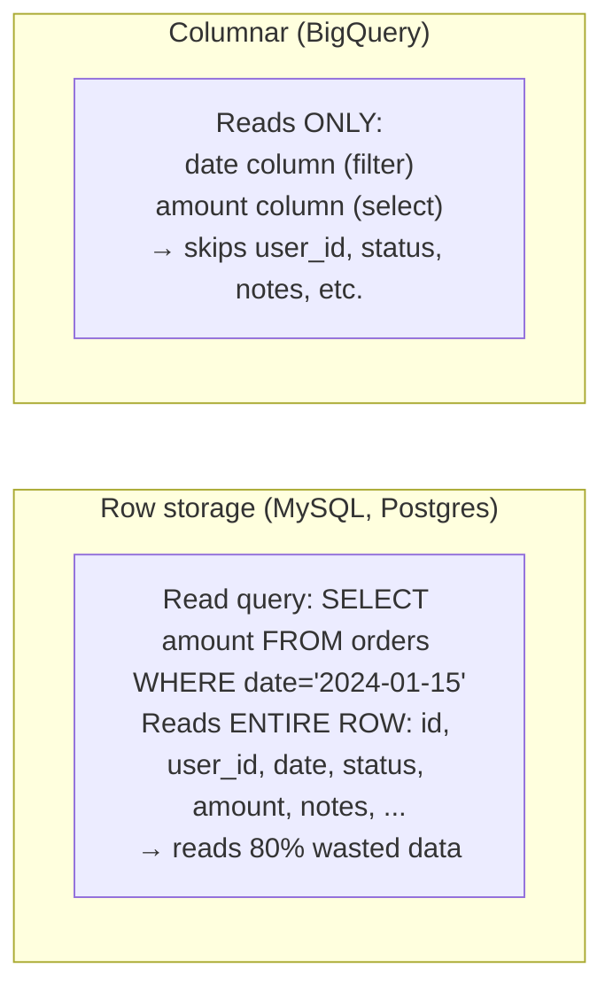
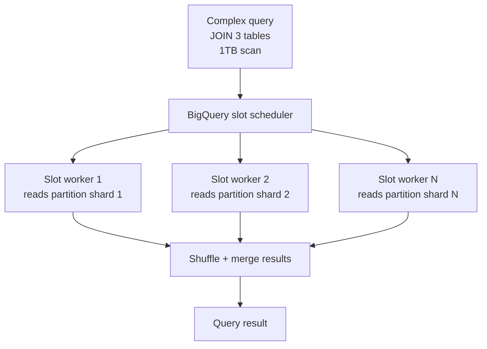
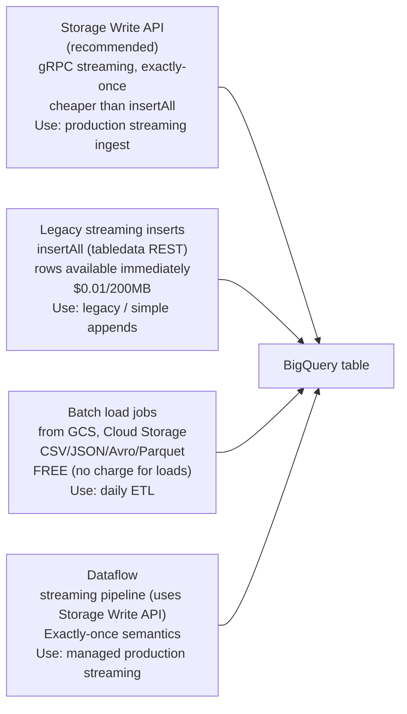
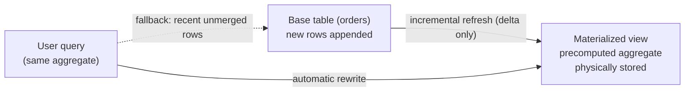

# BigQuery

BigQuery is GCP's fully managed, serverless data warehouse. No infrastructure to manage — you write SQL and BigQuery automatically scales compute across thousands of nodes.

---

## Architecture



**Key insight — separation of storage and compute:**
- Storage costs: ~$0.02/GB/month (no charge for queries)
- Compute costs: $5/TB scanned (on-demand) or flat-rate slots
- You can run 100 queries concurrently — each gets independent compute

---

## Columnar Storage — Why Queries Are Fast



For analytics (aggregate many rows, select few columns), columnar is 10-100× faster.

---

## Tables and Partitioning

```sql
-- Partitioned table (reduces cost — only scans relevant partitions)
CREATE TABLE `project.dataset.orders`
PARTITION BY DATE(created_at)    -- one partition per day
OPTIONS (
    partition_expiration_days = 365,    -- auto-delete partitions older than 1 year
    require_partition_filter = true     -- queries MUST filter on created_at (prevents full scans)
)
AS SELECT * FROM ...;

-- Clustered table (sort data within partitions for faster point lookups)
CREATE TABLE `project.dataset.orders`
PARTITION BY DATE(created_at)
CLUSTER BY user_id, status    -- sort within each partition by these columns
AS SELECT * FROM ...;

-- Estimate cost before running
SELECT COUNT(*) FROM `project.dataset.orders`
WHERE DATE(created_at) = '2024-01-15';
-- In BQ console: shows "This query will process X bytes" before running
```

**Cost = bytes scanned:**
- Partition pruning: `WHERE DATE(created_at) = '2024-01-15'` → scans 1 day, not all history
- Clustering: `WHERE user_id = 123` → BigQuery skips blocks that don't contain user_id=123
- Projected columns: `SELECT amount` costs less than `SELECT *`

---

## Slots — Compute Units



**Pricing models:**
| Model | Price | Best for |
|-------|-------|---------|
| On-demand | $5/TB scanned (first 1 TB/mo free) | Sporadic queries, unknown usage |
| Capacity (Editions) | Standard / Enterprise / Enterprise Plus, billed per **slot-hour** with optional 1- or 3-year commitments; autoscaling slots available | Predictable, high-volume workloads |
| Reservations + assignments | Buy a baseline of slots in an Edition, then assign capacity to projects/folders | Large orgs sharing capacity across teams |

> The older **flat-rate** model (fixed monthly slot commitments) was replaced by **BigQuery Editions** in 2023. Editions bill per slot-hour and support autoscaling, so you no longer pre-purchase fixed 100-slot blocks.

---

## Streaming Inserts vs Batch Load



> The **Storage Write API** (gRPC) is the current recommended path for streaming ingestion — it supports exactly-once delivery, stream-level transactions, and is cheaper than the legacy `insertAll` REST endpoint. Prefer it for new pipelines; `insertAll` remains for simple/legacy append use cases.

---

## External Tables and Federated Queries

```sql
-- Query data directly from GCS without loading into BigQuery
CREATE EXTERNAL TABLE `project.dataset.raw_events`
OPTIONS (
    format = 'NEWLINE_DELIMITED_JSON',
    uris = ['gs://my-bucket/events/2024/01/15/*.json']
);

SELECT event_type, COUNT(*) FROM `project.dataset.raw_events`
GROUP BY event_type;
-- Reads directly from GCS — no storage cost in BQ, slower than native tables

-- Query across GCP services (federated)
SELECT bq.user_id, cs.status
FROM `project.dataset.orders` bq
JOIN `project.region-us.INFORMATION_SCHEMA.TABLES` cs
ON bq.user_id = cs.table_name;
```

---

## GCP-Specific Features

```sql
-- Time travel: query data as it was 7 days ago
SELECT * FROM `project.dataset.orders`
FOR SYSTEM_TIME AS OF TIMESTAMP_SUB(CURRENT_TIMESTAMP(), INTERVAL 6 HOUR);

-- Snapshots: point-in-time table copy (billing: only stores diffs)
CREATE SNAPSHOT TABLE `project.dataset.orders_snapshot_20240115`
CLONE `project.dataset.orders`
FOR SYSTEM_TIME AS OF '2024-01-15 00:00:00 UTC';

-- Authorized views: share data without exposing underlying tables
-- Row-level security with row access policies
CREATE ROW ACCESS POLICY orders_by_region
ON `project.dataset.orders`
GRANT TO ("group:emea-team@company.com")
FILTER USING (region = 'EMEA');

-- INFORMATION_SCHEMA: metadata about all tables/jobs/partitions
SELECT table_id, row_count, size_bytes/1e9 AS size_gb, last_modified_time
FROM `project.dataset`.INFORMATION_SCHEMA.PARTITIONS
WHERE table_name = 'orders'
ORDER BY partition_id DESC LIMIT 10;
```

---

## Nested & Repeated Fields (STRUCT / ARRAY)

BigQuery is columnar but **not** relational-normalized. Instead of splitting a 1-to-many relationship into two tables joined by a foreign key, you store the child rows *inside* the parent row as a repeated STRUCT. This is idiomatic BigQuery: joins are expensive (require shuffle), but reading a nested column is free because columnar storage stores each leaf field as its own column (Dremel's record shredding). You get normalized-like semantics with denormalized read performance.

- **RECORD / STRUCT** — an ordered set of typed sub-fields, like an embedded row (`address STRUCT<city STRING, zip STRING>`).
- **REPEATED (ARRAY)** — a column holding zero or more values of the same type. Combine both — `ARRAY<STRUCT<...>>` — to embed a child table.

```sql
-- Denormalized: orders with line items nested (no separate items table)
CREATE TABLE `project.dataset.orders` (
    order_id   STRING,
    user_id    STRING,
    created_at TIMESTAMP,
    shipping   STRUCT<city STRING, zip STRING>,          -- RECORD / STRUCT
    items      ARRAY<STRUCT<sku STRING, qty INT64, price NUMERIC>>  -- REPEATED STRUCT
);

-- Insert one order row containing many line items — no join needed
INSERT INTO `project.dataset.orders` VALUES (
    'o-1', 'u-42', CURRENT_TIMESTAMP(),
    STRUCT('Pune', '411001'),
    [STRUCT('sku-a', 2, 199.00), STRUCT('sku-b', 1, 49.50)]
);

-- UNNEST() flattens the array back into rows for aggregation
SELECT
    o.order_id,
    o.shipping.city,                 -- dot access into STRUCT
    item.sku,
    item.qty * item.price AS line_total
FROM `project.dataset.orders` AS o,
     UNNEST(o.items) AS item         -- correlated cross join, but NO shuffle
WHERE o.shipping.city = 'Pune';

-- Aggregate across the nested array without a real join
SELECT order_id, SUM(item.qty * item.price) AS order_total
FROM `project.dataset.orders`, UNNEST(items) AS item
GROUP BY order_id;
```

**Why idiomatic vs normalized relational:** in Postgres/MySQL you'd normalize into `orders` + `order_items` and JOIN on `order_id` — correct, but joins on billions of rows trigger a shuffle stage in Dremel. Nesting keeps the child rows physically co-located with the parent, so `UNNEST` is a local operation (no shuffle, no network). Use nesting for stable 1-to-many data owned by the parent; keep separate tables only when the child is independently queried or updated at high volume.

---

## BigQuery ML (BQML)

BQML lets you train and serve ML models using pure SQL — no data movement to a separate ML platform. The model is a first-class dataset object; training runs on BigQuery slots. Good for data teams who know SQL but not Python.

```sql
-- 1. Train a model (model_type picks the algorithm)
CREATE OR REPLACE MODEL `project.dataset.churn_model`
OPTIONS (
    model_type = 'logistic_reg',        -- linear_reg | logistic_reg | kmeans |
                                         -- boosted_tree_classifier | boosted_tree_regressor |
                                         -- dnn_classifier | arima_plus | ...
    input_label_cols = ['churned'],
    auto_class_weights = true
) AS
SELECT tenure_months, monthly_spend, support_tickets, churned
FROM `project.dataset.customers`;

-- kmeans (unsupervised) — no label column
CREATE OR REPLACE MODEL `project.dataset.user_segments`
OPTIONS (model_type = 'kmeans', num_clusters = 5) AS
SELECT recency, frequency, monetary FROM `project.dataset.rfm`;

-- 2. Evaluate — returns precision/recall/AUC (classification) or RMSE (regression)
SELECT * FROM ML.EVALUATE(
    MODEL `project.dataset.churn_model`,
    (SELECT tenure_months, monthly_spend, support_tickets, churned
     FROM `project.dataset.customers_holdout`)
);

-- 3. Predict — appends predicted_<label> + probabilities
SELECT customer_id, predicted_churned, predicted_churned_probs
FROM ML.PREDICT(
    MODEL `project.dataset.churn_model`,
    (SELECT customer_id, tenure_months, monthly_spend, support_tickets
     FROM `project.dataset.customers_active`)
);
```

**Remote models — connecting to Vertex AI / LLMs.** BQML can wrap a model hosted in Vertex AI (or a Vertex-hosted foundation model like Gemini) via a BigQuery connection, so you invoke it from SQL:

```sql
-- Register a remote model backed by a Vertex AI endpoint / foundation model
CREATE OR REPLACE MODEL `project.dataset.gemini_model`
REMOTE WITH CONNECTION `project.us.my_vertex_connection`
OPTIONS (endpoint = 'gemini-1.5-flash');

-- Call the LLM over a table column with ML.GENERATE_TEXT
SELECT
    review_id,
    ml_generate_text_result['candidates'][0]['content'] AS summary
FROM ML.GENERATE_TEXT(
    MODEL `project.dataset.gemini_model`,
    (SELECT review_id, CONCAT('Summarize in one line: ', review_text) AS prompt
     FROM `project.dataset.reviews`),
    STRUCT(0.2 AS temperature, 64 AS max_output_tokens)
);
```

> The connection's service account needs `Vertex AI User` on the project. Other remote functions: `ML.GENERATE_EMBEDDING` (text/image embeddings for vector search), `ML.UNDERSTAND_TEXT`, `ML.TRANSLATE`.

---

## Materialized Views

A materialized view (MV) precomputes and **physically stores** a query's result, then keeps it fresh incrementally — BigQuery applies only the delta from base-table changes rather than recomputing everything.



- **vs regular view:** a regular view is just stored SQL — re-executed (and re-scanned) on every query. An MV stores results, so repeat queries scan far fewer bytes.
- **vs scheduled query:** a scheduled query writes to a table on a fixed cron and is always stale between runs; you must query the output table by name. An MV refreshes automatically/incrementally and is transparent.
- **Automatic query rewrite:** you don't have to reference the MV. If you query the *base table* with a pattern the MV covers, BigQuery's optimizer transparently rewrites the query to read the MV (plus a smart delta scan of rows not yet merged) — cheaper and faster with no query change.

```sql
CREATE MATERIALIZED VIEW `project.dataset.daily_sales`
OPTIONS (
    enable_refresh = true,
    refresh_interval_minutes = 30,      -- background incremental refresh cadence
    max_staleness = INTERVAL '1' HOUR   -- allow serving slightly stale for lower cost
) AS
SELECT
    DATE(created_at) AS sales_day,
    shipping.city    AS city,
    COUNT(*)         AS order_count,
    SUM(total)       AS revenue
FROM `project.dataset.orders`
GROUP BY sales_day, city;
```

**Limitations:** aggregations are supported (`SUM`, `COUNT`, `MIN`, `MAX`, `AVG`, `COUNT DISTINCT` via HLL, etc.), but there are restrictions on joins (historically only inner joins under specific conditions; no `OUTER`/`CROSS`, no `UNNEST`, no window functions, no `HAVING`, no non-deterministic functions like `RAND()`/`CURRENT_TIMESTAMP()`). MVs must read from a single base table (join support is limited), and non-incremental MVs fall back to full refresh. Check current docs before relying on joins in an MV.

---

## Scenarios — Common Issues

| Issue | Diagnosis | Fix |
|-------|-----------|-----|
| Query too expensive | `EXPLAIN` plan shows full table scan | Add `PARTITION BY`, use `WHERE date_col` |
| Queries queued (slot contention) | `INFORMATION_SCHEMA.JOBS` shows `pendingTime` | Increase reservation slots or use flat-rate |
| Data freshness lag | Streaming buffer not yet queryable | Use `WHERE _PARTITIONTIME >= TIMESTAMP_SUB(...)` |
| Permission denied | Service account missing roles | Grant `BigQuery Data Viewer` + `BigQuery Job User` |
| Exceeded shuffle quota | Query joins too many large tables | Materialize intermediate results, pre-aggregate |
