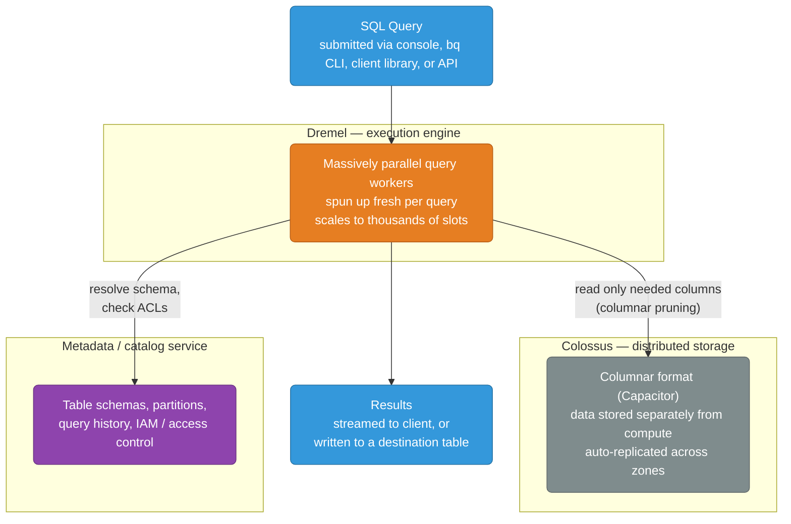
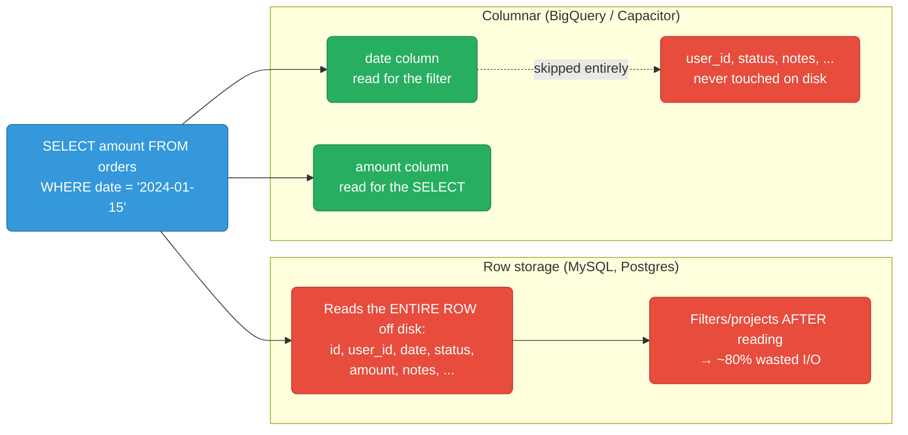
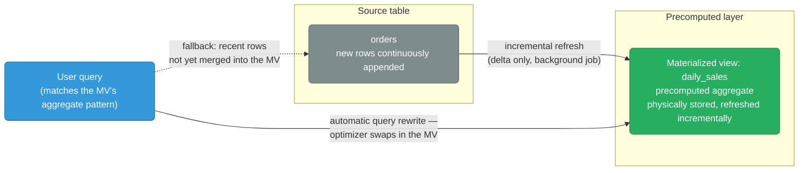

# BigQuery

BigQuery is GCP's fully managed, serverless data warehouse. No infrastructure to manage — you write SQL and BigQuery automatically scales compute across thousands of nodes.

<div class="quiz-progress" data-quiz-progress>
  <span class="quiz-progress-label">0/0 checks</span>
  <span class="quiz-progress-bar"><span class="quiz-progress-fill"></span></span>
</div>

---

## Architecture



**Key insight — separation of storage and compute:**
- Storage costs: ~$0.02/GB/month (no charge for queries)
- Compute costs: $5/TB scanned (on-demand) or flat-rate slots
- You can run 100 queries concurrently — each gets independent compute

<div class="quiz-card">
  <p class="quiz-q">Two teams each run a 500GB query against the same `orders` table at the exact same moment. Do they compete for the same compute capacity?</p>
  <button class="quiz-reveal">Reveal answer</button>
  <div class="quiz-a" hidden>No. Because BigQuery separates storage (Colossus) from compute (Dremel), each query gets its own independently scaled set of workers pulled fresh for that query — up to thousands of slots. The two queries only share the underlying storage layer, not compute, which is exactly why 100 concurrent queries can each get independent compute instead of queuing behind each other.</div>
</div>

---

## Columnar Storage — Why Queries Are Fast



For analytics (aggregate many rows, select few columns), columnar is 10-100× faster.

<div class="quiz-card">
  <p class="quiz-q">A table has 50 columns. You run <code>SELECT amount FROM orders WHERE date = '2024-01-15'</code>. Does BigQuery read all 50 columns off disk and discard the ones it doesn't need?</p>
  <button class="quiz-reveal">Reveal answer</button>
  <div class="quiz-a" hidden>No. Columnar storage means each column lives in its own physical block, so BigQuery reads only the <code>date</code> column (for the filter) and the <code>amount</code> column (for the projection) — the other 48 columns are never touched on disk. A row store like MySQL/Postgres, by contrast, must read the entire row and discard the unwanted columns afterward, which is why row storage wastes ~80% of the I/O on a query like this.</div>
</div>

---

## Tables and Partitioning

```sql
-- Partitioned table (reduces cost — only scans relevant partitions)
CREATE TABLE `project.dataset.orders`
PARTITION BY DATE(created_at)    -- one partition per day
OPTIONS (
    partition_expiration_days = 365,    -- auto-delete partitions older than 1 year
    require_partition_filter = true     -- queries MUST filter on created_at (prevents full scans)
)
AS SELECT * FROM ...;

-- Clustered table (sort data within partitions for faster point lookups)
CREATE TABLE `project.dataset.orders`
PARTITION BY DATE(created_at)
CLUSTER BY user_id, status    -- sort within each partition by these columns
AS SELECT * FROM ...;

-- Estimate cost before running
SELECT COUNT(*) FROM `project.dataset.orders`
WHERE DATE(created_at) = '2024-01-15';
-- In BQ console: shows "This query will process X bytes" before running
```

**Cost = bytes scanned:**
- Partition pruning: `WHERE DATE(created_at) = '2024-01-15'` → scans 1 day, not all history
- Clustering: `WHERE user_id = 123` → BigQuery skips blocks that don't contain user_id=123
- Projected columns: `SELECT amount` costs less than `SELECT *`

<div class="quiz-card">
  <p class="quiz-q">A table is created with <code>require_partition_filter = true</code>. A teammate runs a query against it without any <code>WHERE</code> clause on the partitioning column. What happens?</p>
  <button class="quiz-reveal">Reveal answer</button>
  <div class="quiz-a" hidden>The query is rejected before it runs — it doesn't just log a warning or fall back to a full scan. <code>require_partition_filter</code> forces every query to filter on the partitioning column, which is exactly what prevents an accidental full-history scan (and the bill that comes with it) on a table that's supposed to be queried one day/partition at a time.</div>
</div>

---

## Slots — Compute Units

A slot is one unit of CPU + RAM used to execute one unit of work. A complex query — say a `JOIN` across 3 tables over a 1TB scan — walks through the same four stages regardless of how many slots it gets:

<div class="stepper">
  <div class="stepper-panels">
    <div class="stepper-panel active">
      <strong>1. Slot allocation.</strong> The query is parsed and optimized into an execution plan — a DAG of stages. The <strong>slot scheduler</strong> assigns slots to the query from the caller's reservation (or the shared on-demand pool). More slots means more of the plan's stages can run in parallel, not a faster single worker.
    </div>
    <div class="stepper-panel">
      <strong>2. Stage execution (leaf stages).</strong> The first stages run across many slot workers in parallel, each one reading a single shard of the table directly from Colossus and applying <code>WHERE</code> filters and column projection locally — before any row leaves that worker.
    </div>
    <div class="stepper-panel">
      <strong>3. Shuffle.</strong> A <code>JOIN</code>, <code>GROUP BY</code>, or <code>ORDER BY</code> needs rows with the same key on the same worker, so intermediate results get repartitioned by key across the fleet before the next stage runs. This is the network-bound step, and it's the one most likely to hit a shuffle quota on a wide, unfiltered join.
    </div>
    <div class="stepper-panel">
      <strong>4. Merge and return.</strong> The final stage combines the shuffled, per-key partial results into the query's output, streams it back to the client (or writes it to a destination table), and releases its slots back to the pool for the next query in line.
    </div>
  </div>
  <div class="stepper-controls">
    <button class="stepper-prev">← Prev</button>
    <span class="stepper-dots"></span>
    <span class="stepper-label"></span>
    <button class="stepper-next">Next →</button>
  </div>
</div>

**Pricing models:**
| Model | Price | Best for |
|-------|-------|---------|
| On-demand | $5/TB scanned (first 1 TB/mo free) | Sporadic queries, unknown usage |
| Capacity (Editions) | Standard / Enterprise / Enterprise Plus, billed per **slot-hour** with optional 1- or 3-year commitments; autoscaling slots available | Predictable, high-volume workloads |
| Reservations + assignments | Buy a baseline of slots in an Edition, then assign capacity to projects/folders | Large orgs sharing capacity across teams |

> The older **flat-rate** model (fixed monthly slot commitments) was replaced by **BigQuery Editions** in 2023. Editions bill per slot-hour and support autoscaling, so you no longer pre-purchase fixed 100-slot blocks.

<div class="quiz-card">
  <p class="quiz-q">A colleague wants to set up a fixed 100-slot flat-rate commitment for predictable monthly billing. What should you tell them?</p>
  <button class="quiz-reveal">Reveal answer</button>
  <div class="quiz-a" hidden>Flat-rate (fixed monthly slot commitments) was replaced by BigQuery Editions in 2023. They should provision capacity through an Edition (Standard / Enterprise / Enterprise Plus) instead, which bills per slot-hour, supports optional 1- or 3-year commitments, and — unlike the old model — supports autoscaling slots, so they're not locked into a fixed 100-slot block regardless of actual load.</div>
</div>

---

## Streaming Inserts vs Batch Load

All four ingestion paths land data in the same BigQuery table, but they differ sharply on latency, cost, and how much plumbing you own. Flip between them below:

<div class="toggle-switch">
  <div class="toggle-buttons">
    <button data-toggle-opt="swapi" class="active state-ok">Storage Write API</button>
    <button data-toggle-opt="dataflow" class="state-ok">Dataflow</button>
    <button data-toggle-opt="insertall" class="state-warn">insertAll (legacy)</button>
    <button data-toggle-opt="batch">Batch load</button>
  </div>
  <div class="toggle-panel active" data-toggle-panel="swapi">
    <strong>Storage Write API (recommended).</strong> gRPC streaming write path straight into BigQuery's storage layer. Supports exactly-once delivery and stream-level transactions, and is cheaper than the legacy <code>insertAll</code> REST endpoint. Use this for any new production streaming ingest pipeline you're building yourself.
  </div>
  <div class="toggle-panel" data-toggle-panel="dataflow">
    <strong>Dataflow.</strong> A managed streaming pipeline that uses the Storage Write API under the hood, adding windowing, dedup, and transform logic upstream of BigQuery with exactly-once semantics. Use this when you want a managed, autoscaling pipeline instead of hand-rolling a gRPC writer.
  </div>
  <div class="toggle-panel" data-toggle-panel="insertall">
    <strong>Legacy streaming inserts — insertAll (tabledata REST).</strong> Rows are queryable almost immediately after insert, priced at roughly $0.01/200MB. It still works, but the Storage Write API supersedes it for new pipelines — keep <code>insertAll</code> only for legacy or simple-append use cases you haven't migrated yet.
  </div>
  <div class="toggle-panel" data-toggle-panel="batch">
    <strong>Batch load jobs.</strong> Bulk-load CSV/JSON/Avro/Parquet from Cloud Storage (or other sources). <strong>Free</strong> — no charge for the load job itself — at the cost of latency: nothing is queryable until the whole job finishes. Use this for daily/hourly ETL where near-real-time freshness isn't required.
  </div>
</div>

> The **Storage Write API** (gRPC) is the current recommended path for streaming ingestion — it supports exactly-once delivery, stream-level transactions, and is cheaper than the legacy `insertAll` REST endpoint. Prefer it for new pipelines; `insertAll` remains for simple/legacy append use cases.

<div class="quiz-card">
  <p class="quiz-q">You bulk-load a 500GB CSV export from GCS into BigQuery using a batch load job. Does the load job itself show up on your bill the way a $5/TB query would?</p>
  <button class="quiz-reveal">Reveal answer</button>
  <div class="quiz-a" hidden>No — batch load jobs are free; there's no charge for the load itself. You only pay ongoing storage cost for the data once it's landed, and compute cost later when you actually query it. That's the trade you're making for latency: the data isn't queryable until the whole job finishes, but getting it in cost nothing.</div>
</div>

---

## External Tables and Federated Queries

```sql
-- Query data directly from GCS without loading into BigQuery
CREATE EXTERNAL TABLE `project.dataset.raw_events`
OPTIONS (
    format = 'NEWLINE_DELIMITED_JSON',
    uris = ['gs://my-bucket/events/2024/01/15/*.json']
);

SELECT event_type, COUNT(*) FROM `project.dataset.raw_events`
GROUP BY event_type;
-- Reads directly from GCS — no storage cost in BQ, slower than native tables

-- Query across GCP services (federated)
SELECT bq.user_id, cs.status
FROM `project.dataset.orders` bq
JOIN `project.region-us.INFORMATION_SCHEMA.TABLES` cs
ON bq.user_id = cs.table_name;
```

---

## GCP-Specific Features

```sql
-- Time travel: query data as it was 7 days ago
SELECT * FROM `project.dataset.orders`
FOR SYSTEM_TIME AS OF TIMESTAMP_SUB(CURRENT_TIMESTAMP(), INTERVAL 6 HOUR);

-- Snapshots: point-in-time table copy (billing: only stores diffs)
CREATE SNAPSHOT TABLE `project.dataset.orders_snapshot_20240115`
CLONE `project.dataset.orders`
FOR SYSTEM_TIME AS OF '2024-01-15 00:00:00 UTC';

-- Authorized views: share data without exposing underlying tables
-- Row-level security with row access policies
CREATE ROW ACCESS POLICY orders_by_region
ON `project.dataset.orders`
GRANT TO ("group:emea-team@company.com")
FILTER USING (region = 'EMEA');

-- INFORMATION_SCHEMA: metadata about all tables/jobs/partitions
SELECT table_id, row_count, size_bytes/1e9 AS size_gb, last_modified_time
FROM `project.dataset`.INFORMATION_SCHEMA.PARTITIONS
WHERE table_name = 'orders'
ORDER BY partition_id DESC LIMIT 10;
```

---

## Nested & Repeated Fields (STRUCT / ARRAY)

BigQuery is columnar but **not** relational-normalized. Instead of splitting a 1-to-many relationship into two tables joined by a foreign key, you store the child rows *inside* the parent row as a repeated STRUCT. This is idiomatic BigQuery: joins are expensive (require shuffle), but reading a nested column is free because columnar storage stores each leaf field as its own column (Dremel's record shredding). You get normalized-like semantics with denormalized read performance.

- **RECORD / STRUCT** — an ordered set of typed sub-fields, like an embedded row (`address STRUCT<city STRING, zip STRING>`).
- **REPEATED (ARRAY)** — a column holding zero or more values of the same type. Combine both — `ARRAY<STRUCT<...>>` — to embed a child table.

```sql
-- Denormalized: orders with line items nested (no separate items table)
CREATE TABLE `project.dataset.orders` (
    order_id   STRING,
    user_id    STRING,
    created_at TIMESTAMP,
    shipping   STRUCT<city STRING, zip STRING>,          -- RECORD / STRUCT
    items      ARRAY<STRUCT<sku STRING, qty INT64, price NUMERIC>>  -- REPEATED STRUCT
);

-- Insert one order row containing many line items — no join needed
INSERT INTO `project.dataset.orders` VALUES (
    'o-1', 'u-42', CURRENT_TIMESTAMP(),
    STRUCT('Pune', '411001'),
    [STRUCT('sku-a', 2, 199.00), STRUCT('sku-b', 1, 49.50)]
);

-- UNNEST() flattens the array back into rows for aggregation
SELECT
    o.order_id,
    o.shipping.city,                 -- dot access into STRUCT
    item.sku,
    item.qty * item.price AS line_total
FROM `project.dataset.orders` AS o,
     UNNEST(o.items) AS item         -- correlated cross join, but NO shuffle
WHERE o.shipping.city = 'Pune';

-- Aggregate across the nested array without a real join
SELECT order_id, SUM(item.qty * item.price) AS order_total
FROM `project.dataset.orders`, UNNEST(items) AS item
GROUP BY order_id;
```

**Why idiomatic vs normalized relational:** in Postgres/MySQL you'd normalize into `orders` + `order_items` and JOIN on `order_id` — correct, but joins on billions of rows trigger a shuffle stage in Dremel. Nesting keeps the child rows physically co-located with the parent, so `UNNEST` is a local operation (no shuffle, no network). Use nesting for stable 1-to-many data owned by the parent; keep separate tables only when the child is independently queried or updated at high volume.

<div class="quiz-card">
  <p class="quiz-q">You have <code>orders</code> with a nested <code>items ARRAY&lt;STRUCT&lt;...&gt;&gt;</code> column. Does <code>UNNEST(items)</code> to flatten it for aggregation trigger the same shuffle stage that a real <code>JOIN</code> between two normalized tables would?</p>
  <button class="quiz-reveal">Reveal answer</button>
  <div class="quiz-a" hidden>No. Because the child rows are physically co-located with the parent row on disk (columnar record shredding stores each leaf field as its own column), <code>UNNEST</code> is a local, in-place operation with no shuffle and no network traffic. A real <code>JOIN</code> between two separate tables has to redistribute rows by key across workers first — that's the shuffle nesting avoids.</div>
</div>

---

## BigQuery ML (BQML)

BQML lets you train and serve ML models using pure SQL — no data movement to a separate ML platform. The model is a first-class dataset object; training runs on BigQuery slots. Good for data teams who know SQL but not Python.

```sql
-- 1. Train a model (model_type picks the algorithm)
CREATE OR REPLACE MODEL `project.dataset.churn_model`
OPTIONS (
    model_type = 'logistic_reg',        -- linear_reg | logistic_reg | kmeans |
                                         -- boosted_tree_classifier | boosted_tree_regressor |
                                         -- dnn_classifier | arima_plus | ...
    input_label_cols = ['churned'],
    auto_class_weights = true
) AS
SELECT tenure_months, monthly_spend, support_tickets, churned
FROM `project.dataset.customers`;

-- kmeans (unsupervised) — no label column
CREATE OR REPLACE MODEL `project.dataset.user_segments`
OPTIONS (model_type = 'kmeans', num_clusters = 5) AS
SELECT recency, frequency, monetary FROM `project.dataset.rfm`;

-- 2. Evaluate — returns precision/recall/AUC (classification) or RMSE (regression)
SELECT * FROM ML.EVALUATE(
    MODEL `project.dataset.churn_model`,
    (SELECT tenure_months, monthly_spend, support_tickets, churned
     FROM `project.dataset.customers_holdout`)
);

-- 3. Predict — appends predicted_<label> + probabilities
SELECT customer_id, predicted_churned, predicted_churned_probs
FROM ML.PREDICT(
    MODEL `project.dataset.churn_model`,
    (SELECT customer_id, tenure_months, monthly_spend, support_tickets
     FROM `project.dataset.customers_active`)
);
```

**Remote models — connecting to Vertex AI / LLMs.** BQML can wrap a model hosted in Vertex AI (or a Vertex-hosted foundation model like Gemini) via a BigQuery connection, so you invoke it from SQL:

```sql
-- Register a remote model backed by a Vertex AI endpoint / foundation model
CREATE OR REPLACE MODEL `project.dataset.gemini_model`
REMOTE WITH CONNECTION `project.us.my_vertex_connection`
OPTIONS (endpoint = 'gemini-1.5-flash');

-- Call the LLM over a table column with ML.GENERATE_TEXT
SELECT
    review_id,
    ml_generate_text_result['candidates'][0]['content'] AS summary
FROM ML.GENERATE_TEXT(
    MODEL `project.dataset.gemini_model`,
    (SELECT review_id, CONCAT('Summarize in one line: ', review_text) AS prompt
     FROM `project.dataset.reviews`),
    STRUCT(0.2 AS temperature, 64 AS max_output_tokens)
);
```

> The connection's service account needs `Vertex AI User` on the project. Other remote functions: `ML.GENERATE_EMBEDDING` (text/image embeddings for vector search), `ML.UNDERSTAND_TEXT`, `ML.TRANSLATE`.

<div class="quiz-card">
  <p class="quiz-q">Where does the compute for <code>CREATE MODEL ... OPTIONS (model_type = 'logistic_reg')</code> actually run, and what does that mean for how it's billed?</p>
  <button class="quiz-reveal">Reveal answer</button>
  <div class="quiz-a" hidden>Training runs on BigQuery slots, the same compute BigQuery uses for any other query — there's no separate ML platform or data export involved. That means training cost is billed exactly like query cost (on-demand bytes-scanned or slot-hours from your reservation), not as a distinct ML service line item. It's also why BQML works well for teams that know SQL but not a separate ML stack: the model is a first-class dataset object you query with normal SQL.</div>
</div>

---

## Materialized Views

A materialized view (MV) precomputes and **physically stores** a query's result, then keeps it fresh incrementally — BigQuery applies only the delta from base-table changes rather than recomputing everything.



- **vs regular view:** a regular view is just stored SQL — re-executed (and re-scanned) on every query. An MV stores results, so repeat queries scan far fewer bytes.
- **vs scheduled query:** a scheduled query writes to a table on a fixed cron and is always stale between runs; you must query the output table by name. An MV refreshes automatically/incrementally and is transparent.
- **Automatic query rewrite:** you don't have to reference the MV. If you query the *base table* with a pattern the MV covers, BigQuery's optimizer transparently rewrites the query to read the MV (plus a smart delta scan of rows not yet merged) — cheaper and faster with no query change.

```sql
CREATE MATERIALIZED VIEW `project.dataset.daily_sales`
OPTIONS (
    enable_refresh = true,
    refresh_interval_minutes = 30,      -- background incremental refresh cadence
    max_staleness = INTERVAL '1' HOUR   -- allow serving slightly stale for lower cost
) AS
SELECT
    DATE(created_at) AS sales_day,
    shipping.city    AS city,
    COUNT(*)         AS order_count,
    SUM(total)       AS revenue
FROM `project.dataset.orders`
GROUP BY sales_day, city;
```

**Limitations:** aggregations are supported (`SUM`, `COUNT`, `MIN`, `MAX`, `AVG`, `COUNT DISTINCT` via HLL, etc.), but there are restrictions on joins (historically only inner joins under specific conditions; no `OUTER`/`CROSS`, no `UNNEST`, no window functions, no `HAVING`, no non-deterministic functions like `RAND()`/`CURRENT_TIMESTAMP()`). MVs must read from a single base table (join support is limited), and non-incremental MVs fall back to full refresh. Check current docs before relying on joins in an MV.

<div class="quiz-card">
  <p class="quiz-q">A materialized view aggregates <code>orders</code> by day and city. A teammate queries the <em>base</em> <code>orders</code> table directly with that same aggregate pattern instead of querying the MV by name. Do they miss out on the MV's cost savings?</p>
  <button class="quiz-reveal">Reveal answer</button>
  <div class="quiz-a" hidden>No. Thanks to automatic query rewrite, you don't have to reference the MV by name — if the query against the base table matches a pattern the MV covers, BigQuery's optimizer transparently rewrites it to read the MV instead (plus a small delta scan for rows not yet merged in). It's cheaper and faster with zero change to the query text, unlike a scheduled query where you must know to query the output table explicitly.</div>
</div>

---

## Scenarios — Common Issues

| Issue | Diagnosis | Fix |
|-------|-----------|-----|
| Query too expensive | `EXPLAIN` plan shows full table scan | Add `PARTITION BY`, use `WHERE date_col` |
| Queries queued (slot contention) | `INFORMATION_SCHEMA.JOBS` shows `pendingTime` | Increase reservation slots or use flat-rate |
| Data freshness lag | Streaming buffer not yet queryable | Use `WHERE _PARTITIONTIME >= TIMESTAMP_SUB(...)` |
| Permission denied | Service account missing roles | Grant `BigQuery Data Viewer` + `BigQuery Job User` |
| Exceeded shuffle quota | Query joins too many large tables | Materialize intermediate results, pre-aggregate |
