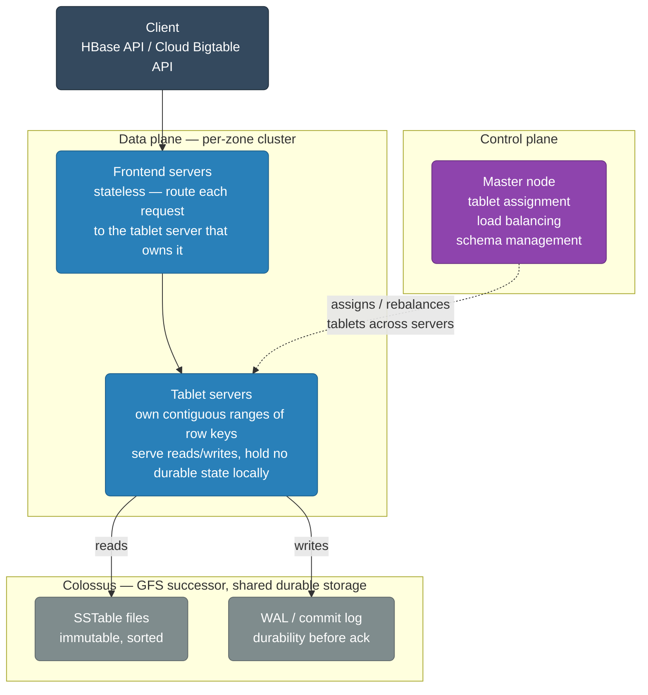
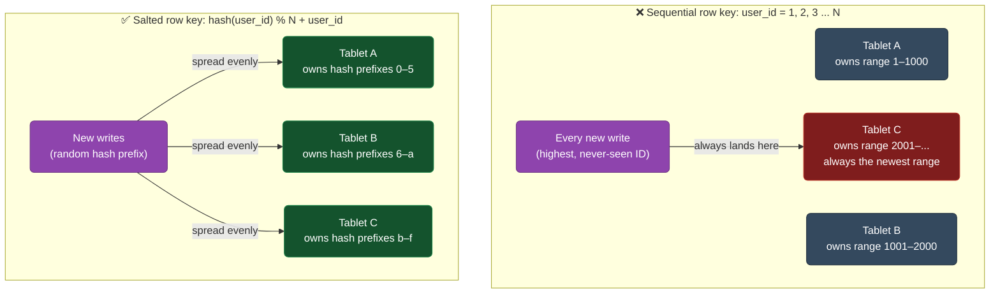
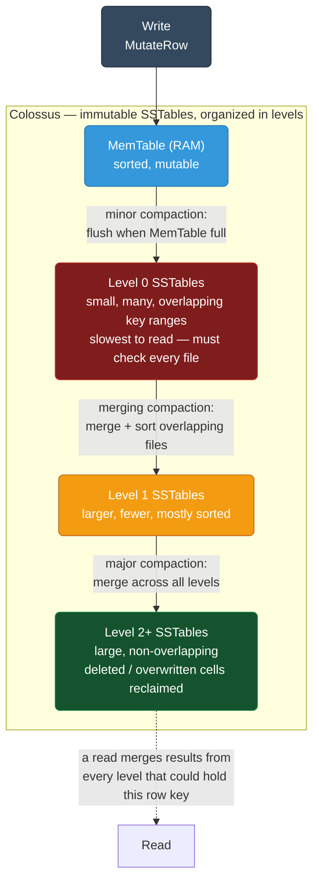
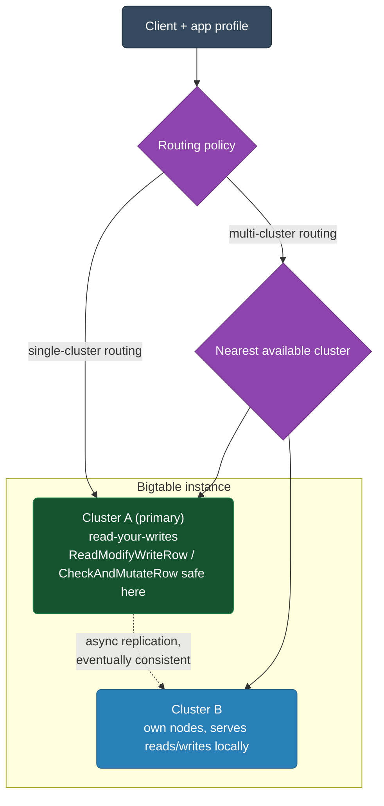

# Cloud Bigtable

Bigtable is GCP's NoSQL wide-column database — the same technology behind Google Search, Gmail, and Google Maps. Designed for petabytes of data with single-digit millisecond latency.

<div class="quiz-progress" data-quiz-progress>
  <span class="quiz-progress-label">0/0 checks</span>
  <span class="quiz-progress-bar"><span class="quiz-progress-fill"></span></span>
</div>

---

## Architecture



**Key design:**
- Data stored in SSTables (sorted string tables) on Colossus — separate from tablet servers
- Tablet servers are stateless — can be replaced, restarted without data loss
- Automatic load balancing: master moves tablets between servers as traffic shifts

<div class="quiz-card">
  <p class="quiz-q">A tablet server crashes outright. Why doesn't Bigtable need to replay writes from local disk to recover the tablets it owned?</p>
  <button class="quiz-reveal">Reveal answer</button>
  <div class="quiz-a" hidden>Tablet servers are stateless — the durable state for every tablet (its SSTables and WAL) already lives on Colossus, not on the tablet server itself. The master just reassigns those row-key ranges to a different tablet server, which reads the exact same SSTable and WAL files Colossus already has. There's no local-disk recovery step because the crashed server never held the only copy of anything.</div>
</div>

---

## Data Model — Wide Columns

| Row key | CF:actions | CF:profile |
|---|---|---|
| `user#123#2024` | `click:1700000000`, `purchase:1700001000` | `name: "Alice"`, `email: "a@b.com"` |
| `user#456#2024` | `click:1700002000`, `view:1700003000` | — |
| `user#789#2023` | `click:1699000000` | `name: "Bob"` |

**Concepts:**
- **Row key** — the only index. All queries must use row key prefix. Design it carefully.
- **Column family (CF)** — group of related columns. Defined at table creation. `CF:actions`, `CF:profile`
- **Column qualifier** — dynamic, can be anything within a CF. Created at write time.
- **Cell** — value at (row key, column family, column qualifier, timestamp). Multiple versions kept.

<div class="quiz-card">
  <p class="quiz-q">Using the table above: can you directly query "find all rows where CF:profile.name = Bob," the way a SQL WHERE clause would?</p>
  <button class="quiz-reveal">Reveal answer</button>
  <div class="quiz-a" hidden>No. The row key is the only index Bigtable maintains — every query must go through it, as an exact match or a prefix/range scan. There's no built-in way to look up a row by a column value like profile.name; you'd either have to scan the entire table filtering client-side, or maintain your own secondary index (e.g. a second table keyed by name) yourself.</div>
</div>

---

## Row Key Design — Critical for Performance



**Row key is the single biggest lever on Bigtable performance.** All four of these design choices produce the *same* logical data — the difference is entirely in how the keys are distributed across the row-key space, which is what determines which tablet each write lands on.

<div class="toggle-switch">
  <div class="toggle-buttons">
    <button data-toggle-opt="sequential" class="active state-bad">Sequential IDs</button>
    <button data-toggle-opt="timestamp" class="state-bad">Timestamp-prefixed</button>
    <button data-toggle-opt="reversed" class="state-ok">Reversed domain</button>
    <button data-toggle-opt="salted" class="state-ok">Salted / hashed prefix</button>
  </div>
  <div class="toggle-panel active" data-toggle-panel="sequential">
    <strong>e.g. row key = <code>1</code>, <code>2</code>, <code>3</code>, ...</strong> Monotonically increasing IDs always put the newest, highest-numbered row at the top of the key range — which lives on exactly one tablet. Every new write goes to that same tablet no matter how many tablets exist or how often the master rebalances, because rebalancing only moves tablet <em>ownership</em> between servers — it can't stop new writes from concentrating on whichever tablet currently owns the top of the range. Result: one server overwhelmed, the rest idle.
  </div>
  <div class="toggle-panel" data-toggle-panel="timestamp">
    <strong>e.g. row key = <code>1700000000#event_type</code>.</strong> Same failure mode as sequential IDs — a raw Unix timestamp at the front of the key is itself monotonically increasing, so all of "right now's" writes land on whichever tablet owns the most recent time range. Moving the timestamp to <em>after</em> a well-distributed prefix (instead of leading with it) avoids this entirely.
  </div>
  <div class="toggle-panel" data-toggle-panel="reversed">
    <strong>e.g. <code>com.example.user#event_type#timestamp</code> instead of <code>www.example.com#...</code>.</strong> Reversing a hierarchical identifier like a domain name spreads related-but-distinct prefixes across the row-key space instead of clustering everything under one common leading substring — while a prefix scan for "everything under <code>com.example.*</code>" stays just as efficient as before.
  </div>
  <div class="toggle-panel" data-toggle-panel="salted">
    <strong>e.g. <code>hash(user_id) % N + user_id</code>, or a short hash prefix like <code>a3f2#user:123#timestamp</code>.</strong> Prepending a hash-derived prefix scatters writes for the same logical entity (a hot user, a hot device) across N tablets instead of one, and lets reads for different hash buckets run in parallel. Tradeoff: a scan for one specific user now has to fan out across every possible prefix instead of hitting one contiguous range.
  </div>
</div>

These techniques compose rather than compete: `user:123#2024-01#event_type` (user + time range) scans efficiently by user and month within a single contiguous key range — worth layering a salt on top of it only if a handful of users are so hot that even that unsalted user prefix would still overload one tablet.

<div class="quiz-card">
  <p class="quiz-q">The master automatically rebalances tablets across servers as traffic shifts. Does that fix the hotspot caused by sequential, incrementing row keys?</p>
  <button class="quiz-reveal">Reveal answer</button>
  <div class="quiz-a" hidden>No. Rebalancing moves tablet <em>ranges</em> between servers, but every new write still has the highest ID in the table, so it always lands wherever the top of the key range currently lives — even if that tablet just got moved to a fresh, idle server. Fixing this requires changing the row key design itself (salting, hashing, or reversing), not the tablet placement.</div>
</div>

---

## Reads and Writes

```mermaid
sequenceDiagram
    participant APP as Application
    participant FE as Frontend
    participant TS as Tablet Server
    participant COL as Colossus

    rect rgb(40, 55, 75)
    Note over APP,COL: Write path — MutateRow
    APP->>FE: MutateRow(row_key, mutations)
    FE->>TS: Route to the tablet server that owns this row key
    TS->>COL: Append mutation to WAL (durability before ack)
    COL-->>TS: WAL append confirmed
    TS->>TS: Apply mutation to in-memory MemTable
    TS-->>APP: OK — acknowledged once the WAL write is durable
    Note over TS,COL: Asynchronous, later: flush MemTable to an immutable SSTable
    end

    rect rgb(40, 60, 45)
    Note over APP,COL: Read path — ReadRow
    APP->>FE: ReadRow(row_key)
    FE->>TS: Route to the tablet server owning this row key
    TS->>TS: Check MemTable for the most recent writes
    TS->>COL: Check on-disk SSTables for older versions
    COL-->>TS: Matching cells across SSTables
    TS->>TS: Merge results, latest timestamp wins
    TS-->>APP: Row data
    end
```



<div class="quiz-card">
  <p class="quiz-q">MutateRow returns OK to the application. Has that mutation already reached an SSTable on Colossus at that point?</p>
  <button class="quiz-reveal">Reveal answer</button>
  <div class="quiz-a" hidden>Not necessarily. The write is acknowledged once it's durable in the WAL and applied to the in-memory MemTable — the flush of that MemTable into an actual SSTable on Colossus happens later, asynchronously, once the MemTable fills up. The WAL is what makes the ack safe even though the MemTable itself is memory-only until that background flush runs.</div>
</div>

---

## Compaction — LSM Tree

Bigtable uses an LSM (Log-Structured Merge) tree, same as LevelDB/RocksDB:



<div class="stepper">
  <div class="stepper-panels">
    <div class="stepper-panel active">
      <strong>1. Write lands in the MemTable.</strong> Every <code>MutateRow</code> is first appended to the WAL for durability, then applied to the in-memory MemTable — sorted, but not yet durable to Colossus as an SSTable.
    </div>
    <div class="stepper-panel">
      <strong>2. MemTable fills, minor compaction flushes it.</strong> Once the MemTable hits its size threshold, it's flushed out as a new, immutable Level 0 SSTable. This happens frequently and is fast — but each flush creates a separate small file whose row-key range can overlap every other L0 file.
    </div>
    <div class="stepper-panel">
      <strong>3. Overlapping L0 files slow reads down.</strong> Because L0 SSTables can overlap in row-key range, a single read may have to check the MemTable <em>and</em> several L0 files just to find every version of one row. More levels/files to check = slower reads.
    </div>
    <div class="stepper-panel">
      <strong>4. Compaction merges levels together.</strong> Minor/merging compaction combines overlapping L0 files into larger, mostly-sorted Level 1 SSTables; major compaction merges further into large, non-overlapping files — and this is also where deleted or overwritten cells are actually reclaimed, freeing disk space.
    </div>
    <div class="stepper-panel">
      <strong>5. Fewer, larger, non-overlapping files → faster reads.</strong> Each compaction pass reduces how many files a read has to merge across. That's the entire performance point of compaction: it trades background write-side I/O now for read-side speed later.
    </div>
  </div>
  <div class="stepper-controls">
    <button class="stepper-prev">← Prev</button>
    <span class="stepper-dots"></span>
    <span class="stepper-label"></span>
    <button class="stepper-next">Next →</button>
  </div>
</div>

**Compaction types:**
- **Minor:** flush MemTable to L0 — happens frequently, fast
- **Major:** merge L0→L1, L1→L2 — reclaims space from deleted/updated cells, improves read performance

<div class="quiz-card">
  <p class="quiz-q">Which compaction type actually reclaims disk space from deleted or overwritten cells — minor or major?</p>
  <button class="quiz-reveal">Reveal answer</button>
  <div class="quiz-a" hidden>Major compaction. Minor compaction only flushes the MemTable into a new Level 0 SSTable — fast and frequent, but it doesn't touch or merge any existing data. Major compaction is what merges SSTables across levels, which is exactly where overwritten and deleted cells finally get dropped and disk space is reclaimed — it's also what improves read performance, by reducing how many files a read has to check.</div>
</div>

---

## Bigtable vs Other Databases

| | Bigtable | BigQuery | Spanner | Firestore |
|--|---------|---------|---------|----------|
| Type | Wide-column NoSQL | Data warehouse | NewSQL relational | Document NoSQL |
| Latency | Single-digit ms | Seconds | ~10ms | ~10ms |
| Scale | Petabytes | Petabytes | Petabytes | Terabytes |
| SQL | HBase API only | Full SQL | Full SQL | Limited |
| Transactions | Single-row atomic | No | Full ACID | Optimistic |
| Best for | Time-series, IoT, ML features | Analytics, reporting | Financial, global OLTP | Mobile/web apps |

<div class="quiz-card">
  <p class="quiz-q">Of these four, which one gives you full multi-row ACID transactions?</p>
  <button class="quiz-reveal">Reveal answer</button>
  <div class="quiz-a" hidden>Spanner. Bigtable only guarantees single-row atomic transactions, BigQuery has none, and Firestore's transactions are optimistic — Spanner is the only one built for full ACID across multiple rows, which is exactly why it's the pick for financial and global OLTP workloads rather than time-series or ML feature stores.</div>
</div>

---

## Bigtable vs HBase

Bigtable is API-compatible with Apache HBase. HBase code works with minimal changes.

```java
// HBase / Bigtable Java client
Connection connection = BigtableConfiguration.connect(projectId, instanceId);
Table table = connection.getTable(TableName.valueOf("user-events"));

// Write
Put put = new Put(Bytes.toBytes("user#123#2024"));
put.addColumn(Bytes.toBytes("actions"), Bytes.toBytes("click"), Bytes.toBytes("button1"));
table.put(put);

// Read single row
Get get = new Get(Bytes.toBytes("user#123#2024"));
Result result = table.get(get);

// Scan prefix (all events for user 123)
Scan scan = new Scan();
scan.setRowPrefixFilter(Bytes.toBytes("user#123"));
ResultScanner scanner = table.getScanner(scan);
```

---

## Monitoring and Optimization

```bash
# Check Bigtable metrics in Cloud Monitoring
# Key metrics:
# bigtable.googleapis.com/server/latencies         → p99 read/write latency
# bigtable.googleapis.com/server/request_count     → QPS by type
# bigtable.googleapis.com/server/error_count       → errors by code
# bigtable.googleapis.com/cluster/cpu_load         → hotspot indicator (should be <70%)
# bigtable.googleapis.com/cluster/storage_utilization

# Key Visualizer: GCP console tool showing read/write patterns across row key space
# Hotspots appear as bright spots — means row key design needs improvement
```

**Performance tips:**
- Use batch mutations for bulk writes (reduces round trips)
- Pre-split table into tablets at creation time for known row key patterns
- Use `ReadModifyWriteRow` for atomic increment/append operations
- Set cell versions limit (default is unlimited — old versions waste storage)

```bash
# Set max versions per cell family
cbt -project=my-project -instance=my-instance setgcpolicy my-table actions maxversions=1
```

---

## Replication & App Profiles

A Bigtable *instance* can have multiple *clusters* in different zones/regions. Adding a second cluster turns on **replication**: every write is asynchronously copied to all clusters. Replication is **eventually consistent** and **per-cluster** — each cluster has its own nodes and serves reads/writes locally, and there is no cross-cluster consensus. This gives HA, geographic read locality, and workload isolation (e.g. serving vs batch), but a read on cluster B may not yet see a write that just landed on cluster A.

**App profiles** decide how a client's requests are routed across those clusters:



<div class="toggle-switch">
  <div class="toggle-buttons">
    <button data-toggle-opt="multi" class="active state-warn">Multi-cluster routing</button>
    <button data-toggle-opt="single" class="state-ok">Single-cluster routing</button>
  </div>
  <div class="toggle-panel active" data-toggle-panel="multi">
    Requests go to the nearest available cluster and automatically fail over if one is down. Best availability, but only <strong>eventual consistency</strong>. Single-row transactions are <strong>not</strong> safe here because <code>ReadModifyWrite</code> (atomic increment/append) and <code>CheckAndMutate</code> (conditional write) could hit different clusters and race.
  </div>
  <div class="toggle-panel" data-toggle-panel="single">
    Pin the app profile to one cluster. Required for <strong>read-your-writes</strong> consistency and for single-row transactions (<code>ReadModifyWriteRow</code>, <code>CheckAndMutateRow</code>), because those atomic ops must serialize on one cluster. Trade-off: no automatic failover for that profile.
  </div>
</div>

A common pattern: one single-cluster app profile for the transactional/serving path, and one multi-cluster app profile for read-heavy or batch workloads.

```bash
# Single-cluster routing profile — needed for conditional / read-modify-write consistency
gcloud bigtable app-profiles create serving-profile \
    --instance=my-instance \
    --route-to=cluster-a \
    --transactional-writes \
    --description="Serving path (read-your-writes, single-row txns)"

# Multi-cluster routing profile — HA + auto-failover, eventual consistency
gcloud bigtable app-profiles create batch-profile \
    --instance=my-instance \
    --route-any \
    --description="Batch/analytics reads, nearest cluster"

# cbt equivalent
cbt -project=my-project -instance=my-instance createappprofile my-instance serving-profile \
    "Serving path" route-to=cluster-a
```

<div class="quiz-card">
  <p class="quiz-q">An app profile uses multi-cluster routing, and the app calls ReadModifyWriteRow to increment a counter on the same row twice in quick succession. Why is this unsafe?</p>
  <button class="quiz-reveal">Reveal answer</button>
  <div class="quiz-a" hidden>Multi-cluster routing sends each request to whichever cluster is nearest/available, and replication between clusters is asynchronous with no cross-cluster consensus. The two ReadModifyWriteRow calls could land on different clusters and each read a stale, not-yet-replicated value — racing each other instead of serializing on one copy of the row. Single-cluster routing exists specifically because atomic ops like this need to serialize on one cluster to be safe.</div>
</div>

---

## Autoscaling

Instead of provisioning a fixed node count per cluster, Bigtable can autoscale nodes based on utilization targets. Scaling is **per-cluster** and node changes are non-disruptive (data lives on Colossus, so nodes just re-own tablets).

- **min / max nodes** — the bounds Bigtable stays within.
- **CPU target utilization** — target average CPU load (e.g. 60%); Bigtable adds nodes when CPU exceeds it, removes them when below.
- **Storage target utilization** — target storage-per-node (e.g. 2560 GB SSD / node); protects against hitting the hard per-node storage limit even when CPU is low. Bigtable scales up to satisfy whichever target (CPU or storage) needs more nodes.

<div class="tab-group">
  <div class="tab-buttons">
    <button data-tab="manual" class="active">Manual scaling</button>
    <button data-tab="auto">Autoscaling</button>
  </div>
  <div class="tab-panels">
    <div class="tab-panel active" data-tab-panel="manual">
      Use for steady, predictable load or when you must cap cost precisely, and to pre-provision ahead of a <em>known</em> spike — autoscaling reacts to load, it doesn't predict it, so a fixed node count you set in advance is the only way to be ready the instant a scheduled spike starts.
    </div>
    <div class="tab-panel" data-tab-panel="auto">
      Use for variable/diurnal traffic to avoid over-provisioning while keeping p99 latency in check. Set <code>min-nodes</code> high enough to absorb sudden bursts, since scale-up itself is gradual — autoscaling only adds nodes once utilization has already crossed the target, it can't add them ahead of a burst it didn't see coming.
    </div>
  </div>
</div>

```bash
# Enable autoscaling on a cluster (replaces fixed --num-nodes)
gcloud bigtable clusters update cluster-a \
    --instance=my-instance \
    --autoscaling-min-nodes=3 \
    --autoscaling-max-nodes=30 \
    --autoscaling-cpu-target=60 \
    --autoscaling-storage-target=2560   # GB per node (SSD)

# Revert to manual scaling with a fixed node count
gcloud bigtable clusters update cluster-a \
    --instance=my-instance \
    --num-nodes=5
```

<div class="quiz-card">
  <p class="quiz-q">Autoscaling is enabled for a bursty workload, with min-nodes set right at the steady-state average node count. Why can a sudden traffic burst still cause a latency spike?</p>
  <button class="quiz-reveal">Reveal answer</button>
  <div class="quiz-a" hidden>Because scale-up is gradual — Bigtable adds nodes reactively once CPU or storage utilization crosses the target, it doesn't predict a burst in advance. If min-nodes only covers steady-state load, the first moments of a sudden spike have to be absorbed by too few nodes before autoscaling catches up, which is exactly why min-nodes should be set high enough to absorb bursts rather than just the average.</div>
</div>
