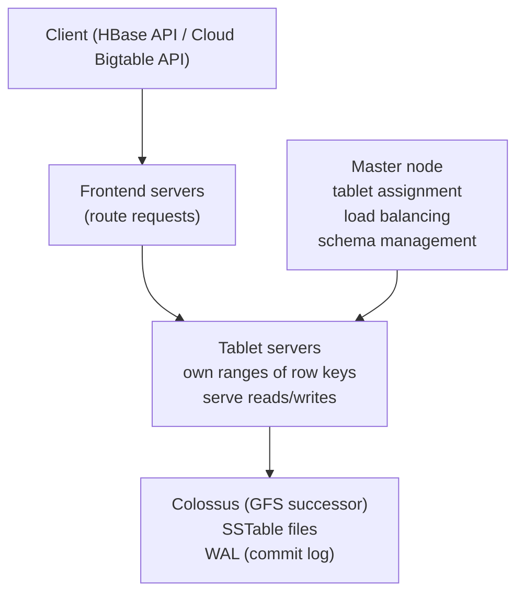
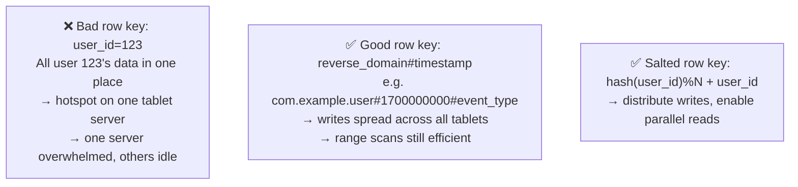
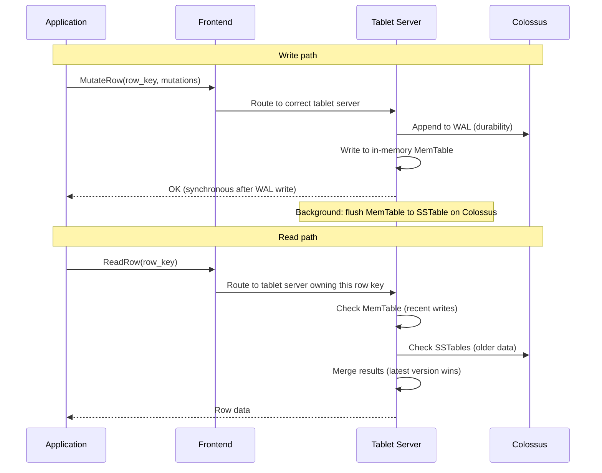
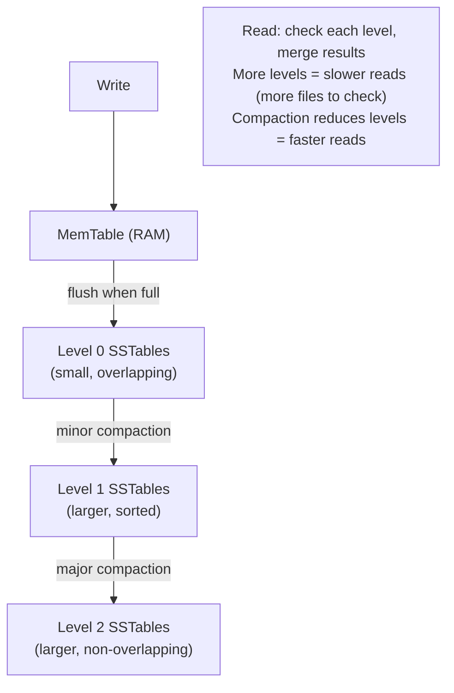
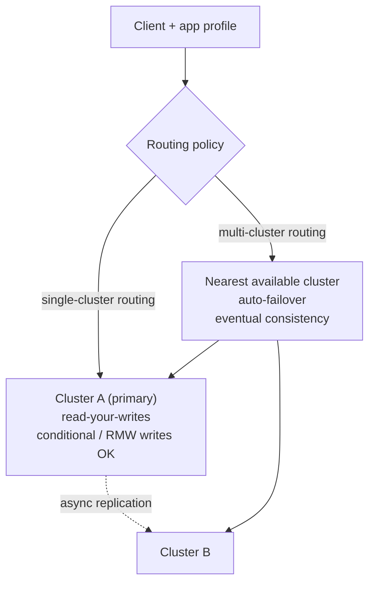

# Cloud Bigtable

Bigtable is GCP's NoSQL wide-column database — the same technology behind Google Search, Gmail, and Google Maps. Designed for petabytes of data with single-digit millisecond latency.

---

## Architecture



**Key design:**
- Data stored in SSTables (sorted string tables) on Colossus — separate from tablet servers
- Tablet servers are stateless — can be replaced, restarted without data loss
- Automatic load balancing: master moves tablets between servers as traffic shifts

---

## Data Model — Wide Columns

```
Table: user-events

Row key          | CF:actions          | CF:profile
-----------------+--------------------+------------------
user#123#2024    | click:1700000000   | name: "Alice"
                 | purchase:1700001000| email: "a@b.com"
user#456#2024    | click:1700002000   |
                 | view:1700003000    |
user#789#2023    | click:1699000000   | name: "Bob"
```

**Concepts:**
- **Row key** — the only index. All queries must use row key prefix. Design it carefully.
- **Column family (CF)** — group of related columns. Defined at table creation. `CF:actions`, `CF:profile`
- **Column qualifier** — dynamic, can be anything within a CF. Created at write time.
- **Cell** — value at (row key, column family, column qualifier, timestamp). Multiple versions kept.

---

## Row Key Design — Critical for Performance



**Row key anti-patterns:**
```
Sequential IDs (1, 2, 3...)     → all writes hit the last tablet (hotspot)
Timestamps at start             → all recent writes go to same tablet
Domain names (www.example.com)  → reverse to com.example.www for better distribution
```

**Row key patterns:**
```
Reverse domain:    com.example.user#event_type#timestamp
User + time range: user:123#2024-01#event_type (scan by user+month)
Hash prefix:       a3f2#user:123#timestamp (distribute hot users)
```

---

## Reads and Writes



---

## Compaction — LSM Tree

Bigtable uses an LSM (Log-Structured Merge) tree, same as LevelDB/RocksDB:



**Compaction types:**
- **Minor:** flush MemTable to L0 — happens frequently, fast
- **Major:** merge L0→L1, L1→L2 — reclaims space from deleted/updated cells, improves read performance

---

## Bigtable vs Other Databases

| | Bigtable | BigQuery | Spanner | Firestore |
|--|---------|---------|---------|----------|
| Type | Wide-column NoSQL | Data warehouse | NewSQL relational | Document NoSQL |
| Latency | Single-digit ms | Seconds | ~10ms | ~10ms |
| Scale | Petabytes | Petabytes | Petabytes | Terabytes |
| SQL | HBase API only | Full SQL | Full SQL | Limited |
| Transactions | Single-row atomic | No | Full ACID | Optimistic |
| Best for | Time-series, IoT, ML features | Analytics, reporting | Financial, global OLTP | Mobile/web apps |

---

## Bigtable vs HBase

Bigtable is API-compatible with Apache HBase. HBase code works with minimal changes.

```java
// HBase / Bigtable Java client
Connection connection = BigtableConfiguration.connect(projectId, instanceId);
Table table = connection.getTable(TableName.valueOf("user-events"));

// Write
Put put = new Put(Bytes.toBytes("user#123#2024"));
put.addColumn(Bytes.toBytes("actions"), Bytes.toBytes("click"), Bytes.toBytes("button1"));
table.put(put);

// Read single row
Get get = new Get(Bytes.toBytes("user#123#2024"));
Result result = table.get(get);

// Scan prefix (all events for user 123)
Scan scan = new Scan();
scan.setRowPrefixFilter(Bytes.toBytes("user#123"));
ResultScanner scanner = table.getScanner(scan);
```

---

## Monitoring and Optimization

```bash
# Check Bigtable metrics in Cloud Monitoring
# Key metrics:
# bigtable.googleapis.com/server/latencies         → p99 read/write latency
# bigtable.googleapis.com/server/request_count     → QPS by type
# bigtable.googleapis.com/server/error_count       → errors by code
# bigtable.googleapis.com/cluster/cpu_load         → hotspot indicator (should be <70%)
# bigtable.googleapis.com/cluster/storage_utilization

# Key Visualizer: GCP console tool showing read/write patterns across row key space
# Hotspots appear as bright spots — means row key design needs improvement
```

**Performance tips:**
- Use batch mutations for bulk writes (reduces round trips)
- Pre-split table into tablets at creation time for known row key patterns
- Use `ReadModifyWriteRow` for atomic increment/append operations
- Set cell versions limit (default is unlimited — old versions waste storage)

```bash
# Set max versions per cell family
cbt -project=my-project -instance=my-instance setgcpolicy my-table actions maxversions=1
```

---

## Replication & App Profiles

A Bigtable *instance* can have multiple *clusters* in different zones/regions. Adding a second cluster turns on **replication**: every write is asynchronously copied to all clusters. Replication is **eventually consistent** and **per-cluster** — each cluster has its own nodes and serves reads/writes locally, and there is no cross-cluster consensus. This gives HA, geographic read locality, and workload isolation (e.g. serving vs batch), but a read on cluster B may not yet see a write that just landed on cluster A.

**App profiles** decide how a client's requests are routed across those clusters:



- **Multi-cluster routing** — requests go to the nearest available cluster and automatically fail over if one is down. Best availability, but only **eventual consistency**. Single-row transactions are **not** safe here because `ReadModifyWrite` (atomic increment/append) and `CheckAndMutate` (conditional write) could hit different clusters and race.
- **Single-cluster routing** — pin the app profile to one cluster. Required for **read-your-writes** consistency and for single-row transactions (`ReadModifyWriteRow`, `CheckAndMutateRow`), because those atomic ops must serialize on one cluster. Trade-off: no automatic failover for that profile.

A common pattern: one single-cluster app profile for the transactional/serving path, and one multi-cluster app profile for read-heavy or batch workloads.

```bash
# Single-cluster routing profile — needed for conditional / read-modify-write consistency
gcloud bigtable app-profiles create serving-profile \
    --instance=my-instance \
    --route-to=cluster-a \
    --transactional-writes \
    --description="Serving path (read-your-writes, single-row txns)"

# Multi-cluster routing profile — HA + auto-failover, eventual consistency
gcloud bigtable app-profiles create batch-profile \
    --instance=my-instance \
    --route-any \
    --description="Batch/analytics reads, nearest cluster"

# cbt equivalent
cbt -project=my-project -instance=my-instance createappprofile my-instance serving-profile \
    "Serving path" route-to=cluster-a
```

---

## Autoscaling

Instead of provisioning a fixed node count per cluster, Bigtable can autoscale nodes based on utilization targets. Scaling is **per-cluster** and node changes are non-disruptive (data lives on Colossus, so nodes just re-own tablets).

- **min / max nodes** — the bounds Bigtable stays within.
- **CPU target utilization** — target average CPU load (e.g. 60%); Bigtable adds nodes when CPU exceeds it, removes them when below.
- **Storage target utilization** — target storage-per-node (e.g. 2560 GB SSD / node); protects against hitting the hard per-node storage limit even when CPU is low. Bigtable scales up to satisfy whichever target (CPU or storage) needs more nodes.

**Manual vs autoscaling:** use **manual** for steady, predictable load or when you must cap cost precisely, and to pre-provision before a known spike (autoscaling reacts, it doesn't predict). Use **autoscaling** for variable/diurnal traffic to avoid over-provisioning while keeping p99 latency in check. Set `min-nodes` high enough to absorb sudden bursts, since scale-up is gradual.

```bash
# Enable autoscaling on a cluster (replaces fixed --num-nodes)
gcloud bigtable clusters update cluster-a \
    --instance=my-instance \
    --autoscaling-min-nodes=3 \
    --autoscaling-max-nodes=30 \
    --autoscaling-cpu-target=60 \
    --autoscaling-storage-target=2560   # GB per node (SSD)

# Revert to manual scaling with a fixed node count
gcloud bigtable clusters update cluster-a \
    --instance=my-instance \
    --num-nodes=5
```
