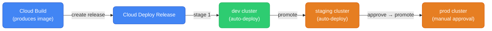

# GCP CI/CD — Cloud Build, Artifact Registry, Cloud Deploy

---

## CI/CD Service Map

| Stage | AWS | GCP |
|-------|-----|-----|
| Build | CodeBuild | **Cloud Build** |
| Container registry | ECR | **Artifact Registry** |
| Delivery / deploy | CodeDeploy + CodePipeline | **Cloud Deploy** |
| Source repo | CodeCommit | **Cloud Source Repositories** (or GitHub/GitLab) |
| Secrets in pipeline | Secrets Manager | **Secret Manager** |

Most GCP teams use **GitHub Actions or Jenkins for CI** and **Cloud Build + Cloud Deploy** for the GCP-native delivery step. Cloud Build alone handles most use cases without needing a full pipeline service.

---

## Cloud Build

Cloud Build = AWS CodeBuild. Runs containerized build steps, triggered by source events (git push, PR, tag).

### Build Config

Everything runs in a `cloudbuild.yaml` (equivalent to `buildspec.yml`):

```yaml
# cloudbuild.yaml
steps:
  # Step 1: Run tests
  - name: 'python:3.11'
    entrypoint: pip
    args: ['install', '-r', 'requirements.txt']
  
  - name: 'python:3.11'
    entrypoint: pytest
    args: ['tests/', '-v', '--tb=short']
    env:
      - 'ENVIRONMENT=test'

  # Step 2: Build Docker image
  - name: 'gcr.io/cloud-builders/docker'
    args:
      - 'build'
      - '-t'
      - 'us-central1-docker.pkg.dev/$PROJECT_ID/my-repo/my-app:$SHORT_SHA'
      - '-t'
      - 'us-central1-docker.pkg.dev/$PROJECT_ID/my-repo/my-app:latest'
      - '.'

  # Step 3: Push to Artifact Registry
  - name: 'gcr.io/cloud-builders/docker'
    args: ['push', '--all-tags', 'us-central1-docker.pkg.dev/$PROJECT_ID/my-repo/my-app']

  # Step 4: Deploy to Cloud Run (simple deploy, no progressive delivery)
  - name: 'gcr.io/google.com/cloudsdktool/cloud-sdk'
    entrypoint: gcloud
    args:
      - 'run'
      - 'deploy'
      - 'my-service'
      - '--image=us-central1-docker.pkg.dev/$PROJECT_ID/my-repo/my-app:$SHORT_SHA'
      - '--region=us-central1'

# Built images (Cloud Build caches these)
images:
  - 'us-central1-docker.pkg.dev/$PROJECT_ID/my-repo/my-app:$SHORT_SHA'

# Timeout and machine type
timeout: '1200s'
options:
  machineType: 'E2_HIGHCPU_8'    # more CPU for faster builds
  logging: CLOUD_LOGGING_ONLY
```

### Built-in Substitutions

```yaml
# Available automatically in every build
$PROJECT_ID       # GCP project ID
$BUILD_ID         # unique build ID
$SHORT_SHA        # first 7 chars of git commit SHA
$COMMIT_SHA       # full git commit SHA
$BRANCH_NAME      # git branch
$TAG_NAME         # git tag (if triggered by tag push)
$REPO_NAME        # repo name

# Custom substitutions
substitutions:
  _DEPLOY_ENV: production
  _SERVICE_NAME: my-api
steps:
  - name: 'ubuntu'
    args: ['echo', 'Deploying ${_SERVICE_NAME} to ${_DEPLOY_ENV}']
```

### Triggers

```bash
# Trigger on push to main branch
gcloud builds triggers create github \
  --repo-name=my-repo \
  --repo-owner=my-org \
  --branch-pattern=^main$ \
  --build-config=cloudbuild.yaml

# Trigger on tag push (release)
gcloud builds triggers create github \
  --repo-name=my-repo \
  --repo-owner=my-org \
  --tag-pattern="v[0-9]+\.[0-9]+\.[0-9]+" \
  --build-config=cloudbuild-release.yaml

# Manual trigger for a specific commit
gcloud builds submit \
  --config=cloudbuild.yaml \
  --substitutions=SHORT_SHA=$(git rev-parse --short HEAD) \
  .
```

### Accessing Secrets in Build

```yaml
# Access Secret Manager secrets in Cloud Build
steps:
  - name: 'gcr.io/cloud-builders/gcloud'
    entrypoint: 'bash'
    args:
      - '-c'
      - |
          DB_PASSWORD=$$(gcloud secrets versions access latest --secret=db-password)
          ./deploy.sh --password=$$DB_PASSWORD

# Or use availableSecrets block (cleaner)
availableSecrets:
  secretManager:
    - versionName: projects/$PROJECT_ID/secrets/db-password/versions/latest
      env: 'DB_PASSWORD'

steps:
  - name: 'gcr.io/cloud-builders/gcloud'
    secretEnv: ['DB_PASSWORD']
    script: |
      echo "Using password from Secret Manager: ${DB_PASSWORD:0:3}***"
```

### Build Caching

```yaml
# Cache dependencies between builds using GCS
steps:
  - name: 'gcr.io/cloud-builders/gsutil'
    args: ['cp', 'gs://my-build-cache/pip-cache.tar.gz', '/tmp/pip-cache.tar.gz']
    id: restore-cache

  - name: 'python:3.11'
    script: |
      tar xzf /tmp/pip-cache.tar.gz -C / 2>/dev/null || true
      pip install -r requirements.txt --cache-dir /root/.cache/pip
    waitFor: ['restore-cache']

  - name: 'gcr.io/cloud-builders/gsutil'
    args: ['cp', '-r', '/root/.cache/pip', 'gs://my-build-cache/pip-cache.tar.gz']
    waitFor: ['-']    # run after all steps
```

### Cloud Build vs AWS CodeBuild

| | Cloud Build | AWS CodeBuild |
|--|---|---|
| **Config file** | `cloudbuild.yaml` | `buildspec.yml` |
| **Build units** | "build steps" (each is a container) | "phases" within one environment |
| **Parallelism** | Steps can run in parallel with `waitFor` | Phases are sequential |
| **Machine types** | e2-medium to n1-highcpu-32 | Small to 72 vCPU |
| **Free tier** | 120 build-minutes/day | 100 build-minutes/month |
| **GitHub integration** | First-class | First-class |
| **Caching** | GCS-based or Docker layer cache | S3-based or local cache |
| **Cost** | $0.003/build-minute (n1-standard-1) | $0.005/build-minute (general1.small) |

---

## Artifact Registry

Artifact Registry = AWS ECR + CodeArtifact. Stores Docker images, Helm charts, Maven/PyPI/npm packages.

```bash
# Create a Docker repository
gcloud artifacts repositories create my-repo \
  --repository-format=docker \
  --location=us-central1 \
  --description="Production images"

# Authenticate Docker to Artifact Registry
gcloud auth configure-docker us-central1-docker.pkg.dev

# Build and push
docker build -t us-central1-docker.pkg.dev/my-project/my-repo/my-app:v1.0.0 .
docker push us-central1-docker.pkg.dev/my-project/my-repo/my-app:v1.0.0

# Pull
docker pull us-central1-docker.pkg.dev/my-project/my-repo/my-app:v1.0.0

# List images
gcloud artifacts docker images list us-central1-docker.pkg.dev/my-project/my-repo

# Delete old images (cleanup)
gcloud artifacts docker images delete \
  us-central1-docker.pkg.dev/my-project/my-repo/my-app:old-tag
```

### Vulnerability Scanning

```bash
# Enable automatic scanning on push
gcloud artifacts repositories update my-repo \
  --location=us-central1 \
  --enable-vulnerability-scanning

# View scan results
gcloud artifacts docker images list-vulnerabilities \
  us-central1-docker.pkg.dev/my-project/my-repo/my-app@sha256:abc123
```

### Cleanup Policies (= ECR Lifecycle Policies)

```bash
# Auto-delete untagged images older than 14 days
gcloud artifacts repositories set-cleanup-policies my-repo \
  --location=us-central1 \
  --policy='[
    {
      "name": "delete-old-untagged",
      "action": "DELETE",
      "condition": {
        "tagState": "UNTAGGED",
        "olderThan": "1209600s"
      }
    }
  ]'
```

### Helm Charts in Artifact Registry

```bash
# Create OCI-compatible Helm repo
gcloud artifacts repositories create helm-charts \
  --repository-format=docker \
  --location=us-central1

# Push Helm chart
helm package ./my-chart
helm push my-chart-1.0.0.tgz oci://us-central1-docker.pkg.dev/my-project/helm-charts

# Install from Artifact Registry
helm install my-release \
  oci://us-central1-docker.pkg.dev/my-project/helm-charts/my-chart \
  --version 1.0.0
```

---

## Cloud Deploy — Progressive Delivery

Cloud Deploy = AWS CodeDeploy + CodePipeline. Manages delivery pipelines with stages (dev → staging → prod), approval gates, and built-in rollback.



### Delivery Pipeline Config

```yaml
# clouddeploy.yaml
apiVersion: deploy.cloud.google.com/v1
kind: DeliveryPipeline
metadata:
  name: my-app-pipeline
  location: us-central1
description: My App delivery pipeline
serialPipeline:
  stages:
    - targetId: dev
      profiles: [dev]
    - targetId: staging
      profiles: [staging]
    - targetId: production
      profiles: [production]
      strategy:
        canary:
          runtimeConfig:
            cloudRun:
              automaticTrafficControl: true
          canaryDeployment:
            percentages: [10, 25, 50]
            verify: true
---
apiVersion: deploy.cloud.google.com/v1
kind: Target
metadata:
  name: dev
  location: us-central1
run:
  location: projects/my-project/locations/us-central1
---
apiVersion: deploy.cloud.google.com/v1
kind: Target
metadata:
  name: production
  location: us-central1
requireApproval: true    # manual approval before deploy to prod
run:
  location: projects/my-project/locations/us-central1
```

### Deploy Workflow

```bash
# Apply pipeline and target definitions
gcloud deploy apply --file=clouddeploy.yaml --region=us-central1

# Create a release (triggers deployment to dev)
gcloud deploy releases create release-$(date +%Y%m%d-%H%M) \
  --delivery-pipeline=my-app-pipeline \
  --region=us-central1 \
  --images=my-app=us-central1-docker.pkg.dev/my-project/my-repo/my-app:$SHORT_SHA

# Promote to staging (after dev passes)
gcloud deploy releases promote \
  --delivery-pipeline=my-app-pipeline \
  --region=us-central1 \
  --release=release-20240115-1430 \
  --to-target=staging

# Approve production deployment
gcloud deploy rollouts approve \
  my-app-pipeline-20240115-1430-to-production-0001 \
  --delivery-pipeline=my-app-pipeline \
  --region=us-central1 \
  --release=release-20240115-1430

# Rollback if needed
gcloud deploy rollouts rollback \
  my-app-pipeline \
  --region=us-central1 \
  --release=release-20240115-1430 \
  --to-target=production
```

---

## Full CI/CD Pipeline Pattern

```
Developer pushes to main
    │
    ▼
Cloud Build trigger fires
    ├── Run tests (pytest / go test / jest)
    ├── Build Docker image
    ├── Push to Artifact Registry
    ├── Run vulnerability scan
    └── Create Cloud Deploy release
         │
         ▼
    Auto-deploy to dev
         │  (smoke test / integration test)
         ▼
    Promote to staging
         │  (manual QA or automated regression)
         ▼
    Approval gate (Jira ticket / PR approval)
         │
         ▼
    Deploy to production
    (canary: 10% → 25% → 50% → 100%)
         │  (monitor error rate for 10min)
         ▼
    Full rollout or automatic rollback
```

---

## Cloud Build vs GitHub Actions

Most teams use GitHub Actions for CI and Cloud Build for GCP-specific deploy steps. Here's the integration:

```yaml
# .github/workflows/deploy.yml — uses gcloud in GHA
name: Deploy to GCP

on:
  push:
    branches: [main]

permissions:
  id-token: write    # for Workload Identity Federation (no service account keys)
  contents: read

jobs:
  deploy:
    runs-on: ubuntu-latest
    steps:
      - uses: actions/checkout@v4
      
      # Authenticate to GCP via Workload Identity (no keys needed)
      - uses: google-github-actions/auth@v2
        with:
          workload_identity_provider: 'projects/123/locations/global/workloadIdentityPools/github/providers/github'
          service_account: 'github-actions@my-project.iam.gserviceaccount.com'
      
      - uses: google-github-actions/setup-gcloud@v2
      
      - name: Configure Docker
        run: gcloud auth configure-docker us-central1-docker.pkg.dev
      
      - name: Build and push
        run: |
          docker build -t us-central1-docker.pkg.dev/my-project/my-repo/my-app:${{ github.sha }} .
          docker push us-central1-docker.pkg.dev/my-project/my-repo/my-app:${{ github.sha }}
      
      - name: Deploy to Cloud Run
        run: |
          gcloud run deploy my-service \
            --image=us-central1-docker.pkg.dev/my-project/my-repo/my-app:${{ github.sha }} \
            --region=us-central1
```

**GCP Workload Identity Federation for GitHub Actions** = AWS OIDC provider in IAM. No service account keys in GitHub secrets.
