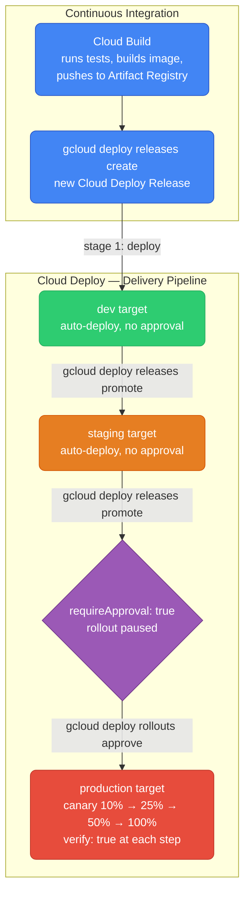
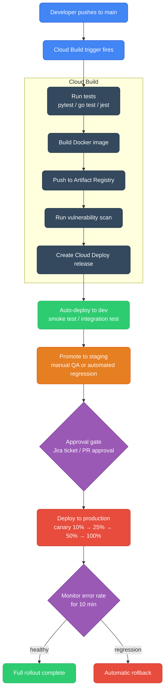
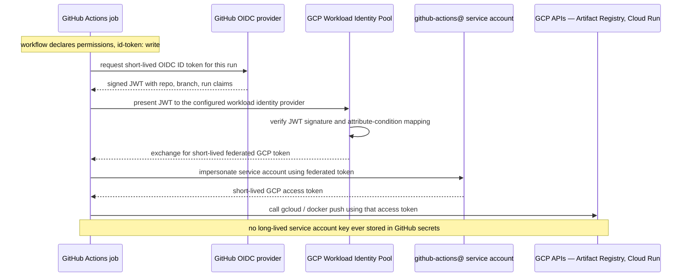

# GCP CI/CD — Cloud Build, Artifact Registry, Cloud Deploy

<div class="quiz-progress" data-quiz-progress>
  <span class="quiz-progress-label">0/0 checks</span>
  <span class="quiz-progress-bar"><span class="quiz-progress-fill"></span></span>
</div>

---

## CI/CD Service Map

| Stage | AWS | GCP |
|-------|-----|-----|
| Build | CodeBuild | **Cloud Build** |
| Container registry | ECR | **Artifact Registry** |
| Delivery / deploy | CodeDeploy + CodePipeline | **Cloud Deploy** |
| Source repo | CodeCommit | **Cloud Source Repositories** (or GitHub/GitLab) |
| Secrets in pipeline | Secrets Manager | **Secret Manager** |

Most GCP teams use **GitHub Actions or Jenkins for CI** and **Cloud Build + Cloud Deploy** for the GCP-native delivery step. Cloud Build alone handles most use cases without needing a full pipeline service.

---

## Cloud Build

Cloud Build = AWS CodeBuild. Runs containerized build steps, triggered by source events (git push, PR, tag).

### Build Config

Everything runs in a `cloudbuild.yaml` (equivalent to `buildspec.yml`):

```yaml
# cloudbuild.yaml
steps:
  # Step 1: Run tests
  - name: 'python:3.11'
    entrypoint: pip
    args: ['install', '-r', 'requirements.txt']
  
  - name: 'python:3.11'
    entrypoint: pytest
    args: ['tests/', '-v', '--tb=short']
    env:
      - 'ENVIRONMENT=test'

  # Step 2: Build Docker image
  - name: 'gcr.io/cloud-builders/docker'
    args:
      - 'build'
      - '-t'
      - 'us-central1-docker.pkg.dev/$PROJECT_ID/my-repo/my-app:$SHORT_SHA'
      - '-t'
      - 'us-central1-docker.pkg.dev/$PROJECT_ID/my-repo/my-app:latest'
      - '.'

  # Step 3: Push to Artifact Registry
  - name: 'gcr.io/cloud-builders/docker'
    args: ['push', '--all-tags', 'us-central1-docker.pkg.dev/$PROJECT_ID/my-repo/my-app']

  # Step 4: Deploy to Cloud Run (simple deploy, no progressive delivery)
  - name: 'gcr.io/google.com/cloudsdktool/cloud-sdk'
    entrypoint: gcloud
    args:
      - 'run'
      - 'deploy'
      - 'my-service'
      - '--image=us-central1-docker.pkg.dev/$PROJECT_ID/my-repo/my-app:$SHORT_SHA'
      - '--region=us-central1'

# Built images (Cloud Build caches these)
images:
  - 'us-central1-docker.pkg.dev/$PROJECT_ID/my-repo/my-app:$SHORT_SHA'

# Timeout and machine type
timeout: '1200s'
options:
  machineType: 'E2_HIGHCPU_8'    # more CPU for faster builds
  logging: CLOUD_LOGGING_ONLY
```

### Built-in Substitutions

```yaml
# Available automatically in every build
$PROJECT_ID       # GCP project ID
$BUILD_ID         # unique build ID
$SHORT_SHA        # first 7 chars of git commit SHA
$COMMIT_SHA       # full git commit SHA
$BRANCH_NAME      # git branch
$TAG_NAME         # git tag (if triggered by tag push)
$REPO_NAME        # repo name

# Custom substitutions
substitutions:
  _DEPLOY_ENV: production
  _SERVICE_NAME: my-api
steps:
  - name: 'ubuntu'
    args: ['echo', 'Deploying ${_SERVICE_NAME} to ${_DEPLOY_ENV}']
```

<div class="quiz-card">
  <p class="quiz-q">What's the difference between $SHORT_SHA and $COMMIT_SHA, and which one does the Build Config example above actually use to tag images?</p>
  <button class="quiz-reveal">Reveal answer</button>
  <div class="quiz-a" hidden>$SHORT_SHA is the first 7 characters of the git commit SHA; $COMMIT_SHA is the full SHA. The Build Config example tags images with $SHORT_SHA (<code>my-app:$SHORT_SHA</code>) — short enough to be a readable, still-unique-per-commit tag, whereas the full $COMMIT_SHA is used where exact traceability matters more than a tidy tag.</div>
</div>

### Triggers

```bash
# Trigger on push to main branch
gcloud builds triggers create github \
  --repo-name=my-repo \
  --repo-owner=my-org \
  --branch-pattern=^main$ \
  --build-config=cloudbuild.yaml

# Trigger on tag push (release)
gcloud builds triggers create github \
  --repo-name=my-repo \
  --repo-owner=my-org \
  --tag-pattern="v[0-9]+\.[0-9]+\.[0-9]+" \
  --build-config=cloudbuild-release.yaml

# Manual trigger for a specific commit
gcloud builds submit \
  --config=cloudbuild.yaml \
  --substitutions=SHORT_SHA=$(git rev-parse --short HEAD) \
  .
```

### Accessing Secrets in Build

Two ways to get a Secret Manager value into a build step — pick one per step, not both.

<div class="tab-group">
  <div class="tab-buttons">
    <button data-tab="inline-secret" class="active">Inline gcloud decode</button>
    <button data-tab="avail-secret">availableSecrets block</button>
  </div>
  <div class="tab-panels">
    <div class="tab-panel active" data-tab-panel="inline-secret">
      <p>Decode the secret inside a bash step and hand it to your own script. Works anywhere <code>gcloud</code> runs, but the plaintext exists as a shell variable for that step's whole lifetime.</p>
      <pre><code>steps:
  - name: 'gcr.io/cloud-builders/gcloud'
    entrypoint: 'bash'
    args:
      - '-c'
      - |
          DB_PASSWORD=$$(gcloud secrets versions access latest --secret=db-password)
          ./deploy.sh --password=$$DB_PASSWORD</code></pre>
    </div>
    <div class="tab-panel" data-tab-panel="avail-secret">
      <p>Declare the secret once in <code>availableSecrets</code>, then reference it by name in <code>secretEnv</code> on whichever step needs it. Cloud Build injects it as an environment variable scoped to just that step — no explicit <code>gcloud secrets versions access</code> call in your script.</p>
      <pre><code>availableSecrets:
  secretManager:
    - versionName: projects/$PROJECT_ID/secrets/db-password/versions/latest
      env: 'DB_PASSWORD'

steps:
  - name: 'gcr.io/cloud-builders/gcloud'
    secretEnv: ['DB_PASSWORD']
    script: |
      echo "Using password from Secret Manager: ${DB_PASSWORD:0:3}***"</code></pre>
    </div>
  </div>
</div>

### Build Caching

```yaml
# Cache dependencies between builds using GCS
steps:
  - name: 'gcr.io/cloud-builders/gsutil'
    args: ['cp', 'gs://my-build-cache/pip-cache.tar.gz', '/tmp/pip-cache.tar.gz']
    id: restore-cache

  - name: 'python:3.11'
    script: |
      tar xzf /tmp/pip-cache.tar.gz -C / 2>/dev/null || true
      pip install -r requirements.txt --cache-dir /root/.cache/pip
    waitFor: ['restore-cache']

  - name: 'gcr.io/cloud-builders/gsutil'
    args: ['cp', '-r', '/root/.cache/pip', 'gs://my-build-cache/pip-cache.tar.gz']
    waitFor: ['-']    # run after all steps
```

<div class="quiz-card">
  <p class="quiz-q">Why does this pattern round-trip the pip cache through a GCS bucket instead of just relying on the previous build reusing the same machine's disk?</p>
  <button class="quiz-reveal">Reveal answer</button>
  <div class="quiz-a" hidden>Cloud Build workers aren't guaranteed to be the same machine (or even the same container) from one build to the next, so nothing left on local disk after a build is reliably there for the next one. Persisting the cache to GCS and explicitly restoring it at the start of the next build is what makes a warm cache possible across otherwise-stateless build runs — the comment "Cache dependencies between builds using GCS" is doing real work, not just labeling.</div>
</div>

### Cloud Build vs AWS CodeBuild

| | Cloud Build | AWS CodeBuild |
|--|---|---|
| **Config file** | `cloudbuild.yaml` | `buildspec.yml` |
| **Build units** | "build steps" (each is a container) | "phases" within one environment |
| **Parallelism** | Steps can run in parallel with `waitFor` | Phases are sequential |
| **Machine types** | e2-medium to n1-highcpu-32 | Small to 72 vCPU |
| **Free tier** | 120 build-minutes/day | 100 build-minutes/month |
| **GitHub integration** | First-class | First-class |
| **Caching** | GCS-based or Docker layer cache | S3-based or local cache |
| **Cost** | $0.003/build-minute (n1-standard-1) | $0.005/build-minute (general1.small) |

---

## Artifact Registry

Artifact Registry = AWS ECR + CodeArtifact. Stores Docker images, Helm charts, Maven/PyPI/npm packages.

```bash
# Create a Docker repository
gcloud artifacts repositories create my-repo \
  --repository-format=docker \
  --location=us-central1 \
  --description="Production images"

# Authenticate Docker to Artifact Registry
gcloud auth configure-docker us-central1-docker.pkg.dev

# Build and push
docker build -t us-central1-docker.pkg.dev/my-project/my-repo/my-app:v1.0.0 .
docker push us-central1-docker.pkg.dev/my-project/my-repo/my-app:v1.0.0

# Pull
docker pull us-central1-docker.pkg.dev/my-project/my-repo/my-app:v1.0.0

# List images
gcloud artifacts docker images list us-central1-docker.pkg.dev/my-project/my-repo

# Delete old images (cleanup)
gcloud artifacts docker images delete \
  us-central1-docker.pkg.dev/my-project/my-repo/my-app:old-tag
```

### Vulnerability Scanning

```bash
# Enable automatic scanning on push
gcloud artifacts repositories update my-repo \
  --location=us-central1 \
  --enable-vulnerability-scanning

# View scan results
gcloud artifacts docker images list-vulnerabilities \
  us-central1-docker.pkg.dev/my-project/my-repo/my-app@sha256:abc123
```

### Cleanup Policies (= ECR Lifecycle Policies)

```bash
# Auto-delete untagged images older than 14 days
gcloud artifacts repositories set-cleanup-policies my-repo \
  --location=us-central1 \
  --policy='[
    {
      "name": "delete-old-untagged",
      "action": "DELETE",
      "condition": {
        "tagState": "UNTAGGED",
        "olderThan": "1209600s"
      }
    }
  ]'
```

<div class="quiz-card">
  <p class="quiz-q">This cleanup policy's condition is scoped to tagState: UNTAGGED. If an old image still carries a tag nobody uses anymore, will this policy delete it after 14 days?</p>
  <button class="quiz-reveal">Reveal answer</button>
  <div class="quiz-a" hidden>No. The condition only matches images with no tag at all, so any image that still has a tag — even a stale one nobody references — is left alone regardless of age. Cleaning up old tagged images needs a separate policy (or untagging them first, which typically happens automatically once a newer tag replaces them on push).</div>
</div>

### Helm Charts in Artifact Registry

```bash
# Create OCI-compatible Helm repo
gcloud artifacts repositories create helm-charts \
  --repository-format=docker \
  --location=us-central1

# Push Helm chart
helm package ./my-chart
helm push my-chart-1.0.0.tgz oci://us-central1-docker.pkg.dev/my-project/helm-charts

# Install from Artifact Registry
helm install my-release \
  oci://us-central1-docker.pkg.dev/my-project/helm-charts/my-chart \
  --version 1.0.0
```

---

## Cloud Deploy — Progressive Delivery

Cloud Deploy = AWS CodeDeploy + CodePipeline. Manages delivery pipelines with stages (dev → staging → prod), approval gates, and built-in rollback.



<div class="toggle-switch">
  <div class="toggle-buttons">
    <button data-toggle-opt="dev" class="active state-ok">dev target</button>
    <button data-toggle-opt="staging" class="state-warn">staging target</button>
    <button data-toggle-opt="prod" class="state-bad">production target</button>
  </div>
  <div class="toggle-panel active" data-toggle-panel="dev">
    Auto-deploys on every release with no gate at all — the fastest feedback loop, meant to catch build-level breakage right after a merge. No <code>requireApproval</code>, no canary strategy: the whole image rolls out at once.
  </div>
  <div class="toggle-panel" data-toggle-panel="staging">
    Also auto-deploys with no human click required — but only once explicitly promoted from dev via <code>gcloud deploy releases promote --to-target=staging</code>. A release can sit in dev indefinitely without ever reaching staging.
  </div>
  <div class="toggle-panel" data-toggle-panel="prod">
    The only target with <code>requireApproval: true</code>. Promotion creates the rollout, but it stays paused until <code>gcloud deploy rollouts approve</code> runs against that specific rollout ID. Once approved, it still doesn't jump to 100% — the <code>canary</code> strategy staggers it through 10% → 25% → 50%, with <code>verify: true</code> checking health at each step before continuing.
  </div>
</div>

### Delivery Pipeline Config

```yaml
# clouddeploy.yaml
apiVersion: deploy.cloud.google.com/v1
kind: DeliveryPipeline
metadata:
  name: my-app-pipeline
  location: us-central1
description: My App delivery pipeline
serialPipeline:
  stages:
    - targetId: dev
      profiles: [dev]
    - targetId: staging
      profiles: [staging]
    - targetId: production
      profiles: [production]
      strategy:
        canary:
          runtimeConfig:
            cloudRun:
              automaticTrafficControl: true
          canaryDeployment:
            percentages: [10, 25, 50]
            verify: true
---
apiVersion: deploy.cloud.google.com/v1
kind: Target
metadata:
  name: dev
  location: us-central1
run:
  location: projects/my-project/locations/us-central1
---
apiVersion: deploy.cloud.google.com/v1
kind: Target
metadata:
  name: production
  location: us-central1
requireApproval: true    # manual approval before deploy to prod
run:
  location: projects/my-project/locations/us-central1
```

### Deploy Workflow

```bash
# Apply pipeline and target definitions
gcloud deploy apply --file=clouddeploy.yaml --region=us-central1

# Create a release (triggers deployment to dev)
gcloud deploy releases create release-$(date +%Y%m%d-%H%M) \
  --delivery-pipeline=my-app-pipeline \
  --region=us-central1 \
  --images=my-app=us-central1-docker.pkg.dev/my-project/my-repo/my-app:$SHORT_SHA

# Promote to staging (after dev passes)
gcloud deploy releases promote \
  --delivery-pipeline=my-app-pipeline \
  --region=us-central1 \
  --release=release-20240115-1430 \
  --to-target=staging

# Approve production deployment
gcloud deploy rollouts approve \
  my-app-pipeline-20240115-1430-to-production-0001 \
  --delivery-pipeline=my-app-pipeline \
  --region=us-central1 \
  --release=release-20240115-1430

# Rollback if needed
gcloud deploy rollouts rollback \
  my-app-pipeline \
  --region=us-central1 \
  --release=release-20240115-1430 \
  --to-target=production
```

### Canary Rollout With Approval Gates, Step by Step

<div class="stepper">
  <div class="stepper-panels">
    <div class="stepper-panel active">
      <strong>1. Create the release.</strong> <code>gcloud deploy releases create</code> registers a new release and immediately kicks off stage 1 — auto-deploy to the <code>dev</code> target. No approval needed here.
    </div>
    <div class="stepper-panel">
      <strong>2. Promote to staging.</strong> Once dev looks healthy, <code>gcloud deploy releases promote --to-target=staging</code> triggers another unattended auto-deploy — same mechanics as dev, just a second environment.
    </div>
    <div class="stepper-panel">
      <strong>3. Promote to production — and stop.</strong> Promoting to <code>production</code> creates a rollout, but because that Target has <code>requireApproval: true</code>, Cloud Deploy pauses it before anything reaches production traffic. Zero percent has moved.
    </div>
    <div class="stepper-panel">
      <strong>4. Approve the gate.</strong> A human (or an automated check hitting the same API) runs <code>gcloud deploy rollouts approve my-app-pipeline-...-to-production-0001</code>. Nothing about promoting from staging approves production automatically — this is a separate, explicit action.
    </div>
    <div class="stepper-panel">
      <strong>5. Canary ramps: 10% → 25% → 50%.</strong> Approval unpauses the rollout, which now walks the <code>canaryDeployment.percentages</code> list one step at a time. Because <code>verify: true</code>, each percentage's health is checked before the next jump — traffic never doubles onto an unverified step.
    </div>
    <div class="stepper-panel">
      <strong>6. Full rollout, or rollback.</strong> If every canary step verifies clean, the rollout completes to 100%. If something regresses instead, <code>gcloud deploy rollouts rollback ... --to-target=production</code> reverts production to the previous release without touching dev or staging.
    </div>
  </div>
  <div class="stepper-controls">
    <button class="stepper-prev">← Prev</button>
    <span class="stepper-dots"></span>
    <span class="stepper-label"></span>
    <button class="stepper-next">Next →</button>
  </div>
</div>

<div class="quiz-card">
  <p class="quiz-q">Only the production Target sets requireApproval: true — dev and staging don't. What actually changes about the rollout process for production versus the other two stages?</p>
  <button class="quiz-reveal">Reveal answer</button>
  <div class="quiz-a" hidden>For dev and staging, running <code>gcloud deploy releases promote</code> deploys immediately — no human involved. For production, promoting only creates the rollout; it stays paused until someone explicitly runs <code>gcloud deploy rollouts approve</code> against that specific rollout ID. Nothing reaches production traffic, not even the first canary percentage, until that manual gate clears.</div>
</div>

---

## Full CI/CD Pipeline Pattern



<div class="quiz-card">
  <p class="quiz-q">The vulnerability scan step runs after "Push to Artifact Registry," not before it. What does that ordering mean the scan alone can and can't prevent?</p>
  <button class="quiz-reveal">Reveal answer</button>
  <div class="quiz-a" hidden>Since the image is already sitting in Artifact Registry by the time the scan runs, the scan on its own can't stop a vulnerable image from being pushed — it can only stop it from going further, by failing the build (and skipping "Create Cloud Deploy release") when a critical CVE turns up. In other words: it can gate what gets *deployed*, not what gets *stored* in the registry.</div>
</div>

---

## Cloud Build vs GitHub Actions

Most teams use GitHub Actions for CI and Cloud Build for GCP-specific deploy steps. Here's the integration:

```yaml
# .github/workflows/deploy.yml — uses gcloud in GHA
name: Deploy to GCP

on:
  push:
    branches: [main]

permissions:
  id-token: write    # for Workload Identity Federation (no service account keys)
  contents: read

jobs:
  deploy:
    runs-on: ubuntu-latest
    steps:
      - uses: actions/checkout@v4
      
      # Authenticate to GCP via Workload Identity (no keys needed)
      - uses: google-github-actions/auth@v2
        with:
          workload_identity_provider: 'projects/123/locations/global/workloadIdentityPools/github/providers/github'
          service_account: 'github-actions@my-project.iam.gserviceaccount.com'
      
      - uses: google-github-actions/setup-gcloud@v2
      
      - name: Configure Docker
        run: gcloud auth configure-docker us-central1-docker.pkg.dev
      
      - name: Build and push
        run: |
          docker build -t us-central1-docker.pkg.dev/my-project/my-repo/my-app:${{ github.sha }} .
          docker push us-central1-docker.pkg.dev/my-project/my-repo/my-app:${{ github.sha }}
      
      - name: Deploy to Cloud Run
        run: |
          gcloud run deploy my-service \
            --image=us-central1-docker.pkg.dev/my-project/my-repo/my-app:${{ github.sha }} \
            --region=us-central1
```

**GCP Workload Identity Federation for GitHub Actions** = AWS OIDC provider in IAM. No service account keys in GitHub secrets.

### Workload Identity Federation: The Token Exchange

`permissions: id-token: write` and `google-github-actions/auth@v2` aren't just boilerplate — they drive an actual token exchange, not a stored credential:



<div class="quiz-card">
  <p class="quiz-q">Why does the workflow need permissions: id-token: write at all — what does that token actually get used for?</p>
  <button class="quiz-reveal">Reveal answer</button>
  <div class="quiz-a" hidden>It lets the job request a short-lived OIDC ID token from GitHub's own token issuer, scoped to that specific workflow run. google-github-actions/auth then exchanges that token with GCP's Workload Identity Federation for a short-lived GCP access token tied to the configured service account. The point of the whole exchange is exactly the comment on that permissions line: no long-lived service account JSON key ever has to sit in GitHub secrets waiting to be leaked.</div>
</div>
