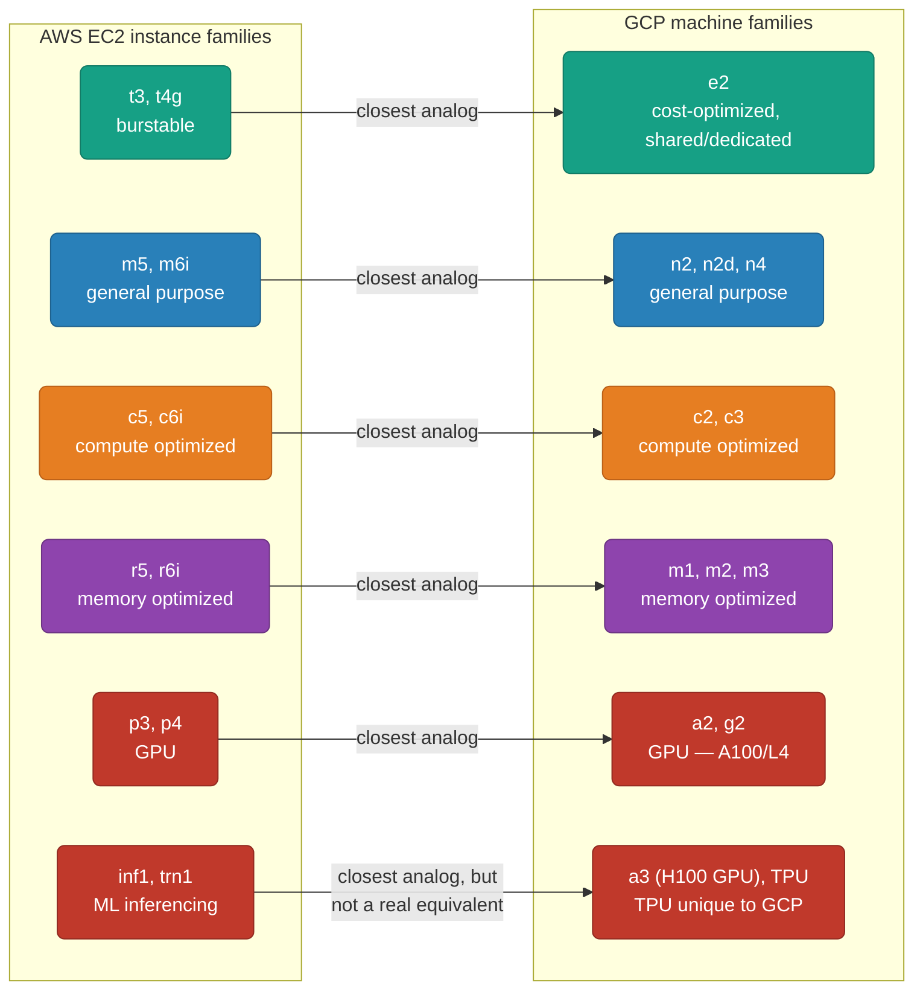
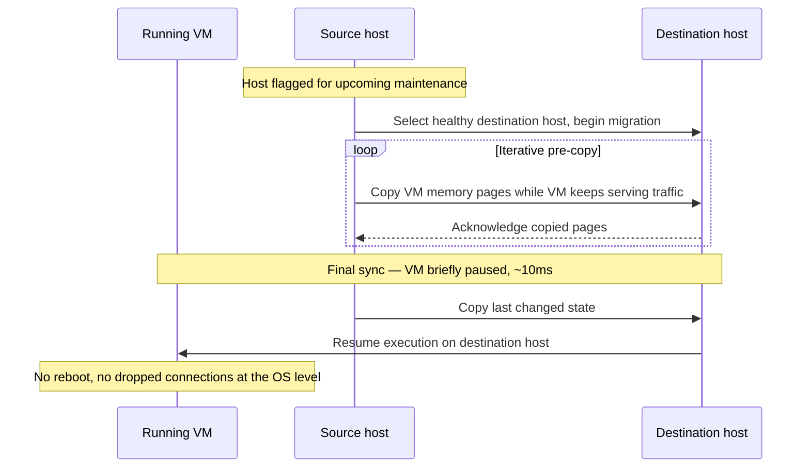
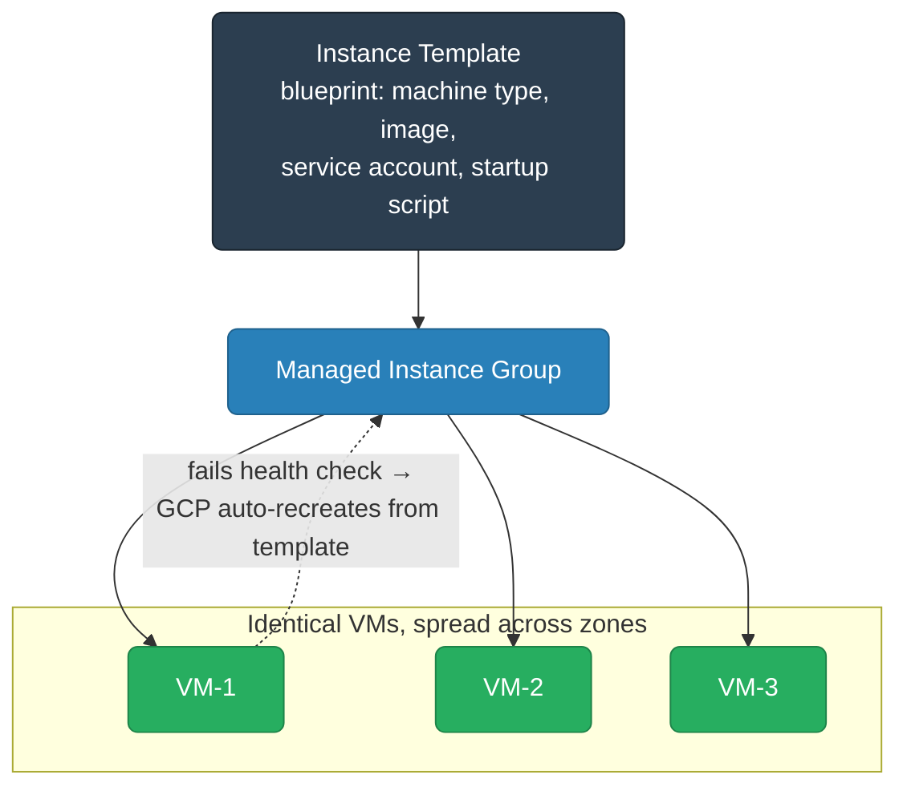
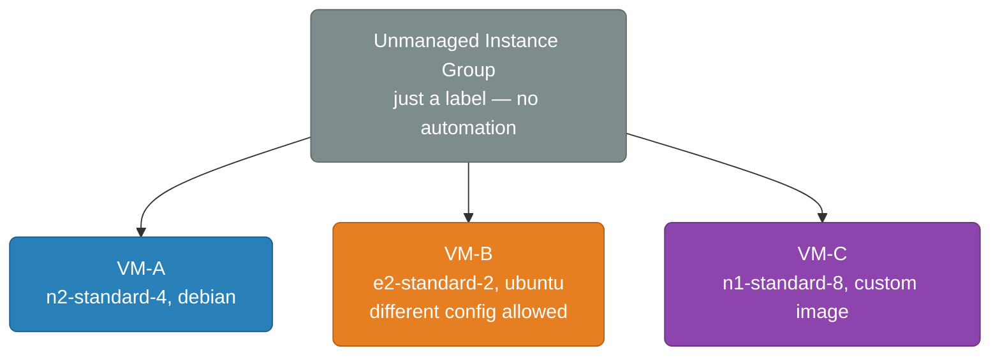
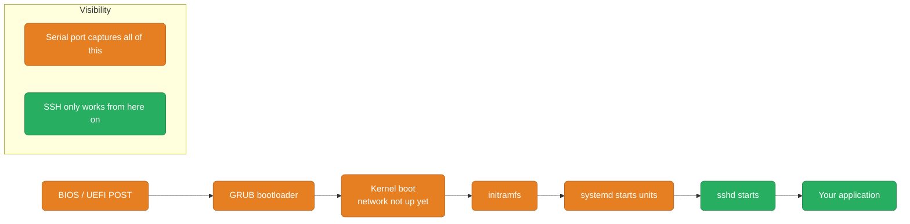
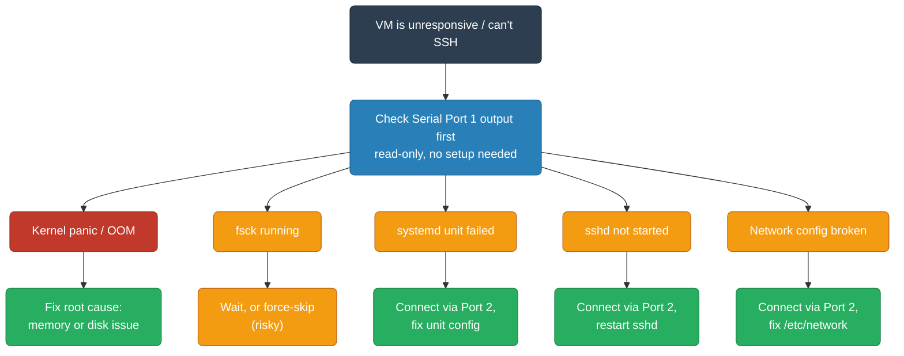

# GCP Compute Engine (GCE)

Compute Engine is GCP's VM service — equivalent to AWS EC2. Google's infrastructure advantage shows up here: live migration, custom machine types, and better sustained use economics.

<div class="quiz-progress" data-quiz-progress>
  <span class="quiz-progress-label">0/0 checks</span>
  <span class="quiz-progress-bar"><span class="quiz-progress-fill"></span></span>
</div>

---

## Machine Families Overview



### Machine Family Quick Guide

| Family | vCPU range | Best for | AWS analog |
|--------|-----------|----------|-----------|
| **e2** | 2–32 | Dev/test, low-traffic services | t3/t3a |
| **n2** | 2–128 | General purpose production | m5/m6i |
| **n2d** | 2–224 | Same as n2, AMD EPYC, cheaper | m6a |
| **c2** | 4–60 | CPU-bound: gaming, HPC, media | c5 |
| **c3** | 4–176 | Latest gen compute optimized | c6i |
| **m1** | 40–160 | High-memory: SAP, in-memory DB | r5 |
| **m3** | 4–128 | Memory optimized, newer gen | r6i |
| **a2** | 12–96 | A100 GPU workloads | p4 |
| **g2** | 4–96 | L4 GPU, inference | g5 |

<div class="quiz-card">
  <p class="quiz-q">Which row in the AWS→GCP machine family mapping has no real AWS equivalent, and what does that imply about picking a family purely by "closest AWS analog"?</p>
  <button class="quiz-reveal">Reveal answer</button>
  <div class="quiz-a" hidden>TPU — it's called out as unique to GCP, with inf1/trn1 only mapped to it as the nearest fit, not a real match. The AWS-analog column is a useful starting point for translating an existing AWS architecture, not a complete picture of what a family can do — some GCP capacity (TPU, and custom machine types more generally) simply doesn't have an AWS box to reason from.</div>
</div>

---

## Custom Machine Types — GCP's Killer Feature

AWS forces you into predefined sizes (4 vCPU → 16GB, or 8 vCPU → 32GB, etc.). GCP lets you specify exact vCPU and memory independently:

```bash
# AWS: you'd pick m5.xlarge (4 vCPU, 16 GB) even if you need 4 vCPU, 10 GB
# GCP: specify exactly what you need
gcloud compute instances create my-vm \
  --machine-type=custom-4-10240    # 4 vCPUs, 10240 MB (10 GB)

# Format: custom-{vCPUs}-{memoryMB}
# Constraints: memory must be between 0.9 GB and 6.5 GB per vCPU

# Extended memory (beyond 6.5 GB/vCPU)
gcloud compute instances create my-vm \
  --machine-type=custom-4-30720-ext    # 4 vCPUs, 30 GB (extended)
```

This often saves 20-40% cost compared to the next-size-up predefined instance on AWS.

<div class="quiz-card">
  <p class="quiz-q">You try to create <code>custom-2-1024</code> (2 vCPUs, 1 GB RAM). Does GCP allow it?</p>
  <button class="quiz-reveal">Reveal answer</button>
  <div class="quiz-a" hidden>No. Memory must fall between 0.9 GB and 6.5 GB per vCPU, so 2 vCPUs requires at least roughly 1.8 GB — 1 GB is below the floor. The <code>-ext</code> suffix only raises the ceiling for extended memory beyond 6.5 GB/vCPU; it doesn't relax the 0.9 GB/vCPU minimum on the low end.</div>
</div>

---

## Creating a VM

```bash
# Minimal VM
gcloud compute instances create my-vm \
  --zone=us-central1-a \
  --machine-type=n2-standard-2

# Production VM with all options
gcloud compute instances create prod-vm \
  --zone=us-central1-a \
  --machine-type=n2-standard-4 \
  --image-family=debian-12 \
  --image-project=debian-cloud \
  --boot-disk-size=50GB \
  --boot-disk-type=pd-ssd \
  --network=my-vpc \
  --subnet=us-subnet \
  --no-address \                     # no external IP (private VM)
  --service-account=my-app-sa@project.iam.gserviceaccount.com \
  --scopes=cloud-platform \          # allow SA to call any GCP API it has IAM for
  --tags=backend \                   # firewall rule selector
  --metadata=startup-script='#!/bin/bash
    apt-get update -y
    apt-get install -y nginx'
```

### Key Flags vs AWS

| AWS EC2 | GCP gcloud | Notes |
|---------|-----------|-------|
| `--image-id ami-xxx` | `--image-family=debian-12 --image-project=debian-cloud` | Use families, not specific image IDs |
| `--iam-instance-profile` | `--service-account=` | GCP SA = EC2 instance profile |
| `--security-group-ids` | `--tags=` or `--network=` | Tags select firewall rules |
| `--subnet-id` | `--subnet=` | Same concept |
| `--associate-public-ip-address` | (default is to assign external IP) | Use `--no-address` to suppress |
| `--user-data` | `--metadata=startup-script=` | Same concept |

---

## Disk Types

| Disk type | IOPS | Throughput | Use case | AWS analog |
|-----------|------|-----------|----------|-----------|
| `pd-standard` | Shared | Low | Dev/test, cold data | gp2 (old) |
| `pd-balanced` | 3,000 IOPS/TB | Medium | Most workloads, default | gp3 |
| `pd-ssd` | 30,000 IOPS | High | Databases, latency-sensitive | io1 |
| `pd-extreme` | 120,000 IOPS | Very high | High-perf databases | io2 Block Express |
| `hyperdisk-balanced` | Up to 160,000 IOPS | Configurable | Latest gen, best perf | io2 |
| `local-ssd` | Highest (physically attached NVMe) | Very high | Ephemeral scratch, cache, high-perf temp data | Instance store |

<div class="tab-group">
  <div class="tab-buttons">
    <button data-tab="pdstandard" class="active">pd-standard</button>
    <button data-tab="pdbalanced">pd-balanced</button>
    <button data-tab="pdssd">pd-ssd</button>
    <button data-tab="pdextreme">pd-extreme</button>
    <button data-tab="localssd">local-ssd</button>
  </div>
  <div class="tab-panels">
    <div class="tab-panel active" data-tab-panel="pdstandard">
      <strong>HDD-backed, cheapest, size-scaled IOPS.</strong> Performance scales with how much you provision (bigger disk = more IOPS, no independent tuning), and there's no burst headroom. Fine for boot disks, dev/test, and cold or infrequently-read data where latency doesn't matter — the wrong choice for anything transactional.
    </div>
    <div class="tab-panel" data-tab-panel="pdbalanced">
      <strong>SSD-backed, the sensible default.</strong> 3,000 IOPS per TB provisioned at a lower price point than pd-ssd. Good enough for most application workloads — web servers, general-purpose databases without extreme latency requirements — without paying for headroom you won't use.
    </div>
    <div class="tab-panel" data-tab-panel="pdssd">
      <strong>SSD-backed, higher and more consistent performance.</strong> Up to 30,000 IOPS, at a higher $/GB than pd-balanced. Reach for this when latency consistency actually matters — production OLTP databases, anything latency-sensitive enough that pd-balanced's ceiling is a real constraint.
    </div>
    <div class="tab-panel" data-tab-panel="pdextreme">
      <strong>Provisioned IOPS, decoupled from capacity.</strong> Up to 120,000 IOPS that you dial in independently of how much you provision, at the highest price of the persistent-disk family. For the small set of workloads (the most demanding databases) where pd-ssd's ceiling still isn't enough.
    </div>
    <div class="tab-panel" data-tab-panel="localssd">
      <strong>Physically attached NVMe — fastest option, but ephemeral.</strong> Local SSD lives on the same physical host as the VM, so it has the lowest latency and highest IOPS of anything in this table — and none of it is a Persistent Disk. Data is wiped if the VM stops, crashes, or is preempted, so it's for scratch space, cache tiers, or temp data the application can afford to lose, never the only copy of anything.
    </div>
  </div>
</div>

```bash
# Add a persistent disk to a running VM
gcloud compute disks create my-data-disk \
  --zone=us-central1-a \
  --size=200GB \
  --type=pd-ssd

gcloud compute instances attach-disk my-vm \
  --disk=my-data-disk \
  --zone=us-central1-a

# Resize a disk (can be done live, no reboot needed)
gcloud compute disks resize my-data-disk \
  --size=400GB \
  --zone=us-central1-a
# Then: sudo resize2fs /dev/sdb (inside VM)
```

**GCP advantage**: Persistent Disk can be attached to multiple VMs in read-only mode (for shared datasets). EBS multi-attach is limited and complex.

<div class="quiz-card">
  <p class="quiz-q">Can the same Persistent Disk be attached to more than one VM at once — and if so, under what constraint?</p>
  <button class="quiz-reveal">Reveal answer</button>
  <div class="quiz-a" hidden>Yes, but only read-only across all attached VMs — useful for sharing a dataset (reference data, static assets) across many instances without copying it. That's a real advantage over EBS, where multi-attach is limited and complex to set up.</div>
</div>

---

## Preemptible VMs and Spot VMs

Two types of discounted VMs:

| | Preemptible VM | Spot VM |
|--|---|---|
| **Max runtime** | 24 hours (hard limit) | No limit |
| **Preemption notice** | 30 seconds via ACPI shutdown | 30 seconds |
| **Discount** | 60–91% off | 60–91% off |
| **Availability** | Less predictable | More predictable than preemptible |
| **AWS analog** | Spot Instance (but 24hr cap is GCP-specific) | Spot Instance |
| **Use case** | Batch jobs, HPC, ML training | Same, but better for longer jobs |

```bash
# Spot VM (recommended over preemptible for new workloads)
gcloud compute instances create my-spot-vm \
  --zone=us-central1-a \
  --machine-type=n2-standard-4 \
  --provisioning-model=SPOT \
  --instance-termination-action=STOP   # STOP or DELETE on preemption

# Preemptible (legacy)
gcloud compute instances create my-preemptible-vm \
  --zone=us-central1-a \
  --machine-type=n2-standard-4 \
  --preemptible
```

### Handling Preemption

```bash
# Check if VM was preempted
gcloud compute instances describe my-vm \
  --zone=us-central1-a \
  --format='get(scheduling.preempted)'

# Use a startup script to resume work after preemption
--metadata=startup-script='#!/bin/bash
  # check if this is a restart after preemption
  PREEMPTED=$(curl -s "http://metadata.google.internal/computeMetadata/v1/instance/preempted" -H "Metadata-Flavor: Google")
  if [ "$PREEMPTED" = "true" ]; then
    # resume from checkpoint
    gsutil cp gs://my-bucket/checkpoint.pkl /tmp/checkpoint.pkl
  fi
  python3 /opt/train.py'
```

<div class="quiz-card">
  <p class="quiz-q">A batch job needs roughly 36 hours of uninterrupted-as-possible compute. Preemptible VM or Spot VM?</p>
  <button class="quiz-reveal">Reveal answer</button>
  <div class="quiz-a" hidden>Spot VM. Preemptible VMs carry a hard 24-hour runtime cap regardless of whether they ever get preempted, so a 36-hour job would be force-stopped even on a lucky run. Spot VMs have the same discount and the same 30-second preemption notice, but no artificial time limit — the checkpoint/resume pattern still matters for either, since both can be preempted at any time.</div>
</div>

---

## Instance Templates and Managed Instance Groups (MIGs)

AWS: Launch Template + Auto Scaling Group. GCP: Instance Template + Managed Instance Group.

```bash
# Instance Template = Launch Template
gcloud compute instance-templates create my-template \
  --machine-type=n2-standard-2 \
  --image-family=debian-12 \
  --image-project=debian-cloud \
  --tags=backend \
  --service-account=my-app-sa@project.iam.gserviceaccount.com \
  --metadata=startup-script='#!/bin/bash
    apt-get install -y my-app
    systemctl start my-app'

# Managed Instance Group = Auto Scaling Group
gcloud compute instance-groups managed create my-mig \
  --template=my-template \
  --size=3 \
  --region=us-central1

# Enable autoscaling (= ASG scaling policy)
gcloud compute instance-groups managed set-autoscaling my-mig \
  --region=us-central1 \
  --min-num-replicas=2 \
  --max-num-replicas=20 \
  --target-cpu-utilization=0.60 \
  --cool-down-period=90
```

### MIG Health Checks (= ASG Health Checks)

```bash
# Create health check
gcloud compute health-checks create http my-health-check \
  --port=8080 \
  --request-path=/health \
  --check-interval=10s \
  --timeout=5s \
  --healthy-threshold=2 \
  --unhealthy-threshold=3

# Attach to MIG
gcloud compute instance-groups managed update my-mig \
  --health-checks=my-health-check \
  --initial-delay=120s \
  --region=us-central1
```

---

## SSH and Connectivity

```bash
# SSH to a VM (gcloud handles key management — no .pem files needed)
gcloud compute ssh my-vm --zone=us-central1-a

# SSH to a private VM (no external IP) via OS Login + IAP tunnel
# IAP = Identity-Aware Proxy (GCP's Session Manager equivalent)
gcloud compute ssh my-vm \
  --zone=us-central1-a \
  --tunnel-through-iap

# Required firewall rule for IAP
gcloud compute firewall-rules create allow-iap-ssh \
  --network=my-vpc \
  --direction=INGRESS \
  --action=ALLOW \
  --source-ranges=35.235.240.0/20 \  # Google IAP IP range
  --rules=tcp:22
```

**GCP advantage**: IAP tunneling is like AWS Systems Manager Session Manager — SSH to private VMs without bastion hosts or public IPs. No .pem files, keys rotated per session.

<div class="quiz-card">
  <p class="quiz-q">You run <code>gcloud compute ssh --tunnel-through-iap</code> against a private VM and the connection times out. The VM has no other firewall rules for SSH. What's most likely missing?</p>
  <button class="quiz-reveal">Reveal answer</button>
  <div class="quiz-a" hidden>A firewall rule allowing ingress from <code>35.235.240.0/20</code> (Google's IAP source range) on tcp:22. IAP proxies the connection, but it still originates traffic from that specific range at the network layer — the destination VM's firewall has to explicitly allow it, the same as any other ingress rule.</div>
</div>

---

## Live Migration — GCP's Unique Advantage

AWS: when underlying hardware needs maintenance, your instance gets rebooted (scheduled maintenance event). GCP: VMs are **live migrated** — moved to another host transparently while running. You see a brief performance dip (~10ms) but no reboot, no downtime.

This is why GCP claims better VM availability SLAs. For stateful applications (databases running on GCE), this is significant.



<div class="stepper">
  <div class="stepper-panels">
    <div class="stepper-panel active">
      <strong>1. Maintenance detected.</strong> The host running your VM needs
      attention — a hardware repair, a security patch, a firmware upgrade.
      AWS would schedule a reboot for this; GCP instead schedules a live
      migration for every VM on that host.
    </div>
    <div class="stepper-panel">
      <strong>2. Destination host selected.</strong> GCP picks a healthy host
      with matching capacity and starts the migration in the background —
      your VM keeps running and serving traffic on the original host the
      entire time.
    </div>
    <div class="stepper-panel">
      <strong>3. Memory and state pre-copied.</strong> The VM's memory and CPU
      state are iteratively copied to the destination host while the source
      VM keeps executing normally — most of the migration happens with zero
      visible impact.
    </div>
    <div class="stepper-panel">
      <strong>4. Brief pause for final sync.</strong> Once the copy is nearly
      caught up, the VM is paused for a very short window to copy the last
      bit of changed state — this is the <code>~10ms</code> dip you can
      actually observe.
    </div>
    <div class="stepper-panel">
      <strong>5. Cutover.</strong> The VM resumes execution on the destination
      host. No reboot, no dropped connections at the OS level, no operator
      action required — the entire event is transparent to the application.
    </div>
  </div>
  <div class="stepper-controls">
    <button class="stepper-prev">← Prev</button>
    <span class="stepper-dots"></span>
    <span class="stepper-label"></span>
    <button class="stepper-next">Next →</button>
  </div>
</div>

<div class="quiz-card">
  <p class="quiz-q">During a live migration, does the VM reboot, and does the application notice anything at all?</p>
  <button class="quiz-reveal">Reveal answer</button>
  <div class="quiz-a" hidden>No reboot, no downtime — but there is a brief performance dip of around 10ms while the last bit of state is synced and the VM cuts over to the new host. For most applications that's invisible; for latency-sensitive, stateful workloads like databases running directly on GCE, it's still worth knowing it can happen.</div>
</div>

---

## Pricing Model

### Pricing Models

| Model | Discount | Commitment | Notes |
|-------|----------|------------|-------|
| On-demand | None (full price) | None | Baseline |
| Preemptible/Spot | 60–91% off | None | Can be preempted at any time |
| Committed use (1yr) | 37% off | 1 year upfront | Like Reserved Instances, but simpler |
| Committed use (3yr) | 55% off | 3 years upfront | |
| Sustained use | Automatic, up to ~25% off | None — usage-based | Triggers once a VM runs more than 25% of the billing month |

### Example — n2-standard-4 (us-central1)

| Pricing model | Cost |
|---------------|------|
| On-demand | $0.19/hr (~$140/mo) |
| Sustained use (auto) | ~$105/mo — auto ~25% off if running all month |
| 1yr committed use | ~$88/mo |
| 3yr committed use | ~$63/mo |
| Spot VM | ~$0.057/hr (~$42/mo) |

Sustained use discounts are **fully automatic** — just run a VM for most of the month and Google discounts it. AWS requires you to purchase Reserved Instances upfront.

<div class="quiz-card">
  <p class="quiz-q">Do you need to purchase or commit to anything upfront to get the sustained use discount, the way you would for an AWS Reserved Instance?</p>
  <button class="quiz-reveal">Reveal answer</button>
  <div class="quiz-a" hidden>No. Sustained use discounts are fully automatic — running a VM for more than 25% of the billing month triggers the discount with no purchase step at all. Committed use discounts (the RI-equivalent, at 37%/55% off for 1yr/3yr) do require an upfront commitment; sustained use does not.</div>
</div>

---

## GCE vs EC2 — Summary

| Feature | GCP GCE | AWS EC2 |
|---------|---------|---------|
| Custom machine types | Yes — any CPU/mem combo | No — fixed sizes |
| Live migration | Yes — no reboot on host maintenance | No — instance restart |
| Sustained use discount | Automatic | Requires RI purchase |
| SSH key management | gcloud handles it / IAP tunnel | .pem files / SSM |
| Boot disk resize | Online (no reboot) | Offline (stop/start) |
| Spot/Preemptible notice | 30 seconds ACPI | 2 minutes (Spot) |
| GPU types | A100, H100, L4, T4 | V100, A100, H100, Inf |
| TPU access | Yes (unique to GCP) | No |
| Free control plane | GKE: one free zonal cluster/account, then $73/mo | EKS: $73/mo per cluster |

---

## Instance Groups

Instance groups let you manage multiple VMs as a single unit and attach them to load balancers. Two types: **Managed** (GCP controls the VMs) and **Unmanaged** (you control the VMs, GCP just groups them).

### Managed Instance Group (MIG)

A MIG creates **identical VMs from an instance template** and manages them automatically — auto-healing, auto-scaling, rolling updates, and multi-zone distribution.



**AWS analog:** Auto Scaling Group + Launch Template.

```bash
# 1. Create instance template
gcloud compute instance-templates create my-template \
  --machine-type=n2-standard-2 \
  --image-family=debian-12 \
  --image-project=debian-cloud \
  --tags=backend \
  --service-account=my-app-sa@project.iam.gserviceaccount.com \
  --metadata=startup-script='#!/bin/bash
    apt-get install -y my-app
    systemctl start my-app'

# 2. Regional MIG (spreads VMs across zones automatically — recommended)
gcloud compute instance-groups managed create my-mig \
  --template=my-template \
  --size=3 \
  --region=us-central1     # distributes across us-central1-a/b/c

# Zonal MIG (single zone, simpler but no zone-level HA)
gcloud compute instance-groups managed create my-mig-zonal \
  --template=my-template \
  --size=3 \
  --zone=us-central1-a
```

#### Auto-healing

```bash
# Create health check
gcloud compute health-checks create http my-hc \
  --port=8080 \
  --request-path=/health \
  --check-interval=10s \
  --unhealthy-threshold=3    # 3 consecutive failures → VM is recreated

# Attach health check to MIG
gcloud compute instance-groups managed update my-mig \
  --health-checks=my-hc \
  --initial-delay=120s \     # grace period after boot before checks count
  --region=us-central1
```

#### Auto-scaling

```bash
# Scale on CPU
gcloud compute instance-groups managed set-autoscaling my-mig \
  --region=us-central1 \
  --min-num-replicas=2 \
  --max-num-replicas=20 \
  --target-cpu-utilization=0.60 \
  --cool-down-period=90s

# Scale on HTTP load (requests/sec per instance)
gcloud compute instance-groups managed set-autoscaling my-mig \
  --region=us-central1 \
  --max-num-replicas=20 \
  --target-load-balancing-utilization=0.8

# Scale on Pub/Sub queue depth (custom metric)
gcloud compute instance-groups managed set-autoscaling my-mig \
  --region=us-central1 \
  --max-num-replicas=50 \
  --custom-metric-utilization=metric=pubsub.googleapis.com/subscription/num_undelivered_messages,utilization-target=100,utilization-target-type=GAUGE
```

<div class="quiz-card">
  <p class="quiz-q">A MIG has both a health check (auto-healing) and an autoscaling policy attached. One VM starts failing its health check. Does the MIG scale up, recreate that VM, or both?</p>
  <button class="quiz-reveal">Reveal answer</button>
  <div class="quiz-a" hidden>Auto-healing recreates just that one VM — after unhealthy-threshold consecutive failures, GCP tears it down and boots a fresh one from the instance template. Autoscaling is a separate mechanism driven by load metrics (CPU, load-balancing utilization, custom metrics) and only changes the size of the group; a single unhealthy VM doesn't by itself trigger a scale-up.</div>
</div>

#### Rolling Updates

```bash
# Zero-downtime rolling update to new template version
gcloud compute instance-groups managed rolling-action start-update my-mig \
  --version=template=my-template-v2 \
  --region=us-central1 \
  --max-surge=3 \            # create 3 extra VMs during rollout (no capacity drop)
  --max-unavailable=0        # never remove a VM before its replacement is healthy

# Canary: 10% of VMs on new version first
gcloud compute instance-groups managed rolling-action start-update my-mig \
  --version=template=my-template-v1 \
  --canary-version=template=my-template-v2,target-size=10% \
  --region=us-central1

# Rollback instantly
gcloud compute instance-groups managed rolling-action start-update my-mig \
  --version=template=my-template-v1 \
  --region=us-central1
```

<div class="stepper">
  <div class="stepper-panels">
    <div class="stepper-panel active">
      <strong>1. Stable.</strong> The MIG runs N healthy VMs, all built from
      instance template v1, serving traffic normally.
    </div>
    <div class="stepper-panel">
      <strong>2. Surge.</strong> New VMs are created from template v2, up to
      <code>--max-surge</code> extra instances — so total group capacity never
      drops below its starting size during the rollout.
    </div>
    <div class="stepper-panel">
      <strong>3. Health-check the new VMs.</strong> Each new v2 VM has to pass
      the MIG's attached health check before it's considered ready to take
      traffic — the same auto-healing mechanism, applied during a rollout.
    </div>
    <div class="stepper-panel">
      <strong>4. Retire an old VM.</strong> Once a new VM is confirmed
      healthy, GCP removes one old v1 VM — respecting
      <code>--max-unavailable</code> (0 means a v1 VM is never removed before
      its v2 replacement is healthy).
    </div>
    <div class="stepper-panel">
      <strong>5. Repeat until done.</strong> Steps 2–4 repeat until every VM
      in the group is on template v2. A canary run does the same thing but
      stops after only <code>target-size</code>% of VMs are updated, so you
      can validate the new version before continuing the rollout.
    </div>
    <div class="stepper-panel">
      <strong>6. Rollback if needed.</strong> Starting another rolling update
      pointed back at template v1 undoes the change the exact same way,
      instance by instance — there's no separate "rollback" primitive.
    </div>
  </div>
  <div class="stepper-controls">
    <button class="stepper-prev">← Prev</button>
    <span class="stepper-dots"></span>
    <span class="stepper-label"></span>
    <button class="stepper-next">Next →</button>
  </div>
</div>

<div class="quiz-card">
  <p class="quiz-q">Which flag combination guarantees the MIG's serving capacity never drops during a rolling update: <code>--max-surge=3 --max-unavailable=0</code>, or <code>--max-surge=0 --max-unavailable=1</code>?</p>
  <button class="quiz-reveal">Reveal answer</button>
  <div class="quiz-a" hidden><code>--max-surge=3 --max-unavailable=0</code>. It creates extra VMs on the new template before removing any old ones, so total capacity never dips below the starting size. <code>--max-surge=0 --max-unavailable=1</code> does the opposite — it removes an old VM before its replacement exists, so capacity temporarily drops by one VM at each step of the rollout.</div>
</div>

#### Stateful MIG (for databases and stateful apps)

By default, when a VM in a MIG is recreated, its disk is wiped. Stateful MIG preserves per-VM state:

```bash
gcloud compute instance-groups managed update my-stateful-mig \
  --stateful-disk=device-name=data-disk,auto-delete=never \
  --stateful-external-ip=interface-name=nic0,auto-delete=never \
  --region=us-central1
# Each VM keeps its disk and IP across restarts/updates
```

<div class="quiz-card">
  <p class="quiz-q">By default, what happens to a MIG VM's disk when auto-healing recreates it after a failed health check?</p>
  <button class="quiz-reveal">Reveal answer</button>
  <div class="quiz-a" hidden>It's wiped — a default MIG VM is meant to be identical and disposable, rebuilt fresh from the instance template every time. Configuring the MIG as stateful (<code>--stateful-disk=...,auto-delete=never</code>) is what changes this: it preserves that specific VM's disk (and optionally its IP) across recreation, which is required for databases or anything else that can't lose local state.</div>
</div>

---

### Unmanaged Instance Group (UIG)

A UIG is just a **label/grouping** for existing VMs. GCP does nothing automatically — no auto-healing, no auto-scaling, no rolling updates. You manually add and remove VMs. VMs in a UIG can have different machine types, images, and configs.



**The only real use case:** attaching a set of heterogeneous or pre-existing VMs to a load balancer. Load balancers require a backend to be an instance group or NEG — if your VMs already exist and aren't identical, UIG is how you group them.

```bash
# Create UIG
gcloud compute instance-groups unmanaged create my-uig \
  --zone=us-central1-a

# Add existing VMs
gcloud compute instance-groups unmanaged add-instances my-uig \
  --instances=vm-a,vm-b,vm-c \
  --zone=us-central1-a

# Define named ports (required for load balancer backend)
gcloud compute instance-groups unmanaged set-named-ports my-uig \
  --named-ports=http:8080 \
  --zone=us-central1-a

# Remove a VM
gcloud compute instance-groups unmanaged remove-instances my-uig \
  --instances=vm-a \
  --zone=us-central1-a
```

---

### MIG vs UIG — When to Use Which

| | Managed (MIG) | Unmanaged (UIG) |
|--|---|---|
| **Auto-healing** | Yes — recreates failed VMs | No |
| **Auto-scaling** | Yes | No |
| **Rolling updates** | Yes | No |
| **VM uniformity** | Required (all from same template) | Not required |
| **Multi-zone HA** | Yes (regional MIG) | No (single zone only) |
| **Load balancer backend** | Yes | Yes |
| **AWS analog** | Auto Scaling Group | No direct equivalent |
| **Use when** | All production workloads | Legacy/heterogeneous VMs |

**Rule of thumb:** always use MIG. UIG is a legacy escape hatch for VMs you can't recreate from a template.

<div class="quiz-card">
  <p class="quiz-q">When is a UIG actually the right choice over a MIG?</p>
  <button class="quiz-reveal">Reveal answer</button>
  <div class="quiz-a" hidden>Only when you already have a set of heterogeneous or pre-existing VMs — different machine types, images, or configs — that need to sit behind a load balancer as a single backend, and you can't or don't want to rebuild them from a common instance template. For anything that can be templated, always use a MIG instead, for the auto-healing, auto-scaling, and rolling updates a UIG will never give you.</div>
</div>

---

## Logging and Serial Ports

Two separate but related debugging features available on every GCE instance.

### Logging Tab

The Logging tab on a VM instance page shows **Cloud Logging entries scoped to that VM** — a filtered view of:
- OS-level logs (syslog, kernel messages) — collected by the **Ops Agent**
- Startup script output
- Application logs (if Ops Agent is configured to tail them)

It's identical to querying Cloud Logging with:
```
resource.type="gce_instance"
resource.labels.instance_id="1234567890"
```

Useful for quick instance-specific log review without opening the full Logging console.

---

### Serial Ports — The Emergency Console

A serial port (COM port) is a **low-level hardware communication channel** that exists independently of the OS and network stack. Unlike SSH (which requires the OS, network, and sshd to be running), serial ports work:
- During BIOS/UEFI POST
- During kernel boot (before network is up)
- During kernel panics and OS crashes
- When the VM is completely unresponsive



Think of it as plugging a physical monitor into a server in a datacenter — the only way to see what's happening when nothing else works.

<div class="quiz-card">
  <p class="quiz-q">Why can serial port access help debug a VM even before the network stack or sshd is up — something SSH can never do?</p>
  <button class="quiz-reveal">Reveal answer</button>
  <div class="quiz-a" hidden>Because a serial port is a low-level hardware channel independent of the OS and network stack — it works during BIOS/UEFI POST, during kernel boot before the network is up, during kernel panics, and even when the VM is completely unresponsive. SSH depends on the OS being alive, the network being up, and sshd having started — the very last thing in the boot sequence — so it simply isn't available for anything that happens before that point.</div>
</div>

---

### Serial Port 1 (COM1) — Primary Boot Console

**The most important serial port.** This is read-only output from the VM and captures:
- GRUB bootloader messages
- Linux kernel boot messages (`dmesg` equivalent)
- `systemd` unit startup sequence
- OOM killer events (`Out of memory: Kill process...`)
- Kernel panics (with full stack trace)
- `cloud-init` and startup script output (on Debian/Ubuntu images)
- `fsck` filesystem checks blocking boot

```bash
# View serial port 1 output
gcloud compute instances get-serial-port-output my-vm \
  --zone=us-central1-a \
  --port=1

# Follow output (keep polling for new lines)
gcloud compute instances get-serial-port-output my-vm \
  --zone=us-central1-a \
  --port=1 \
  --start=0
```

Example output you'd see on port 1:
```
[    0.000000] Linux version 5.15.0-1030-gcp (x86_64)
[    0.000000] BIOS-provided physical RAM map
[    1.234567] EXT4-fs (sda1): mounted filesystem with ordered data mode
[    5.678901] systemd[1]: Starting OpenSSH Server Daemon...
[    6.123456] systemd[1]: Started OpenSSH Server Daemon.
              ← SSH now works, port 1 has everything before this
```

**Common debugging scenarios with port 1:**

| Symptom | What port 1 shows |
|---------|------------------|
| VM won't SSH | `sshd` failed to start, see systemd error |
| VM stuck booting | `fsck` running, or kernel module load failure |
| VM keeps restarting | OOM kill (`Out of memory: Kill process`) |
| Startup script not running | `cloud-init` errors, or script syntax error |
| Kernel panic | Full stack trace for root cause |

---

### Serial Port 2 (COM2) — Interactive Console

Port 2 is **interactive** — you can connect to it and get a login shell. This is your last-resort access method when SSH is completely broken.

```bash
# Step 1: enable interactive serial port access (disabled by default)
gcloud compute instances add-metadata my-vm \
  --metadata=serial-port-enable=TRUE \
  --zone=us-central1-a

# Step 2: connect
gcloud compute connect-to-serial-port my-vm \
  --zone=us-central1-a \
  --port=2
# You'll get a login prompt — enter OS username + password
# Press Enter a few times if you don't see the prompt
# Exit with: ~.  (tilde + dot)
```

You can also connect from the GCP Console: VM details → **Remote Access → Connect to serial console**.

**Use port 2 when:**
- `sshd` crashed or was misconfigured (`/etc/ssh/sshd_config` broken)
- SSH keys were accidentally wiped
- Network config is broken (can't reach the VM at all)
- Need to reset a password or fix `/etc/fstab`
- VM is up but SSH returns `Connection refused` or `Permission denied`

---

### Serial Ports 3 and 4 (COM3, COM4)

Available for custom use — rarely needed. Some specialized software uses these for debug output channels. Available via the same `gcloud compute connect-to-serial-port` command with `--port=3` or `--port=4`.

---

### Serial Port Summary

| Port | Type | What it's for |
|------|------|---------------|
| **Port 1** | Read-only output | Kernel boot, dmesg, systemd, OOM, kernel panic — **use this first when debugging** |
| **Port 2** | Interactive shell | Emergency login when SSH is broken |
| **Port 3** | Interactive | Custom application debug output |
| **Port 4** | Interactive | Custom use, rarely needed |

<div class="quiz-card">
  <p class="quiz-q">A VM keeps kernel-panicking during boot. Which serial port do you check first to see why, and which one would you use to actually connect and fix it?</p>
  <button class="quiz-reveal">Reveal answer</button>
  <div class="quiz-a" hidden>Port 1 first — it's read-only output that includes the full kernel panic stack trace, along with everything else in the boot sequence up to that point. Port 2 is where you'd actually get a login shell to fix the root cause, but it's disabled by default and has to be enabled via the <code>serial-port-enable</code> metadata key before you can connect to it.</div>
</div>

---

### Stream Serial Port Output to Cloud Logging

For production VMs, enable automatic streaming of serial port 1 output to Cloud Logging. This lets you set alerts on kernel panics or OOM events:

```bash
# Enable for a single VM
gcloud compute instances add-metadata my-vm \
  --metadata=serial-port-logging-enable=true \
  --zone=us-central1-a

# Enable project-wide (all VMs)
gcloud compute project-info add-metadata \
  --metadata=serial-port-logging-enable=true
```

Serial port output then appears in Cloud Logging:
```
resource.type = "gce_instance"
logName = "projects/PROJECT/logs/serialconsole.googleapis.com%2Fserial_port_1_output"
```

Set a log-based alert for production incidents:
```bash
# Alert on kernel panic
gcloud logging metrics create kernel-panic \
  --description="Kernel panic detected on GCE instance" \
  --log-filter='resource.type="gce_instance"
    logName="projects/PROJECT/logs/serialconsole.googleapis.com%2Fserial_port_1_output"
    textPayload:"Kernel panic"'
```

---

### SSH vs Serial Port — Decision Tree


