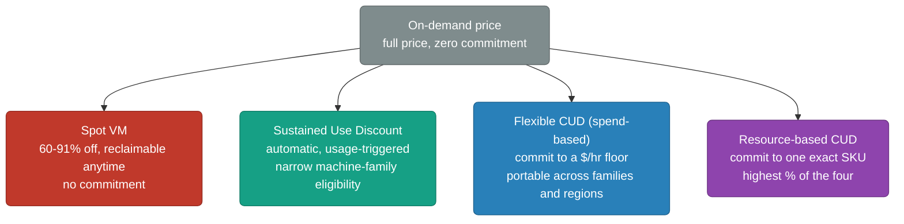

# GCP Cost Optimization

Cost governance on GCP isn't "watch the billing dashboard and complain when it spikes." It's a discipline with its own primitives — discount programs with real percentages attached, an automated recommendation engine that finds waste without a human doing a quarterly review, a per-service pricing model that has to be chosen deliberately (not defaulted into), and a hidden network-cost surface that catches teams who assume "internal traffic is free." This file is the synthesizing layer across that discipline. It cross-references [`compute.md`](./compute.md) and [`bigquery.md`](./bigquery.md) for the per-service pricing facts those files already cover in passing, rather than re-deriving them here.

<div class="quiz-progress" data-quiz-progress>
  <span class="quiz-progress-label">0/0 checks</span>
  <span class="quiz-progress-bar"><span class="quiz-progress-fill"></span></span>
</div>

---

## 1. The Discount Landscape at a Glance

Every discount program on GCP branches off the same on-demand baseline, and each branch trades away a different thing — commitment, flexibility, or availability — for a percentage off:



| Program | Discount | Commitment | Scope |
|---|---|---|---|
| Spot VM | 60–91% off | None — reclaimable with 30s notice | Any interruptible workload |
| Sustained Use Discount (SUD) | Up to 20–30%, tiered by monthly usage | None — automatic | Only N1, N2, N2D, C2, M1, M2, sole-tenant nodes, f1-micro/g1-small, and GPUs on N1 |
| Flexible CUD (spend-based) | 28% (1yr) / 46% (3yr) | 1 or 3yr, $/hr floor | Portable across eligible machine families, regions, and now GKE Autopilot / Cloud Run |
| Resource-based CUD | 37% (1yr) / 55% (3yr) | 1 or 3yr, one machine type + region | Highest discount, zero portability |

`compute.md`'s own pricing table already walks the `n2-standard-4` numbers (on-demand, SUD, 1yr/3yr CUD, Spot) at the single-VM level — this table is that same landscape zoomed out to "which program applies to which fleet."

<div class="quiz-card">
  <p class="quiz-q">A team runs a mixed fleet: some E2 VMs, some N2 VMs, all running 24/7 with no commitment purchased. Do the E2 VMs get the same automatic discount as the N2 VMs once the month is more than 25% elapsed?</p>
  <button class="quiz-reveal">Reveal answer</button>
  <div class="quiz-a" hidden>No. Sustained Use Discounts only apply to N1, N2, N2D, C2, M1, M2, sole-tenant nodes, f1-micro/g1-small, and GPUs attached to N1 — E2 is not, and never has been, on that list. The E2 VMs keep paying their (lower baked-in) on-demand price all month with zero automatic discount; only the N2 VMs ramp up toward their tiered SUD ceiling. Getting any further discount on the E2 fleet requires an actual commitment — a resource-based or flexible CUD.</div>
</div>

---

## 2. Committed Use Discounts vs Sustained Use Discounts

**Resource-based CUD** locks in a specific machine type (or GPU/local SSD/sole-tenant SKU) in a specific region for 1 or 3 years, paid or billed monthly, in exchange for the largest discount available: 37% at 1 year, 55% at 3 years. The trade is real — if that workload moves regions, shrinks, or migrates to a newer machine family, the commitment doesn't follow it.

**Flexible CUD (spend-based)** commits to a minimum hourly spend across a basket of eligible resources instead of one exact SKU. The discount floats onto whatever eligible usage you actually run that hour — swap N2 for N4, move regions, resize — and it now extends beyond raw Compute Engine VMs to GKE Autopilot and Cloud Run. The cost of that portability is a lower rate: 28% at 1 year, 46% at 3 years, roughly 9 points below resource-based CUD at each term.

**Sustained Use Discounts are automatic and require zero commitment** — but the current reality is narrower than the "just run a VM and Google discounts it" framing from GCE's early years still implies. As of today:

- **N1** (plus M1, M2, f1-micro, g1-small, and GPUs attached to N1) get the full legacy curve: 0% below 25% monthly usage, ramping to a **30%** ceiling above 75% usage.
- **N2, N2D, and C2** are SUD-eligible too, but at a lower ceiling — **20%** max, not 30%, reached the same way (tiered by percentage of the billing month used).
- **E2, C3, C4, C4A, N4, N4D, Tau T2D/T2A, and every A2/A3/G2 GPU family — every machine family launched after N1's generation — get no Sustained Use Discount at all.** Google's stated trade for these newer families is a lower baked-in on-demand price up front, with CUDs (resource-based or flexible) as the *only* lever left for going further.

> `compute.md`'s pricing example quotes `n2-standard-4` sustained use savings as "~25% off." Treat that as a directional legacy-era figure, not the current published curve — N2's actual SUD ceiling tops out at 20%, and any machine family newer than N2/N2D/C2 gets none automatically. Confirm current eligibility for the specific family before assuming "run it all month" alone buys a discount.

<div class="toggle-switch">
  <div class="toggle-buttons">
    <button data-toggle-opt="sud" class="active state-warn">Sustained Use</button>
    <button data-toggle-opt="cudres" class="state-ok">Resource-based CUD</button>
    <button data-toggle-opt="cudflex">Flexible CUD</button>
  </div>
  <div class="toggle-panel active" data-toggle-panel="sud">
    <strong>Pick this when:</strong> you're already on an SUD-eligible family (N1/N2/N2D/C2/M1/M2) and can't or won't commit to anything upfront — dev/test fleets, unpredictable early-stage workloads. It costs nothing to get, but it's capped at 20–30% and simply doesn't exist for E2, C3, C4, N4, Tau, or any GPU-accelerated family.
  </div>
  <div class="toggle-panel" data-toggle-panel="cudres">
    <strong>Pick this when:</strong> a workload's machine type and region are genuinely stable for a year or more — a steady-state production database tier, a fixed-size backend fleet. Highest discount of the four programs (37%/55%), but the commitment doesn't move with the workload if it's resized or migrated.
  </div>
  <div class="toggle-panel" data-toggle-panel="cudflex">
    <strong>Pick this when:</strong> spend is predictable in aggregate but the mix underneath shifts — multi-team platforms, workloads mid-migration between machine families, or fleets that span GKE Autopilot and Cloud Run alongside VMs. Lower discount than resource-based (28%/46%), traded for portability across family, region, and service.
  </div>
</div>

<div class="quiz-card">
  <p class="quiz-q">A workload runs on a current-generation C3 fleet, steady 24/7, no commitment purchased. A year from now it'll almost certainly still be C3, in the same region. Is there a discount lever left on the table right now?</p>
  <button class="quiz-reveal">Reveal answer</button>
  <div class="quiz-a" hidden>Yes — a resource-based CUD. C3 gets no Sustained Use Discount at all (it's outside the N1/N2/N2D/C2/M1/M2 eligibility list), so "just let it run" is leaving the full 37–55% on the table. Since the machine type and region are genuinely expected to stay fixed for a year-plus, resource-based CUD is the higher-discount choice here over flexible CUD's 28–46%.</div>
</div>

---

## 3. Rightsizing via Recommender / Active Assist

The practical mechanism for catching an oversized VM, an idle IP, or an orphaned disk is **not** a scheduled quarterly spreadsheet review — it's **Active Assist**, GCP's family of automated recommenders that continuously watches real usage signals and surfaces (or, for a subset, auto-applies) fixes. The cost-relevant recommenders architects should design monitoring/automation around:

- **VM machine type recommender** — flags a VM that's persistently over- or under-utilized on CPU/memory and suggests a specific smaller (or larger) machine type, sized off actual trailing usage rather than a guess.
- **Idle VM recommender** — flags a VM with near-zero utilization over the observation window, a classic "someone spun this up for a demo and forgot" cost leak.
- **Idle IP address recommender** — flags a reserved static external IP that isn't attached to a running resource; unlike an ephemeral IP, a reserved one **bills whether or not anything is using it**.
- **Idle persistent disk recommender** — flags a disk that's unattached (or attached but unread) — the leftover from a deleted VM whose disk didn't get deleted with it.
- **Commitment recommender** — analyzes trailing 30/60-day usage and recommends the specific resource-based or flexible CUD purchase that would have minimized spend, closing the loop back to Section 2.

<div class="stepper">
  <div class="stepper-panels">
    <div class="stepper-panel active">
      <strong>1. Signal collection.</strong> Active Assist continuously ingests
      utilization telemetry (CPU, disk attachment state, IP association,
      billing usage) across every project it has visibility into — no agent
      install, no manual export.
    </div>
    <div class="stepper-panel">
      <strong>2. Analysis against a trailing window.</strong> Each recommender
      runs its own heuristic/ML model over a rolling observation period
      (commonly 8–60 days depending on the recommender) rather than reacting
      to a single spike or a single idle hour.
    </div>
    <div class="stepper-panel">
      <strong>3. Recommendation surfaced with an estimated impact.</strong>
      The finding lands in the Recommendation Hub in Console, and identically
      via the <code>Recommender API</code> — each one carries an estimated
      dollar impact and a confidence level, not just "this looks wrong."
    </div>
    <div class="stepper-panel">
      <strong>4. Review and apply.</strong> Most recommendations require an
      explicit apply — a click in Console, or a programmatic call against the
      Recommender API from a scheduled job. A narrow subset (some idle-resource
      cleanups) support policy-gated auto-apply for teams that trust the signal.
    </div>
    <div class="stepper-panel">
      <strong>5. Continuous re-evaluation.</strong> Nothing here is a one-time
      scan — the same signals keep flowing, so a VM that gets rightsized today
      and then grows into its new size next quarter generates a fresh
      recommendation instead of going stale.
    </div>
  </div>
  <div class="stepper-controls">
    <button class="stepper-prev">← Prev</button>
    <span class="stepper-dots"></span>
    <span class="stepper-label"></span>
    <button class="stepper-next">Next →</button>
  </div>
</div>

The architectural implication: don't design a cost process around a human periodically opening the Console and looking for waste. Design around the **Recommender API** — pipe VM rightsizing, idle-IP, and idle-disk recommendations into whatever ticketing/automation system already handles ops toil, the same way you'd pipe an alert.

<div class="quiz-card">
  <p class="quiz-q">A reserved static external IP address was attached to a VM that got deleted six months ago. Is anyone being billed for it right now, and which recommender would have caught it?</p>
  <button class="quiz-reveal">Reveal answer</button>
  <div class="quiz-a" hidden>Yes — a reserved (static) external IP bills continuously whether or not it's attached to anything, unlike an ephemeral IP which is released for free when its VM goes away. The idle IP address recommender exists specifically to flag this pattern: a reserved IP with no attached resource, sitting on the bill silently until someone (or something) acts on the recommendation.</div>
</div>

---

## 4. BigQuery Pricing Model as Its Own Decision

`bigquery.md` covers slots, execution stages, and the Editions billing switch from the old flat-rate model in detail — the internals aren't repeated here. What belongs in a cost-governance file is the decision itself: **on-demand vs Editions is a real architectural choice, not a default**, and it should be made on two axes — how predictable query volume is, and whether the org needs a hard ceiling on BigQuery spend.

| Signal | Choose | Why |
|---|---|---|
| Sporadic, spiky, or genuinely unknown query volume | **On-demand** ($5/TB scanned, first 1 TB/mo free) | No commitment to size against; light usage costs almost nothing |
| Consistent, high-volume querying across multiple teams | **Editions** (Standard/Enterprise/Enterprise Plus, slot-hour billed) | Amortized cost per query is lower than $5/TB at real scale |
| Need a hard monthly cost ceiling — no single bad query should be able to blow the budget | **Editions with a fixed slot reservation** | On-demand has no per-query dollar cap; a runaway unpartitioned scan bills for every byte touched. A slot reservation caps *compute*, not bytes — a heavy query queues or slows down instead of generating an open-ended bill |
| Need to isolate/guarantee capacity per team or project | **Editions + reservations/assignments** | Reservations let you carve committed slots out to specific projects/folders so one team's heavy workload can't starve another's |
| Light, occasional BQML training runs | **On-demand**, unless slots are already reserved for other work | BQML billing rides the same query-cost path — no separate ML line item |

The "cost ceiling" property is worth being precise about: an Editions slot commitment doesn't cap the dollar cost of any individual query the way a budget alert caps total spend — it caps the *compute capacity* available, which converts a runaway query from "an open-ended bill" into "a slow or queued query." That's the actual mechanism, and it's exactly what on-demand's $5/TB model can't offer — every scanned byte bills, no matter how it happened.

<div class="quiz-card">
  <p class="quiz-q">A junior analyst accidentally runs <code>SELECT *</code> with no <code>WHERE</code> clause against a 50TB unpartitioned table. On on-demand pricing, and separately on a fixed Editions slot reservation, what actually happens?</p>
  <button class="quiz-reveal">Reveal answer</button>
  <div class="quiz-a" hidden>On-demand: the query bills for the full ~50TB scanned at $5/TB — roughly $250 for one mistake, with no ceiling stopping it. On a fixed Editions slot reservation: the query competes for the same fixed pool of slots as everything else, so it runs slower (or queues behind other work) instead of generating an open-ended charge — the "damage" shows up as degraded performance for that reservation, not a surprise line item on the bill. That's the concrete version of "Editions caps compute, not bytes."</div>
</div>

---

## 5. FinOps Practice Toolchain

Discount programs and Recommender fixes only work if spend is visible and attributable in the first place. The practical FinOps stack on GCP is four pieces, and they compound — each one makes the next more useful:

**Labels — the attribution key.** Key:value pairs (`team:payments`, `env:prod`, `cost-center:platform-eng`) attached to projects, VMs, disks, and most other resources. Labels are the join key everything downstream depends on: without them, a billing export is just a pile of undifferentiated cost. Enforce them at creation time (org policy / Terraform validation), not after the fact — retrofitting labels onto years of existing resources is the expensive way to learn this.

**Billing export to BigQuery — the data source.** GCP exports detailed billing data (standard usage cost, pricing, and a newer FOCUS-aligned cost detail export) straight into a BigQuery dataset, on the same per-project or org-level basis you configure. This is what turns "check the Billing console" into "run a query" — and it's the direct input to any chargeback/showback dashboard (Looker Studio or otherwise), grouped by exactly the labels above.

**Budgets and budget alerts — the proactive guardrail.** A Cloud Billing budget sets a monthly (or custom period) spend target, scoped to a project, a set of projects, or specific labels, with threshold alerts (e.g., 50%/90%/100% of budget) sent to email or a Pub/Sub topic. The Pub/Sub path is the one worth building on: a budget alert by itself only notifies — turning it into an actual spend cap (disabling billing on a sandbox project, throttling a runaway job) requires wiring that Pub/Sub message to a Cloud Function or Cloud Run job that takes the action.

**Cloud Asset Inventory — the governance layer.** A near-real-time, queryable inventory of every resource across an entire organization, plus historical snapshots. Where labels and billing export answer "what did we spend, broken down by whom," Asset Inventory answers "what actually exists, everywhere, right now" — the org-wide visibility that catches resources missing a required label, orphaned resources Recommender hasn't flagged yet, or a project quietly accumulating infrastructure no one is tracking.

<div class="quiz-card">
  <p class="quiz-q">A team sets up a Cloud Billing budget at $10,000/month with an alert at the 90% threshold, delivered by email. Spend hits 95% on the 20th of the month. Does anything stop the spend from continuing to climb?</p>
  <button class="quiz-reveal">Reveal answer</button>
  <div class="quiz-a" hidden>No — an email-only budget alert is purely a notification, not a spend cap. Nothing about it throttles usage or disables billing on its own. Turning it into an actual guardrail requires routing the alert through a Pub/Sub topic to a Cloud Function or Cloud Run job that takes a real action (disabling billing on a sandbox project, killing a specific runaway job) — the budget only tells you the number crossed a line, it doesn't act on it.</div>
</div>

---

## 6. The Biggest Hidden Cost: Cross-Network Egress and Cloud NAT

The GCP equivalent of AWS's "$0.01/GB inter-AZ traffic is the surprise line item" gotcha is structurally identical, down to the exact per-GB number for the same case:

```
Intra-zone:                Free
Inter-zone, same region:   $0.01/GB, each direction  ← the quiet one
Inter-region (same continent):  ~$0.02–$0.05/GB
Inter-region (cross-continent): up to $0.14/GB (e.g. to/from South America)
Internet egress (Premium Tier): $0.12/GB first 1 TB, tapering with volume
Cloud NAT data processing:      ~$0.045/GiB, both directions, plus a small
                                 per-VM gateway fee and per-IP charge
```

Two specific traps sit inside those numbers:

**Inter-zone traffic looks free because it's "internal."** Two GKE pods, two Compute Engine VMs, a VM and a Memorystore instance — as soon as they land in different zones within the same region, every byte between them costs $0.01/GB in each direction. Nothing about that traffic looks different from free intra-zone traffic in application logs; it only shows up as a network-cost line item on the bill, at exactly the same $0.01/GB AWS charges for the cross-AZ case. Mitigate it the same way: zonal-affinity scheduling (GKE `topologySpreadConstraints`, regional MIGs configured to prefer same-zone backends) for chatty internal services.

**Cloud NAT is GCP's NAT Gateway tax, and it's easy to forget it's running at all.** Any private VM or GKE node without an external IP that needs to reach the public internet — pulling a container base image, hitting an external API, running `apt-get` — routes through Cloud NAT, and every GiB processed bills roughly $0.045 in both directions, stacked on top of a small hourly gateway fee and a per-allocated-IP charge. The traffic that most often slips past someone's mental model of "this is a private, therefore cheap, workload" is exactly this: image pulls and package installs from a private GKE node pool, silently metered the entire time. The fix for GCP-API traffic specifically is **Private Google Access** (or Private Service Connect) — it lets a private VM reach Google APIs and services without an external IP *and* without transiting Cloud NAT at all, which removes that slice of traffic from the per-GiB charge entirely. General internet-bound traffic (a third-party API, a public package registry) still has no way around Cloud NAT except a NAT-free architecture (public subnet, or a proxy fleet with a different pricing shape).

<div class="quiz-card">
  <p class="quiz-q">Two candidates for "the surprise line item nobody budgeted for": (a) a public-facing API's internet egress to end users, sitting on a CDN dashboard everyone already watches, or (b) constant east-west chatter between two internal microservices that happen to land in different zones. Which one actually catches teams off guard more often, and why?</p>
  <button class="quiz-reveal">Reveal answer</button>
  <div class="quiz-a" hidden>(b) — the cross-zone internal chatter. Public internet egress is visible: it shows up on a CDN or load-balancer dashboard that's already being watched, and everyone already expects it to cost something. Inter-zone traffic between two "internal" services costs the same order of magnitude ($0.01/GB each direction) but has no equivalent dashboard by default — engineers reflexively treat anything inside the VPC as free, and zone placement is usually an autoscaler/scheduler decision nobody explicitly made. The bill is the first place it becomes visible, which is exactly what makes it the hidden one.</div>
</div>

---

## Summary

| Lever | Mechanism | Where the leverage is |
|---|---|---|
| CUD vs SUD | Commitment-based vs automatic-but-narrow | Match commitment level to how stable the machine family/region actually is |
| Rightsizing | Active Assist / Recommender API, not manual review | Wire the API into automation, don't rely on someone opening Console |
| BigQuery pricing | On-demand vs Editions | Predictability of volume + need for a hard compute ceiling, not bytes-scanned habit |
| FinOps toolchain | Labels → billing export → budgets → Asset Inventory | Labels are the join key everything else depends on |
| Hidden cost | Inter-zone egress + Cloud NAT per-GiB | Same $0.01/GB shape as AWS's inter-AZ tax, plus a NAT-Gateway-equivalent tax on private egress |
