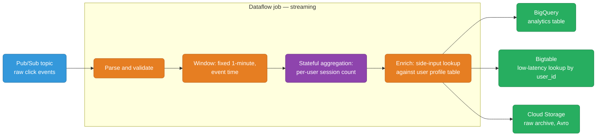
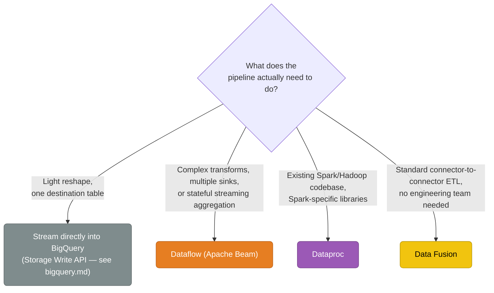

# GCP Data Pipelines

Moving and transforming data between systems is a different job than storing it. `databases.md` covers where data lives and `bigquery.md` already covers the ingestion paths that land data directly *into* BigQuery (Storage Write API, batch load jobs). This guide covers the layer that usually sits in front of those paths, or moves data somewhere that isn't BigQuery at all: **Dataflow** (Apache Beam, unified batch + streaming transforms), **Dataproc** (managed Hadoop/Spark), **Cloud Composer** and **Workflows** (orchestration), and **Data Fusion** (visual/no-code ETL).

<div class="quiz-progress" data-quiz-progress>
  <span class="quiz-progress-label">0/0 checks</span>
  <span class="quiz-progress-bar"><span class="quiz-progress-fill"></span></span>
</div>

---

## Pipeline Service Map

| Use case | AWS | GCP |
|----------|-----|-----|
| Unified batch + streaming transform (Apache Beam) | Kinesis Data Analytics / Glue Streaming | **Dataflow** |
| Managed Hadoop / Spark | EMR | **Dataproc** |
| Complex DAG orchestration across many systems | MWAA (managed Airflow) | **Cloud Composer** |
| Lightweight serverless step orchestration | Step Functions | **Workflows** |
| Cron trigger layer | EventBridge Scheduler | **Cloud Scheduler** |
| No-code / visual ETL builder | Glue Studio | **Data Fusion** |
| Land data straight into a warehouse | Kinesis Firehose | Streaming inserts (see `bigquery.md`) |

---

## Dataflow — Apache Beam, One Model for Batch and Streaming

Apache Beam is a programming model, not a service: you write a pipeline as a graph of `PTransform`s operating on `PCollection`s (an unbounded or bounded set of elements), and a **runner** executes that graph. Dataflow is Google's fully managed, serverless runner for Beam — the same Beam SDK also runs on Spark or Flink runners elsewhere, but Dataflow is the GCP-native, no-clusters-to-manage option.

The defining feature of the model: **the same transform code runs unchanged against a bounded batch source or an unbounded streaming source.** Only the source, the windowing, and the sink change — the business logic in between doesn't know or care which mode it's running in.

<div class="tab-group">
  <div class="tab-buttons">
    <button data-tab="beam-batch" class="active">Batch pipeline</button>
    <button data-tab="beam-stream">Streaming pipeline</button>
  </div>
  <div class="tab-panels">
    <div class="tab-panel active" data-tab-panel="beam-batch">
      <pre><code class="language-python">import apache_beam as beam
from apache_beam.options.pipeline_options import PipelineOptions
with beam.Pipeline(options=PipelineOptions()) as p:
    (p
     | "Read" &gt;&gt; beam.io.ReadFromText("gs://my-bucket/orders/*.csv")
     | "Parse" &gt;&gt; beam.Map(parse_csv_row)
     | "SumByUser" &gt;&gt; beam.CombinePerKey(sum)
     | "Write" &gt;&gt; beam.io.WriteToBigQuery(
         "project:dataset.user_totals",
         write_disposition=beam.io.BigQueryDisposition.WRITE_TRUNCATE))</code></pre>
    </div>
    <div class="tab-panel" data-tab-panel="beam-stream">
      <pre><code class="language-python">import apache_beam as beam
from apache_beam.options.pipeline_options import PipelineOptions
options = PipelineOptions(streaming=True)
with beam.Pipeline(options=options) as p:
    (p
     | "Read" &gt;&gt; beam.io.ReadFromPubSub(topic="projects/my-project/topics/orders")
     | "Parse" &gt;&gt; beam.Map(parse_json_message)
     | "Window" &gt;&gt; beam.WindowInto(beam.window.FixedWindows(60))
     | "SumByUser" &gt;&gt; beam.CombinePerKey(sum)
     | "Write" &gt;&gt; beam.io.WriteToBigQuery(
         "project:dataset.user_totals_live",
         write_disposition=beam.io.BigQueryDisposition.WRITE_APPEND))</code></pre>
    </div>
  </div>
</div>

`Parse` and `SumByUser` are identical in both pipelines. The only differences are the source (`ReadFromText` vs `ReadFromPubSub`), the addition of a `Window` stage (a batch job has a natural end, so it doesn't need one), and the write disposition (`TRUNCATE` for a full batch recompute, `APPEND` for a continuous stream of results). That's the entire pitch of the unified model: build and test your transform logic once, in batch, against a static sample file — then point the same code at a live topic for production.

### Autoscaling Workers

Dataflow adjusts worker count automatically based on backlog (streaming) or estimated remaining work (batch), scaling from a couple of workers up to whatever `--max-workers` allows. A burst of Pub/Sub traffic doesn't need pre-provisioning — the runner adds workers until the backlog drains, then scales back down once it's idle.

```bash
gcloud dataflow jobs run word-count-job \
  --gcs-location gs://dataflow-templates/latest/Word_Count \
  --region us-central1 \
  --staging-location gs://my-bucket/staging \
  --parameters inputFile=gs://my-bucket/input.txt,output=gs://my-bucket/output \
  --num-workers 2 \
  --max-workers 20
```

<div class="quiz-card">
  <p class="quiz-q">Two Beam pipelines share the exact same <code>Parse</code> and <code>SumByUser</code> transform code, but one reads from GCS and the other from Pub/Sub. Do you need to rewrite the aggregation logic for the streaming version?</p>
  <button class="quiz-reveal">Reveal answer</button>
  <div class="quiz-a" hidden>No — that's the point of the Beam model. The transform code between source and sink is identical in both; only the source (<code>ReadFromText</code> vs <code>ReadFromPubSub</code>), the addition of a windowing stage (streaming data has no natural end, so it needs one), and the write disposition change. You can build and test the logic once against a static batch sample, then point the same pipeline at a live topic.</div>
</div>

### Windowing and Watermarks

An unbounded stream never "finishes," so an aggregation like `SumByUser` needs a boundary to know when to emit a result — that boundary is a **window** (fixed, sliding, or session-based, grouping elements by *event time*, the timestamp the event actually happened, not when it arrived at the pipeline).

The hard part is that event time and processing time diverge — a mobile client goes offline and replays events an hour late, or a network hiccup reorders a batch. Dataflow tracks a **watermark**: its running estimate of "all data with an event time earlier than T has now arrived." A window only fires (emits its aggregate) once the watermark passes the window's end — but the watermark is an estimate, not a guarantee, so data can still trickle in *after* a window has already fired. That's late data, and how a pipeline handles it is a real correctness decision, not an edge case to ignore.

<div class="stepper">
  <div class="stepper-panels">
    <div class="stepper-panel active">
      <strong>1. Events arrive out of order.</strong> A mobile app buffers events while offline, then replays them once it reconnects — the pipeline sees event timestamps from an hour ago arriving right now, mixed in with genuinely current events.
    </div>
    <div class="stepper-panel">
      <strong>2. Windowing groups by event time.</strong> A <code>FixedWindows(60)</code> window buckets every element by the minute it actually happened, not the minute it was received — so a late-arriving event still lands in the correct historical bucket, not today's.
    </div>
    <div class="stepper-panel">
      <strong>3. The watermark advances and the window fires.</strong> Once Dataflow's watermark estimate passes a window's end boundary, it considers that window "done enough" and emits its aggregate downstream — this is the default trigger.
    </div>
    <div class="stepper-panel">
      <strong>4. Late data arrives after the window already fired.</strong> With <code>allowed_lateness</code> configured, the pipeline doesn't discard it — it re-fires that same window with an updated (accumulating) or replacement (discarding) result, and downstream consumers see a correction.
    </div>
    <div class="stepper-panel">
      <strong>5. Allowed lateness expires — the window closes for good.</strong> Any element arriving after that point is genuinely dropped (and counted in a "dropped due to lateness" metric) — there's no unbounded wait, because a window that never closes can never be considered complete.
    </div>
  </div>
  <div class="stepper-controls">
    <button class="stepper-prev">← Prev</button>
    <span class="stepper-dots"></span>
    <span class="stepper-label"></span>
    <button class="stepper-next">Next →</button>
  </div>
</div>

<div class="quiz-card">
  <p class="quiz-q">A streaming pipeline uses processing time (wall-clock arrival) instead of event time to bucket a "revenue per minute" aggregation. A batch of events from a flaky mobile client arrives 45 minutes late. Which minute's total do they get counted into?</p>
  <button class="quiz-reveal">Reveal answer</button>
  <div class="quiz-a" hidden>Whatever minute the pipeline happened to receive them — not the minute they actually occurred. That's exactly the failure mode event-time windowing exists to prevent: bucketing by processing time silently corrupts historical totals by attributing revenue to the wrong minute entirely, whereas event-time windowing (plus watermarks and allowed lateness) keeps late data in its correct bucket and only trades off a bounded, explicit delay before that bucket is considered final.</div>
</div>

### Dataflow vs. Streaming Straight into BigQuery

`bigquery.md` already covers the Storage Write API and `insertAll` — writing rows directly into BigQuery with no separate compute layer in front. That's the simpler, cheaper option whenever it's enough. Add Dataflow in front when the pipeline needs something a single insert call can't express on its own.

<div class="toggle-switch">
  <div class="toggle-buttons">
    <button data-toggle-opt="direct" class="active state-ok">Stream directly into BigQuery</button>
    <button data-toggle-opt="dataflow" class="state-warn">Add Dataflow in front</button>
  </div>
  <div class="toggle-panel active" data-toggle-panel="direct">
    <strong>Good enough when:</strong> the transform is light — reshape a JSON payload, cast a couple of types, maybe drop a field — and there's exactly one destination table. The Storage Write API (see <code>bigquery.md</code>) already gives exactly-once delivery and low latency with zero pipeline infrastructure to run or scale. Most simple ingest-and-land use cases stop here.
  </div>
  <div class="toggle-panel" data-toggle-panel="dataflow">
    <strong>Reach for this when:</strong> the pipeline needs (a) <em>complex transforms</em> — joining the stream against a side input, enriching records with a lookup against another table or an external API, validating/branching logic that's more than a field rename; (b) <em>multiple sinks</em> — the same event stream needs to land in BigQuery <em>and</em> Bigtable <em>and</em> a GCS archive, which a single insert call can't fan out to; or (c) <em>stateful streaming aggregation</em> — a rolling count, a deduplication window, or a sessionization that has to happen <em>before</em> the row is written, where the state genuinely has to live somewhere across multiple events. None of that state or fan-out logic is expressible in a single write call — it needs a runner sitting in front that can hold state and branch to several destinations.
  </div>
</div>

<div class="quiz-card">
  <p class="quiz-q">Why would you add Dataflow in front of BigQuery streaming inserts instead of just streaming directly into BigQuery?</p>
  <button class="quiz-reveal">Reveal answer</button>
  <div class="quiz-a" hidden>Because a single Storage Write API call can only reshape one record and write it to one table — it can't hold cross-record state or fan out to several destinations. Dataflow earns its place when you need complex transforms (enrichment lookups, joins against a side input), multiple sinks (the same stream landing in BigQuery, Bigtable, and GCS at once), or stateful streaming aggregation (a rolling count or dedup window that has to accumulate across events before it's written). If the transform is just "reshape and land in one table," streaming directly is simpler, cheaper, and has no extra infrastructure to run.</div>
</div>

### A Representative Pipeline Architecture



This is the shape that justifies Dataflow over a direct insert: one Pub/Sub source feeds a single pipeline that windows, aggregates statefully, enriches against a side input, and then fans out to three different sinks with three different jobs (fast analytical queries, low-latency point lookups, and durable archival) — none of which a single write call could do alone.

---

## Dataproc — Managed Hadoop and Spark

Dataproc runs standard Hadoop/Spark clusters as a managed service — same open-source APIs (Spark, Hive, Pig, MapReduce), no manual node provisioning or cluster software installs. It's the right tool when a Spark or Hadoop codebase already exists, not a reason to start a new pipeline in Spark today.

<div class="toggle-switch">
  <div class="toggle-buttons">
    <button data-toggle-opt="ephemeral" class="active state-ok">Ephemeral clusters</button>
    <button data-toggle-opt="longrunning" class="state-warn">Long-running clusters</button>
  </div>
  <div class="toggle-panel active" data-toggle-panel="ephemeral">
    <strong>Spin up, run one job, tear down.</strong> This is the cost-efficient, GCP-native pattern: a workflow template creates a cluster, submits a job, waits for completion, and deletes the cluster automatically — you pay only for the minutes the cluster actually existed, not for idle capacity between runs. Best for scheduled batch jobs (nightly ETL, a periodic Spark transform) where each run is independent.
  </div>
  <div class="toggle-panel" data-toggle-panel="longrunning">
    <strong>Persistent cluster, always on.</strong> Worth it when jobs are frequent enough that per-job cluster startup (roughly a minute or two) would dominate runtime, or for interactive workloads — notebooks, ad-hoc Spark SQL sessions — where a data scientist expects a cluster to already be there. The tradeoff is paying for idle time between jobs.
  </div>
</div>

```bash
# Ephemeral pattern: workflow template creates, runs, and tears down automatically
gcloud dataproc workflow-templates create daily-etl --region=us-central1

gcloud dataproc workflow-templates set-managed-cluster daily-etl \
  --region=us-central1 \
  --cluster-name=daily-etl-cluster \
  --num-workers=4 \
  --worker-machine-type=n1-standard-4

gcloud dataproc workflow-templates add-job spark \
  --workflow-template=daily-etl \
  --region=us-central1 \
  --step-id=transform \
  --class=com.example.SparkTransform \
  --jars=gs://my-bucket/jars/transform.jar

gcloud dataproc workflow-templates instantiate daily-etl --region=us-central1
# Cluster is created, the job runs, then the cluster is deleted — one command

# Long-running cluster (interactive / frequent small jobs)
gcloud dataproc clusters create interactive-cluster \
  --region=us-central1 \
  --num-workers=2 \
  --enable-component-gateway \       # web UIs for Spark, Jupyter
  --optional-components=JUPYTER
```

**Dataproc vs. rewriting in Dataflow/Beam:** reach for Dataproc when there's an existing Spark/Hadoop codebase to migrate, the team already has deep Spark/PySpark expertise, or the job depends on a Spark-specific library (MLlib, GraphX) with no Beam equivalent. Rewriting in Beam is worth the effort for greenfield pipelines, or when you specifically want the batch+streaming unification Beam provides and a fully serverless runner with zero cluster lifecycle to manage.

<div class="quiz-card">
  <p class="quiz-q">A team has an existing 2,000-line PySpark job that runs once a night. Is this a good candidate to rewrite in Apache Beam on Dataflow, or to lift into Dataproc as-is?</p>
  <button class="quiz-reveal">Reveal answer</button>
  <div class="quiz-a" hidden>Lift it into Dataproc, run it on an ephemeral cluster via a workflow template. There's no batch+streaming unification to gain (it's a nightly batch job, not something that also needs to run continuously), the team's existing Spark expertise and 2,000 lines of working code carry over unchanged, and the ephemeral pattern already gets the "pay only while it runs" cost efficiency that would otherwise be Dataflow's main advantage. Rewriting it in Beam would mean re-implementing working logic in a different SDK for no functional gain.</div>
</div>

---

## Orchestration: Cloud Composer vs. Workflows

Neither of these transforms data — they schedule and sequence *other* things (a Dataflow job, a Dataproc workflow template, a BigQuery load, an HTTP call to some other service). The choice between them comes down to how complex the sequencing is and how much operational overhead is worth paying for that complexity.

<div class="toggle-switch">
  <div class="toggle-buttons">
    <button data-toggle-opt="composer" class="active state-warn">Cloud Composer</button>
    <button data-toggle-opt="workflows" class="state-ok">Workflows</button>
  </div>
  <div class="toggle-panel active" data-toggle-panel="composer">
    <strong>Fully managed Apache Airflow.</strong> Use it for genuinely complex DAG orchestration — dozens of interdependent tasks, sensors that wait on external systems (a file landing in GCS, a partition becoming available), retries and backfills, cross-system dependencies spanning BigQuery, Dataflow, Dataproc, and third-party APIs in one graph. The cost is real: Composer runs on a persistent GKE-based environment, so there's an operational and billing floor even when nothing is actively running, plus Airflow version upgrades and environment maintenance to own.
  </div>
  <div class="toggle-panel" data-toggle-panel="workflows">
    <strong>Lightweight serverless orchestration.</strong> Steps are defined in YAML or JSON, oriented around making HTTP calls and passing their results to the next step — call this API, branch on the response, call that Cloud Function, call that Cloud Run job. It scales to zero and bills per step executed, with no standing environment to maintain. It's the right fit for a chain of a handful of API calls with simple branching, not a good fit for anything needing Airflow-style backfills, complex retries with custom sensors, or a large heterogeneous DAG.
  </div>
</div>

```yaml
# Workflows: a simple HTTP-call-oriented chain (YAML)
main:
  steps:
    - triggerDataflow:
        call: http.post
        args:
          url: https://dataflow.googleapis.com/v1b3/projects/my-project/locations/us-central1/templates:launch
          auth:
            type: OAuth2
        result: dataflowResult
    - waitAndCheck:
        call: http.get
        args:
          url: ${"https://dataflow.googleapis.com/v1b3/projects/my-project/jobs/" + dataflowResult.body.job.id}
          auth:
            type: OAuth2
        result: jobStatus
    - notify:
        call: http.post
        args:
          url: https://us-central1-my-project.cloudfunctions.net/notify-slack
          body:
            status: ${jobStatus.body.currentState}
```

```python
# Composer: a DAG with heterogeneous, interdependent tasks
from airflow import DAG
from airflow.providers.google.cloud.operators.dataproc import DataprocSubmitJobOperator
from airflow.providers.google.cloud.transfers.gcs_to_bigquery import GCSToBigQueryOperator
from airflow.sensors.filesystem import FileSensor

with DAG("nightly_pipeline", schedule_interval="0 2 * * *") as dag:
    wait_for_export = FileSensor(task_id="wait_for_export", filepath="/data/export_ready.flag")
    spark_transform = DataprocSubmitJobOperator(task_id="spark_transform", job=SPARK_JOB, region="us-central1")
    load_to_bq = GCSToBigQueryOperator(task_id="load_to_bq", bucket="my-bucket", source_objects=["out/*.parquet"],
                                        destination_project_dataset_table="project.dataset.results")

    wait_for_export >> spark_transform >> load_to_bq
```

**Cloud Scheduler is the cron layer for either one** — it doesn't replace Composer or Workflows, it just fires the trigger. A Scheduler job can hit an HTTP endpoint to start a Workflows execution, or publish to Pub/Sub to kick off a Composer DAG, on a cron schedule (`0 2 * * *` for "every night at 2am").

```bash
# Cloud Scheduler firing a Workflows execution nightly
gcloud scheduler jobs create http nightly-pipeline-trigger \
  --schedule="0 2 * * *" \
  --uri="https://workflowexecutions.googleapis.com/v1/projects/my-project/locations/us-central1/workflows/nightly-etl/executions" \
  --http-method=POST \
  --oauth-service-account-email=scheduler-invoker@my-project.iam.gserviceaccount.com
```

<div class="quiz-card">
  <p class="quiz-q">A pipeline needs to: wait for a file sensor, run a Spark job on Dataproc, load results into BigQuery, then trigger three downstream reports with different retry policies — about 15 interdependent tasks in total. Is Workflows a good fit here?</p>
  <button class="quiz-reveal">Reveal answer</button>
  <div class="quiz-a" hidden>No — this is exactly the shape Composer is for, not Workflows. Fifteen interdependent tasks with a filesystem sensor and per-task retry policies is genuine complex DAG orchestration across heterogeneous systems, which is what managed Airflow is built to express cleanly. Workflows is oriented around simpler HTTP-call chains with basic branching; forcing a 15-task DAG with sensors and mixed retry logic into Workflows' YAML step model would fight the tool rather than use it as intended, even though it would cost less to run.</div>
</div>

---

## Data Fusion — Visual, No-Code ETL

Data Fusion is a visual pipeline builder (built on the open-source CDAP framework) — drag connectors and transforms onto a canvas, wire them together, and Data Fusion compiles the result down to a Dataproc or Spark job under the hood. No Beam or Spark code to write.

**When it's the right call:** a data-analyst-heavy team without deep Python/Java/Spark engineers, a pipeline dominated by standard connector-to-connector moves (a database extract, a few field mappings and filters, load into BigQuery) where the built-in connector library covers the sources involved, or when time-to-delivery matters more than hand-tuned performance.

**When it's the wrong call:** the pipeline needs custom logic that doesn't fit a drag-and-drop transform, the team wants pipeline logic in version control and code review the way hand-written Beam/Spark naturally is, performance or cost needs tight tuning beyond what the visual layer exposes, or the workload is heavy stateful streaming — that's Dataflow's job, not a no-code tool's.

<div class="quiz-card">
  <p class="quiz-q">A data analyst needs to pull a weekly CSV extract from an on-prem database, rename a few columns, filter out test accounts, and load it into BigQuery. Is this a good Data Fusion use case, or should it be written as a Beam pipeline?</p>
  <button class="quiz-reveal">Reveal answer</button>
  <div class="quiz-a" hidden>Good Data Fusion use case. This is exactly the shape it's built for: standard connector-to-connector movement (database extract to BigQuery), light field-level transforms with no custom stateful logic, and a team member without a Python/Java engineering background who can build and maintain it visually. Writing this as hand-rolled Beam would add engineering overhead — build, deploy, version, and maintain code — for a pipeline shape that doesn't need any of the flexibility that code buys you.</div>
</div>

---

## Which Tool for Which Pipeline Shape



| Criteria | Direct into BigQuery | Dataflow | Dataproc | Data Fusion |
|----------|----------------------|----------|----------|--------------|
| **Transform complexity** | None to light (reshape only) | Complex — joins, enrichment, stateful aggregation | Complex, Spark-native (whatever the existing job already does) | Light to medium, connector-driven |
| **Team skillset needed** | SQL only | Python/Java (Beam SDK) | Spark/Scala/PySpark experience | Low-code — minimal engineering |
| **Orchestration complexity** | None — fire and forget | Pipeline handles its own windowing; pair with Scheduler/Workflows/Composer for scheduling | Cluster lifecycle to manage; pair with a workflow template or Composer | Built-in scheduling, can also sit under Composer |
| **One-off vs. ongoing** | Ongoing, continuous | Either — batch or streaming, ongoing production pipelines | Either, but shines for one-off ephemeral migration jobs | Ongoing; less suited to a true one-off |
| **Multiple sinks from one source** | No — one write target per call | Yes, natively | Possible, but manual to wire up | Yes, via multiple pipeline stages |
| **Cost shape** | Pay per row written | Pay per worker-hour, autoscaled | Pay per cluster-hour (near-zero if ephemeral) | Pay for the Dataproc/Spark job it compiles to |

<div class="quiz-card">
  <p class="quiz-q">A team is deciding between four options for a brand-new pipeline that reads from Pub/Sub, needs a 5-minute rolling deduplication window, and writes to both BigQuery and Bigtable. Which of the four tools in the table actually supports this shape?</p>
  <button class="quiz-reveal">Reveal answer</button>
  <div class="quiz-a" hidden>Dataflow. Direct streaming inserts can't hold a rolling dedup window's state or fan out to two sinks from a single write call. Dataproc is built for existing Spark/Hadoop jobs, not a greenfield streaming pipeline. Data Fusion's visual connectors don't express custom stateful windowed logic. Dataflow is the only one built for stateful streaming aggregation with multiple downstream sinks — which is exactly the combination called out earlier as the reason to add it in front of a direct BigQuery write in the first place.</div>
</div>
