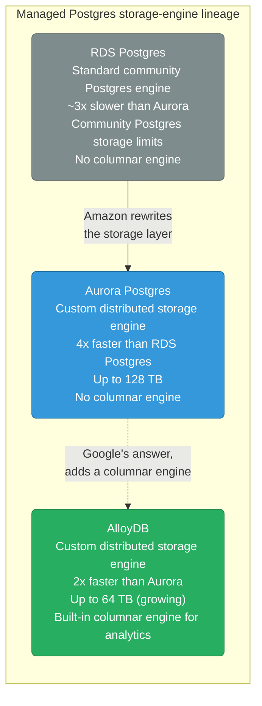
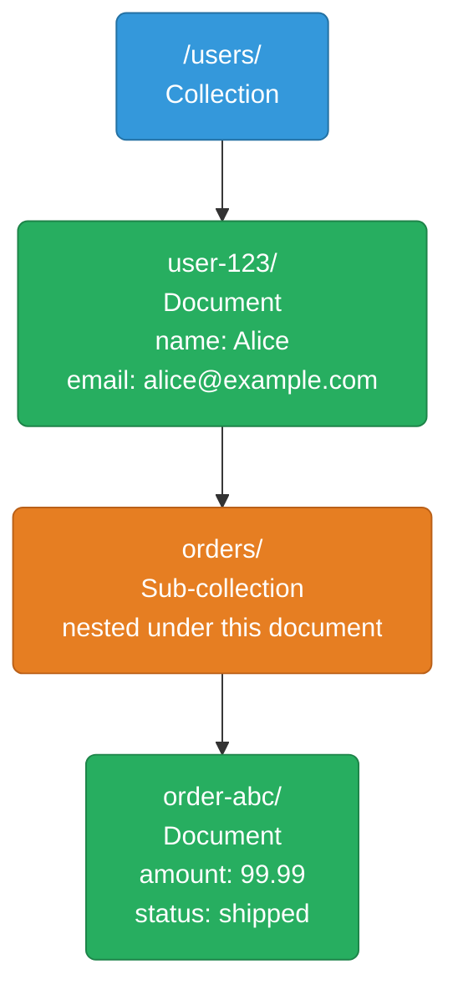
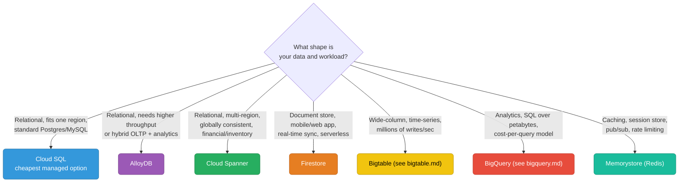

# GCP Databases

Managed relational, NoSQL, globally distributed, and caching databases.

<div class="quiz-progress" data-quiz-progress>
  <span class="quiz-progress-label">0/0 checks</span>
  <span class="quiz-progress-bar"><span class="quiz-progress-fill"></span></span>
</div>

---

## Database Service Map

| Use case | AWS | GCP |
|----------|-----|-----|
| Managed Postgres | RDS Postgres / Aurora | **Cloud SQL** / **AlloyDB** |
| Managed MySQL | RDS MySQL / Aurora MySQL | **Cloud SQL MySQL** |
| Global ACID SQL | Aurora Global (lag) | **Cloud Spanner** (TrueTime, no lag) |
| NoSQL document | DynamoDB / DocumentDB | **Firestore** |
| Wide-column / time-series | DynamoDB single-table | **Bigtable** |
| In-memory cache | ElastiCache (Redis/Memcached) | **Memorystore** |
| Analytical / data warehouse | Redshift | **BigQuery** (see bigquery.md) |

---

## Cloud SQL — Managed MySQL, PostgreSQL, SQL Server

Cloud SQL is the closest thing to RDS. Supports Postgres, MySQL, and SQL Server with automated backups, HA, and read replicas.

### Create an Instance

```bash
# PostgreSQL instance
gcloud sql instances create my-postgres \
  --database-version=POSTGRES_15 \
  --region=us-central1 \
  --tier=db-n1-standard-4 \         # 4 vCPU, 15 GB RAM
  --storage-size=100GB \
  --storage-type=SSD \
  --storage-auto-increase \          # like Aurora auto-grow
  --backup-start-time=04:00 \
  --availability-type=REGIONAL       # HA (standby in another zone)

# Create a database and user
gcloud sql databases create myapp --instance=my-postgres
gcloud sql users create myuser --instance=my-postgres --password=secret
```

### Connection Methods

<div class="tab-group">
  <div class="tab-buttons">
    <button data-tab="proxy" class="active">Auth Proxy (recommended)</button>
    <button data-tab="private">Private IP</button>
    <button data-tab="public">Public IP</button>
  </div>
  <div class="tab-panels">
    <div class="tab-panel active" data-tab-panel="proxy">
      <strong>Cloud SQL Auth Proxy.</strong> Runs as a sidecar next to your app and handles TLS encryption plus IAM authentication automatically — the app talks plaintext to <code>localhost</code> and the proxy does the secure hop to Cloud SQL. This is the AWS analog of RDS Proxy, and the recommended default for anything that isn't a quick local test.
    </div>
    <div class="tab-panel" data-tab-panel="private">
      <strong>Private IP (VPC-native).</strong> The SQL instance is assigned a private IP address inside your VPC, so GCE instances and GKE pods on that network connect directly — no proxy hop, no public exposure. Best for production workloads that already live inside the VPC.
    </div>
    <div class="tab-panel" data-tab-panel="public">
      <strong>Public IP + SSL + authorized networks.</strong> The instance gets a public IP, reachable only from IP ranges you allow-list, over an SSL-enforced connection. It works, but it's an internet-facing attack surface by construction — avoid it in production in favor of Private IP or the Auth Proxy.
    </div>
  </div>
</div>

```bash
# Cloud SQL Auth Proxy (local dev)
./cloud-sql-proxy my-project:us-central1:my-postgres &
# connects on localhost:5432

# Private IP (best for production)
gcloud sql instances patch my-postgres \
  --network=my-vpc \
  --no-assign-ip              # disable public IP
```

### HA and Read Replicas

```bash
# HA is set with --availability-type=REGIONAL at creation
# This creates a standby in a different zone (like RDS Multi-AZ)

# Add a read replica
gcloud sql instances create my-postgres-replica \
  --master-instance-name=my-postgres \
  --region=us-east1          # cross-region read replica

# Promote replica to primary (for migration/disaster recovery)
gcloud sql instances promote-replica my-postgres-replica
```

### Cloud SQL vs RDS Comparison

| | Cloud SQL | AWS RDS |
|--|---|---|
| **Postgres max version** | 15 | 16 |
| **Storage auto-grow** | Yes | Yes |
| **Multi-AZ HA** | Regional (different zone standby) | Multi-AZ (synchronous standby) |
| **Read replicas** | Yes, cross-region | Yes, cross-region |
| **Managed proxy** | Cloud SQL Auth Proxy | RDS Proxy |
| **IAM auth** | Yes (passwordless) | Yes (IAM DB auth) |
| **Point-in-time recovery** | Yes (7-day window) | Yes (35-day max) |
| **Max storage** | 64 TB | 64 TB |
| **Maintenance window** | Configurable | Configurable |

<div class="quiz-card">
  <p class="quiz-q">You create a Cloud SQL instance with <code>--availability-type=REGIONAL</code>, then separately add a cross-region read replica. Are these two the same failover mechanism?</p>
  <button class="quiz-reveal">Reveal answer</button>
  <div class="quiz-a" hidden>No. REGIONAL availability creates a synchronous standby in a different zone <em>within the same region</em> purely for automatic HA failover — it isn't a separate queryable endpoint. A read replica is an asynchronous, independently-queryable copy (can live in another region entirely) meant for scaling reads or disaster recovery, and turning it into a primary is a manual <code>promote-replica</code> action, not an automatic failover.</div>
</div>

---

## AlloyDB — PostgreSQL on Steroids

AlloyDB is GCP's proprietary high-performance Postgres. It's Google's answer to Amazon Aurora — built on Postgres protocol but with a custom storage layer.



**When to use AlloyDB over Cloud SQL:**
- OLTP workloads needing 4-5× more throughput than Cloud SQL
- Hybrid OLTP + analytics (AlloyDB has a columnar engine for fast analytics on live data)
- Require sub-second failover (AlloyDB uses distributed storage, no failover replica sync)

```bash
gcloud alloydb clusters create my-cluster \
  --region=us-central1 \
  --password=admin-pass

gcloud alloydb instances create my-primary \
  --instance-type=PRIMARY \
  --cluster=my-cluster \
  --region=us-central1 \
  --cpu-count=4
```

<div class="quiz-card">
  <p class="quiz-q">AlloyDB claims sub-second failover where Cloud SQL's regional HA takes longer. What architectural difference makes that possible?</p>
  <button class="quiz-reveal">Reveal answer</button>
  <div class="quiz-a" hidden>AlloyDB is built on distributed storage shared underneath its instances, so a new primary doesn't need to wait for a failover replica to sync its data first — the storage layer is already consistent and shared. Cloud SQL's regional HA relies on a standby that must stay caught up via replica sync, which is slower to promote.</div>
</div>

---

## Cloud Spanner — Globally Distributed ACID SQL

Spanner is the only database in the world that provides both horizontal scaling AND global strong consistency. Aurora Global has seconds of replication lag. Spanner has ~10ms at global scale.

### How TrueTime Works

```mermaid
sequenceDiagram
    participant APP as Application (us-central1)
    participant SP1 as Spanner replica group (us-central1)
    participant TS as TrueTime API (atomic clock + GPS per datacenter)
    participant SP2 as Spanner replica group (europe-west1)
    participant RD as Reader (europe-west1)

    APP->>SP1: Commit transaction (write orders row)
    SP1->>TS: TT.now()
    TS-->>SP1: interval [earliest, latest], width = clock uncertainty epsilon
    rect rgb(60, 45, 20)
    Note over SP1: Commit-wait — stall until real time passes "latest"
    SP1->>SP1: sleep until wall clock later than latest, typically 4-7ms
    end
    SP1->>SP1: assign commit timestamp = latest, make write visible
    SP1-->>APP: commit acknowledged
    RD->>SP2: Read at current time
    SP2->>TS: TT.now()
    TS-->>SP2: current interval, guaranteed later than the commit's latest
    SP2-->>RD: return committed row, never a stale or earlier version
```



<div class="stepper">
  <div class="stepper-panels">
    <div class="stepper-panel active">
      <strong>1. Transaction requests a commit timestamp.</strong> The application commits to its nearest Spanner replica group (here, <code>us-central1</code>), which calls the local datacenter's TrueTime API — <code>TT.now()</code> — before assigning a timestamp.
    </div>
    <div class="stepper-panel">
      <strong>2. TrueTime returns an interval, not a single number.</strong> Every physical clock — even an atomic clock or a GPS receiver — has some drift, so TrueTime never claims to know the exact instant. It returns <code>[earliest, latest]</code>, a bound guaranteed to contain the true current time, typically only a few milliseconds wide.
    </div>
    <div class="stepper-panel">
      <strong>3. Commit-wait: stall until "latest" has definitely passed.</strong> Instead of committing immediately, Spanner deliberately sleeps until the wall clock has moved past the interval's upper bound — typically 4-7ms. This is the core trick: it trades a small fixed latency tax for a hard real-time guarantee.
    </div>
    <div class="stepper-panel">
      <strong>4. Commit timestamp = latest, write becomes visible.</strong> By the time the write is exposed to any other transaction, real time has already passed the assigned timestamp everywhere — not just in <code>us-central1</code>. There's no window where the write could be "not-yet-happened" relative to a clock anywhere else.
    </div>
    <div class="stepper-panel">
      <strong>5. A remote read in europe-west1 sees the committed value, never stale.</strong> Because commit-wait already burned the uncertainty window before acknowledging the commit, any read issued afterward — anywhere on Earth — is guaranteed to observe this write. No replication lag to wait out, no split-brain read of an older version.
    </div>
  </div>
  <div class="stepper-controls">
    <button class="stepper-prev">← Prev</button>
    <span class="stepper-dots"></span>
    <span class="stepper-label"></span>
    <button class="stepper-next">Next →</button>
  </div>
</div>

<div class="quiz-card">
  <p class="quiz-q">Spanner's global strong consistency comes from waiting on synchronous network round-trips to remote regions before every commit — true or false?</p>
  <button class="quiz-reveal">Reveal answer</button>
  <div class="quiz-a" hidden>False. It comes from commit-wait: stalling the commit locally until the TrueTime uncertainty interval has definitely passed (typically 4-7ms), not from talking to remote replicas over the network. Even a single-region transaction pays this same commit-wait tax — the guarantee comes from bounded clock uncertainty, not from round-trip latency to other continents.</div>
</div>

Google uses GPS receivers and atomic clocks in every datacenter. Every commit waits out the clock uncertainty (typically 4-7ms). This guarantees linearizability globally — reads always see the latest committed state, across continents.

### When to Use Spanner

<div class="toggle-switch">
  <div class="toggle-buttons">
    <button data-toggle-opt="use" class="active state-ok">Use Spanner</button>
    <button data-toggle-opt="avoid" class="state-bad">Don't use Spanner</button>
  </div>
  <div class="toggle-panel active" data-toggle-panel="use">
    <ul>
      <li>Financial transactions across regions (banking, payments)</li>
      <li>Inventory systems that must be globally consistent</li>
      <li>Gaming (leaderboards, inventory) at global scale</li>
      <li>Cannot tolerate any read staleness, even milliseconds</li>
    </ul>
  </div>
  <div class="toggle-panel" data-toggle-panel="avoid">
    <ul>
      <li>Your workload is single-region (Cloud SQL is cheaper)</li>
      <li>You need complex joins over large datasets (BigQuery is better)</li>
      <li>Budget-constrained ($0.65/node-hour minimum)</li>
    </ul>
  </div>
</div>

```bash
# Create a Spanner instance
gcloud spanner instances create my-spanner \
  --config=regional-us-central1 \      # or nam4, eur3, global1
  --description="Production" \
  --nodes=3                            # 2,000 QPS per node

# Multi-region config (global consistency)
gcloud spanner instances create global-spanner \
  --config=nam-eur-asia1 \             # 3 continents
  --nodes=3

# Create database and schema
gcloud spanner databases create mydb --instance=my-spanner
gcloud spanner databases ddl update mydb --instance=my-spanner \
  --ddl='CREATE TABLE orders (
    order_id STRING(36) NOT NULL,
    user_id STRING(36) NOT NULL,
    amount NUMERIC NOT NULL,
    created_at TIMESTAMP NOT NULL OPTIONS (allow_commit_timestamp=true)
  ) PRIMARY KEY (order_id)'
```

### Spanner vs Aurora Global

| | Cloud Spanner | Aurora Global |
|--|---|---|
| **Replication lag** | ~0ms (TrueTime, strong consistency) | 1-2 seconds (async replication) |
| **Global write** | Any region (multi-master) | One primary region only |
| **SQL compatibility** | GoogleSQL dialect (ANSI SQL + extensions) | Standard MySQL / Postgres |
| **Schema changes** | Online, no downtime | Downtime for some ALTER TABLE |
| **Cost** | $0.65/node-hour | ~$0.29/hour for r5.large |
| **Auto-scaling** | Yes (serverless Spanner) | No (fixed instance sizes) |

---

## Firestore — Serverless Document Database

Firestore = GCP's MongoDB / DynamoDB hybrid. Serverless (scales to zero), document model, real-time listeners.

| DynamoDB concept | Firestore equivalent |
|---|---|
| Tables | Collections |
| Items | Documents |
| Partition + sort key | Document ID (path-based) |
| GSI | Composite indexes |
| Streams | Real-time listeners |
| $0.25/GB + $0.25/RCU | $0.06/GB + $0.06/100K reads |

### Firestore Data Model



A document's path always alternates collection/document/collection — a sub-collection lives *under* a specific document, not under the parent collection, which is why `orders` here only contains `user-123`'s orders, not every order in the system.

```python
from google.cloud import firestore

db = firestore.Client()

# Write
db.collection("users").document("user-123").set({
    "name": "Alice",
    "email": "alice@example.com",
    "created_at": firestore.SERVER_TIMESTAMP
})

# Read
doc = db.collection("users").document("user-123").get()
print(doc.to_dict())

# Query (must create composite index for multi-field queries)
users = db.collection("users")\
    .where("status", "==", "active")\
    .where("plan", "==", "premium")\
    .order_by("created_at", direction=firestore.Query.DESCENDING)\
    .limit(10)\
    .stream()

# Real-time listener (no equivalent in DynamoDB)
def on_snapshot(docs, changes, read_time):
    for change in changes:
        print(f"Change: {change.type.name} {change.document.id}")

db.collection("orders").on_snapshot(on_snapshot)
```

<div class="quiz-card">
  <p class="quiz-q">A query filters on <code>status == "active"</code> AND <code>plan == "premium"</code>, then orders by <code>created_at</code>. Will Firestore just run it, the way a SQL database would scan and sort on the fly?</p>
  <button class="quiz-reveal">Reveal answer</button>
  <div class="quiz-a" hidden>No — Firestore requires a pre-built composite index for any query that combines multiple filters (or a filter plus an order-by on a different field). Run the query without one and Firestore rejects it outright rather than falling back to a slow scan; the error it returns even includes a direct link to auto-create the missing index. This is a real design tradeoff versus DynamoDB's GSIs or a SQL planner: Firestore trades "figure out the plan at query time" for "you must have declared the index in advance."</div>
</div>

### Firestore Modes

| Mode | Best for |
|------|---------|
| **Native** | Mobile/web apps, real-time, flexible schema |
| **Datastore** | Legacy mode, no real-time, lower cost for batch |

Use Native mode for all new projects.

---

## Memorystore — Managed Redis and Memcached

Memorystore = GCP's ElastiCache.

```bash
# Create Redis instance
gcloud redis instances create my-redis \
  --size=5 \                    # 5 GB
  --region=us-central1 \
  --redis-version=redis_7_0 \
  --tier=STANDARD               # STANDARD = HA with replica; BASIC = no HA

# Get connection info
gcloud redis instances describe my-redis --region=us-central1
# → host: 10.0.0.50, port: 6379

# Connect from GKE pod (same VPC)
redis-cli -h 10.0.0.50 -p 6379
```

### Memorystore vs ElastiCache

| | Memorystore | ElastiCache |
|--|---|---|
| **Redis versions** | 6.x, 7.x | 5.x, 6.x, 7.x |
| **Cluster mode** | Memorystore for Redis Cluster | Cluster Mode Enabled |
| **HA** | Standard tier (primary + replica) | Multi-AZ with auto-failover |
| **Encryption** | In-transit + at-rest | In-transit + at-rest |
| **Auth** | AUTH string | AUTH token |
| **Persistence** | RDB snapshots | RDB + AOF |
| **Cost (5GB)** | ~$0.049/hr | ~$0.068/hr (cache.r6g.large) |

<div class="quiz-card">
  <p class="quiz-q">You create a Memorystore Redis instance with <code>--tier=BASIC</code> to save cost, and the underlying VM has a hardware failure. What happens to the data?</p>
  <button class="quiz-reveal">Reveal answer</button>
  <div class="quiz-a" hidden>It's gone. BASIC tier has no replica at all, so there's nothing to fail over to — a node failure is an outage and a data loss event, not a blip. STANDARD tier keeps a primary plus a replica specifically so the instance survives that failure with automatic failover; BASIC exists purely to be the cheaper option when the data is disposable (a pure cache you can repopulate), not for anything you can't afford to lose.</div>
</div>

### Redis Cluster (for large workloads)

```bash
# Memorystore for Redis Cluster (sharded, scales to TBs)
gcloud redis clusters create my-redis-cluster \
  --region=us-central1 \
  --shard-count=3 \              # 3 shards × 2 nodes = 6 total
  --replica-count=1 \            # 1 replica per shard
  --node-type=REDIS_STANDARD_SMALL
```

---

## Database Selection Guide



<div class="tab-group">
  <div class="tab-buttons">
    <button data-tab="sel-cloudsql" class="active">Cloud SQL</button>
    <button data-tab="sel-alloydb">AlloyDB</button>
    <button data-tab="sel-spanner">Spanner</button>
    <button data-tab="sel-firestore">Firestore</button>
    <button data-tab="sel-memorystore">Memorystore</button>
  </div>
  <div class="tab-panels">
    <div class="tab-panel active" data-tab-panel="sel-cloudsql">
      <strong>Pick this when:</strong> the data is relational, fits one region, and you're on standard Postgres, MySQL, or SQL Server — it's the cheapest managed option and the closest analog to RDS. Regional HA gives an automatic-failover standby; cross-region read replicas cover scaling reads or DR.<br/><br/>
      <strong>Skip it when:</strong> you need throughput closer to Aurora, hybrid OLTP+analytics, or any cross-region write consistency — that's AlloyDB or Spanner territory.
    </div>
    <div class="tab-panel" data-tab-panel="sel-alloydb">
      <strong>Pick this when:</strong> it's still relational Postgres, but the workload needs 4-5x more OLTP throughput than Cloud SQL, or you want a built-in columnar engine for fast analytics on live data without an ETL pipeline to a warehouse. Its distributed storage layer also gives sub-second failover, since there's no failover replica that needs to sync first.<br/><br/>
      <strong>Skip it when:</strong> Cloud SQL's throughput is already enough — AlloyDB is solving a scaling problem you may not have yet.
    </div>
    <div class="tab-panel" data-tab-panel="sel-spanner">
      <strong>Pick this when:</strong> the data must be relational, multi-region, and globally strongly consistent — financial transactions, inventory systems, global leaderboards, anything that can't tolerate even millisecond read staleness. TrueTime's commit-wait is what buys that guarantee.<br/><br/>
      <strong>Skip it when:</strong> the workload is single-region (Cloud SQL is cheaper), needs complex joins over huge datasets (BigQuery is better), or the $0.65/node-hour minimum doesn't fit the budget.
    </div>
    <div class="tab-panel" data-tab-panel="sel-firestore">
      <strong>Pick this when:</strong> it's a document-model app — typically mobile/web — that wants real-time listeners and serverless scale-to-zero rather than a provisioned instance. Composite indexes need to be created up front for any multi-field query.<br/><br/>
      <strong>Skip it when:</strong> the workload needs SQL joins, ACID transactions across arbitrary rows, or wide-column time-series ingestion at extreme write rates — that's Bigtable's job instead.
    </div>
    <div class="tab-panel" data-tab-panel="sel-memorystore">
      <strong>Pick this when:</strong> the need is caching, a session store, pub/sub, or rate limiting sitting in front of a primary datastore — not the system of record itself. STANDARD tier adds a replica for HA; BASIC has none, so only use BASIC for data that's fully disposable.<br/><br/>
      <strong>Skip it when:</strong> the data needs to be durable in its own right — Memorystore is a cache, not a database of record.
    </div>
  </div>
</div>

| | Cloud SQL | AlloyDB | Spanner | Firestore | Bigtable | Memorystore |
|--|---|---|---|---|---|---|
| **SQL** | Yes | Yes | Yes (GSql) | No | No | No |
| **Scale** | Vertical | Vertical | Horizontal | Auto | Horizontal | Vertical |
| **Global** | No (replicas) | No | Yes | Multi-region | Multi-region | No |
| **Strong consistency** | Yes | Yes | Yes (global) | Yes | Row-level | N/A |
| **Serverless** | No | No | Yes (Autoscaler) | Yes | No | No |
| **Cost model** | Per instance | Per instance | Per node/RU | Per read/write/GB | Per node | Per instance |

<div class="quiz-card">
  <p class="quiz-q">A team already runs Cloud SQL for their relational app and now needs globally consistent multi-region writes for a new inventory feature. Does adding cross-region read replicas to Cloud SQL solve that?</p>
  <button class="quiz-reveal">Reveal answer</button>
  <div class="quiz-a" hidden>No. Cloud SQL read replicas are asynchronous copies for scaling reads or disaster recovery, not a mechanism for globally consistent multi-region writes — promoting one is a manual action, not live multi-master replication. The selection guide is explicit here: "relational, multi-region, globally consistent, financial/inventory" points straight at Spanner, whose TrueTime commit-wait is what actually buys that guarantee.</div>
</div>
