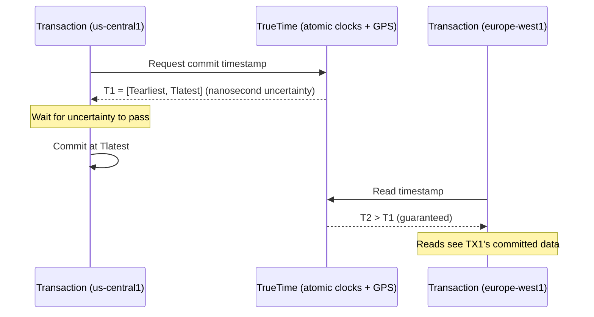

# GCP Databases

Managed relational, NoSQL, globally distributed, and caching databases.

---

## Database Service Map

| Use case | AWS | GCP |
|----------|-----|-----|
| Managed Postgres | RDS Postgres / Aurora | **Cloud SQL** / **AlloyDB** |
| Managed MySQL | RDS MySQL / Aurora MySQL | **Cloud SQL MySQL** |
| Global ACID SQL | Aurora Global (lag) | **Cloud Spanner** (TrueTime, no lag) |
| NoSQL document | DynamoDB / DocumentDB | **Firestore** |
| Wide-column / time-series | DynamoDB single-table | **Bigtable** |
| In-memory cache | ElastiCache (Redis/Memcached) | **Memorystore** |
| Analytical / data warehouse | Redshift | **BigQuery** (see bigquery.md) |

---

## Cloud SQL — Managed MySQL, PostgreSQL, SQL Server

Cloud SQL is the closest thing to RDS. Supports Postgres, MySQL, and SQL Server with automated backups, HA, and read replicas.

### Create an Instance

```bash
# PostgreSQL instance
gcloud sql instances create my-postgres \
  --database-version=POSTGRES_15 \
  --region=us-central1 \
  --tier=db-n1-standard-4 \         # 4 vCPU, 15 GB RAM
  --storage-size=100GB \
  --storage-type=SSD \
  --storage-auto-increase \          # like Aurora auto-grow
  --backup-start-time=04:00 \
  --availability-type=REGIONAL       # HA (standby in another zone)

# Create a database and user
gcloud sql databases create myapp --instance=my-postgres
gcloud sql users create myuser --instance=my-postgres --password=secret
```

### Connection Methods

```
Method 1: Cloud SQL Auth Proxy (recommended)
  Runs as a sidecar, handles TLS + IAM auth automatically
  AWS analog: RDS Proxy

Method 2: Private IP (VPC-native)
  SQL instance gets a private IP in your VPC
  Direct connection from GCE/GKE

Method 3: Public IP + SSL + authorized networks
  Avoid in production
```

```bash
# Cloud SQL Auth Proxy (local dev)
./cloud-sql-proxy my-project:us-central1:my-postgres &
# connects on localhost:5432

# Private IP (best for production)
gcloud sql instances patch my-postgres \
  --network=my-vpc \
  --no-assign-ip              # disable public IP
```

### HA and Read Replicas

```bash
# HA is set with --availability-type=REGIONAL at creation
# This creates a standby in a different zone (like RDS Multi-AZ)

# Add a read replica
gcloud sql instances create my-postgres-replica \
  --master-instance-name=my-postgres \
  --region=us-east1          # cross-region read replica

# Promote replica to primary (for migration/disaster recovery)
gcloud sql instances promote-replica my-postgres-replica
```

### Cloud SQL vs RDS Comparison

| | Cloud SQL | AWS RDS |
|--|---|---|
| **Postgres max version** | 15 | 16 |
| **Storage auto-grow** | Yes | Yes |
| **Multi-AZ HA** | Regional (different zone standby) | Multi-AZ (synchronous standby) |
| **Read replicas** | Yes, cross-region | Yes, cross-region |
| **Managed proxy** | Cloud SQL Auth Proxy | RDS Proxy |
| **IAM auth** | Yes (passwordless) | Yes (IAM DB auth) |
| **Point-in-time recovery** | Yes (7-day window) | Yes (35-day max) |
| **Max storage** | 64 TB | 64 TB |
| **Maintenance window** | Configurable | Configurable |

---

## AlloyDB — PostgreSQL on Steroids

AlloyDB is GCP's proprietary high-performance Postgres. It's Google's answer to Amazon Aurora — built on Postgres protocol but with a custom storage layer.

```
RDS Postgres              Aurora Postgres            AlloyDB
──────────────────────────────────────────────────────────────
Standard Postgres         Custom storage engine      Custom storage engine
~3x slower than Aurora    4x faster than RDS PG      2x faster than Aurora
Community Postgres limits Up to 128 TB               Up to 64 TB (growing)
No columnar              No columnar                 Built-in columnar for analytics
```

**When to use AlloyDB over Cloud SQL:**
- OLTP workloads needing 4-5× more throughput than Cloud SQL
- Hybrid OLTP + analytics (AlloyDB has a columnar engine for fast analytics on live data)
- Require sub-second failover (AlloyDB uses distributed storage, no failover replica sync)

```bash
gcloud alloydb clusters create my-cluster \
  --region=us-central1 \
  --password=admin-pass

gcloud alloydb instances create my-primary \
  --instance-type=PRIMARY \
  --cluster=my-cluster \
  --region=us-central1 \
  --cpu-count=4
```

---

## Cloud Spanner — Globally Distributed ACID SQL

Spanner is the only database in the world that provides both horizontal scaling AND global strong consistency. Aurora Global has seconds of replication lag. Spanner has ~10ms at global scale.

### How TrueTime Works



Google uses GPS receivers and atomic clocks in every datacenter. Every commit waits out the clock uncertainty (typically 4-7ms). This guarantees linearizability globally — reads always see the latest committed state, across continents.

### When to Use Spanner

```
Use Spanner when:
  - Financial transactions across regions (banking, payments)
  - Inventory systems that must be globally consistent
  - Gaming (leaderboards, inventory) at global scale
  - Cannot tolerate any read staleness, even milliseconds

Don't use Spanner when:
  - Your workload is single-region (Cloud SQL is cheaper)
  - You need complex joins over large datasets (BigQuery is better)
  - Budget-constrained ($0.65/node-hour minimum)
```

```bash
# Create a Spanner instance
gcloud spanner instances create my-spanner \
  --config=regional-us-central1 \      # or nam4, eur3, global1
  --description="Production" \
  --nodes=3                            # 2,000 QPS per node

# Multi-region config (global consistency)
gcloud spanner instances create global-spanner \
  --config=nam-eur-asia1 \             # 3 continents
  --nodes=3

# Create database and schema
gcloud spanner databases create mydb --instance=my-spanner
gcloud spanner databases ddl update mydb --instance=my-spanner \
  --ddl='CREATE TABLE orders (
    order_id STRING(36) NOT NULL,
    user_id STRING(36) NOT NULL,
    amount NUMERIC NOT NULL,
    created_at TIMESTAMP NOT NULL OPTIONS (allow_commit_timestamp=true)
  ) PRIMARY KEY (order_id)'
```

### Spanner vs Aurora Global

| | Cloud Spanner | Aurora Global |
|--|---|---|
| **Replication lag** | ~0ms (TrueTime, strong consistency) | 1-2 seconds (async replication) |
| **Global write** | Any region (multi-master) | One primary region only |
| **SQL compatibility** | GoogleSQL dialect (ANSI SQL + extensions) | Standard MySQL / Postgres |
| **Schema changes** | Online, no downtime | Downtime for some ALTER TABLE |
| **Cost** | $0.65/node-hour | ~$0.29/hour for r5.large |
| **Auto-scaling** | Yes (serverless Spanner) | No (fixed instance sizes) |

---

## Firestore — Serverless Document Database

Firestore = GCP's MongoDB / DynamoDB hybrid. Serverless (scales to zero), document model, real-time listeners.

```
DynamoDB                  Firestore
──────────────────────────────────────────────────
Tables                    Collections
Items                     Documents
Partition + sort key      Document ID (path-based)
GSI                       Composite indexes
Streams                   Real-time listeners
$0.25/GB + $0.25/RCU      $0.06/GB + $0.06/100K reads
```

### Firestore Data Model

```
/users/                    ← Collection
  user-123/                ← Document
    name: "Alice"
    email: "alice@example.com"
    orders/                ← Sub-collection
      order-abc/
        amount: 99.99
        status: "shipped"
```

```python
from google.cloud import firestore

db = firestore.Client()

# Write
db.collection("users").document("user-123").set({
    "name": "Alice",
    "email": "alice@example.com",
    "created_at": firestore.SERVER_TIMESTAMP
})

# Read
doc = db.collection("users").document("user-123").get()
print(doc.to_dict())

# Query (must create composite index for multi-field queries)
users = db.collection("users")\
    .where("status", "==", "active")\
    .where("plan", "==", "premium")\
    .order_by("created_at", direction=firestore.Query.DESCENDING)\
    .limit(10)\
    .stream()

# Real-time listener (no equivalent in DynamoDB)
def on_snapshot(docs, changes, read_time):
    for change in changes:
        print(f"Change: {change.type.name} {change.document.id}")

db.collection("orders").on_snapshot(on_snapshot)
```

### Firestore Modes

| Mode | Best for |
|------|---------|
| **Native** | Mobile/web apps, real-time, flexible schema |
| **Datastore** | Legacy mode, no real-time, lower cost for batch |

Use Native mode for all new projects.

---

## Memorystore — Managed Redis and Memcached

Memorystore = GCP's ElastiCache.

```bash
# Create Redis instance
gcloud redis instances create my-redis \
  --size=5 \                    # 5 GB
  --region=us-central1 \
  --redis-version=redis_7_0 \
  --tier=STANDARD               # STANDARD = HA with replica; BASIC = no HA

# Get connection info
gcloud redis instances describe my-redis --region=us-central1
# → host: 10.0.0.50, port: 6379

# Connect from GKE pod (same VPC)
redis-cli -h 10.0.0.50 -p 6379
```

### Memorystore vs ElastiCache

| | Memorystore | ElastiCache |
|--|---|---|
| **Redis versions** | 6.x, 7.x | 5.x, 6.x, 7.x |
| **Cluster mode** | Memorystore for Redis Cluster | Cluster Mode Enabled |
| **HA** | Standard tier (primary + replica) | Multi-AZ with auto-failover |
| **Encryption** | In-transit + at-rest | In-transit + at-rest |
| **Auth** | AUTH string | AUTH token |
| **Persistence** | RDB snapshots | RDB + AOF |
| **Cost (5GB)** | ~$0.049/hr | ~$0.068/hr (cache.r6g.large) |

### Redis Cluster (for large workloads)

```bash
# Memorystore for Redis Cluster (sharded, scales to TBs)
gcloud redis clusters create my-redis-cluster \
  --region=us-central1 \
  --shard-count=3 \              # 3 shards × 2 nodes = 6 total
  --replica-count=1 \            # 1 replica per shard
  --node-type=REDIS_STANDARD_SMALL
```

---

## Database Selection Guide

```
Your data is:

Relational, fits one region, standard Postgres/MySQL
→ Cloud SQL (cheapest managed option)

Relational, needs higher throughput or hybrid OLTP+analytics
→ AlloyDB

Relational, multi-region, globally consistent, financial/inventory
→ Spanner

Document store, mobile/web app, real-time sync, serverless
→ Firestore

Wide-column, time-series, high write throughput (millions/sec)
→ Bigtable (see bigtable.md)

Analytics, SQL over petabytes, cost-per-query model
→ BigQuery (see bigquery.md)

Caching, session store, pub/sub, rate limiting
→ Memorystore (Redis)
```

| | Cloud SQL | AlloyDB | Spanner | Firestore | Bigtable | Memorystore |
|--|---|---|---|---|---|---|
| **SQL** | Yes | Yes | Yes (GSql) | No | No | No |
| **Scale** | Vertical | Vertical | Horizontal | Auto | Horizontal | Vertical |
| **Global** | No (replicas) | No | Yes | Multi-region | Multi-region | No |
| **Strong consistency** | Yes | Yes | Yes (global) | Yes | Row-level | N/A |
| **Serverless** | No | No | Yes (Autoscaler) | Yes | No | No |
| **Cost model** | Per instance | Per instance | Per node/RU | Per read/write/GB | Per node | Per instance |
