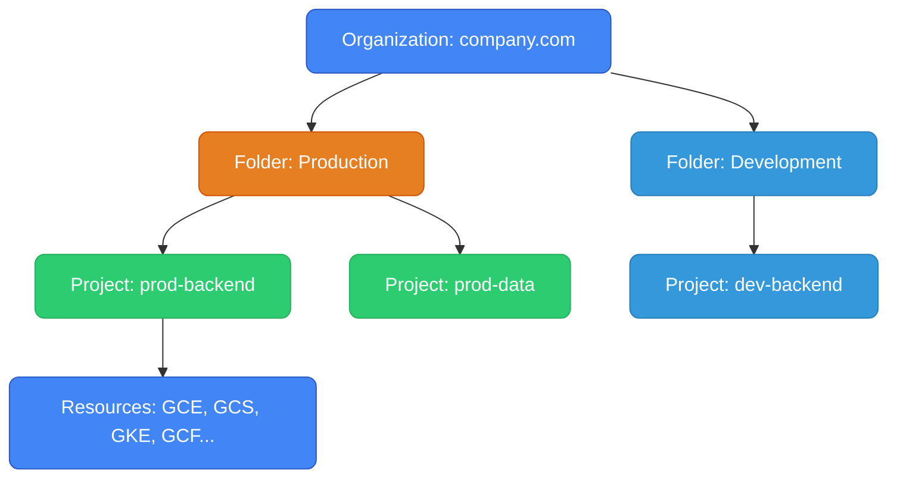

# GCP for AWS Engineers — Mental Model Shift

Everything you know from AWS transfers — but several core abstractions work differently. This guide focuses on the paradigm shifts, not the feature lists.

---

## The Mental Model Shifts

```
AWS Mental Model                     GCP Mental Model
──────────────────────────────────────────────────────────────
VPC is regional                   → VPC is GLOBAL (one VPC, subnets per region)
Public/private subnets             → No such distinction (it's about external IPs)
Security Groups on ENI             → Firewall rules on the network, filtered by tag/SA
NACLs at subnet                    → No NACLs in GCP (stateful firewall only)
Regions are siloed                 → Regions share one VPC natively
IAM explicit Deny wins             → GCP IAM is additive only (no explicit deny)
Reserved Instances for discounts   → Sustained use discounts auto-apply (no commitment)
Account = isolation boundary       → Project = isolation boundary
```

---

## 1. Resource Hierarchy

In AWS, accounts group under AWS Organizations. In GCP:

```
AWS Organizations                   GCP
───────────────────────────────────────────────
Management Account                  Organization (domain.com)
Organizational Unit (OU)            Folder
Member Account                      Project
Resources in account                Resources in project
SCPs (deny at org/OU level)         Org policies (constraint-based)
```

**Project** is the fundamental billing and IAM boundary in GCP. Every resource belongs to a project. A project has:
- A globally-unique project ID (you choose: `my-company-prod-backend`)
- An auto-generated project number (`123456789`)
- A billing account attached to it



IAM policies **inherit downward** — a binding at Org level applies to all folders, projects, and resources under it. Unlike AWS (where SCPs are deny-based), GCP org policies are constraint-based (e.g., "only allow VMs in these regions").

```bash
# Create a project under an org
gcloud projects create my-company-prod-backend \
  --name="Production Backend" \
  --organization=123456789

# Set active project for gcloud
gcloud config set project my-company-prod-backend
```

---

## 2. IAM — Additive Only

GCP IAM = **member + role → resource**. Three rule types:

| Role type | Example | When to use |
|-----------|---------|-------------|
| Primitive | `roles/owner`, `roles/editor` | Never in prod. Avoid. |
| Predefined | `roles/storage.objectViewer` | Standard choice. Google-managed granularity. |
| Custom | `compute.instances.get` only | Least-privilege in security-sensitive environments. |

### The Critical Difference from AWS IAM

**AWS**: explicit `Deny` overrides `Allow`. You can grant `*` then deny specific actions.

**GCP**: policies are **additive**. If one binding grants read and another grants write, the user has both. There is no explicit Deny in standard IAM. You cannot revoke a permission granted at a higher level.

```
AWS pattern (does NOT exist in GCP):
  Allow: *
  Deny: iam:DeleteRole        ← this doesn't work in GCP

GCP approach: grant only what's needed, nothing more.
```

### Policy Binding Example

```json
{
  "bindings": [
    {
      "role": "roles/storage.objectViewer",
      "members": [
        "serviceAccount:my-app@my-project.iam.gserviceaccount.com",
        "user:eng@company.com"
      ]
    },
    {
      "role": "roles/bigquery.dataViewer",
      "members": ["group:data-team@company.com"]
    }
  ]
}
```

```bash
# Grant a predefined role on a project
gcloud projects add-iam-policy-binding my-project \
  --member="serviceAccount:my-app@my-project.iam.gserviceaccount.com" \
  --role="roles/storage.objectViewer"

# Grant on a specific resource (bucket)
gcloud storage buckets add-iam-policy-binding gs://my-bucket \
  --member="serviceAccount:my-app@my-project.iam.gserviceaccount.com" \
  --role="roles/storage.objectAdmin"
```

### Service Accounts = EC2 Instance Profiles

A GCE VM or GKE pod runs *as* a service account. The service account is both an identity (for IAM bindings) and a credential source (for GCP SDKs). Never use service account key files on GCE/GKE — use the metadata server.

```bash
# Create SA
gcloud iam service-accounts create my-app-sa \
  --display-name="My App"

# Attach to a GCE VM at creation
gcloud compute instances create my-vm \
  --service-account=my-app-sa@project.iam.gserviceaccount.com \
  --scopes=cloud-platform
```

### Workload Identity = GCP's IRSA

GKE pods authenticate to GCP APIs without any key files via Workload Identity. A Kubernetes ServiceAccount is bound to a GCP Service Account.

```
Pod → K8s ServiceAccount → bound to → GCP Service Account → IAM roles → GCP APIs
```

```bash
# 1. Create GCP SA
gcloud iam service-accounts create my-app-sa --project=my-project

# 2. Grant it permissions
gcloud storage buckets add-iam-policy-binding gs://my-bucket \
  --member="serviceAccount:my-app-sa@my-project.iam.gserviceaccount.com" \
  --role="roles/storage.objectAdmin"

# 3. Bind K8s SA → GCP SA (the key step)
gcloud iam service-accounts add-iam-policy-binding \
  my-app-sa@my-project.iam.gserviceaccount.com \
  --role="roles/iam.workloadIdentityUser" \
  --member="serviceAccount:my-project.svc.id.goog[default/my-k8s-sa]"

# 4. Annotate K8s ServiceAccount
kubectl annotate serviceaccount my-k8s-sa \
  iam.gke.io/gcp-service-account=my-app-sa@my-project.iam.gserviceaccount.com
```

Pods using `my-k8s-sa` now automatically get GCP credentials. No secret files, no env vars.

---

## 3. Networking — The Biggest Paradigm Shift

### Global VPC

```
AWS:                                    GCP:
us-east-1 VPC (10.0.0.0/16)            One VPC "my-vpc" (global)
├── us-east-1a subnet (public)          ├── us-central1 subnet (10.0.1.0/24)
├── us-east-1b subnet (private)         ├── europe-west1 subnet (10.1.0.0/24)
eu-west-1 VPC (10.1.0.0/16) ←──────    └── asia-east1 subnet (10.2.0.0/24)
  (separate VPC, needs TGW/peering)          ↑ all same VPC, no peering needed
```

A VM in `us-central1` reaches a VM in `europe-west1` using private IPs — traffic stays on Google's backbone, no peering to configure.

```bash
# Always use custom mode VPC (auto mode has fixed CIDRs you can't control)
gcloud compute networks create my-vpc --subnet-mode=custom

# Add subnets per region as you expand
gcloud compute networks subnets create us-subnet \
  --network=my-vpc --region=us-central1 --range=10.0.1.0/24

gcloud compute networks subnets create eu-subnet \
  --network=my-vpc --region=europe-west1 --range=10.1.0.0/24
```

### Firewall Rules — Not SGs

AWS Security Groups attach to ENIs. GCP firewall rules are network-wide, applied to VMs by **tag** or **service account**:

```bash
# Tag-based (convenient but less secure — anyone with VM edit can change tags)
gcloud compute firewall-rules create allow-frontend-to-backend \
  --network=my-vpc \
  --direction=INGRESS \
  --action=ALLOW \
  --target-tags=backend \
  --source-tags=frontend \
  --rules=tcp:8080

# SA-based (more secure — tied to VM identity, not mutable metadata)
gcloud compute firewall-rules create allow-frontend-to-backend-sa \
  --network=my-vpc \
  --direction=INGRESS \
  --action=ALLOW \
  --target-service-accounts=backend-sa@project.iam.gserviceaccount.com \
  --source-service-accounts=frontend-sa@project.iam.gserviceaccount.com \
  --rules=tcp:8080
```

| | GCP Firewall Rule | AWS Security Group |
|--|---|---|
| **Scope** | Network-wide, filtered by tag/SA | Attached to specific ENI |
| **Allow/Deny** | Both | Allow only |
| **Priority** | Explicit numeric (lower = higher priority) | No priority, union of allows |
| **Stateful** | Yes | Yes |
| **Subnet filter** | No (no NACLs in GCP) | NACLs at subnet boundary |

### No "Public Subnet" Concept

In AWS, a public subnet routes to IGW. In GCP, there's no such routing concept:
- "Public" VM = has an external IP assigned
- "Private" VM = no external IP, uses Cloud NAT for outbound

```bash
# Cloud NAT = GCP's NAT Gateway
gcloud compute routers create my-router \
  --network=my-vpc --region=us-central1

gcloud compute routers nats create my-nat \
  --router=my-router \
  --region=us-central1 \
  --nat-all-subnet-ip-ranges \
  --auto-allocate-nat-external-ips
```

Cloud NAT is **distributed** — unlike AWS NAT Gateway (one per AZ), a single Cloud NAT is regional, auto-scales, and you never need to provision multiple for HA.

### Multi-VPC Patterns

| Goal | GCP | AWS |
|------|-----|-----|
| Connect two isolated VPCs | VPC Peering (no transitive routing) | VPC Peering (same) |
| Central network hub for many teams | **Shared VPC** | Transit Gateway |
| On-prem connectivity | Cloud VPN + Cloud Router (BGP) | Site-to-Site VPN + TGW |
| Private access to Google APIs | Private Google Access (subnet flag) | VPC Gateway Endpoint |
| Private access to specific service | Private Service Connect | Interface Endpoint (PrivateLink) |

**Shared VPC**: One host project owns the VPC and subnets. Service projects (teams) deploy workloads into the host's subnets. Centralized networking, decentralized compute. Better than TGW for multi-team same-cloud scenarios.

---

## 4. GCP vs AWS — Pricing Quirks

| Feature | AWS | GCP |
|---------|-----|-----|
| VM discount for long-running | Reserved Instances (1-3yr commit) | **Sustained use: automatic**, no commitment |
| Data warehouse idle cost | Redshift: pay per cluster-hour (always on) | BigQuery: $0 idle, pay per query ($5/TB) |
| Cross-zone egress (same region) | Charged | Free |
| K8s control plane | EKS: $0.10/hr ($73/mo) always | GKE Standard zonal: **free**; regional: $74/mo |
| Preemptible / Spot discount | Up to 90% | Up to 91% (Preemptible: 24hr max) |

---

## 5. CLI Quick Reference

```bash
# ── Auth ──────────────────────────────────────────────────────
aws configure                         → gcloud auth login
aws sts get-caller-identity           → gcloud auth list / gcloud config list

# ── Project (= AWS Account) ───────────────────────────────────
aws sts get-caller-identity           → gcloud config get-value project
                                        gcloud projects list

# ── Compute ───────────────────────────────────────────────────
aws ec2 describe-instances            → gcloud compute instances list
aws ec2 run-instances                 → gcloud compute instances create
aws ec2 terminate-instances           → gcloud compute instances delete
aws ec2 describe-images               → gcloud compute images list

# ── Storage ───────────────────────────────────────────────────
aws s3 ls                             → gsutil ls
aws s3 cp src s3://bucket/path        → gsutil cp src gs://bucket/path
aws s3 sync ./dir s3://bucket/        → gsutil rsync -r ./dir gs://bucket/

# ── Containers / K8s ──────────────────────────────────────────
aws eks update-kubeconfig             → gcloud container clusters get-credentials my-cluster --region us-central1
aws ecr get-login-password | docker login → gcloud auth configure-docker

# ── IAM ───────────────────────────────────────────────────────
aws iam list-roles                    → gcloud iam service-accounts list
aws sts assume-role                   → (transparent via Workload Identity)

# ── Logs ──────────────────────────────────────────────────────
aws logs filter-log-events            → gcloud logging read 'resource.type="k8s_container"'

# ── Secrets ───────────────────────────────────────────────────
aws secretsmanager get-secret-value   → gcloud secrets versions access latest --secret=my-secret

# ── Databases ─────────────────────────────────────────────────
aws rds describe-db-instances         → gcloud sql instances list
```

---

## Learning Path for AWS Engineers

```
Week 1 — Core Concepts
  from-aws.md (this file)     mental model shift, IAM, networking
  gcp/README.md               VPC deep-dive, firewall rules, Cloud NAT

Week 2 — Compute & Containers
  gcp/compute.md              GCE vs EC2, custom VMs, Spot VMs
  gcp/gke.md                  GKE modes, Workload Identity, NEG

Week 3 — Storage & Data
  gcp/storage.md              GCS, Persistent Disk, Filestore
  gcp/databases.md            Cloud SQL, Spanner, Firestore, Bigtable
  gcp/bigquery.md             serverless analytics deep-dive

Week 4 — Application Services
  gcp/serverless.md           Cloud Run, Cloud Functions
  gcp/messaging.md            Pub/Sub, Cloud Tasks, Eventarc
  gcp/observability.md        Cloud Monitoring, Logging, Trace

Week 5 — Comparison & Scenarios
  gcp/gcp-vs-aws.md           when to choose which
  gcp/scenarios.md            7 real debugging scenarios
```

The two concepts that take the longest to internalize coming from AWS:
1. **Global VPC** — stop thinking about cross-region connectivity as something you configure
2. **Additive IAM** — design least-privilege from the start; there is no "deny-all and punch holes" escape hatch
