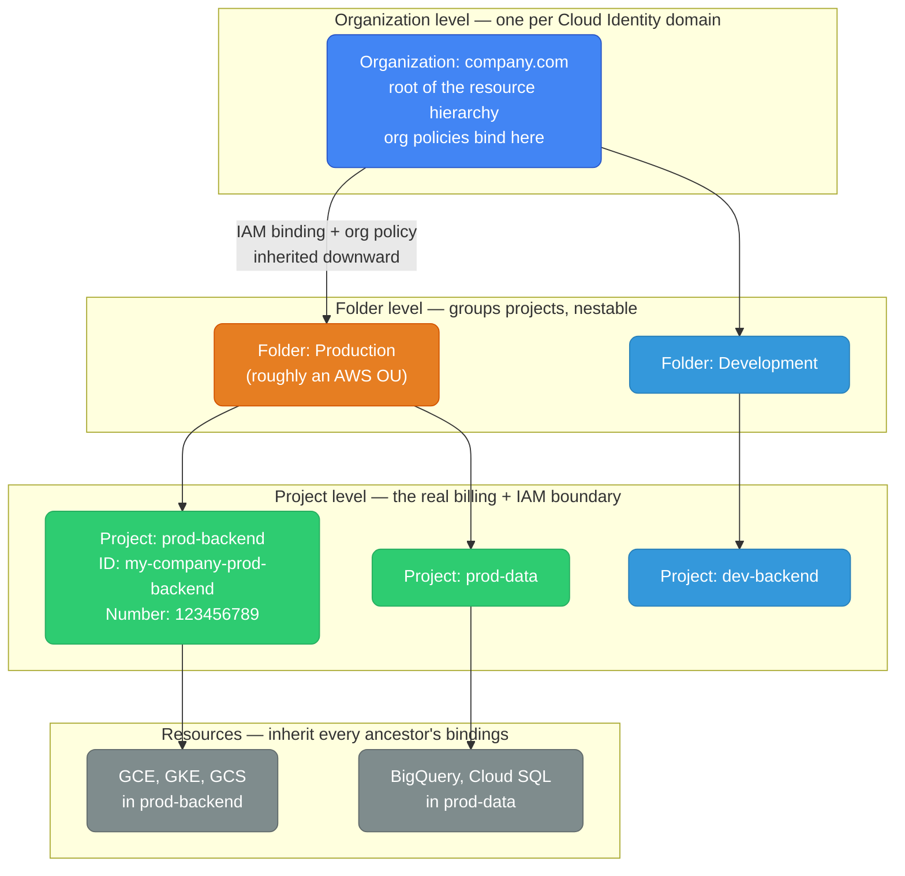
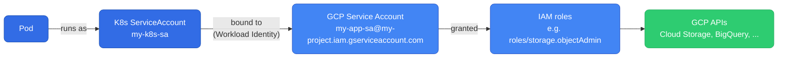
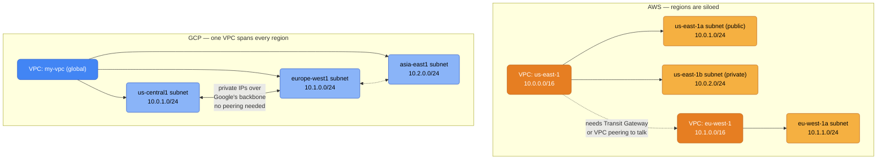

# GCP for AWS Engineers — Mental Model Shift

Everything you know from AWS transfers — but several core abstractions work differently. This guide focuses on the paradigm shifts, not the feature lists.

> For a flat service-by-service mapping table and "when to choose which," see the companion doc [`gcp-vs-aws.md`](./gcp-vs-aws.md). This file is the conceptual/mental-model view; that one is the lookup table.

<div class="quiz-progress" data-quiz-progress>
  <span class="quiz-progress-label">0/0 checks</span>
  <span class="quiz-progress-bar"><span class="quiz-progress-fill"></span></span>
</div>

---

## The Mental Model Shifts

| AWS mental model | GCP mental model |
|---|---|
| VPC is regional | VPC is **global** — one VPC, subnets per region |
| Public/private subnets | No such distinction — it's about whether a VM has an external IP |
| Security Groups on ENI | Firewall rules on the network, filtered by tag or service account |
| NACLs at subnet | No NACLs in GCP — stateful firewall rules only |
| Regions are siloed | Regions share one VPC natively |
| IAM explicit Deny wins | GCP IAM is additive only — no explicit deny |
| Reserved Instances for discounts | Sustained use discounts auto-apply — no commitment |
| Account = isolation boundary | Project = isolation boundary |

<div class="quiz-card">
  <p class="quiz-q">A team spins up VMs in <code>us-central1</code> and <code>europe-west1</code> inside the same GCP VPC. On AWS, reaching across two regions like this would mean two separate regional VPCs joined by peering or a Transit Gateway. Does the GCP setup need anything equivalent before the VMs can talk over private IPs?</p>
  <button class="quiz-reveal">Reveal answer</button>
  <div class="quiz-a" hidden>No. A GCP VPC is global — one VPC, subnets per region — and regions share it natively instead of being siloed the way AWS regions are. Traffic between the two subnets rides Google's own backbone using plain private IPs; there's no peering connection or Transit-Gateway-equivalent to provision first.</div>
</div>

---

## 1. Resource Hierarchy

In AWS, accounts group under AWS Organizations. In GCP, the same idea exists but the names — and a couple of the semantics — don't map one-to-one:

<div class="toggle-switch">
  <div class="toggle-buttons">
    <button data-toggle-opt="aws-org" class="active">AWS Organizations</button>
    <button data-toggle-opt="gcp-org">GCP</button>
  </div>
  <div class="toggle-panel active" data-toggle-panel="aws-org">
    <strong>Management Account</strong> — the root of the org, owns consolidated billing for every account underneath.<br/>
    <strong>Organizational Unit (OU)</strong> — groups member accounts so an SCP can target a whole group at once.<br/>
    <strong>Member Account</strong> — resources live here; this is the actual billing and isolation boundary.<br/>
    <strong>Resources</strong> live inside a member account.<br/>
    <strong>SCPs</strong> — deny-based guardrails attached at the org or OU level.
  </div>
  <div class="toggle-panel" data-toggle-panel="gcp-org">
    <strong>Organization</strong> (<code>domain.com</code>) — the root of the hierarchy, tied to your Cloud Identity / Workspace domain.<br/>
    <strong>Folder</strong> — groups projects, and folders can nest inside folders; roughly maps to an OU.<br/>
    <strong>Project</strong> — resources live here; this is the actual billing and isolation boundary in GCP.<br/>
    <strong>Resources</strong> live inside a project.<br/>
    <strong>Org policies</strong> — constraint-based guardrails (e.g. "only allow VMs in these regions"), inherited down the tree.
  </div>
</div>

**Project** is the fundamental billing and IAM boundary in GCP. Every resource belongs to a project. A project has:
- A globally-unique project ID (you choose: `my-company-prod-backend`)
- An auto-generated project number (`123456789`)
- A billing account attached to it



IAM policies **inherit downward** — a binding at Org level applies to all folders, projects, and resources under it. Unlike AWS (where SCPs are deny-based), GCP org policies are constraint-based (e.g., "only allow VMs in these regions").

To make that inheritance concrete, here's how GCP actually resolves a resource's *effective* IAM policy — the same walk-up-the-tree logic applies whether the resource is a GCS bucket, a Compute Engine VM, or a BigQuery dataset:

<div class="stepper">
  <div class="stepper-panels">
    <div class="stepper-panel active">
      <strong>1. Start at the resource.</strong> GCP collects any IAM bindings set directly on the resource itself — say, a specific GCS bucket. These apply no matter what else is going on higher up.
    </div>
    <div class="stepper-panel">
      <strong>2. Walk up to the Project.</strong> Every binding on the resource's project is added to the set. Nothing at the resource level can override or exclude a project-level binding.
    </div>
    <div class="stepper-panel">
      <strong>3. Walk up through each Folder.</strong> If the project sits inside nested folders, every binding on every ancestor folder — from the immediate parent up to the top-level folder — is added too.
    </div>
    <div class="stepper-panel">
      <strong>4. Walk up to the Organization.</strong> Bindings set at the Org root are added last, and they reach every folder, project, and resource underneath — there's no OU-style opt-out for a branch of the tree.
    </div>
    <div class="stepper-panel">
      <strong>5. Union, never subtract.</strong> The resource's effective permissions are the union of every binding collected along the way. Because GCP IAM is additive-only, nothing encountered at a lower level can revoke or narrow a binding granted higher up.
    </div>
  </div>
  <div class="stepper-controls">
    <button class="stepper-prev">← Prev</button>
    <span class="stepper-dots"></span>
    <span class="stepper-label"></span>
    <button class="stepper-next">Next →</button>
  </div>
</div>

```bash
# Create a project under an org
gcloud projects create my-company-prod-backend \
  --name="Production Backend" \
  --organization=123456789

# Set active project for gcloud
gcloud config set project my-company-prod-backend
```

<div class="quiz-card">
  <p class="quiz-q">A binding granting <code>roles/viewer</code> is set at the Organization level. Three levels down (Org → Folder → Folder → Project), a project has no bindings of its own for that user. Can the user still view resources in that project?</p>
  <button class="quiz-reveal">Reveal answer</button>
  <div class="quiz-a" hidden>Yes. IAM policies inherit downward in GCP — a binding at the Org level applies to every folder, project, and resource beneath it automatically, with no need to re-grant it at each level down the tree. The resource's effective policy is the union of its own bindings plus every ancestor's bindings, all the way up to the Org.</div>
</div>

---

## 2. IAM — Additive Only

GCP IAM = **member + role → resource**. Three rule types:

| Role type | Example | When to use |
|-----------|---------|-------------|
| Primitive | `roles/owner`, `roles/editor` | Never in prod. Avoid. |
| Predefined | `roles/storage.objectViewer` | Standard choice. Google-managed granularity. |
| Custom | `compute.instances.get` only | Least-privilege in security-sensitive environments. |

### The Critical Difference from AWS IAM

**AWS**: explicit `Deny` overrides `Allow`. You can grant `*` then deny specific actions.

**GCP**: policies are **additive**. If one binding grants read and another grants write, the user has both. There is no explicit Deny in standard IAM. You cannot revoke a permission granted at a higher level.

<div class="toggle-switch">
  <div class="toggle-buttons">
    <button data-toggle-opt="aws-iam" class="active">AWS: allow + deny</button>
    <button data-toggle-opt="gcp-iam">GCP: additive only</button>
  </div>
  <div class="toggle-panel active" data-toggle-panel="aws-iam">
    Grant broadly, then carve out an exception:
    <pre><code>Allow: *
Deny: iam:DeleteRole</code></pre>
    The explicit <code>Deny</code> wins no matter which policy granted the <code>Allow</code>, or at what level it was attached.
  </div>
  <div class="toggle-panel" data-toggle-panel="gcp-iam">
    That pattern <strong>does not exist</strong> in standard GCP IAM. There is no explicit Deny — every binding, from every source, at every level, only ever adds permissions, and you cannot revoke a permission granted at a higher level. The only way to keep access narrow is the GCP approach: grant only what's needed, nothing more.
  </div>
</div>

<div class="quiz-card">
  <p class="quiz-q">You grant a service account <code>roles/editor</code> on a project, then try to lock it down by adding a binding that denies <code>iam.serviceAccounts.delete</code> — the way you'd bolt an explicit Deny onto an AWS IAM policy. Does this narrow the service account's access in GCP?</p>
  <button class="quiz-reveal">Reveal answer</button>
  <div class="quiz-a" hidden>No — and this is the single biggest IAM gotcha coming from AWS. Standard GCP IAM has no explicit Deny; every binding, at every level, only ever adds permissions, and you cannot revoke a permission granted at a higher level. The only real fix is to never grant the broad role in the first place — design least-privilege from the start, since there's no "deny-all and punch holes" escape hatch in GCP.</div>
</div>

### Policy Binding Example

```json
{
  "bindings": [
    {
      "role": "roles/storage.objectViewer",
      "members": [
        "serviceAccount:my-app@my-project.iam.gserviceaccount.com",
        "user:eng@company.com"
      ]
    },
    {
      "role": "roles/bigquery.dataViewer",
      "members": ["group:data-team@company.com"]
    }
  ]
}
```

```bash
# Grant a predefined role on a project
gcloud projects add-iam-policy-binding my-project \
  --member="serviceAccount:my-app@my-project.iam.gserviceaccount.com" \
  --role="roles/storage.objectViewer"

# Grant on a specific resource (bucket)
gcloud storage buckets add-iam-policy-binding gs://my-bucket \
  --member="serviceAccount:my-app@my-project.iam.gserviceaccount.com" \
  --role="roles/storage.objectAdmin"
```

### Service Accounts = EC2 Instance Profiles

A GCE VM or GKE pod runs *as* a service account. The service account is both an identity (for IAM bindings) and a credential source (for GCP SDKs). Never use service account key files on GCE/GKE — use the metadata server.

```bash
# Create SA
gcloud iam service-accounts create my-app-sa \
  --display-name="My App"

# Attach to a GCE VM at creation
gcloud compute instances create my-vm \
  --service-account=my-app-sa@project.iam.gserviceaccount.com \
  --scopes=cloud-platform
```

### Workload Identity = GCP's IRSA

GKE pods authenticate to GCP APIs without any key files via Workload Identity. A Kubernetes ServiceAccount is bound to a GCP Service Account.



<div class="stepper">
  <div class="stepper-panels">
    <div class="stepper-panel active">
      <strong>1. Create the GCP service account.</strong>
      <pre><code>gcloud iam service-accounts create my-app-sa --project=my-project</code></pre>
    </div>
    <div class="stepper-panel">
      <strong>2. Grant it permissions.</strong> Same kind of IAM binding you'd use anywhere else — this SA can now read/write the bucket.
      <pre><code>gcloud storage buckets add-iam-policy-binding gs://my-bucket \
  --member="serviceAccount:my-app-sa@my-project.iam.gserviceaccount.com" \
  --role="roles/storage.objectAdmin"</code></pre>
    </div>
    <div class="stepper-panel">
      <strong>3. Bind the K8s ServiceAccount to the GCP ServiceAccount — the key step.</strong> This is what makes Workload Identity work: it lets one specific Kubernetes SA impersonate the GCP SA, and nothing else.
      <pre><code>gcloud iam service-accounts add-iam-policy-binding \
  my-app-sa@my-project.iam.gserviceaccount.com \
  --role="roles/iam.workloadIdentityUser" \
  --member="serviceAccount:my-project.svc.id.goog[default/my-k8s-sa]"</code></pre>
    </div>
    <div class="stepper-panel">
      <strong>4. Annotate the K8s ServiceAccount.</strong> This tells GKE which GCP SA a pod using <code>my-k8s-sa</code> should authenticate as.
      <pre><code>kubectl annotate serviceaccount my-k8s-sa \
  iam.gke.io/gcp-service-account=my-app-sa@my-project.iam.gserviceaccount.com</code></pre>
    </div>
  </div>
  <div class="stepper-controls">
    <button class="stepper-prev">← Prev</button>
    <span class="stepper-dots"></span>
    <span class="stepper-label"></span>
    <button class="stepper-next">Next →</button>
  </div>
</div>

Pods using `my-k8s-sa` now automatically get GCP credentials. No secret files, no env vars.

---

## 3. Networking — The Biggest Paradigm Shift

### Global VPC



A VM in `us-central1` reaches a VM in `europe-west1` using private IPs — traffic stays on Google's backbone, no peering to configure.

```bash
# Always use custom mode VPC (auto mode has fixed CIDRs you can't control)
gcloud compute networks create my-vpc --subnet-mode=custom

# Add subnets per region as you expand
gcloud compute networks subnets create us-subnet \
  --network=my-vpc --region=us-central1 --range=10.0.1.0/24

gcloud compute networks subnets create eu-subnet \
  --network=my-vpc --region=europe-west1 --range=10.1.0.0/24
```

### Firewall Rules — Not SGs

AWS Security Groups attach to ENIs. GCP firewall rules are network-wide, applied to VMs by **tag** or **service account**:

```bash
# Tag-based (convenient but less secure — anyone with VM edit can change tags)
gcloud compute firewall-rules create allow-frontend-to-backend \
  --network=my-vpc \
  --direction=INGRESS \
  --action=ALLOW \
  --target-tags=backend \
  --source-tags=frontend \
  --rules=tcp:8080

# SA-based (more secure — tied to VM identity, not mutable metadata)
gcloud compute firewall-rules create allow-frontend-to-backend-sa \
  --network=my-vpc \
  --direction=INGRESS \
  --action=ALLOW \
  --target-service-accounts=backend-sa@project.iam.gserviceaccount.com \
  --source-service-accounts=frontend-sa@project.iam.gserviceaccount.com \
  --rules=tcp:8080
```

| | GCP Firewall Rule | AWS Security Group |
|--|---|---|
| **Scope** | Network-wide, filtered by tag/SA | Attached to specific ENI |
| **Allow/Deny** | Both | Allow only |
| **Priority** | Explicit numeric (lower = higher priority) | No priority, union of allows |
| **Stateful** | Yes | Yes |
| **Subnet filter** | No (no NACLs in GCP) | NACLs at subnet boundary |

### No "Public Subnet" Concept

In AWS, a public subnet routes to IGW. In GCP, there's no such routing concept:
- "Public" VM = has an external IP assigned
- "Private" VM = no external IP, uses Cloud NAT for outbound

```bash
# Cloud NAT = GCP's NAT Gateway
gcloud compute routers create my-router \
  --network=my-vpc --region=us-central1

gcloud compute routers nats create my-nat \
  --router=my-router \
  --region=us-central1 \
  --nat-all-subnet-ip-ranges \
  --auto-allocate-nat-external-ips
```

Cloud NAT is **distributed** — unlike AWS NAT Gateway (one per AZ), a single Cloud NAT is regional, auto-scales, and you never need to provision multiple for HA.

### Multi-VPC Patterns

| Goal | GCP | AWS |
|------|-----|-----|
| Connect two isolated VPCs | VPC Peering (no transitive routing) | VPC Peering (same) |
| Central network hub for many teams | **Shared VPC** | Transit Gateway |
| On-prem connectivity | Cloud VPN + Cloud Router (BGP) | Site-to-Site VPN + TGW |
| Private access to Google APIs | Private Google Access (subnet flag) | VPC Gateway Endpoint |
| Private access to specific service | Private Service Connect | Interface Endpoint (PrivateLink) |

**Shared VPC**: One host project owns the VPC and subnets. Service projects (teams) deploy workloads into the host's subnets. Centralized networking, decentralized compute. Better than TGW for multi-team same-cloud scenarios.

<div class="quiz-card">
  <p class="quiz-q">Your teammate says GCP firewall rules are basically AWS Security Groups with different CLI syntax. What capability do GCP firewall rules have that AWS Security Groups don't?</p>
  <button class="quiz-reveal">Reveal answer</button>
  <div class="quiz-a" hidden>Explicit Deny rules with numeric priority. AWS Security Groups are allow-only, with no priority ordering — just a union of every allow rule attached. GCP firewall rules can both ALLOW and DENY, and each rule carries an explicit numeric priority where lower numbers win when rules conflict.</div>
</div>

---

## 4. GCP vs AWS — Pricing Quirks

| Feature | AWS | GCP |
|---------|-----|-----|
| VM discount for long-running | Reserved Instances (1-3yr commit) | **Sustained use: automatic**, no commitment |
| Data warehouse idle cost | Redshift: pay per cluster-hour (always on) | BigQuery: $0 idle, pay per query ($5/TB) |
| Cross-zone egress (same region) | Charged | Free |
| K8s control plane | EKS: $0.10/hr ($73/mo) always | GKE: $0.10/hr ($73/mo) per cluster; **one free zonal cluster** per billing account |
| Preemptible / Spot discount | Up to 90% | Up to 91% (legacy Preemptible had a 24hr cap; **Spot VMs**, the successor, have no time limit) |

<div class="quiz-card">
  <p class="quiz-q">To get GCP's discount for long-running VMs, do you need to pre-purchase a 1-3 year commitment the way you would with an AWS Reserved Instance?</p>
  <button class="quiz-reveal">Reveal answer</button>
  <div class="quiz-a" hidden>No. GCP's sustained use discount applies automatically based on how much of the billing month a VM actually runs — there's no upfront commitment or reservation to purchase. AWS's Reserved Instance discount, by contrast, requires committing to that 1-3yr term upfront regardless of whether you end up using the instance the whole time.</div>
</div>

---

## 5. CLI Quick Reference

```bash
# ── Auth ──────────────────────────────────────────────────────
aws configure                         → gcloud auth login
aws sts get-caller-identity           → gcloud auth list / gcloud config list

# ── Project (= AWS Account) ───────────────────────────────────
aws sts get-caller-identity           → gcloud config get-value project
                                        gcloud projects list

# ── Compute ───────────────────────────────────────────────────
aws ec2 describe-instances            → gcloud compute instances list
aws ec2 run-instances                 → gcloud compute instances create
aws ec2 terminate-instances           → gcloud compute instances delete
aws ec2 describe-images               → gcloud compute images list

# ── Storage ───────────────────────────────────────────────────
aws s3 ls                             → gsutil ls
aws s3 cp src s3://bucket/path        → gsutil cp src gs://bucket/path
aws s3 sync ./dir s3://bucket/        → gsutil rsync -r ./dir gs://bucket/

# ── Containers / K8s ──────────────────────────────────────────
aws eks update-kubeconfig             → gcloud container clusters get-credentials my-cluster --region us-central1
aws ecr get-login-password | docker login → gcloud auth configure-docker

# ── IAM ───────────────────────────────────────────────────────
aws iam list-roles                    → gcloud iam service-accounts list
aws sts assume-role                   → (transparent via Workload Identity)

# ── Logs ──────────────────────────────────────────────────────
aws logs filter-log-events            → gcloud logging read 'resource.type="k8s_container"'

# ── Secrets ───────────────────────────────────────────────────
aws secretsmanager get-secret-value   → gcloud secrets versions access latest --secret=my-secret

# ── Databases ─────────────────────────────────────────────────
aws rds describe-db-instances         → gcloud sql instances list
```

---

## Learning Path for AWS Engineers

```
Week 1 — Core Concepts
  from-aws.md (this file)     mental model shift, IAM, networking
  gcp/README.md               VPC deep-dive, firewall rules, Cloud NAT

Week 2 — Compute & Containers
  gcp/compute.md              GCE vs EC2, custom VMs, Spot VMs
  gcp/gke.md                  GKE modes, Workload Identity, NEG

Week 3 — Storage & Data
  gcp/storage.md              GCS, Persistent Disk, Filestore
  gcp/databases.md            Cloud SQL, Spanner, Firestore, Bigtable
  gcp/bigquery.md             serverless analytics deep-dive

Week 4 — Application Services
  gcp/serverless.md           Cloud Run, Cloud Functions
  gcp/messaging.md            Pub/Sub, Cloud Tasks, Eventarc
  gcp/observability.md        Cloud Monitoring, Logging, Trace

Week 5 — Comparison & Scenarios
  gcp/gcp-vs-aws.md           when to choose which
  gcp/scenarios.md            7 real debugging scenarios
```

The two concepts that take the longest to internalize coming from AWS:
1. **Global VPC** — stop thinking about cross-region connectivity as something you configure
2. **Additive IAM** — design least-privilege from the start; there is no "deny-all and punch holes" escape hatch
