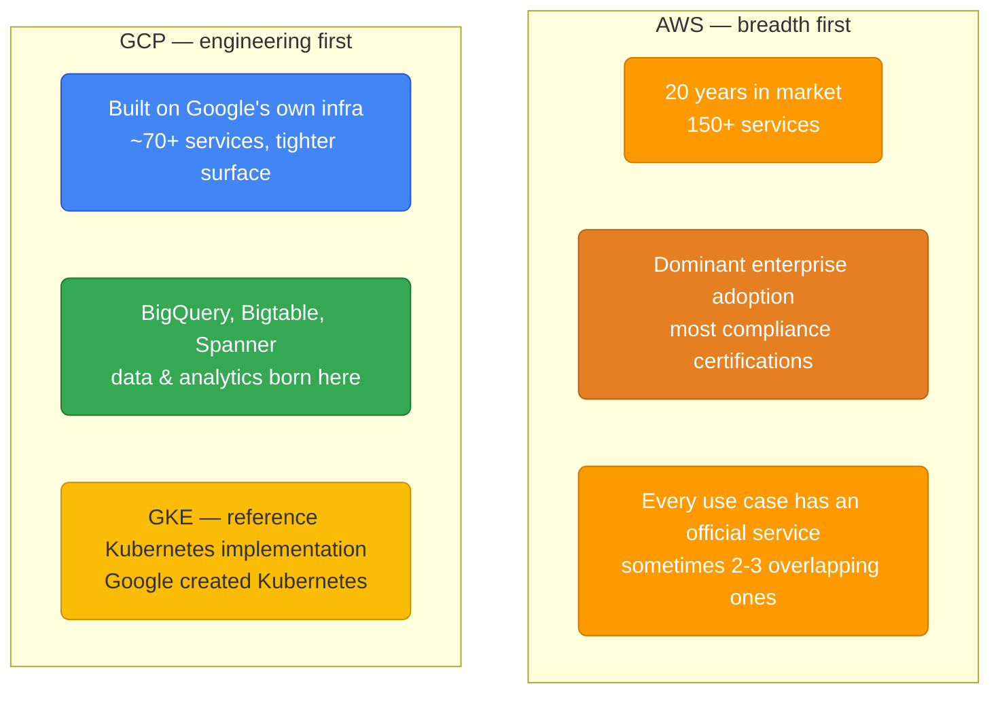
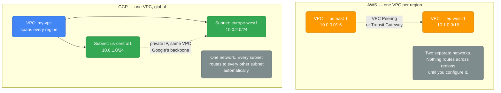

# GCP vs AWS — Service Comparison

> This is the service-mapping lookup table. For the conceptual mental-model shifts an AWS engineer needs (resource hierarchy, additive IAM, global VPC, pricing model differences), see the companion doc [`from-aws.md`](./from-aws.md).

  0/0 checks
  

## Core Philosophy Difference

| Dimension | AWS | GCP |
|-----------|-----|-----|
| Market share (cloud infra, ~2024) | ~32% | ~11% |
| Enterprise adoption | Dominant | Growing |
| Kubernetes | EKS (solid) | GKE (best-in-class, invented K8s) |
| Data/Analytics | Redshift, Athena, EMR | BigQuery (simpler, often cheaper) |
| ML/AI | SageMaker, Bedrock | Vertex AI, TPUs, best for training |
| Networking | Complex but powerful | Global VPC, simpler model |
| Pricing | Pay-per-resource | Sustained use discounts automatic |

  
AWS has roughly 3x GCP's cloud market share. Does that mean AWS's Kubernetes and data-warehouse offerings are technically ahead of GCP's equivalents?

  <button class="quiz-reveal">Reveal answer</button>
  
No. Market share reflects adoption and enterprise dominance, not per-category technical superiority. GKE is widely considered best-in-class because Google created Kubernetes itself, and BigQuery is often simpler and cheaper than Redshift for analytics. AWS wins on breadth (150+ services, most mature ecosystem) — GCP wins on depth in the specific areas it built its own infrastructure around.

---

## Service-by-Service Mapping

### Compute

| Use case | AWS | GCP |
|---------|-----|-----|
| VMs | EC2 | Compute Engine |
| Managed K8s | EKS | GKE |
| Serverless containers | Fargate, App Runner | Cloud Run |
| Serverless functions | Lambda | Cloud Functions |
| Batch compute | Batch | Cloud Batch |
| Spot/preemptible VMs | Spot Instances | Preemptible VMs (Spot VMs) |

### Storage and Databases

| Use case | AWS | GCP |
|---------|-----|-----|
| Object storage | S3 | Cloud Storage |
| Block storage | EBS | Persistent Disk |
| File storage | EFS | Filestore |
| Relational DB | RDS | Cloud SQL |
| Managed Postgres | Aurora Postgres | Cloud Spanner, AlloyDB |
| Global ACID DB | Aurora Global | Spanner (better: true global) |
| NoSQL key-value | DynamoDB | Firestore, Bigtable |
| Wide-column | DynamoDB single-table | Bigtable (better for time-series) |
| Data warehouse | Redshift | BigQuery |
| In-memory cache | ElastiCache | Memorystore (Redis/Memcached) |
| Time-series | Timestream | Bigtable |

### Networking

| Use case | AWS | GCP |
|---------|-----|-----|
| VPC | VPC (region-scoped) | VPC (global — one VPC, all regions) |
| Load balancer | ALB/NLB/CLB | Cloud Load Balancing |
| CDN | CloudFront | Cloud CDN |
| DNS | Route 53 | Cloud DNS |
| Private connectivity | PrivateLink, VPN | Private Service Connect, Cloud VPN |
| Cross-region connectivity | Transit Gateway | Cloud Router + HA VPN |

### Key networking difference:

  

    <button data-toggle-opt="aws-vpc" class="active state-warn">AWS — Regional VPC</button>
    <button data-toggle-opt="gcp-vpc" class="state-ok">GCP — Global VPC</button>
  

  

    A VPC is scoped to a single region. <code>us-east-1</code> and <code>eu-west-1</code> are two separate networks with separate CIDR ranges — nothing routes between them until you explicitly set up VPC Peering or attach both to a Transit Gateway, then update route tables on both sides. Every additional region repeats this setup.
  

  

    A VPC spans every region by default. Add a subnet in a new region and it's already reachable from every existing subnet in the same VPC over Google's backbone — no peering, no Transit Gateway, no route table changes. This is the networking advantage the doc keeps coming back to.
  

  

    

      <strong>1. Provision a VPC per region.</strong> A VPC in <code>us-east-1</code> (<code>10.0.0.0/16</code>) and a separate VPC in <code>eu-west-1</code> (<code>10.1.0.0/16</code>) start out as two isolated networks — nothing routes between them by default.
    

    

      <strong>2. Connect them explicitly.</strong> Set up VPC Peering for a one-off pair, or attach both VPCs to a Transit Gateway if you expect more than a couple of regions.
    

    

      <strong>3. Update route tables and security groups.</strong> Peering or a Transit Gateway attachment alone doesn't move traffic — both VPCs need route table entries pointing at the new link, and security groups/NACLs need to allow the cross-VPC traffic.
    

    

      <strong>4. Repeat for every new region.</strong> Expanding into a third region means a third VPC, another peering connection or Transit Gateway attachment, and another round of route table and security group updates.
    

    

      <strong>5. Compare to GCP.</strong> The global-VPC equivalent of all four steps above is one action: add a subnet in the new region to the existing VPC. Every other subnet in that VPC can already reach it — no peering, no Transit Gateway, no route tables to touch.
    

  

  

    <button class="stepper-prev">← Prev</button>
    
    
    <button class="stepper-next">Next →</button>
  

  
A GCP VPC already has subnets in us-central1 and europe-west1. Do you need to set up anything like VPC Peering or a Transit Gateway before a VM in one subnet can reach a VM in the other?

  <button class="quiz-reveal">Reveal answer</button>
  
No. A GCP VPC is global by default — both subnets already belong to the same VPC, so they route to each other automatically over Google's backbone. Peering (or its AWS equivalent, Transit Gateway) is only needed to connect two <em>separate</em> VPCs, which is the situation AWS is in every time you add a new region.

### Observability

| Use case | AWS | GCP |
|---------|-----|-----|
| Metrics | CloudWatch | Cloud Monitoring |
| Logs | CloudWatch Logs | Cloud Logging |
| Traces | X-Ray | Cloud Trace |
| Dashboards | CloudWatch | Cloud Monitoring, Grafana |
| Audit logs | CloudTrail | Cloud Audit Logs |

### AI/ML

| Use case | AWS | GCP |
|---------|-----|-----|
| ML platform | SageMaker | Vertex AI |
| LLM APIs | Bedrock (Claude, Llama, etc.) | Vertex AI (Gemini, etc.) |
| Custom training | SageMaker Training | Vertex AI Training, TPUs |
| TPU access | No | Yes (Google's custom AI chips) |
| Managed notebooks | SageMaker Studio | Vertex AI Workbench |

**GCP TPUs:** Google's Tensor Processing Units give 10-100× better price/performance for LLM training vs GPUs on any cloud. If you're training large models, GCP is often cheaper.

  
You want to train a large model and need TPU access. Can you provision TPUs on AWS?

  <button class="quiz-reveal">Reveal answer</button>
  
No. TPUs are Google's own custom AI accelerator chips and are GCP-exclusive — the service mapping lists TPU access as "No" for AWS. That exclusivity, combined with a 10-100× price/performance advantage over GPUs for LLM training, is the specific reason the doc calls GCP "often cheaper" for training large models.

---

## GCP Unique Advantages

### 1. Global VPC
Single VPC spanning all regions — no peering needed. Add a subnet in Tokyo, your London VM can reach it without configuration.

### 2. BigQuery Pricing
BigQuery: $5/TB scanned, $0.02/GB storage. AWS Redshift: $0.25/hour for smallest cluster (even when idle). For sporadic analytics, BigQuery is often 10× cheaper.

### 3. Sustained Use Discounts
GCP automatically gives discounts for VMs running >25% of the month — no upfront commitment required. AWS requires Reserved Instances (1-3 year commitment) for equivalent discounts.

### 4. GKE Quality
GKE gets Kubernetes features first (it's the reference implementation). Autopilot mode — true serverless Kubernetes — doesn't exist on AWS/Azure.

### 5. Spanner — True Global ACID
AWS Aurora Global has replication lag (seconds). Spanner provides globally consistent transactions with ~10ms latency using TrueTime (atomic clocks).

  
You provision the smallest Redshift cluster and a BigQuery dataset for the same sporadic analytics workload, then run zero queries all weekend. Which one keeps billing you?

  <button class="quiz-reveal">Reveal answer</button>
  
Redshift. It bills roughly $0.25/hour for the cluster whether or not a query runs — the compute is always on. BigQuery charges $0.02/GB for storage plus $5/TB for data actually scanned by a query; with no queries, there's no scan charge. That's the basis for the "often 10× cheaper for sporadic analytics" claim above.

---

## AWS Unique Advantages

### 1. Service breadth
AWS has services GCP doesn't: AppSync (GraphQL), Kinesis Data Firehose simplicity, CodePipeline, many enterprise integrations.

### 2. Enterprise ecosystem
AWS has the most ISV integrations, compliance certifications, and enterprise support.

### 3. Mature marketplace
AWS Marketplace has thousands of third-party products pre-configured.

### 4. On-premises hybrid
AWS Outposts, AWS Local Zones — better on-prem story than GCP Distributed Cloud.

  
A company has heavy existing on-premises infrastructure and wants the smoothest hybrid-cloud story. Per this doc, is that a point in AWS's or GCP's favor?

  <button class="quiz-reveal">Reveal answer</button>
  
AWS. Outposts and Local Zones give it a more mature on-prem/hybrid story than GCP's Distributed Cloud — one of the specific advantages listed under AWS's service breadth and enterprise ecosystem strengths.

---

## When to Choose Which

  

    <button data-tab="choose-aws" class="active">Choose AWS</button>
    <button data-tab="choose-gcp">Choose GCP</button>
  

  

    

      <ul>
        <li>Your team already knows AWS.</li>
        <li>You need maximum service breadth.</li>
        <li>Enterprise compliance requirements — AWS has the most certifications.</li>
        <li>Strong on-prem hybrid requirements.</li>
      </ul>
    

    

      <ul>
        <li>Analytics-heavy workload — BigQuery is hard to beat.</li>
        <li>K8s-native platform — GKE Autopilot, Workload Identity.</li>
        <li>Training large ML models — TPUs.</li>
        <li>Multi-region global application — global VPC simplicity.</li>
        <li>Cost optimization for data warehousing.</li>
      </ul>
    

  

  
You leave VMs running continuously all month on both AWS and GCP without pre-purchasing anything (no Reserved Instances, no committed-use contracts). Do both clouds discount that usage automatically?

  <button class="quiz-reveal">Reveal answer</button>
  
Only GCP. Sustained-use discounts apply automatically once a VM runs more than ~25% of the month — no commitment required. AWS needs you to actively purchase Reserved Instances (a 1-3 year commitment) to get an equivalent discount; a VM just left running on-demand pays full price the whole time.

