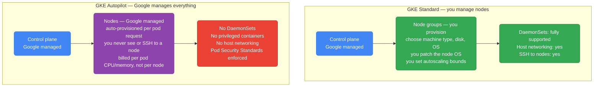
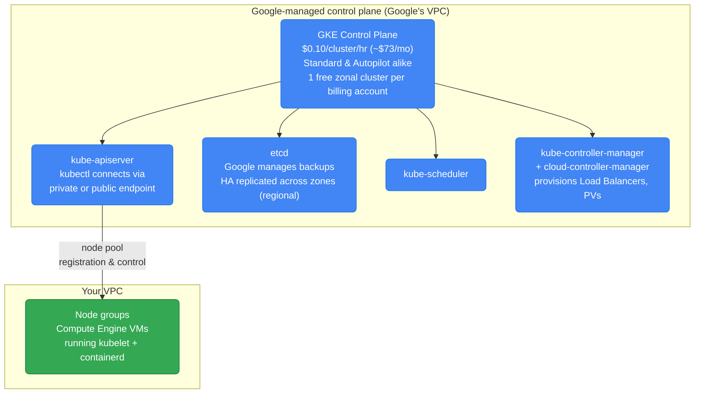
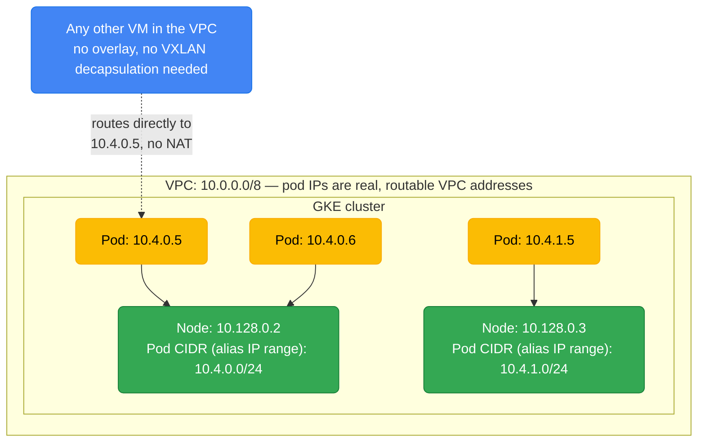
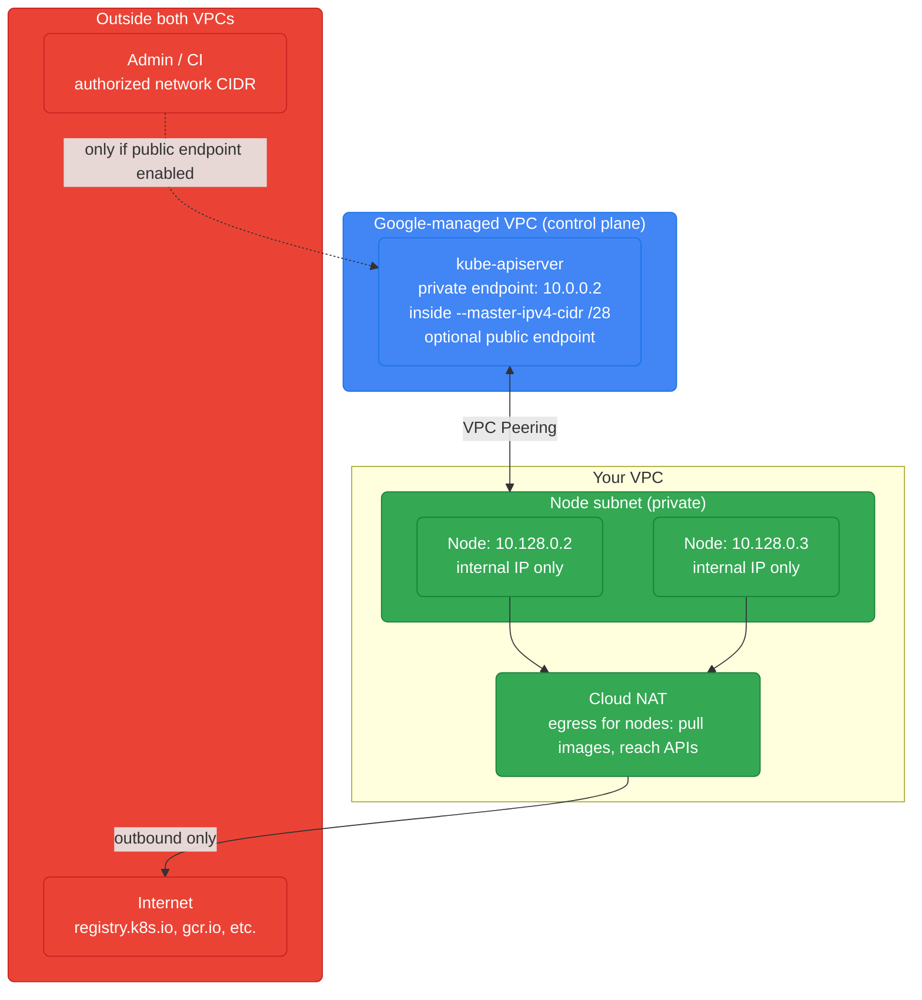
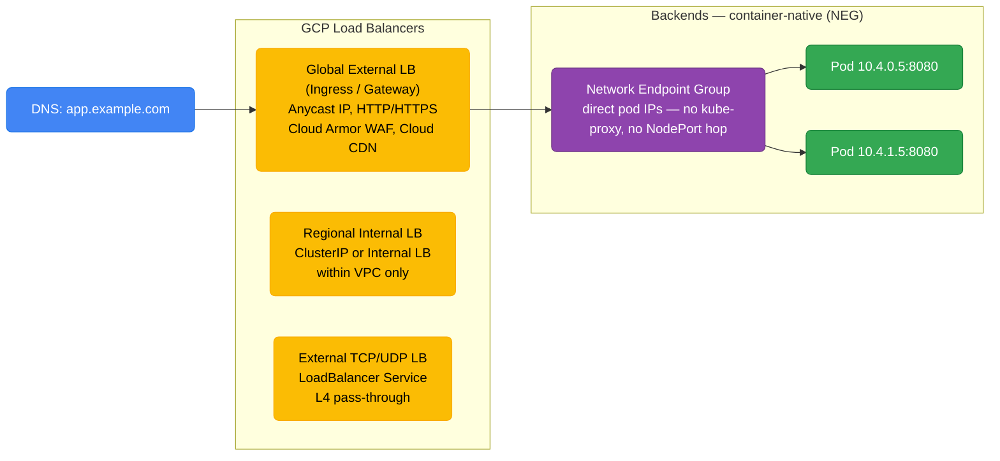
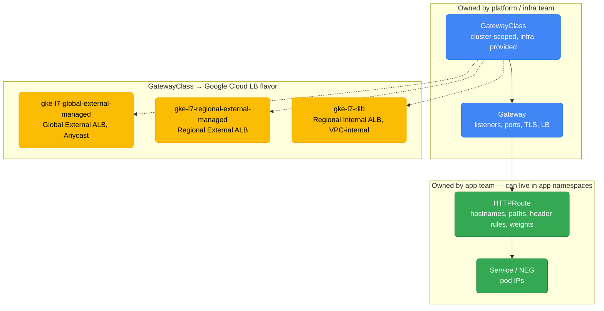

# GKE — Google Kubernetes Engine

GKE is GCP's managed Kubernetes. Google invented Kubernetes, so GKE gets features before any other cloud (Autopilot, Workload Identity, GKE Gateway, etc.).

<div class="quiz-progress" data-quiz-progress>
  <span class="quiz-progress-label">0/0 checks</span>
  <span class="quiz-progress-bar"><span class="quiz-progress-fill"></span></span>
</div>

---

## GKE Modes



| Feature | Standard | Autopilot |
|---------|---------|-----------|
| Node management | You | Google |
| Billing | Per node (whether idle or not) | Per pod (only what you use) |
| DaemonSets | Yes | No |
| Privileged pods | Yes | No |
| Custom node images | Yes | No |
| Best for | Complex workloads, AI/GPU, custom OS | Typical microservices, cost efficiency |

<div class="toggle-switch">
  <div class="toggle-buttons">
    <button data-toggle-opt="standard" class="active state-ok">Standard</button>
    <button data-toggle-opt="autopilot" class="state-warn">Autopilot</button>
  </div>
  <div class="toggle-panel active" data-toggle-panel="standard">
    You own the node pools: machine type, disk, OS image, and autoscaling bounds are all yours to tune. That control is exactly why Standard is the right call for GPU/TPU pools, workloads that need DaemonSets or host networking, or custom node images — none of which Autopilot allows. The tradeoff is billing: you pay for every provisioned node whether or not it's fully packed with pods.
  </div>
  <div class="toggle-panel" data-toggle-panel="autopilot">
    Google provisions and patches nodes on your behalf, sized to exactly what your pods request — you never see a Node object to SSH into. Billing follows pod CPU/memory requests instead of node capacity, which is why Autopilot tends to win on cost for typical, non-privileged microservices. The tradeoff is the same control you gave up: no DaemonSets, no privileged pods, no host networking, no picking a specific machine type.
  </div>
</div>

<div class="quiz-card">
  <p class="quiz-q">On GKE Autopilot, a node backing your workloads is only 40% utilized by pod requests. Are you billed for the other 60%, the way you would be on Standard?</p>
  <button class="quiz-reveal">Reveal answer</button>
  <div class="quiz-a" hidden>No. Autopilot bills per pod CPU/memory request, not per node — you never even see the underlying node to reason about its utilization. Standard is the mode where idle or underutilized node capacity is still billed, because you're paying for the VM itself, not just what's scheduled onto it.</div>
</div>

---

## Control Plane



<div class="toggle-switch">
  <div class="toggle-buttons">
    <button data-toggle-opt="zonal" class="active state-warn">Zonal cluster</button>
    <button data-toggle-opt="regional" class="state-ok">Regional cluster</button>
  </div>
  <div class="toggle-panel active" data-toggle-panel="zonal">
    Control plane runs in a single zone. A zone outage takes the API server down with it — no <code>kubectl apply</code>, no scaling, no rescheduling — but Pods and Services that are already running keep serving traffic, since the data plane doesn't depend on a live control plane to keep forwarding packets.
  </div>
  <div class="toggle-panel" data-toggle-panel="regional">
    Control plane is replicated across 3 zones. The cluster survives a single zone outage with the API server still reachable throughout. You pay for that resilience mainly in your own multi-zone node/compute footprint — the flat management fee doesn't change, since it already covers whichever control-plane footprint Google runs underneath you.
  </div>
</div>

**Cost, either way:** the $0.10/cluster/hr (~$73/mo) management fee applies to *all* clusters — Standard or Autopilot, zonal or regional — beyond the one free zonal cluster per billing account. Regional no longer carries a separate surcharge; you only pay more because it runs 3 control-plane replicas' worth of Google-managed infrastructure (included in the flat fee) plus your own multi-zone node/compute costs.

<div class="quiz-card">
  <p class="quiz-q">A zonal cluster's control-plane zone goes down. Do the Pods that were already running on your nodes go down with it?</p>
  <button class="quiz-reveal">Reveal answer</button>
  <div class="quiz-a" hidden>No — they keep serving traffic. What breaks is anything that needs the API server: kubectl, scaling, rescheduling a crashed pod, rolling a deployment. The data plane (kubelet, containerd, the running containers) doesn't depend on a live control plane moment-to-moment. This is exactly the gap a regional cluster closes, at the cost of running your own nodes across more than one zone.</div>
</div>

---

## Workload Identity — The Right Way to Access GCP APIs

Never put service account keys in pods. Workload Identity maps a K8s ServiceAccount to a GCP IAM Service Account.

```mermaid
sequenceDiagram
    autonumber
    participant POD as Pod (K8s SA: my-app)
    participant MDS as Metadata Server (169.254.169.254)
    participant STS as GCP STS
    participant API as Cloud Storage / BigQuery

    rect rgb(30, 60, 110)
    Note over POD,MDS: Trust boundary 1 — inside the cluster, no long-lived key ever leaves here
    POD->>MDS: GET /computeMetadata/v1/instance/service-accounts/default/token
    MDS->>MDS: mint a short-lived, cluster-signed<br/>Kubernetes projected token for "my-app"
    end
    rect rgb(90, 60, 20)
    Note over MDS,STS: Trust boundary 2 — GCP verifies the binding, not a static credential
    MDS->>STS: exchange K8s projected token for a GCP access token
    Note over MDS,STS: K8s SA "my-app" is bound to GCP SA "my-app@project.iam"<br/>via roles/iam.workloadIdentityUser
    STS-->>MDS: GCP access token, 1 hour TTL
    end
    MDS-->>POD: access token
    POD->>API: API call with access token
    Note right of API: API enforces whatever IAM roles<br/>are granted to my-app@project.iam, nothing more
```



<div class="stepper">
  <div class="stepper-panels">
    <div class="stepper-panel active">
      <strong>1. Bind, don't embed.</strong> An IAM policy binding on the GCP service account grants <code>roles/iam.workloadIdentityUser</code> to the specific <code>PROJECT.svc.id.goog[NAMESPACE/KSA_NAME]</code> identity — no key file is ever created or shipped to the pod.
    </div>
    <div class="stepper-panel">
      <strong>2. Annotate the Kubernetes ServiceAccount.</strong> <code>iam.gke.io/gcp-service-account=my-app-sa@PROJECT.iam.gserviceaccount.com</code> tells GKE which GCP identity this KSA is allowed to impersonate.
    </div>
    <div class="stepper-panel">
      <strong>3. Pod requests a token.</strong> Application code calls the standard GCP client library, which — unmodified — hits the local metadata server endpoint exactly as it would running on a plain GCE VM.
    </div>
    <div class="stepper-panel">
      <strong>4. Metadata server exchanges, not stores.</strong> GKE's metadata server mints a short-lived, cluster-signed token for that pod's KSA and swaps it with GCP STS for a real GCP access token, scoped only to the bound service account.
    </div>
    <div class="stepper-panel">
      <strong>5. Token expires in an hour.</strong> There's nothing long-lived to leak, rotate, or accidentally commit to a repo — a stolen access token is only useful for 60 minutes, and only for whatever the bound SA can already do.
    </div>
  </div>
  <div class="stepper-controls">
    <button class="stepper-prev">← Prev</button>
    <span class="stepper-dots"></span>
    <span class="stepper-label"></span>
    <button class="stepper-next">Next →</button>
  </div>
</div>

<div class="quiz-card">
  <p class="quiz-q">Why is Workload Identity considered strictly safer than mounting a downloaded GCP service-account key as a Kubernetes Secret?</p>
  <button class="quiz-reveal">Reveal answer</button>
  <div class="quiz-a" hidden>A downloaded key file is a long-lived credential — if it leaks (checked into git, dumped from etcd, copied off a compromised pod), it's valid until someone manually revokes it. Workload Identity never creates that file at all: the pod exchanges a short-lived, cluster-signed token for a GCP access token that expires in 1 hour. There's no static secret sitting anywhere to steal.</div>
</div>

```bash
# Setup Workload Identity
gcloud iam service-accounts create my-app-sa

# Bind K8s SA → GCP SA
gcloud iam service-accounts add-iam-policy-binding \
  my-app-sa@PROJECT.iam.gserviceaccount.com \
  --role roles/iam.workloadIdentityUser \
  --member "serviceAccount:PROJECT.svc.id.goog[NAMESPACE/KSA_NAME]"

# Annotate the K8s ServiceAccount
kubectl annotate serviceaccount KSA_NAME \
  iam.gke.io/gcp-service-account=my-app-sa@PROJECT.iam.gserviceaccount.com
```

---

## GKE Networking — VPC-Native (Alias IPs)



**Alias IPs:** Pod IPs are real VPC IPs — no overlay network, no encapsulation. Pods are directly routable from any VM in the VPC. No VXLAN overhead.

**This is different from EKS:** EKS VPC CNI also gives pods real VPC IPs (similar), but the default pod CIDR is a secondary range rather than alias IPs.

<div class="quiz-card">
  <p class="quiz-q">A plain Compute Engine VM elsewhere in the same VPC wants to send a packet straight to a Pod IP. Does it need to go through a VXLAN tunnel or a NAT hop first?</p>
  <button class="quiz-reveal">Reveal answer</button>
  <div class="quiz-a" hidden>Neither. Because pod CIDRs are alias IP ranges on the node's VPC subnet, pod IPs are ordinary, routable VPC addresses — any VM in the same VPC can route straight to a pod IP with no overlay encapsulation and no NAT translation in the way. That's the entire point of "VPC-native": the pod network isn't a separate overlay layered on top of the VPC, it's part of the VPC.</div>
</div>

---

## Private Clusters

In a private cluster, nodes get **only internal IPs** (no external IP). The control plane is reachable via a **private endpoint** — an RFC 1918 address inside your VPC. The control plane itself still runs in a **Google-managed VPC** that is VPC-peered to yours; the peering is what carries traffic between your nodes and the private control-plane endpoint.



**Key flags:**
- `--enable-private-nodes` — nodes get internal IPs only (no external IP). Required for a private cluster.
- `--enable-private-endpoint` — disables the *public* control-plane endpoint entirely; `kubectl` must originate from inside the VPC (or a connected network via VPN/Interconnect/peering). Omit it to keep a public endpoint locked down by authorized networks.
- `--master-ipv4-cidr` — a dedicated **/28** for the control plane's private endpoint in the Google-managed VPC. Must not overlap any of your VPC ranges. (VPC-native/alias-IP clusters no longer strictly require this for private endpoints on newer versions, but it is still the canonical way to pin the range.)
- `--master-authorized-networks` — allowlist of CIDRs permitted to reach the control-plane endpoint. Essential when a public endpoint is left enabled; restricts who can hit the API server.

**Cloud NAT is mandatory for egress:** since nodes have no external IP, they cannot pull images from public registries or reach external APIs without a NAT. Attach a Cloud NAT to the node subnet's region. Traffic to Google APIs (gcr.io/Artifact Registry, logging, etc.) can alternatively use **Private Google Access** on the subnet, avoiding NAT for Google endpoints.

<div class="quiz-card">
  <p class="quiz-q">What's the actual difference in effect between --enable-private-nodes and --enable-private-endpoint?</p>
  <button class="quiz-reveal">Reveal answer</button>
  <div class="quiz-a" hidden>--enable-private-nodes controls the nodes: they get internal IPs only, no external IP, and it's required for any cluster to count as "private." --enable-private-endpoint controls the control plane's own reachability: it disables the public control-plane endpoint entirely, so kubectl must come from inside the VPC or a connected network. You can have private nodes with a still-public (but authorized-network-locked) control-plane endpoint — they're independent knobs.</div>
</div>

```bash
# Private cluster: private nodes + public endpoint locked to authorized networks
gcloud container clusters create private-cluster \
  --region us-central1 \
  --enable-ip-alias \
  --enable-private-nodes \
  --master-ipv4-cidr 172.16.0.0/28 \
  --master-authorized-networks 203.0.113.0/24,10.0.0.0/8 \
  --enable-master-authorized-networks

# Fully private (no public endpoint at all — kubectl only from inside the VPC)
gcloud container clusters create fully-private \
  --region us-central1 \
  --enable-ip-alias \
  --enable-private-nodes \
  --enable-private-endpoint \
  --master-ipv4-cidr 172.16.0.0/28

# Cloud NAT so private nodes can reach the internet (image pulls, etc.)
gcloud compute routers create nat-router --region us-central1 --network default
gcloud compute routers nats create gke-nat \
  --router nat-router --region us-central1 \
  --nat-all-subnet-ip-ranges --auto-allocate-nat-external-ips
```

**vs EKS private endpoint:** EKS exposes the same public/private toggle via `endpointPublicAccess` / `endpointPrivateAccess`, and public access is scoped with `publicAccessCidrs` (the EKS analog of `--master-authorized-networks`). The big structural difference: EKS reaches the private API server through **cross-account ENIs** injected into your subnets, whereas GKE uses **VPC Peering** to a Google-managed control-plane VPC and needs the dedicated `/28` (`--master-ipv4-cidr`). On both, private-only nodes need managed egress — Cloud NAT on GKE, a NAT Gateway on EKS.

---

## GKE Load Balancing



**Container-native load balancing (NEG):** GCP LB talks directly to pod IPs — bypasses kube-proxy and NodePort entirely. Lower latency, better health checking, pods visible directly in the GCP console.

<div class="stepper">
  <div class="stepper-panels">
    <div class="stepper-panel active">
      <strong>1. Annotate.</strong> The Ingress (or the Service backing a Gateway) is created with <code>cloud.google.com/neg: '{"ingress": true}'</code>, telling GKE's NEG controller to manage endpoints for this backend itself instead of relying on NodePort.
    </div>
    <div class="stepper-panel">
      <strong>2. NEG object created in GCP.</strong> The NEG controller creates a real Network Endpoint Group resource in each zone the cluster's nodes span — visible directly in the GCP console, independent of any Kubernetes object.
    </div>
    <div class="stepper-panel">
      <strong>3. Endpoints sync with pod readiness.</strong> As pods matching the Service's selector become Ready, the controller adds their <code>pod-ip:port</code> directly to the NEG. No NodePort, no kube-proxy iptables/IPVS rule is involved at any point.
    </div>
    <div class="stepper-panel">
      <strong>4. LB targets the NEG.</strong> The GCP Load Balancer created for the Ingress/Gateway is wired to the NEG as its backend, health-checking and routing straight to pod IPs — one less network hop than routing through a node's kube-proxy.
    </div>
    <div class="stepper-panel">
      <strong>5. Graceful removal.</strong> When a pod turns NotReady or terminates, the controller removes its endpoint from the NEG immediately — traffic stops arriving before the pod actually exits, working with the pod's termination grace period instead of racing it.
    </div>
  </div>
  <div class="stepper-controls">
    <button class="stepper-prev">← Prev</button>
    <span class="stepper-dots"></span>
    <span class="stepper-label"></span>
    <button class="stepper-next">Next →</button>
  </div>
</div>

<div class="quiz-card">
  <p class="quiz-q">With container-native load balancing (NEG) enabled, does a request from the GCP Load Balancer pass through kube-proxy on its way to a Pod?</p>
  <button class="quiz-reveal">Reveal answer</button>
  <div class="quiz-a" hidden>No. The whole point of NEG-based load balancing is that the GCP LB targets pod IPs directly from the Network Endpoint Group — bypassing kube-proxy and NodePort entirely. That's what gives it lower latency, more accurate health checks, and pods that show up individually in the GCP console instead of behind a node's IP.</div>
</div>

```yaml
# Ingress with container-native LB
apiVersion: networking.k8s.io/v1
kind: Ingress
metadata:
  annotations:
    kubernetes.io/ingress.class: "gce"
    cloud.google.com/neg: '{"ingress": true}'  # enable NEG
spec:
  rules:
  - host: app.example.com
    http:
      paths:
      - path: /*
        backend:
          service:
            name: my-service
            port:
              number: 8080
```

---

## Gateway API

The **GKE Gateway API** is the successor to Ingress — a Kubernetes-native, role-oriented API for L4/L7 routing. GKE ships built-in `GatewayClass`es that each map to a specific Google Cloud Load Balancer, so choosing a class is really choosing an LB flavor.



| GatewayClass | Google Cloud LB | Scope |
|--------------|-----------------|-------|
| `gke-l7-global-external-managed` | Global External Application LB (Anycast IP) | Global, internet-facing |
| `gke-l7-regional-external-managed` | Regional External Application LB | Single region, internet-facing |
| `gke-l7-rilb` | Regional Internal Application LB | VPC-internal only |

**Advantages over Ingress:**
- **Role separation:** `Gateway` (owned by platform/infra — listeners, certs, LB) is decoupled from `HTTPRoute` (owned by app teams — routes). Ingress crammed both into one object plus vendor annotations.
- **Richer routing:** native header/query matching, path rewrites, request/response header mutation, and traffic **weighting** (canary/blue-green) — no annotation soup.
- **Cross-namespace & multi-route:** many `HTTPRoute`s can attach to one `Gateway`; routes can live in app namespaces.

<div class="quiz-card">
  <p class="quiz-q">Under the Gateway API's role split, when an app team wants to shift canary traffic weight from 90/10 to 50/50, do they need to touch the Gateway object owned by the platform team?</p>
  <button class="quiz-reveal">Reveal answer</button>
  <div class="quiz-a" hidden>No — traffic weighting lives on backendRefs inside HTTPRoute, which the app team owns and can edit in its own namespace. The Gateway object (listeners, TLS, LB) stays untouched. That clean separation — versus Ingress, where routing rules and infra config were crammed into one object plus vendor annotations — is the main advantage Gateway API is designed around.</div>
</div>

```yaml
apiVersion: gateway.networking.k8s.io/v1
kind: Gateway
metadata:
  name: external-gw
spec:
  gatewayClassName: gke-l7-global-external-managed
  listeners:
  - name: https
    protocol: HTTPS
    port: 443
    tls:
      mode: Terminate
      certificateRefs:
      - name: app-tls-cert     # Secret or Google-managed cert
---
apiVersion: gateway.networking.k8s.io/v1
kind: HTTPRoute
metadata:
  name: app-route
spec:
  parentRefs:
  - name: external-gw
  hostnames:
  - "app.example.com"
  rules:
  - matches:
    - path:
        type: PathPrefix
        value: /v2
      headers:
      - name: x-canary
        value: "true"
    backendRefs:
    - name: app-v2
      port: 8080
  - matches:                    # weighted split for the rest
    - path:
        type: PathPrefix
        value: /
    backendRefs:
    - name: app-v1
      port: 8080
      weight: 90
    - name: app-v2
      port: 8080
      weight: 10
```

Like Ingress, Gateway uses **container-native load balancing (NEGs)** — the LB targets pod IPs directly, bypassing kube-proxy. Gateway API is the **recommended path over the older Ingress for new workloads**; use Ingress only for existing setups you are not ready to migrate.

---

## Node Pools and GPU

```bash
# Add a GPU node pool
gcloud container node-pools create gpu-pool \
  --cluster my-cluster \
  --region us-central1 \
  --machine-type n1-standard-4 \
  --accelerator type=nvidia-tesla-t4,count=1 \
  --num-nodes 0 \        # start at 0
  --enable-autoscaling \
  --min-nodes 0 \        # scale to zero when no GPU workloads
  --max-nodes 4 \
  --node-taints nvidia.com/gpu=present:NoSchedule

# Install NVIDIA drivers automatically (GKE manages this)
kubectl apply -f https://raw.githubusercontent.com/GoogleCloudPlatform/container-engine-accelerators/master/nvidia-driver-installer/cos/daemonset-preloaded.yaml
```

---

## GKE Autopilot Limits

```yaml
# Autopilot: minimum pod resource requests enforced
resources:
  requests:
    cpu: 250m      # minimum 250m (Autopilot enforces)
    memory: 512Mi  # minimum 512Mi
  limits:
    cpu: 250m      # requests == limits (Guaranteed QoS — Autopilot requirement)
    memory: 512Mi

# No: DaemonSets, hostNetwork, privileged, hostPID
# No: node selectors for specific machine types
# Yes: GPU workloads (Autopilot provisions GPU nodes automatically)
```

<div class="quiz-card">
  <p class="quiz-q">On Autopilot, can you set a Pod's cpu limit higher than its cpu request, so it can burst above what it asked for when spare capacity is available?</p>
  <button class="quiz-reveal">Reveal answer</button>
  <div class="quiz-a" hidden>No. Autopilot enforces requests == limits for every pod, which is Guaranteed QoS by definition — there's no burstable tier to opt into. You're sized exactly to what you request and billed exactly for that, with no headroom to burst into unused node capacity the way you could on Standard.</div>
</div>

---

## GKE Upgrade Strategy

GKE decouples three separate questions: which version stream you're tracking (release channel), when Google is allowed to touch your nodes (maintenance window), and how a running node is actually replaced when an upgrade lands (surge upgrade). All three combine to determine how much control you have over disruption.

### Release channels

<div class="tab-group">
  <div class="tab-buttons">
    <button data-tab="rapid" class="active">rapid</button>
    <button data-tab="regular">regular</button>
    <button data-tab="stable">stable</button>
  </div>
  <div class="tab-panels">
    <div class="tab-panel active" data-tab-panel="rapid">
      New minor versions land here first, often within days of the upstream Kubernetes release. Least soak time, most likely to hit an edge case — pick this for dev/test clusters where you want the newest GKE features (new Autopilot capabilities, new Gateway features) before anyone else gets them.
    </div>
    <div class="tab-panel" data-tab-panel="regular">
      The default channel. Versions arrive on roughly a monthly cadence, after already being validated on rapid — a balance of "reasonably current" and "reasonably proven." The right default for most production clusters that don't have a strict low-churn requirement.
    </div>
    <div class="tab-panel" data-tab-panel="stable">
      Versions arrive last, after the longest soak time — roughly a quarterly cadence — across rapid and regular. Fewest surprises, but you're running the oldest supported minor version at any given moment. Pick this when disruption risk matters more than having the newest features.
    </div>
  </div>
</div>

```bash
# Check available versions
gcloud container get-server-config --region us-central1

# Enable auto-upgrade (recommended)
gcloud container node-pools update default-pool \
  --cluster my-cluster \
  --region us-central1 \
  --enable-autoupgrade

# Use release channels (tracks stable/regular/rapid)
gcloud container clusters update my-cluster \
  --region us-central1 \
  --release-channel regular  # regular = ~monthly, stable = ~quarterly
```

### Node upgrade rollout

Whichever channel picks the target version, GKE never patches a node in place — it replaces it, node by node, with new capacity created before old capacity is torn down.

<div class="stepper">
  <div class="stepper-panels">
    <div class="stepper-panel active">
      <strong>1. Surge capacity created first.</strong> GKE provisions extra nodes on the new version — controlled by <code>--max-surge-upgrade</code> (default 1) — before touching anything running today.
    </div>
    <div class="stepper-panel">
      <strong>2. Old node cordoned.</strong> An existing node is marked unschedulable so no new pods land on it while it's being retired.
    </div>
    <div class="stepper-panel">
      <strong>3. Pods drained respecting PodDisruptionBudgets.</strong> Running pods are evicted and rescheduled onto the surge node(s); a PDB that would be violated blocks the drain rather than forcing pods out — which is exactly what makes a rollout stall if PDBs are set too strictly.
    </div>
    <div class="stepper-panel">
      <strong>4. Old node deleted, next node picked.</strong> Once drained, the old node is removed and the controller moves to the next node in the pool, repeating until every node is on the new version. <code>--max-unavailable-upgrade</code> (default 0) caps how many nodes can be draining at once alongside the surge.
    </div>
  </div>
  <div class="stepper-controls">
    <button class="stepper-prev">← Prev</button>
    <span class="stepper-dots"></span>
    <span class="stepper-label"></span>
    <button class="stepper-next">Next →</button>
  </div>
</div>

<div class="quiz-card">
  <p class="quiz-q">During a GKE node upgrade, is the existing node patched to the new Kubernetes version in place, or replaced?</p>
  <button class="quiz-reveal">Reveal answer</button>
  <div class="quiz-a" hidden>Replaced. GKE provisions surge capacity on the new version first, cordons and drains the old node (respecting PodDisruptionBudgets), then deletes it — it's never patched where it stands. That's why PDBs that are too strict can stall a rollout: the drain step simply won't force pods out if doing so would violate one.</div>
</div>

```bash
# Maintenance windows: only upgrade during specific hours
gcloud container clusters update my-cluster \
  --maintenance-window-start 2024-01-15T02:00:00Z \
  --maintenance-window-end 2024-01-15T06:00:00Z \
  --maintenance-window-recurrence "FREQ=WEEKLY;BYDAY=SA,SU"
```
</content>
