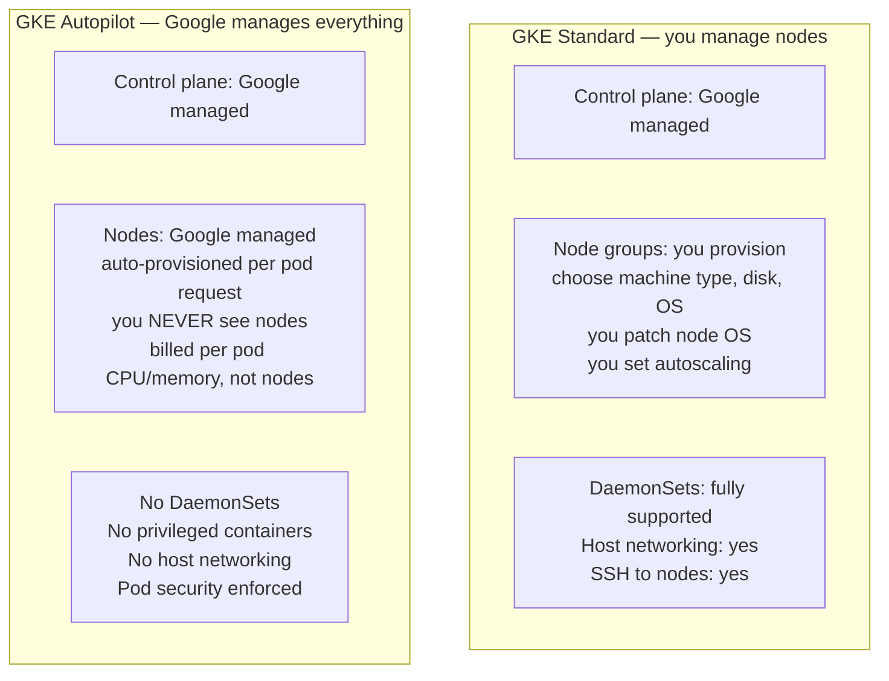
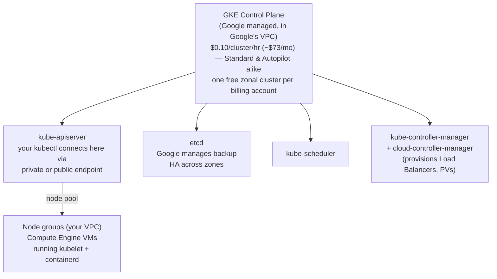
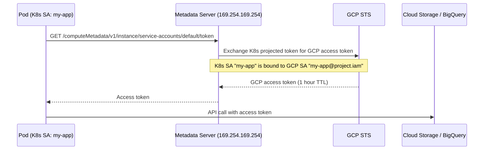
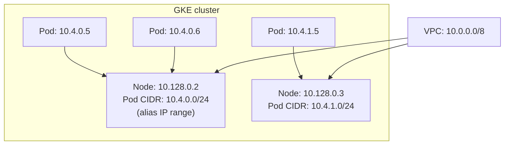
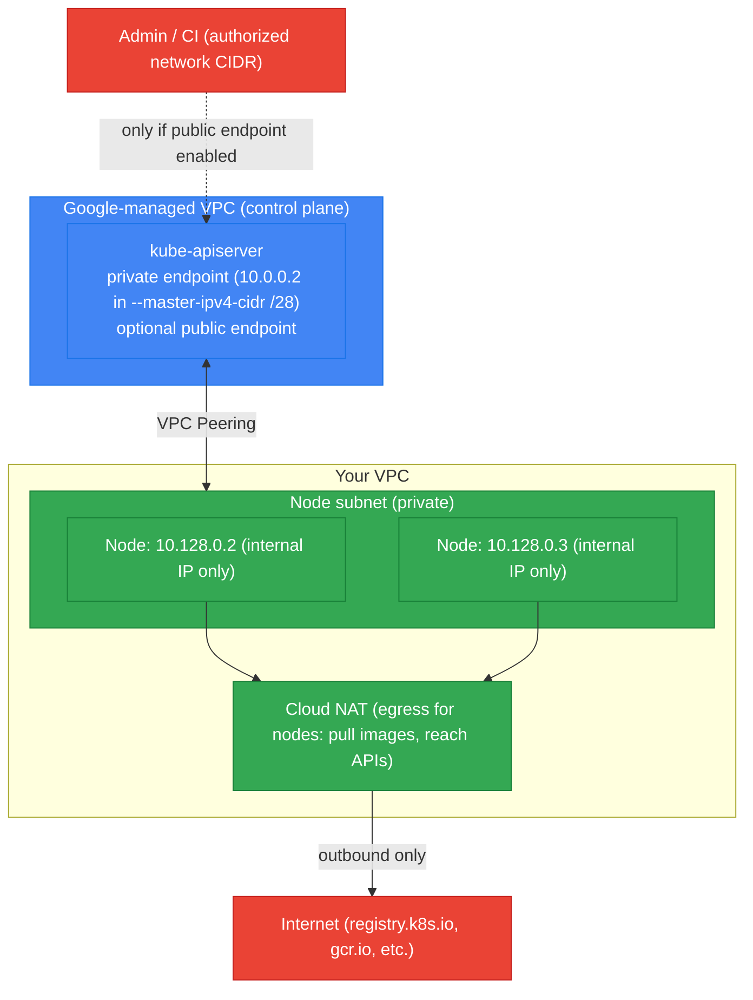
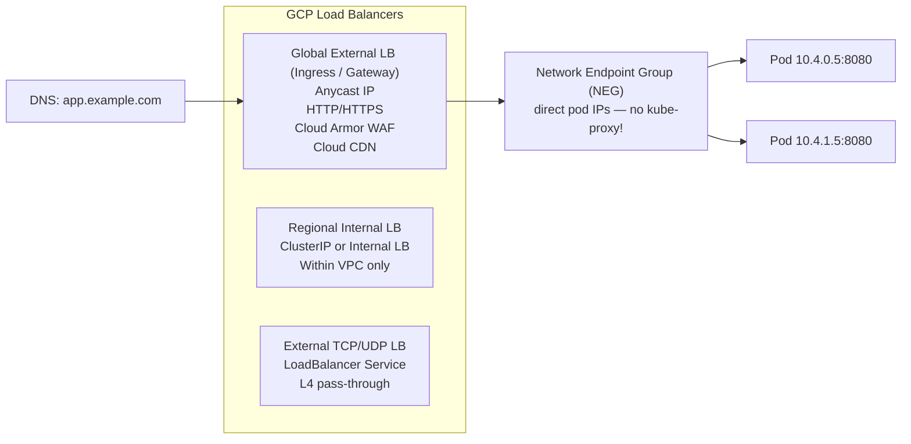
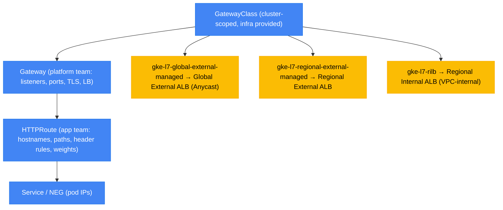

# GKE — Google Kubernetes Engine

GKE is GCP's managed Kubernetes. Google invented Kubernetes, so GKE gets features before any other cloud (Autopilot, Workload Identity, GKE Gateway, etc.).

---

## GKE Modes



| Feature | Standard | Autopilot |
|---------|---------|-----------|
| Node management | You | Google |
| Billing | Per node (whether idle or not) | Per pod (only what you use) |
| DaemonSets | Yes | No |
| Privileged pods | Yes | No |
| Custom node images | Yes | No |
| Best for | Complex workloads, AI/GPU, custom OS | Typical microservices, cost efficiency |

---

## Control Plane



**Regional vs Zonal cluster:**
- **Zonal:** control plane in one zone. Zone outage = no API (but running workloads continue).
- **Regional:** control plane replicated across 3 zones. Survives zone outage.
- **Cost:** the $0.10/cluster/hr (~$73/mo) management fee applies to *all* clusters — Standard or Autopilot, zonal or regional — beyond the one free zonal cluster per billing account. Regional no longer carries a separate surcharge; you only pay more because it runs 3 control-plane replicas' worth of Google-managed infrastructure (included in the flat fee) plus your own multi-zone node/compute costs.

---

## Workload Identity — The Right Way to Access GCP APIs

Never put service account keys in pods. Workload Identity maps a K8s ServiceAccount to a GCP IAM Service Account.



```bash
# Setup Workload Identity
gcloud iam service-accounts create my-app-sa

# Bind K8s SA → GCP SA
gcloud iam service-accounts add-iam-policy-binding \
  my-app-sa@PROJECT.iam.gserviceaccount.com \
  --role roles/iam.workloadIdentityUser \
  --member "serviceAccount:PROJECT.svc.id.goog[NAMESPACE/KSA_NAME]"

# Annotate the K8s ServiceAccount
kubectl annotate serviceaccount KSA_NAME \
  iam.gke.io/gcp-service-account=my-app-sa@PROJECT.iam.gserviceaccount.com
```

---

## GKE Networking — VPC-Native (Alias IPs)



**Alias IPs:** Pod IPs are real VPC IPs — no overlay network, no encapsulation. Pods are directly routable from any VM in the VPC. No VXLAN overhead.

**This is different from EKS:** EKS VPC CNI also gives pods real VPC IPs (similar), but the default pod CIDR is a secondary range rather than alias IPs.

---

## Private Clusters

In a private cluster, nodes get **only internal IPs** (no external IP). The control plane is reachable via a **private endpoint** — an RFC 1918 address inside your VPC. The control plane itself still runs in a **Google-managed VPC** that is VPC-peered to yours; the peering is what carries traffic between your nodes and the private control-plane endpoint.



**Key flags:**
- `--enable-private-nodes` — nodes get internal IPs only (no external IP). Required for a private cluster.
- `--enable-private-endpoint` — disables the *public* control-plane endpoint entirely; `kubectl` must originate from inside the VPC (or a connected network via VPN/Interconnect/peering). Omit it to keep a public endpoint locked down by authorized networks.
- `--master-ipv4-cidr` — a dedicated **/28** for the control plane's private endpoint in the Google-managed VPC. Must not overlap any of your VPC ranges. (VPC-native/alias-IP clusters no longer strictly require this for private endpoints on newer versions, but it is still the canonical way to pin the range.)
- `--master-authorized-networks` — allowlist of CIDRs permitted to reach the control-plane endpoint. Essential when a public endpoint is left enabled; restricts who can hit the API server.

**Cloud NAT is mandatory for egress:** since nodes have no external IP, they cannot pull images from public registries or reach external APIs without a NAT. Attach a Cloud NAT to the node subnet's region. Traffic to Google APIs (gcr.io/Artifact Registry, logging, etc.) can alternatively use **Private Google Access** on the subnet, avoiding NAT for Google endpoints.

```bash
# Private cluster: private nodes + public endpoint locked to authorized networks
gcloud container clusters create private-cluster \
  --region us-central1 \
  --enable-ip-alias \
  --enable-private-nodes \
  --master-ipv4-cidr 172.16.0.0/28 \
  --master-authorized-networks 203.0.113.0/24,10.0.0.0/8 \
  --enable-master-authorized-networks

# Fully private (no public endpoint at all — kubectl only from inside the VPC)
gcloud container clusters create fully-private \
  --region us-central1 \
  --enable-ip-alias \
  --enable-private-nodes \
  --enable-private-endpoint \
  --master-ipv4-cidr 172.16.0.0/28

# Cloud NAT so private nodes can reach the internet (image pulls, etc.)
gcloud compute routers create nat-router --region us-central1 --network default
gcloud compute routers nats create gke-nat \
  --router nat-router --region us-central1 \
  --nat-all-subnet-ip-ranges --auto-allocate-nat-external-ips
```

**vs EKS private endpoint:** EKS exposes the same public/private toggle via `endpointPublicAccess` / `endpointPrivateAccess`, and public access is scoped with `publicAccessCidrs` (the EKS analog of `--master-authorized-networks`). The big structural difference: EKS reaches the private API server through **cross-account ENIs** injected into your subnets, whereas GKE uses **VPC Peering** to a Google-managed control-plane VPC and needs the dedicated `/28` (`--master-ipv4-cidr`). On both, private-only nodes need managed egress — Cloud NAT on GKE, a NAT Gateway on EKS.

---

## GKE Load Balancing



**Container-native load balancing (NEG):** GCP LB talks directly to pod IPs — bypasses kube-proxy and NodePort entirely. Lower latency, better health checking, pods visible directly in GCP console.

```yaml
# Ingress with container-native LB
apiVersion: networking.k8s.io/v1
kind: Ingress
metadata:
  annotations:
    kubernetes.io/ingress.class: "gce"
    cloud.google.com/neg: '{"ingress": true}'  # enable NEG
spec:
  rules:
  - host: app.example.com
    http:
      paths:
      - path: /*
        backend:
          service:
            name: my-service
            port:
              number: 8080
```

---

## Gateway API

The **GKE Gateway API** is the successor to Ingress — a Kubernetes-native, role-oriented API for L4/L7 routing. GKE ships built-in `GatewayClass`es that each map to a specific Google Cloud Load Balancer, so choosing a class is really choosing an LB flavor.



| GatewayClass | Google Cloud LB | Scope |
|--------------|-----------------|-------|
| `gke-l7-global-external-managed` | Global External Application LB (Anycast IP) | Global, internet-facing |
| `gke-l7-regional-external-managed` | Regional External Application LB | Single region, internet-facing |
| `gke-l7-rilb` | Regional Internal Application LB | VPC-internal only |

**Advantages over Ingress:**
- **Role separation:** `Gateway` (owned by platform/infra — listeners, certs, LB) is decoupled from `HTTPRoute` (owned by app teams — routes). Ingress crammed both into one object plus vendor annotations.
- **Richer routing:** native header/query matching, path rewrites, request/response header mutation, and traffic **weighting** (canary/blue-green) — no annotation soup.
- **Cross-namespace & multi-route:** many `HTTPRoute`s can attach to one `Gateway`; routes can live in app namespaces.

```yaml
apiVersion: gateway.networking.k8s.io/v1
kind: Gateway
metadata:
  name: external-gw
spec:
  gatewayClassName: gke-l7-global-external-managed
  listeners:
  - name: https
    protocol: HTTPS
    port: 443
    tls:
      mode: Terminate
      certificateRefs:
      - name: app-tls-cert     # Secret or Google-managed cert
---
apiVersion: gateway.networking.k8s.io/v1
kind: HTTPRoute
metadata:
  name: app-route
spec:
  parentRefs:
  - name: external-gw
  hostnames:
  - "app.example.com"
  rules:
  - matches:
    - path:
        type: PathPrefix
        value: /v2
      headers:
      - name: x-canary
        value: "true"
    backendRefs:
    - name: app-v2
      port: 8080
  - matches:                    # weighted split for the rest
    - path:
        type: PathPrefix
        value: /
    backendRefs:
    - name: app-v1
      port: 8080
      weight: 90
    - name: app-v2
      port: 8080
      weight: 10
```

Like Ingress, Gateway uses **container-native load balancing (NEGs)** — the LB targets pod IPs directly, bypassing kube-proxy. Gateway API is the **recommended path over the older Ingress for new workloads**; use Ingress only for existing setups you are not ready to migrate.

---

## Node Pools and GPU

```bash
# Add a GPU node pool
gcloud container node-pools create gpu-pool \
  --cluster my-cluster \
  --region us-central1 \
  --machine-type n1-standard-4 \
  --accelerator type=nvidia-tesla-t4,count=1 \
  --num-nodes 0 \        # start at 0
  --enable-autoscaling \
  --min-nodes 0 \        # scale to zero when no GPU workloads
  --max-nodes 4 \
  --node-taints nvidia.com/gpu=present:NoSchedule

# Install NVIDIA drivers automatically (GKE manages this)
kubectl apply -f https://raw.githubusercontent.com/GoogleCloudPlatform/container-engine-accelerators/master/nvidia-driver-installer/cos/daemonset-preloaded.yaml
```

---

## GKE Autopilot Limits

```yaml
# Autopilot: minimum pod resource requests enforced
resources:
  requests:
    cpu: 250m      # minimum 250m (Autopilot enforces)
    memory: 512Mi  # minimum 512Mi
  limits:
    cpu: 250m      # requests == limits (Guaranteed QoS — Autopilot requirement)
    memory: 512Mi

# No: DaemonSets, hostNetwork, privileged, hostPID
# No: node selectors for specific machine types
# Yes: GPU workloads (Autopilot provisions GPU nodes automatically)
```

---

## GKE Upgrade Strategy

```bash
# Check available versions
gcloud container get-server-config --region us-central1

# Enable auto-upgrade (recommended)
gcloud container node-pools update default-pool \
  --cluster my-cluster \
  --region us-central1 \
  --enable-autoupgrade

# Use release channels (tracks stable/regular/rapid)
gcloud container clusters update my-cluster \
  --region us-central1 \
  --release-channel regular  # regular = ~monthly, stable = ~quarterly

# Maintenance windows: only upgrade during specific hours
gcloud container clusters update my-cluster \
  --maintenance-window-start 2024-01-15T02:00:00Z \
  --maintenance-window-end 2024-01-15T06:00:00Z \
  --maintenance-window-recurrence "FREQ=WEEKLY;BYDAY=SA,SU"
```
