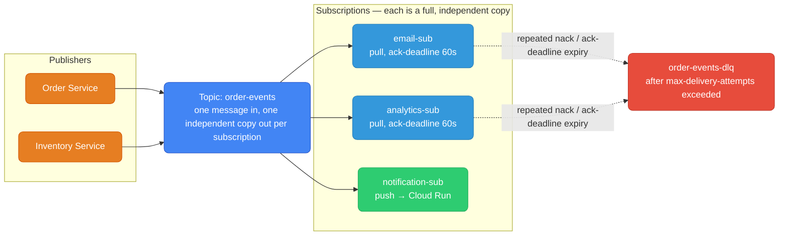
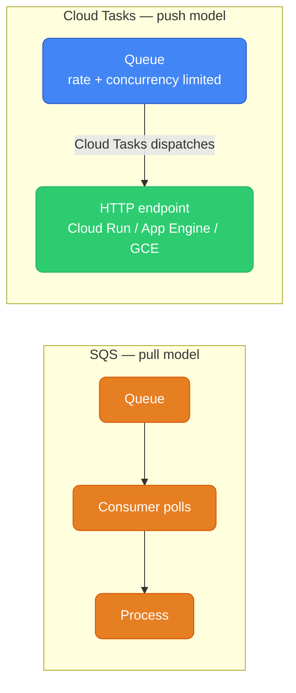
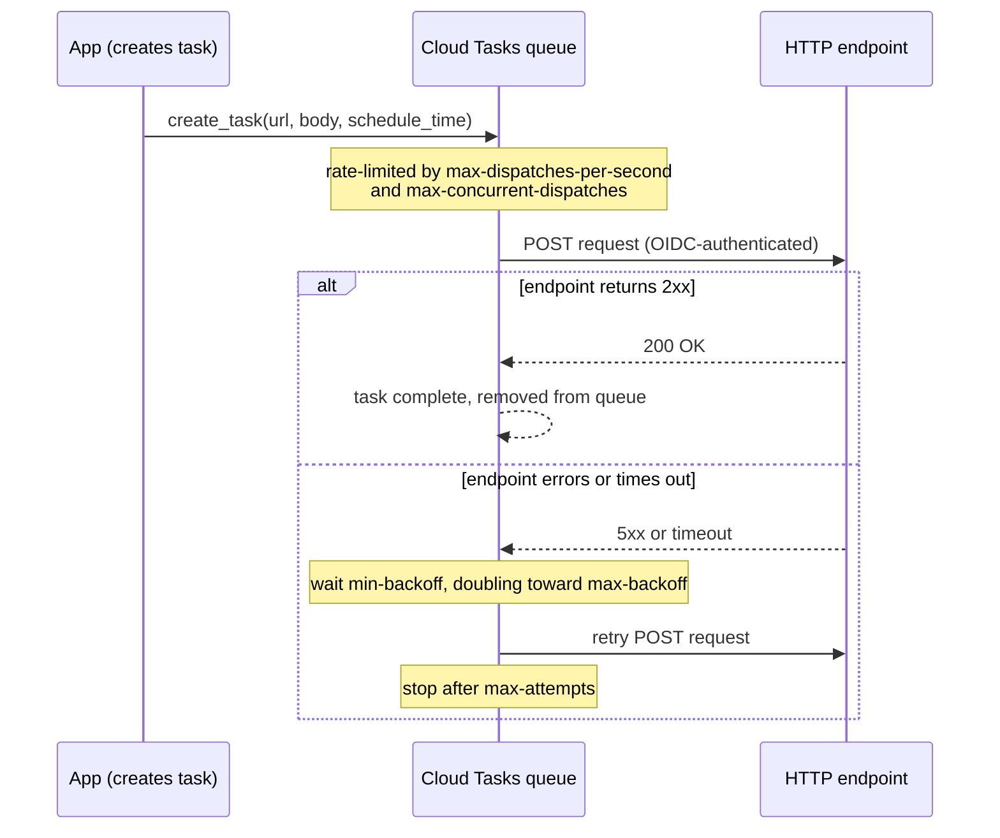
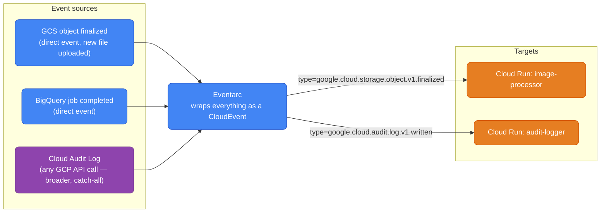

# GCP Messaging — Pub/Sub, Cloud Tasks, Eventarc

Three services cover almost every asynchronous-messaging need on GCP: **Pub/Sub** for fan-out and event streaming, **Cloud Tasks** for rate-limited work queues that push to an HTTP endpoint, and **Eventarc** for routing GCP-native events (a GCS upload, a BigQuery job finishing) to a handler. This guide covers each in turn, the ack/nack/dead-letter mechanics that make Pub/Sub reliable, and a decision guide for picking between them.

<div class="quiz-progress" data-quiz-progress>
  <span class="quiz-progress-label">0/0 checks</span>
  <span class="quiz-progress-bar"><span class="quiz-progress-fill"></span></span>
</div>

---

## Messaging Service Map

| Use case | AWS | GCP |
|----------|-----|-----|
| Fan-out / pub-sub | SNS + SQS | **Cloud Pub/Sub** |
| Reliable task queue | SQS | **Cloud Tasks** |
| Event stream (Kafka-like) | Kinesis | **Cloud Pub/Sub** |
| Managed Kafka | MSK | **Managed Kafka for BigQuery** / Pub/Sub |
| Event routing | EventBridge | **Eventarc** |
| Scheduled triggers | EventBridge Scheduler | **Cloud Scheduler** |

---

## Cloud Pub/Sub

Pub/Sub is GCP's core messaging backbone. It's **both** SNS (fan-out) and SQS (queue) in one service. Globally distributed, scales to millions of messages per second automatically.



Each subscription gets an **independent copy** of every message. Pull subscriptions buffer messages. Push subscriptions deliver to an HTTP endpoint.

<div class="quiz-card">
  <p class="quiz-q">A topic has three subscriptions: email-sub, analytics-sub, and notification-sub. One message is published. If email-sub's consumer is slow and hasn't acked yet, does that block or delay delivery to analytics-sub or notification-sub?</p>
  <button class="quiz-reveal">Reveal answer</button>
  <div class="quiz-a" hidden>No. Each subscription gets its own independent copy of the message and tracks its own ack state — Pub/Sub is both a fan-out (SNS-like) and a queue (SQS-like) service at once. A slow or stuck consumer on one subscription has zero effect on any other subscription's delivery or ack progress.</div>
</div>

### Setup

```bash
# Create topic
gcloud pubsub topics create order-events

# Pull subscription (consumer polls for messages)
gcloud pubsub subscriptions create email-sub \
  --topic=order-events \
  --ack-deadline=60s \           # how long to process before redelivery (like SQS visibility timeout)
  --message-retention-duration=7d  # how long to retain unacked messages

# Push subscription (Pub/Sub delivers to HTTP endpoint)
gcloud pubsub subscriptions create notification-sub \
  --topic=order-events \
  --push-endpoint=https://my-cloud-run.run.app/events \
  --push-auth-service-account=pubsub-invoker@project.iam.gserviceaccount.com
```

### Publish Messages

```bash
# Publish a message (CLI)
gcloud pubsub topics publish order-events \
  --message='{"order_id":"123","status":"placed"}' \
  --attribute="source=order-service,version=1"
```

```python
from google.cloud import pubsub_v1
import json

publisher = pubsub_v1.PublisherClient()
topic_path = publisher.topic_path("my-project", "order-events")

message = {
    "order_id": "123",
    "status": "placed",
    "amount": 99.99
}

future = publisher.publish(
    topic_path,
    data=json.dumps(message).encode("utf-8"),
    source="order-service",        # message attributes (like SQS message attributes)
    version="1"
)
print(f"Published: {future.result()}")
```

### Pull (Consumer)

```python
from google.cloud import pubsub_v1
import json

subscriber = pubsub_v1.SubscriberClient()
subscription_path = subscriber.subscription_path("my-project", "email-sub")

def callback(message: pubsub_v1.subscriber.message.Message):
    try:
        data = json.loads(message.data.decode("utf-8"))
        send_email(data["order_id"])
        message.ack()                    # acknowledge — remove from queue
    except Exception as e:
        print(f"Error: {e}")
        message.nack()                   # nack — redeliver (like SQS visibility timeout reset)

streaming_pull = subscriber.subscribe(subscription_path, callback=callback)
streaming_pull.result()                  # block and process
```

### Dead Letter Topics

```bash
# Create dead letter topic (for failed messages after N attempts)
gcloud pubsub topics create order-events-dlq

gcloud pubsub subscriptions modify-push-config email-sub \
  --dead-letter-topic=order-events-dlq \
  --max-delivery-attempts=5         # after 5 nacks → goes to DLQ
```

Putting the publish, pull, ack/nack, and dead-letter pieces above together, here's the full lifecycle of one message:

<div class="stepper">
  <div class="stepper-panels">
    <div class="stepper-panel active">
      <strong>1. Publish &amp; deliver.</strong> A publisher sends a message to the topic. Each subscription gets its own independent copy — for a pull subscription like <code>email-sub</code>, the consumer's streaming-pull cursor receives it; for a push subscription like <code>notification-sub</code>, Pub/Sub POSTs it straight to the HTTP endpoint. Delivery starts the <code>ack-deadline</code> clock (60s in the earlier example).
    </div>
    <div class="stepper-panel">
      <strong>2. Handler succeeds → ack.</strong> The subscriber finishes processing and calls <code>message.ack()</code>. Pub/Sub removes that copy from the subscription's backlog for good — it will never be redelivered on this subscription.
    </div>
    <div class="stepper-panel">
      <strong>3. Handler fails or times out → nack / expiry.</strong> The subscriber calls <code>message.nack()</code> on an exception, or simply never acks before the ack-deadline expires — Pub/Sub treats both cases the same way: the message is redelivered, and its delivery-attempt counter increments.
    </div>
    <div class="stepper-panel">
      <strong>4. Attempts exhausted → dead-letter topic.</strong> Once the delivery-attempt count passes <code>max-delivery-attempts</code> (5 in the earlier example), Pub/Sub stops retrying on the original subscription and republishes the message to the configured dead-letter topic — <code>order-events-dlq</code> — instead, where a separate subscription can inspect or replay it without blocking the healthy flow.
    </div>
  </div>
  <div class="stepper-controls">
    <button class="stepper-prev">← Prev</button>
    <span class="stepper-dots"></span>
    <span class="stepper-label"></span>
    <button class="stepper-next">Next →</button>
  </div>
</div>

<div class="quiz-card">
  <p class="quiz-q">A subscriber's handler throws an exception and calls message.nack() on attempt 3. On attempt 4, the handler just hangs and never calls ack() or nack() before the ack-deadline expires. Does that hang count toward the same max-delivery-attempts limit as the explicit nack?</p>
  <button class="quiz-reveal">Reveal answer</button>
  <div class="quiz-a" hidden>Yes. Pub/Sub doesn't distinguish an explicit nack() from an ack-deadline expiring unacknowledged — both are redelivery triggers and both increment the same delivery-attempt counter. Once that counter passes max-delivery-attempts, the message stops going to the original subscription and is routed to the dead-letter topic instead.</div>
</div>

### Pub/Sub Lite vs Pub/Sub

| | Pub/Sub | Pub/Sub Lite |
|--|---|---|
| **Infrastructure** | Fully managed, Google-handled | Zonal or regional partitions |
| **Scaling** | Automatic | Manual (configure capacity) |
| **Ordering** | No (unless ordering key) | Yes (partition-based) |
| **Cost** | Higher | 90% cheaper for high throughput |
| **Use case** | Default, variable load | Predictable high-volume (Kafka-like) |

<div class="quiz-card">
  <p class="quiz-q">You need Kafka-like ordering guarantees at high, predictable throughput. Standard Pub/Sub is on the table because it's the default — does it give you ordering for free?</p>
  <button class="quiz-reveal">Reveal answer</button>
  <div class="quiz-a" hidden>No — standard Pub/Sub only orders messages that share the same ordering key; without one, delivery order isn't guaranteed. Pub/Sub Lite is the one with ordering built in by default, via partition-based delivery, and it's also ~90% cheaper at high throughput — which is exactly why it's positioned for "predictable high-volume, Kafka-like" workloads instead.</div>
</div>

### Pub/Sub vs AWS Services

| | GCP Pub/Sub | AWS SQS | AWS SNS | AWS Kinesis |
|--|---|---|---|---|
| **Model** | Topic + subscriptions | Queue (point-to-point) | Topic (fan-out) | Sharded stream |
| **Fan-out** | Yes (multiple subscriptions) | No | Yes | No |
| **Retention** | 7 days (up to 600 days lite) | 14 days | No retention | 7 days (up to 365) |
| **Ordering** | Optional (ordering key) | Optional (FIFO) | No | Per shard |
| **Exactly-once** | No (at-least-once) | FIFO queues: yes | No | No |
| **Max message size** | 10 MB | 256 KB | 256 KB | 1 MB |
| **Pull/Push** | Both | Pull | Push (to SQS/Lambda/etc.) | Pull |

---

## Cloud Tasks — Task Queue

Cloud Tasks = SQS but with better control over delivery. Designed for work offloading and rate-limited task dispatching. Best for: calling an API endpoint with rate limits, offloading slow work from request handlers.



Cloud Tasks pushes to an HTTP endpoint (your Cloud Run service, App Engine, or GCE endpoint). You don't poll.

```bash
# Create a queue
gcloud tasks queues create my-queue \
  --location=us-central1 \
  --max-dispatches-per-second=10 \    # rate limit (SQS has no equivalent)
  --max-concurrent-dispatches=5 \
  --max-attempts=5 \
  --min-backoff=10s \
  --max-backoff=300s
```

```python
from google.cloud import tasks_v2
import json

client = tasks_v2.CloudTasksClient()
parent = client.queue_path("my-project", "us-central1", "my-queue")

# Create a task targeting a Cloud Run service
task = {
    "http_request": {
        "http_method": tasks_v2.HttpMethod.POST,
        "url": "https://my-worker.run.app/process",
        "headers": {"Content-Type": "application/json"},
        "body": json.dumps({"order_id": "123"}).encode(),
        "oidc_token": {
            "service_account_email": "task-invoker@project.iam.gserviceaccount.com"
        }
    }
}

# Optional: schedule for the future
from google.protobuf import timestamp_pb2
import datetime
t = datetime.datetime.utcnow() + datetime.timedelta(minutes=30)
timestamp = timestamp_pb2.Timestamp()
timestamp.FromDatetime(t)
task["schedule_time"] = timestamp

response = client.create_task(request={"parent": parent, "task": task})
print(f"Task created: {response.name}")
```

Once a task is created, the queue governs when and how fast it actually reaches the endpoint — including retrying it on failure with backoff, all without the caller doing anything further:



### Cloud Tasks vs Pub/Sub

| | Cloud Tasks | Cloud Pub/Sub |
|--|---|---|
| **Model** | Task queue → HTTP endpoint | Topic → subscriptions |
| **Fan-out** | No (one target) | Yes |
| **Rate limiting** | Yes (built-in) | No |
| **Future scheduling** | Yes | No |
| **Deduplication** | Yes (task names) | No |
| **Use case** | Offload work, call rate-limited APIs | Fan-out events, async processing |

<div class="quiz-card">
  <p class="quiz-q">You need to call a third-party API that hard-limits you to 10 requests/second, from a fleet of workers that would otherwise hammer it in a burst. Pub/Sub or Cloud Tasks?</p>
  <button class="quiz-reveal">Reveal answer</button>
  <div class="quiz-a" hidden>Cloud Tasks. It has built-in rate limiting per queue (<code>max-dispatches-per-second</code>, <code>max-concurrent-dispatches</code>) that throttles delivery to your target automatically. Pub/Sub has no equivalent — subscribers pull or receive pushes as fast as they're able, so throttling would have to be built into the consumer itself.</div>
</div>

---

## Eventarc — Event Routing

Eventarc routes events from GCP services to Cloud Run or other targets. Equivalent to AWS EventBridge for GCP-native events.



```bash
# Trigger Cloud Run when a new file lands in GCS
gcloud eventarc triggers create process-new-image \
  --location=us-central1 \
  --destination-run-service=image-processor \
  --destination-run-region=us-central1 \
  --event-filters="type=google.cloud.storage.object.v1.finalized" \
  --event-filters="bucket=my-uploads-bucket" \
  --service-account=eventarc-sa@project.iam.gserviceaccount.com

# Trigger on ANY GCP API call (Audit Log based)
gcloud eventarc triggers create on-bigquery-job \
  --location=us-central1 \
  --destination-run-service=bq-notifier \
  --destination-run-region=us-central1 \
  --event-filters="type=google.cloud.audit.log.v1.written" \
  --event-filters="serviceName=bigquery.googleapis.com" \
  --event-filters="methodName=google.cloud.bigquery.v2.JobService.InsertJob" \
  --service-account=eventarc-sa@project.iam.gserviceaccount.com
```

### Receiving Events in Cloud Run

Eventarc delivers events as CloudEvents (CNCF standard format):

```python
from cloudevents.http import from_http
from flask import Flask, request

app = Flask(__name__)

@app.route("/", methods=["POST"])
def handle_event():
    event = from_http(request.headers, request.data)

    print(f"Event type: {event['type']}")
    print(f"Event source: {event['source']}")

    # For GCS events
    if event["type"] == "google.cloud.storage.object.v1.finalized":
        data = event.data
        bucket = data["bucket"]
        name = data["name"]
        print(f"New file: gs://{bucket}/{name}")
        process_file(bucket, name)

    return "OK", 200
```

### Eventarc vs AWS EventBridge

| | Eventarc | AWS EventBridge |
|--|---|---|
| **Event sources** | GCP services (Audit Logs, direct) | 100+ AWS services + custom |
| **Event format** | CloudEvents (CNCF standard) | Custom JSON |
| **Target types** | Cloud Run, Cloud Functions, GKE | Lambda, SNS, SQS, Step Functions, 15+ |
| **Event replay** | No | Yes (archive + replay) |
| **Schema registry** | No | Yes |
| **Cross-account** | No | Yes (event buses) |
| **Cost** | Per event | Per event ($1/million) |

<div class="quiz-card">
  <p class="quiz-q">You want to trigger a Cloud Run service on any BigQuery API call at all — not just "job completed," but literally any method in the BigQuery API. Do you use a direct event filter (like the GCS example) or an Audit Log based trigger?</p>
  <button class="quiz-reveal">Reveal answer</button>
  <div class="quiz-a" hidden>Audit Log based. Direct event types like <code>google.cloud.storage.object.v1.finalized</code> only cover one specific, first-party event; <code>google.cloud.audit.log.v1.written</code>, filtered by <code>serviceName</code> and <code>methodName</code>, fires on any GCP API call logged to Cloud Audit Logs — which is exactly how the guide's second trigger example targets one specific BigQuery method without a dedicated event type existing for it.</div>
</div>

---

## Workflow: Choosing the Right Messaging Service

Same decisions as the tables above, grouped by service instead of by use case — pick the tab for whichever service is already on your shortlist and check it actually covers what you need:

<div class="tab-group">
  <div class="tab-buttons">
    <button data-tab="pubsub" class="active">Pub/Sub</button>
    <button data-tab="tasks">Cloud Tasks</button>
    <button data-tab="eventarc">Eventarc</button>
  </div>
  <div class="tab-panels">
    <div class="tab-panel active" data-tab-panel="pubsub">
      <strong>Fan out to multiple consumers</strong> (email + analytics + notifications) → a Pub/Sub topic with multiple subscriptions, each getting its own independent copy.<br/><br/>
      <strong>Simple job queue, consumer polls for work</strong> → Pub/Sub with a pull subscription.<br/><br/>
      <strong>Kafka-compatible stream with ordering guarantees</strong> → Pub/Sub Lite (or Managed Kafka if you need exact Kafka wire compatibility). Standard Pub/Sub only orders messages that share an ordering key, not globally.
    </div>
    <div class="tab-panel" data-tab-panel="tasks">
      <strong>Offload slow work from an HTTP handler, with rate limiting</strong> → Cloud Tasks. It's the only one of the three with built-in per-queue rate limiting, future scheduling, and task-name deduplication — at the cost of fanning out to exactly one target instead of many.
    </div>
    <div class="tab-panel" data-tab-panel="eventarc">
      <strong>Process events from GCP services</strong> (a GCS upload, a BigQuery job, or literally any audited API call) → Eventarc. Direct event types cover specific first-party events; an Audit Log based trigger covers anything logged to Cloud Audit Logs, at the cost of losing event replay (unlike AWS EventBridge).
    </div>
  </div>
</div>

One more common ask that isn't any of these three: running something purely **on a schedule**, with no triggering event at all — that's Cloud Scheduler, not a messaging service in the same sense as the three above.

<div class="quiz-card">
  <p class="quiz-q">A team needs Kafka-compatible ordering at high, predictable throughput, but doesn't care about exact Kafka wire-protocol compatibility. Which service fits, and why not plain Pub/Sub?</p>
  <button class="quiz-reveal">Reveal answer</button>
  <div class="quiz-a" hidden>Pub/Sub Lite — partition-based ordering by default, and roughly 90% cheaper at high, predictable throughput than standard Pub/Sub. Plain Pub/Sub only orders messages that share an ordering key and is built for variable load, not for saturating a predictable high-volume pipeline. (Managed Kafka is the answer only if exact Kafka compatibility, not just Kafka-like behavior, is a hard requirement.)</div>
</div>
