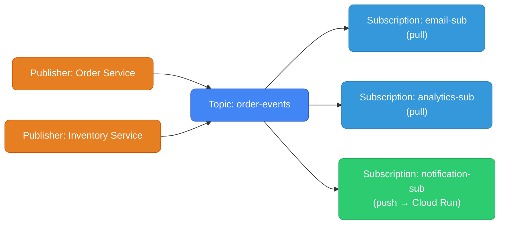
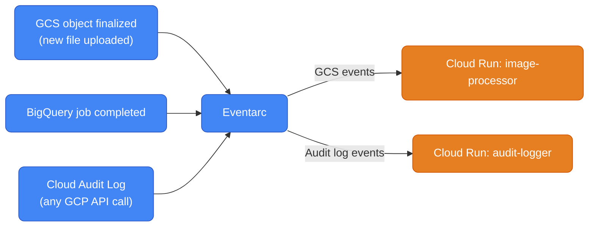

# GCP Messaging — Pub/Sub, Cloud Tasks, Eventarc

---

## Messaging Service Map

| Use case | AWS | GCP |
|----------|-----|-----|
| Fan-out / pub-sub | SNS + SQS | **Cloud Pub/Sub** |
| Reliable task queue | SQS | **Cloud Tasks** |
| Event stream (Kafka-like) | Kinesis | **Cloud Pub/Sub** |
| Managed Kafka | MSK | **Managed Kafka for BigQuery** / Pub/Sub |
| Event routing | EventBridge | **Eventarc** |
| Scheduled triggers | EventBridge Scheduler | **Cloud Scheduler** |

---

## Cloud Pub/Sub

Pub/Sub is GCP's core messaging backbone. It's **both** SNS (fan-out) and SQS (queue) in one service. Globally distributed, scales to millions of messages per second automatically.



Each subscription gets an **independent copy** of every message. Pull subscriptions buffer messages. Push subscriptions deliver to an HTTP endpoint.

### Setup

```bash
# Create topic
gcloud pubsub topics create order-events

# Pull subscription (consumer polls for messages)
gcloud pubsub subscriptions create email-sub \
  --topic=order-events \
  --ack-deadline=60s \           # how long to process before redelivery (like SQS visibility timeout)
  --message-retention-duration=7d  # how long to retain unacked messages

# Push subscription (Pub/Sub delivers to HTTP endpoint)
gcloud pubsub subscriptions create notification-sub \
  --topic=order-events \
  --push-endpoint=https://my-cloud-run.run.app/events \
  --push-auth-service-account=pubsub-invoker@project.iam.gserviceaccount.com
```

### Publish Messages

```bash
# Publish a message (CLI)
gcloud pubsub topics publish order-events \
  --message='{"order_id":"123","status":"placed"}' \
  --attribute="source=order-service,version=1"
```

```python
from google.cloud import pubsub_v1
import json

publisher = pubsub_v1.PublisherClient()
topic_path = publisher.topic_path("my-project", "order-events")

message = {
    "order_id": "123",
    "status": "placed",
    "amount": 99.99
}

future = publisher.publish(
    topic_path,
    data=json.dumps(message).encode("utf-8"),
    source="order-service",        # message attributes (like SQS message attributes)
    version="1"
)
print(f"Published: {future.result()}")
```

### Pull (Consumer)

```python
from google.cloud import pubsub_v1
import json

subscriber = pubsub_v1.SubscriberClient()
subscription_path = subscriber.subscription_path("my-project", "email-sub")

def callback(message: pubsub_v1.subscriber.message.Message):
    try:
        data = json.loads(message.data.decode("utf-8"))
        send_email(data["order_id"])
        message.ack()                    # acknowledge — remove from queue
    except Exception as e:
        print(f"Error: {e}")
        message.nack()                   # nack — redeliver (like SQS visibility timeout reset)

streaming_pull = subscriber.subscribe(subscription_path, callback=callback)
streaming_pull.result()                  # block and process
```

### Dead Letter Topics

```bash
# Create dead letter topic (for failed messages after N attempts)
gcloud pubsub topics create order-events-dlq

gcloud pubsub subscriptions modify-push-config email-sub \
  --dead-letter-topic=order-events-dlq \
  --max-delivery-attempts=5         # after 5 nacks → goes to DLQ
```

### Pub/Sub Lite vs Pub/Sub

| | Pub/Sub | Pub/Sub Lite |
|--|---|---|
| **Infrastructure** | Fully managed, Google-handled | Zonal or regional partitions |
| **Scaling** | Automatic | Manual (configure capacity) |
| **Ordering** | No (unless ordering key) | Yes (partition-based) |
| **Cost** | Higher | 90% cheaper for high throughput |
| **Use case** | Default, variable load | Predictable high-volume (Kafka-like) |

### Pub/Sub vs AWS Services

| | GCP Pub/Sub | AWS SQS | AWS SNS | AWS Kinesis |
|--|---|---|---|---|
| **Model** | Topic + subscriptions | Queue (point-to-point) | Topic (fan-out) | Sharded stream |
| **Fan-out** | Yes (multiple subscriptions) | No | Yes | No |
| **Retention** | 7 days (up to 600 days lite) | 14 days | No retention | 7 days (up to 365) |
| **Ordering** | Optional (ordering key) | Optional (FIFO) | No | Per shard |
| **Exactly-once** | No (at-least-once) | FIFO queues: yes | No | No |
| **Max message size** | 10 MB | 256 KB | 256 KB | 1 MB |
| **Pull/Push** | Both | Pull | Push (to SQS/Lambda/etc.) | Pull |

---

## Cloud Tasks — Task Queue

Cloud Tasks = SQS but with better control over delivery. Designed for work offloading and rate-limited task dispatching. Best for: calling an API endpoint with rate limits, offloading slow work from request handlers.

```
SQS:        queue → consumer polls → process
Cloud Tasks: queue → Cloud Tasks delivers to → HTTP endpoint
```

Cloud Tasks pushes to an HTTP endpoint (your Cloud Run service, App Engine, or GCE endpoint). You don't poll.

```bash
# Create a queue
gcloud tasks queues create my-queue \
  --location=us-central1 \
  --max-dispatches-per-second=10 \    # rate limit (SQS has no equivalent)
  --max-concurrent-dispatches=5 \
  --max-attempts=5 \
  --min-backoff=10s \
  --max-backoff=300s
```

```python
from google.cloud import tasks_v2
import json

client = tasks_v2.CloudTasksClient()
parent = client.queue_path("my-project", "us-central1", "my-queue")

# Create a task targeting a Cloud Run service
task = {
    "http_request": {
        "http_method": tasks_v2.HttpMethod.POST,
        "url": "https://my-worker.run.app/process",
        "headers": {"Content-Type": "application/json"},
        "body": json.dumps({"order_id": "123"}).encode(),
        "oidc_token": {
            "service_account_email": "task-invoker@project.iam.gserviceaccount.com"
        }
    }
}

# Optional: schedule for the future
from google.protobuf import timestamp_pb2
import datetime
t = datetime.datetime.utcnow() + datetime.timedelta(minutes=30)
timestamp = timestamp_pb2.Timestamp()
timestamp.FromDatetime(t)
task["schedule_time"] = timestamp

response = client.create_task(request={"parent": parent, "task": task})
print(f"Task created: {response.name}")
```

### Cloud Tasks vs Pub/Sub

| | Cloud Tasks | Cloud Pub/Sub |
|--|---|---|
| **Model** | Task queue → HTTP endpoint | Topic → subscriptions |
| **Fan-out** | No (one target) | Yes |
| **Rate limiting** | Yes (built-in) | No |
| **Future scheduling** | Yes | No |
| **Deduplication** | Yes (task names) | No |
| **Use case** | Offload work, call rate-limited APIs | Fan-out events, async processing |

---

## Eventarc — Event Routing

Eventarc routes events from GCP services to Cloud Run or other targets. Equivalent to AWS EventBridge for GCP-native events.



```bash
# Trigger Cloud Run when a new file lands in GCS
gcloud eventarc triggers create process-new-image \
  --location=us-central1 \
  --destination-run-service=image-processor \
  --destination-run-region=us-central1 \
  --event-filters="type=google.cloud.storage.object.v1.finalized" \
  --event-filters="bucket=my-uploads-bucket" \
  --service-account=eventarc-sa@project.iam.gserviceaccount.com

# Trigger on ANY GCP API call (Audit Log based)
gcloud eventarc triggers create on-bigquery-job \
  --location=us-central1 \
  --destination-run-service=bq-notifier \
  --destination-run-region=us-central1 \
  --event-filters="type=google.cloud.audit.log.v1.written" \
  --event-filters="serviceName=bigquery.googleapis.com" \
  --event-filters="methodName=google.cloud.bigquery.v2.JobService.InsertJob" \
  --service-account=eventarc-sa@project.iam.gserviceaccount.com
```

### Receiving Events in Cloud Run

Eventarc delivers events as CloudEvents (CNCF standard format):

```python
from cloudevents.http import from_http
from flask import Flask, request

app = Flask(__name__)

@app.route("/", methods=["POST"])
def handle_event():
    event = from_http(request.headers, request.data)

    print(f"Event type: {event['type']}")
    print(f"Event source: {event['source']}")

    # For GCS events
    if event["type"] == "google.cloud.storage.object.v1.finalized":
        data = event.data
        bucket = data["bucket"]
        name = data["name"]
        print(f"New file: gs://{bucket}/{name}")
        process_file(bucket, name)

    return "OK", 200
```

### Eventarc vs AWS EventBridge

| | Eventarc | AWS EventBridge |
|--|---|---|
| **Event sources** | GCP services (Audit Logs, direct) | 100+ AWS services + custom |
| **Event format** | CloudEvents (CNCF standard) | Custom JSON |
| **Target types** | Cloud Run, Cloud Functions, GKE | Lambda, SNS, SQS, Step Functions, 15+ |
| **Event replay** | No | Yes (archive + replay) |
| **Schema registry** | No | Yes |
| **Cross-account** | No | Yes (event buses) |
| **Cost** | Per event | Per event ($1/million) |

---

## Workflow: Choosing the Right Messaging Service

```
I want to...

Process events from GCP services (GCS upload, BigQuery job, etc.)
→ Eventarc

Fan out to multiple consumers (email + analytics + notifications)
→ Pub/Sub topic with multiple subscriptions

Offload slow work from an HTTP handler, with rate limiting
→ Cloud Tasks

Simple job queue, consumer polls for work
→ Pub/Sub (pull subscription)

Kafka-compatible stream with ordering guarantees
→ Pub/Sub Lite (or Managed Kafka if you need exact Kafka compatibility)

Run something on a schedule
→ Cloud Scheduler
```
