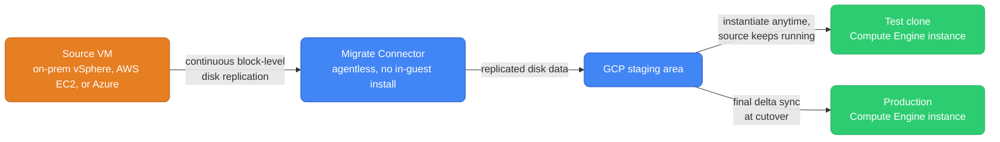
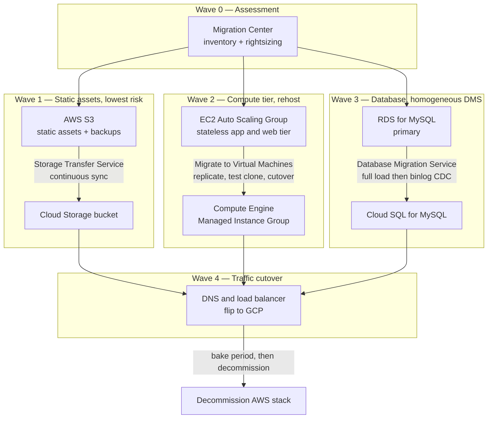

# GCP Migration Methodology — Tools, Timelines, and a Worked Example

[`from-aws.md`](./from-aws.md) is the mental-model bridge — resource hierarchy, additive IAM, global VPC. This is the other half: the actual tooling Google ships for moving workloads *onto* that model. If `from-aws.md` answers "how do I think about GCP," this answers "how do I get 40 EC2 instances, an RDS database, and a few terabytes of S3 objects there without a weekend of downtime."

  0/0 checks
  

---

## 1. The migration strategies Google actually documents

Every cloud vendor's blog reduces this to "the 4 R's," but Google's own Architecture Center guide (`Migrate to Google Cloud: Get started`) currently defines **six** named strategies, not four — and it's worth being precise here, because "rebuild" vs. "retire/retain" get confused across vendors constantly. Google's docs don't use "retire" or "retain" at all; those belong to Gartner's 5R/6R framing and various consultancy blogs, not Google's own taxonomy.

Google's six, in the order the guide presents them: **Rehost** (minor/no modification), **Replatform** (lift, then optimize for the cloud), **Refactor** (modify to exploit cloud capabilities, not just to run), **Re-architect** (refactor's deeper cousin — changes how the code *functions*, e.g. splitting a monolith), **Rebuild** (decommission and rewrite as fully cloud-optimized), and **Repurchase** (swap a purchased on-prem product for its SaaS equivalent).

Collapsed to the popular "4 R's" shorthand, Google's guide groups **re-architect under refactor** and **repurchase under rebuild** — so the four planning buckets are **Rehost / Replatform / Refactor / Rebuild**. The fourth bucket beyond the first three is **Rebuild**, not "retire" or "retain."

  

    <button data-toggle-opt="rehost" class="active state-ok">Rehost</button>
    <button data-toggle-opt="replatform">Replatform</button>
    <button data-toggle-opt="refactor" class="state-warn">Refactor</button>
    <button data-toggle-opt="rebuild" class="state-bad">Rebuild</button>
  

  

    <strong>Move as-is.</strong> Best when the workload works fine and the goal is "close the data center," not "modernize the app." Fastest path, worst long-term economics. Google's tool: <strong>Migrate to Virtual Machines</strong> (§2).
  

  

    <strong>Lift, then swap the expensive parts.</strong> Same app code, but the self-managed database becomes Cloud SQL and static assets move to Cloud Storage. <strong>Database Migration Service</strong> and <strong>Storage Transfer Service</strong> (§3, §5) do the work here.
  

  

    <strong>Change the code to fit the cloud, not just run in it.</strong> Splitting a monolith, moving batch jobs onto serverless triggers, replacing cron-driven ETL with managed pipelines. Higher effort, but where cost and elasticity wins show up. <strong>BigQuery Migration Service</strong> (§4) lives here for the warehouse case.
  

  

    <strong>Start over.</strong> Reserved for apps where the current implementation actively fights you — unhireable platform, architecture that can't extend, or a system where migrating the code costs more than rewriting it. Not really a migration-tooling problem anymore; a software project that happens to land in GCP.
  

### Decision table — workload characteristic → strategy

| Workload characteristic | Strategy | Why |
|---|---|---|
| No active dev team, tight timeline, hard-to-reproduce OS/license combo | **Rehost** | No code changes wanted; goal is closing a data center, not modernizing |
| Self-managed DB/queue/cache underneath an app you don't want to touch | **Replatform** | Managed services remove operational burden without touching app code |
| Hitting real scaling/cost ceilings the architecture itself can't solve | **Refactor / Re-architect** | The architecture is the bottleneck, not just where it runs |
| On-prem data warehouse (Teradata, Netezza) with years of SQL and ETL | **Refactor** via BigQuery Migration Service | Warehouse workloads rarely rehost cleanly |
| Purchased on-prem product (CRM, ticketing, ERP) with a mature SaaS equivalent | **Repurchase** | Cheaper than migrating and operating the old product |
| Chronically broken codebase blocking every roadmap item | **Rebuild** | Migration effort would prop up something you're about to replace |

  
A team says they're doing a "replatform" because they're moving their app's self-managed MySQL to Cloud SQL for MySQL while leaving the application code completely untouched. Is that actually a replatform, or is it a rehost?

  <button class="quiz-reveal">Reveal answer</button>
  
Replatform. Rehost means minor-to-no modification — same self-managed MySQL, just on a new VM. Swapping the database engine for a managed equivalent while leaving the app's logic alone is exactly Google's definition of replatform: lift the workload, then optimize what's underneath it, without restructuring the app itself.

---

## 2. Migrate to Virtual Machines — agentless VM rehost

Formerly "Migrate for Compute Engine," this is Google's dedicated rehost engine: agentless replication of running VMs — from on-prem vSphere, AWS, or Azure — directly into Compute Engine, with almost no cutover downtime.

**The mechanism, not just the pitch:** a *Migrate Connector* sits outside the VM being migrated — a small appliance for on-prem vSphere, or a connection through the source cloud's own APIs for AWS/Azure. Nothing installs inside the guest OS. It runs continuous **block-level disk replication**: reading changed disk blocks from the source volumes and streaming them into a GCP staging area in the background, while the source keeps serving production traffic untouched. No shell access, no in-guest credentials, no maintenance window just to start replicating — that's what "zero-touch" means here.

Because the source is never paused, replication has a useful side effect: **test clones**. Once enough data has replicated, spin up a real Compute Engine instance from the currently-replicated data — a point-in-time clone to boot and validate in isolation, without touching the source or the ongoing replication. A bad clone just means fixing the target config and cutting a fresh one — the source was never at risk because it was never touched.

Google names six lifecycle stages:

  

    

      <strong>1. Onboard.</strong> Select the source VM and register it for migration. No agent installed in the guest.
    

    

      <strong>2. Replication.</strong> The Migrate Connector starts continuous block-level replication of the source disks into a GCP staging area, running in the background for as long as the migration stays open.
    

    

      <strong>3. Set target details.</strong> Configure the destination Compute Engine instance — machine type, network, service account, disk type — independently of the replication itself.
    

    

      <strong>4. Test-clone (optional, repeatable).</strong> Boot a real Compute Engine instance from the current replicated data — a static snapshot — in an isolated sandbox network to validate the app. New replication data only affects <em>future</em> clones, not ones already created.
    

    

      <strong>5. Cutover.</strong> Shut down the source, let the final delta replicate, stop replication, and create the production instance from that final, complete copy.
    

    

      <strong>6. Finalize.</strong> Post-migration cleanup — remove staging data, release the connector's hold on the source, confirm the new instance stands on its own.
    

  

  

    <button class="stepper-prev">← Prev</button>
    
    
    <button class="stepper-next">Next →</button>
  

**When this beats a manual re-provision:** any time you'd otherwise hand-build a Compute Engine image and hope it matches production closely enough. A manual re-provision (build an image, run config management, cut a VM) is fine for one or two clean, scripted VMs — but it re-derives the machine from a recipe, so anything that drifted from that recipe in production silently doesn't make the trip. This tool moves the actual disk bytes instead, so whatever the VM really is comes across intact — the right call for fleets of VMs, unclear configuration, tight cutover windows, or licensing/OS combos too painful to reproduce from a script.

  
Why can Migrate to Virtual Machines replicate an EC2 instance into Compute Engine without installing any agent inside the source VM's guest OS?

  <button class="quiz-reveal">Reveal answer</button>
  
Because replication happens at the block level, driven by a Migrate Connector that sits outside the guest — connecting to the source cloud's own APIs rather than needing shell access or software installed inside the VM. The source is never paused or altered during replication, which is what makes the migration "zero-touch" from the workload's point of view.

---

## 3. Database Migration Service (DMS)

DMS handles the database tier specifically, and the mechanism differs sharply depending on whether the source and target are the same database engine or not.

  

    <button data-toggle-opt="homo" class="active state-ok">Homogeneous</button>
    <button data-toggle-opt="hetero" class="state-warn">Heterogeneous</button>
  

  

    <strong>Same engine on both sides</strong> — MySQL → Cloud SQL for MySQL, PostgreSQL → Cloud SQL for PostgreSQL or AlloyDB. DMS leverages the database's own native primary/replica replication (binlog for MySQL, logical replication/WAL for PostgreSQL). The target becomes a read replica of the source using tooling the engine already ships with — DMS orchestrates that native replication rather than reinventing it.
  

  

    <strong>Different engines</strong> — Oracle → Cloud SQL for PostgreSQL or AlloyDB, SQL Server → Cloud SQL for PostgreSQL. No shared native replication protocol exists between different engines, so DMS falls back to <strong>CDC (Change Data Capture)</strong>: it reads the source's transaction/redo logs, translates each captured insert/update/delete into the target's equivalent statement, and applies it continuously. DMS doesn't re-copy row data during this phase — it's reading log entries, not scanning tables — which is what makes ongoing heterogeneous replication tractable.
  

Either way, you choose a **cutover approach**: a **one-time dump/restore** (snapshot, restore, done — downtime equals restore time) or **continuous replication** (an initial full load establishes a baseline, then CDC or native replication keeps the target chasing the source in real time, so the cutover window shrinks to seconds or minutes).

  

    

      <strong>1. Initial full load.</strong> DMS snapshots the source and loads it into the target as a baseline. Can take hours on a large database — the source keeps taking production writes the whole time.
    

    

      <strong>2. CDC replication begins.</strong> From the snapshot point, DMS replays every change made since — binlog/WAL for homogeneous migrations, redo logs for heterogeneous ones — applying them continuously.
    

    

      <strong>3. Catch-up.</strong> Writes kept happening during the full load, so the target starts behind. Lag, visible in the DMS console, shrinks over time as CDC works through the backlog.
    

    

      <strong>4. Cutover window.</strong> Once lag is near zero, briefly stop writes on the source, let the last sliver drain to exactly zero, then promote the target as primary and repoint connection strings.
    

    

      <strong>5. Post-cutover bake.</strong> Keep the old source running, unused, as a rollback window — hours to weeks depending on risk tolerance — before decommissioning it.
    

  

  

    <button class="stepper-prev">← Prev</button>
    
    
    <button class="stepper-next">Next →</button>
  

  
You're migrating a 40 GB internal reporting database that can tolerate a 2-hour maintenance window once a quarter. Why might a one-time dump/restore be a perfectly reasonable choice here, instead of setting up continuous CDC replication?

  <button class="quiz-reveal">Reveal answer</button>
  
Because continuous replication exists to shrink a cutover window that would otherwise be unacceptable — and at 40 GB, a full dump/restore likely finishes well inside 2 hours on its own. CDC replication adds real operational complexity (monitoring lag, managing log retention, coordinating cutover timing) that only pays for itself when the dataset is too large, or downtime too short, for a straight restore to fit.

---

## 4. BigQuery Migration Service

This is the analytics-warehouse-specific migration path — moving an existing warehouse (Teradata, Redshift, Snowflake, Netezza, Hive) into BigQuery. It's a different problem from OLTP database migration: the goal isn't replicating rows continuously, it's translating years of accumulated SQL, stored procedures, and scheduled ETL into BigQuery's dialect and execution model.

**Don't confuse it with BigQuery Data Transfer Service** — a separate, narrower product for scheduling recurring loads from SaaS sources (Google Ads, YouTube, Cloud Storage). BigQuery *Migration* Service is the warehouse toolchain: assessment, SQL translation, transfer orchestration, and validation.

  

    <button data-tab="assess" class="active">Assessment</button>
    <button data-tab="translate">SQL translation</button>
    <button data-tab="validate">Validation</button>
  

  

    

      Scans the existing warehouse to inventory table sizes, query patterns, and — critically — dependency graphs between views, stored procedures, and scheduled jobs. Output is an effort estimate: which objects translate cleanly, which need hand-editing, before anyone commits to a timeline.
    

    

      Converts SQL from the source dialect into BigQuery Standard SQL. <strong>Batch translation</strong> handles bulk scripts in one pass; <strong>interactive translation</strong> (in BigQuery Studio) is for ad hoc queries analysts are actively rewriting. Plain <code>SELECT</code>/<code>JOIN</code> logic translates close to automatically — the hard part has always been procedural extensions with no direct BigQuery equivalent (Teradata BTEQ macros, stored procedures), which is where Gemini-assisted translation targets improving automation coverage.
    

    

      Compares row counts and checksums between the source warehouse and BigQuery after transfer, so "successful" doesn't just mean "the copy job didn't error" — it means the numbers analysts query afterward match what they queried before.
    

  

  
A migration assessment flags 200 simple reporting views as "low effort" and 15 Teradata BTEQ macros as "high effort." Why would 15 objects out of 215 dominate the migration timeline?

  <button class="quiz-reveal">Reveal answer</button>
  
Because plain SELECT/JOIN-style views translate close to mechanically between SQL dialects — a clean BigQuery equivalent exists for most of that syntax. Procedural constructs like BTEQ macros (branching, looping, multi-statement control flow) have no one-to-one BigQuery equivalent, so they need actual rewriting and testing — exactly the class of object Gemini-assisted translation targets, but procedural logic is inherently slower to migrate than declarative queries even with that help.

---

## 5. Storage Transfer Service + Transfer Appliance

Both move bytes into Cloud Storage — the choice between them comes down to data volume against available network bandwidth, not preference.

  

    <button data-toggle-opt="sts" class="active state-ok">Storage Transfer Service (online)</button>
    <button data-toggle-opt="appliance" class="state-warn">Transfer Appliance (offline)</button>
  

  

    A managed, network-based transfer service. Sources: Amazon S3, Azure Blob Storage, other Cloud Storage buckets, on-prem filesystems (via a local agent). Supports one-time bulk transfers and <strong>ongoing scheduled sync</strong> — useful for "keep S3 and GCS in sync during a cutover window," where both copies stay current until traffic fully flips. Only transfers what changed on repeat runs. Bounded entirely by whatever bandwidth is available between source and Google Cloud.
  

  

    A physical, rackable device Google ships to your data center. Load it locally over your LAN (fast, no WAN bottleneck), ship it back, and Google uploads the contents onto its own network. Two capacity tiers: a 2U model (100 TB raw, ~200 TB usable after compression) and a 4U model (480 TB raw, ~1 PB usable). Transfer time becomes "loading plus shipping" — typically days — decoupled entirely from your uplink speed.
  

**The math that decides it:** moving 100 TB over a shared 1 Gbps link, even at generous sustained throughput, takes on the order of 10+ days of that link doing nothing but the transfer — and real enterprise links are rarely free for that long without disrupting everything else on them. At hundreds of terabytes to petabytes on a constrained link, "ship a box" is both faster and stops competing with production traffic. Rule of thumb: if the transfer would take longer than roughly a week given genuinely available bandwidth, that's the point to reach for Transfer Appliance instead.

  
Why would you choose Transfer Appliance over Storage Transfer Service for a migration, given that Storage Transfer Service is simpler to set up (no physical hardware, no shipping)?

  <button class="quiz-reveal">Reveal answer</button>
  
Bandwidth. Storage Transfer Service is bounded by whatever bandwidth is actually available between source and Google Cloud — at petabyte scale on a constrained or shared link, that's weeks to months of a link saturated, competing with production traffic the whole time. Transfer Appliance decouples the transfer from your uplink entirely: load it over the fast local LAN, ship it, Google uploads it onto their own backbone — total time becomes "loading plus shipping," typically days, regardless of your actual connection speed.

---

## 6. Anthos / GKE Enterprise for phased hybrid migration

Every tool so far assumes a hard cutover eventually happens: replicate, then flip. GKE Enterprise (formerly Anthos) exists for when you deliberately don't want that — when workloads need to run **on-prem and in GCP simultaneously**, for weeks or months, while you migrate one service at a time.

The mechanism is **Config Sync** (part of GKE Enterprise's Config Management): a Git repository becomes the single source of truth for Kubernetes manifests, applied by Config Sync to every cluster in the fleet — on-prem, other clouds, and GKE clusters in GCP alike. Because the Kubernetes API surface is identical everywhere, the same manifests running a workload on-prem today apply unmodified to a GKE cluster in GCP tomorrow.

That's what this unlocks: **you don't migrate everything at once**. A stateless service deploys to a GCP cluster from the same Git-managed manifests already running it on-prem, gets validated with a slice of production traffic (multi-cluster ingress or a service mesh split), and only fully cuts over once proven — everything else keeps running exactly where it was, under the same guardrails, the whole time.

  

    

      <strong>1. Register the on-prem cluster into the fleet.</strong> It joins the same fleet that will eventually include a GCP cluster — both now managed the same way.
    

    

      <strong>2. Point Config Sync at the Git repo already driving on-prem.</strong> No new manifests are written — the repository that already defines the on-prem workloads becomes the source of truth for whatever cluster gets added next.
    

    

      <strong>3. Stand up a GKE cluster in GCP and add it to the fleet.</strong> Config Sync applies the identical manifests to it — the same workload now exists in two places, only one serving live traffic.
    

    

      <strong>4. Canary traffic to the GCP cluster.</strong> A slice of production traffic routes to the GCP copy via multi-cluster ingress or a service mesh split, while on-prem still handles the rest.
    

    

      <strong>5. Shift the rest, one service at a time.</strong> As each service proves itself, traffic shifts further and the next service starts its own canary — independently, without a single big-bang cutover date.
    

  

  

    <button class="stepper-prev">← Prev</button>
    
    
    <button class="stepper-next">Next →</button>
  

  
A platform team migrating a Kubernetes-based system to GCP considers Anthos Config Management specifically because it avoids one thing a Migrate-to-Virtual-Machines-style rehost inherently involves. What is it?

  <button class="quiz-reveal">Reveal answer</button>
  
A single scheduled cutover moment. VM rehosting still ends in one cutover event per VM — replicate, then flip. Because Config Sync applies the same Git-sourced manifests to on-prem and GCP clusters identically, a workload can run in both places at once with traffic shifted gradually, service by service, with no fixed date everything must move by.

---

## 7. Worked example: a 3-tier AWS app moving to GCP

Take a concrete, common stack: an **EC2 Auto Scaling Group** running a stateless web/app tier, an **RDS for MySQL** primary database, and an **S3 bucket** holding static assets and backups. No Kubernetes here — the plain-VM case, also the most common in practice. Here's the wave plan, using the tools above in the order that actually minimizes risk:

Walking through why this specific order:

1. **Wave 0 — Assessment.** Migration Center inventories the AWS estate (utilization, sizing, cost) so the EC2 fleet gets right-sized machine types instead of a 1:1 copy out of habit.

2. **Wave 1 — S3 → Cloud Storage first.** Lowest-risk wave: static, mostly-immutable objects, no live transactional dependency. Storage Transfer Service's continuous sync keeps both buckets current — the app keeps reading/writing S3 right up until it's repointed at GCS.

3. **Wave 2 — EC2 → Compute Engine, while the database stays on RDS.** Migrate to Virtual Machines replicates the instances continuously; test clones validate the app boots correctly against the still-on-AWS database before committing — validating the compute tier in isolation from the database migration's own risk.

4. **Wave 3 — RDS → Cloud SQL last, the highest-consequence wave.** The app tier is already proven, so the only remaining variable is the database. DMS does an initial full load, catches up via binlog CDC while production keeps writing to RDS, and only during the cutover window does anyone briefly pause writes to drain the last sliver of lag before promoting Cloud SQL.

5. **Wave 4 — Flip traffic, keep AWS warm.** DNS/load balancer changes route users to GCP. AWS resources stay running, untouched, for a bake period — days to weeks — as a rollback path, before decommissioning.

If this app's tier had already run as containers on EKS, GKE Enterprise would slot into Wave 2 instead: register a GKE cluster into the fleet, apply the existing manifests via Config Sync, and canary traffic service-by-service — no VM replication needed, because the workload was already portable at the Kubernetes API level.

  
In the wave plan above, why does the database migrate last, even though RDS and S3 could technically both start on day one?

  <button class="quiz-reveal">Reveal answer</button>
  
Because the database cutover has the least room for error and the shortest allowable downtime — it's the one moment writes actually pause. Migrating the app tier first means that by the database cutover, the only remaining unknown is the database itself: the app was already proven on Compute Engine during Wave 2's testing, so Wave 3 isn't also debugging an unfamiliar compute environment at the same time. Sequencing the highest-consequence, least-reversible step last, after everything around it is de-risked, is the whole point of a wave plan instead of one simultaneous cutover.

