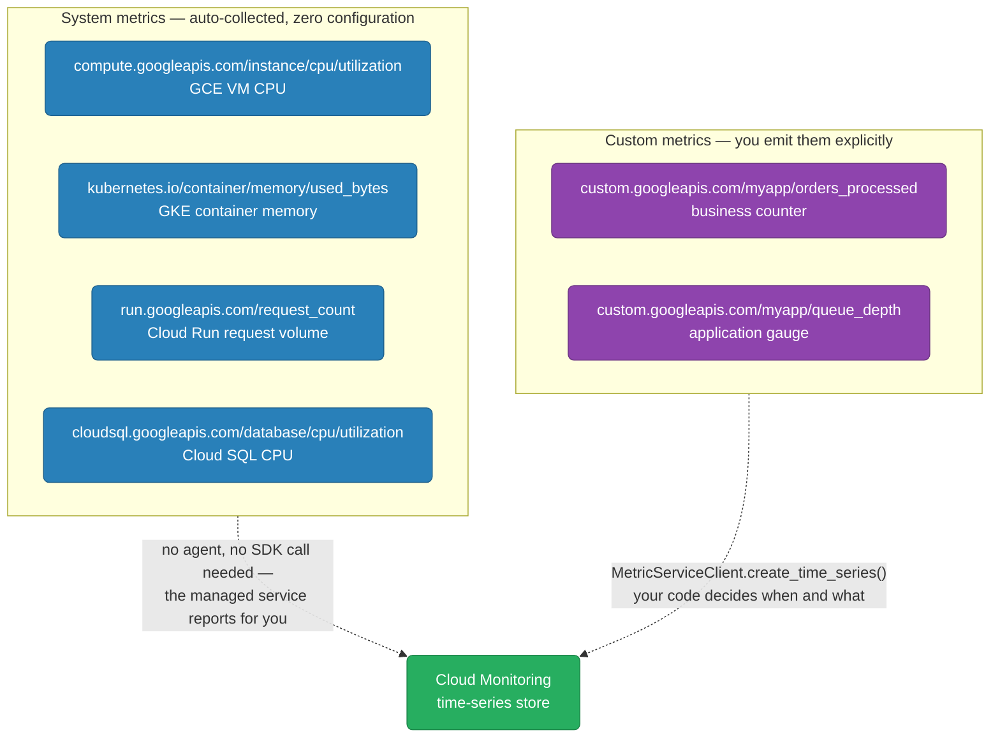
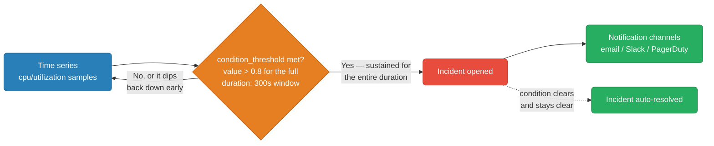
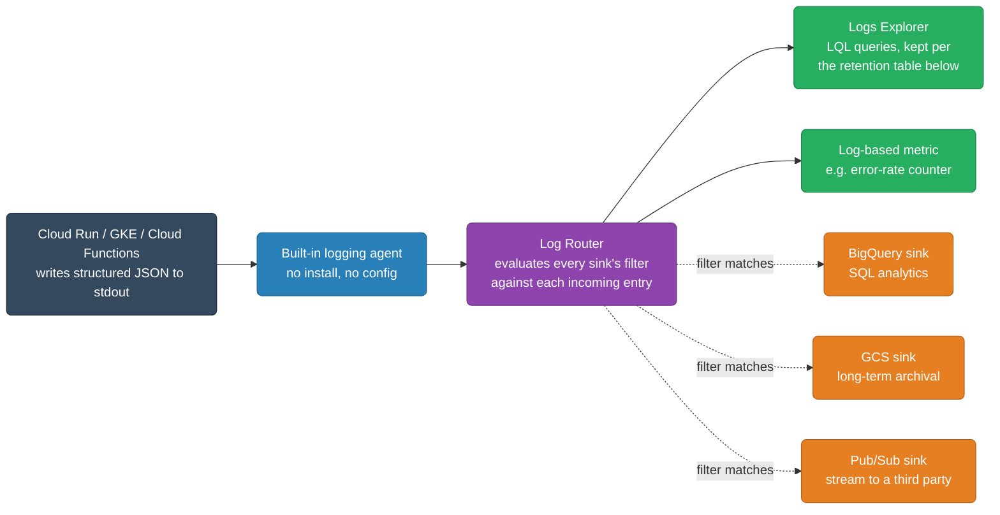
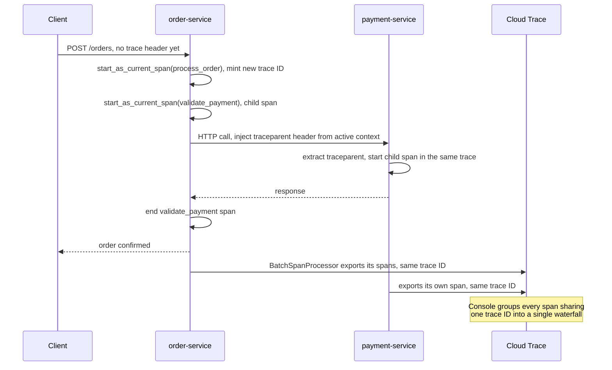
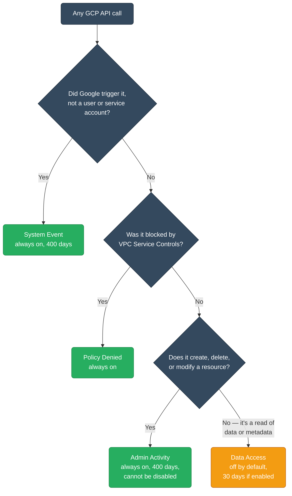

# GCP Observability — Cloud Monitoring, Logging, Trace, Audit Logs

<div class="quiz-progress" data-quiz-progress>
  <span class="quiz-progress-label">0/0 checks</span>
  <span class="quiz-progress-bar"><span class="quiz-progress-fill"></span></span>
</div>

---

## Observability Service Map

| Pillar | AWS | GCP |
|--------|-----|-----|
| Metrics | CloudWatch Metrics | **Cloud Monitoring** |
| Logs | CloudWatch Logs | **Cloud Logging** |
| Traces | X-Ray | **Cloud Trace** |
| Dashboards | CloudWatch Dashboards | **Cloud Monitoring Dashboards** |
| Alerts | CloudWatch Alarms | **Cloud Monitoring Alerting** |
| API audit trail | CloudTrail | **Cloud Audit Logs** |
| Uptime checks | Route 53 Health Checks | **Cloud Monitoring Uptime Checks** |
| Error tracking | — | **Error Reporting** |
| Profiling | — | **Cloud Profiler** |

**GCP advantage**: GKE, Cloud Run, Cloud SQL, GCE all emit structured logs and metrics automatically. In AWS, you often need CloudWatch Agent configuration before metrics appear.

<div class="quiz-card">
  <p class="quiz-q">You spin up a new GKE deployment and a new Cloud Run service. Before either has served a single request, do their CPU and memory metrics already exist in Cloud Monitoring?</p>
  <button class="quiz-reveal">Reveal answer</button>
  <div class="quiz-a" hidden>Yes, effectively from the moment the resource exists — GKE, Cloud Run, Cloud SQL, and GCE all emit structured logs and metrics automatically, with no agent to install or configure. That's the "GCP advantage" over AWS, where the equivalent EC2/ECS metrics typically need a CloudWatch Agent installed and configured first, and nothing shows up until that setup is done.</div>
</div>

---

## Cloud Monitoring

Cloud Monitoring collects metrics from all GCP services automatically. You don't configure agents for managed services.

### Metric Types



<div class="toggle-switch">
  <div class="toggle-buttons">
    <button data-toggle-opt="sys" class="active state-ok">System metrics</button>
    <button data-toggle-opt="custom" class="state-warn">Custom metrics</button>
  </div>
  <div class="toggle-panel active" data-toggle-panel="sys">
    Reported automatically by every managed GCP service — GCE, GKE, Cloud Run, Cloud SQL — with no agent to install and no code to write. This is the "GCP advantage" called out above: the AWS equivalent usually needs a CloudWatch Agent installed and configured before any metric shows up at all.
  </div>
  <div class="toggle-panel" data-toggle-panel="custom">
    Anything business-specific — orders processed, queue depth — has to be emitted explicitly from your application code via <code>MetricServiceClient.create_time_series()</code>. Cloud Monitoring stores and graphs it exactly like a system metric once it arrives, but nothing shows up until your code calls the API.
  </div>
</div>

### Emit Custom Metrics

```python
from google.cloud import monitoring_v3
import time

client = monitoring_v3.MetricServiceClient()
project_name = f"projects/my-project"

series = monitoring_v3.TimeSeries()
series.metric.type = "custom.googleapis.com/myapp/orders_processed"
series.metric.labels["environment"] = "production"
series.resource.type = "global"

now = time.time()
interval = monitoring_v3.TimeInterval({
    "end_time": {"seconds": int(now), "nanos": 0}
})
point = monitoring_v3.Point({
    "interval": interval,
    "value": {"int64_value": 42}
})
series.points = [point]

client.create_time_series(name=project_name, time_series=[series])
```

### Alerting Policies

```bash
# Create an alert when CPU > 80% for 5 minutes
gcloud alpha monitoring policies create \
  --notification-channels=projects/my-project/notificationChannels/12345 \
  --display-name="High CPU Alert" \
  --condition-display-name="CPU > 80%" \
  --condition-filter='resource.type="gce_instance" AND metric.type="compute.googleapis.com/instance/cpu/utilization"' \
  --condition-threshold-value=0.8 \
  --condition-threshold-comparison=COMPARISON_GT \
  --condition-threshold-duration=300s
```

Or use Terraform (recommended for production):

```hcl
resource "google_monitoring_alert_policy" "cpu_alert" {
  display_name = "High CPU Alert"
  combiner     = "OR"

  conditions {
    display_name = "CPU utilization > 80%"
    condition_threshold {
      filter          = "resource.type=\"gce_instance\" AND metric.type=\"compute.googleapis.com/instance/cpu/utilization\""
      duration        = "300s"
      comparison      = "COMPARISON_GT"
      threshold_value = 0.8
    }
  }

  notification_channels = [google_monitoring_notification_channel.email.id]
}
```



<div class="quiz-card">
  <p class="quiz-q">CPU spikes to 95% for 30 seconds, then drops back to 40%. The alert policy above requires CPU &gt; 80% for a duration of 300s. Does it fire?</p>
  <button class="quiz-reveal">Reveal answer</button>
  <div class="quiz-a" hidden>No. The <code>duration</code> field means the condition has to stay true for the entire window — a 30-second spike that then drops back below the threshold never accumulates 300 continuous seconds above 80%, so the timer resets and no incident opens. This is what keeps alerting policies from firing on brief, self-correcting blips.</div>
</div>

### Uptime Checks (= Route 53 Health Checks)

```bash
gcloud monitoring uptime create my-service-uptime \
  --display-name="My API Uptime" \
  --resource-type=uptime-url \
  --hostname=api.example.com \
  --path=/health \
  --port=443 \
  --use-ssl \
  --check-interval=60s
```

---

## Cloud Logging

All GCP services write structured logs automatically. Cloud Run, GKE containers, Cloud Functions, Cloud SQL — everything logs to Cloud Logging without agent setup.



### Log Levels and Structure

```python
import logging
from google.cloud import logging as cloud_logging

# In Cloud Run / GKE: just write structured JSON to stdout
import json, sys

def log(severity, message, **kwargs):
    entry = {
        "severity": severity,
        "message": message,
        "component": "order-service",
        **kwargs
    }
    print(json.dumps(entry), flush=True)

log("INFO", "Order placed", order_id="123", amount=99.99)
log("ERROR", "Payment failed", order_id="123", error="card_declined")
```

Cloud Logging automatically indexes structured JSON fields — you can query by `jsonPayload.order_id` directly.

<div class="quiz-card">
  <p class="quiz-q">You log a structured entry containing jsonPayload.order_id = "123". Do you need to configure a schema or build an index before you can filter on jsonPayload.order_id in a query?</p>
  <button class="quiz-reveal">Reveal answer</button>
  <div class="quiz-a" hidden>No. Cloud Logging automatically indexes structured JSON fields the moment they arrive — there's no schema to declare or index to create up front, unlike raw text logs where you'd need a separate parsing step (like CloudWatch Logs Insights) before a field like this becomes queryable.</div>
</div>

### Log Queries (Cloud Logging Query Language)

```bash
# Query logs via CLI
gcloud logging read 'resource.type="k8s_container" AND severity=ERROR' \
  --limit=50 \
  --freshness=1h \
  --format=json

# Common filters
gcloud logging read 'resource.type="cloud_run_revision" 
  AND resource.labels.service_name="my-api"
  AND severity>=WARNING
  AND timestamp>="2024-01-15T00:00:00Z"' \
  --limit=100
```

```
# Logging Query Language (LQL) — used in console and API

# Filter by log level
severity >= WARNING

# Filter by resource
resource.type = "k8s_container"
resource.labels.namespace_name = "production"

# Filter by log field (structured JSON)
jsonPayload.order_id = "123"
jsonPayload.http_status >= 500

# Full text search
textPayload: "connection refused"

# Time range
timestamp >= "2024-01-15T00:00:00Z" AND timestamp <= "2024-01-15T01:00:00Z"

# Combine
resource.type="cloud_run_revision"
  AND jsonPayload.http_status>=500
  AND severity=ERROR
```

### Log-Based Metrics

Create metrics from log patterns — like CloudWatch Metric Filters:

```bash
# Count ERROR logs per service
gcloud logging metrics create error-rate \
  --description="Errors per service" \
  --log-filter='severity=ERROR AND resource.type="cloud_run_revision"' \
  --value-extractor='EXTRACT(jsonPayload.latency_ms)'   # optional: extract numeric value
```

### Log Sinks — Export to BigQuery / GCS / Pub/Sub

```bash
# Export all ERROR logs to BigQuery for analysis
gcloud logging sinks create errors-to-bigquery \
  bigquery.googleapis.com/projects/my-project/datasets/logs \
  --log-filter='severity >= ERROR'

# Export all logs to GCS (long-term archival)
gcloud logging sinks create all-logs-to-gcs \
  storage.googleapis.com/my-logs-bucket \
  --log-filter='' \
  --include-children   # include logs from child resources
```

<div class="tab-group">
  <div class="tab-buttons">
    <button data-tab="bq" class="active">BigQuery sink</button>
    <button data-tab="gcs">GCS sink</button>
    <button data-tab="pubsub">Pub/Sub sink</button>
  </div>
  <div class="tab-panels">
    <div class="tab-panel active" data-tab-panel="bq">
      Streams matching log entries into a BigQuery dataset as rows. Built for SQL analytics — joining error rates against business tables, dashboards over months of history — at the cost of BigQuery storage and query pricing on top of Cloud Logging's own retention.
    </div>
    <div class="tab-panel" data-tab-panel="gcs">
      Writes matching log entries as files in a Cloud Storage bucket. The cheapest option for long-term archival or compliance retention well past Cloud Logging's own retention window, but not queryable in place — you'd load it elsewhere (BigQuery, grep) before you can search it.
    </div>
    <div class="tab-panel" data-tab-panel="pubsub">
      Publishes matching log entries onto a Pub/Sub topic in near real time. The integration point for streaming logs to a third-party SIEM or observability tool, or for triggering a Cloud Function per log entry — the only sink of the three built for "act on this log now" rather than "store this log."
    </div>
  </div>
</div>

### Log Retention

| Log type | Default retention | Configurable |
|---------|-----------------|-------------|
| Admin Activity | 400 days | No (always kept) |
| Data Access | 30 days | Yes (1–3650 days) |
| System Event | 400 days | No |
| User-written | 30 days | Yes |

<div class="quiz-card">
  <p class="quiz-q">A compliance team wants Admin Activity logs kept for only 90 days instead of the default, to cut storage cost. Can they configure that?</p>
  <button class="quiz-reveal">Reveal answer</button>
  <div class="quiz-a" hidden>No. Admin Activity (and System Event) retention is fixed at 400 days — the table marks both "Not configurable," meaning it can't be shortened, extended, or disabled. Only Data Access and User-written logs have a configurable window, from 1 to 3650 days.</div>
</div>

---

## Cloud Trace

Cloud Trace = AWS X-Ray. Distributed tracing across services.

For GKE and Cloud Run, traces can be auto-collected via OpenTelemetry collector.

### Auto-instrumentation with OpenTelemetry

```python
# requirements.txt
# opentelemetry-api
# opentelemetry-sdk
# opentelemetry-exporter-gcp-trace

from opentelemetry import trace
from opentelemetry.sdk.trace import TracerProvider
from opentelemetry.exporter.cloud_trace import CloudTraceSpanExporter
from opentelemetry.sdk.trace.export import BatchSpanProcessor

# Setup
provider = TracerProvider()
exporter = CloudTraceSpanExporter(project_id="my-project")
provider.add_span_processor(BatchSpanProcessor(exporter))
trace.set_tracer_provider(provider)

tracer = trace.get_tracer(__name__)

# Instrument your code
def process_order(order_id: str):
    with tracer.start_as_current_span("process_order") as span:
        span.set_attribute("order.id", order_id)
        
        with tracer.start_as_current_span("validate_payment"):
            validate_payment(order_id)
        
        with tracer.start_as_current_span("update_inventory"):
            update_inventory(order_id)
```

### Trace Context Propagation

Every span in the `process_order` example above shares one thing: a single trace ID. That's not automatic magic inside one process — it's a context object passed down through every nested `start_as_current_span` call. The moment a request crosses a network boundary into another service, that context has to be serialized into a header and picked back up on the other side, or the two services show up as two disconnected traces instead of one.



<div class="stepper">
  <div class="stepper-panels">
    <div class="stepper-panel active">
      <strong>1. A request arrives with no trace context.</strong> order-service's OpenTelemetry SDK sees no incoming <code>traceparent</code> header, so it mints a brand-new trace ID and starts the root span — this is exactly the <code>process_order</code> span in the code above.
    </div>
    <div class="stepper-panel">
      <strong>2. Nested work becomes child spans.</strong> Each <code>with tracer.start_as_current_span(...)</code> block inside <code>process_order</code> — <code>validate_payment</code>, <code>update_inventory</code> — inherits the active context automatically, so every child span carries the same trace ID as its parent.
    </div>
    <div class="stepper-panel">
      <strong>3. The context crosses the network.</strong> When order-service calls payment-service over HTTP, the SDK's instrumentation injects the active span's context into an outgoing <code>traceparent</code> header — without this step, payment-service has no way to know it's part of the same request.
    </div>
    <div class="stepper-panel">
      <strong>4. The downstream service extracts and continues it.</strong> payment-service's own SDK reads that header and starts its span as a child of the same trace ID, instead of minting a new one — this is what stitches two separate processes into one trace.
    </div>
    <div class="stepper-panel">
      <strong>5. Both sides export independently, Cloud Trace joins them.</strong> Each service's <code>BatchSpanProcessor</code> ships its own spans to Cloud Trace on its own schedule — Cloud Trace has no idea they're related until it groups every span sharing the same trace ID into one waterfall in the console.
    </div>
  </div>
  <div class="stepper-controls">
    <button class="stepper-prev">← Prev</button>
    <span class="stepper-dots"></span>
    <span class="stepper-label"></span>
    <button class="stepper-next">Next →</button>
  </div>
</div>

<div class="quiz-card">
  <p class="quiz-q">order-service calls payment-service over HTTP, but the outgoing request never gets a traceparent header injected. What shows up in Cloud Trace?</p>
  <button class="quiz-reveal">Reveal answer</button>
  <div class="quiz-a" hidden>Two separate, disconnected traces instead of one — payment-service's OpenTelemetry SDK has no incoming trace context to extract, so it mints its own new trace ID for the request, just like order-service did for the original client call. The spans are real and export fine individually; they just never get grouped into a single waterfall, because nothing propagated the shared trace ID across the network boundary.</div>
</div>

### Auto-instrumentation in GKE (OpenTelemetry Operator)

```yaml
# Annotate a deployment for auto-instrumentation (no code changes)
apiVersion: apps/v1
kind: Deployment
metadata:
  name: my-service
  annotations:
    instrumentation.opentelemetry.io/inject-python: "true"
spec:
  template:
    metadata:
      labels:
        app: my-service
```

---

## Cloud Audit Logs

Every GCP API call is logged in Audit Logs. Equivalent to CloudTrail — but mandatory for Admin Activity (cannot be disabled).

### Log Types

| Type | What it captures | Default enabled |
|------|-----------------|----------------|
| **Admin Activity** | Create/delete/modify resources | Always on |
| **Data Access** | Read data, get metadata | Off by default (verbose + costly) |
| **System Event** | Google-initiated (live migrations, auto-repairs) | Always on |
| **Policy Denied** | Requests denied by VPC Service Controls | Always on |



<div class="toggle-switch">
  <div class="toggle-buttons">
    <button data-toggle-opt="admin" class="active state-ok">Admin Activity</button>
    <button data-toggle-opt="data" class="state-warn">Data Access</button>
    <button data-toggle-opt="system" class="state-ok">System Event</button>
    <button data-toggle-opt="policy" class="state-ok">Policy Denied</button>
  </div>
  <div class="toggle-panel active" data-toggle-panel="admin">
    Every create/delete/modify call against a resource's configuration — creating a VM, changing an IAM policy, deleting a bucket. Always on, can't be disabled, and retained for 400 days no matter what — this is the one log GCP guarantees you can always go back and check.
  </div>
  <div class="toggle-panel" data-toggle-panel="data">
    Reads of data and metadata — who fetched an object from a bucket, who ran a query against a table. Off by default because it's verbose and costly at scale: logging every read (not just every write) can dwarf every other log type combined for a busy service. Has to be explicitly enabled per service.
  </div>
  <div class="toggle-panel" data-toggle-panel="system">
    Google-initiated actions on your resources that you didn't trigger yourself — a live VM migration off failing hardware, an automatic repair. Always on, because these are exactly the events you'd otherwise have no way to explain a sudden state change.
  </div>
  <div class="toggle-panel" data-toggle-panel="policy">
    Requests that VPC Service Controls denied before they ever reached the target service. Always on — this is your record of "something tried to cross a security perimeter and got blocked," which is precisely the kind of event you don't want to be able to turn off.
  </div>
</div>

<div class="quiz-card">
  <p class="quiz-q">A team wants to audit who is reading objects out of a specific Cloud Storage bucket. Do Admin Activity logs already cover that?</p>
  <button class="quiz-reveal">Reveal answer</button>
  <div class="quiz-a" hidden>No. Admin Activity only captures create/delete/modify calls against resources — reading an object is a Data Access event, which is off by default because it's verbose and costly at scale. The team needs to explicitly enable Data Access logging (DATA_READ / DATA_WRITE) for storage.googleapis.com via an IAM audit config before those reads start showing up anywhere.</div>
</div>

```bash
# Query audit logs for all GCS deletions
gcloud logging read \
  'protoPayload.serviceName="storage.googleapis.com"
   AND protoPayload.methodName="storage.objects.delete"' \
  --freshness=24h

# Query for who modified IAM policies
gcloud logging read \
  'protoPayload.methodName="SetIamPolicy"
   AND protoPayload.serviceName="iam.googleapis.com"' \
  --freshness=7d
```

### Enable Data Access Logs

```bash
# Enable for Cloud Storage (logs all read/write access)
gcloud projects get-iam-policy my-project > policy.yaml
# Add to policy.yaml:
#   auditConfigs:
#   - auditLogConfigs:
#     - logType: DATA_READ
#     - logType: DATA_WRITE
#     service: storage.googleapis.com
gcloud projects set-iam-policy my-project policy.yaml
```

---

## Error Reporting

Automatically groups exceptions from Cloud Run, GKE, App Engine, and Cloud Functions. No setup needed — just let exceptions bubble with a stack trace.

```bash
# View errors
gcloud error-reporting events list --service=my-api --version=v2
```

In the console: Error Reporting shows count, first/last seen, affected users, and the stack trace grouped by error signature.

<div class="quiz-card">
  <p class="quiz-q">Your Cloud Run service throws an unhandled exception with a stack trace, written to stderr. Do you need to install or configure anything for it to show up in Error Reporting?</p>
  <button class="quiz-reveal">Reveal answer</button>
  <div class="quiz-a" hidden>No. Error Reporting automatically groups exceptions from Cloud Run, GKE, App Engine, and Cloud Functions with zero setup — just let the exception bubble up with its stack trace intact. It groups by error signature, so the same underlying bug from a thousand requests shows up as one entry with a count, not a thousand separate log lines to dig through.</div>
</div>

---

## Cloud Profiler

Continuous CPU and memory profiling in production. No sampling gaps, minimal overhead (<1%). Equivalent to AWS CodeGuru Profiler.

```python
# Add to your main.py
import googlecloudprofiler

googlecloudprofiler.start(
    service="my-api",
    service_version="1.0.0",
    project_id="my-project"
)
```

Shows flame graphs in the GCP console — where CPU time is actually spent in production.

<div class="quiz-card">
  <p class="quiz-q">A teammate says continuous profiling in production is too risky — "won't it slow everything down under load?" What does Cloud Profiler's own design say about that tradeoff?</p>
  <button class="quiz-reveal">Reveal answer</button>
  <div class="quiz-a" hidden>Cloud Profiler is built for exactly this — continuous CPU and memory profiling with minimal overhead (&lt;1%) and no sampling gaps, meant to run in production, not just in a one-off debugging session. The usual tradeoff a traditional profiler forces — sample occasionally and risk missing the exact spike you care about, or profile continuously and eat a big performance tax — doesn't really apply here.</div>
</div>

---

## Monitoring Stack Summary

| Need | Tool |
|------|------|
| VM / GKE / Cloud Run metrics | Cloud Monitoring (automatic) |
| Custom business metrics | Cloud Monitoring custom metrics |
| Application logs | Cloud Logging (write structured JSON to stdout) |
| Log queries and alerts | Cloud Logging + Log-based metrics |
| Distributed tracing | Cloud Trace + OpenTelemetry |
| Audit trail (who did what) | Cloud Audit Logs |
| Exception tracking | Error Reporting |
| Production CPU profiling | Cloud Profiler |
| Long-term log archival | Log Sink → GCS |
| Log analytics with SQL | Log Sink → BigQuery |
| Third-party (Grafana, etc.) | Metrics via Cloud Monitoring API |

### GCP vs AWS Observability

| | GCP | AWS |
|--|---|---|
| **Auto-instrumentation** | GKE + Cloud Run log/metric automatically | Requires CloudWatch agent for EC2 |
| **Log format** | Structured JSON indexed immediately | Raw text (Insights adds parsing) |
| **Trace format** | CloudEvents / OTel (open standard) | X-Ray format (proprietary) |
| **Audit log retention** | Admin Activity: 400 days (permanent) | CloudTrail: configurable, paid |
| **Uptime checks** | Free (50 checks) | Route 53 health checks ($0.50/check/mo) |
| **Error grouping** | Error Reporting (automatic) | CloudWatch (manual) |
