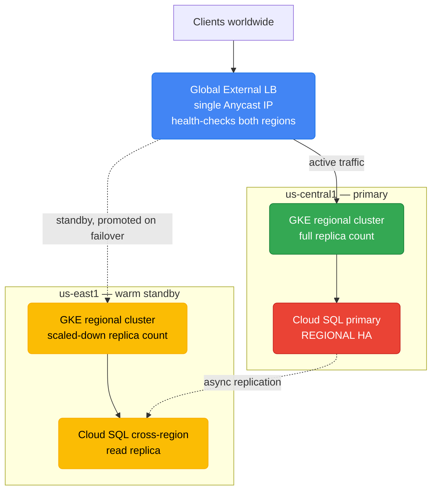
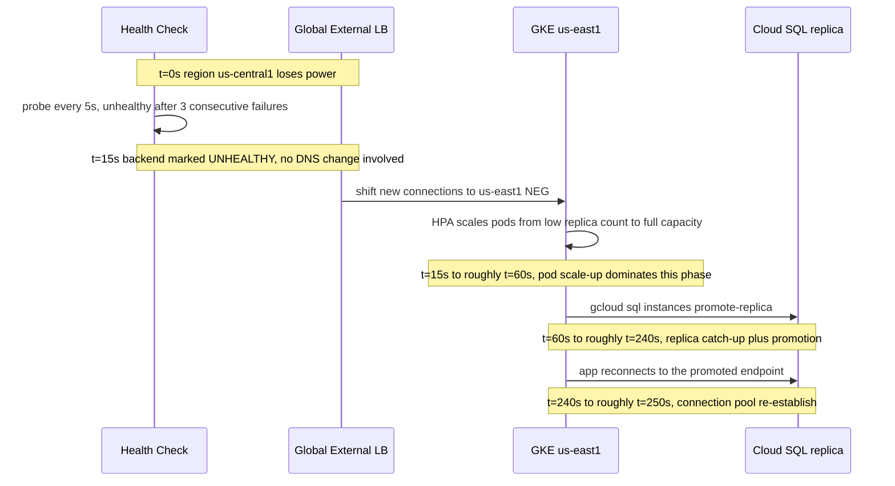

# GCP Reliability and Disaster Recovery Design

`gcp/databases.md`, `gcp/gke.md`, and `gcp/storage.md` each already cover the
per-service HA and replication mechanics in depth — Cloud SQL's regional
standby, Spanner's TrueTime commit-wait, GKE's regional control plane, GCS's
multi-region replication. What's missing is the layer above all of that: a
single framework for deciding *how much* of that machinery a given workload
actually needs, and how compute, data, and networking choices have to move
together during a real failure. This file is that synthesizing layer — it
cross-references the per-service mechanics rather than re-deriving them.

  0/0 checks
  

---

## Start From RTO/RPO, Not From the Architecture

Two numbers should exist *before* anyone picks a database tier or a cluster
topology:

- **RTO (Recovery Time Objective):** how long the service is allowed to be
  down before the business impact is unacceptable.
- **RPO (Recovery Point Objective):** how much data — measured in time — the
  business can afford to lose if the primary disappears mid-write.

The common mistake runs backwards: a team picks "multi-region" because it
sounds robust, then reverse-engineers a justification for the cost. The
correct order is to state RTO/RPO first as an actual SLA-backed number, then
let the architecture fall out of it. A workload with an RTO of 4 hours and an
RPO of 1 hour needs almost none of the machinery a workload with an RTO of 30
seconds needs — and paying for the latter when you only need the former is a
standing cost, not a one-time decision.

| RTO / RPO band | Pattern | Typical GCP shape | Relative cost |
|---|---|---|---|
| RTO: hours–days · RPO: hours | Backup and restore | Cloud SQL automated backups + PITR restored into a new instance; GKE Backup for GKE restored into a freshly created cluster; GCS cross-bucket copy via Storage Transfer Service | $ |
| RTO: 10s of minutes · RPO: minutes | Pilot light | A minimal, always-on core kept warm — a small cross-region Cloud SQL read replica, an empty or near-empty standby GKE cluster with manifests staged — scaled up only on failover | $$ |
| RTO: minutes · RPO: seconds | Warm standby | A full-shape but scaled-down replica stack running continuously in the second region — GKE regional cluster at low replica count, Cloud SQL cross-region replica already caught up, GCS dual-region bucket | $$$ |
| RTO: near-zero · RPO: near-zero | Multi-site active/active | Spanner multi-region config (no failover step exists), GKE regional clusters in 2+ regions serving live traffic simultaneously behind one Global External LB, GCS multi-region bucket | $$$$ |

  
A team wants "the most resilient setup possible" for a workload with no stated RTO/RPO target. What's the actual first step, before picking any GCP service?

  <button class="quiz-reveal">Reveal answer</button>
  
Write down the RTO/RPO numbers first — how long the business can tolerate an outage, and how much data loss is acceptable. Without those numbers, "most resilient possible" has no stopping point and defaults to over-building (multi-site active/active pricing for a workload that could have tolerated backup-and-restore). The architecture is supposed to be derived from the SLA, not the other way around.

---

## Google's Four DR Patterns

This is Google's own documented DR framework, and it maps directly onto the
mechanisms already covered elsewhere in this section — nothing below is a new
mechanic, only a new way of grouping the ones that already exist.

  

    <button data-toggle-opt="backup" class="active state-bad">Backup & restore</button>
    <button data-toggle-opt="pilot" class="state-warn">Pilot light</button>
    <button data-toggle-opt="warm" class="state-warn">Warm standby</button>
    <button data-toggle-opt="active" class="state-ok">Multi-site active/active</button>
  

  

    Cheapest, highest RTO/RPO. Nothing runs in the DR location day-to-day — recovery means restoring from a backup artifact into freshly created infrastructure. Cloud SQL's automated backups + point-in-time recovery restore into a brand-new instance; GKE's Backup for GKE restores cluster config and PV volumes into a freshly created cluster; GCS relies on a separate cross-bucket/cross-project copy, since multi-region replication alone doesn't protect against logical deletion. RTO is measured in hours because everything has to be provisioned before it can serve traffic.
  

  

    A minimal core stays running permanently so recovery is "scale up," not "provision from zero." A small cross-region Cloud SQL read replica stays synced but undersized; a standby GKE cluster exists with manifests already applied but node pools scaled to near-zero. On failover, the replica is promoted (<code>gcloud sql instances promote-replica</code>, per <code>gcp/databases.md</code>) and the cluster's autoscaler adds capacity. Spanner has no real pilot-light tier — multi-region Spanner is already past this pattern entirely.
  

  

    A full-shape replica of the stack runs continuously, just under-scaled relative to production traffic. A GKE regional cluster in the second region runs the same manifests at a low replica count instead of zero; a Cloud SQL cross-region read replica stays continuously caught up to within its replication lag; a GCS dual-region bucket (<code>NAM4</code>, per <code>gcp/storage.md</code>) already replicates synchronously with a Turbo Replication SLA. Failover is "promote and scale out," not "provision" — the main worked walkthrough below is this pattern.
  

  

    Near-zero RTO/RPO, highest cost and complexity, because both (or all) sites are already serving live production traffic — there's no failover step to trigger, only a smaller share of traffic to absorb when one site drops out. Cloud Spanner in a multi-region config is the purest expression of this: per <code>gcp/databases.md</code>'s TrueTime section, every region already accepts strongly consistent reads and writes continuously, so there's nothing to promote. GKE regional clusters in 2+ regions behind one Global External LB and a GCS multi-region bucket complete the picture. Cloud SQL cannot do this — it's single-writer by architecture, which is exactly the gap Spanner exists to close.
  

  
Does Cloud Spanner in a multi-region configuration need a manual failover step the way Cloud SQL's replica promotion does?

  <button class="quiz-reveal">Reveal answer</button>
  
No. Cloud SQL's cross-region replica is asynchronous and requires a manual <code>promote-replica</code> action to become writable — that promotion step is exactly where a chunk of RTO gets spent. Spanner multi-region has no equivalent step: every region is already a live participant in the same strongly consistent database via TrueTime's commit-wait, so losing one region doesn't require promoting anything — the remaining regions were already serving reads and writes. This is the core reason Spanner is Google's answer to the multi-site active/active pattern specifically, and why it "skips" the pilot-light/warm-standby patterns that exist mainly to work around a single-writer architecture.

---

## Multi-Zone vs Multi-Region: An Explicit Tradeoff

Most production workloads should default to **regional HA (multi-zone)**, not
multi-region. Zone failures are the statistically dominant failure mode a
cloud workload actually experiences — a rack loses power, a zone's network
fabric degrades — and regional HA absorbs exactly that at a fraction of the
cost and operational complexity of running two full regional footprints.
Multi-region is worth its cost when there's a genuine near-zero-RTO
requirement, a regulatory data-residency mandate, or the workload is
inherently global (Spanner's own sweet spot) — not as a default "just in
case" posture.

  

    <button data-tab="singlezone" class="active">Single-zone</button>
    <button data-tab="multizone">Multi-zone (regional HA)</button>
    <button data-tab="multiregion">Multi-region</button>
  

  

    

      <strong>Example stack:</strong> a zonal Cloud SQL instance (no <code>--availability-type=REGIONAL</code>), a zonal GKE cluster, a regional GCS bucket. Cheapest possible tier, and the correct choice for dev/test or genuinely disposable workloads — but a single zone outage is a full outage, with no automatic failover anywhere in the stack.
    

    

      <strong>Example stack — the recommended default for most production workloads:</strong> Cloud SQL with <code>--availability-type=REGIONAL</code> (synchronous standby in a different zone, per <code>gcp/databases.md</code>), a regional GKE cluster (control plane replicated across 3 zones, nodes spread across zones, per <code>gcp/gke.md</code>), and a regional GCS bucket. Survives the dominant real-world failure mode — one zone going down — with automatic failover and no cross-region latency or replication-lag tradeoffs to reason about.
    

    

      <strong>Example stack:</strong> Spanner in a multi-region config, or Cloud SQL with a promotable cross-region replica; GKE regional clusters in two or more regions; a GCS multi-region bucket; all fronted by a Global External LB. Reserved for workloads with a stated near-zero-RTO SLA or genuine multi-region traffic — the cost and operational surface (cross-region networking, replication lag reasoning, doubled infrastructure) is real and shouldn't be paid by default.
    

  

  
A team argues every production service should run multi-region "to be safe." What failure-mode argument pushes back on that as the default?

  <button class="quiz-reveal">Reveal answer</button>
  
Zone failures are far more common in practice than full-region failures, and regional HA (multi-zone) already absorbs that dominant failure mode — synchronous standby for Cloud SQL, a 3-zone-replicated control plane and multi-zone nodes for GKE — at a fraction of multi-region's cost and complexity. Multi-region is worth paying for when there's a genuine near-zero-RTO requirement or a real cross-region traffic pattern, not as a blanket default for every service regardless of its actual SLA.

---

## Worked Walkthrough: Regional Outage Failover

Scenario: a 3-tier app sits behind a Global External LB, with GKE regional
clusters in two regions and a Cloud SQL primary plus a continuously-caught-up
cross-region read replica — the **warm standby** pattern from above.

A GCP-specific nuance worth calling out before the timeline: the Global
External LB serves one **Anycast IP address** for both regions, not a DNS
record pointing at a region-specific endpoint. That means failover at the
networking layer doesn't wait on DNS TTL propagation the way Route 53
failover does — the LB itself simply stops routing new connections to the
unhealthy backend. The RTO clock here is dominated by something else
entirely.

  

    

      <strong>1. Detection (~15s).</strong> The Global External LB's health check hits the failing region's backend every 5 seconds; after 3 consecutive failures the NEG is marked unhealthy. This is fast because it's a network-layer health check, not a DNS TTL waiting to expire.
    

    

      <strong>2. Traffic rerouting (near-instant).</strong> Because the LB serves a single Anycast IP for both regions, marking the backend unhealthy is enough — new connections route to <code>us-east1</code> immediately, with no client-side DNS cache to invalidate and no propagation delay to wait out.
    

    

      <strong>3. Compute scale-up (~30-60s).</strong> The standby GKE cluster in <code>us-east1</code> was already running at a low replica count (warm standby), so this step is the Horizontal Pod Autoscaler adding pods to already-provisioned nodes — not a cluster being created from scratch, which is the whole point of not using a colder pattern here.
    

    

      <strong>4. Database promotion — the dominant cost (~2-4 minutes).</strong> <code>gcloud sql instances promote-replica</code> turns the cross-region read replica into a standalone writable primary. This step, not the network failover or the pod scale-up, eats most of the RTO budget — the replica has to finish catching up to the primary's last replicated transaction and flip out of read-only mode.
    

    

      <strong>5. Application reconnection (~seconds).</strong> Connection pools holding stale connections to the old primary's endpoint drop and reconnect, assuming the app already retries with backoff — the same operational hygiene AWS RDS/Aurora failovers require.
    

  

  

    <button class="stepper-prev">← Prev</button>
    
    
    <button class="stepper-next">Next →</button>
  

Total RTO here lands around 2.5-5 minutes, and — just like the AWS Aurora
Global Database walkthrough this mirrors — the dominant cost isn't losing
data (the replica's RPO is typically seconds) and it isn't DNS. It's the
**database promotion step**. The mechanism differs from AWS's "DNS TTL plus
promotion" story specifically because GCP's Global External LB is
Anycast-based rather than DNS-based, but the shape of the lesson repeats:
compute fails over fast, data-layer promotion is what you're actually
waiting on. Swap Cloud SQL for Spanner multi-region in this same diagram and
step 4 disappears entirely — there is no replica to promote, because
`us-east1` was already a live write participant before the outage started.

  
In this walkthrough, why doesn't the failover wait on DNS propagation the way a Route 53-based AWS failover does?

  <button class="quiz-reveal">Reveal answer</button>
  
Because GCP's Global External LB serves a single Anycast IP address shared by both regions' backends, rather than a DNS record that has to be repointed and then wait out a TTL before clients pick up the change. Marking a region's NEG unhealthy is enough to stop routing new connections there — there's no separate DNS layer in the failover path at all. The RTO budget shifts almost entirely onto whatever the data layer needs to do (here, Cloud SQL's replica promotion).

---

## Backup and Restore, Applied: A Cloud SQL PITR Walkthrough

The backup-and-restore pattern from earlier isn't hypothetical — it's what
happens whenever the failure isn't infrastructure loss but a bad write (a
migration that drops data, an application bug that corrupts rows) and a
warm-standby replica would faithfully replicate the mistake too.

  

    

      <strong>1. Bad write detected.</strong> A migration or application bug has corrupted or deleted rows, and — critically — a warm-standby replica isn't a safety net here, since it would have already replicated the same bad write.
    

    

      <strong>2. Identify the recovery point.</strong> <code>gcloud sql backups list</code> plus the transaction log determine the last known-good timestamp, inside the 7-day PITR window covered in <code>gcp/databases.md</code>.
    

    

      <strong>3. Restore into a brand-new instance.</strong> Cloud SQL's point-in-time recovery does not repair the existing instance in place — it clones the target timestamp into a newly created instance, leaving the corrupted original untouched for forensics.
    

    

      <strong>4. Cutover.</strong> Application config is repointed at the new instance's connection name — this is a manual, scripted step, not an automatic promotion the way replica failover is.
    

    

      <strong>5. RTO lands in hours, by design.</strong> Provisioning a new instance and validating the restored data takes real time — this is the tradeoff backup-and-restore explicitly accepts in exchange for being the cheapest pattern with nothing running idle the rest of the time.
    

  

  

    <button class="stepper-prev">← Prev</button>
    
    
    <button class="stepper-next">Next →</button>
  

  
A migration corrupts rows in the Cloud SQL primary. Does promoting the cross-region read replica (the warm-standby mechanism from the earlier walkthrough) fix this?

  <button class="quiz-reveal">Reveal answer</button>
  
No — a read replica streams the same writes the primary makes, corrupted rows included, so promoting it just hands you a second copy of the mistake. Logical corruption needs point-in-time recovery to a timestamp before the bad write, restored into a new instance, not a failover to a replica that already has the same damage. This is exactly why backup-and-restore and warm-standby solve different failure classes — infrastructure loss vs. bad data — and a mature DR posture usually needs both.

---

## Backup Strategy Across the Data Layer

Every pattern above eventually depends on what each individual service can
actually back up, and at what granularity. This is the cross-cutting summary
— mechanism and typical RPO per service, so the full data-layer DR posture is
visible at a glance rather than scattered across five files.

| Service | Backup mechanism | PITR support | Typical RPO | Cross-region option |
|---|---|---|---|---|
| **Cloud SQL** | Automated daily backups + transaction logs | Yes, 7-day window (`gcp/databases.md`) | Seconds–minutes (log-based) | Cross-region read replica, manually promoted |
| **Spanner** | Scheduled backups (up to 1 year retention) + PITR (up to 7 days via versioned reads) | Yes | Near-zero in a multi-region config (no replica to lag) | Built into multi-region config — no separate DR copy needed |
| **GKE** | Backup for GKE (Velero-based): captures workload config + PV volume snapshots | No — snapshot-based, not continuous | Depends on backup schedule (typically hours) | Restore into a cluster in any region |
| **GCS** | Object Versioning (`gcp/storage.md`) + Storage Transfer Service for independent copies | Effectively yes via versioning | Near-zero for versioning; scheduled for cross-bucket copies | Multi-region/dual-region built-in; independent copy needs its own bucket/project |
| **Bigtable** | Multi-cluster replication (`gcp/bigtable.md`) — not a backup, a live async copy; separate table backups also exist | No | Seconds (replication lag) for HA; backup-based RPO is scheduled | Cross-region clusters within one instance |
| **Firestore** | Managed daily export to GCS, plus point-in-time recovery (7-day window) | Yes (PITR add-on) | Near-zero with PITR enabled; otherwise daily | Multi-region database mode is built-in, not a separate backup |

  
A team stores its GCS bucket as multi-region and considers that sufficient protection against an engineer accidentally running a bulk delete. Is multi-region replication doing that job?

  <button class="quiz-reveal">Reveal answer</button>
  
No. Multi-region replication protects against a region-level infrastructure failure by keeping copies in multiple regions — but a delete issued through the API replicates too, since every region is serving the same live, mutable object namespace. What actually protects against an accidental or malicious delete is Object Versioning (noncurrent objects stay retrievable by generation, per <code>gcp/storage.md</code>) or a genuinely separate backup copy via Storage Transfer Service — a different failure class needs a different mechanism, the same lesson the Cloud SQL PITR walkthrough above makes for logical corruption.

---

## Putting It Together

The through-line across every section here is the same: state the RTO/RPO
number first, pick the cheapest of the four patterns that actually satisfies
it, and default to regional HA rather than multi-region unless the number
demands otherwise. Spanner is the one service in this whole section that lets
you buy your way out of the failover-step problem entirely — every other
service still has some manual or automated promotion sitting between an
outage and full recovery, and that promotion step is usually where the real
RTO budget goes, not the data loss itself.
</content>
