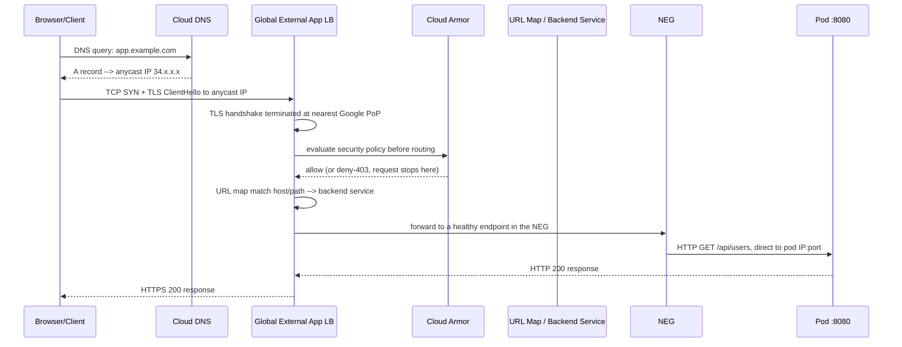
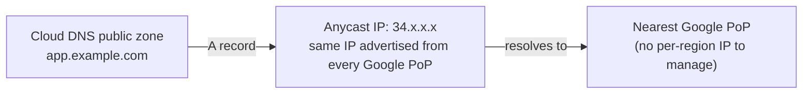
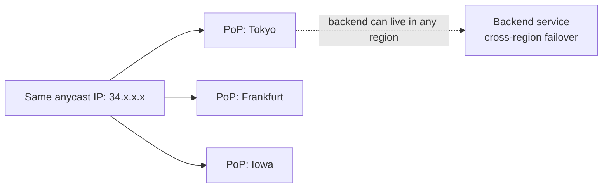
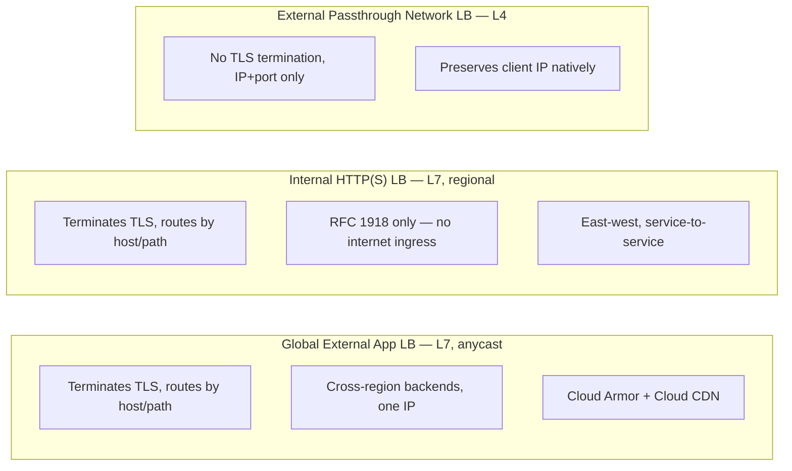
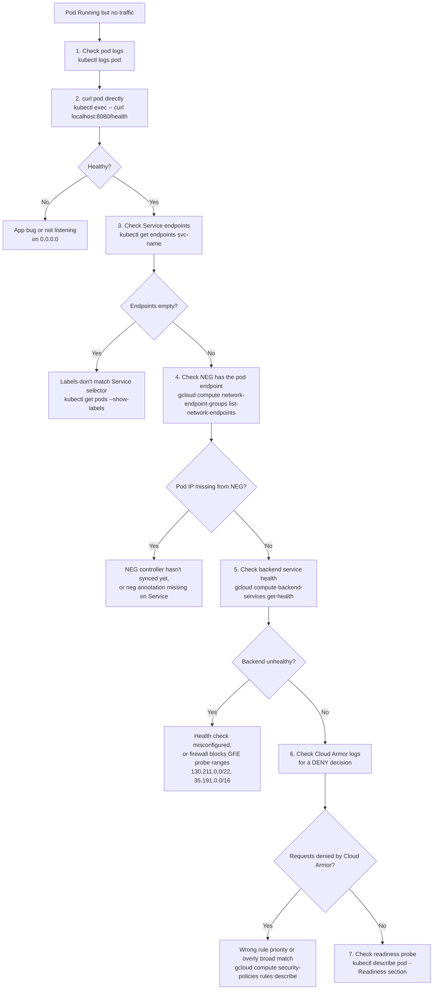

# Request Flow: Cloud DNS → GLB → Pod

A request behind a Global External Application Load Balancer touches anycast DNS, edge TLS termination, a WAF evaluation, host/path routing, and a container-native backend lookup before it reaches a pod — in that order. This doc walks the full path once as a sequence diagram, then breaks each hop down on its own. For deeper NEG mechanics, see `gke.md`'s "GKE Load Balancing" section — this file compresses that into one end-to-end narrative, not a re-derivation.

<div class="quiz-progress" data-quiz-progress>
  <span class="quiz-progress-label">0/0 checks</span>
  <span class="quiz-progress-bar"><span class="quiz-progress-fill"></span></span>
</div>

## Full Request Path



<div class="quiz-card">
  <p class="quiz-q">Cloud Armor sits between the anycast IP and the URL map in the diagram above. What does that ordering mean for a request Cloud Armor decides to deny?</p>
  <button class="quiz-reveal">Reveal answer</button>
  <div class="quiz-a" hidden>It never reaches the URL map, the backend service, the NEG, or the pod at all. Cloud Armor's security-policy evaluation happens at the edge, before any routing decision is made — a denied request gets a 403 straight back from the load balancer layer. That's the whole point of evaluating it this early: a malicious or blocked request never costs the backend a single cycle.</div>
</div>

---

## Layer by Layer

Same path, broken into the hops a request crosses end to end — Cloud DNS, the LB itself, Cloud Armor, then the routing chain down to a pod. Step through it once here, then read each hop's detail below.

<div class="stepper">
  <div class="stepper-panels">
    <div class="stepper-panel active">
      <strong>1. Cloud DNS.</strong> The client resolves <code>app.example.com</code>. Cloud DNS returns a plain <code>A</code> record pointing straight at the load balancer's static global anycast IP &mdash; no ALIAS record needed, because unlike an ALB's dynamic DNS name, this IP never changes.
    </div>
    <div class="stepper-panel">
      <strong>2. Global External App LB.</strong> The client's TCP+TLS connection lands at whichever Google point-of-presence is physically nearest to it. TLS terminates right there, at the edge, using a Google-managed or uploaded certificate.
    </div>
    <div class="stepper-panel">
      <strong>3. Cloud Armor.</strong> Before any routing decision is made, the decrypted request is evaluated against the backend service's (or edge's) security policy &mdash; IP allow/deny lists, rate-based rules, preconfigured WAF rules. A denied request stops here and never costs the backend anything.
    </div>
    <div class="stepper-panel">
      <strong>4. URL Map, Backend Service, NEG.</strong> The URL map matches the request's host/path to a backend service, which in turn selects a healthy endpoint from its Network Endpoint Group &mdash; container-native load balancing means that endpoint is a pod IP, not a node IP.
    </div>
    <div class="stepper-panel">
      <strong>5. Pod.</strong> The request lands directly on the pod's IP:port, skipping kube-proxy and iptables entirely. The response flows straight back through the same chain to the client.
    </div>
  </div>
  <div class="stepper-controls">
    <button class="stepper-prev">← Prev</button>
    <span class="stepper-dots"></span>
    <span class="stepper-label"></span>
    <button class="stepper-next">Next →</button>
  </div>
</div>

### 1. Cloud DNS



- Plain **A record** to the LB's static IP is enough — Cloud DNS has no ALIAS type, but the Global LB's IP is static and anycast, so an A record at the apex works natively (unlike Route53, which needs an Alias for a dynamic ALB IP). See `services-overview.md`'s Cloud DNS section for the full record-type comparison.
- One IP serves the whole planet — no per-region DNS answer to compute or fail over between.
- TTL typically 300s for a public zone.

### 2. Global External Application Load Balancer

Architecturally this is the biggest departure from a regional LB (an ALB, or GCP's own Regional External/Internal App LB): the same anycast IP is advertised simultaneously from every Google PoP worldwide. There's no DNS-level trick making this work — it's BGP anycast, so each client's packets are naturally attracted to whichever PoP is topologically closest, and TLS terminates right there rather than after a trip to a single region.



A regional LB has exactly one IP scoped to one region — covering multiple regions means standing up a separate LB per region and routing between them yourself. The Global LB collapses that into one IP and lets the backend service fail over across regions on its own.

### 3. Cloud Armor

Cloud Armor's evaluation happens **before the request ever reaches a backend** — the whole point of putting it at the edge rather than as an in-cluster filter. Two attachment points exist: **backend security policies**, attached to a backend service and evaluated once the URL map has picked it but still before forwarding to a NEG; and **edge security policies**, evaluated earlier still at the Cloud CDN caching layer, so even a cache hit never touching your backend can be filtered. Either way, rules are evaluated in priority order (lowest number first, same convention as VPC firewall rules) and the first match wins — `allow`, `deny(403)`, `rate_based_ban`, or `throttle`.

```bash
gcloud compute security-policies rules create 1000 \
  --security-policy=my-waf-policy \
  --src-ip-ranges="1.2.3.0/24" --action=deny-403

gcloud compute backend-services update api-backend \
  --security-policy=my-waf-policy --global
```

### 4. URL Map → Backend Service → NEG

The URL map matches the request's host and path to a backend service — the same job an ALB's listener rules do. From there, GKE pods are exposed through a **Network Endpoint Group**: the NEG controller (`cloud.google.com/neg` annotation) registers each Ready pod's IP:port directly as a NEG endpoint, so the LB's data path goes straight to the pod — no NodePort, no kube-proxy iptables/IPVS hop. That's container-native load balancing in one sentence; `gke.md`'s GKE Load Balancing section walks the annotate → create → sync → remove lifecycle in full.

### 5. Health Checks

Two independent health signals gate traffic, and they're easy to conflate. **Kubernetes readiness** decides NEG *membership* — a NotReady pod gets pulled out of the NEG entirely. **The load balancer's own health check** is a separate, GCP-managed probe hitting each NEG endpoint's path/port directly, independent of Kubernetes — typical defaults: `checkIntervalSec: 5`, `timeoutSec: 5`, `healthyThreshold: 2`, `unhealthyThreshold: 3`. A pod can be present in the NEG (Ready, per Kubernetes) while the GCP health check still marks it `UNHEALTHY` — a firewall blocking Google's health-check ranges (`130.211.0.0/22`, `35.191.0.0/16`) is a common reason those two signals disagree.

<div class="quiz-card">
  <p class="quiz-q">A pod's IP shows up in the NEG's endpoint list, but the backend service still reports it as UNHEALTHY. Does that mean the NEG registration is wrong?</p>
  <button class="quiz-reveal">Reveal answer</button>
  <div class="quiz-a" hidden>No — these are two separate systems. NEG membership only reflects Kubernetes readiness. Backend-service health comes from GCP's own checker actively probing that endpoint, independent of the cluster. A wrong health-check path/port, or a firewall blocking Google's health-check ranges (130.211.0.0/22, 35.191.0.0/16), can make an endpoint present-but-unhealthy at the same time.</div>
</div>

---

## Global External vs Internal HTTP(S) vs Passthrough Network LB



<div class="toggle-switch">
  <div class="toggle-buttons">
    <button data-toggle-opt="global" class="active">Global External App LB</button>
    <button data-toggle-opt="internal">Internal HTTP(S) LB</button>
    <button data-toggle-opt="passthrough">Passthrough Network LB</button>
  </div>
  <div class="toggle-panel active" data-toggle-panel="global">
    L7, anycast, internet-facing. Terminates TLS at the edge and routes by host/path to backend services spanning regions under one static IP &mdash; that HTTP-level visibility is what buys Cloud Armor and Cloud CDN integration. Tradeoff: the pod never sees the client's real source IP on the TCP connection, only via forwarded headers.
  </div>
  <div class="toggle-panel" data-toggle-panel="internal">
    L7, regional, VPC-internal only &mdash; every address involved is RFC 1918. Same host/path routing as the global LB, scoped to one region, for service-to-service (east-west) traffic instead of internet ingress. Same client-IP tradeoff, since it still terminates the connection.
  </div>
  <div class="toggle-panel" data-toggle-panel="passthrough">
    L4 only &mdash; never terminates TLS, never reads a byte of HTTP. It forwards packets essentially unmodified, which is why the backend sees the original client IP natively with zero extra config. The tradeoff mirrors the other two: no path-based routing at all, since there's no HTTP request to route on.
  </div>
</div>

| Feature | Global External App LB | Internal HTTP(S) LB | External Passthrough Network LB |
|---------|------------------------|----------------------|----------------------------------|
| Layer | L7 | L7 | L4 |
| Scope | Global, anycast | Regional, VPC-internal | Regional |
| TLS | Terminates | Terminates | Passthrough (no termination) |
| Routing | Host/path (URL map) | Host/path (URL map) | IP + port only |
| Client IP at backend | Via forwarded header | Via forwarded header | Preserved natively |
| Cloud Armor | Yes | Optional | No (not an L7 policy point) |
| Use case | Public web apps, APIs | Internal microservices | TCP-native protocols, static-IP needs |

<div class="quiz-card">
  <p class="quiz-q">Which of these three preserves the original client IP at the backend without any extra header or configuration?</p>
  <button class="quiz-reveal">Reveal answer</button>
  <div class="quiz-a" hidden>The External Passthrough Network LB. It's L4-only and never terminates the client's connection, so the packet the backend receives still has the client's real IP as its source address — nothing to forward, nothing to parse. Both the Global External App LB and the Internal HTTP(S) LB terminate the connection to do their L7 routing, so the pod only sees the load balancer's IP on the TCP connection itself; the real client IP only survives via a forwarded-for style header.</div>
</div>

---

## Backend Service Load Balancing Modes

GCP doesn't pick one fixed algorithm the way "round robin" implies — it distributes requests based on each backend's **balancing mode**, which defines what "at capacity" even means.

<div class="tab-group">
  <div class="tab-buttons">
    <button data-tab="rate" class="active">RATE</button>
    <button data-tab="connection">CONNECTION</button>
    <button data-tab="utilization">UTILIZATION</button>
  </div>
  <div class="tab-panels">
    <div class="tab-panel active" data-tab-panel="rate">
      <strong>The mode NEG-backed backends actually use.</strong> Capacity is a maximum requests-per-second, set with <code>--max-rate-per-endpoint</code>. The only mode GKE pods behind a container-native backend service can use, since there's no CPU signal for one pod endpoint to report.
      <pre><code class="language-mermaid">graph LR
    REQ["Incoming request"] --> POOL{"Endpoints under<br>max-rate-per-endpoint"}
    POOL -->|"has capacity"| POD1["Pod A"]
    POOL -.->|"at RPS limit, skipped"| POD2["Pod B"]
    classDef ok fill:#27ae60,stroke:#1e8449,color:#fff;
    class POD1 ok;</code></pre>
    </div>
    <div class="tab-panel" data-tab-panel="connection">
      <strong>Capacity in concurrent connections, not requests.</strong> Set with <code>--max-connections-per-endpoint</code>. Matters for backend services fronting TCP/SSL Proxy or passthrough Network LBs, where a long-lived connection is the real unit of load, not a discrete HTTP request.
      <pre><code class="language-mermaid">graph LR
    CONN["New connection"] --> POOL2{"Endpoints under<br>max-connections-per-endpoint"}
    POOL2 -->|"has room"| POD3["Pod A: 40 conns"]
    POOL2 -.->|"at connection limit"| POD4["Pod B: 200 conns"]
    classDef ok fill:#27ae60,stroke:#1e8449,color:#fff;
    class POD3 ok;</code></pre>
    </div>
    <div class="tab-panel" data-tab-panel="utilization">
      <strong>Instance-group only &mdash; not selectable for NEGs at all.</strong> Capacity tracks a backend's reported CPU utilization, which only Managed/Unmanaged Instance Group backends can report through the autoscaler. If your backend service targets a GKE NEG, UTILIZATION isn't on the menu &mdash; RATE or CONNECTION are the only options.
      <pre><code class="language-mermaid">graph LR
    IG{"Instance group<br>reported CPU"} -->|"below target"| VM1["VM 1: 30% CPU"]
    IG -.->|"above target, skipped"| VM2["VM 2: 85% CPU"]
    classDef ok fill:#27ae60,stroke:#1e8449,color:#fff;
    class VM1 ok;</code></pre>
    </div>
  </div>
</div>

```bash
# Set RATE balancing on a NEG backend (the mode GKE container-native LB uses)
gcloud compute backend-services add-backend api-backend \
  --global \
  --network-endpoint-group=my-neg \
  --network-endpoint-group-zone=us-central1-a \
  --balancing-mode=RATE \
  --max-rate-per-endpoint=100
```

<div class="quiz-card">
  <p class="quiz-q">Your backend service fronts GKE pods through a NEG. Can you configure it with UTILIZATION balancing mode, the way you could for a Managed Instance Group backend?</p>
  <button class="quiz-reveal">Reveal answer</button>
  <div class="quiz-a" hidden>No. UTILIZATION mode depends on a backend reporting instance-level utilization (CPU) through the autoscaler, which only Managed/Unmanaged Instance Group backends can do. A NEG endpoint is just a pod IP:port with no such signal to report, so NEG-backed backend services are limited to RATE or CONNECTION balancing modes only.</div>
</div>

---

## If Pod is Running but Receiving No Traffic — Debug Flow



<div class="quiz-card">
  <p class="quiz-q"><code>gcloud compute network-endpoint-groups list-network-endpoints</code> shows the pod's IP present and healthy, but <code>gcloud compute backend-services get-health</code> still reports it UNHEALTHY. Which layer is broken?</p>
  <button class="quiz-reveal">Reveal answer</button>
  <div class="quiz-a" hidden>The load balancer's own health check, not the NEG registration. NEG membership only reflects a passed Kubernetes readiness probe. Backend-service health is a separate, GCP-managed active probe hitting that endpoint directly &mdash; a wrong health-check path/port, or a firewall blocking Google's health-check ranges, produces exactly this split.</div>
</div>

### Full Debug Command Set

```bash
# 1. Pod logs (current + previous crash)
kubectl logs <pod> -n <namespace>
kubectl logs <pod> -n <namespace> --previous

# 2. Test app directly (bypass all load balancers)
kubectl exec -it <pod> -n <namespace> -- curl -v http://localhost:8080/health

# 3. Service endpoints — is the pod in the endpoint list?
kubectl get endpoints <service> -n <namespace>
kubectl describe svc <service> -n <namespace> | grep -A5 "Annotations\|Selector"
kubectl get pods -n <namespace> --show-labels

# 4. Is the pod actually registered as a NEG endpoint?
gcloud compute network-endpoint-groups list --zones=us-central1-a
gcloud compute network-endpoint-groups list-network-endpoints <neg-name> \
  --zone=us-central1-a

# 5. Backend service health per endpoint
gcloud compute backend-services get-health <backend-service> --global

# 6. Cloud Armor — any DENY decisions against this traffic?
gcloud logging read \
  'resource.type="http_load_balancer" AND jsonPayload.enforcedSecurityPolicy.outcome="DENY"' \
  --limit=20 --format=json

# 7. Readiness probe status and recent events
kubectl describe pod <pod> -n <namespace> | grep -A 10 Readiness
kubectl get events -n <namespace> --field-selector involvedObject.name=<pod> \
  --sort-by='.lastTimestamp'

# 8. Port-forward to bypass NEG/LB entirely
kubectl port-forward pod/<pod> 8080:8080 -n <namespace>
curl -v http://localhost:8080/health
```
