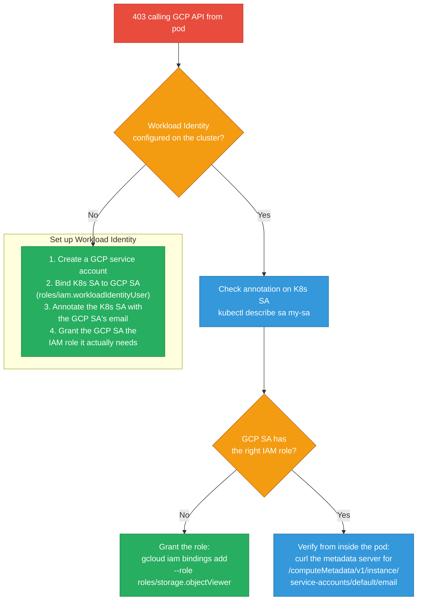
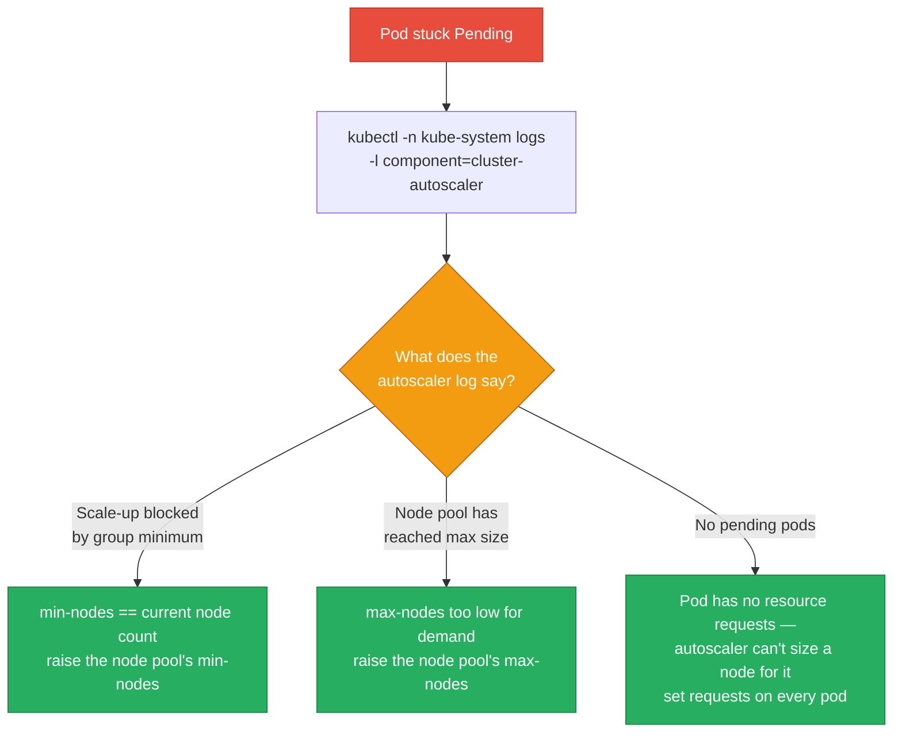
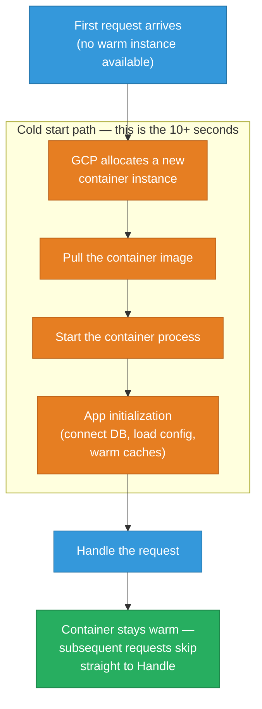
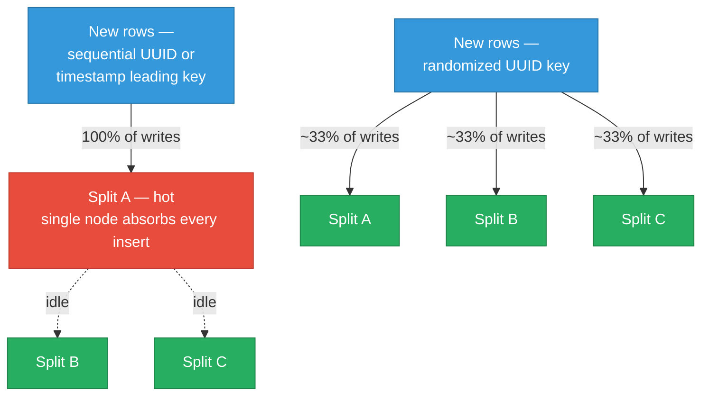
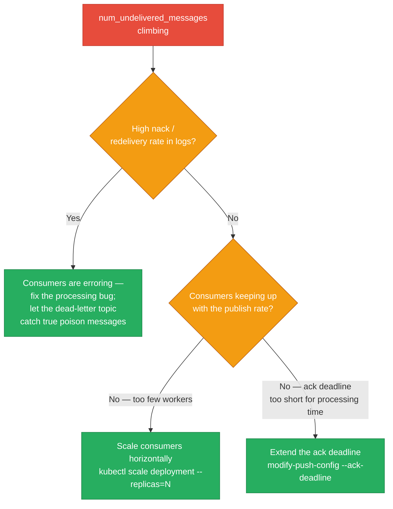
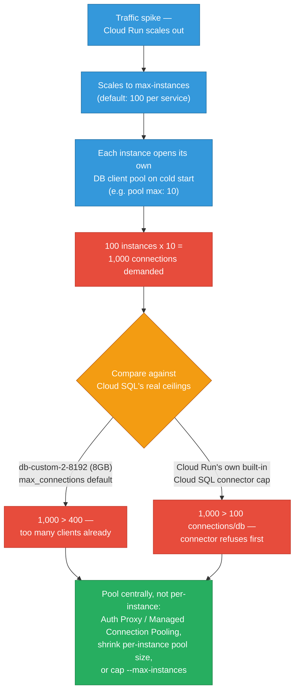
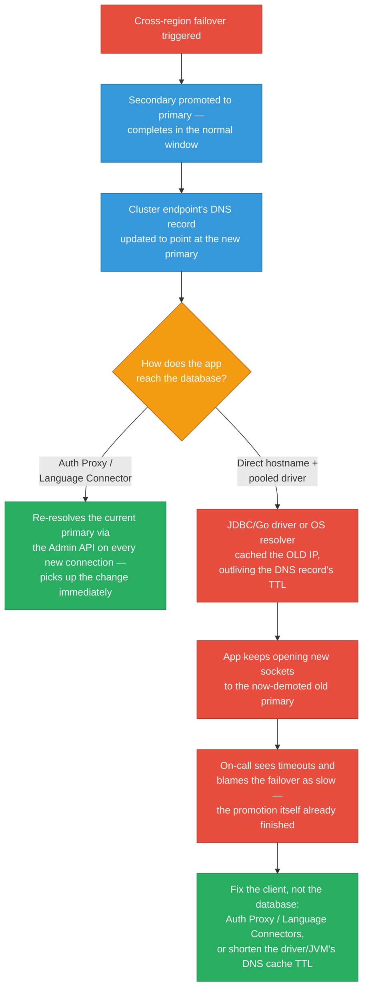
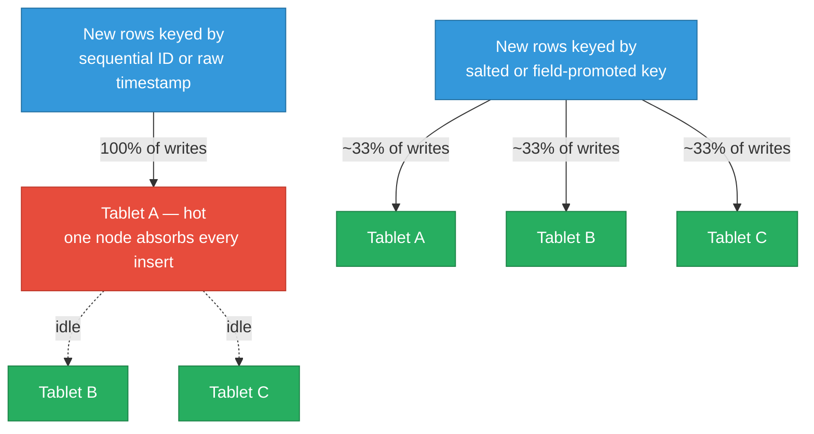

# GCP Debugging Scenarios

Ten failure patterns you'll actually hit running workloads on GCP — the symptom, a diagnostic flowchart, the commands that confirm the cause, and the prevention that stops it recurring. The last three focus on the database layer: Cloud SQL connection exhaustion from serverless compute, the DNS-caching gotcha that makes a completed failover look broken, and Bigtable row-key hotspotting.

<div class="quiz-progress" data-quiz-progress>
  <span class="quiz-progress-label">0/0 checks</span>
  <span class="quiz-progress-bar"><span class="quiz-progress-fill"></span></span>
</div>

---

## 1. GKE Pod Can't Access Cloud Storage / BigQuery

**Symptom:** Pod gets `403 Permission Denied` calling GCP APIs.



<div class="stepper">
  <div class="stepper-panels">
    <div class="stepper-panel active">
      <strong>1. Confirm Workload Identity is enabled on the cluster.</strong> <code>gcloud container clusters describe my-cluster --region us-central1 --format="value(workloadIdentityConfig)"</code> — if this comes back empty, nothing downstream matters yet; the cluster's metadata server doesn't federate to GCP IAM at all.
    </div>
    <div class="stepper-panel">
      <strong>2. Check the K8s ServiceAccount's annotation.</strong> <code>kubectl describe serviceaccount my-app -n my-namespace</code> should show <code>iam.gke.io/gcp-service-account=my-app@project.iam.gserviceaccount.com</code>. A missing or misspelled annotation means the pod has no path to a GCP identity at all.
    </div>
    <div class="stepper-panel">
      <strong>3. Check the IAM binding on the GCP service account.</strong> <code>gcloud iam service-accounts get-iam-policy</code> should show <code>serviceAccount:project.svc.id.goog[namespace/ksa-name]</code> bound with <code>workloadIdentityUser</code> — this is the binding that lets the K8s SA "become" the GCP SA, separate from whatever IAM role the GCP SA itself holds.
    </div>
    <div class="stepper-panel">
      <strong>4. Test from inside the pod.</strong> Exec a curl against the metadata server's <code>service-accounts/default/email</code> endpoint. If it returns the GCP SA's email, credentials are flowing correctly, and a 403 at that point means the role grant itself is wrong — not the identity plumbing.
    </div>
  </div>
  <div class="stepper-controls">
    <button class="stepper-prev">← Prev</button>
    <span class="stepper-dots"></span>
    <span class="stepper-label"></span>
    <button class="stepper-next">Next →</button>
  </div>
</div>

```bash
# Step 1: Verify Workload Identity is enabled on cluster
gcloud container clusters describe my-cluster --region us-central1 \
  --format="value(workloadIdentityConfig)"

# Step 2: Check K8s SA annotation
kubectl describe serviceaccount my-app -n my-namespace
# Annotations: iam.gke.io/gcp-service-account=my-app@project.iam.gserviceaccount.com

# Step 3: Check IAM binding
gcloud iam service-accounts get-iam-policy my-app@project.iam.gserviceaccount.com
# Should show: serviceAccount:project.svc.id.goog[namespace/ksa-name] with workloadIdentityUser

# Step 4: Test from inside pod
kubectl exec -it my-pod -- curl -H "Metadata-Flavor: Google" \
  "http://169.254.169.254/computeMetadata/v1/instance/service-accounts/default/email"
# Should return: my-app@project.iam.gserviceaccount.com

# Prevention: always use Workload Identity — never mount service account JSON keys
```

<div class="quiz-card">
  <p class="quiz-q">A teammate wants to grant a new GKE pod access to Cloud Storage by baking a service-account JSON key into the container image instead of setting up Workload Identity. What does this scenario's prevention rule say, and what's the correct path?</p>
  <button class="quiz-reveal">Reveal answer</button>
  <div class="quiz-a" hidden>The prevention rule is explicit: always use Workload Identity — never mount service account JSON keys. The correct path is the one walked through above: create a GCP service account, bind it to the pod's Kubernetes ServiceAccount with the <code>workloadIdentityUser</code> role, annotate the K8s SA with the GCP SA's email, grant the GCP SA the IAM role it needs, then verify with the metadata-server curl from inside the pod.</div>
</div>

---

## 2. GKE Node Pool Scaling Not Working

**Symptom:** Pods stuck Pending despite Cluster Autoscaler configured, nodes not adding.



```bash
# Check autoscaler logs
kubectl -n kube-system logs -l component=cluster-autoscaler --tail=50

# Common messages:
# "Scale-up blocked by group minimum"  → min nodes = current count
# "Node pool has reached max size"      → increase max-nodes
# "No pending pods"                     → pods have tolerations but no requests

# Check node pool limits
gcloud container node-pools describe default-pool \
  --cluster my-cluster --region us-central1 \
  --format="yaml(autoscaling)"

# Check if autoscaler is enabled
gcloud container clusters describe my-cluster --region us-central1 \
  --format="value(autoscaling.enableNodeAutoprovisioning)"

# Prevention: set explicit resource requests on ALL pods
# HPA/CA both require resource requests to function
```

<div class="toggle-switch">
  <div class="toggle-buttons">
    <button data-toggle-opt="min" class="active state-warn">Scale-up blocked by group minimum</button>
    <button data-toggle-opt="max" class="state-warn">Node pool has reached max size</button>
    <button data-toggle-opt="norequest" class="state-bad">No pending pods</button>
  </div>
  <div class="toggle-panel active" data-toggle-panel="min">
    The node pool's <code>min-nodes</code> is already equal to (or above) its current node count, so the autoscaler treats itself as already at floor capacity and won't add more even though pods are Pending. Fix: raise <code>min-nodes</code>, or check whether something else deliberately capped it there.
  </div>
  <div class="toggle-panel" data-toggle-panel="max">
    The node pool is already at its configured <code>max-nodes</code> ceiling. The autoscaler is working correctly here — it's refusing to scale past a limit you set. Fix: raise <code>max-nodes</code> if the workload genuinely needs more capacity.
  </div>
  <div class="toggle-panel" data-toggle-panel="norequest">
    The sneaky one: <code>kubectl get pods</code> clearly shows Pending pods, but the autoscaler log insists there are none. That's because pods without resource <code>requests</code> set give the scheduler nothing to size a hypothetical new node against — the autoscaler doesn't count them as a scale-up trigger at all. Fix: set explicit CPU/memory requests on every pod.
  </div>
</div>

<div class="quiz-card">
  <p class="quiz-q">The cluster autoscaler logs say "No pending pods," but <code>kubectl get pods</code> clearly shows pods stuck in Pending. What explains the mismatch?</p>
  <button class="quiz-reveal">Reveal answer</button>
  <div class="quiz-a" hidden>The pods almost certainly have no resource <code>requests</code> set. Both the scheduler and the cluster autoscaler size decisions off requests, not limits or actual usage — with no requests, the autoscaler has no way to compute whether a new node would even fit the pod, so it doesn't register it as a scale-up trigger. This is exactly why the prevention rule here is to set explicit resource requests on <em>all</em> pods: HPA and Cluster Autoscaler both require them to function at all.</div>
</div>

---

## 3. BigQuery Query Costs Unexpectedly High

**Symptom:** Daily BigQuery bill much higher than expected.

```sql
-- Find expensive queries in last 24 hours
SELECT
  job_id,
  user_email,
  query,
  total_bytes_processed / 1e12 AS tb_scanned,
  (total_bytes_processed / 1e12) * 5 AS cost_usd,
  creation_time
FROM `region-us`.INFORMATION_SCHEMA.JOBS_BY_PROJECT
WHERE creation_time > TIMESTAMP_SUB(CURRENT_TIMESTAMP(), INTERVAL 1 DAY)
  AND job_type = 'QUERY'
  AND statement_type != 'SCRIPT'
ORDER BY total_bytes_processed DESC
LIMIT 20;

-- Find tables without partitioning (most common cause)
SELECT table_name, row_count, size_bytes/1e9 AS size_gb
FROM `project.dataset`.INFORMATION_SCHEMA.TABLE_STORAGE
WHERE total_partitions = 0 AND size_bytes > 1e10  -- >10GB unpartitioned
ORDER BY size_bytes DESC;
```

```bash
# Fix: require partition filters on large tables
bq update --require_partition_filter project:dataset.orders

# Set billing cap per query (prevents runaway queries)
# In BigQuery console: Project → Edit → Maximum bytes billed
bq query --maximum_bytes_billed=10000000000 \   # 10GB max
  'SELECT ...'

# Prevention:
# 1. Partition all large tables by date
# 2. Set require_partition_filter=true
# 3. Grant BigQuery Job User (not Data Owner) to analysts
```

<div class="stepper">
  <div class="stepper-panels">
    <div class="stepper-panel active">
      <strong>1. Find the expensive queries.</strong> Run the <code>INFORMATION_SCHEMA.JOBS_BY_PROJECT</code> query above, sorted by <code>total_bytes_processed</code> — on-demand BigQuery bills per byte scanned, so this ranks jobs (and the users running them) by actual cost, not just runtime.
    </div>
    <div class="stepper-panel">
      <strong>2. Find the root-cause table.</strong> Cross-reference against <code>TABLE_STORAGE</code> for tables with <code>total_partitions = 0</code> and size over 10GB. An unpartitioned multi-terabyte table getting fully scanned on every query is the most common cause of a cost spike.
    </div>
    <div class="stepper-panel">
      <strong>3. Force partition pruning.</strong> <code>bq update --require_partition_filter</code> makes it impossible to run a query against that table without a filter on the partition column — no more accidental full scans from a missing <code>WHERE</code> clause.
    </div>
    <div class="stepper-panel">
      <strong>4. Cap the blast radius.</strong> Set <code>--maximum_bytes_billed</code> per query, and grant analysts <strong>BigQuery Job User</strong> instead of <strong>Data Owner</strong> — so one bad query, or one careless or compromised credential, can't run an unbounded scan.
    </div>
  </div>
  <div class="stepper-controls">
    <button class="stepper-prev">← Prev</button>
    <span class="stepper-dots"></span>
    <span class="stepper-label"></span>
    <button class="stepper-next">Next →</button>
  </div>
</div>

<div class="quiz-card">
  <p class="quiz-q">Besides partitioning large tables, what does setting <code>require_partition_filter=true</code> actually buy you that partitioning alone doesn't?</p>
  <button class="quiz-reveal">Reveal answer</button>
  <div class="quiz-a" hidden>Partitioning alone just makes a partition filter <em>possible</em> — it doesn't stop anyone from writing a query that omits the <code>WHERE</code> clause and scans every partition anyway. <code>require_partition_filter=true</code> makes that query fail outright instead of running (and billing) for a full-table scan. Paired with granting analysts BigQuery Job User rather than Data Owner, it limits both how much data a single query can accidentally touch and what a given credential is allowed to do in the first place.</div>
</div>

---

## 4. Cloud Run Service Cold Start Latency

**Symptom:** First request to Cloud Run takes 10+ seconds.



<div class="stepper">
  <div class="stepper-panels">
    <div class="stepper-panel active">
      <strong>1. Allocate.</strong> A request arrives with no warm instance available, so Cloud Run has to provision a fresh container instance before anything else can happen.
    </div>
    <div class="stepper-panel">
      <strong>2. Pull the image.</strong> The container image is pulled onto that instance. A large image — extra framework layers, unused dependencies — directly adds to this step's duration.
    </div>
    <div class="stepper-panel">
      <strong>3. Start and initialize.</strong> The container process starts, then the app itself initializes: connecting to a database, loading config, warming any in-memory caches. Cloud Run waits for the container to start listening on <code>$PORT</code> before routing traffic to it — it does not use Kubernetes-style startup or readiness probes.
    </div>
    <div class="stepper-panel">
      <strong>4. Handle, then stay warm.</strong> The first request is finally handled. The instance then stays warm for subsequent requests, which skip straight past allocation, pull, and init.
    </div>
  </div>
  <div class="stepper-controls">
    <button class="stepper-prev">← Prev</button>
    <span class="stepper-dots"></span>
    <span class="stepper-label"></span>
    <button class="stepper-next">Next →</button>
  </div>
</div>

```bash
# Check cold start frequency
gcloud logging read \
  'resource.type="cloud_run_revision" AND textPayload:"Cold start"' \
  --limit 50

# Mitigations:
# 1. Minimum instances (keep N instances warm, costs money)
gcloud run services update my-service \
  --min-instances 1 \
  --region us-central1

# 2. Reduce image size (faster pull)
# Use distroless or scratch base images

# 3. Optimize startup (lazy initialization — connect DB on first request, not at startup)

# 4. Use CPU boost (GCP gives extra CPU during startup)
gcloud run services update my-service \
  --cpu-boost

# 5. Use startup probe correctly — Cloud Run doesn't use K8s probes
# but Cloud Run waits for the container to listen on $PORT before routing
```

<div class="quiz-card">
  <p class="quiz-q">Does Cloud Run use Kubernetes-style startup or readiness probes to know when a cold-started container is ready for traffic?</p>
  <button class="quiz-reveal">Reveal answer</button>
  <div class="quiz-a" hidden>No. Cloud Run doesn't use K8s probes at all — it simply waits for the container to start listening on the <code>$PORT</code> environment variable, and only then routes requests to it. That's the entire readiness signal; there's no separate probe configuration to tune.</div>
</div>

---

## 5. Spanner High Latency or Hotspot

**Symptom:** Spanner p99 latency spikes, or one node has much higher CPU than others.

```bash
# Check for hotspots using Key Visualizer
# GCP Console → Spanner → Instance → Key Visualizer
# Bright spots indicate hot row ranges
```



**Common causes of hotspots in Spanner:**

<div class="toggle-switch">
  <div class="toggle-buttons">
    <button data-toggle-opt="uuid" class="active state-bad">Sequential UUID primary key</button>
    <button data-toggle-opt="timestamp" class="state-bad">Timestamp as leading key</button>
    <button data-toggle-opt="cardinality" class="state-warn">Low-cardinality leading key</button>
  </div>
  <div class="toggle-panel active" data-toggle-panel="uuid">
    A UUID that's generated sequentially still sorts sequentially. Since Spanner shards on key ranges, every new row's key lands right after the previous one — all recent inserts pile onto the same split instead of spreading out.
  </div>
  <div class="toggle-panel" data-toggle-panel="timestamp">
    Same failure mode from a different source: if the leading key column is (or starts with) a timestamp, every write from "right now" sorts into the same narrow, ever-advancing range — one split takes 100% of current write traffic no matter how many nodes the instance has.
  </div>
  <div class="toggle-panel" data-toggle-panel="cardinality">
    A leading key column with only a handful of distinct values (a status enum, a small tenant ID set) can only ever be split into that many ranges — traffic concentrates on whichever value is most common, regardless of insert order.
  </div>
</div>

```bash
# Fix: use UUIDs generated randomly (not sequentially)
# Or use bit-reversed sequences:
# Spanner auto-shards on boundary values — random UUIDs distribute naturally

# Check Spanner metrics
gcloud monitoring read \
  'metric.type="spanner.googleapis.com/instance/cpu/utilization_by_priority"' \
  --start="2024-01-15T00:00:00Z" --end="2024-01-15T01:00:00Z"

# Prevention: design schema to avoid hotspots
# Use INTERLEAVE for parent-child relationships (not FK joins)
```

<div class="quiz-card">
  <p class="quiz-q">Switching a Spanner table from sequentially-generated UUIDs to randomly-generated UUIDs fixes a hotspot — but both are still "just UUIDs." Why does randomness matter here?</p>
  <button class="quiz-reveal">Reveal answer</button>
  <div class="quiz-a" hidden>Spanner shards its keyspace by contiguous key range, not by hashing. A sequentially-generated UUID still sorts in generation order, so every new row's key lands immediately after the last one — all recent inserts concentrate on a single split. A randomly-generated UUID scatters new keys across the entire keyspace, so Spanner's range-based auto-sharding naturally spreads writes across many splits instead of one.</div>
</div>

---

## 6. Pub/Sub Messages Piling Up (High Backlog)

**Symptom:** `subscription/num_undelivered_messages` metric growing, consumers not keeping up.



<div class="stepper">
  <div class="stepper-panels">
    <div class="stepper-panel active">
      <strong>1. Confirm there's a real backlog.</strong> <code>gcloud pubsub subscriptions describe</code> for <code>numUndeliveredMessages</code> and <code>oldestUnackedMessage</code> — the age of the oldest message tells you how far behind delivery actually is, not just how many messages are queued.
    </div>
    <div class="stepper-panel">
      <strong>2. Rule out errors first.</strong> Check the logs for nacks. A high nack rate means consumers are actively failing to process messages — that's a code/data bug, and no amount of scaling or ack-deadline tuning fixes it.
    </div>
    <div class="stepper-panel">
      <strong>3. Scale or retune, based on which one is actually true.</strong> If consumers are healthy but outnumbered, scale the deployment. If they're healthy but the ack deadline is shorter than real processing time, messages are being redelivered before they're even finished — extend <code>--ack-deadline</code> instead of adding replicas.
    </div>
    <div class="stepper-panel">
      <strong>4. Add a dead-letter topic.</strong> After a bounded number of delivery attempts (<code>--max-delivery-attempts</code>), truly unprocessable messages move to a DLQ instead of endlessly recycling through the main subscription and inflating the backlog forever.
    </div>
  </div>
  <div class="stepper-controls">
    <button class="stepper-prev">← Prev</button>
    <span class="stepper-dots"></span>
    <span class="stepper-label"></span>
    <button class="stepper-next">Next →</button>
  </div>
</div>

```bash
# Check subscription backlog
gcloud pubsub subscriptions describe my-subscription \
  --format="value(numUndeliveredMessages,oldestUnackedMessage)"

# Check if messages are being nacked (errors)
# High nack rate = consumer processing errors
gcloud logging read \
  'resource.type="pubsub_subscription" AND labels.subscription_id="my-subscription"' \
  --limit 20

# Scale up consumers
kubectl scale deployment my-consumer --replicas=10

# Tune subscription settings:
gcloud pubsub subscriptions modify-push-config my-subscription \
  --ack-deadline=60  # give consumers more time (default 10s)

# Dead letter topic: failed messages after N retries go here
gcloud pubsub subscriptions modify-dead-letter-policy my-subscription \
  --dead-letter-topic=my-dlq \
  --max-delivery-attempts=5

# Prevention:
# 1. Use push subscriptions → Pub/Sub pushes to Cloud Run (auto-scales)
# 2. Use BigQuery subscriptions → messages written directly to BQ table
# 3. Set appropriate ack deadline (longer than max processing time)
```

<div class="tab-group">
  <div class="tab-buttons">
    <button data-tab="push" class="active">Push subscriptions</button>
    <button data-tab="bqsub">BigQuery subscriptions</button>
    <button data-tab="deadline">Ack deadline tuning</button>
  </div>
  <div class="tab-panels">
    <div class="tab-panel active" data-tab-panel="push">
      Pub/Sub pushes messages to Cloud Run itself, so consumer capacity auto-scales with the backlog instead of you having to size and manage a separate consumer deployment.
    </div>
    <div class="tab-panel" data-tab-panel="bqsub">
      Messages are written directly into a BigQuery table by the subscription — no consumer code to write, scale, or fail at all for the simple "just land it in a table" case.
    </div>
    <div class="tab-panel" data-tab-panel="deadline">
      Set the ack deadline longer than the slowest realistic processing time (default is 10s). Too short, and Pub/Sub redelivers messages that are still being legitimately processed, inflating both load and the apparent backlog.
    </div>
  </div>
</div>

<div class="quiz-card">
  <p class="quiz-q">A consumer takes 45 seconds on average to process a message, but the subscription's ack deadline is left at the 10-second default. What symptom does this produce, and is it the same problem as "consumers can't keep up"?</p>
  <button class="quiz-reveal">Reveal answer</button>
  <div class="quiz-a" hidden>Pub/Sub redelivers each message before the consumer finishes acking it, since the deadline expires mid-processing — so every message gets reprocessed at least once, inflating both load and the apparent backlog even if the consumers have plenty of real throughput. It looks identical to a scaling problem from the outside, but the fix is extending <code>--ack-deadline</code> past the real processing time, not adding more consumer replicas.</div>
</div>

---

## 7. GCS Bucket Access Denied from External

**Symptom:** `gsutil` or SDK call returns 403 from outside GCP.

```bash
# Check bucket IAM
gcloud storage buckets get-iam-policy gs://my-bucket

# Check if object is public
gsutil acl get gs://my-bucket/my-file.txt

# Grant specific access
gcloud storage buckets add-iam-policy-binding gs://my-bucket \
  --member="serviceAccount:my-app@project.iam.gserviceaccount.com" \
  --role="roles/storage.objectViewer"

# Generate signed URL for temporary public access (no IAM needed for requester)
gsutil signurl -d 1h -m GET my-service-account-key.json gs://my-bucket/file.txt

# Check if uniform bucket-level access is enabled (disables ACLs)
gcloud storage buckets describe gs://my-bucket \
  --format="value(iamConfiguration.uniformBucketLevelAccess)"
# If true: can't use object ACLs, only bucket-level IAM
```

<div class="toggle-switch">
  <div class="toggle-buttons">
    <button data-toggle-opt="uniform-on" class="active state-warn">Uniform access: ON</button>
    <button data-toggle-opt="uniform-off" class="state-ok">Uniform access: OFF</button>
  </div>
  <div class="toggle-panel active" data-toggle-panel="uniform-on">
    Object-level ACLs are disabled outright — <code>gsutil acl get/set</code> against an individual object won't help you here. Access is controlled purely by bucket-level IAM; go straight to <code>gcloud storage buckets get-iam-policy</code> and grant access with <code>add-iam-policy-binding</code>.
  </div>
  <div class="toggle-panel" data-toggle-panel="uniform-off">
    Legacy object ACLs are still active alongside bucket IAM. <code>gsutil acl get</code> on the specific object can reveal a per-object grant (or an unexpected missing one) that the bucket-level policy alone won't show you.
  </div>
</div>

<div class="quiz-card">
  <p class="quiz-q">A signed URL lets an external caller download a private GCS object successfully, even though that caller has no GCP IAM identity or credentials whatsoever. How is that access being authorized?</p>
  <button class="quiz-reveal">Reveal answer</button>
  <div class="quiz-a" hidden>Authorization is proven by possession of the URL itself, not by who's asking. <code>gsutil signurl</code> embeds a time-limited, cryptographically signed credential directly into the URL (<code>-d 1h</code> sets how long it stays valid) — no IAM identity is needed on the requester's end at all, which is exactly why it works for one-off external or temporary access without granting any bucket IAM role.</div>
</div>

---

## 8. Cloud SQL Connection Exhaustion from Cloud Run/Cloud Functions

**Symptom:** `FATAL: sorry, too many clients already` (Postgres) or `Too many connections` (MySQL), getting sharply worse right after a traffic spike — the same failure mode as Lambda exhausting RDS, just with Cloud Run/Cloud Functions as the culprit instead.

Cloud SQL's `max_connections` default isn't a flat number — it scales with the instance's memory, the same way RDS's per-instance-class cap does:

| Instance memory | Default `max_connections` |
|---|---|
| ~0.6 GB (db-f1-micro) | 25 |
| ~1.7 GB (db-g1-small) | 50 |
| 3.75 GB to <6 GB | 100 |
| 6 GB to <7.5 GB | 200 |
| 7.5 GB to <15 GB | 400 |
| 15 GB to <30 GB | 500 |
| 30 GB to <60 GB | 600 |
| 60 GB to <120 GB | 800 |
| ≥120 GB | 1,000 |



<div class="stepper">
  <div class="stepper-panels">
    <div class="stepper-panel active">
      <strong>1. Confirm it's actually a connection-count problem.</strong> Watch the connection-count metric climb alongside the errors — <code>cloudsql.googleapis.com/database/postgresql/num_backends</code> for Postgres, <code>cloudsql.googleapis.com/database/network/connections</code> for MySQL — and check <code>gcloud sql operations list</code> to rule out a maintenance window or failover as a coincidental red herring.
    </div>
    <div class="stepper-panel">
      <strong>2. Find the real ceiling, not an assumed one.</strong> <code>SHOW max_connections;</code> (Postgres) or <code>SHOW STATUS LIKE 'Threads_connected';</code> alongside <code>SHOW VARIABLES LIKE 'max_connections';</code> (MySQL) tells you the effective limit. A stock <code>db-custom-2-8192</code> (8GB RAM) instance with no override defaults to 400 — that's the number the multiplication below has to beat.
    </div>
    <div class="stepper-panel">
      <strong>3. Do the multiplication that explains the exhaustion.</strong> Cloud Run's default <code>max-instances</code> is 100 per service. If each cold-started instance opens its own client-side pool (a common ORM default is 5-10 connections), 100 instances × 10 connections = 1,000 concurrent connections attempted against a database that only has 400 slots — or worse, against Cloud Run's own built-in Cloud SQL connector, which caps out at just 100 connections per database regardless of Postgres's own limit.
    </div>
    <div class="stepper-panel">
      <strong>4. Fix the shape, not just the size.</strong> Bumping the instance tier (400 → 500 → 600) only buys headroom until traffic grows again — it doesn't fix an unbounded per-instance × instance-count pattern. The real fix pools connections centrally (Auth Proxy sidecar, or Cloud SQL's own server-side Managed Connection Pooling) so the real backend connection count stays roughly flat no matter how many Cloud Run instances spin up.
    </div>
  </div>
  <div class="stepper-controls">
    <button class="stepper-prev">← Prev</button>
    <span class="stepper-dots"></span>
    <span class="stepper-label"></span>
    <button class="stepper-next">Next →</button>
  </div>
</div>

```bash
# Confirm connection count is climbing alongside the errors (Postgres)
gcloud monitoring time-series list \
  --filter='metric.type="cloudsql.googleapis.com/database/postgresql/num_backends"' \
  --format="table(points[].value.int64Value, points[].interval.endTime)"

# Rule out an unrelated maintenance/failover operation as the real cause
gcloud sql operations list --instance=my-instance --limit=10

# Check whether max_connections was ever overridden from the memory-based default
gcloud sql instances describe my-instance --format="value(settings.databaseFlags)"

# Confirm the effective value from inside the database
psql -h <ip> -U app -d appdb -c "SHOW max_connections;"
# db-custom-2-8192 (8GB RAM), no override --> defaults to 400

# MySQL equivalent
mysql -h <ip> -u app -p -e "SHOW VARIABLES LIKE 'max_connections'; SHOW STATUS LIKE 'Threads_connected';"

# Check what Cloud Run is actually scaled to
gcloud run services describe my-service --region us-central1 \
  --format="value(status.traffic)" 

# Fix 1: route through the Cloud SQL Auth Proxy (or Cloud Run's built-in integration),
# so the app never opens raw sockets straight to the instance
gcloud run services update my-service \
  --add-cloudsql-instances=PROJECT:REGION:my-instance

# Fix 2: shrink the per-instance pool and bound total instances
gcloud run services update my-service \
  --max-instances=20 \
  --concurrency=40

# Fix 3: turn on Cloud SQL's own server-side connection pooling
# (Enterprise Plus edition — pools on the database side, so the backend
# connection count stops scaling 1:1 with client instance count)
gcloud sql instances patch my-instance --enable-connection-pooling

# Prevention:
# 1. Always route serverless compute through the Auth Proxy, never raw sockets
# 2. Keep per-instance pool size small (2-5), not framework defaults
# 3. Set --max-instances deliberately instead of leaving it at the 100 default
```

<div class="quiz-card">
  <p class="quiz-q">The team's first instinct is to fix Cloud SQL connection exhaustion by upgrading to a bigger instance tier so <code>max_connections</code> goes from 400 to 600. Does that actually fix the root cause here?</p>
  <button class="quiz-reveal">Reveal answer</button>
  <div class="quiz-a" hidden>No — it only raises the ceiling temporarily. The root cause is architectural: every Cloud Run instance opens its own client-side connection pool, so the real connection demand scales with <code>instance count × per-instance pool size</code>, not with traffic directly. A bigger instance buys headroom until <code>max-instances</code> or per-instance pool size grows again, but the fix that actually closes the gap is pooling centrally — an Auth Proxy sidecar or Cloud SQL's own server-side Managed Connection Pooling — so backend connection count stops scaling 1:1 with how many serverless instances happen to be alive.</div>
</div>

---

## 9. AlloyDB/Cloud SQL Failover — the App Blames "Slow Failover," but It's a Stale DNS Cache

**Symptom:** An AlloyDB cluster runs a cross-region failover, the Admin API shows the promotion completed quickly, but the application keeps throwing connection timeouts for several more minutes. The on-call's first assumption is that the failover itself is slow or broken.



<div class="stepper">
  <div class="stepper-panels">
    <div class="stepper-panel active">
      <strong>1. Verify the promotion actually finished quickly.</strong> Check <code>gcloud alloydb operations list</code> for the failover operation's start and end time before assuming the database is the slow part — this step alone often ends the debate.
    </div>
    <div class="stepper-panel">
      <strong>2. Confirm the new primary's identity.</strong> Query the cluster for the currently active primary instance and its address — this is the ground truth the app's connections should be matching.
    </div>
    <div class="stepper-panel">
      <strong>3. Check how the app actually connects.</strong> Through the Auth Proxy or a Language Connector, the current primary is re-resolved via the Admin API on every new connection, so a failover is transparent. Connecting directly via a bare hostname or IP baked into a long-lived driver/JVM process is where a cached, now-stale resolution can survive well past the DNS record's own TTL.
    </div>
    <div class="stepper-panel">
      <strong>4. Fix the client's caching, not the database's speed.</strong> Lower the driver/JVM's DNS cache TTL to match (or beat) the record's real TTL, switch to the Auth Proxy/connectors so this class of bug can't recur at all, and always pair either fix with retry-with-backoff — a promoted-but-still-warming primary can briefly reject new connections even once discovery is correct.
    </div>
  </div>
  <div class="stepper-controls">
    <button class="stepper-prev">← Prev</button>
    <span class="stepper-dots"></span>
    <span class="stepper-label"></span>
    <button class="stepper-next">Next →</button>
  </div>
</div>

**Does every GCP database failover have this DNS trap?** No — it depends on whether the endpoint's address actually changes:

<div class="toggle-switch">
  <div class="toggle-buttons">
    <button data-toggle-opt="alloydb" class="active state-bad">AlloyDB cross-region failover</button>
    <button data-toggle-opt="cloudsql" class="state-warn">Cloud SQL regional HA failover</button>
  </div>
  <div class="toggle-panel active" data-toggle-panel="alloydb">
    A cross-region failover promotes a secondary cluster in a different region to primary, and AlloyDB updates the cluster endpoint's DNS record to point at it. A client that resolved and cached the old primary's address before the failover — and doesn't re-resolve — keeps talking to a demoted instance until its own cache expires. This is the DNS-caching trap, and it's a client-side bug, not a database one.
  </div>
  <div class="toggle-panel" data-toggle-panel="cloudsql">
    Cloud SQL's regional HA failover promotes the standby onto the <strong>same shared virtual IP</strong> the primary was using — there's no address change and no DNS record to go stale. The failure mode here is different: existing pooled connections are severed outright when the old primary goes down, and a pool that doesn't test connections before handing them out (or that has a long <code>maxLifetime</code>) can hand the app a dead socket for the ~60 seconds it takes to reconnect. Same symptom, different root cause — no DNS involved at all.
  </div>
</div>

```bash
# Step 1: verify the promotion's actual timeline before blaming it
gcloud alloydb operations list --cluster=my-cluster --region=us-central1 \
  --filter="operationType=FAILOVER" \
  --format="table(name,status,startTime,endTime)"

# Step 2: confirm the current primary and its address
gcloud alloydb instances describe my-primary --cluster=my-cluster \
  --region=us-central1 --format="value(ipAddress)"

# Step 3: check what your app's live connections are actually using
# (compare against the address from Step 2 — a mismatch confirms a stale cache)
lsof -i -a -p $(pgrep -f my-app) | grep ESTABLISHED

# Fix 1: connect through the AlloyDB Auth Proxy instead of a bare hostname —
# it re-resolves the current primary via the Admin API on every new connection
alloydb-auth-proxy "projects/my-project/locations/us-central1/clusters/my-cluster/instances/my-primary"

# Fix 2: if connecting directly, stop caching DNS past the record's real TTL
# Java: networkaddress.cache.ttl=1 in java.security (the same fix used for Aurora)
# Go: build a net.Resolver with a short-lived cache instead of relying on
#     the process-wide OS resolver cache

# Fix 3 (Cloud SQL regional HA case): test connections before handing them
# out of the pool, and cap pool maxLifetime so dead sockets get recycled fast
# HikariCP: connectionTestQuery + maxLifetime
# pgx (Go):  pool.Config().MaxConnLifetime
```

<div class="quiz-card">
  <p class="quiz-q"><code>gcloud alloydb operations list</code> shows the cross-region failover's promotion completed in under a minute, but the app keeps failing to connect for several minutes afterward. What's actually still broken?</p>
  <button class="quiz-reveal">Reveal answer</button>
  <div class="quiz-a" hidden>Nothing on the database side — the promotion already finished. What's broken is client-side: a direct hostname connection cached the old primary's DNS resolution (via the JVM/OS resolver) past the point where AlloyDB updated the cluster endpoint's DNS record to the new primary, so the app keeps opening sockets to a demoted instance. The fix is shortening the client's DNS cache TTL or routing through the AlloyDB Auth Proxy/Language Connectors — not waiting on, or blaming, the failover itself.</div>
</div>

---

## 10. Bigtable Hot Row Key — One Node Takes All the Write Traffic

**Symptom:** `cpu_load_hottest_node` sits pinned near 100% while the cluster's average CPU is comfortably under Bigtable's recommended 70% production ceiling — write latency degrades on a subset of requests while the rest of the table serves fine.



<div class="stepper">
  <div class="stepper-panels">
    <div class="stepper-panel active">
      <strong>1. Confirm it's a hotspot, not undersizing.</strong> Compare <code>cpu_load_hottest_node</code> against average cluster <code>cpu_load</code>. A hottest-node reading near 100% while the average sits well under the recommended 70% ceiling is the signature of an imbalanced key range, not a cluster that simply needs more nodes.
    </div>
    <div class="stepper-panel">
      <strong>2. Find the literal hot row range.</strong> Key Visualizer renders read/write activity as a heatmap across the table's key space — a bright stripe pinned to one end of the range (rather than spread evenly) points straight at the offending rows.
    </div>
    <div class="stepper-panel">
      <strong>3. Identify the key pattern causing it.</strong> Pull a sample of recent row keys directly. Keys like sequential IDs or a raw ISO timestamp prefix explain the pattern immediately: because Bigtable shards by contiguous key range (the same mechanism as Spanner's hotspot in scenario 5), every new row's key lands right after the last one, concentrating all recent writes on the tablet serving the tail of the range.
    </div>
    <div class="stepper-panel">
      <strong>4. Pick the fix based on the read pattern you still need.</strong> Field promotion, salting, and reversed timestamps all solve the write concentration — which one you pick depends on whether you still need to scan by the original ordering. Adding more nodes to the cluster does not fix this: the hot key stays pinned to the same tablet regardless of how much spare capacity the rest of the cluster has.
    </div>
  </div>
  <div class="stepper-controls">
    <button class="stepper-prev">← Prev</button>
    <span class="stepper-dots"></span>
    <span class="stepper-label"></span>
    <button class="stepper-next">Next →</button>
  </div>
</div>

```bash
# The classic tell: hottest-node CPU pinned high while the average is fine
gcloud monitoring time-series list \
  --filter='metric.type="bigtable.googleapis.com/cluster/cpu_load_hottest_node"' \
  --format="table(points[].value.doubleValue, points[].interval.endTime)"

gcloud monitoring time-series list \
  --filter='metric.type="bigtable.googleapis.com/cluster/cpu_load"' \
  --format="table(points[].value.doubleValue, points[].interval.endTime)"

# Open Key Visualizer to see exactly which row range is hot
# GCP Console -> Bigtable -> Instance -> Table -> Key Visualizer
# A bright stripe pinned to the high end of the key range = sequential writes

# Inspect the actual row keys hitting that range
cbt -instance=my-instance read my-table count=5
# Keys like "00001842910", "00001842911", ... confirm sequential/timestamp keys

# Prevention: never use a monotonically increasing (or decreasing) row key,
# whether it's an auto-increment ID or a raw timestamp prefix
```

<div class="tab-group">
  <div class="tab-buttons">
    <button data-tab="promote" class="active">Field promotion</button>
    <button data-tab="salt">Salting</button>
    <button data-tab="reverse">Reversed timestamp</button>
    <button data-tab="nonseq">Non-sequential IDs</button>
  </div>
  <div class="tab-panels">
    <div class="tab-panel active" data-tab-panel="promote">
      Put a high-cardinality field ahead of the timestamp in the key — <code>device123#2026-07-13T10:00:00</code> instead of <code>2026-07-13T10:00:00#device123</code>. Writes for different devices land on different tablets even though each device's own writes are still stored in chronological order.
    </div>
    <div class="tab-panel" data-tab-panel="salt">
      When there's no good field to promote, prepend a small hash-based prefix (<code>hash(key) % N</code>) to the naturally-ordered key. Spreads writes across N tablets, at the cost of a scatter-gather read across all N when scanning by the unsalted portion of the key.
    </div>
    <div class="tab-panel" data-tab-panel="reverse">
      If the dominant read pattern is "give me the latest rows," store a reversed timestamp (e.g. <code>Long.MAX_VALUE</code> minus the timestamp) so the newest rows sort first, without leaving a raw ascending timestamp as the sole driver of write placement.
    </div>
    <div class="tab-panel" data-tab-panel="nonseq">
      When there's no natural high-cardinality field and no ordering worth preserving, generate row keys that don't sort in insertion order at all — a hashed or randomly-generated ID instead of an auto-increment counter — trading away key-range locality entirely in exchange for even write distribution.
    </div>
  </div>
</div>

<div class="quiz-card">
  <p class="quiz-q">Cluster-average CPU sits comfortably under Bigtable's 70% recommended ceiling, yet <code>cpu_load_hottest_node</code> is pegged near 100% and writes are slow. Would adding more nodes to the cluster fix this?</p>
  <button class="quiz-reveal">Reveal answer</button>
  <div class="quiz-a" hidden>No. Adding nodes raises the cluster's total capacity, but a hot row key concentrates traffic on a specific contiguous key range that's served by a single tablet — more nodes doesn't redistribute a range that's structurally pinned in place. The average-CPU-fine-but-hottest-node-pegged combination is specifically diagnostic of a key design problem, not a capacity problem, and the fix is redesigning the row key (field promotion, salting, or non-sequential IDs), not resizing the cluster.</div>
</div>

---

## Quick Reference: GCP Debug Commands

| Problem | First command |
|---------|--------------|
| GKE pod can't access GCP API | `kubectl exec -- curl -H "Metadata-Flavor: Google" http://169.254.169.254/...` |
| GKE node not scaling | `kubectl -n kube-system logs -l component=cluster-autoscaler` |
| BigQuery cost spike | `SELECT ... FROM INFORMATION_SCHEMA.JOBS_BY_PROJECT ORDER BY total_bytes_processed DESC` |
| Pub/Sub backlog | `gcloud pubsub subscriptions describe ... --format="value(numUndeliveredMessages)"` |
| Cloud Run cold start | `gcloud run services update --min-instances 1` |
| Permission denied | `gcloud projects get-iam-policy PROJECT --flatten="bindings[].members" --filter="bindings.members:USER"` |
| Spanner hotspot | GCP Console → Spanner → Key Visualizer |
| Cloud SQL connection exhaustion | `gcloud sql instances describe INSTANCE --format="value(settings.databaseFlags)"` |
| AlloyDB/Cloud SQL failover DNS gotcha | `gcloud alloydb operations list --filter="operationType=FAILOVER"` |
| Bigtable hot row key | GCP Console → Bigtable → Instance → Key Visualizer |
