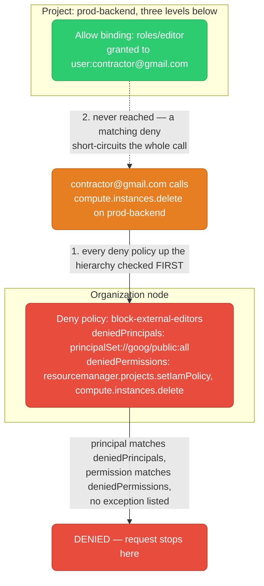
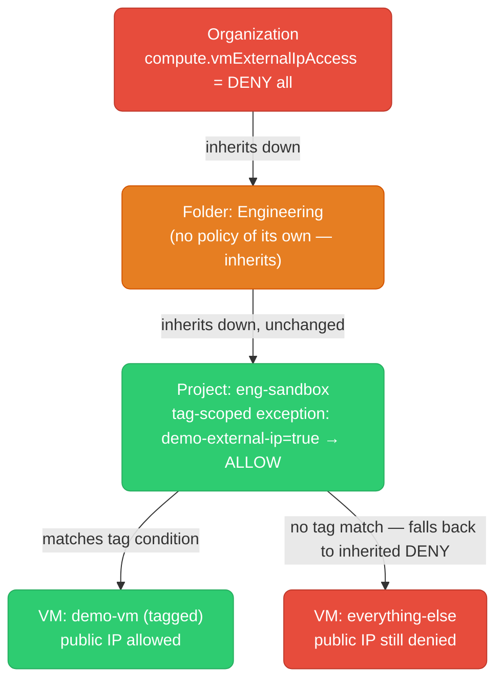
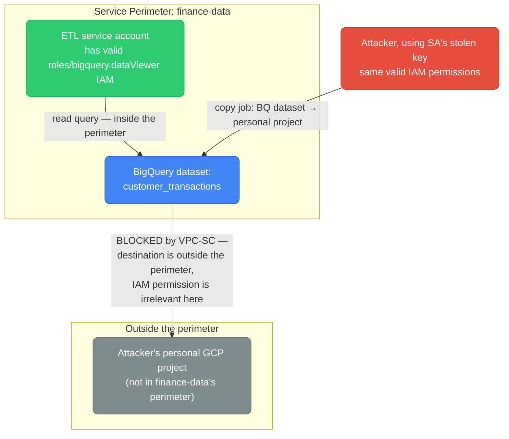

# GCP Security & Compliance

IAM Deny policies, Conditions, Org Policy constraints, VPC Service Controls, Cloud KMS/CMEK, Secret Manager, Binary Authorization, and Security Command Center — the mechanisms that sit on top of the additive IAM model covered in [`from-aws.md`](./from-aws.md) and [`services-overview.md`](./services-overview.md), for when "grant only what's needed" isn't enough of a guardrail on its own.

<div class="quiz-progress" data-quiz-progress>
  <span class="quiz-progress-label">0/0 checks</span>
  <span class="quiz-progress-bar"><span class="quiz-progress-fill"></span></span>
</div>

---

## 1. IAM Deny Policies

`from-aws.md` and `services-overview.md` both describe standard GCP IAM bindings as purely additive — no explicit deny, union of every Allow, can't revoke what a higher level granted. That was true of GCP IAM for years, and it's why "design least-privilege from the start, there's no deny-all-and-punch-holes escape hatch" was the standing advice. **It's no longer the whole picture.** IAM Deny policies shipped to general availability in 2023, and they add exactly the guardrail that was missing: a way to block access that no Allow binding, anywhere in the hierarchy, can override.

A Deny policy attaches to a node in the resource hierarchy — an Organization, a Folder, or a Project — and lists one or more deny rules, each with:

- **`deniedPrincipals`** — who this rule blocks (a specific principal, a group, or a principal set like `principalSet://goog/public:all` for "anyone outside the org")
- **`deniedPermissions`** — which permissions are blocked (e.g. `resourcemanager.projects.setIamPolicy`)
- **`exceptionPrincipals`** *(optional)* — a carve-out list exempted from this specific rule
- **`denialCondition`** *(optional)* — a CEL expression narrowing when the rule applies (e.g. only outside business hours, or only for resources without a specific tag)

The mechanism that actually matters: **deny policies are evaluated before, and completely independently of, allow policies.** When a principal calls an API, GCP first walks the resource hierarchy checking every applicable deny policy. If any deny rule matches — the principal is in `deniedPrincipals` (and not in `exceptionPrincipals`), the permission is in `deniedPermissions`, and any `denialCondition` evaluates true — the call is denied immediately. Allow bindings are never consulted at all. Only if no deny rule matches does evaluation fall through to the familiar additive-Allow union.



<div class="stepper">
  <div class="stepper-panels">
    <div class="stepper-panel active">
      <strong>1. A project-level Allow grant exists.</strong> <code>contractor@gmail.com</code> holds <code>roles/editor</code> on <code>prod-backend</code>, granted directly on that project. Taken alone, this Allow binding is entirely valid and would let the contractor delete VMs.
    </div>
    <div class="stepper-panel">
      <strong>2. An org-level Deny policy also exists.</strong> The organization has a deny policy blocking any principal outside the org's Cloud Identity domain from calling a set of sensitive permissions, including <code>compute.instances.delete</code> — attached three levels above the project, at the Organization node.
    </div>
    <div class="stepper-panel">
      <strong>3. The contractor calls <code>compute.instances.delete</code>.</strong> GCP's authorization check starts by walking every deny policy attached anywhere from the resource up to the Organization root — not by looking at Allow bindings first.
    </div>
    <div class="stepper-panel">
      <strong>4. The deny rule matches.</strong> The contractor's identity is outside the org domain (matches <code>deniedPrincipals</code>), and the permission being called is in <code>deniedPermissions</code>. No <code>exceptionPrincipals</code> entry covers this contractor.
    </div>
    <div class="stepper-panel">
      <strong>5. Denied — the Allow binding is never consulted.</strong> It doesn't matter that <code>roles/editor</code> was validly granted at the project level, or that Editor is a broad role that would otherwise cover this action. A matching deny rule wins unconditionally and independently of every allow policy anywhere in the hierarchy.
    </div>
  </div>
  <div class="stepper-controls">
    <button class="stepper-prev">← Prev</button>
    <span class="stepper-dots"></span>
    <span class="stepper-label"></span>
    <button class="stepper-next">Next →</button>
  </div>
</div>

```bash
# Create a deny policy on an org — attachment point is a URL-encoded resource path
gcloud iam policies create block-external-editors \
  --attachment-point='cloudresourcemanager.googleapis.com/organizations/123456789' \
  --kind=denypolicies \
  --policy-file=deny-policy.yaml
```

```yaml
# deny-policy.yaml
displayName: block-external-editors
rules:
  - denyRule:
      deniedPrincipals:
        - principalSet://goog/public:all
      exceptionPrincipals:
        - principalSet://goog/group/trusted-vendors@example.com
      deniedPermissions:
        - resourcemanager.googleapis.com/projects.setIamPolicy
        - compute.googleapis.com/instances.delete
```

<div class="toggle-switch">
  <div class="toggle-buttons">
    <button data-toggle-opt="allow" class="active">Standard Allow model</button>
    <button data-toggle-opt="deny">Deny policies</button>
  </div>
  <div class="toggle-panel active" data-toggle-panel="allow">
    Purely additive. Every binding, from every level, only ever grants more access — a resource's effective permissions are the union of its own bindings plus every ancestor's. There is no way for a lower-level binding to narrow or revoke what a higher level granted; the only lever is not granting the broad access in the first place.
  </div>
  <div class="toggle-panel" data-toggle-panel="deny">
    A separate, independent check that runs <strong>before</strong> the Allow union is even computed. A deny rule matching a principal, permission, and (optional) condition blocks the call outright, regardless of any Allow binding anywhere in the hierarchy — including ones granted after the deny policy was created, or ones granted directly on the resource itself. This is the guardrail mechanism the additive model never had.
  </div>
</div>

<div class="quiz-card">
  <p class="quiz-q">Does an Allow binding at a lower level (say, directly on the resource) override an org-level Deny policy, the way a more-specific Allow can sometimes matter in other systems?</p>
  <button class="quiz-reveal">Reveal answer</button>
  <div class="quiz-a" hidden>No. Deny policies are evaluated before and completely independently of Allow policies, at every level from the resource up to the Organization. If a deny rule matches, the call is blocked immediately and no Allow binding — no matter how specific, how recently granted, or how close to the resource it's attached — is ever consulted. The only way past a matching deny rule is an <code>exceptionPrincipals</code> entry on that same deny rule, or removing/narrowing the deny rule itself.</div>
</div>

---

## 2. IAM Conditions

Conditions attach directly to a single role binding and add a CEL (Common Expression Language) expression that must evaluate to true at request time for that specific binding to apply. Unlike a Deny policy, a Condition doesn't block anything on its own — it narrows one particular Allow grant.

Two common patterns:

**Time-bound access** — grant a role that automatically stops applying after a date:

```bash
gcloud projects add-iam-policy-binding my-project \
  --member="user:contractor@example.com" \
  --role="roles/storage.objectViewer" \
  --condition='expression=request.time < timestamp("2026-12-31T00:00:00Z"),title=expires-eoy,description=Temporary contractor access'
```

**Resource-name-based access** — grant a role scoped to a path or prefix instead of the whole bucket:

```bash
gcloud storage buckets add-iam-policy-binding gs://my-bucket \
  --member="serviceAccount:etl@my-project.iam.gserviceaccount.com" \
  --role="roles/storage.objectAdmin" \
  --condition='expression=resource.name.startsWith("projects/_/buckets/my-bucket/objects/staging/"),title=staging-prefix-only'
```

The gotcha worth internalizing: a Condition only restricts the binding it's attached to. It cannot reach out and restrict a *different* binding that grants the same role without a condition. If a service account holds `roles/storage.objectViewer` twice — once unconditionally, once with a condition scoping it to a prefix — the unconditional grant already covers everything, and the conditional one adds nothing. This falls straight out of the additive model: Conditions narrow one grant, they don't create a deny.

<div class="quiz-card">
  <p class="quiz-q">A service account has two IAM bindings for the same role on the same bucket: one unconditional, one with a Condition restricting it to objects under <code>/staging/</code>. Does the account's overall access get scoped down to just <code>/staging/</code>?</p>
  <button class="quiz-reveal">Reveal answer</button>
  <div class="quiz-a" hidden>No. GCP IAM is additive — the account's effective access is the union of every binding that applies to it. The unconditional binding already grants access to the whole bucket, and adding a second, narrower conditional binding doesn't retract that; it just adds a redundant grant. A Condition only ever narrows the one binding it's attached to — it has no power to override or restrict a separate, broader grant sitting elsewhere. Only a Deny policy can act across bindings that way.</div>
</div>

---

## 3. Org Policy Constraints

Org Policy constraints are different from both IAM Deny and Conditions — they don't govern who can do what, they govern **what configurations are allowed to exist at all**, regardless of who's making the API call or what IAM role they hold. A constraint set at the Organization binds every Folder and Project beneath it by default.

Three constraints worth knowing by name:

| Constraint | Type | What it restricts |
|---|---|---|
| `constraints/iam.allowedPolicyMemberDomains` | List | IAM bindings can only reference principals from specified Cloud Identity/Workspace customer IDs — blocks adding `@gmail.com` or another org's domain as an IAM member anywhere underneath |
| `constraints/compute.vmExternalIpAccess` | List | Which Compute Engine VMs (by resource name) are allowed an external IP — `allValues: DENY` blocks all of them org-wide |
| `constraints/sql.restrictPublicIp` | Boolean | Disables assigning a public IP to any new Cloud SQL instance created underneath this node |

```yaml
# domain-restriction.yaml — only allow IAM members from this Workspace customer ID
constraint: constraints/iam.allowedPolicyMemberDomains
listPolicy:
  allowedValues:
    - "C0xxxxxxx"
```

```yaml
# block-external-ips.yaml — no VM anywhere under this node may have a public IP
constraint: constraints/compute.vmExternalIpAccess
listPolicy:
  allValues: DENY
```

```bash
gcloud resource-manager org-policies set-policy domain-restriction.yaml --organization=123456789
gcloud resource-manager org-policies set-policy block-external-ips.yaml --folder=456789012

# restrictPublicIp is boolean, not list — enforce it directly
gcloud resource-manager org-policies enable-enforce constraints/sql.restrictPublicIp --project=my-project

# see the resolved policy after inheritance, not just what's set locally
gcloud resource-manager org-policies describe constraints/compute.vmExternalIpAccess \
  --project=my-project --effective
```

**Inheritance runs Org → Folder → Project, and it only gets stricter going down — not looser.** Changing an org policy requires the `orgpolicy.policyAdmin` role, which is deliberately not bundled into Owner or Editor. That means a project's own Owner or Editor — no matter how broad their project-level IAM is — has no path to relax a constraint set above them; they simply lack the permission to touch org policy at all. The one sanctioned way for someone who *does* hold `orgpolicy.policyAdmin` at a lower node to carve out a narrow exception, without blanket-replacing the parent's policy for every resource underneath, is a **conditional rule scoped by resource tag** — a rule whose `condition` checks something like `resource.matchTag('123456789/env', 'sandbox')`, so the exception applies only to resources carrying that exact tag, and every other resource in the same project stays fully covered by the inherited restriction.

<div class="stepper">
  <div class="stepper-panels">
    <div class="stepper-panel active">
      <strong>1. Org sets the constraint.</strong> <code>constraints/compute.vmExternalIpAccess</code> is set to <code>allValues: DENY</code> at the Organization node — no VM anywhere in the org may have a public IP, by default.
    </div>
    <div class="stepper-panel">
      <strong>2. A Folder inherits it untouched.</strong> The "Engineering" folder has no policy of its own for this constraint, so the effective policy for every project underneath it is simply the inherited org-wide DENY — nothing to configure, inheritance alone is enough.
    </div>
    <div class="stepper-panel">
      <strong>3. A team asks for one exception.</strong> A demo needs exactly one VM in <code>eng-sandbox</code> reachable from the public internet. The project's Owner cannot grant this themselves — they don't hold <code>orgpolicy.policyAdmin</code> anywhere in the hierarchy.
    </div>
    <div class="stepper-panel">
      <strong>4. The org policy admin adds a tagged, conditional exception.</strong> Someone who does hold <code>orgpolicy.policyAdmin</code> — typically a platform/security team — adds a rule at the project scoped by <code>condition: resource.matchTag(...)</code>, allowing external IPs only for VMs carrying a specific <code>demo-external-ip</code> tag.
    </div>
    <div class="stepper-panel">
      <strong>5. Effective policy: DENY, except the one tagged VM.</strong> Every other VM in <code>eng-sandbox</code>, and every other project in the org, is still fully denied. The exception is narrow, explicit, auditable, and never required loosening the constraint anywhere but exactly where it was needed.
    </div>
  </div>
  <div class="stepper-controls">
    <button class="stepper-prev">← Prev</button>
    <span class="stepper-dots"></span>
    <span class="stepper-label"></span>
    <button class="stepper-next">Next →</button>
  </div>
</div>



<div class="quiz-card">
  <p class="quiz-q">A project's Owner wants to allow public IPs on VMs in their project, but the org has set <code>compute.vmExternalIpAccess</code> to DENY at the Organization node. Can the project Owner just set their own policy at the project level to override it?</p>
  <button class="quiz-reveal">Reveal answer</button>
  <div class="quiz-a" hidden>Not with Owner or Editor alone. Modifying an org policy requires the <code>orgpolicy.policyAdmin</code> role, which isn't part of the Owner or Editor role bundles — so broad project-level IAM doesn't grant the ability to touch org policy at all. Someone who does hold <code>orgpolicy.policyAdmin</code> can carve out a narrow, tag-conditioned exception at that project, but there's no way for ordinary project permissions to relax a constraint set above them.</div>
</div>

---

## 4. VPC Service Controls

VPC-SC operates at a different layer entirely from firewall rules and IAM. Firewall rules control network reachability; IAM controls who can call which API method. **VPC-SC controls where API responses are allowed to flow** — it's a defense against a valid, permitted identity being used to move data somewhere it shouldn't go, whether that's a compromised service account key, a careless `bq cp` to the wrong project, or a malicious insider with legitimate access.

Core pieces:

- **Service perimeter** — a boundary drawn around a set of projects (or a whole org) that restricts calls to VPC-SC-supported APIs (Cloud Storage, BigQuery, Bigtable, Pub/Sub, and more) crossing that boundary — inbound from an untrusted network, or outbound to a project outside the perimeter — even when the caller's IAM permissions would otherwise allow the call.
- **Access levels** — trust rules (based on source IP range, device attributes, or identity) that let specific callers cross the boundary from outside — e.g. the corporate office network, or a specific CI service account.
- **Bridge perimeters** — a connector between two separate regular perimeters, letting resources inside both talk to each other without merging them into one giant perimeter or exposing either one to the public internet. A bridge has no restricted-services list of its own; it exists purely to open a controlled two-way path between two perimeters that would otherwise be fully isolated from each other.
- **Dry-run mode** — apply a perimeter configuration in audit-only mode: every call that *would* be blocked gets logged, but nothing is actually denied. This is how a perimeter gets validated against real traffic before it goes live, to find legitimate flows that would otherwise break silently.



<div class="toggle-switch">
  <div class="toggle-buttons">
    <button data-toggle-opt="iam" class="active">IAM</button>
    <button data-toggle-opt="vpcsc">VPC-SC Perimeter</button>
  </div>
  <div class="toggle-panel active" data-toggle-panel="iam">
    Controls <strong>who</strong> can call <strong>which</strong> API method on a resource. Entirely permission-based — if the identity holds the role, the call succeeds no matter where the request originates from or where the resulting data ends up. IAM has no concept of "network location" or "destination project" at all.
  </div>
  <div class="toggle-panel" data-toggle-panel="vpcsc">
    Controls <strong>where</strong> data is allowed to flow, independent of who's asking. A perimeter blocks a protected API call from crossing its boundary — inbound from an untrusted source, or outbound to an unauthorized destination — even when the caller's IAM permissions are entirely valid. This is what stops a stolen-but-legitimate credential from exfiltrating data to an unapproved project or the public internet.
  </div>
</div>

<div class="quiz-card">
  <p class="quiz-q">A service account has valid, correctly-scoped <code>roles/bigquery.dataViewer</code> IAM permission on a dataset. Its key is stolen and used to copy that dataset into an attacker's personal GCP project outside the organization. Does IAM alone stop this?</p>
  <button class="quiz-reveal">Reveal answer</button>
  <div class="quiz-a" hidden>No. IAM only checks whether the calling identity holds the permission for the action — it has no awareness of where the request is coming from or where the data is headed, so a stolen-but-valid credential sails right through an IAM check. This exact exfiltration path is what VPC Service Controls exists to close: a perimeter around the dataset's project blocks the copy operation from crossing the boundary to an unauthorized destination project, regardless of how valid the caller's IAM permissions are.</div>
</div>

---

## 5. Cloud KMS / CMEK

Cloud KMS uses the same **envelope encryption** pattern this repo's [`kubernetes/storage.md`](../kubernetes/storage.md) describes for encrypting etcd Secrets: a small **Data Encryption Key (DEK)** does the actual bulk encryption of your data, and a **Key Encryption Key (KEK)** — held entirely inside KMS — only ever encrypts and decrypts that DEK, never the data directly. The KEK never leaves KMS's boundary; if the encrypted data and its wrapped DEK are both stolen, the attacker still needs KMS access to unwrap the DEK before any of it becomes readable.

Three ways a GCP resource (GCS bucket, BigQuery table, Persistent Disk, Secret Manager secret) can get its KEK:

<div class="tab-group">
  <div class="tab-buttons">
    <button data-tab="google" class="active">Google-managed</button>
    <button data-tab="cmek">CMEK</button>
    <button data-tab="csek">CSEK</button>
  </div>
  <div class="tab-panels">
    <div class="tab-panel active" data-tab-panel="google">
      Google creates and rotates the KEK automatically — the default for every resource, zero configuration. You get no IAM control over the specific key and no way to destroy it independently of deleting the resource itself.
    </div>
    <div class="tab-panel" data-tab-panel="cmek">
      <strong>Customer-Managed Encryption Key.</strong> You create and own the KeyRing/CryptoKey in Cloud KMS and point the resource at it explicitly. You control IAM on the key (who can encrypt/decrypt with it), its rotation schedule, and — the compliance-relevant part — you can destroy the key's active CryptoKeyVersion to cryptographically shred every piece of data encrypted under it, independent of deleting the resource.
    </div>
    <div class="tab-panel" data-tab-panel="csek">
      <strong>Customer-Supplied Encryption Key.</strong> You supply the raw key material on every single API request; Google never stores it at all. Maximum control, but you're on the hook for every request carrying the key, and losing it means the data is unrecoverable — Google has nothing to fall back on.
    </div>
  </div>
</div>

```bash
gcloud kms keyrings create my-keyring --location=us-central1

gcloud kms keys create my-key \
  --keyring=my-keyring --location=us-central1 \
  --purpose=encryption --rotation-period=90d --next-rotation-time=2026-12-01T00:00:00Z

# Point a GCS bucket at the CMEK key
gcloud storage buckets update gs://my-bucket --default-encryption-key=projects/my-project/locations/us-central1/keyRings/my-keyring/cryptoKeys/my-key
```

Rotation creates a **new primary CryptoKeyVersion** used for all future `encrypt` calls, but older versions stay around — data encrypted under a prior version still needs that specific version to decrypt, so rotation on its own doesn't retire anything. Destroying a CryptoKeyVersion is the only way to cryptographically retire it, and that's irreversible: unlike revoking an IAM binding (which can always be re-granted), once a CryptoKeyVersion is destroyed, no one — including Google — can ever unwrap the DEKs it protected again.

<div class="quiz-card">
  <p class="quiz-q">You destroy the CMEK CryptoKeyVersion protecting a set of GCS objects. Is that the same kind of "access revoked" as removing an IAM binding — reversible if you change your mind?</p>
  <button class="quiz-reveal">Reveal answer</button>
  <div class="quiz-a" hidden>No — it's stronger and irreversible. Removing an IAM binding just means access can be re-granted later. Destroying a CryptoKeyVersion permanently removes the ability to unwrap the DEKs it protected, for anyone, including Google — the underlying ciphertext becomes permanently unrecoverable. This is exactly the compliance-driven "cryptographic shredding" capability CMEK exists for, and it's not something Google-managed default encryption gives you, since you never control that key's lifecycle.</div>
</div>

---

## 6. Secret Manager

Secret Manager and Cloud KMS get confused constantly because both live under "encryption/keys" in most people's mental model — but they do genuinely different jobs.

Secret Manager stores and versions the actual secret **value** — a database password, an API token — as a named resource. Each write creates a new immutable version (`projects/P/secrets/S/versions/3`, or `.../versions/latest`), and IAM binds per-secret, not just per-project: `roles/secretmanager.secretAccessor` on one specific secret lets a service account read exactly that credential, not everything else in the project. Rotation is schedule-driven: Secret Manager fires a Pub/Sub notification on the configured period, and something downstream (a Cloud Function, a Cloud Run job) is responsible for actually generating the new credential and writing it as a new version — Secret Manager doesn't rotate the underlying credential itself, only the trigger.

```bash
gcloud secrets create db-password --replication-policy=automatic

gcloud secrets versions add db-password --data-file=password.txt

gcloud secrets add-iam-policy-binding db-password \
  --member="serviceAccount:my-app@my-project.iam.gserviceaccount.com" \
  --role="roles/secretmanager.secretAccessor"

gcloud secrets versions access latest --secret=db-password
```

Cloud KMS never does this. It doesn't store or return your secret's plaintext to you at all — it only ever performs `encrypt`/`decrypt`/`sign` operations on data you send it, and the key material itself never leaves KMS. The two do compose: Secret Manager can optionally use a **CMEK** from Cloud KMS to encrypt its own storage at rest with a key you control, instead of Google's default — but that's a layer underneath Secret Manager, not a substitute for it.

<div class="quiz-card">
  <p class="quiz-q">Your app needs the actual plaintext database password at startup. Does it call Secret Manager or Cloud KMS to get it?</p>
  <button class="quiz-reveal">Reveal answer</button>
  <div class="quiz-a" hidden>Secret Manager. It stores and versions the actual secret value and returns it in plaintext (over TLS) to an authorized caller — that's its entire job. Cloud KMS never does this for keys it manages: it only performs encrypt/decrypt/sign operations against key material that never leaves KMS. Secret Manager can optionally be configured to use a CMEK from Cloud KMS to encrypt its own storage at rest, but that's a separate layer securing Secret Manager's storage, not what your app is asking for at startup.</div>
</div>

---

## 7. Binary Authorization

Binary Authorization is an admission-time gate that sits at the end of the build→deploy pipeline described in [`cicd.md`](./cicd.md) — it doesn't replace the vulnerability-scan-then-release flow that file already covers, it's the backstop that enforces it can't be bypassed.

The mechanism: an **Attestor** (backed by a Cloud KMS or PGP key) produces a cryptographically signed **attestation** — a statement that a specific image *digest* (never a mutable tag like `:latest`) passed a specific check, such as a vulnerability scan or QA sign-off. A Binary Authorization **policy** attached to a GKE cluster or Cloud Run service requires one or more named attestations to exist for an image's digest before the admission controller will let it run.

<div class="stepper">
  <div class="stepper-panels">
    <div class="stepper-panel active">
      <strong>1. CI builds and pushes the image.</strong> The pipeline builds the container and pushes it to Artifact Registry, getting back an immutable digest — <code>...@sha256:abc123...</code> — not just a tag.
    </div>
    <div class="stepper-panel">
      <strong>2. The vulnerability/QA gate passes.</strong> This is the same scan step already covered in <code>cicd.md</code>'s pipeline. On success, CI calls the Attestor to create a signed attestation for that exact digest — not for the tag, which could later be repointed at a different image.
    </div>
    <div class="stepper-panel">
      <strong>3. A deploy is attempted against that digest.</strong> Either through the normal pipeline, or — the case this whole mechanism exists for — someone with direct cluster or registry access tries to deploy an image that skipped CI entirely.
    </div>
    <div class="stepper-panel">
      <strong>4. The admission controller checks for the required attestation(s).</strong> GKE's admission controller (or Cloud Run's equivalent deploy-time check) looks up the image's digest against the cluster's Binary Authorization policy and asks: does a valid attestation from the required Attestor(s) exist for this exact digest?
    </div>
    <div class="stepper-panel">
      <strong>5. Admitted only if every required attestation is present.</strong> A manually pushed, unattested image is rejected here regardless of how it got into Artifact Registry or who pushed it — enforcement happens at admission on the cluster itself, not by trusting the path an image took to get to the registry.
    </div>
  </div>
  <div class="stepper-controls">
    <button class="stepper-prev">← Prev</button>
    <span class="stepper-dots"></span>
    <span class="stepper-label"></span>
    <button class="stepper-next">Next →</button>
  </div>
</div>

```bash
gcloud container binauthz attestors create ci-scan-attestor \
  --attestation-authority-note=ci-scan-note \
  --attestation-authority-note-project=my-project

gcloud container binauthz policy import policy.yaml
```

```yaml
# policy.yaml — GKE cluster requires this attestor's signature to admit any image
defaultAdmissionRule:
  evaluationMode: REQUIRE_ATTESTATION
  enforcementMode: ENFORCED_BLOCK_AND_AUDIT_LOG
  requireAttestationsBy:
    - projects/my-project/attestors/ci-scan-attestor
```

<div class="quiz-card">
  <p class="quiz-q">A developer with direct GKE cluster access pushes an unscanned image straight to Artifact Registry and runs <code>kubectl apply</code> against it, skipping the CI pipeline entirely. Does Binary Authorization still stop it?</p>
  <button class="quiz-reveal">Reveal answer</button>
  <div class="quiz-a" hidden>Yes, provided the cluster's Binary Authorization policy requires attestations. Enforcement happens at admission time on the cluster itself, keyed off the image's digest — not by trusting whatever path was used to get an image into the registry. Since no CI-generated attestation exists for that digest, the admission controller rejects the Deployment regardless of the developer's direct cluster or registry access.</div>
</div>

---

## 8. Security Command Center

<div class="toggle-switch">
  <div class="toggle-buttons">
    <button data-toggle-opt="standard" class="active state-warn">Standard</button>
    <button data-toggle-opt="premium" class="state-ok">Premium</button>
  </div>
  <div class="toggle-panel active" data-toggle-panel="standard">
    <strong>Posture/misconfiguration scanning</strong> via Security Health Analytics — periodic checks for public GCS buckets, overly permissive IAM bindings, missing encryption, open firewall rules, org policy violations, and similar drift. It tells you a hole exists. It does not analyze live traffic or logs, so it has no way to notice that hole is actively being exploited.
  </div>
  <div class="toggle-panel" data-toggle-panel="premium">
    Everything in Standard, plus <strong>active threat detection</strong>: Event Threat Detection analyzes Cloud Logging/audit logs in near-real time for actual attacker behavior signatures (malware callbacks, anomalous IAM grants, crypto-mining patterns), Container Threat Detection watches GKE runtime behavior, Web Security Scanner probes running apps, and compliance dashboards map findings to frameworks like CIS and PCI-DSS. Premium tells you someone's actively climbing through the hole Standard found.
  </div>
</div>

The rule of thumb: reach for Standard as the always-on baseline that catches configuration drift before it becomes a finding in an audit; reach for Premium the moment "did anyone actually exploit this" becomes a question that matters — a regulated workload, a security team that owns incident response, or any environment where posture scanning alone isn't enough to sleep at night.

<div class="quiz-card">
  <p class="quiz-q">Security Command Center Standard flags a publicly readable GCS bucket. A week later, an external actor is actively scraping that bucket. Does Standard tier catch the active scraping as it happens?</p>
  <button class="quiz-reveal">Reveal answer</button>
  <div class="quiz-a" hidden>No. Standard is posture/misconfiguration scanning — it correctly found that the bucket was public, but it doesn't analyze live traffic or audit logs for actual malicious activity, so it has nothing to say about the scraping itself. Catching that as it happens requires Premium's Event Threat Detection, which analyzes log signals in near-real time specifically for attacker behavior patterns, not just static configuration state.</div>
</div>

---

## Summary

| Mechanism | Layer it operates at | Defends against |
|---|---|---|
| IAM Deny policies | Identity + permission, hierarchy-wide | Any Allow grant, anywhere, being sufficient on its own |
| IAM Conditions | A single role binding | That one grant applying outside a time/resource scope |
| Org Policy constraints | Resource configuration | A disallowed configuration existing at all, regardless of who's asking |
| VPC Service Controls | API-level data flow | A valid credential exfiltrating data to an unauthorized destination |
| Cloud KMS / CMEK | Encryption key lifecycle | Stolen ciphertext being decryptable without KMS access |
| Secret Manager | Secret value storage/versioning | Credentials embedded in code or config, unscoped IAM to a shared password |
| Binary Authorization | Deploy-time admission | An unattested/unscanned image reaching GKE or Cloud Run at all |
| Security Command Center | Detection (posture + threats) | Misconfiguration going unnoticed, or active exploitation going unnoticed |

None of these substitute for the others — they stack. A resource can be correctly IAM-scoped, sit inside a VPC-SC perimeter, be CMEK-encrypted, and still need an org-level Deny policy to guarantee that no future Allow binding — however broad, however deep in the hierarchy — can quietly undo the rest.
