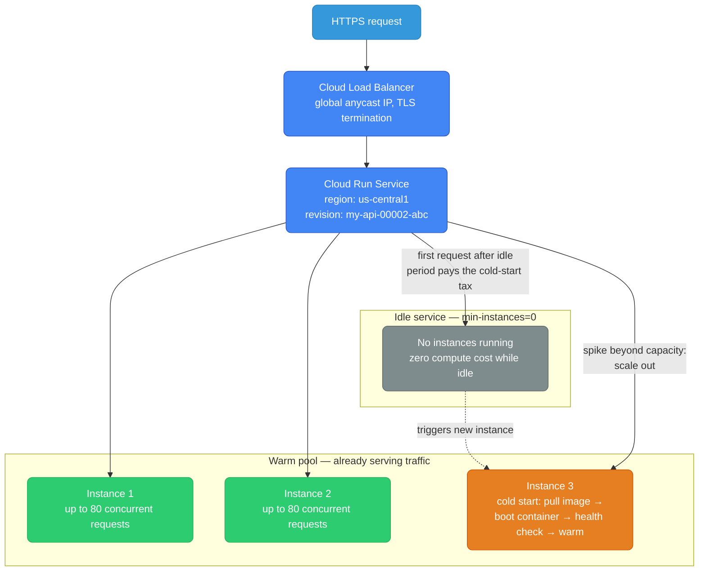
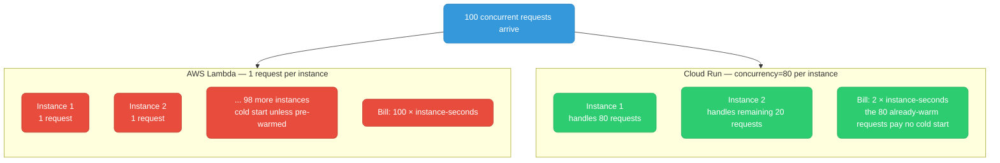
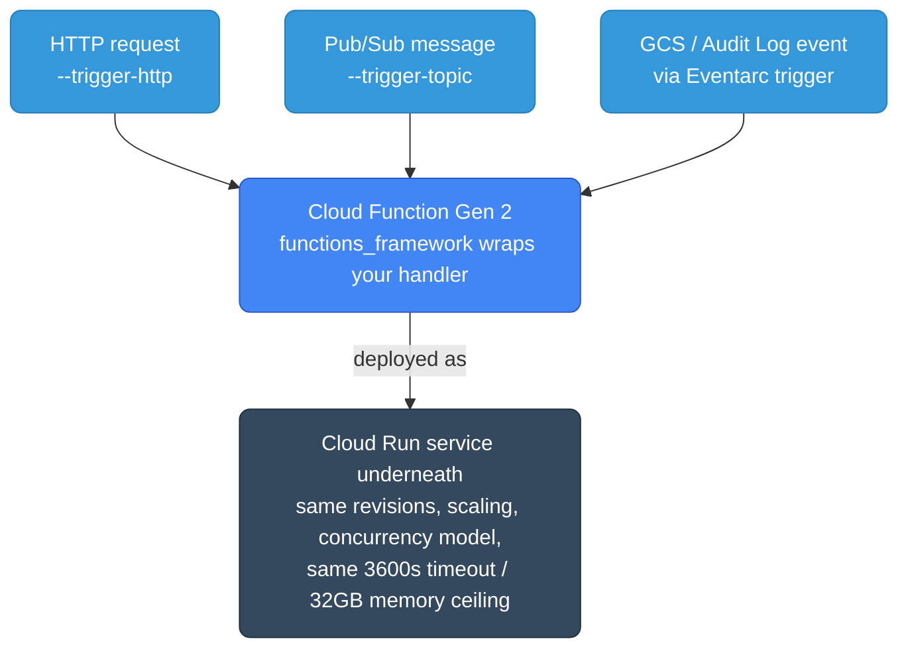
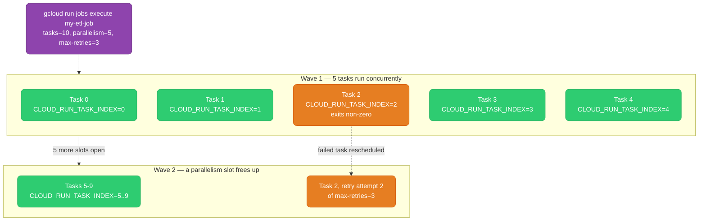
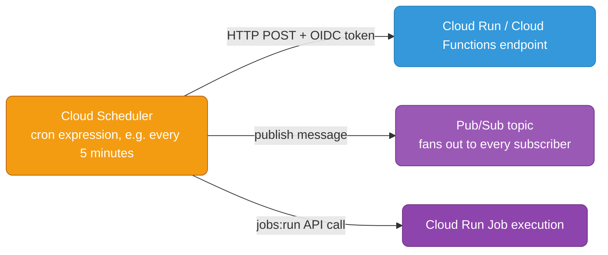
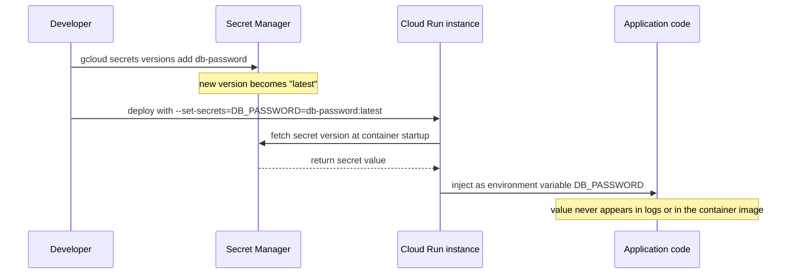

# GCP Serverless — Cloud Run, Cloud Functions, Cloud Run Jobs

Three ways to run code on GCP without owning a VM or a cluster: Cloud Run for
long-running HTTP/gRPC services, Cloud Functions for small event-triggered
handlers, and Cloud Run Jobs for batch work that runs to completion and exits.
This guide covers concurrency and cold starts, canary traffic splitting, VPC
access, triggers, scheduled execution, and Secret Manager integration.

<div class="quiz-progress" data-quiz-progress>
  <span class="quiz-progress-label">0/0 checks</span>
  <span class="quiz-progress-bar"><span class="quiz-progress-fill"></span></span>
</div>

---

## Serverless Service Map

| Use case | AWS | GCP |
|----------|-----|-----|
| Containerized HTTP service | App Runner / Fargate | **Cloud Run** |
| Event-driven functions | Lambda | **Cloud Functions** |
| Batch / one-shot jobs | Batch / ECS Tasks | **Cloud Run Jobs** |
| Scheduled jobs | EventBridge Scheduler + Lambda | **Cloud Scheduler + Cloud Run/Functions** |

---

## Cloud Run — The Primary GCP Serverless Service

Cloud Run is the best entry point for serverless on GCP. Deploy any container image, pay only when handling requests. No Kubernetes YAML, no node management.



### Deploy a Service

```bash
# Deploy from a container image
gcloud run deploy my-api \
  --image=gcr.io/my-project/my-api:latest \
  --region=us-central1 \
  --platform=managed \
  --port=8080 \
  --min-instances=0 \           # scale to zero (no idle cost)
  --max-instances=100 \
  --concurrency=80 \            # 80 concurrent requests per instance
  --memory=512Mi \
  --cpu=1 \
  --timeout=300s \              # max request duration
  --service-account=my-app-sa@project.iam.gserviceaccount.com \
  --set-env-vars="DB_HOST=10.0.0.5,APP_ENV=production" \
  --allow-unauthenticated       # public endpoint

# Deploy requiring authentication (internal APIs)
gcloud run deploy my-internal-api \
  --image=gcr.io/my-project/my-api:latest \
  --region=us-central1 \
  --no-allow-unauthenticated    # requires Bearer token (GCP identity token)
```

### Concurrency — The Key Difference from Lambda

Lambda handles **one request per instance**. Cloud Run instances handle **multiple concurrent requests** (default: 80).



```bash
# For CPU-bound work: lower concurrency
gcloud run deploy cpu-intensive-service \
  --concurrency=4 \
  --cpu=2 \
  --cpu-boost                   # extra CPU during cold start
```

<div class="quiz-card">
  <p class="quiz-q">Why does raising Cloud Run's <code>--concurrency</code> from 1 to 80 usually make a service cheaper, not just faster?</p>
  <button class="quiz-reveal">Reveal answer</button>
  <div class="quiz-a" hidden>
    Because it changes how many billed instances are needed for the same load.
    Lambda starts one instance per concurrent request, so 100 concurrent
    requests means 100 × instance cost. Cloud Run instances each handle up to
    the configured concurrency limit, so those same 100 requests fit on 2
    instances at <code>concurrency=80</code> — far fewer instance-seconds
    billed, and the requests landing on an already-warm instance skip the
    cold start entirely instead of each paying it.
  </div>
</div>

### Cold Starts and Minimum Instances

```bash
# Pay for always-warm instances (avoid cold starts for latency-sensitive APIs)
gcloud run deploy my-api \
  --min-instances=2 \           # 2 instances always running
  --max-instances=50

# Startup CPU boost (more CPU during container init = faster cold start)
gcloud run deploy my-api \
  --cpu-boost \
  --image=gcr.io/my-project/my-api:latest
```

### Cloud Run vs Lambda vs Fargate

| | Cloud Run | AWS Lambda | AWS Fargate |
|--|---|---|---|
| **Deployment unit** | Container image | Zip/container | Container (ECS task) |
| **Scale to zero** | Yes | Yes | No |
| **Cold starts** | Yes (100ms–2s) | Yes | No |
| **Concurrency/instance** | 1–1000 | 1 | 1 (per task) |
| **Max timeout** | 3600s (1hr) | 900s (15min) | No limit |
| **Max memory** | 32 GB | 10 GB | 120 GB |
| **Max vCPU** | 8 | 6 | 16 |
| **WebSockets** | Yes | No (API GW only) | Yes |
| **gRPC** | Yes | No | Yes |
| **VPC access** | Yes | Yes (slow cold start) | Yes |
| **Traffic splitting** | Yes (canary) | Yes (aliases) | No (blue/green via TG) |

### Traffic Splitting — Built-in Canary

```bash
# Deploy new version (revision)
gcloud run deploy my-api \
  --image=gcr.io/my-project/my-api:v2 \
  --no-traffic                  # deploy but send 0% traffic

# Split traffic: 10% to new, 90% to current
gcloud run services update-traffic my-api \
  --to-revisions=my-api-00002-abc=10,LATEST=90

# Full rollout after validation
gcloud run services update-traffic my-api \
  --to-latest

# Rollback instantly
gcloud run services update-traffic my-api \
  --to-revisions=my-api-00001-xyz=100
```

<div class="stepper">
  <div class="stepper-panels">
    <div class="stepper-panel active">
      <strong>1. Deploy dark.</strong> <code>gcloud run deploy ... --no-traffic</code>
      creates revision <code>my-api-00002-abc</code> and builds/starts it, but
      routes 0% of traffic to it. <code>LATEST</code> (the previous revision)
      still serves 100% — this is purely a "get it running" step, not a
      release.
    </div>
    <div class="stepper-panel">
      <strong>2. Canary split.</strong>
      <code>update-traffic --to-revisions=my-api-00002-abc=10,LATEST=90</code>
      sends 10% of real traffic to the new revision. Watch error rate, p99
      latency, and logs scoped to that revision before touching the split
      again — this is the whole point of traffic splitting over an
      all-at-once deploy.
    </div>
    <div class="stepper-panel">
      <strong>3. Full rollout.</strong> Once the canary looks healthy,
      <code>update-traffic --to-latest</code> moves 100% of traffic onto the
      new revision. No redeploy needed — it's the same revision that was
      already warm and serving the 10%.
    </div>
    <div class="stepper-panel">
      <strong>4. Rollback if it isn't.</strong> If the canary (or the full
      rollout) misbehaves, <code>update-traffic
      --to-revisions=my-api-00001-xyz=100</code> points 100% of traffic back
      at the previous, known-good revision instantly — no rebuild, no
      redeploy, just a routing change.
    </div>
  </div>
  <div class="stepper-controls">
    <button class="stepper-prev">← Prev</button>
    <span class="stepper-dots"></span>
    <span class="stepper-label"></span>
    <button class="stepper-next">Next →</button>
  </div>
</div>

<div class="quiz-card">
  <p class="quiz-q">After <code>gcloud run deploy ... --no-traffic</code>, is the new revision running yet, and who is serving live requests?</p>
  <button class="quiz-reveal">Reveal answer</button>
  <div class="quiz-a" hidden>
    Yes, the new revision is deployed and can be warmed up — it's just not
    receiving any of the 100% live traffic yet, which is still going to
    <code>LATEST</code> (the previous revision). Deploying and routing
    traffic are two separate steps in Cloud Run, which is exactly what makes
    <code>--no-traffic</code> and <code>update-traffic</code> safe to run
    independently: you can validate a revision before a single real user
    hits it, then shift traffic gradually — or roll back instantly by
    pointing 100% back at a named revision, with no rebuild required.
  </div>
</div>

### Triggering Cloud Run

Cloud Run can be triggered in multiple ways:

```bash
# 1. HTTP (default) — synchronous request/response
curl https://my-api-xxxx-uc.a.run.app/endpoint

# 2. Pub/Sub push subscription (async event processing)
gcloud pubsub subscriptions create my-run-sub \
  --topic=my-topic \
  --push-endpoint=https://my-api-xxxx-uc.a.run.app/pubsub \
  --push-auth-service-account=pubsub-invoker@project.iam.gserviceaccount.com

# 3. Cloud Scheduler (cron — equivalent to EventBridge Scheduler)
gcloud scheduler jobs create http my-cron-job \
  --location=us-central1 \
  --schedule="0 */6 * * *" \    # every 6 hours
  --uri=https://my-api-xxxx-uc.a.run.app/cron \
  --oidc-service-account-email=scheduler-sa@project.iam.gserviceaccount.com

# 4. Eventarc (event-driven, from GCS, Pub/Sub, Audit Logs)
gcloud eventarc triggers create my-trigger \
  --destination-run-service=my-api \
  --destination-run-region=us-central1 \
  --event-filters="type=google.cloud.storage.object.v1.finalized" \
  --event-filters="bucket=my-bucket" \
  --service-account=eventarc-sa@project.iam.gserviceaccount.com
```

### VPC Access

```bash
# Connect Cloud Run to your VPC (for private Cloud SQL, Memorystore, etc.)
gcloud run services update my-api \
  --vpc-connector=my-vpc-connector \
  --vpc-egress=private-ranges-only    # only route private IPs through VPC

# Create VPC connector first
gcloud compute networks vpc-access connectors create my-vpc-connector \
  --region=us-central1 \
  --network=my-vpc \
  --range=10.8.0.0/28               # /28 range used by connector
```

### Environment Variables and Secrets

```bash
# Environment variables
gcloud run services update my-api \
  --set-env-vars="APP_ENV=prod,LOG_LEVEL=info"

# Reference Secret Manager secrets (never pass secrets as env vars directly)
gcloud run services update my-api \
  --set-secrets="DB_PASSWORD=my-db-password:latest"
  # mounts as env var; Cloud Run fetches from Secret Manager at startup
```

---

## Cloud Functions — Event-Driven Functions

Cloud Functions = Lambda. Best for small, event-triggered operations.

### Gen 1 vs Gen 2

| | Gen 1 | Gen 2 |
|--|---|---|
| **Runtime** | Node, Python, Go, Java, Ruby, PHP | All Gen 1 + more |
| **Max timeout** | 540s | 3600s |
| **Max memory** | 8 GB | 32 GB |
| **Max instances** | 3,000 | 1,000 (with concurrency >1) |
| **Concurrency** | 1 | Up to 1,000 per instance |
| **Based on** | Custom | Cloud Run (Gen 2 is Cloud Run under the hood) |

Use Gen 2 for all new functions. It's Cloud Run with a simpler deployment API.



```bash
# HTTP-triggered function (Python)
gcloud functions deploy my-function \
  --gen2 \
  --runtime=python311 \
  --region=us-central1 \
  --source=. \
  --entry-point=handle_request \
  --trigger-http \
  --allow-unauthenticated

# Pub/Sub-triggered function
gcloud functions deploy my-processor \
  --gen2 \
  --runtime=python311 \
  --region=us-central1 \
  --source=. \
  --entry-point=process_message \
  --trigger-topic=my-topic
```

```python
# main.py — HTTP function
import functions_framework
from flask import Request

@functions_framework.http
def handle_request(request: Request):
    data = request.get_json()
    result = process(data)
    return {"status": "ok", "result": result}, 200

# main.py — Pub/Sub function
import functions_framework
import base64, json

@functions_framework.cloud_event
def process_message(cloud_event):
    data = base64.b64decode(cloud_event.data["message"]["data"]).decode()
    message = json.loads(data)
    print(f"Processing: {message}")
```

### Choosing Between Cloud Run, Cloud Functions, and Cloud Run Jobs

All three run on the same underlying compute, so the choice comes down to
shape of the workload — request/response service, tiny event handler, or
run-to-completion batch — not raw capability.

<div class="tab-group">
  <div class="tab-buttons">
    <button data-tab="run" class="active">Cloud Run</button>
    <button data-tab="functions">Cloud Functions Gen 2</button>
    <button data-tab="jobs">Cloud Run Jobs</button>
  </div>
  <div class="tab-panels">
    <div class="tab-panel active" data-tab-panel="run">
      <strong>Use it for a complex app with dependencies.</strong> Custom
      Dockerfile, an HTTP API with multiple endpoints, timeouts beyond 9
      minutes, higher memory/CPU needs, or WebSocket / gRPC support. You own
      the container image and everything in it — most flexibility, most
      setup.
    </div>
    <div class="tab-panel" data-tab-panel="functions">
      <strong>Use it for a simple, single-purpose event handler.</strong>
      Under ~100 lines of logic, no interest in maintaining a Dockerfile, and
      the standard language runtime (Python, Node, Go, Java...) is enough.
      Deploy is source-only — <code>functions_framework</code> wraps your
      handler and it runs on Cloud Run underneath, so you still get Cloud
      Run's scaling and concurrency without writing any container config.
    </div>
    <div class="tab-panel" data-tab-panel="jobs">
      <strong>Use it for batch work that has a defined end.</strong> No HTTP
      endpoint — a job runs a container to completion (or to
      <code>--max-retries</code> failures) and exits, optionally fanned out
      across <code>--tasks</code> parallel instances partitioned by
      <code>CLOUD_RUN_TASK_INDEX</code>. Wrong tool for anything that needs
      to sit and wait for requests.
    </div>
  </div>
</div>

<div class="quiz-card">
  <p class="quiz-q">A teammate says "Cloud Functions Gen 2 is basically Cloud Run with extra steps." True or false, and why does it matter operationally?</p>
  <button class="quiz-reveal">Reveal answer</button>
  <div class="quiz-a" hidden>
    True — Gen 2 functions are deployed as a Cloud Run service under the
    hood. That's exactly why Gen 2 inherits Cloud Run's ceilings instead of
    Gen 1's: a 3600s max timeout instead of 540s, up to 1,000 concurrent
    requests per instance instead of 1, and a 32GB memory ceiling instead of
    8GB. If you need those higher limits, "just switch to Gen 2" is often a
    smaller change than migrating all the way to a hand-rolled Cloud Run
    service.
  </div>
</div>

---

## Cloud Run Jobs — Batch / One-Shot Containers

Cloud Run Jobs = AWS Batch or ECS Task with `desiredCount=1`. No HTTP endpoint — runs a container to completion.

```bash
# Create a job
gcloud run jobs create my-etl-job \
  --image=gcr.io/my-project/etl:latest \
  --region=us-central1 \
  --tasks=10 \                  # run 10 parallel task instances
  --max-retries=3 \
  --parallelism=5 \             # run 5 at a time
  --task-timeout=3600s \
  --set-env-vars="BATCH_ID=daily-etl"

# Execute the job
gcloud run jobs execute my-etl-job \
  --region=us-central1 \
  --wait                        # block until done

# Each task instance gets CLOUD_RUN_TASK_INDEX (0..N-1)
# Use it to partition work:
# task 0: process users 0-999
# task 1: process users 1000-1999
# ...
```



```python
# Container code: uses CLOUD_RUN_TASK_INDEX for partition
import os

task_index = int(os.environ.get("CLOUD_RUN_TASK_INDEX", 0))
task_count = int(os.environ.get("CLOUD_RUN_TASK_COUNT", 1))

# Process your partition
items = get_all_items()
my_items = [i for idx, i in enumerate(items) if idx % task_count == task_index]
process(my_items)
```

### Scheduled Jobs (Cron)

```bash
# Schedule a Cloud Run Job with Cloud Scheduler
gcloud scheduler jobs create http daily-etl-trigger \
  --location=us-central1 \
  --schedule="0 2 * * *" \      # 2am daily
  --uri="https://us-central1-run.googleapis.com/apis/run.googleapis.com/v1/namespaces/my-project/jobs/my-etl-job:run" \
  --message-body='{}' \
  --oauth-service-account-email=scheduler-sa@project.iam.gserviceaccount.com
```

<div class="quiz-card">
  <p class="quiz-q">A Cloud Run Job task exits with a non-zero code. What happens next, and how is that different from a Cloud Run <em>Service</em> instance crashing?</p>
  <button class="quiz-reveal">Reveal answer</button>
  <div class="quiz-a" hidden>
    The job retries that specific task index, up to <code>--max-retries</code>
    times — jobs are run-to-completion, so a failed task is rerun rather than
    just discarded. A Cloud Run <em>Service</em> instance crashing is a
    different failure mode entirely: there's no HTTP endpoint or task count
    to satisfy, so Cloud Run just routes subsequent requests to a healthy
    instance (or starts a new one) — there's no concept of "retrying" a
    request the way a job retries a task index.
  </div>
</div>

---

## Cloud Scheduler

Standalone cron-as-a-service. Can trigger HTTP endpoints, Pub/Sub topics, or Cloud Run jobs.



```bash
# Hit an HTTP endpoint on schedule
gcloud scheduler jobs create http my-job \
  --location=us-central1 \
  --schedule="*/5 * * * *" \    # every 5 minutes
  --uri=https://my-api.run.app/refresh \
  --http-method=POST \
  --message-body='{"action":"refresh"}' \
  --oidc-service-account-email=scheduler@project.iam.gserviceaccount.com

# Publish to Pub/Sub on schedule
gcloud scheduler jobs create pubsub my-pubsub-job \
  --location=us-central1 \
  --schedule="0 */4 * * *" \   # every 4 hours
  --topic=my-topic \
  --message-body='{"type":"scheduled"}'
```

<div class="quiz-card">
  <p class="quiz-q">Cloud Scheduler calls an HTTP endpoint on a Cloud Run service deployed with <code>--no-allow-unauthenticated</code>. Why doesn't the call get rejected as anonymous?</p>
  <button class="quiz-reveal">Reveal answer</button>
  <div class="quiz-a" hidden>
    Because the scheduler job is created with
    <code>--oidc-service-account-email=scheduler@project.iam.gserviceaccount.com</code>,
    which attaches a signed OIDC identity token for that service account to
    every request. Cloud Run validates it exactly like it would validate any
    other caller's identity token — the request is authenticated, not
    anonymous, as long as that service account has been granted the
    Cloud Run Invoker role.
  </div>
</div>

---

## Secret Manager — Centralized Secrets

Versioned, access-controlled secret storage that Cloud Run, Cloud Functions,
and Cloud Run Jobs all read from the same way — via `--set-secrets` at deploy
time, not by baking a value into an image or an env var in source control.



```bash
# Create a secret
echo -n "my-db-password" | gcloud secrets create db-password --data-file=-

# Add a new version
echo -n "new-password" | gcloud secrets versions add db-password --data-file=-

# Access a secret (in Cloud Run via --set-secrets, or from SDK)
gcloud secrets versions access latest --secret=db-password
```

```python
from google.cloud import secretmanager

client = secretmanager.SecretManagerServiceClient()
name = "projects/my-project/secrets/db-password/versions/latest"
response = client.access_secret_version(request={"name": name})
password = response.payload.data.decode("UTF-8")
```

**Equivalent to AWS Secrets Manager.** GCP Secret Manager is simpler — no rotation lambda setup. Secret rotation can be triggered via Pub/Sub notifications when a new version is added.

<div class="quiz-card">
  <p class="quiz-q">A service is deployed with <code>--set-secrets="DB_PASSWORD=my-db-password:latest"</code>. A new secret version is added the next day. Does the running Cloud Run instance pick up the new value?</p>
  <button class="quiz-reveal">Reveal answer</button>
  <div class="quiz-a" hidden>
    Not without a new revision. Cloud Run fetches the secret version at
    container startup and injects it as an environment variable for that
    revision's lifetime — pinning to <code>:latest</code> only means the
    <em>next</em> deploy or cold start picks up whatever is newest at that
    moment, not that already-running instances get pushed a live update.
    That's also why the value never appears in the container image or
    source control: it's resolved at startup from Secret Manager, not baked
    in ahead of time.
  </div>
</div>
