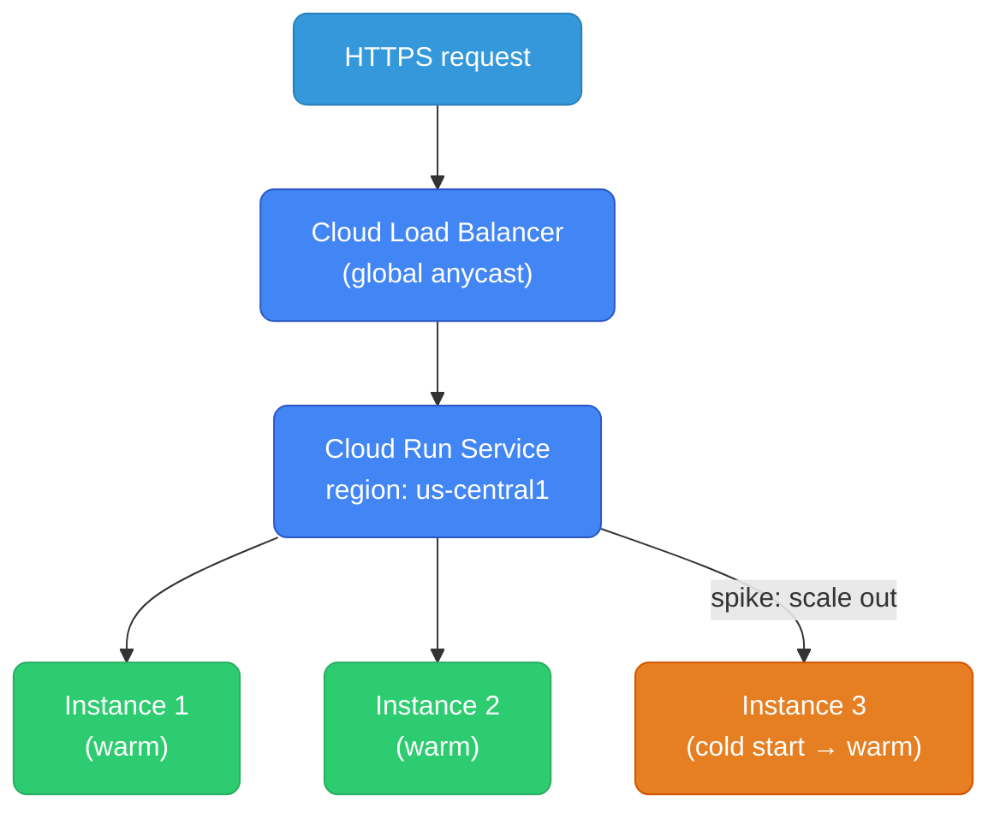

# GCP Serverless — Cloud Run, Cloud Functions, Cloud Run Jobs

---

## Serverless Service Map

| Use case | AWS | GCP |
|----------|-----|-----|
| Containerized HTTP service | App Runner / Fargate | **Cloud Run** |
| Event-driven functions | Lambda | **Cloud Functions** |
| Batch / one-shot jobs | Batch / ECS Tasks | **Cloud Run Jobs** |
| Scheduled jobs | EventBridge Scheduler + Lambda | **Cloud Scheduler + Cloud Run/Functions** |

---

## Cloud Run — The Primary GCP Serverless Service

Cloud Run is the best entry point for serverless on GCP. Deploy any container image, pay only when handling requests. No Kubernetes YAML, no node management.



### Deploy a Service

```bash
# Deploy from a container image
gcloud run deploy my-api \
  --image=gcr.io/my-project/my-api:latest \
  --region=us-central1 \
  --platform=managed \
  --port=8080 \
  --min-instances=0 \           # scale to zero (no idle cost)
  --max-instances=100 \
  --concurrency=80 \            # 80 concurrent requests per instance
  --memory=512Mi \
  --cpu=1 \
  --timeout=300s \              # max request duration
  --service-account=my-app-sa@project.iam.gserviceaccount.com \
  --set-env-vars="DB_HOST=10.0.0.5,APP_ENV=production" \
  --allow-unauthenticated       # public endpoint

# Deploy requiring authentication (internal APIs)
gcloud run deploy my-internal-api \
  --image=gcr.io/my-project/my-api:latest \
  --region=us-central1 \
  --no-allow-unauthenticated    # requires Bearer token (GCP identity token)
```

### Concurrency — The Key Difference from Lambda

Lambda handles **one request per instance**. Cloud Run instances handle **multiple concurrent requests** (default: 80).

```
Load: 100 concurrent requests

Lambda:
  → 100 instances started (cold starts if not warm)
  → 100 × Lambda cost

Cloud Run (concurrency=80):
  → 2 instances handle 80+20 requests
  → No cold starts for 80% of requests
  → 2× instance cost (much cheaper)
```

```bash
# For CPU-bound work: lower concurrency
gcloud run deploy cpu-intensive-service \
  --concurrency=4 \
  --cpu=2 \
  --cpu-boost                   # extra CPU during cold start
```

### Cold Starts and Minimum Instances

```bash
# Pay for always-warm instances (avoid cold starts for latency-sensitive APIs)
gcloud run deploy my-api \
  --min-instances=2 \           # 2 instances always running
  --max-instances=50

# Startup CPU boost (more CPU during container init = faster cold start)
gcloud run deploy my-api \
  --cpu-boost \
  --image=gcr.io/my-project/my-api:latest
```

### Cloud Run vs Lambda vs Fargate

| | Cloud Run | AWS Lambda | AWS Fargate |
|--|---|---|---|
| **Deployment unit** | Container image | Zip/container | Container (ECS task) |
| **Scale to zero** | Yes | Yes | No |
| **Cold starts** | Yes (100ms–2s) | Yes | No |
| **Concurrency/instance** | 1–1000 | 1 | 1 (per task) |
| **Max timeout** | 3600s (1hr) | 900s (15min) | No limit |
| **Max memory** | 32 GB | 10 GB | 120 GB |
| **Max vCPU** | 8 | 6 | 16 |
| **WebSockets** | Yes | No (API GW only) | Yes |
| **gRPC** | Yes | No | Yes |
| **VPC access** | Yes | Yes (slow cold start) | Yes |
| **Traffic splitting** | Yes (canary) | Yes (aliases) | No (blue/green via TG) |

### Traffic Splitting — Built-in Canary

```bash
# Deploy new version (revision)
gcloud run deploy my-api \
  --image=gcr.io/my-project/my-api:v2 \
  --no-traffic                  # deploy but send 0% traffic

# Split traffic: 10% to new, 90% to current
gcloud run services update-traffic my-api \
  --to-revisions=my-api-00002-abc=10,LATEST=90

# Full rollout after validation
gcloud run services update-traffic my-api \
  --to-latest

# Rollback instantly
gcloud run services update-traffic my-api \
  --to-revisions=my-api-00001-xyz=100
```

### Triggering Cloud Run

Cloud Run can be triggered in multiple ways:

```bash
# 1. HTTP (default) — synchronous request/response
curl https://my-api-xxxx-uc.a.run.app/endpoint

# 2. Pub/Sub push subscription (async event processing)
gcloud pubsub subscriptions create my-run-sub \
  --topic=my-topic \
  --push-endpoint=https://my-api-xxxx-uc.a.run.app/pubsub \
  --push-auth-service-account=pubsub-invoker@project.iam.gserviceaccount.com

# 3. Cloud Scheduler (cron — equivalent to EventBridge Scheduler)
gcloud scheduler jobs create http my-cron-job \
  --location=us-central1 \
  --schedule="0 */6 * * *" \    # every 6 hours
  --uri=https://my-api-xxxx-uc.a.run.app/cron \
  --oidc-service-account-email=scheduler-sa@project.iam.gserviceaccount.com

# 4. Eventarc (event-driven, from GCS, Pub/Sub, Audit Logs)
gcloud eventarc triggers create my-trigger \
  --destination-run-service=my-api \
  --destination-run-region=us-central1 \
  --event-filters="type=google.cloud.storage.object.v1.finalized" \
  --event-filters="bucket=my-bucket" \
  --service-account=eventarc-sa@project.iam.gserviceaccount.com
```

### VPC Access

```bash
# Connect Cloud Run to your VPC (for private Cloud SQL, Memorystore, etc.)
gcloud run services update my-api \
  --vpc-connector=my-vpc-connector \
  --vpc-egress=private-ranges-only    # only route private IPs through VPC

# Create VPC connector first
gcloud compute networks vpc-access connectors create my-vpc-connector \
  --region=us-central1 \
  --network=my-vpc \
  --range=10.8.0.0/28               # /28 range used by connector
```

### Environment Variables and Secrets

```bash
# Environment variables
gcloud run services update my-api \
  --set-env-vars="APP_ENV=prod,LOG_LEVEL=info"

# Reference Secret Manager secrets (never pass secrets as env vars directly)
gcloud run services update my-api \
  --set-secrets="DB_PASSWORD=my-db-password:latest"
  # mounts as env var; Cloud Run fetches from Secret Manager at startup
```

---

## Cloud Functions — Event-Driven Functions

Cloud Functions = Lambda. Best for small, event-triggered operations.

### Gen 1 vs Gen 2

| | Gen 1 | Gen 2 |
|--|---|---|
| **Runtime** | Node, Python, Go, Java, Ruby, PHP | All Gen 1 + more |
| **Max timeout** | 540s | 3600s |
| **Max memory** | 8 GB | 32 GB |
| **Max instances** | 3,000 | 1,000 (with concurrency >1) |
| **Concurrency** | 1 | Up to 1,000 per instance |
| **Based on** | Custom | Cloud Run (Gen 2 is Cloud Run under the hood) |

Use Gen 2 for all new functions. It's Cloud Run with a simpler deployment API.

```bash
# HTTP-triggered function (Python)
gcloud functions deploy my-function \
  --gen2 \
  --runtime=python311 \
  --region=us-central1 \
  --source=. \
  --entry-point=handle_request \
  --trigger-http \
  --allow-unauthenticated

# Pub/Sub-triggered function
gcloud functions deploy my-processor \
  --gen2 \
  --runtime=python311 \
  --region=us-central1 \
  --source=. \
  --entry-point=process_message \
  --trigger-topic=my-topic
```

```python
# main.py — HTTP function
import functions_framework
from flask import Request

@functions_framework.http
def handle_request(request: Request):
    data = request.get_json()
    result = process(data)
    return {"status": "ok", "result": result}, 200

# main.py — Pub/Sub function
import functions_framework
import base64, json

@functions_framework.cloud_event
def process_message(cloud_event):
    data = base64.b64decode(cloud_event.data["message"]["data"]).decode()
    message = json.loads(data)
    print(f"Processing: {message}")
```

### When Cloud Functions vs Cloud Run

```
Use Cloud Functions when:
  - Simple event handler (< 100 lines of logic)
  - Don't want to manage Dockerfile
  - Language runtime is enough

Use Cloud Run when:
  - Complex app with dependencies
  - Custom Dockerfile
  - HTTP API with multiple endpoints
  - Longer timeouts (> 9min)
  - Higher memory/CPU needs
  - WebSocket / gRPC
```

---

## Cloud Run Jobs — Batch / One-Shot Containers

Cloud Run Jobs = AWS Batch or ECS Task with `desiredCount=1`. No HTTP endpoint — runs a container to completion.

```bash
# Create a job
gcloud run jobs create my-etl-job \
  --image=gcr.io/my-project/etl:latest \
  --region=us-central1 \
  --tasks=10 \                  # run 10 parallel task instances
  --max-retries=3 \
  --parallelism=5 \             # run 5 at a time
  --task-timeout=3600s \
  --set-env-vars="BATCH_ID=daily-etl"

# Execute the job
gcloud run jobs execute my-etl-job \
  --region=us-central1 \
  --wait                        # block until done

# Each task instance gets CLOUD_RUN_TASK_INDEX (0..N-1)
# Use it to partition work:
# task 0: process users 0-999
# task 1: process users 1000-1999
# ...
```

```python
# Container code: uses CLOUD_RUN_TASK_INDEX for partition
import os

task_index = int(os.environ.get("CLOUD_RUN_TASK_INDEX", 0))
task_count = int(os.environ.get("CLOUD_RUN_TASK_COUNT", 1))

# Process your partition
items = get_all_items()
my_items = [i for idx, i in enumerate(items) if idx % task_count == task_index]
process(my_items)
```

### Scheduled Jobs (Cron)

```bash
# Schedule a Cloud Run Job with Cloud Scheduler
gcloud scheduler jobs create http daily-etl-trigger \
  --location=us-central1 \
  --schedule="0 2 * * *" \      # 2am daily
  --uri="https://us-central1-run.googleapis.com/apis/run.googleapis.com/v1/namespaces/my-project/jobs/my-etl-job:run" \
  --message-body='{}' \
  --oauth-service-account-email=scheduler-sa@project.iam.gserviceaccount.com
```

---

## Cloud Scheduler

Standalone cron-as-a-service. Can trigger HTTP endpoints, Pub/Sub topics, or Cloud Run jobs.

```bash
# Hit an HTTP endpoint on schedule
gcloud scheduler jobs create http my-job \
  --location=us-central1 \
  --schedule="*/5 * * * *" \    # every 5 minutes
  --uri=https://my-api.run.app/refresh \
  --http-method=POST \
  --message-body='{"action":"refresh"}' \
  --oidc-service-account-email=scheduler@project.iam.gserviceaccount.com

# Publish to Pub/Sub on schedule
gcloud scheduler jobs create pubsub my-pubsub-job \
  --location=us-central1 \
  --schedule="0 */4 * * *" \   # every 4 hours
  --topic=my-topic \
  --message-body='{"type":"scheduled"}'
```

---

## Secret Manager — Centralized Secrets

```bash
# Create a secret
echo -n "my-db-password" | gcloud secrets create db-password --data-file=-

# Add a new version
echo -n "new-password" | gcloud secrets versions add db-password --data-file=-

# Access a secret (in Cloud Run via --set-secrets, or from SDK)
gcloud secrets versions access latest --secret=db-password
```

```python
from google.cloud import secretmanager

client = secretmanager.SecretManagerServiceClient()
name = "projects/my-project/secrets/db-password/versions/latest"
response = client.access_secret_version(request={"name": name})
password = response.payload.data.decode("UTF-8")
```

**Equivalent to AWS Secrets Manager.** GCP Secret Manager is simpler — no rotation lambda setup. Secret rotation can be triggered via Pub/Sub notifications when a new version is added.
