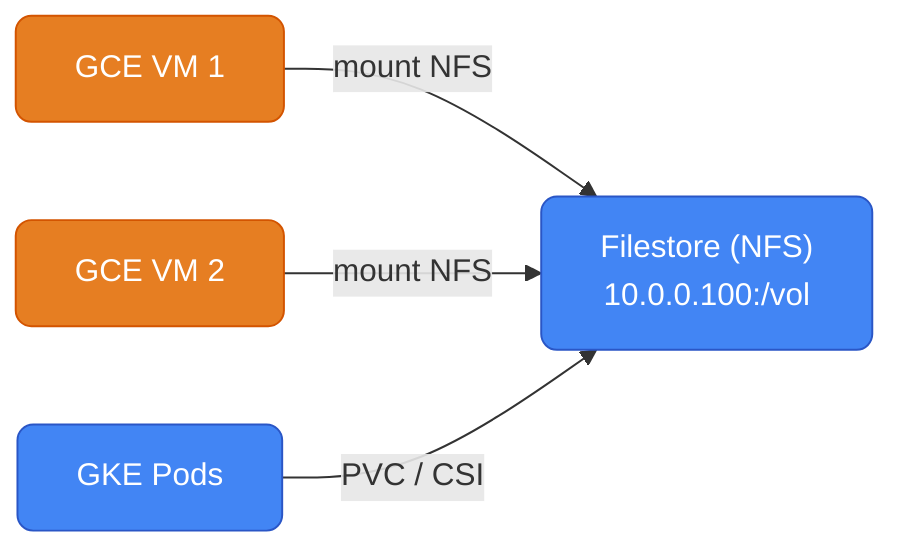

# GCP Storage

Object storage, block storage, and file storage — GCP equivalents to S3, EBS, and EFS.

---

## Storage Services Map

| Use case | AWS | GCP |
|----------|-----|-----|
| Object storage | S3 | **Cloud Storage (GCS)** |
| Block storage (VM disk) | EBS | **Persistent Disk / Hyperdisk** |
| Shared file system (NFS) | EFS | **Filestore** |
| Local NVMe (ephemeral) | Instance Store | **Local SSD** |
| Transfer acceleration | S3 Transfer Acceleration | **Storage Transfer Service** |
| Archival | S3 Glacier | **GCS Archive class** |
| Auto-tiering | S3 Intelligent-Tiering | **GCS Autoclass** |

---

## Cloud Storage (GCS)

GCS is GCP's S3. Globally consistent, durable (11 nines), and multi-region by default when you want it.

### Bucket Locations

| Type | Example | Availability | Cost |
|------|---------|-------------|------|
| **Region** | `us-central1` | Single region | Lowest |
| **Dual-region** | `NAM4` (Iowa+S.Carolina) | 2 regions, auto-replication | Medium |
| **Multi-region** | `US`, `EU`, `ASIA` | 3+ regions | Highest |

```bash
# Create a regional bucket
gsutil mb -l us-central1 gs://my-unique-bucket-name

# Multi-region (equivalent to S3 Cross-Region Replication, but built-in)
gsutil mb -l US gs://my-multi-region-bucket

# Uniform bucket-level access (recommended — disables per-object ACLs, use IAM only)
gsutil uniformbucketlevelaccess set on gs://my-bucket
```

### Storage Classes

| Class | Min storage | Retrieval cost | Price/GB/mo | Use case |
|-------|------------|----------------|-------------|----------|
| **Standard** | None | None | $0.020 | Frequently accessed data |
| **Nearline** | 30 days | $0.01/GB | $0.010 | Monthly access (backups) |
| **Coldline** | 90 days | $0.02/GB | $0.004 | Quarterly access |
| **Archive** | 365 days | $0.05/GB | $0.0012 | Annual+ access (DR copies) |

```bash
# Upload to specific storage class
gsutil -o "GSUtil:default_project_id=my-project" cp \
  -Z -c ARCHIVE \
  large-backup.tar.gz gs://my-backup-bucket/

# Change class of existing object
gsutil rewrite -s nearline gs://my-bucket/large-file.parquet
```

### Autoclass — Automatic Tiering

GCS Autoclass automatically moves objects between Standard → Nearline → Coldline → Archive based on access patterns. Equivalent to S3 Intelligent-Tiering.

```bash
gsutil buckets update gs://my-bucket --autoclass
```

### Basic Operations

```bash
# Upload
gsutil cp local-file.txt gs://my-bucket/path/file.txt

# Upload directory (recursive)
gsutil cp -r ./local-dir/ gs://my-bucket/prefix/

# Sync (like aws s3 sync)
gsutil rsync -r ./local-dir/ gs://my-bucket/prefix/
gsutil rsync -r -d gs://my-bucket/prefix/ ./local-dir/   # -d deletes destination files not in source

# Download
gsutil cp gs://my-bucket/path/file.txt ./local-file.txt

# List
gsutil ls gs://my-bucket/
gsutil ls -l gs://my-bucket/    # long format with sizes

# Delete
gsutil rm gs://my-bucket/path/file.txt
gsutil rm -r gs://my-bucket/prefix/    # recursive

# Signed URL (pre-signed URL equivalent — time-limited access)
gsutil signurl -d 1h -m GET service-account-key.json gs://my-bucket/file.txt
# Better: use Workload Identity and generate via SDK, not key files
```

### Access Control

```bash
# Grant read access to a service account (use IAM, not ACLs)
gcloud storage buckets add-iam-policy-binding gs://my-bucket \
  --member="serviceAccount:my-app@project.iam.gserviceaccount.com" \
  --role="roles/storage.objectViewer"

# Common storage IAM roles
# roles/storage.objectViewer      → read objects (not list bucket)
# roles/storage.objectUser        → read + write objects
# roles/storage.objectAdmin       → full object control
# roles/storage.admin             → bucket + object admin
# roles/storage.legacyBucketReader → list bucket (needed for gsutil ls)
```

### Lifecycle Rules

```json
{
  "rule": [
    {
      "action": {"type": "SetStorageClass", "storageClass": "NEARLINE"},
      "condition": {"age": 30, "matchesStorageClass": ["STANDARD"]}
    },
    {
      "action": {"type": "SetStorageClass", "storageClass": "COLDLINE"},
      "condition": {"age": 90}
    },
    {
      "action": {"type": "Delete"},
      "condition": {"age": 365}
    }
  ]
}
```

```bash
gsutil lifecycle set lifecycle.json gs://my-bucket
```

### Versioning

```bash
# Enable versioning (equivalent to S3 versioning)
gsutil versioning set on gs://my-bucket

# List all versions
gsutil ls -a gs://my-bucket/file.txt

# Restore a version
gsutil cp gs://my-bucket/file.txt#1234567890 gs://my-bucket/file.txt
```

---

## Persistent Disk (Block Storage)

Persistent Disk is GCP's EBS — network-attached block storage for GCE VMs.

### Disk Types

| Type | Max IOPS | Max throughput | Price/GB/mo | AWS analog |
|------|---------|---------------|-------------|-----------|
| `pd-standard` | 3,000 IOPS/TB | 0.12 MB/s/GB | $0.040 | gp2 (old) |
| `pd-balanced` | 3,000 IOPS/TB | 0.28 MB/s/GB | $0.100 | gp3 |
| `pd-ssd` | 30,000 IOPS | 0.48 MB/s/GB | $0.170 | io1/io2 |
| `pd-extreme` | 120,000 IOPS | Custom | $0.220 | io2 Block Express |
| `hyperdisk-balanced` | 160,000 IOPS | Configurable | $0.120 | io2 Express |
| `hyperdisk-throughput` | 3,000 IOPS | 2,400 MB/s | $0.080 | Throughput-optimized |

```bash
# Create and attach a disk
gcloud compute disks create my-data-disk \
  --zone=us-central1-a \
  --size=200GB \
  --type=pd-ssd

gcloud compute instances attach-disk my-vm \
  --disk=my-data-disk \
  --device-name=data \
  --zone=us-central1-a

# Inside VM: format and mount
sudo mkfs.ext4 -m 0 -E lazy_itable_init=0,lazy_journal_init=0,discard /dev/disk/by-id/google-data
sudo mkdir -p /mnt/data
sudo mount /dev/disk/by-id/google-data /mnt/data

# Resize a disk online (no reboot needed — unlike AWS)
gcloud compute disks resize my-data-disk \
  --size=400GB \
  --zone=us-central1-a
# Then grow filesystem online:
sudo resize2fs /dev/disk/by-id/google-data
```

### Multi-Reader Disks

A PD disk can be attached to multiple VMs in **read-only mode**. Useful for shared datasets (ML model weights, reference data).

```bash
# Attach same disk to multiple VMs in read-only mode
gcloud compute instances attach-disk vm-1 --disk=my-shared-disk --mode=ro --zone=us-central1-a
gcloud compute instances attach-disk vm-2 --disk=my-shared-disk --mode=ro --zone=us-central1-a
gcloud compute instances attach-disk vm-3 --disk=my-shared-disk --mode=ro --zone=us-central1-a
```

AWS EBS multi-attach is only supported on io1/io2 and only for cluster-aware applications. GCP PD read-only multi-attach works for any disk type.

### Disk Snapshots

```bash
# Manual snapshot (= EBS snapshot)
gcloud compute disks snapshot my-data-disk \
  --snapshot-names=my-data-disk-snap-$(date +%Y%m%d) \
  --zone=us-central1-a

# Restore from snapshot
gcloud compute disks create restored-disk \
  --source-snapshot=my-data-disk-snap-20240115 \
  --zone=us-central1-a

# Scheduled snapshots (= Data Lifecycle Manager in AWS)
gcloud compute resource-policies create snapshot-schedule daily-backup \
  --region=us-central1 \
  --max-retention-days=7 \
  --on-source-disk-delete=keep-auto-snapshots \
  --daily-schedule \
  --start-time=04:00

gcloud compute disks add-resource-policies my-data-disk \
  --resource-policies=daily-backup \
  --zone=us-central1-a
```

---

## Local SSD

Local NVMe drives physically attached to the server. Much faster than Persistent Disk, but **ephemeral** — data is lost on VM stop/restart. Like AWS instance store.

```bash
# Attach local SSD at instance creation (can't attach after)
gcloud compute instances create my-vm \
  --machine-type=n2-standard-8 \
  --local-ssd=interface=nvme    # 375 GB per SSD

# Multiple local SSDs (can be striped for more throughput)
gcloud compute instances create my-vm \
  --machine-type=n2-standard-16 \
  --local-ssd=interface=nvme \
  --local-ssd=interface=nvme    # 750 GB total
```

Use cases: temp files, shuffle space for batch jobs, buffer layers on top of Persistent Disk.

---

## Filestore (Managed NFS)

Filestore is GCP's EFS — managed NFS server for shared file access across multiple VMs or GKE pods.



### Filestore Tiers

| Tier | Capacity | IOPS | Use case | AWS analog |
|------|---------|------|----------|-----------|
| **Basic HDD** | 1-63.9 TB | 600/TB | Dev/test | EFS IA |
| **Basic SSD** | 2.5-63.9 TB | 30,000 | Production web/content | EFS General |
| **Enterprise** | 1-10 TB | 120,000 | Databases, high-perf | EFS Max I/O |
| **Zonal** | 1-9.75 TB | 80,000 | Single-zone, lower cost | EFS Standard |

```bash
# Create Filestore instance
gcloud filestore instances create my-nfs \
  --zone=us-central1-a \
  --tier=BASIC_SSD \
  --file-share=name=vol,capacity=2.5TB \
  --network=name=my-vpc

# Mount on VM
sudo apt-get install nfs-common
sudo mkdir /mnt/shared
sudo mount 10.0.0.100:/vol /mnt/shared

# Mount in GKE (via CSI driver)
# StorageClass is pre-installed on GKE
```

```yaml
# PVC for Filestore in GKE
apiVersion: v1
kind: PersistentVolumeClaim
metadata:
  name: my-nfs-pvc
spec:
  accessModes:
    - ReadWriteMany     # multiple pods can mount simultaneously
  storageClassName: standard-rwx   # uses Filestore CSI driver
  resources:
    requests:
      storage: 2560Gi
```

---

## Storage Transfer Service

Move data into GCS from S3, Azure Blob, HTTP, on-prem. Equivalent to AWS DataSync or S3 Transfer Acceleration (for migration).

```bash
# Create a transfer job from S3 to GCS
gcloud transfer jobs create \
  --source-agent-pool="" \
  --source-creds-file=aws-creds.json \
  --source=s3://my-aws-bucket/ \
  --destination=gs://my-gcp-bucket/ \
  --schedule-repeats-every=24h
```

---

## GCS vs S3 — Key Differences

| | GCP Cloud Storage | AWS S3 |
|--|---|---|
| **Consistency** | Strong consistency (always) | Strong consistency (since 2020) |
| **Storage classes** | Standard/Nearline/Coldline/Archive | Standard/IA/Glacier/Deep Archive |
| **Auto-tiering** | Autoclass | Intelligent-Tiering |
| **Multi-region** | US/EU/ASIA built-in | Cross-Region Replication (separate config) |
| **Access control** | Uniform (IAM) or fine-grained (ACLs) | Bucket policies + ACLs |
| **Signed URLs** | `gsutil signurl` or client library | `aws s3 presign` |
| **Event notifications** | Pub/Sub, Eventarc | S3 Events → SNS/SQS/Lambda |
| **Versioning** | Yes | Yes |
| **Lifecycle rules** | Yes | Yes |
| **Replication** | Turbo Replication (dual-region) | CRR/SRR |
| **CLI** | `gsutil` or `gcloud storage` | `aws s3` |

```bash
# New gcloud storage CLI (faster than gsutil for large transfers)
gcloud storage cp local-file.txt gs://my-bucket/
gcloud storage ls gs://my-bucket/
gcloud storage rm gs://my-bucket/file.txt
```
