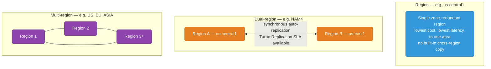
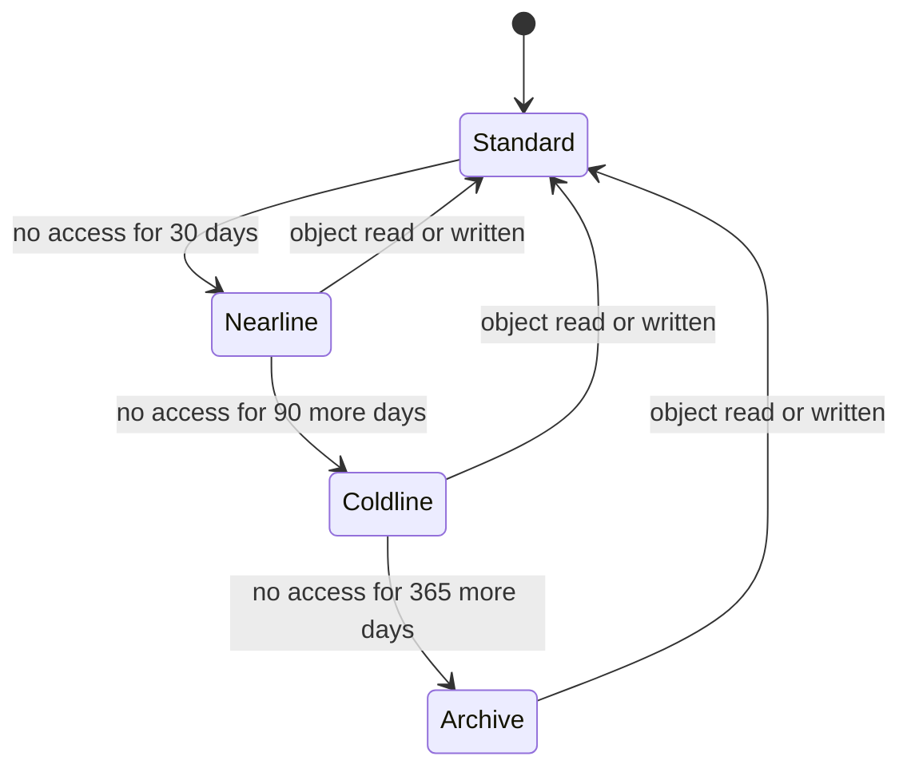
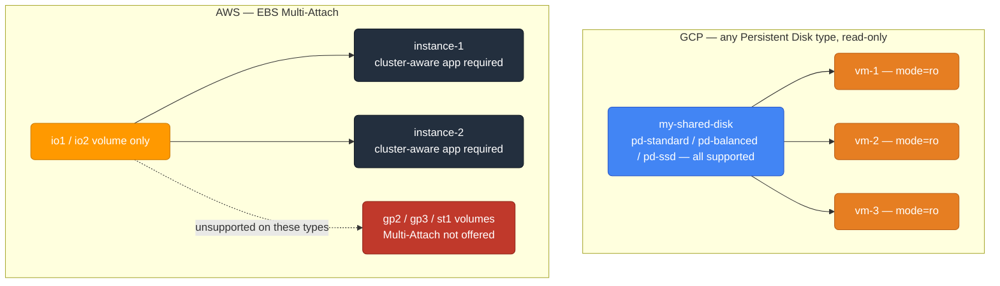
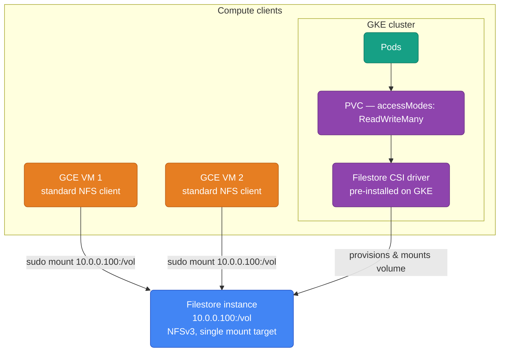
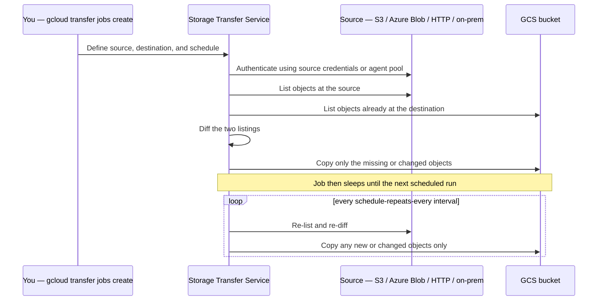

# GCP Storage

Object storage, block storage, and file storage — GCP equivalents to S3, EBS, and EFS.

<div class="quiz-progress" data-quiz-progress>
  <span class="quiz-progress-label">0/0 checks</span>
  <span class="quiz-progress-bar"><span class="quiz-progress-fill"></span></span>
</div>

---

## Storage Services Map

| Use case | AWS | GCP |
|----------|-----|-----|
| Object storage | S3 | **Cloud Storage (GCS)** |
| Block storage (VM disk) | EBS | **Persistent Disk / Hyperdisk** |
| Shared file system (NFS) | EFS | **Filestore** |
| Local NVMe (ephemeral) | Instance Store | **Local SSD** |
| Transfer acceleration | S3 Transfer Acceleration | **Storage Transfer Service** |
| Archival | S3 Glacier | **GCS Archive class** |
| Auto-tiering | S3 Intelligent-Tiering | **GCS Autoclass** |

---

## Cloud Storage (GCS)

GCS is GCP's S3. Globally consistent, durable (11 nines), and multi-region by default when you want it.

### Bucket Locations

| Type | Example | Availability | Cost |
|------|---------|-------------|------|
| **Region** | `us-central1` | Single region | Lowest |
| **Dual-region** | `NAM4` (Iowa+S.Carolina) | 2 regions, auto-replication | Medium |
| **Multi-region** | `US`, `EU`, `ASIA` | 3+ regions | Highest |



<div class="quiz-card">
  <p class="quiz-q">Your app serves one geographic market and never needs to survive a full-region outage. Which bucket location type minimizes cost and latency, and what are you giving up compared to dual-region?</p>
  <button class="quiz-reveal">Reveal answer</button>
  <div class="quiz-a" hidden>A single region — lowest price per the table, and the closest possible latency to that one area, since there's no cross-region replication happening in the background. What you give up is availability: a regional bucket has no built-in copy in a second location, so a full-region outage takes your data with it, unlike dual-region's auto-replicated second copy.</div>
</div>

```bash
# Create a regional bucket
gsutil mb -l us-central1 gs://my-unique-bucket-name

# Multi-region (equivalent to S3 Cross-Region Replication, but built-in)
gsutil mb -l US gs://my-multi-region-bucket

# Uniform bucket-level access (recommended — disables per-object ACLs, use IAM only)
gsutil uniformbucketlevelaccess set on gs://my-bucket
```

### Storage Classes

| Class | Min storage | Retrieval cost | Price/GB/mo | Use case |
|-------|------------|----------------|-------------|----------|
| **Standard** | None | None | $0.020 | Frequently accessed data |
| **Nearline** | 30 days | $0.01/GB | $0.010 | Monthly access (backups) |
| **Coldline** | 90 days | $0.02/GB | $0.004 | Quarterly access |
| **Archive** | 365 days | $0.05/GB | $0.0012 | Annual+ access (DR copies) |

The table above is the number reference; the tabs below are the "which one do I actually pick" reference — same four classes, but framed around what happens if you get the minimum-duration commitment wrong.

<div class="tab-group">
  <div class="tab-buttons">
    <button data-tab="standard" class="active">Standard</button>
    <button data-tab="nearline">Nearline</button>
    <button data-tab="coldline">Coldline</button>
    <button data-tab="archive">Archive</button>
  </div>
  <div class="tab-panels">
    <div class="tab-panel active" data-tab-panel="standard">
      <strong>No minimum storage duration, no retrieval fee.</strong> The default
      class for anything read or written more than about once a month: active
      application data, website assets, data a BigQuery/Dataflow job is
      currently chewing through. There's rarely a reason to pin an object here
      manually instead of letting Autoclass do it — Autoclass only costs you
      money if an object is genuinely hot the whole time.
      <pre><code>gsutil cp -c STANDARD local-file.txt gs://my-bucket/</code></pre>
    </div>
    <div class="tab-panel" data-tab-panel="nearline">
      <strong>30-day minimum storage duration, small per-GB retrieval fee.</strong>
      Sized for data touched about once a month — nightly/weekly backups,
      warm DR secondaries. Move or delete an object before day 30 and you're
      still billed for the remainder of that 30-day window: the minimum
      duration is a commitment, not a suggestion.
      <pre><code>gsutil rewrite -s nearline gs://my-bucket/large-file.parquet</code></pre>
    </div>
    <div class="tab-panel" data-tab-panel="coldline">
      <strong>90-day minimum, higher retrieval fee than Nearline.</strong>
      Quarterly-access data — compliance copies pulled once per audit cycle,
      analytics datasets that have gone cold but aren't dead. Same
      early-deletion math as Nearline, just a 90-day window instead of 30.
      <pre><code>gsutil rewrite -s coldline gs://my-bucket/quarterly-report.parquet</code></pre>
    </div>
    <div class="tab-panel" data-tab-panel="archive">
      <strong>365-day minimum, the highest retrieval fee — and still the
      cheapest class per GB stored.</strong> Annual-or-rarer access: long-term
      compliance retention, DR-of-DR copies, anything you sincerely hope to
      never read again. Deleting or moving one out inside a year still bills
      for the rest of the year.
      <pre><code>gsutil -o "GSUtil:default_project_id=my-project" cp \
  -Z -c ARCHIVE \
  large-backup.tar.gz gs://my-backup-bucket/</code></pre>
    </div>
  </div>
</div>

```bash
# Upload to specific storage class
gsutil -o "GSUtil:default_project_id=my-project" cp \
  -Z -c ARCHIVE \
  large-backup.tar.gz gs://my-backup-bucket/

# Change class of existing object
gsutil rewrite -s nearline gs://my-bucket/large-file.parquet
```

<div class="quiz-card">
  <p class="quiz-q">You upload a file straight to Archive with <code>-c ARCHIVE</code>, then delete it 10 days later. Are you only billed for those 10 days?</p>
  <button class="quiz-reveal">Reveal answer</button>
  <div class="quiz-a" hidden>No. Archive carries a 365-day minimum storage duration — deleting (or moving to another class) before that window closes still bills you for the remainder of the minimum, not just the days it actually sat there. The same mechanic applies to Nearline's 30-day and Coldline's 90-day minimums; only Standard has no minimum at all.</div>
</div>

### Autoclass — Automatic Tiering

GCS Autoclass automatically moves objects between Standard → Nearline → Coldline → Archive based on access patterns. Equivalent to S3 Intelligent-Tiering.



<div class="stepper">
  <div class="stepper-panels">
    <div class="stepper-panel active">
      <strong>1. Object lands in Standard.</strong> Every new object starts
      Standard regardless of how it's eventually going to be accessed —
      Autoclass only downgrades based on observed behavior, it never guesses
      up front.
    </div>
    <div class="stepper-panel">
      <strong>2. 30 days of no access → Nearline.</strong> Same day-count as
      Nearline's own minimum storage duration in the table above — Autoclass
      doesn't move an object earlier than the point where Nearline pricing
      would actually pay off.
    </div>
    <div class="stepper-panel">
      <strong>3. 90 more days of no access → Coldline, then 365 more → Archive.</strong>
      The clock resets after each transition, not from the object's original
      upload date — it's "days since last touched," compounding down the tier
      list one step at a time.
    </div>
    <div class="stepper-panel">
      <strong>4. Any read or write → back to Standard immediately.</strong>
      No waiting out a minimum duration first. Autoclass also waives the
      early-deletion fee for its own automatic transitions — the fee only
      applies when you manually move an object with <code>gsutil rewrite</code>
      before its minimum duration is up.
    </div>
  </div>
  <div class="stepper-controls">
    <button class="stepper-prev">← Prev</button>
    <span class="stepper-dots"></span>
    <span class="stepper-label"></span>
    <button class="stepper-next">Next →</button>
  </div>
</div>

```bash
gsutil buckets update gs://my-bucket --autoclass
```

<div class="quiz-card">
  <p class="quiz-q">An object has been sitting untouched in Coldline for months under an Autoclass-enabled bucket. Someone reads it today. What class is it in tomorrow, and do you eat an early-deletion fee for leaving Coldline before its 90-day minimum was up?</p>
  <button class="quiz-reveal">Reveal answer</button>
  <div class="quiz-a" hidden>It jumps straight back to Standard — Autoclass promotes on any read or write, with no minimum-duration wait first. And no, there's no early-deletion fee: that fee only applies to a manual class change (like <code>gsutil rewrite</code>) made before the minimum duration is up. Autoclass's own automatic transitions are exempt from it in both directions.</div>
</div>

### Basic Operations

```bash
# Upload
gsutil cp local-file.txt gs://my-bucket/path/file.txt

# Upload directory (recursive)
gsutil cp -r ./local-dir/ gs://my-bucket/prefix/

# Sync (like aws s3 sync)
gsutil rsync -r ./local-dir/ gs://my-bucket/prefix/
gsutil rsync -r -d gs://my-bucket/prefix/ ./local-dir/   # -d deletes destination files not in source

# Download
gsutil cp gs://my-bucket/path/file.txt ./local-file.txt

# List
gsutil ls gs://my-bucket/
gsutil ls -l gs://my-bucket/    # long format with sizes

# Delete
gsutil rm gs://my-bucket/path/file.txt
gsutil rm -r gs://my-bucket/prefix/    # recursive

# Signed URL (pre-signed URL equivalent — time-limited access)
gsutil signurl -d 1h -m GET service-account-key.json gs://my-bucket/file.txt
# Better: use Workload Identity and generate via SDK, not key files
```

### Access Control

```bash
# Grant read access to a service account (use IAM, not ACLs)
gcloud storage buckets add-iam-policy-binding gs://my-bucket \
  --member="serviceAccount:my-app@project.iam.gserviceaccount.com" \
  --role="roles/storage.objectViewer"

# Common storage IAM roles
# roles/storage.objectViewer      → read objects (not list bucket)
# roles/storage.objectUser        → read + write objects
# roles/storage.objectAdmin       → full object control
# roles/storage.admin             → bucket + object admin
# roles/storage.legacyBucketReader → list bucket (needed for gsutil ls)
```

### Lifecycle Rules

```json
{
  "rule": [
    {
      "action": {"type": "SetStorageClass", "storageClass": "NEARLINE"},
      "condition": {"age": 30, "matchesStorageClass": ["STANDARD"]}
    },
    {
      "action": {"type": "SetStorageClass", "storageClass": "COLDLINE"},
      "condition": {"age": 90}
    },
    {
      "action": {"type": "Delete"},
      "condition": {"age": 365}
    }
  ]
}
```

```bash
gsutil lifecycle set lifecycle.json gs://my-bucket
```

<div class="quiz-card">
  <p class="quiz-q">Rule 1 above only fires on objects that currently <code>matchesStorageClass: ["STANDARD"]</code>. Rule 2 has no <code>matchesStorageClass</code> condition at all — just <code>{"age": 90}</code>. What does omitting that filter actually do?</p>
  <button class="quiz-reveal">Reveal answer</button>
  <div class="quiz-a" hidden>It makes rule 2 age-only and class-agnostic — it fires on any object 90+ days old regardless of whether rule 1 already moved it to Nearline, or it never left Standard, or a human set it to something else entirely. Leaving out <code>matchesStorageClass</code> doesn't mean "no objects match," it means "every object matches, no matter its current class." That's why, by day 90, essentially everything in the bucket ends up in Coldline — not just the subset rule 1 touched.</div>
</div>

### Versioning

```bash
# Enable versioning (equivalent to S3 versioning)
gsutil versioning set on gs://my-bucket

# List all versions
gsutil ls -a gs://my-bucket/file.txt

# Restore a version
gsutil cp gs://my-bucket/file.txt#1234567890 gs://my-bucket/file.txt
```

<div class="quiz-card">
  <p class="quiz-q">You run <code>gsutil rm gs://my-bucket/file.txt</code> on a bucket with versioning on. Is the data actually gone?</p>
  <button class="quiz-reveal">Reveal answer</button>
  <div class="quiz-a" hidden>No — deleting (or overwriting) the live object just retires it to a noncurrent, generation-numbered copy instead of erasing it. It's still fetchable exactly like the restore example above, <code>gs://my-bucket/file.txt#1234567890</code>, until a lifecycle rule or an explicit delete-by-generation actually removes it. "Deleted" only means "no longer the live version" while versioning is on.</div>
</div>

---

## Persistent Disk (Block Storage)

Persistent Disk is GCP's EBS — network-attached block storage for GCE VMs.

### Disk Types

| Type | Max IOPS | Max throughput | Price/GB/mo | AWS analog |
|------|---------|---------------|-------------|-----------|
| `pd-standard` | 3,000 IOPS/TB | 0.12 MB/s/GB | $0.040 | gp2 (old) |
| `pd-balanced` | 3,000 IOPS/TB | 0.28 MB/s/GB | $0.100 | gp3 |
| `pd-ssd` | 30,000 IOPS | 0.48 MB/s/GB | $0.170 | io1/io2 |
| `pd-extreme` | 120,000 IOPS | Custom | $0.220 | io2 Block Express |
| `hyperdisk-balanced` | 160,000 IOPS | Configurable | $0.120 | io2 Express |
| `hyperdisk-throughput` | 3,000 IOPS | 2,400 MB/s | $0.080 | Throughput-optimized |

```bash
# Create and attach a disk
gcloud compute disks create my-data-disk \
  --zone=us-central1-a \
  --size=200GB \
  --type=pd-ssd

gcloud compute instances attach-disk my-vm \
  --disk=my-data-disk \
  --device-name=data \
  --zone=us-central1-a

# Inside VM: format and mount
sudo mkfs.ext4 -m 0 -E lazy_itable_init=0,lazy_journal_init=0,discard /dev/disk/by-id/google-data
sudo mkdir -p /mnt/data
sudo mount /dev/disk/by-id/google-data /mnt/data

# Resize a disk online (no reboot needed — unlike AWS)
gcloud compute disks resize my-data-disk \
  --size=400GB \
  --zone=us-central1-a
# Then grow filesystem online:
sudo resize2fs /dev/disk/by-id/google-data
```

<div class="quiz-card">
  <p class="quiz-q">You run <code>gcloud compute disks resize</code> to grow a disk from 200GB to 400GB while the VM keeps serving traffic. Can the application immediately use the extra 200GB?</p>
  <button class="quiz-reveal">Reveal answer</button>
  <div class="quiz-a" hidden>Not yet. The resize itself needs no reboot — that's the win over some AWS setups — but it only grows the underlying block device. The filesystem sitting on top (ext4, XFS, etc.) still has its own idea of how big the disk is until something tells it otherwise, which is exactly what the follow-up <code>resize2fs</code> call does. Skip that step and the extra capacity is provisioned and billed, but invisible to anything reading the mounted filesystem.</div>
</div>

### Multi-Reader Disks

A PD disk can be attached to multiple VMs in **read-only mode**. Useful for shared datasets (ML model weights, reference data).

```bash
# Attach same disk to multiple VMs in read-only mode
gcloud compute instances attach-disk vm-1 --disk=my-shared-disk --mode=ro --zone=us-central1-a
gcloud compute instances attach-disk vm-2 --disk=my-shared-disk --mode=ro --zone=us-central1-a
gcloud compute instances attach-disk vm-3 --disk=my-shared-disk --mode=ro --zone=us-central1-a
```



AWS EBS multi-attach is only supported on io1/io2 and only for cluster-aware applications. GCP PD read-only multi-attach works for any disk type.

<div class="quiz-card">
  <p class="quiz-q">What does GCP trade off to let PD multi-attach work on any disk type, where AWS restricts EBS Multi-Attach to io1/io2 and cluster-aware apps?</p>
  <button class="quiz-reveal">Reveal answer</button>
  <div class="quiz-a" hidden>Write access. GCP drops the disk-type and application-awareness restrictions but only for read-only mounts (<code>--mode=ro</code>) — every attached VM gets the same point-in-time-consistent read access, none can write. AWS keeps write access on the table but pays for it with a narrower disk-type list and a requirement that the application itself handle concurrent-write coordination.</div>
</div>

### Disk Snapshots

```bash
# Manual snapshot (= EBS snapshot)
gcloud compute disks snapshot my-data-disk \
  --snapshot-names=my-data-disk-snap-$(date +%Y%m%d) \
  --zone=us-central1-a

# Restore from snapshot
gcloud compute disks create restored-disk \
  --source-snapshot=my-data-disk-snap-20240115 \
  --zone=us-central1-a

# Scheduled snapshots (= Data Lifecycle Manager in AWS)
gcloud compute resource-policies create snapshot-schedule daily-backup \
  --region=us-central1 \
  --max-retention-days=7 \
  --on-source-disk-delete=keep-auto-snapshots \
  --daily-schedule \
  --start-time=04:00

gcloud compute disks add-resource-policies my-data-disk \
  --resource-policies=daily-backup \
  --zone=us-central1-a
```

---

## Local SSD

Local NVMe drives physically attached to the server. Much faster than Persistent Disk, but **ephemeral** — data is lost on VM stop/restart. Like AWS instance store.

```bash
# Attach local SSD at instance creation (can't attach after)
gcloud compute instances create my-vm \
  --machine-type=n2-standard-8 \
  --local-ssd=interface=nvme    # 375 GB per SSD

# Multiple local SSDs (can be striped for more throughput)
gcloud compute instances create my-vm \
  --machine-type=n2-standard-16 \
  --local-ssd=interface=nvme \
  --local-ssd=interface=nvme    # 750 GB total
```

Use cases: temp files, shuffle space for batch jobs, buffer layers on top of Persistent Disk.

<div class="quiz-card">
  <p class="quiz-q">A batch job writes its shuffle data to Local SSD for the throughput. Midway through, the VM is stopped and restarted (not just rebooted from inside the guest OS). What happens to that shuffle data?</p>
  <button class="quiz-reveal">Reveal answer</button>
  <div class="quiz-a" hidden>It's gone. Local SSD is physically attached NVMe tied to that specific host — a VM stop/restart cycle is exactly the ephemeral boundary the name warns about, the same as AWS instance store. A Persistent Disk holding the same data would have survived, because it's network-attached and independent of any single VM's lifecycle.</div>
</div>

---

## Filestore (Managed NFS)

Filestore is GCP's EFS — managed NFS server for shared file access across multiple VMs or GKE pods.



### Filestore Tiers

| Tier | Capacity | IOPS | Use case | AWS analog |
|------|---------|------|----------|-----------|
| **Basic HDD** | 1-63.9 TB | 600/TB | Dev/test | EFS IA |
| **Basic SSD** | 2.5-63.9 TB | 30,000 | Production web/content | EFS General |
| **Enterprise** | 1-10 TB | 120,000 | Databases, high-perf | EFS Max I/O |
| **Zonal** | 1-9.75 TB | 80,000 | Single-zone, lower cost | EFS Standard |

```bash
# Create Filestore instance
gcloud filestore instances create my-nfs \
  --zone=us-central1-a \
  --tier=BASIC_SSD \
  --file-share=name=vol,capacity=2.5TB \
  --network=name=my-vpc

# Mount on VM
sudo apt-get install nfs-common
sudo mkdir /mnt/shared
sudo mount 10.0.0.100:/vol /mnt/shared

# Mount in GKE (via CSI driver)
# StorageClass is pre-installed on GKE
```

```yaml
# PVC for Filestore in GKE
apiVersion: v1
kind: PersistentVolumeClaim
metadata:
  name: my-nfs-pvc
spec:
  accessModes:
    - ReadWriteMany     # multiple pods can mount simultaneously
  storageClassName: standard-rwx   # uses Filestore CSI driver
  resources:
    requests:
      storage: 2560Gi
```

<div class="quiz-card">
  <p class="quiz-q">You're standing up a shared volume for a dev/test environment where cost matters far more than throughput. Which tier fits, and why would picking it for a production database be a mistake?</p>
  <button class="quiz-reveal">Reveal answer</button>
  <div class="quiz-a" hidden>Basic HDD — it's explicitly the dev/test row in the table, and the cheapest. The mistake in production is IOPS: Basic HDD tops out at 600/TB, versus 30,000 for Basic SSD or 120,000 for Enterprise. A database workload that needs Enterprise-tier IOPS but is provisioned on Basic HDD "to save cost" will bottleneck on storage long before it bottlenecks on anything else.</div>
</div>

---

## Storage Transfer Service

Move data into GCS from S3, Azure Blob, HTTP, on-prem. Equivalent to AWS DataSync or S3 Transfer Acceleration (for migration).



<div class="stepper">
  <div class="stepper-panels">
    <div class="stepper-panel active">
      <strong>1. Define the job.</strong> Source (S3, Azure Blob, HTTP, or
      on-prem), destination GCS bucket, and optionally a repeat schedule like
      <code>--schedule-repeats-every=24h</code>.
    </div>
    <div class="stepper-panel">
      <strong>2. Authenticate to the source.</strong> This is a pull, not a
      push — GCP reaches out to the source, so the job needs read credentials
      for it (<code>--source-creds-file</code> for S3) or, for an on-prem
      source, an agent pool it can reach over the network
      (<code>--source-agent-pool</code>).
    </div>
    <div class="stepper-panel">
      <strong>3. List and diff.</strong> Before copying a single byte, the
      job lists what's already sitting in the destination bucket and compares
      it against the source listing.
    </div>
    <div class="stepper-panel">
      <strong>4. Copy only what's different.</strong> Just the new or changed
      objects transfer — not a full re-copy of everything, every time.
    </div>
    <div class="stepper-panel">
      <strong>5. Repeat on schedule.</strong> If a repeat interval was set,
      the whole list → diff → copy cycle runs again automatically without
      anyone re-triggering it.
    </div>
  </div>
  <div class="stepper-controls">
    <button class="stepper-prev">← Prev</button>
    <span class="stepper-dots"></span>
    <span class="stepper-label"></span>
    <button class="stepper-next">Next →</button>
  </div>
</div>

```bash
# Create a transfer job from S3 to GCS
gcloud transfer jobs create \
  --source-agent-pool="" \
  --source-creds-file=aws-creds.json \
  --source=s3://my-aws-bucket/ \
  --destination=gs://my-gcp-bucket/ \
  --schedule-repeats-every=24h
```

<div class="quiz-card">
  <p class="quiz-q">The job above points at <code>--source-creds-file=aws-creds.json</code> rather than any GCP-side setting for reading from S3. What does that tell you about which side initiates the transfer, and what you need to configure where?</p>
  <button class="quiz-reveal">Reveal answer</button>
  <div class="quiz-a" hidden>Storage Transfer Service pulls — GCP reaches out to S3, not the other way around — so the credentials it needs are read credentials for the source, supplied to the GCP-side job. Nothing needs to be configured on the S3 bucket itself beyond granting that identity read access. For an on-prem source there's no public endpoint to pull from directly, which is exactly why that case needs a source agent pool instead.</div>
</div>

---

## GCS vs S3 — Key Differences

| | GCP Cloud Storage | AWS S3 |
|--|---|---|
| **Consistency** | Strong consistency (always) | Strong consistency (since 2020) |
| **Storage classes** | Standard/Nearline/Coldline/Archive | Standard/IA/Glacier/Deep Archive |
| **Auto-tiering** | Autoclass | Intelligent-Tiering |
| **Multi-region** | US/EU/ASIA built-in | Cross-Region Replication (separate config) |
| **Access control** | Uniform (IAM) or fine-grained (ACLs) | Bucket policies + ACLs |
| **Signed URLs** | `gsutil signurl` or client library | `aws s3 presign` |
| **Event notifications** | Pub/Sub, Eventarc | S3 Events → SNS/SQS/Lambda |
| **Versioning** | Yes | Yes |
| **Lifecycle rules** | Yes | Yes |
| **Replication** | Turbo Replication (dual-region) | CRR/SRR |
| **CLI** | `gsutil` or `gcloud storage` | `aws s3` |

<div class="quiz-card">
  <p class="quiz-q">A team designs read-after-write workarounds for S3 because "object storage is eventually consistent." Per the table, are they right today, and does GCS need the same workaround?</p>
  <button class="quiz-reveal">Reveal answer</button>
  <div class="quiz-a" hidden>They're working from an outdated mental model — S3 has been strongly consistent since 2020, so that workaround is no longer necessary there either. The real difference is only historical: GCS has been strongly consistent from day one and never needed the caveat, while S3 carried it for years before closing the gap. Functionally, both are the same today.</div>
</div>

```bash
# New gcloud storage CLI (faster than gsutil for large transfers)
gcloud storage cp local-file.txt gs://my-bucket/
gcloud storage ls gs://my-bucket/
gcloud storage rm gs://my-bucket/file.txt
```
