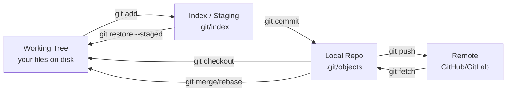
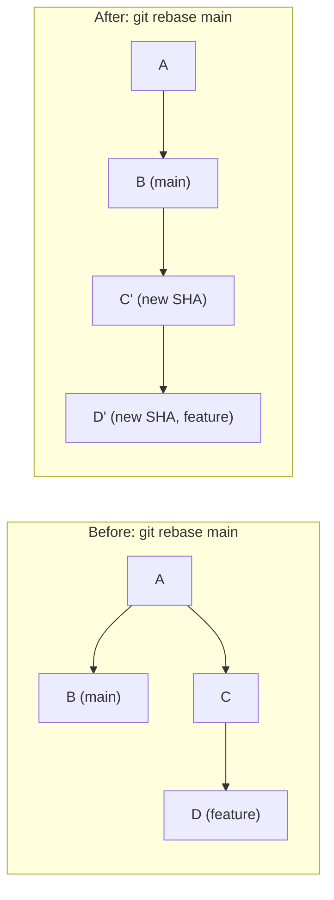
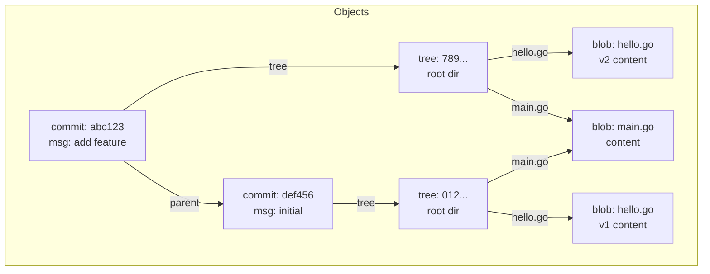
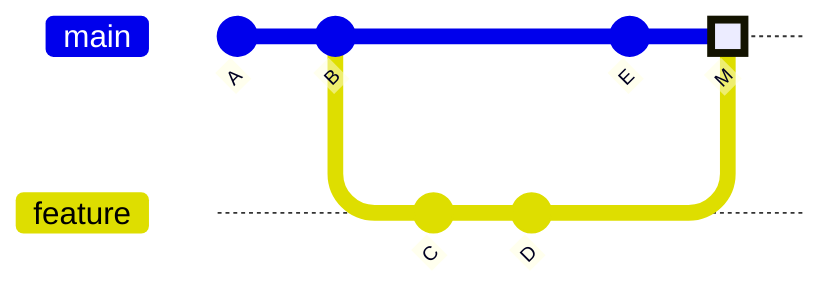

# Git Internals

A working map of what's actually happening under `.git/` — objects, refs, the index, pack files, and the merge/rebase machinery built on top of them. Most sections below end with a quick knowledge check; track your progress as you go:

<div class="quiz-progress" data-quiz-progress>
  <span class="quiz-progress-label">0/0 checks</span>
  <span class="quiz-progress-bar"><span class="quiz-progress-fill"></span></span>
</div>

---

## 1. Object Model

Git stores everything as **content-addressed objects** in `.git/objects/`. Four types:

| Object | Contains | Created by |
|---|---|---|
| **blob** | raw file content (no name/path) | `git add` |
| **tree** | directory listing: mode + name + SHA → blob/tree | `git commit` |
| **commit** | tree SHA + parent SHA(s) + author + message | `git commit` |
| **tag** | annotated tag: object SHA + tagger + message | `git tag -a` |

**Content-addressed**: SHA = `sha1(type + space + size + \0 + content)`. Same content = same SHA always.

```
SHA-1: 40 hex chars (160-bit). Legacy, still default.
SHA-256: 64 hex chars (256-bit). Enable with: git init --object-format=sha256
```

Storage: `.git/objects/ab/cdef1234...` — first 2 chars = directory, rest = filename.

```bash
# Inspect any object
git cat-file -t <sha>      # type
git cat-file -p <sha>      # pretty-print content

# Example:
git cat-file -p HEAD       # shows commit object
git cat-file -p HEAD^{tree} # shows root tree
git ls-tree HEAD            # list tree entries
```

<div class="quiz-card">
  <p class="quiz-q">Git says "same content = same SHA always." Why is that a feature, not a bug — and what does <code>git cat-file -t</code> return for an annotated tag ref vs a lightweight tag ref?</p>
  <button class="quiz-reveal">Reveal answer</button>
  <div class="quiz-a" hidden>Content-addressing means Git never stores duplicate data: if two files have identical bytes they share one blob object. It also acts as a built-in integrity check — any bit corruption changes the SHA and makes the object unreadable. For tags: <code>git cat-file -t</code> on an <strong>annotated tag ref</strong> returns <code>tag</code> (Git created a tag object wrapping the commit). On a <strong>lightweight tag ref</strong> it returns <code>commit</code>, because a lightweight tag is just a ref file pointing directly at the commit SHA — no object was created.</div>
</div>

---

## 2. Working Tree → Index → Local Repo → Remote



| Command | Transition |
|---|---|
| `git add` | working tree → index |
| `git commit` | index → local repo |
| `git push` | local repo → remote |
| `git fetch` | remote → local repo (FETCH_HEAD) |
| `git pull` | fetch + merge/rebase |
| `git checkout / restore` | local repo / index → working tree |

<div class="quiz-card">
  <p class="quiz-q">What does <code>git pull</code> actually do under the hood? And what does <code>git restore --staged &lt;file&gt;</code> affect — the working tree, the index, or the local repo?</p>
  <button class="quiz-reveal">Reveal answer</button>
  <div class="quiz-a" hidden><code>git pull</code> is a two-step operation: first <code>git fetch</code> (copies objects from the remote into <code>.git/objects</code> and updates remote-tracking refs like <code>origin/main</code>), then either <code>git merge</code> or <code>git rebase</code> depending on your configuration. It is <strong>not</strong> atomic. <code>git restore --staged &lt;file&gt;</code> affects the <strong>index</strong> only: it copies the version of that file from the last commit (HEAD) back into the staging area, un-staging the change. The working tree file is left untouched.</div>
</div>

---

## 3. Refs

Refs are files in `.git/refs/` containing a SHA (or another ref for symbolic refs).

| Ref | Location | Meaning |
|---|---|---|
| `HEAD` | `.git/HEAD` | current branch or detached commit |
| `main` | `.git/refs/heads/main` | tip of main branch |
| `origin/main` | `.git/refs/remotes/origin/main` | last known remote tip |
| `ORIG_HEAD` | `.git/ORIG_HEAD` | pre-merge/rebase HEAD (for undo) |
| `FETCH_HEAD` | `.git/FETCH_HEAD` | last fetched SHA |
| `MERGE_HEAD` | `.git/MERGE_HEAD` | SHA being merged (during merge) |

**HEAD** is a symbolic ref: `ref: refs/heads/main`. In detached state it contains a raw SHA.

**Lightweight tag**: just a ref pointing to a commit SHA. No object created.  
**Annotated tag**: creates a tag object (has tagger, message, signature). Points to commit.

```bash
git tag v1.0              # lightweight
git tag -a v1.0 -m "msg"  # annotated (creates tag object)
git cat-file -t v1.0      # "commit" vs "tag"
```

<div class="quiz-card">
  <p class="quiz-q">What does <code>.git/HEAD</code> contain in normal state vs detached HEAD state? And what is <code>ORIG_HEAD</code> used for?</p>
  <button class="quiz-reveal">Reveal answer</button>
  <div class="quiz-a" hidden>In <strong>normal state</strong>, <code>.git/HEAD</code> is a symbolic ref — the literal string <code>ref: refs/heads/main</code> (or whichever branch is checked out). Git resolves it to a SHA by reading that branch file. In <strong>detached HEAD state</strong>, <code>.git/HEAD</code> contains a raw 40-character SHA — there is no branch pointer, so new commits are unreachable from any ref and will be lost when you switch away. <code>ORIG_HEAD</code> is written by commands that make large, potentially dangerous moves — <code>git merge</code>, <code>git rebase</code>, <code>git reset</code> — recording where HEAD was <em>before</em> the operation so you can undo with <code>git reset --hard ORIG_HEAD</code>.</div>
</div>

---

## 4. Pack Files

**Loose objects**: one file per object. Fine for small repos.  
**Pack files**: Git bundles objects together for efficiency.

```
git gc                          → pack loose objects
git gc --aggressive             → more compression
git count-objects -v            → see loose vs packed counts
```

Pack format:
- `.git/objects/pack/pack-<sha>.pack` — the objects (delta-compressed)
- `.git/objects/pack/pack-<sha>.idx`  — index for fast lookup by SHA

Delta compression: similar objects stored as base + delta. A file's history stores diffs, not full copies. Git stores the **newest version** as the base and older versions as deltas (reverse delta).

```bash
git verify-pack -v .git/objects/pack/pack-*.idx | sort -k3 -n | tail -10
# Shows largest objects in pack by size
```

<div class="quiz-card">
  <p class="quiz-q">Git pack files use delta compression and store the <strong>newest</strong> version of a file as the base, reconstructing older versions as deltas from it. Why not the other way around?</p>
  <button class="quiz-reveal">Reveal answer</button>
  <div class="quiz-a" hidden>The most-accessed version of a file is almost always the <strong>current (newest) one</strong> — <code>git checkout HEAD</code>, <code>git diff</code>, and <code>git log -p</code> all need it constantly. If the newest version were stored as a chain of deltas, every access would require replaying the entire history chain, which is slow. By storing the newest version verbatim as the base and expressing older versions as reverse deltas, Git keeps the most common read path fast: HEAD is instantly available, and historical versions — accessed rarely — pay the reconstruction cost instead.</div>
</div>

---

## 5. Index (Staging Area) Internals

The index is a **binary file** at `.git/index`. It is a snapshot of the working tree ready for the next commit.

Each entry contains:
- file mode, UID/GID, file size, mtime
- SHA of the blob
- file path (relative to repo root)
- flags (merge stage: 0=normal, 1/2/3=conflict stages)

```bash
git ls-files --stage          # dump index entries
git ls-files -u               # show conflict (unmerged) entries
```

During a merge conflict, the index holds **3 stages** for conflicted files:
- Stage 1: common ancestor (base)
- Stage 2: ours (HEAD)
- Stage 3: theirs (MERGE_HEAD)

<div class="quiz-card">
  <p class="quiz-q">During a merge conflict, the index holds 3 stages for a conflicted file. What does each stage represent, and when do these stages appear?</p>
  <button class="quiz-reveal">Reveal answer</button>
  <div class="quiz-a" hidden>The three stages appear in the index whenever Git cannot automatically resolve a conflict. <strong>Stage 1</strong> is the common ancestor (the merge base — what the file looked like before either branch changed it). <strong>Stage 2</strong> is <em>ours</em> — the version from HEAD (the branch you are merging into). <strong>Stage 3</strong> is <em>theirs</em> — the version from the incoming branch (MERGE_HEAD). All three are stored simultaneously so you or a merge tool can see the full context. Once you resolve and <code>git add</code> the file, Git collapses it back to stage 0 (normal). Inspect them with <code>git ls-files -u</code>, or pick a side directly with <code>git checkout --ours / --theirs</code>.</div>
</div>

---

## 6. Merge vs Rebase Internals

### 3-Way Merge

Git finds the **merge base** (common ancestor commit), then applies changes from both branches:

```
merge base = git merge-base branch1 branch2
```

If the same lines changed in both → conflict. Git writes conflict markers to the working tree.

**Fast-forward merge**: when no divergence exists (one branch is an ancestor of the other). HEAD pointer just moves forward. No merge commit created.

```bash
git merge --ff-only feature   # fail if not fast-forwardable
git merge --no-ff feature     # always create merge commit
```

### Rebase Internals

Rebase **replays commits** one by one onto a new base:



<div class="stepper">
  <div class="stepper-panels">
    <div class="stepper-panel active">
      <strong>1. Find Common Ancestor.</strong> Git runs <code>git merge-base feature main</code> to locate commit A — the point where both branches last shared history. This is the anchor for the entire replay.
    </div>
    <div class="stepper-panel">
      <strong>2. Extract Patches.</strong> Git calculates the diff for each commit on the feature branch since the common ancestor (C-diff, D-diff). These patches represent changes independently of which commit they came from.
    </div>
    <div class="stepper-panel">
      <strong>3. Reset to New Base.</strong> Git moves the feature branch pointer to the new base with <code>git reset --hard main</code>, landing on commit B. The working tree now matches <code>main</code>.
    </div>
    <div class="stepper-panel">
      <strong>4. Apply Patches.</strong> Each patch is applied one at a time onto the new base. C-diff is applied to B, creating commit C'. Even if the diff is identical to C, the parent SHA changed — so the commit SHA changes too.
    </div>
    <div class="stepper-panel">
      <strong>5. New SHAs.</strong> Every replayed commit gets a new SHA because its parent pointer differs from the original. D-diff becomes D'. The feature branch now points to D', sitting cleanly on top of <code>main</code>.
    </div>
  </div>
  <div class="stepper-controls">
    <button class="stepper-prev">← Prev</button>
    <span class="stepper-dots"></span>
    <span class="stepper-label"></span>
    <button class="stepper-next">Next →</button>
  </div>
</div>

**Step by step:**
1. `git merge-base feature main` → finds A (common ancestor)
2. Extract patches: C-diff, D-diff
3. `git reset --hard main` → move feature to B
4. Apply C-diff → creates C' (new SHA, different parent = different hash)
5. Apply D-diff → creates D' (new SHA)

**Conflict during rebase:**
```bash
git rebase main
# CONFLICT (content): Merge conflict in src/handler.go
# Fix conflict in editor, then:
git add src/handler.go
git rebase --continue   # applies next commit
# OR:
git rebase --skip       # skip this commit entirely
# OR:
git rebase --abort      # abandon, restore original branch
```

**Interactive rebase — rewrite history before pushing:**
```bash
git rebase -i HEAD~4   # last 4 commits
# Editor opens showing:
# pick a1b2c3 add feature X
# pick d4e5f6 fix typo
# pick g7h8i9 wip
# pick j0k1l2 final cleanup
#
# Commands: pick, squash (s), fixup (f), reword (r), edit (e), drop (d)
# Squash d4e5f6 into a1b2c3:
# pick a1b2c3 add feature X
# squash d4e5f6 fix typo     ← merged into previous, keeps both messages
# fixup g7h8i9 wip           ← merged into previous, discards this message
# reword j0k1l2 final cleanup ← prompts to edit message
```

**`--onto` — transplant commits to a different base:**
```bash
# Move commits that are on feature but NOT on bugfix, onto main
git rebase --onto main bugfix feature
# Before: main ← bugfix ← feature
# After:  main ← feature' (bugfix commits dropped)
# Use case: feature was accidentally branched from bugfix, not main
```

**Key rule:** `git rebase` rewrites SHAs. Never rebase commits that have been pushed to a shared remote branch — it will require force push and break everyone else's history.

<div class="quiz-card">
  <p class="quiz-q">Why does rebasing rewrite commit SHAs even when the code change (diff) is identical to the original? And what is the golden rule about rebasing commits on shared branches?</p>
  <button class="quiz-reveal">Reveal answer</button>
  <div class="quiz-a" hidden>A commit SHA is computed from the diff <em>and</em> the parent SHA, author, timestamp, and message. When you rebase, the replayed commit has a different parent (the new base commit) — so even if the diff, author, and message are byte-for-byte identical, the SHA is different. The golden rule: <strong>never rebase commits already pushed to a shared remote branch.</strong> Others have built work on top of those SHAs. Rewriting them means your history and theirs diverge, requiring a force push that replaces remote history — and anyone who has pulled will have an incompatible history, causing conflicts and confusion on their next push or pull.</div>
</div>

---

## 7. Reflog

The reflog records every movement of a ref (HEAD, branches). It is **local only** and expires after 90 days by default.

```bash
git reflog                    # HEAD reflog
git reflog show main          # main branch reflog
git reflog --all              # all refs
```

### Recover Deleted Branch

```bash
# 1. Find the SHA of the deleted branch tip
git reflog | grep "branch-name"
# or: git log --walk-reflogs --oneline

# 2. Recreate the branch
git checkout -b branch-name <sha>
# or: git branch branch-name <sha>
```

### Recover Deleted Commits (reset --hard undo)

```bash
git reflog                    # find SHA before reset
git reset --hard <sha>        # restore HEAD to that point
# or: git checkout -b recovery <sha>
```

<div class="quiz-card">
  <p class="quiz-q">Can <code>git reflog</code> recover commits that were <strong>never pushed</strong> to any remote? What is the default expiry for reflog entries?</p>
  <button class="quiz-reveal">Reveal answer</button>
  <div class="quiz-a" hidden>Yes — <code>git reflog</code> records every movement of HEAD and branch pointers locally, regardless of whether those commits were ever pushed. If you committed work and then did <code>git reset --hard</code> or deleted the branch, the commits still exist in <code>.git/objects</code> and the reflog still points to them. Recover them by finding the SHA in the reflog and creating a new branch: <code>git checkout -b recovery &lt;sha&gt;</code>. The default expiry is <strong>90 days</strong> (configurable via <code>gc.reflogExpire</code>). After expiry, <code>git gc</code> can prune unreachable objects permanently. The reflog is <strong>local only</strong> — it is never pushed to or shared with the remote.</div>
</div>

---

## Object DAG & Commit Graph




