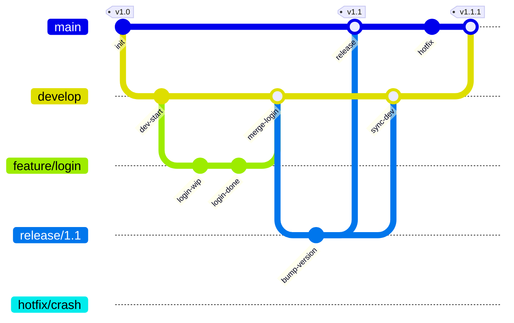
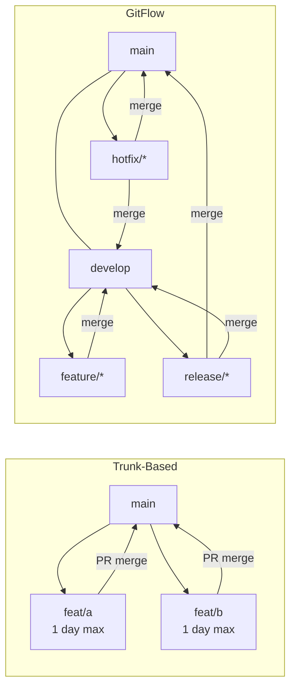

# Git Workflows

A field guide to branching models, release flows, and the conventions that keep a shared git history sane — trunk-based development, GitHub Flow, and GitFlow side by side, plus the everyday mechanics: monorepos, branch protection, commit conventions, and merge strategies.

Most sections below end with a quick knowledge check — try answering before revealing:

<div class="quiz-progress" data-quiz-progress>
  <span class="quiz-progress-label">0/0 checks</span>
  <span class="quiz-progress-bar"><span class="quiz-progress-fill"></span></span>
</div>

## 1. Workflow Comparison

| | Trunk-Based | GitHub Flow | GitFlow |
|---|---|---|---|
| **Main branches** | `main` only | `main` | `main` + `develop` |
| **Feature branches** | short-lived (< 1 day) | any length | feature/* |
| **Release process** | continuous deploy | deploy on merge | release/* branch |
| **Hotfix** | fix on trunk | fix on main | hotfix/* branch |
| **Complexity** | low | low | high |
| **Best for** | CI/CD, small teams | SaaS / web apps | versioned releases |
| **Merge to main** | direct / tiny PR | PR only | via develop only |
| **History** | linear, clean | linear | complex merge graph |

A quick way to feel the difference: how does code actually get from a laptop into `main`?

<div class="tab-group">
  <div class="tab-buttons">
    <button data-tab="trunk" class="active">Trunk-Based</button>
    <button data-tab="ghflow">GitHub Flow</button>
    <button data-tab="gitflow">GitFlow</button>
  </div>
  <div class="tab-panels">
    <div class="tab-panel active" data-tab-panel="trunk">
      Everyone commits straight to <code>main</code>, daily. Feature branches exist but live less than a day, and incomplete work ships behind a feature flag instead of waiting on a long-lived branch. Merges to main are direct or via a tiny PR. Best for CI/CD shops and small teams that deploy continuously.
    </div>
    <div class="tab-panel" data-tab-panel="ghflow">
      One branch per change, any length, always through a PR into <code>main</code>. Merging to <code>main</code> is what triggers the deploy. Simple and linear &mdash; the default choice for SaaS and web apps that deploy on every merge.
    </div>
    <div class="tab-panel" data-tab-panel="gitflow">
      Two long-lived branches, <code>main</code> and <code>develop</code>, plus <code>feature/*</code>, <code>release/*</code>, and <code>hotfix/*</code> around them. Nothing reaches <code>main</code> except via <code>develop</code> (or a hotfix). More moving parts and a more complex merge graph, but built for projects that ship versioned releases rather than deploying continuously.
    </div>
  </div>
</div>

<div class="quiz-card">
  <p class="quiz-q">Under Trunk-Based Development, is it normal for a feature branch to stay open for several days while it's reviewed?</p>
  <button class="quiz-reveal">Reveal answer</button>
  <div class="quiz-a" hidden>No &mdash; trunk-based feature branches are meant to live less than a day. Long review cycles are what GitHub Flow ("any length") and GitFlow (<code>feature/*</code>) are built for; trunk-based instead merges fast and hides unfinished work behind a feature flag.</div>
</div>

---

## 2. GitFlow

Five branch types:

| Branch | Purpose | Branches from | Merges into |
|---|---|---|---|
| `main` | production code, tags | — | — |
| `develop` | integration branch | `main` | — |
| `feature/*` | new features | `develop` | `develop` |
| `release/*` | release prep, bugfixes | `develop` | `main` + `develop` |
| `hotfix/*` | urgent prod fixes | `main` | `main` + `develop` |

```bash
# Feature
git checkout -b feature/login develop
# ... work ...
git checkout develop && git merge --no-ff feature/login

# Release
git checkout -b release/1.2 develop
# ... bump version, fix bugs ...
git checkout main && git merge --no-ff release/1.2
git tag -a v1.2
git checkout develop && git merge --no-ff release/1.2

# Hotfix
git checkout -b hotfix/fix-crash main
git checkout main && git merge --no-ff hotfix/fix-crash
git tag -a v1.1.1
git checkout develop && git merge --no-ff hotfix/fix-crash
```



The release branch's lifecycle, step by step:

<div class="stepper">
  <div class="stepper-panels">
    <div class="stepper-panel active">
      <strong>1. Branch.</strong> Cut <code>release/1.2</code> from <code>develop</code> once everything planned for the release has landed there.
    </div>
    <div class="stepper-panel">
      <strong>2. Stabilize.</strong> Only version bumps and bugfixes land on the release branch now &mdash; no new features.
    </div>
    <div class="stepper-panel">
      <strong>3. Ship.</strong> Merge the release branch into <code>main</code> and tag it (<code>v1.2</code>). That tag is what actually goes to production.
    </div>
    <div class="stepper-panel">
      <strong>4. Sync back.</strong> Merge the same release branch into <code>develop</code> too, so the version bump and any release-branch bugfixes aren't lost from ongoing development.
    </div>
  </div>
  <div class="stepper-controls">
    <button class="stepper-prev">← Prev</button>
    <span class="stepper-dots"></span>
    <span class="stepper-label"></span>
    <button class="stepper-next">Next →</button>
  </div>
</div>

<div class="quiz-card">
  <p class="quiz-q">When a <code>release/*</code> branch finishes in GitFlow, which branch (or branches) does it merge into?</p>
  <button class="quiz-reveal">Reveal answer</button>
  <div class="quiz-a" hidden>Both &mdash; <code>main</code> (tagged as the release) and <code>develop</code>. Merging into <code>main</code> alone would ship the version bump and any release-branch bugfixes to production but leave them missing from ongoing development.</div>
</div>

---

## 3. Trunk-Based Development

All developers commit to `main` (trunk) daily. Feature branches live < 1–2 days.

**Key practices:**
- **Feature flags**: merge incomplete code behind a flag, enable in production when ready
- **Branch by abstraction**: refactor in place without long-lived branches
- **CI gates**: tests must pass before merge; no broken trunk ever

```bash
# Short-lived feature branch
git checkout -b feat/add-cache
# ... small focused change ...
git push origin feat/add-cache
# PR → review → merge same day
```

**Feature flags** (Go example):
```go
var featureFlags = map[string]bool{
    "new-checkout": os.Getenv("FF_NEW_CHECKOUT") == "true",
}

if featureFlags["new-checkout"] {
    return newCheckoutFlow(ctx, cart)
}
return legacyCheckoutFlow(ctx, cart)
```

<div class="quiz-card">
  <p class="quiz-q">Is it safe to merge unfinished code for <code>new-checkout</code> straight to <code>main</code> before the feature is done?</p>
  <button class="quiz-reveal">Reveal answer</button>
  <div class="quiz-a" hidden>Yes &mdash; that's the point of a feature flag. The incomplete code merges to trunk behind a flag that's off by default, so trunk never breaks; the feature only goes live in production once <code>FF_NEW_CHECKOUT</code> is flipped on, no separate long-lived branch required.</div>
</div>

---

## 4. GitHub Flow

Simplest workflow for teams with continuous deployment:

1. `main` is always deployable
2. Create a descriptive branch from `main`
3. Push commits, open a PR early (Draft PR for WIP)
4. Review, CI checks, iterate
5. Merge to `main` → auto-deploy

<div class="stepper">
  <div class="stepper-panels">
    <div class="stepper-panel active">
      <strong>1. Always deployable.</strong> <code>main</code> is expected to be production-ready at every commit.
    </div>
    <div class="stepper-panel">
      <strong>2. Branch.</strong> Create a descriptive branch off <code>main</code> for the change.
    </div>
    <div class="stepper-panel">
      <strong>3. Open a PR early.</strong> Push commits and open the pull request right away &mdash; a Draft PR if the work's still in progress &mdash; instead of waiting until it's finished.
    </div>
    <div class="stepper-panel">
      <strong>4. Review &amp; iterate.</strong> CI checks run, reviewers comment, you push more commits until it's approved.
    </div>
    <div class="stepper-panel">
      <strong>5. Merge &amp; deploy.</strong> Merging to <code>main</code> is what triggers the deploy.
    </div>
  </div>
  <div class="stepper-controls">
    <button class="stepper-prev">← Prev</button>
    <span class="stepper-dots"></span>
    <span class="stepper-label"></span>
    <button class="stepper-next">Next →</button>
  </div>
</div>

```bash
git checkout -b feature/user-auth
# ... commits ...
git push -u origin feature/user-auth
gh pr create --title "Add user auth" --body "Closes #42"
# After approval:
gh pr merge --squash
```

<div class="quiz-card">
  <p class="quiz-q">In GitHub Flow, should you wait until a feature is fully finished before opening its pull request?</p>
  <button class="quiz-reveal">Reveal answer</button>
  <div class="quiz-a" hidden>No &mdash; open the PR early, as a Draft PR if it's still work-in-progress. Pushing commits and opening the PR early is step 3 of the flow, ahead of review and CI iterating on it, not something saved for the end.</div>
</div>

---

## 5. Monorepo Patterns

### Sparse Checkout
Check out only the subdirectory you need:
```bash
git clone --filter=blob:none --sparse https://github.com/org/monorepo
git sparse-checkout set services/api services/shared
```

### git worktree
Multiple working trees from one repo (no re-clone):
```bash
git worktree add ../repo-feature feature/my-feature
git worktree list
git worktree remove ../repo-feature
```

### Path-Based CI Triggers
Only run CI for changed paths (GitHub Actions):
```yaml
on:
  push:
    paths:
      - 'services/api/**'
      - 'services/shared/**'
```

---

## 6. Branch Protection & CODEOWNERS

**Branch protection rules** (GitHub):
```
Settings → Branches → Add rule for "main":
☑ Require pull request before merging
☑ Require approvals: 1
☑ Require status checks to pass (CI)
☑ Require branches to be up to date
☑ Do not allow bypassing the above settings
```

**CODEOWNERS** (`.github/CODEOWNERS`):
```
# Global owner
*                     @org/platform-team

# Service-specific
services/payments/    @org/payments-team
services/auth/        @org/security-team @org/auth-team

# Infrastructure
*.tf                  @org/infra-team
```

---

## 7. Conventional Commits & Semantic Versioning

**Conventional Commits** format:
```
<type>[optional scope]: <description>

[optional body]

[optional footer(s)]
```

| Type | Meaning | SemVer bump |
|---|---|---|
| `feat` | new feature | MINOR |
| `fix` | bug fix | PATCH |
| `feat!` or `BREAKING CHANGE` | breaking API change | MAJOR |
| `chore` | maintenance | none |
| `docs` | documentation | none |
| `refactor` | code change, no feature/fix | none |
| `perf` | performance improvement | PATCH |
| `ci` | CI config changes | none |

```bash
git commit -m "feat(auth): add OAuth2 login"
git commit -m "fix(db): handle nil connection gracefully"
git commit -m "feat!: remove deprecated /v1 API endpoints"
```

**Semantic Versioning**: `MAJOR.MINOR.PATCH`
- `1.0.0` → `1.0.1` (fix)
- `1.0.1` → `1.1.0` (feat)
- `1.1.0` → `2.0.0` (breaking)

Tools: `semantic-release`, `release-please`, `conventional-changelog`.

<div class="quiz-card">
  <p class="quiz-q">Does a plain <code>feat:</code> commit always bump only the MINOR version?</p>
  <button class="quiz-reveal">Reveal answer</button>
  <div class="quiz-a" hidden>Only if it's not marked breaking. <code>feat:</code> alone bumps MINOR, but <code>feat!</code> (or a <code>BREAKING CHANGE</code> footer) bumps MAJOR instead &mdash; the breaking-change marker overrides the type's default SemVer bump.</div>
</div>

---

## 8. Merge Strategies

| Strategy | Command | Pros | Cons |
|---|---|---|---|
| **Merge commit** | `git merge --no-ff` | preserves full history, shows branch | noisy graph, merge commits |
| **Squash merge** | `git merge --squash` | clean linear history, one commit per PR | loses individual commits |
| **Rebase merge** | `git rebase main` + fast-forward | linear history, preserves commits | rewrites SHAs, can confuse |

```bash
# Merge commit
git checkout main && git merge --no-ff feature/x

# Squash
git checkout main && git merge --squash feature/x
git commit -m "feat: add x (#42)"

# Rebase merge
git checkout feature/x && git rebase main
git checkout main && git merge --ff-only feature/x
```

**Rule of thumb:**
- OSS/library: rebase (linear history, blame works well)
- Team SaaS: squash (clean log, each PR = one commit)
- GitFlow: merge commit (preserve branch structure)

<div class="toggle-switch">
  <div class="toggle-buttons">
    <button data-toggle-opt="mergecommit" class="active">Merge commit</button>
    <button data-toggle-opt="squash">Squash merge</button>
    <button data-toggle-opt="rebase">Rebase merge</button>
  </div>
  <div class="toggle-panel active" data-toggle-panel="mergecommit">
    <code>git merge --no-ff</code>. Preserves full history and shows the branch shape, but leaves a noisier graph full of merge commits. What GitFlow relies on to keep branch structure visible.
  </div>
  <div class="toggle-panel" data-toggle-panel="squash">
    <code>git merge --squash</code>. Collapses a whole PR into one commit on <code>main</code> &mdash; clean, linear history, but the individual commits from the branch are lost.
  </div>
  <div class="toggle-panel" data-toggle-panel="rebase">
    <code>git rebase main</code> + fast-forward. Linear history that still preserves the individual commits, but it rewrites their SHAs in the process &mdash; which can confuse anyone with a copy of the old ones.
  </div>
</div>

<div class="quiz-card">
  <p class="quiz-q">Rebase merge keeps your individual commits instead of squashing them into one. Does that mean it also keeps their original SHAs?</p>
  <button class="quiz-reveal">Reveal answer</button>
  <div class="quiz-a" hidden>No &mdash; rebasing replays each commit on top of <code>main</code>, which gives every one of them a new SHA even though the commit boundaries themselves are preserved. That's the "rewrites SHAs, can confuse" trade-off: the content and commit count survive, the hashes don't.</div>
</div>

---

## Workflow Comparison


