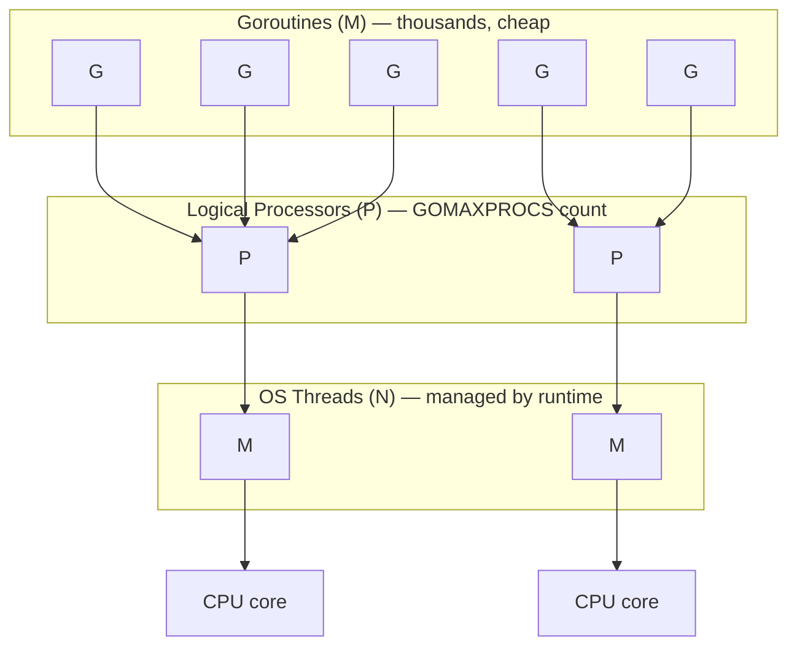

# Go for DevOps / Backend Engineers

Go is the default language of the infra ecosystem — Kubernetes, Docker, Terraform, Prometheus, etcd, containerd are all written in it. Understanding goroutines, channels, and context isn't optional if you're operating this stack; it's how you read source, debug panics, and write your own tooling (operators, CLI tools, exporters, controllers).

---

## Why Go for Infra Tooling

| Reason | Detail |
|--------|--------|
| Single static binary | No runtime/interpreter to ship — `COPY` binary into `scratch` or `alpine` |
| Fast compile | Seconds, not minutes — tight CLI/controller dev loop |
| Built-in concurrency | Goroutines + channels are language primitives, not a library bolted on |
| Small memory footprint | No JVM-style heap overhead — cheap to run thousands of instances (sidecars, controllers) |
| Strong stdlib | `net/http`, `context`, `encoding/json` cover 90% of infra tooling needs with zero deps |
| Cross-compilation | `GOOS=linux GOARCH=arm64 go build` — one toolchain, any target |
| This is why | Kubernetes, Docker, containerd, etcd, Terraform, Prometheus, Istio, Helm — all Go |

---

## Goroutines Fundamentals

A goroutine is a function running concurrently, scheduled by the Go runtime — not the OS. Starting one costs ~2KB of stack (grows on demand), vs ~1-8MB for an OS thread.

```go
go doSomething()          // starts, returns immediately — does NOT wait
```

### The M:N Scheduling Model

Go multiplexes **M** goroutines onto **N** OS threads, using **P** (processor) contexts to manage the mapping.



- **G** (goroutine): the unit of work — function + stack + program counter
- **M** (machine): an OS thread — actually executes code
- **P** (processor): holds the run queue of goroutines; count = `GOMAXPROCS`

The scheduler is **cooperative + preemptive**: goroutines yield at function calls, channel ops, syscalls, and (since Go 1.14) async preemption via signal at arbitrary points — so a tight CPU-bound loop with no function calls can no longer starve the scheduler indefinitely.

### GOMAXPROCS

```go
runtime.GOMAXPROCS(4)          // set explicitly
n := runtime.GOMAXPROCS(0)     // read current value, 0 = no change
```

```bash
GOMAXPROCS=4 ./myapp
```

Defaults to `runtime.NumCPU()` — the number of logical CPUs visible to the process. **In containers**, this used to over-count if it read host CPU count instead of the cgroup CPU quota, causing excessive OS thread creation and context-switch overhead. Go 1.5–1.24 do NOT read cgroup limits automatically for `GOMAXPROCS`; use [`uber-go/automaxprocs`](https://github.com/uber-go/automaxprocs) or set `GOMAXPROCS` explicitly to match the pod's CPU limit.

```go
import _ "go.uber.org/automaxprocs" // sets GOMAXPROCS = cgroup CPU quota on init
```

### Blocking Syscalls Don't Block Other Goroutines

When a goroutine makes a blocking syscall (file I/O, some cgo calls), the runtime detaches the M from its P and hands the P to another thread — so other goroutines keep running. Network I/O doesn't even block a thread: it uses the netpoller (epoll/kqueue under the hood), so thousands of goroutines can block on network reads using a handful of OS threads.

---

## Channels

A channel is a typed conduit for communication between goroutines — "don't communicate by sharing memory; share memory by communicating."

```go
ch := make(chan int)        // unbuffered
ch := make(chan int, 10)    // buffered, capacity 10
```

### Buffered vs Unbuffered

| | Unbuffered | Buffered |
|---|---|---|
| Send blocks until | a receiver is ready | buffer has space |
| Receive blocks until | a sender sends | buffer has an item |
| Synchronization | Full rendezvous (handoff) | Decoupled up to N items |
| Use case | Signaling, strict handoff | Smoothing bursts, work queues |

```go
unbuffered := make(chan int)
go func() { unbuffered <- 1 }()  // blocks until received
val := <-unbuffered              // unblocks the sender

buffered := make(chan int, 2)
buffered <- 1  // doesn't block — buffer has room
buffered <- 2  // doesn't block — buffer full now
buffered <- 3  // blocks — buffer full, no receiver yet
```

### Directional Channels

Restrict a channel to send-only or receive-only at compile time — makes intent explicit in function signatures.

```go
func producer(out chan<- int) {   // send-only
    out <- 42
}

func consumer(in <-chan int) {    // receive-only
    val := <-in
}

ch := make(chan int) // bidirectional
producer(ch)          // implicitly converts to chan<- int
consumer(ch)          // implicitly converts to <-chan int
```

### Nil Channel Behavior

| Operation | Nil channel | Closed channel |
|-----------|-------------|----------------|
| Send | Blocks forever | **Panics** |
| Receive | Blocks forever | Returns zero value immediately, `ok=false` |
| Close | **Panics** | **Panics** (double close) |

```go
var ch chan int          // nil
<-ch                     // blocks forever — useful to disable a select case
ch <- 1                  // blocks forever

close(ch)                // panic: close of nil channel
```

Nil channels are used deliberately in `select` to disable a case (see select section below).

### Closing Semantics

```go
ch := make(chan int, 3)
ch <- 1
ch <- 2
close(ch)

v, ok := <-ch   // 1, true
v, ok = <-ch    // 2, true
v, ok = <-ch    // 0, false  — channel closed and drained
```

**Rules:**
- Only the **sender** should close a channel — never the receiver.
- Closing signals "no more values" — it's a broadcast, all receivers see it.
- Sending on a closed channel panics: `panic: send on closed channel`.
- Closing an already-closed channel panics: `panic: close of closed channel`.
- Ranging over a channel exits automatically when it's closed and drained:

```go
for v := range ch {   // exits when ch is closed and empty
    fmt.Println(v)
}
```

---

## Select Statement

`select` blocks until one of its communication cases can proceed. If multiple are ready, one is chosen pseudo-randomly (fairness).

### Multi-way

```go
select {
case v := <-ch1:
    fmt.Println("from ch1:", v)
case v := <-ch2:
    fmt.Println("from ch2:", v)
case ch3 <- 42:
    fmt.Println("sent to ch3")
}
```

### Default Case (non-blocking)

```go
select {
case v := <-ch:
    fmt.Println("got", v)
default:
    fmt.Println("no value ready, moving on")
}
```

### Timeout Pattern

```go
select {
case res := <-resultCh:
    fmt.Println("result:", res)
case <-time.After(2 * time.Second):
    fmt.Println("timed out")
}
```

`time.After` allocates a new timer each call — for hot loops, prefer `time.NewTimer` + `defer timer.Stop()` to avoid leaking timers until they fire.

### Disabling a Case with Nil Channel

```go
var timeout <-chan time.Time
if useTimeout {
    timeout = time.After(5 * time.Second)
}
select {
case v := <-ch:
    handle(v)
case <-timeout:   // nil if useTimeout is false — this case never fires, never picked
    handleTimeout()
}
```

---

## Basic Error Handling Idioms

Go has no exceptions — errors are values, returned explicitly and checked explicitly.

```go
val, err := doSomething()
if err != nil {
    return err
}
```

### Error Wrapping with %w

`fmt.Errorf` with `%w` wraps an error, preserving the chain for later inspection.

```go
func readConfig(path string) error {
    data, err := os.ReadFile(path)
    if err != nil {
        return fmt.Errorf("reading config %s: %w", path, err)
    }
    return nil
}
// Printed: "reading config /etc/app.yaml: open /etc/app.yaml: no such file or directory"
```

### errors.Is / errors.As

```go
var ErrNotFound = errors.New("not found")

func lookup(id string) error {
    return fmt.Errorf("lookup %s: %w", id, ErrNotFound)
}

err := lookup("123")
if errors.Is(err, ErrNotFound) {   // walks the chain, unwraps each %w
    fmt.Println("was a not-found error")
}
```

`errors.As` extracts a concrete type from the chain:

```go
type ValidationError struct {
    Field string
}
func (e *ValidationError) Error() string { return "invalid field: " + e.Field }

var ve *ValidationError
if errors.As(err, &ve) {
    fmt.Println("bad field:", ve.Field)
}
```

### Custom Error Types

```go
type NotFoundError struct {
    Resource string
    ID       string
}

func (e *NotFoundError) Error() string {
    return fmt.Sprintf("%s %q not found", e.Resource, e.ID)
}

// Implement Unwrap to participate in errors.Is/As chains
type ConfigError struct {
    Path string
    Err  error
}
func (e *ConfigError) Error() string { return fmt.Sprintf("config %s: %v", e.Path, e.Err) }
func (e *ConfigError) Unwrap() error { return e.Err }
```

**Rule of thumb:** sentinel errors (`var ErrX = errors.New(...)`) for simple checks with `errors.Is`; custom struct types when the caller needs structured data (`errors.As`).

---

## Read Order

| File | Topics | Level |
|------|--------|-------|
| [go/README.md](./README.md) | This file — goroutines, channels, select, error idioms | SDE-1 |
| [go/concurrency.md](./concurrency.md) | Worker pool, fan-out/fan-in, pipeline, goroutine leaks, race detection | SDE-1/2 |
| [go/context.md](./context.md) | Cancellation propagation, errgroup, context in HTTP servers, common mistakes | SDE-1/2 |
| go/sync-primitives.md | Mutex/RWMutex, sync.WaitGroup, sync.Once, atomic, sync.Pool, sync.Map | SDE-2 |

**Read order:** README → concurrency → context → sync-primitives

---

## Go Concurrency vs Other Languages

| Aspect | Go (goroutines) | Java (threads) | Node.js (event loop) | Python (asyncio) |
|--------|-----------------|-----------------|----------------------|-------------------|
| Unit of concurrency | Goroutine (~2KB stack, grows) | OS/platform thread (~1MB stack) | Callback/Promise on single thread | Coroutine (`async def`) on single thread |
| Scheduling | M:N, runtime-managed, preemptible | 1:1 with OS threads (or virtual threads in Java 21+) | Cooperative, single-threaded event loop | Cooperative, single-threaded event loop |
| Parallelism | True parallelism across `GOMAXPROCS` cores | True parallelism across cores | None (single-threaded) — use worker_threads/cluster for CPU work | None (single-threaded) — use multiprocessing for CPU work |
| Blocking I/O | Non-blocking under the hood (netpoller); code looks synchronous | Blocks the thread (unless NIO/virtual threads) | Never blocks — everything is a callback/Promise | Blocks the event loop unless `await`-ed with async libs |
| Cost of 100k concurrent units | Cheap — a few hundred MB | Expensive/impossible — thread-per-request exhausts memory | Cheap — single loop, but no CPU parallelism | Cheap — single loop, but no CPU parallelism |
| Communication primitive | Channels (typed, blocking, closable) | Shared memory + locks, `BlockingQueue`, `CompletableFuture` | Callbacks, Promises, `async/await` | `asyncio.Queue`, `async/await` |
| Cancellation | `context.Context` propagated explicitly | `Thread.interrupt()` (cooperative, easy to miss) | `AbortController` | `Task.cancel()` (raises `CancelledError`) |
| CPU-bound work | Scales with `GOMAXPROCS`, no extra tooling | Scales with thread count | Needs worker_threads (separate V8 instances) | Needs multiprocessing (separate interpreters, GIL) |
| Mental model | "Just write sequential-looking code, use `go`" | "Manage a thread pool, watch for races/deadlocks" | "Everything is async; never block the loop" | "Everything is async; must `await` explicitly, GIL limits threads anyway" |

**Takeaway:** Go's model gives you thread-like true parallelism at goroutine-like (cheap) cost — this is the core reason it fits infra tooling (many concurrent watchers/reconcilers/connections) better than Node's single-threaded model or Java's heavier thread model.

---

## Quick Reference

```
Start concurrent work              → go f()
Synchronize handoff                → unbuffered channel
Smooth bursts / queue work         → buffered channel
Restrict API surface               → chan<- T / <-chan T
Disable a select case              → nil channel
Signal "no more work"              → close(ch)
Non-blocking check                 → select { ... default: }
Bound wait time                    → select { ... case <-time.After(d): }
Match host CPU quota in containers → automaxprocs or explicit GOMAXPROCS
Preserve error chain               → fmt.Errorf("...: %w", err)
Check for a specific error         → errors.Is(err, ErrX)
Extract structured error data      → errors.As(err, &target)
```
